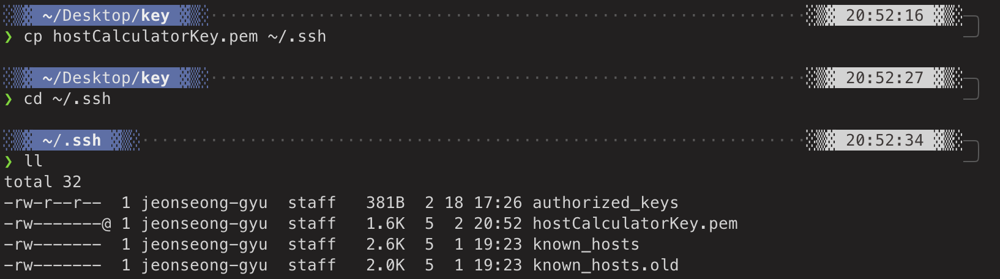
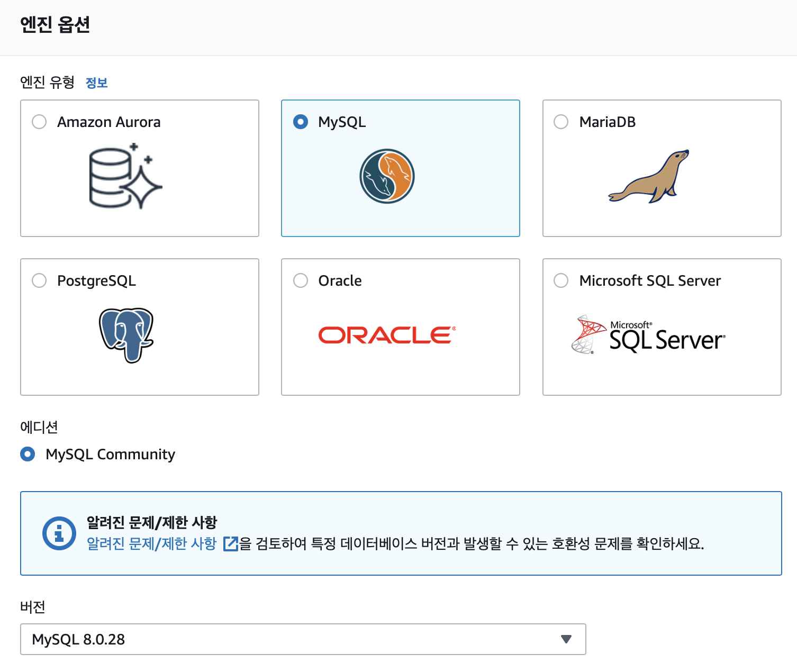
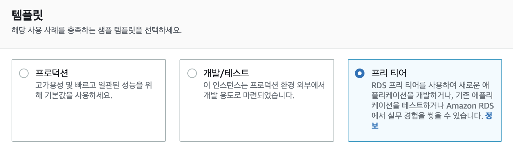

# Spring Boot 서버 배포
## AWS EC2 구축   
### AWS EC2 생성   
* `인스턴스 시작`을 클릭하여 생성 시작
  * 1단계: 사용하고자 하는 운영체제를 선택
    * Amazon Linux 2 AMI 선택
  * 2단계: 인스턴스 유형 선택
    * 프리티어 에서 사용 가능한 `t2.micro`선택
  * 3단계: 인스턴스 세부 정보 구성 
    * default로 두고 다음 단계로
  * 4단계: 저장 용량 설정
    * 프리티어는 최대 `30GB`까지 설정 가능
  * 5단계: 태크 추가
    * 다수의 인스턴스가 존재할 경우, 이를 구분하는 값 입력   
     
       
  * 6단계: 보안 그룹 생성
    * 해당 서버에 접속할 수 있는 IP를 설정
    * `SSH`, `22`포트는 해당 서버에 접속할 떄 사용
    * SSH란에 `접속을 허용하고자 하는 IP`를 추가  -> 내 IP
    * `HTTPS`, `HTTP`는 평소 사이트를 접속할 떄 사용하는 유형
      * 443, 80포트를 열어둔다.
  * 7단계: 인스턴스 시작 검토
* `키페어 생성`
  * 키페어를 통해 인스턴스 접근이 가능하므로, 잘 보관!!!
### 탄력적 IP
* EC2가 할당해준 IP는 고정이 아니며, 인스턴스가 새로 실행될 떄마다 새로 발급이 된다.
  * 인스턴스가 재기동 될때마다 IP가 새로 발급되면, 접속정보가 계속해서 변경이 되므로 도메인을 연결할 수 없다.
  * `고정(탄력적)IP를 할당하여, 생성한 EC2서버에 고정(탄력적)IP를 설정`
### EC2 인스턴스 접속
* 로컬 PC에서 외부 서버(EC2 인스턴스)에 SSH로 접속하고 위해선 매번 `ssh -i pem키 외부 IP`를 입력해야 한다. 
* 설정을 통한 손쉬운 접속
  * 인스턴스 생성시 다운받은 pem 파일을 `~/.ssh/`로 복사 
     
    
  * 복사한 pem 파일에 권한 변경(`chomd 600 본인 pem 파일 위치`) 
     
     
  * pem키 파일이 있는 ./ssh 디렉토리에 config 파일 생성(`vi config OR vim config`)
     ```
     # Host-Calculator
     Host host-calculator                             #본인이 원하는 이름#
          HostNmae                                    #탄력적 IP#
          User ec2-user
          IdentityFile ~/.ssh/hostCalculatorKey.pem   #~/.ssh/pem 키#
     ```
  * 생성한 config 파일을 통해 ssh 접속
    * `ssh host-calculator`
    * 공유키 충동이 발생할경우
      * `ssh-keygen -R 탄력적 IP
  * 서버의 패키지 도구인 `yum` 업데이트
    * `sudo yum update`

---
## AWS RDS 설정
### RED 생성





  

### 보안그룹 생성
* 보안 -> VPC 보안그룹 클릭, 보안그룹 페이지로 이동
* 검색으로 통해 이전에 만들어놓은 `EC2 인스턴스의 보안 그룹을 찾아서 그룹 ID를 복사(vpc-0fd2d21efc43446aa)`
* `보안그룹 생성`
### 로컬 PC에서 RDS 접근
* `엔트포인트`: 해당 DB의 호스트 주소


      


  