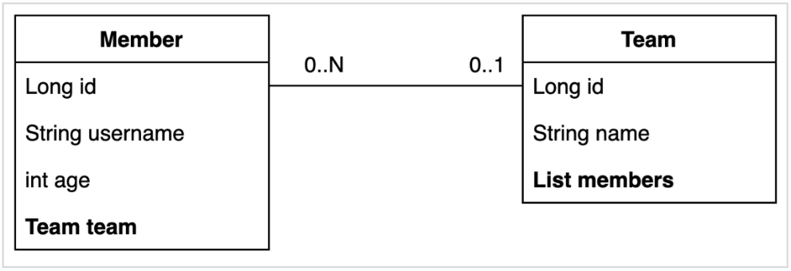
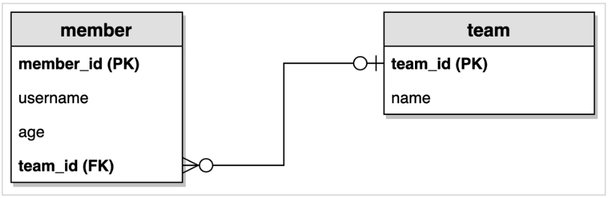
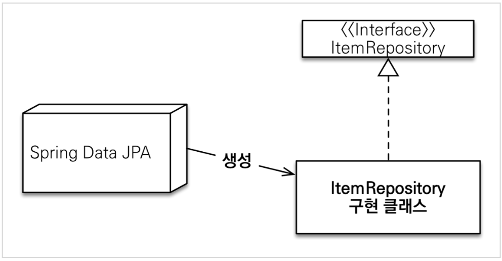
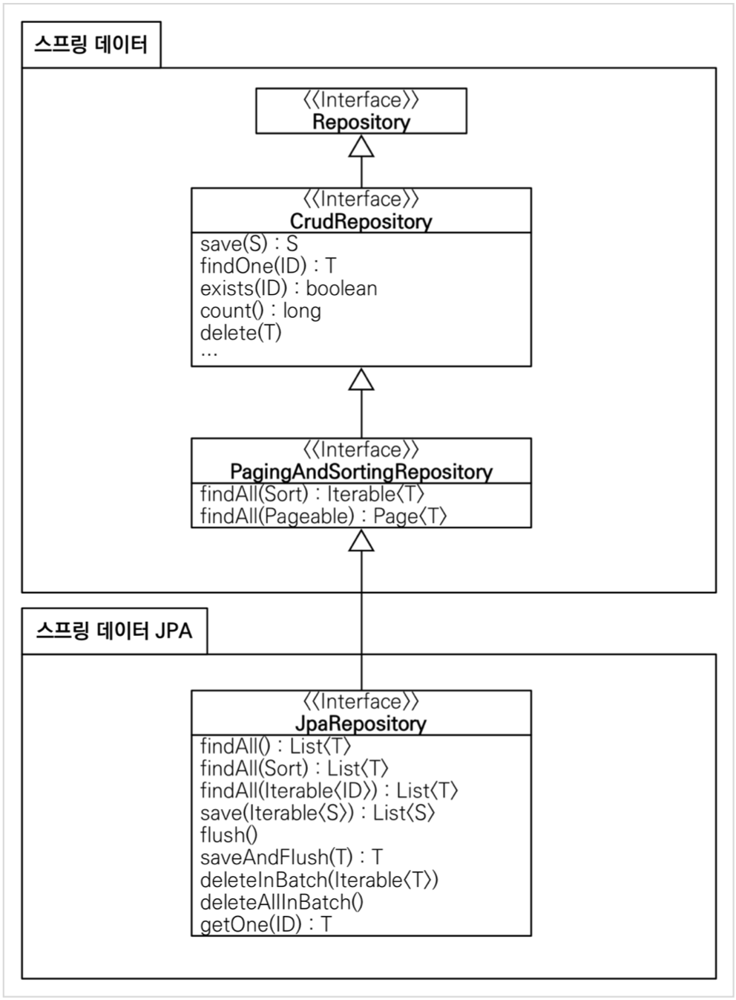

# _프로젝트 환경설정_

<br>

## _라이브러리 살펴보기_
* ### _gradle 의존관계 보기_
  * `./gradlew.dependencise --configuration compileClasspath`

<br>

* ### _스프링 부트 라이브러리 살펴보기_
  * spring-boot-starter-web
    * spirng-boot-starter-tomcat: 톰캣(웹서버)
    * spirng-webmvc: 스프링 웹 MVC
  * spring-boot-starter-data-jpa
    * spring-boot-starter-aop
    * spring-boot-starter-jdbc
      * HikariCP 커넥션 풀
    * hibernate + JPA
    * spring-data-jpa: 스프링 데이터 JPA
  * spring-boot-starter(공통): 스프링 부트 + 스프링 코어 + 로깅
    * spring-boot
      * spring-core
    * spring-boot-starter-logging
      * logback, slf4j

<br>

* ### _테스트 라이브러리_
  * spring-boot-starter-test
    * junit: 테스트 프레임워크, 스프링 부트 2.2부터 junit5(jupiter)사용
      * 과거 버전은 vintage
    * mockito: 목 라이브러리
    * assertj: 테스트 코드를 좀더 편하게 작성하게 도와주는 라이브러리
      * ` implementation 'com.github.gavlyukovskiy:p6spy-spring-boot-starter:1.8.0'`
    * sping-test: 스프링 통합 테스트 지원
  * 핵심 라이브러리
    * 스프링 MVC
    * 스프링 ORM
    * JPA, 하이버네이트
    * 스프링 데이터 JPA
  * 기타 라이브러리
    * H2 데이터베이스 클라이언트
    * 커넥션 풀: 부트 기본은 HikariCP
    * 로깅 SLF4J & LogBack
    * 테스트

<br>

## _H2 데이터베이스 설치_

<br>

* ### _개발이나 테스트 용도로 가볍고 편리한 DB, 웹 화면 제공_
  * 권한주기: `chmod 755 h2.sh`
  * 데이터베이스 파일 생성 방법
    * `jdbc:h2:~/datajpa`(최초 한번)
    * `~/datajpa.mv.db`파일 생성 확인
    * 이후 부터는 `jdbc:h2:tcp://localhost/~/datajpa`이렇게 접속

<br>

## _스프링 데이터 JPA와 DB 설정, 동작확인_
* ### _application.yml_
    ```yml
    spring:
        datasource:
            url: jdbc:h2:tcp://localhost/~/datajpa
            username: sa
            password:
            driver-class-name: org.h2.Driver
    
        jpa:
            hibernamte:
                ddl-auto: create
            properties:
                hibername:
                #show_sql: true
                format_sql: true

    logging.level:
        org.hibernate.SQL: debug
        #org.hibernate.type: trace
    ```
  * spring.jap.hibernate.ddl-auto: create
    * 이 옵션은 애플리케이션 실행 시점에 테이블을 drop 하고, 다시 생성한다
  * 참고
    >모든 로그 출력은 가급적 로거를 통해 남겨야 한다.    
    `show_sql` 옵션은 `System.out`에 하이버네이트 실행 SQL을 남긴다.   
    `org.hibernamte.SQL` 옵션은 logger를 통해 하이버네이트 실행 SQL을 남긴다.   

<br>
<br>
<br>

# _예제 도메인 모델_

<br>

## _예제 도메인 모델과 동작 확인_
* ### _엔티티 클래스_
    

<br>

* ### _ERD_
    

<br>

* ### _MemberEntity_
    ```Java
    @Entity
    @Getter
    @NoArgsConstructor(asscess = PROTECTED)
    @ToString(of = {"id", "username", "age"})
    public class Member {

        @Id
        @GeneratedValue(strategy = IDENTITY)
        @Column(name = "member_id")
        private Long id;
        private String username;
        private int age;

        @ManyToOne(fetch = LAZY)
        @JoinColumn(name = "team_id")
        private Team team;

        public Member(Stirng username) {
            this.username = username;
        }

        public Member(String username, int age) {
            this.username = username;
            this.age = age;
        }

        public Member(String username, int age, Team team) {
            this.username = username;
            this.age = age;
            if (team != null) {
                changeTeam(team);
            }
        }

        /*
        * 양방향 연관관계 편의 메서드
        */
        public void changeTeam(Team team) {
            this.team = team;
            team.getMembers().add(this);
        }
    }
    ```
  * 롬복 설명
    * @Setter: 실무에서는 가급적 Setter는 사용하지 않기
    * @NoArgsConstructor AccessLevel.PROTECTED: 기본 생성자를 막고싶은데, JPA 스펙상 PROTECTED로 열어두어야 한다.
    * @ToString은 가급적 내부 필드만(연관관계 없는 필드)
  * `changeTeam()`으로 양방향 연관관계 한번에 처리(연관관계 편의 메서드)

<br>

* ### _TeamEntity_
    ```Java
    @Entity
    @Getter
    @NoArgsConstructor(access = PROTECTED)
    @ToString(of = {"id", "name"})
    public class Team {

        @Id
        @GeneratedValue(strategy = IDENTITY)
        @Column(name = "team_id")
        private Long id;
        private String name;

        @OneToMany(mappedBy = "team")
        private List<Member> members = new ArrayList<>();

        public Team(String name) {
            this.name = name;
        }
    }
    ``` 
  * Member와 Team은 양방향 연관관계, `Member.team`이 연관관계의 주인, `Team.members`는 연관관계의 주인이 아니다. 따라서 `Member.team`이 데이터베이스 외래키 값을 변경, 반대편은 읽기만 간능

<br>

* ### _TestCode_
    ```Java
    @SpringBootTest
    public class MemberTest {

        @PersistneceContext
        EntityManager entityManager;

        @Test
        @Transactional
        @Rollback(false)
        void testEntity() {
            Team teamA = new Team("teamA");
            Team teamB = new Team("teamB");

            entityManger.persist(teamA);
            entityManger.persist(teamB);

            Member member1 = new Member("member1", 10, teamA);
            Member member2 = new Member("member2", 20, teamA);
            Member member3 = new Member("member3", 30, teamB);
            Member member4 = new Member("member4", 40, teamB);

            entityManger.persist(member1);
            entityManger.persist(member2);
            entityManger.persist(member3);
            entityManger.persist(member4);

            //초기화
            entityManger.flush();
            entityManger.clear();

            //확인
            List<Member> members = entityManger.createQuery("select m from Member m", Member.class)
                    .getResultList();

            for (Member member : members) {
                System.out.println("member = " + member);
                System.out.println("-> member.team = " + member.getTeam());
            }
        }
    }
    ```

<br>
<br>
<br>

# _공통 인터페이스 기능_
  * 순수 JPA 기반 리포지토리 만들기
  * 스프링 데이터 JPA 공통 인터페이스 소개 
  * 스프링 데이터 JPA 공통 인터페이스 활용

<br>

## _순수 JPA 기반 리포지토리 만들기_
* ### _기본 CRUD_
  * 저장
  * 변경 -> 변경감지 사용
  * 삭제
  * 전체 조회
  * 단건 조회
  * 카운트
  * 참고
    >JPA에서 수정은 변경감지 기능을 사용하면 된다.   
    트랜잭션 안에서 엔티티를 조회한 다음에 데이터를 변경하면, 트랜잭션 종료 시점에 변경감지 기능이 작동해서 변경된 엔티티를 감지하고 UPDATE SQL을 실행한다. 

<br>

* ### _MemberJapRepository_
    ```Java
    @Repository
    @RequiredArgsConstructor
    public class MemberJpaRepository {

        private final EntityManger entityManger;

        public Long save(Member member) {
            entityManager.persist(member);

            return member.getId();
        }

        public void delete(Member member) {
            entityManager.remove(member);
        }

        public List<Member> findAll() {
            return entityManager.createQuery("select m from Member m", Member.class)
                    .getResultList();
        }

        public Optional<Member> findById(Long id) {
            Member member = entityManger.find(Member.class, id);

            return Optional.ofNullable(member);
        }

        public Member find(Long id) {
            return entityManger.find(Member.class, id);
        }

        public long count() {
            return entityManger.createQuery("select count(m) from Member m", Long.class)
                .getSingleResult();
        }   
    }
    ```

<br>

* ### _TeamJpaRepository_
    ```Java
    @Repository
    @RequiredArgsConstructor
    public class TeamJpaRespoitory {

        private final EntityManager entityManger;

        public Long save(Team team) {
            entityManger.persist(team)

            return team.getId();
        }

        public void delete(Team team) {
            entityManger.remove(Team team);
        }

        public List<Team> findAll() {
            return entityManger.createQuery("select t from Team f", Team.class)
                    .getResultList();
        }

        public Optional<Team> findById(Long id) {
            Team team = entityManger.find(Team.class, id);

            return Optional.ofNullable(team);
        }

        public Team find(Long id) {
            return entityManager.find(Team.class, id);
        }

        public long count() {
            return entityManger.createQuery("select count(t) from Team t", Long.class)
                    .getSingleResult();
        }

    }
    ```

<br>

* ### _TestCode_
    ```Java
    @SpringBootTest
    @Transactional
    public class memberJpaRepositoryTest {

        @Autowired
        MemberJpaRepository memberJpaRepository;

        @Test
        void testMember() {
            Member member = new Member("memberA");
            Long savedMemberId = memberJpaRepository.save(member);

            Member findMember = memberJpaRepository.find(savedMemberId);

            assertThat(findMember.getId()).isEqualTo(member.getId());
            assertThat(findMember.getUsername()).isEqualTo(member.getUsername());

            assertThat(findMember).isEqualTo(member);  //JPA 엔티티 동일성 보장
        }

        @Test
        void basicCRUD() {
            Member member1 = new Member("member1");
            Member member2 = new Member("member2");

            memberJpaRepository.save(member1);
            memberJpaRepository.save(member2);

            //단건 조회 검증
            Member findMember1 = memberjpaRepository.findById(member1.getId()).get();
            Member findMember2 = memberjpaRepository.findById(member2.getId()).get();

            assertThat(findMember1).isEqualTo(member1);
            assertThat(findMember2).isEqualTo(member2);

            //리스트 조회 검증
            List<Member> all = memberJpaRepository.findAll();
            assertThat(all.size()).isEqualTo(2);

            //삭제 검증
            memberJpaRepository.delete(member1);
            memberJpaRepository.delete(member2);

            long deleteCount = memberJpaRepository.count();
            assertThat(deleteCount).isEqualTo(0);
        }
    }
    ```
  * 기본 CRUD를 검증한다.

<br>

## _공통 인터페이스 설정_
* ### _JavaConfig 설정 - 스프링 부트 사용시 생략 가능_
    ```Java
    @Configuration
    @EnableJpaRepositories(basePackages = "jpabook.jpashop.repositroy")
    public class AppConfig{}
    ```
  * 스프링 부트 사용시 `@SpringBootApplication`위치를 지정(해당 패키지와 하위 패키지 인식)
  * 만약 위치가 달라지면 `@EnableJpaRepositries`필요

<br>

* ### _스프링 데이터 JPA가 구현 클래스 대신 생성_
    
  * `org.springframework.data.repository.Repository`를 구현한 클래스는 스캔 대상
    * MemberRepository 인터페이스가 동작하는 이유
    * 실제 출력해보기(Proxy)
    * memberRepository.getClass() -> class com.sun.proxyXXX
  * `@Repository` 애노테이션 생량 가능
    * 컴포넌트 스캔을 스프링 데이터 JPA가 자동으로 처리
    * JPA 예외를 스프링 예외로 변환하는 과정도 자동으로 처리

<br>

## _공통 인터페이스 적용_   
순수한 JPA로 구현한 `MemberJpaRepository` 대신에 스프링 데이터 JPA가 제공하는 공통 인터페이스 사용   

<br>

* ### _스프링 데이터 JPA 기반 MemberRepository_
    ```Java
    public interface MemberRepository extends JpaRepository<Member, Long> {}
    ```
  * Generic
    * T: 엔티티 타입
    * ID: 식별자 타임(PK)

<br>

* ### _MemberRepositoryTest_
    ```Java
    @SpringBootTest
    @Transactional
    public class MemberRepository {

        @Autowired
        MemberRepository memberRepository;

        @Test
        void testMember() {
            //given
            Member member = new Member("memberA");
            Long savedMember = memberRepository.save(member);

            //when
            Member findMember = memberRepository.findById(savedMember.getId()).get();

            //then
            assertThat(findMember.getId()).isEqualTo(member.getId());
            assertThat(findMember.getUsername()).isEqualTo(member.getUsername());
            assertThat(findMember).isEqualTo(member); //JPA 엔티티 동일성 보장
        }

        @Test
        void basicCRUD() {
            //given
            Member member1 = new Member("member1");
            Member member2 = new Member("member2");

            memberRepository.save(member1);
            memberRepository.save(member1);

            //단건 조회 검증
            Member findMember1 = memberRepository.findById(member1.getId()).get();
            Member findMember2 = memberRepository.findById(member2.getId()).get();

            assertThat(findMember1).isEqualTo(member1);
            assertThat(findMember2).isEqualTo(member2);

            //리스트 조회 검증
            List<Member> all =  memberRepository.findAll();
            assertThat(all.size()).isEqualTo(2);

            //카운트 검증
            long count = memberRepository.count();
            assertThat(count).isEqualTo(2);

            //삭제 검증
            memberRepository.delete(member1);
            memberRepository.delete(member2);

            assertThat(memberRepository.count()).isEqualTo(0);
        }
    }
    ```
  * 기존 순수 JPA기반 테스트에서 사용했던 코드를 그대로 스프링 데이터 JPA 리포지토리 기반 테스트로 변경해도 동일한 방식으로 동작
  
<br>

* ### _TeamRepository 생성_
    ```Java
    public interface TeamRepository extends JpaRepository<Team, Long>{}
    ```

<br>

## _공통 인터페이스 분석_
* JpaRepository 인터페이스: 공통 CRUD 제공
* 제네릭은 `<엔티티 타임, 식별자 타입>` 설정
* `JpaRepository` 공통 기능 인터페이스
    ```Java
    public interface JpaRepository<T, ID extends Serializable> extends PagingAndSortingRepository<T, ID>{
        ...
    }
    ```
* `JpaRepository`를 사용하는 인터페이스 
    ```Java
    public interface MemberRepository extends JpaRepository<Member, Long>{}
    ```

<br>

* ### _공통 인터페이스 구성_
    

<br>

* ### _주의_
  * `T findOne(ID)` -> `Optional<T> findById(ID)` 변경

<br>

* ### _제네릭 타입_
  * `T`: 엔티티
  * `ID`: 엔티티의 식별자 타입
  * `S`: 엔티티와 그 자식 타입

<br>

* ### _주요 메서드_
  * `save(S)`: 새로운 엔티티를 저장하고 이미 있는 엔티티는 병합한다.
  * `delete(T)`: 엔티티 하나를 삭제한다. 내부에서 `EntityManager.remove()`호출
  * `findById(ID)`: 엔티티 하나를 조회한다. 내부에서 `EntityManger.find()`호출
  * `getOnd(ID)`: 엔티티를 프록시로 조회한다. 내부에서 `EntityManger.getRegerence()`호출
  * `findAll(...)`: 모든 엔티티를 조회한다. 정렬(`Sort`)이나 페이징(`Pageable`)조건을 파라미터로 제공할 수 있다.
  * 참고
    >`JpaRepository`는 대부분의 공통 메서드를 제공한다. 

<br>
<br>
<br>

# _쿼리 메소드 기능_
  * `쿼리 메서드 기능 3가지`
    * 메서드 이름으로 쿼리 생성
    * 메서드 이름으로 JPA NamedQuery 호출
    * `@Query`어노테이션을 사용해서 리퍼지토리 인터페이스에 쿼리 직접 정의

<br>

## _메소드 이름으로 쿼리 생성_   
메서드 이름으로 분석해서 JPQL 쿼리 실행   
이름과 나이를 기준으로 회원을 조회하려면?   

<br>

* ### _순수 JPA Repository_
    ```Java
    @Repository
    @RequiredArgsConstructor
    public class MemberJpaRepository {

        private final EntityManager entityManager;

        public List<Member> findByUsernameAndAgeGreaterThan(String username, int age) {
            return entityManager.createQuery("select m from Member m where m.username = :username and m.age > :age", Member.class)
                    .setParameter("username", username);
                    .setParameter("age", age);
                    .getResultList();
        }
    }
    ```

<br>

* ### _순수 JPA TestCode_
    ```Java
    @SpringBootTest
    @Transactional
    public class MemberJpaRepositoryTest {

        @Test
        void findUsernameAndAgeGreaterThan() {
            //given
            Member member1 = new Member("AAA", 10);
            Member member2 = new Member("AAA", 20);

            memberJpaRepository.save(member1);
            memberJpaRepository.save(member2);

            //when
            List<Member> result = memberJpaRepository.findByUsernameAndAgeGreaterThan("AAA", 9);

            //then
            assertThat(result.get(0).getUsername()).isEqualTo("AAA");
            assertThat(result.get(0).getAge()).isEqualTo(10);
            assertThat(result.size()).isEqualTo(1);
        }
    }
    ```

<br>

* ### _스프링 데이터 JPA_
    ```Java
    public interface MemberRepositroy extends JpaRepository<Member, Long> {

        List<Member> findByUsernameAndAgeGreaterThan(String username, int age);
    }
    ```
  * 스프링 데이터 JPA는 메소드 이름을 분석해서 JPQL을 생성하고 실행

<br>

* ### 쿼리 메서드 필터 조건
  * [스프링 데이터 JPA 공식 문서 참고](https://docs.spring.io/spring-data/jpa/docs/current/reference/html/#jpa.query-methods.query-creation)

<br>

* ### _스프링 데이터 JPA가 제공하는 쿼리 메서드 기능_
  * [조회: find...By, read...By, query...By get...By,](https://docs.spring.io/spring-data/jpa/docs/current/reference/html/#repositories.query-methods.query-creation)
    * 예) findHelloBy 처럼 ...에 식별하기 위한 내용(설명)이 들어가도 된다.
  * COUNT: count...By 반환타입 `long`
  * EXISTS: exists...By 반환타입 `boolean`
  * 삭제: delete....By, remove...By 반환타입 `long`
  * DISTINCT: findDistinct, findMemberDistinctBy
  * [LIMIT: findFirst, findTop, findTop3](https://docs.spring.io/spring-data/jpa/docs/current/reference/html/#repositories.limit-query-result)
  * 참고
    >이 기능은 엔티티의 필드명이 변경되면 인터페이스에 정의한 메서드 이름도 꼭 함께 변경해야 한다.   
    그렇지 않으면 애플리케이션을 시작하는 시점에 오류가 발생한다.   
    이렇게 애플리케이션 로딩 시점에 오류를 인지할 수 있는 것이 스프링 데이터 JPA의 매우 큰 장점이다.    

<br>

## _JPA NamedQuery_
* JPA의 NamedQuery를 호출할 수 있다.
* `@NamedQuery` 어노테이션으로 Named쿼리 정의
    ```Java
    @Entity
    @NamedQuery(
            name = "Member.findByUsername",
            query = "select m from Member m where = :username")
    public class Member {

        ...
    }
    ```

<br>

* ### _JPA를 직접 사용해서 NamedQuery 호출_
    ```Java
    @Repository
    @RequiredArgsConstructor
    public class MemberJapRepository {

        public List<Member> findByUsername(String username) {
            return entityManager.createNamedQuery("Member.findByUsername", Member.classs)
                    .setParameter("username", username)
                    .getResultList();
        }
    }
    ```

<br>

* ### _스프링 데이터 JPA로 NamedQuery 사용_
    ```Java
    @Query(name = "Member.findByUersname")
    List<Member> findByUsername(@Param("username") String username);
    ```
  * `@Query`를 생량하고 메서드 이름으로만 Named 쿼리를 호출할 수 있다.

<br>

* ### _스프링 데이터 JPA로 Named 쿼리 호출_
    ```Java
    public interface MemberRepository extends JpaRepository<Member, Long> { /* 여기 선언한 Member 도메인 클래스 */

        List<Member> findByUersname(@Param("username") String username);
    }
    ```
  * 스프링 데이터 JPA는 선언한 `"도메인 클래스 + .(점) + 메서드 이름"`으로 Named 쿼리를 찾아서 실행
  * 만약 실행할 Named 쿼리가 없으면 메서드 이름으로 쿼리 생성 전략을 사용한다.
  * 필요하면 전략을 변경할 수 있지만 권장하지 않는다.
    * [참고](https://docs.spring.io/spring-data/jpa/docs/current/reference/html/#repositories.query-methods.query-lookup-strategies)
    * 참고
      >스프링 데이터 JPA를 사용하면 실무에서 Named Query를 직접 등록해서 사요하는 일은 드물다.   
      대신 `@Query`를 사용해서 리퍼지토리 메소드에 쿼리를 직접 정의한다.    

<br>

## _@Query, 리포지토리 메소드에 쿼리 정의하기_
* ### _메서드에 JPQL 쿼리 작성_
    ```Java
    public interface MemberRepository extends JpaRepositroy<Member, Long> {

        @Query("select m from Member m where m.username = :username and m.age = :age")
        List<Member> findUser(@Param("username") String username, @Param("age") int age);
    }
    ```
  * `@org.springframework.data.jpa.repository.Query`어노테이션을 사용
  * 실행할 메서드에 정적 쿼리를 직접 작성하므로 이름 없는 Named 쿼리라 할 수 있음.
  * JPA Named 쿼리처럼 애플리케이션 실행 시점에 문법 오류를 발견할 수 있다(매우 큰 장점)
  * 참고
    >실무에서는 메서드 이름으로 쿼리 생성 기능은 파라미터가 증가하면 매서드 이름이 매우 지저분해진다.   
    따라서 `@Query`기능을 자주 사용하게 된다.    

<br>

## _@Query, 값, DTO 조회하기_
* ### _단순히 값 하나를 조회_
    ```Java
    public interface MemberRepository extends JpaRepositroy<Member, Long> {

        @Query("select m.username from Member m")
        List<String> findUsernameList();
    }
    ```
  * JPA 값 타임(`@Embedded`)도 이 방식으로 조회할 수 있다.

<br>

* ### _DTO로 직접 조회_
    ```Java
    public interface MemberRepository extends JpaRepository<Member, Long> {

        @Query("select new data.datajpa.dto.MemberDto(m.id, m.username, t.name)" +
                " from Member m join m.team t")
        List<MemberDto> findMemberDto();
    }
    ```
  * 주의!
    >DTO로 직접 조회 하려면 JPA의 `new`명령어를 사용해야 한다.   
    그리고 다음와 같이 생성자가 맞는 DTO가 필요하다(JPA와 사용방식이 동일하다.)   
    
    ```Java
    @Data
    public class MemberDto {

        private Long id;
        private String username;
        private String teamName;

        public MemberDto(Long id, String username, String teamName) {
            this.id = id;
            this.username = username;
            this.teamName = teamName;
        }
    }
    ```
<br>

## _파라미터 바인딩_
* 위치 기반
* 이름 기반
    ```Java
    select m from Member m where m.username = ?0 //위치 기반
    select m from Member m where m.username = :name //이름 기반
    ```

<br>

* ### _파라미터 바인딩_
    ```Java
    public interface MemberRepositroy extends JpaRepositroy<Member Long> {

        @Query("select m from Member m where m.username = :username")
        List<Member> findMembers(@Param("username") String username);
    }
    ```
  * 참고
    >코드 가동성과 유지보수를 위해 이름 기반 파라미터 바인딩을 사용하자.   
    위치기반은 순서 실수가 바꾸면...

<br>

* ### _컬렉션 파라미터 바인딩_
    ```Java
    public interface MemberRepository extends JpaRepository<Member, Long> {

        @Query("select m from Member where m.username in :names")
        List<Member> findByNames(@Param("names") List<String> names);
    }
    ```
<br> 

## _반환 타입_
* ### _스프링 데이터 JPA는 유연한 반환 타입 지원_
    ```Java
    List<Member> findListByUsername(String name); //컬렉션
    Member findMemberByUsername(String name); //단건
    Optional<Member> findOptionalByUsername(String name); //단건 Optional
    ```
  * [스프링 데이터 JPA 공식 문서](https://docs.spring.io/spring-data/jpa/docs/current/reference/html/#repository-query-return-types)

* ### _TestCode_  
    ```Java
    @Test
    void returnType() {
        //given
        Member member = new Member("Jeon", 29);
        memberRepository.save(member);

        //when
        List<Member> findList = memberRepository.findListByUsername("없는 회원 이름");
        Member findMember = memberRepository.findMemberByUsername("없는 회원 이름");
        Optional<Member> findOptional = memberRepository.findOptrionalByUsername("없는 회원 이름");

        //then
        assertThat(findList.size()).isEqualTo(0);
        assertThat(findMember).isEqualTo(null);
        assertThat(findOptional).isEqualTo(Optional.empty());
    }
    ```
  
<br>

* ### _조회 결과가 많거나 없으면?_
  * 컬렉션
    * 결과 없음: 빈 컬렉션 반환
  * 단건 조회
    * 결과가 없음: `null` 반환
    * 결과 2건 이상: `javax.persistence.NonUniqueResultException` 예외 발생
  * 참고
    >단건으로 지정한 메서드를 호출하면 스프링 테이터 JPA는 내부에서 JPQL의 `Query.getSingleResult()`메서드를 호출한다.   
    이 메서드를 호출했을 때 조회 결과가 없으면 `javax.persistence.NoRewultException`예외가 발생하는데 개발자 입장에서는 다루기가 상당히 불편하다.   
    스프링 데이터 JPA는 단건을 조회할 때 이 예외가 발생하면 예외를 무시하고 대신에 `null`을 반환한다.    

<br>

## _순수 JPA 페이징과 정렬_   
JPA에서 페이징을 어떻게 할 것인가?   
다음 조건으로 페이징과 정렬을 사용하는 예제 코드를 보자.   
* 검색 조건: 나이가 10살
* 정렬 조건: 이름으로 내림 차순
* 페이징 조건: 첫 번째 페이지, 페이지당 보여줄 데이터는 3건

<br>

* ### _JPA페이징 리포지토리 코드_
    ```Java
    @Repositroy
    @RequiredArgeConstructor
    @Transaction(readOnly = true)
    public class MemberJpaRepository {

        public List<Member> findByPage(int age, int offset, int limit) {
            return entityManager.createQuery("select m from Member where m.age = :age order by m.username desc", Member.class)
                    .setParameter("age", age)
                    .setFristResult(offset)
                    .setMaxResult(limit)
                    .getResultList();
        }

        public long totalCount(int age) {
            return entityManager.createQuert("select count(m) from Member m where m.age = :age", Long.class)
                    .setParameger("age", age)
                    .getSingleResult();
        }
    }
    ```

<br>

* ### _JPA 페이징 테스트 코드_
    ```Java
    @Test
    void paging() throws Exception {
        //given
        memberJpaRepository.save(new Member("member1", 10));
        memberJpaRepository.save(new Member("member2", 10));
        memberJpaRepository.save(new Member("member3", 10));
        memberJpaRepository.save(new Member("member4", 10));

        int age = 10;
        int offset = 0;
        int limit = 3;

        //when
        List<Member> members = memberJpaRespoistory.findByPage(age, offset, limit);
        long totalCount = memberJpaRepository.totalCount(age);

        //페이지 계산 공식 적용...
        //totalPage = totalCount / size ...
        //마지막 페이지...
        //최초 페이지...

        //then
        assertThat(members.size()).isEqualTo(3);
        assertThat(totalCount).isEqualTo(5); 
    }
    ```

<br>

## _스프링 데이터 JPA 페이징과 정렬_

<br>

## _벌크성 수정 쿼리_

<br>

## _@EntityGraph_

<br>

## _JPA Hint & Lock_

<br>
<br>
<br>

# _확장 기능_

<br>

## _사용자 정의 리포지토리 구현_

<br>

## _Auditing_

<br>

## _Web확장 - 도메인 클래스 컨버터_

<br>

## _Web확장 - 페이징과 정렬_

<br>
<br>
<br>

# _스프링 데이터 JPA 분석_

<br>

## _스프링 데이터 JPA 구현체 분석_

<br>

## _새로운 엔티티를 구별하는 방법_

<br>
<br>
<br>

# _나머지 기능들_

<br>

## _Sepcifications(명세)_

<br>

## _Query By Example_

<br>

## _Projections_

<br>

## _네이티브 쿼리_


