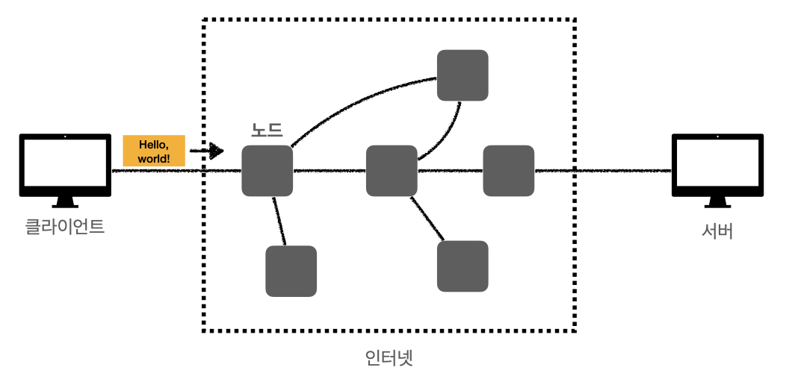
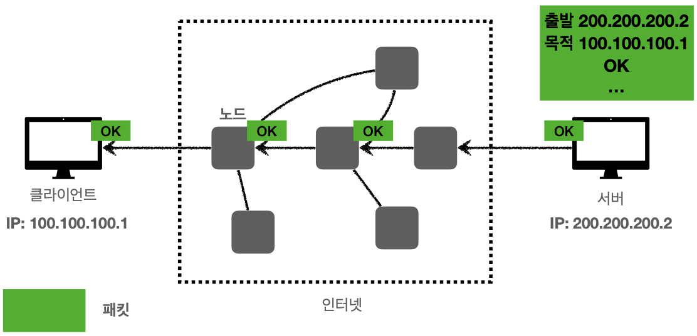
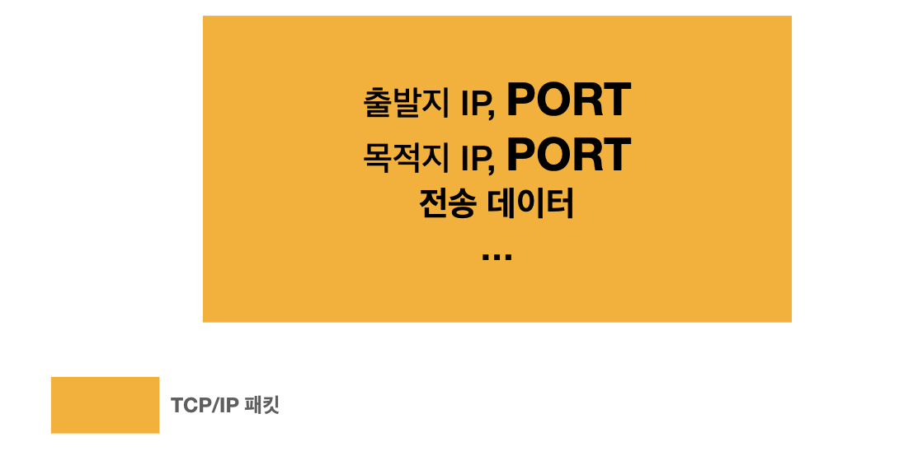
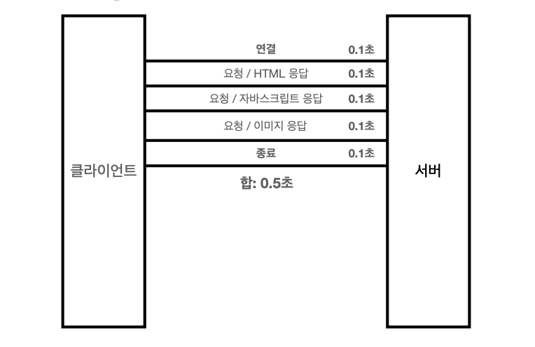
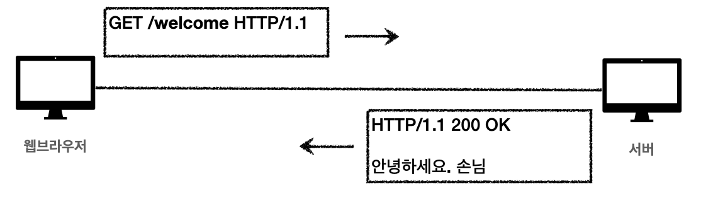
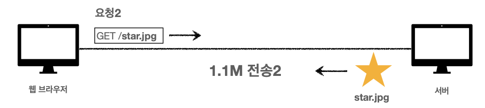
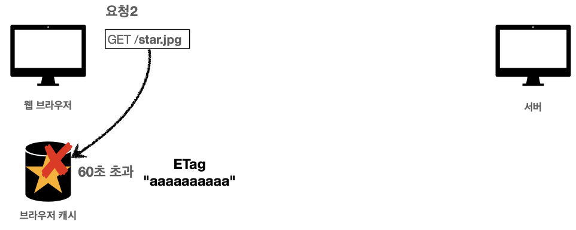

* ### 인터넷 네트워크
* #### 인터넷 통신
  * ##### 인터넷에서 컴퓨터 둘은 어떻게 통신할까?
     
    
  * ##### 인터넷
      
  * ##### 복잡한 인터넷 망
      
       
* #### IP(Internet Protocol)
  * ##### IP 주소 부여
     
    * `IP Protocol`
      * 송신 호스트와 수신 호스트가 패킷 교환 네트워크에서 정보를 주고 받는데 사용하는 정보 위주의 규약
  * ##### IP(인터넷 프로토콜 역할)
    * 지정한 IP주소(IP Address)에 데이터 전달
    * `패킷`(Packet)이라는 통신 단위로 데이터 전달
  * ##### IP 패킷 정보
     
    * 출발지 IP, 목적지 IP, ... 정보를 가지고 있다.
  * ##### 클라이언트 패킷 전달
      
  * ##### 서버 패킷 전달
     
  * ##### IP 프로토콜의 한계
    * `비 연결성`
      * 패킷을 받을 대상이 없거나 서비스 불능 상태여도 패킷 전송
         
        
    * `비 신뢰성`
      * 중간에 패킷이 사라지면?
         
      * 패킷이 순서대로 안오면?
         
    * `프로그램 구분`
      * 같은 IP를 사용하는 서버에서 통신하는 애플리케이션이 둘 이상이면?
* #### TCP, UDP
  * ##### 인터넷 프로토콜 스택의 4계층
    
  * ##### 프로토콜 계층
    
  * ##### IP 패킷 정보
    
  * ##### TCP/IP 패킷 정보
     
  * ##### TCP의 특징
    * `전송 제어 프로토콜(Transmission Control Protocol)`
    * 연결 지향
      * 클라이언트와 서버가 연결이 되있는지 모르는 상태에서 일단 연결을 하고 메세지를 보낸다
        * 논리적인 접속을 성립하기 위함
      * `TCP 3 way handshake(가상 연결)`
         
        * 개념적으로만 서버와 클라이언트간에 연결이 되어있는 상태를 의미한다
        * 클라이언트와 서버버 사이에 수많은 서버(노드)들은 클라이언트와 목적 서버가 연결됐는지 알수 없다.
        * connect(연결 과정)
          1. 클라이언트가 서버에 `SYN`(접속 요청)을 보낸다
          2. 클라리언트가 보낸 `SYN`을 받은 서버는 `SYN + ACK`(요청 수락)을 클라이언트에게 보낸다
          3. 서버로부터 `SYN + ACK`를 받은 클라이언트는 연결이 됐을음 확인하고 다시 서버에게 `ACK`를 보낸 후 데이터를 전송하기 시작한다
             * 마지막 과정에서 ACK와 함께 데이터 전송이 가능하다  
    * 데이터 전달 보증
      * 패킷이 중간에 누락된 상황이 발생했을 경우 알 수 있다.
         
    * 순서 보장
          
    * 신회할 수 있는 프로토콜
    * 현재는 대부분 TCP 사용
  * ##### UDP의 특징
    * `사용자 데이터그램 프로토콜(User Datagram Protocol)`
    * 하얀 도화지에 비유(기능이 거의 없음)
      * 애플리케이션에 추가 작업 필요
    * 연결지향 - TCP 3 way handshake X
    * 데이터 전달 보증 X
    * 순서 보장 X
    * 데이터 전달 및 순서가 보장되지 않지만, `단순하고 빠름`
    * 정리
      * `IP와 거의 같다` + `PORT` + `체크섬` 정도만 추가
      * 체크섬
        * 중복 검사의 한 형태
        * 오류 정정을 통해 공간이나 시간 속에서 송신된 자료의 무결정을 보호하는 단순한 방법
* #### PORT
  * ##### 한번에 둘 이상 연결해야 하면?
    
    * 하나의 클라이언트PC가 여러개의 서버와 통신하는 상황
      * 클라이언트 IP로 여러개의 패킷들이 들어온다
      * 어디서 사용하듣 패킷인지 구분할 수 없다
  * ##### TCP/IP 패킷 정보
     
    * IP: `목적지 서버를 찾는 용도`
    * PORT: `목적지 서버안에서 돌아가는 애플리케이션(프로세스)을 구분하는 용도`
  * ##### 패킷 정보
        
  * ##### PORT - 같은 IP 내에서 프로세스 구분
       
    * 0 ~ 65535 할당 가능
    * 0 ~ 1023: 잘 알려진 포트, 사용하지 않는 것이 좋음
      * FTP: 20, 21
      * TELNET: 23
      * HTTP: 80
      * HTTPS: 443
* #### DNS
  * ##### IP는 기억하기 어렵다
     
  * ##### IP는 변경될 수 있다.
     
  * ##### DNS(Domain Name System)
     
    * 전화번호부 같은 서버를 제공
    * Domain Name을 등록하고 그것을 IP 주소로 변환
* ### URI와 웹 브라우저 요청 흐름
* #### URI(Uniform Resource Identifier)
  * URI는 Resource를 식별한다
  * URI는 로케이터(Locator), 이름(Name), 또는 둘 다 추가로 분류될 수 있다.
    
    
  * ##### URI 단어의 뜻
    * Uniform: 리소스를 식별하는 통일된 방식
    * Resource: 자원, URI로 식별할 수 있는 모든 것(제한 없음)
    * Identifier: 다른 항목과구분하는데 필요한 정보
  * ##### URL, URN 단어의 뜼
    * `URL`: Uniform Resource Locator
      * `Locator`: 리소스가 있는 위치를 지정
    * `URN`: Uniform Resource Name
      * `Name`: 리소스에 이름을 부여
    * 위치는 변할 수 있지만, 이름은 변하지 않는다
      ```
      urn: isbn:896077731(어떤 책의 isbn URN)
      ``` 
      * URN 이름만으로 실제 리소스를 찾을 수 잇는 방법이 보편화 되지 않음
      * 중간에 이름을 집어 넣으면 그 리소스의 결과가 나와야하는데 Mapping이 굉장이 어려운 사안이라 URN은 거의 사용하지 않는다 
  * ##### URL 전체 문법
    ```
    scheme://[userinfo@]host[:port][/path][?query][#fragment]
    https://www.google.com:443/search?q=hello&hl=ko
    ``` 
    * 프로토콜(https)
    * 호스트명(www.google.com)
    * 포트 번호(443)
    * 패스(/search)
    * 쿼리 파라미터(q=hello&hl=ko)
    * ##### scheme
      * `scheme`: //[userinfo@]host[:port][/path][?query][#fragment]
        `https`: //www.google.com:443/search?q=hello&hl=ko
      * 주로 프로토콜 사용
      * 프로토콜: 어떤 방식으로 자원에 접근할 것인가 하는 약속 규칙
        * 예) http, https, ftp, ...
      * http는 80포트, https는 443포트를 주로 사용, 포트는 생량 가능
      * https는 http에 보안 추가(HTTP Secure)
    * ##### userinfo
      * scheme: //`[userinfo@]`host[:port][/path][?query][#fragment]
        https: //www.google.com:443/search?q=hello&hl=ko
        * URL에 사용자정보를 포함해서 인증
        * 거의 사용하지 않음
    * ##### host
      * scheme: //[userinfo@]`host`[:port][/path][?query][#fragment]
        https: //`www.google.com`:443/search?q=hello&hl=ko
        * 호스트명
        * 도메인명 또는 IP주소를 직접 사용가능
    * ##### PORT
      * scheme: //[userinfo@]host`[:port]`[/path][?query][#fragment]
        https: //www.google.com:`443`/search?q=hello&hl=ko
        * 포트(PORT)
        * 접속 포트
        * 일반적으로 생략, 생략시 http는 80, https는 443
    * ##### Path
      * scheme://[userinfo@]host[:port]`[/path]`[?query][#fragment]
        https://www.google.com:443/`search`?q=hello&hl=ko
        * 리소스 경로(path), 계층적 구조
        * 예
          * /home/file1.png
          * /members
          * /members/100, /items/iphone12
    * ##### Query
      * scheme://[userinfo@]host[:port][/path]`[?query]`[#fragment]
        https://www.google.com:443/search`?q=hello&hl=ko`
        * key = value 형태
        * ?로 시작, &로 추가기능 
          * ?keyA=valueA&keyB=valueB
        * query parameter, query string등으로 불림, 웹서버에 제공하는 파라미터, 문자 형태
    * ##### Fragment
      * scheme://[userinfo@]host[:port][/path][?query]`[#fragment]`
        https://docs.spring.io/spring-boot/docs/current/reference/html/getting-started.html`#getting-started-introducing-spring-boot`
        * html 내부 북마크 등에 사용
        * 서버에 전송하는 정보 아님
* #### 웹 브라우저 요청 흐름     
  * ##### HTTP 요청 메세지
     
    ```
    GET/search?q=hello&hl=ko HTTP/1.1
    Host: www.google.com
    ``` 
  * ##### HTTP 요청 메세지 전송
      
  * ##### 요청 패킷 생성
      
  * ##### 요청 패킷 전달
     
     
  * ##### HTTP 응답 메세지
    ```
    HTTP/1.1 200 OK
    Content-Type: text/html;charset=UTF-8
    Content-Length: 3423

    <html>
        <body>...</body>
    </html>
    ```   
    * http version: HTTP/1.1
    * 정상 응답: 200 OK
    * 응답 데이터 형식: Content-Type
    * 데이터의 길이: Content-Length 
   * ##### HTTP 응답 메세지 전송
       
     
       
* ### HTTP
  * #### 모든 것이 HTTP
    * `HyperText Transfer Protocol`
    * ##### HTTP 메세지에 모든 것을 전송
      * HTML, TEXT
      * IMAGE, 음성, 영상, 파일
      * JSON, XML(API)
      * 거의 모든 형태의 데이터 전송 가능
      * 서버간에 데이터를 주고 받을 때고 대부분 HTTP 사용
    * ##### HTTP의 역사
      * HTTP/0.9 1991년: GET 메서드만 지원, HTTP 헤더X
      * HTTP/1.0 1996년: 메서드, 헤더 추가
      * `HTTP/1.1 1997년: 가장 많이 사용, 우리에게 가장 중요한 버전`
      * HTTP/2 2015년: 성능 개선
      * HTTP/3 진행중: TCP 대신에 UDP 사용, 성능 개선
    * ##### 기반 프로토콜
      * `TCP`: HTTP/1.1, HTTP/2
      * `UDP`: HTTP/3
        * 현재 HTTP/1.1 주로 사용
        * HTTP/2, HTTP/3 도 점점 증가
    * ##### HTTP 특징
      * 클라이언트 서버 구조
      * 무상태 프로토콜(Stateless), 비 연결성
      * HTTP 메세지
      * 단순함, 확장 가능
  * #### 클라이언트 서버 구조
    
    * Request Response 구조
      * `클라이언트와 서버를 개념적으로 분리하는 것이 주요 핵심`
        * 클라이언트와 서버가 각각 독립적으로 진화할 수 있다.
      * 클라이언트는 UI사용성에 집중
        * 클라이언트(PC, Phone,...)는 복잡한 비지니스 로직이나 복잡한 데이터를 다룰 필요 없이 UI를 어떻게 구성할지만 집중하면 된다. 
      * 비지니스 로직이나 데이터 등은 서버에 저장
        * 서버역시 클라이언트 UI를 고려하지 않고 서버의 아키텍쳐를 어떤식으로 할지, 백앤드를 어떻게 대용량 트레픽으로 진화할지만 고려한면 된다.
    * 클라이언트는 서버에 요청을 보내고, 응답을 대기
      * HTTP는 클라이언트가 http메세지를 통해서 서버에게 요청을 보낸다
      * 클라이언트는 서버로부터 응답 결과가 올 때 까지 대기한다
    * 서버가 요청에 대한 결과를 만들어서 응답 
      * 클라이언트에 서버로부터 응답 겨과가 도착하면 응답 결과를 가지고 동작한다.
  * #### Stateful, Stateless
    * `무상태 프로토콜(Stateless)을 지향한다`
      * 서버가 클라이언트의 상태를 보존하지 않는다
      * 장점: 서버 확장성이 높다(스케일 아웃)
      * 단점: 클라이언트가 추가 데이터 전송
    * ##### Stateful, Stateless 차이
      * ###### 상태 유지 - Stateful
        - 고객: 이 `노트북` 얼마인가요?
        - 점원: 100만원 입니다.
        - 고객: `2개` 구매하겠습니다.
        - 점원: 200만원 입니다. `신용카드, 현금중`에 어떤 걸로 구매 하시겠어요?
        - 고객: 신용카드로 구매하겠습니다.
        - 점원: 200만원 결제 완료되었습니다.
      * ###### 상태 유지 - Stateful, 점원이 중간에 바뀌면?
        - 고객: 이 `노트북` 얼마인가요?
        - 점원`A`: 100만원 입니다.
        - 고객: `2개` 구매하겠습니다.
        - 점원`B`: ? 무엇을 2개 구매하시겠어요?
        - 고객: 신용카드로 구매하겠습니다.
        - 점원`C`: ? 무슨 제품을 몇 개 신용카드로 구매하시겠어요?
      * ###### 상태 유지 - Stateful, 정리
        - 고객: 이 `노트북` 얼마인가요?
        - 점원: 100만원 입니다(`노트북 상태 유지`)
        - 고객: `2개` 구매하겠습니다.
        - 정원: 200만원 입니다. `신용카드, 현금중`에 어떤 걸로 구매 하시겠어요?(`노트북, 2개 상태 유지`)
        - 고객: 신용카드로 구매하겠습니다.
        - 점원: 200만원 결제 완료되었습니다.(`노트북, 2개, 신용카드 상태 유지`)
      * ###### 무상태 - Stateless
        - 고객: 이 `노트북` 얼마인가요?
        - 점원: 100만원 입니다.
        - 고객: `노트북 2개` 구매하겠습니다.
        - 점원: 노트북 2개는 200만원 입니다. `신용카드, 현금중`에 어떤 걸로 구매 하시겟어요?
        - 고객: `노트북 2개 신용카드`로 구매하겠습니다.
        - 점원: 200만원 결제 완료되었습니다.
      * ###### 무상태 - Statelese, 점원이 중간에 바뀌면?
        - 고객: 이 `노트북` 얼마인가요?
        - 점원`A`: 100만원 입니다.
        - 고객: `노트북 2개` 구매하겠습니다.
        - 점원`B`: 노트북 2개는 200만원 입니다. `신용카드, 현금중`에 어떤 걸로 구매 하시겟어요?
        - 고객: `노트북 2개 신용카드`로 구매하겠습니다.
        - 점원`C`: 200만원 결제 완료되었습니다.        
      * ###### 정리
        * `상태 유지`: 중간에 다른 점원으로 바뀌면 안된다
          * 중간에 다른 점원으로 바뀔 때 상태 정보를 다른 점원에게 미리 알려줘야 한다
        * `무상태`: 중간에 다른 점원으로 바뀌어도 된다
          * 갑자기 고객이 증가해도 점원을 대거 투입할 수 있다.
          * 갑자리 클라이언트 요청이 증가해도 서버를 대거 투입할 수 있다.
        * 무상태는 응답 서버를 쉽게 바꿀 수 있다 -> `무한한 서버 증설 가능` 
      * ###### Stateful - 항상 같은 서버가 유지되어야 한다
         
      * ###### Stateful - 중간에 서버가 장애나면?
         
      * ###### Stateless - 아무 서버나 호출해도 된다
         
      * ###### Stateless - 중간에 서버가 장애나면?
         
      * ###### Stateless - 스케인 아웃(수평 확장 유리) 
         
      * ###### Stateless - 실무 한계
        * 모든 것을 무상태로 설계 할 수 있는 경우도 있고 없는 경우도 있다
        * 무상태
          * 로그인이 필요 없는 단순한 서비스 소개 화면
        * 상태 유지
          * 로그인
        * 로그인한 사용자의 경우 로그인 했다는 상태를 서버에 유지
        * 일반적으로 브라우저 쿠키와 서버 세션들을 사용해서 상태 유지
        * 상태 유지는 최소한만 사용
  * #### 비 연결성(connectionless) 
    * ##### 연결을 유지하는 모델
      * TCP/IP는 기본적으로 연결을 유지한다
      * 연결을 유지하는 동안은 서버의 자원이 계속 소모되는 중이다  
       
       
       
       
    * ##### 연결을 유지하지 않는 모델
      * 요청 응답이 다 처리된 후에 연결을 끊는다
      * 서버 입장에서는 자원을 현재 요청을 주고받을 때만 연결하고 요청/응답이 끝나면 연결을 끊어버려서 서버가유지하는 자원을 최소한으로 줄일 수 있다 
        
       
       
       
       
    * ##### HTTP는 기본이 연결을 유지하지 않는 모델
      * 일반적으로 초 단위의 빠른 속도 응답
      * 1시간 동안 수천명이 서비스를 사용해도 실제 서버에서 동시에 처리하는 요청 수십개 이하로 매우 작음
        * 예) 웹 브라우저에서 계속 연속해서 검색 버튼을 누르지 않는다
      * 서버 자원을 매우 효율적으로 사용할 수 있다.
    * ##### 한계과 극복
      * TCP/IP 연결을 새로 맺어야 함 - 3 way handshake 시간 추가
      * 웹 브라우저로 사이트를 요청하면 HTML 뿐만 아니라 자바스크립트, css, 추가 이미지 등 수 많은 자원이 함께 다운로드
      * 지금은 HTTP 지속 연결(Persistent Connections)로 문제 해결
         
         
      * HTTP/2, HTTP/3 에서 더 많은 최적화
    * ##### 스테이스리스를 기억하자
      * 정말 같은 시간에 딱 맞추어 발생하는 대용량 트래픽
        * 선착순 이벤트, 멸정 KTX 예약, 학과 수업 등록
  * #### HTTP 메세지
    * ##### HTTP 메세지 구조
       
    * ##### HTTP 요청 메세지
       
      * 요청 메세지도 body 본문을 가질 수 있다.
    * ##### HTRP 응답 메세지
       
      * 공식 스펙
        ```
        HTTP-message  = start-line
                        *( header-field CRLF )
                        CRLF
                        [ message - body ]
        ```   
    * ##### 시작 라인
      * ###### 요청 메세지
        ```
        |GET /search?q=hello&hl=ko HTTP/1.1|
        Host: www.google.com
        ``` 
        * start-line = `request-line(요청 메세지)` / status-line(응답 메세지)
        * `request-line` = method SP(공백) request-target SP HTTP-version CRLF(엔터)
          * HTTP 메서드(GET: 조회)
          * 요청 대상(/search?q=hello&hl=ko)
          * HTTP version
      * 요청 메세지 - HTTP 메서드
        ```
        |GET| /search?q=hello&hl=ko HTTP/1.1
        Host: www.google.com
        ```
        * 종류: GET, POST, PUT, DELETE
        * 서버가 수행해야 할 동작 지정
          * GET: 리소스 조회
          * POST: 요청 내역 처리
      * 요청 메세지 - 요청 대상
        ```
        GET |/search?q=hello&hl=ko| HTTP/1.1
        Host: www.google.com
        ```         
        * absolute-paht[?query] (절대경로[?쿼리])
        * 정대경로 = "/"로 시작하는 경로
      * 요청 메세지 - HTTP 버전
        ```
        GET /search?q=hello&hl=ko |HTTP/1.1|
        Host: www.google.com
        ```         
        * HTTP Version
    * ###### 응답 메세지
      ```
      |HTTP/1.1 200 OK|
      Content-Type: text/html;charset=UTF-8
      Content-LengthL 3423

      <html>
        <body>...</body>
      </html>
      ``` 
      * start-line = request-line / `status-line`
      * `status-line` = HTTP-version SP status-coud SP reason-phrase CRLF
        * HTTP 버전
        * HTTP 상태 코드: 요청 성공, 실패를 나타냄
          * 200: 성공
          * 400: 클라이언트 요청 오류
          * 500: 서버 내부 오류
        * 이유 문구: 사람이 이해할 수 있는 짧은 상태 코드 설명 글
    * ##### HTTP 헤더
      * header-field = field-name ":" OWS field-value OWS
        * OWS: 띄어쓰기 허용
        * field-name은 대소문자 구분 없음
          
           
      * 용도
        * HTTP 전송에 필요한 모든 부가정보
          * 메세지 바디의 내용, 메세지 바디의 크기, 압축, 인증, 요청 클라이언트(브라우저) 정보, 서버 애플리케이션 정보, 캐시 관리 정보...
        * 표준 헤더가 너무 많음
        * 필요시 임의의 헤더 추가 가능
    * ##### HTTP 메세지 바디
      
      * 실제 전송할 데이터
      * HTML문서, 이미지, 연상, JSON 등등 byte로 표현할 수 있는 모든 데이터 전송 가능 
* ### HTTP 메서드
* #### HTTP API를 만들어보자
  * 요구사항 - 회원 정보 관리 API를 만들어라
    ``` 
    회원 목록 조회
    회원 조회
    회원 등록
    회원 수정
    회원 삭제
    ```
  * API URI 설계
    ```
    회원 목록 조회 /read-member-list
    회원 조회 /read-member-by-id
    회원 등록 /create-member
    회원 수정 /update-member
    회원 삭제 /delete-member 
    ```
    * 과연 좋은 설계인가...?
    * 가장 중요한 것은 `리소스 식별`
  * ##### API URI 고민
    * 리소스의 의미는 무엇인가?
      * 회원을 등록하고 수정하고 조회하는게 리소스가 아니다!
        * 미네랄을 캐라 -> 미네랄이 리소스
        * `회원이라는 개념 자체가 바로 리소스다.`
    * 리소스를 어떻게 식별하는게 좋을까?
      * 회원을 등록하고 수정하고 조회하는 것을 모두 배제
      * `회원이라는 리소스만 식별하면 된다.` -> `회원 리소스를 URI에 매칭`
  * 리소스 식벽, URI 계층 구조 활용
    ```
    회원 목록 조회 /members
    회원 조회 /members/{id}  -> 어떻게 구분?
    회원 등록 /members/{id}  -> 어떻게 구분?
    회원 수정 /members/{id}  -> 어떻게 구분?
    회원 삭제  /members/{id}  -> 어떻게 구분?
    ``` 
    * 참고: 계층 구조상 상위를 컬력션으로 보고 복수단어 사용 권장(member -> members)
  * ##### 리소스와 행위를 분리
    * 가장 중요한 것은 리소스를 식별하는 것
    * `URI는 리소스만 식별`
    * `리소스`와 해당 리소스를 대상으로 하는 `행위`를 분리
      * 리소스: 회원
      * 행위: 조회, 등록, 수정, 삭제 
    * 리소스는 `명사`, 행위는 `동사`
    * 행위는 어떻게 구분하나? -> 메서드로 구분
* #### HTTP 메서드 - GET, POST
  * ##### HTTP 메서드 종류
    * 주요 메서드
      * GET: 리소스 조회
      * POST: 요청 데이터 처리, 주로 등록에 사용
      * PUT: 리소스 부분 변경
      * DELETE: 리소스 삭제
    * 기타 메서드
      * HEAD: GET과 동일하지만 메세지 부분을 제외하고, 상태 줄과 헤더만 반환
      * OPTIONS: 대상 시소스에 대한 통신 기능 옵션(메서드)을 설명(주로 CORS에서 사용)
      * CONNECT: 대상 자원으로 식별되는 서버에 대한 터널을 설정
      * TRACE: 대상 리소스에 대한 경로를 따라 메세지 루프백 테스트를 수행
  * ##### GET
    ```
    GET /search?q=hello&hl=ko HTTP/1.1
    Host: www.google.com
    ``` 
    * 리소스 조회
       
      * 클라이언트가 members/100 정보를 달라고 서버에 요청
      * 서버에 전달하고 싶은 데이터는 query(쿼리 파라미터, 쿼리 스트링)를 통해서 전달
       
      * 서버가 클라이언트로부터 받을 요청 메세지 확인 후 데이터베이스 조회
      
      * 해당 데이터를 응답 메세지로 만들어 클라이언트로 전송
    * 메세지 바디를 사용해서 데이터를 전달할 수 있지만, 지원하지 않는 곳이 많아서 권장하지 않음
  * #### POST
    ```
    POST /members HTTP/1.1
    Content-Type: application/json

    {
        "uesrname": "hello",
        "age": 20
    }
    ``` 
    * 요청 데이터 처리
    * `메세지 바디를 통해 서버로 요청 데이터 전달`
    * 서버는 요청 데이터를 `처리`
      * 메세지 바디를 통해 들어온 데이터를 처리하는 모든 기능을 수행한다
    * 주로 전달된 데이터로 신규 리소스 등록, 프로세스 처리에 사용
    * 리소스 등록 - 메세지 전달
      
      * 클라이언트가 요청 데이터를 서버에 전송 
    * 리소스 등록 - 신규 리소스 생성
       
      * 서버는 클라이언트로 부터 받은 요청 데이터를 처리
    * 리소스 등록 - 응답 데이터
       
      * 신규 장성이 정상적으로 처리됐으면 `201 Created`를 보낸다
      * 새로 생성된 리소스의 URI path(경로)를 `Location`으로 보낸다
    * 요청 데이터를 어떻게 처리한다는 뜻일까?
      * 스펙: POST 메서드는 대상 리소스가 리소스의 고유 한 의미 체계에 따라 요청에 포함 된 표현을 처리하도록 요청합니다.
      * 예를 들어 POST는 다음과 같은 기능에 사용된다
        * HTML양식에 입력 된 필드와 같은 데이터 블록을 데이터 처러 프로세스에 제공
          * 예) THML FORM에 입력한 정보로 회원 가입, 주문 등에서 사용
        * 게시판, 뉴스 그룸, 메일링 리스트, 블로그 또는 유사한 기사 그룹에 메시지 게시
          * 예) 게시판 글쓰기, 댓글 달기
        * 서버가 아직 식별하지 않은 새 리소스 생성
          * 예) 신규 주문 생성
        * 기존 리소스에 데이터 추가
          * 예) 한 문서 끝에 내용 추가하기
      * 정리: `이 리소스 URI에 POST요청이 오면 요청 데이터를 어떻게 처리할지 리소스마다 따로 정해야 한다 -> 정해진 것이 없다`
    * 정리
      * `새 리소스 생성(등록)`
        * 서버가 아직 식별하지 않은 새 리소스 생성
      * `요청 데이터 처리`
        * 단신히 데이터를 생성하거나, 변경하는 것을 넘어서 프로세스를 처리해야 하는 경우
          * 예) 주문에서 결제완료 -> 배달 시작 -> 배달완료 처럼 단순히 값 변경을 넘어 프로세스의 상태가 변경되는 경우
          * POST의 결과로 새로운 리로스가 생성되지 않을 수도 있다
            * 예) POST /orders/{orderid}/`start-delivery(컨트롤 URI)`
      * `다른 메서드로 처리하기 애매한 경우`
        * 예) JSON으로 조회 데이터를 넘겨야 하는데, GET 메서드를 사용하기 어려운 경우
        * 애매하면 POST
* #### HTTP 메서드 - PUT, PATCH, DELETE
  * ##### PUT
    ```
    PUT /members/100 HTTP/1.1
    Content-Type: application/json

    {
      "username": "hello",
      "age": 20
    }
    ``` 
    * `리소스를 대체`
      * 리소스가 있으면 대체
         
         
      * 리소스가 없으면 생성
      *  
      *  
      * 쉽게 이야기해서 덮어버림
    * `대체의 경우 리소스를 완전히 대체한다`
        
       
      * 요청에 의한 필드로 완전히 대체된다
      * 리소스를 수정하는 용도가 아니다
    * `클라이언트가 리소스를 식별`
      * 클라이언트가 리소스 위치를 알고 URI 지정
        * 클라이언트가 URI의 전체 경로(모든 리소스)를 알고있다는 전제하에 URI를 지정
      * `POST와의 차이점`
  * #### PATCH
    * 리소스 부분 변경
      ```
      PATCH /members/100 HTTP/1.1
      Content-Type: application/json

      {
        "age": 50
      }
      ``` 
      
        
      * 전송한 데이터의 필드만 부분 변경된다
      * PATCH를 지원하지 않는 서버일 경우 POST를 사용하자
  * #### DELETE
    ```
    DELETE /mebers/100 HTTP/1.1
    Host: localhost:8080
    ``` 
    * 리소스 제거
       
       
* #### HTTP 메서드의 속성
    
  * ##### 안전(Safe)
    * 호출해도 리소스를 변경하지 않는다
      ```
      Q.그래도 계속 호출해서, 로그 같은게 쌓여서 장애가 발생한다면?
      A.안전은 해당 리소스만 고려한다. 그런 부분까지 고려하지 않는다
      ``` 
      * GET은 안전한 메서드 이다
  * ##### 멱등(Idempotent)
    * f(f(x)) = f(x)
    * 한 번 호출하든 두 번 호출하든 100번 호출하든 결과가 똑같다
    * 멱등 메서드
      * GET: 한 번 조회하든, 두 번 조회하든 같은 결과가 조회된다.
      * PUT: 결과를 대체한다. 따라서 같은 요청으 여러번 해도 최종 결과는 같다
      * DELETE: 결과를 삭제한다. 같은 요청을 여러번 해도 삭제된 결과는 똑같다
      * `POST`: 멱등이 아니다! 두 번 호출하면 같은 결제가 중복해서 발생할 수 있다.
      * 활용
        * 자동 복구 메커니즘
          * DELETE를 호출했는데 서버가 응답이 없다. 그러면 클라이언트가 자동으로 DLETE를 재시도 한다. 멱등하므로 지장이 없다
        * 서버가 TIMEOUT 등으로 정상 응답을 못주었을 떄, 클라이언트가 같은 요청을 다시 해도 되는가? 판단 근거
          ```
          Q. 재요청 중간에 다른 곳에서 리소스를 변경해버리면?
            사용자1: GET -> username:A, age:20
            사용자2: PUT -> username:A, age:30
            사용자1: GET -> username:A, age:30 -> 사용자2의 영향으로 바뀐 데이터 조회
          A. 멱등은 외부 요인으로 중간에 리소스가 변경되는 것 까지는 고려하지는 않는다. (위의 사례는 멱등이 맞기는 하다)  
          ``` 
  * ##### 캐시 가능
    * 응답 결과 리소스를 캐시해서 사용해도 되는가?
    * GET, HEAD, POST, PATCH 캐시 가능
    * 실제로는 GET, HEAD 정도만 캐시로 사용
      * POST, PATCH는 본문 내용까지 캐시 키로 고려해야 하는데, 구현이 쉽지 않다
* #### HTTP 메서드 활용
  * ##### 클라이언트에서 서버로 데이터 전송
    * 데이터 전달 방식은 크게 2가지
    * `쿼리 파라미터를 통한 데이터 전송`
      * GET
      * 주로 정렬 필터(검색어)
    * `메세지 바디를 통한 데이터 전송`
      * POST, PUT, PATCH
      * 회원 가입, 상품 주문, 리소스 등록, 리소스 변경
    * 4가지 상황
      * `정적 데이터 조회`
        * 쿼리 파라미터 미사용
           
          * 이미지, 정적 텍스트 문서
          * 조회는 GET사용
          * 정적 데이터는 일반적으로 쿼리 파라미터 없이 리소스 경로로 단순하게 조회 가능
      * `동적 데이터 조회`
        * 쿼리 파라미터 사용
           
          * 주로 검색, 게시판 목록에서 정렬 필터(검색어)
          * 조회 조건을 줄여주는 필터, 조회 결과를 정렬하는 정렬 조건에 주로 사용
          * 조회는 GET사용
          * GET은 쿼리 파라미터 사용해서 데이터를 전달
      * `HTML Form을 통한 데이터 전송`
        * POST전송 - 저장
           
          * Content-Type: application/x-www-form-urlencoded 사용
            * form의 내용을 메세지 바디를 통해서 전송(key=value, 쿼리 파라미터 형식)
            * 전송 데이터를 url encoding 처리
              * 예) abc김 -> abc%EA%B9%80
        * GET전송 - 저장
           
          
        * multipart/form-data
          
          * 파일 업로드 같은 바이너리 데이터 전속시 사용
          * 다른 종류의 여러 파일과 폼의 내용 함께 전속 가능(그래서 이름이 multipart)
        * 회원 가입, 상품 주문, 데이터 변경
        * 참고: HTML Form 전송은 `GET, POST만 지원`
      * `HTML API를 통한 데이터 전송`
         
        * 서버 to 서버
          * 백엔드 시스템 통신
        * 앱 클라이언트
          * 아이폰, 안드로이드
        * 웹 클라이언트
          * HTML에서 Form 전송 대신 자바 스크립트를 통한 통신에 사용(AJAX)
            * 얘) Reat, VueJs 같은 웹 클라이언트와 API 통신
        * 예들들어 안드로이드나 아이폰 애플리케이션 증 클라이언트에서 서버로 데이터를 바로 전송해야하는 경우 HTTP API로 전송한다고 표현한다
        * 이럴떄는 사용자가 data message를 전부 작성해서 넘기면 된다(클라이언트에 라이브러리가 있다)
        * POST, PUT, PATCH: 메세지 바디를 통해서데이터 전송
        * GET: 조회, 쿼리 파라미터로 데이터 전달
        * Context-Type: application/json을 주로 사용(사실상 표준)
          * 옛날에는 XML이 표준처럼 사용되었으나 최근에는 XML이 읽기 쉽지도 않고 데이터도 복잡하여 json을 많이 사용한다(데이터가 심플, 크기도 작음)
          * TEXT, XML, JSON등등
        * 회원 가입, 상품 주문, 데이터 변경
* ### HTTP API 설계 예시
  * `HTTP API - 컬렉션`
    * `POST 기반 등록`
      * 예) 회원 관리 API 제공
  * `HTTP API - 스토어`
    * `PUT 기반 등록`
      * 예) 정적 컨텐츠 관리, 원격 파일 관리
  * `HTML FORM 사용`
    * 웹 페이지 회원 관리
    * GET, POST만 지원
* #### 회원 관리 시스템_API 설계 - POST 기반 등록
  ```
  회원 목록 /members -> GET
  회원 등록 /members -> POST
  회원 조회 /members -> GET
  회원 수정 /members -> PATCH, PUT, POST
  회원 삭세 /members -> DELETE
  ```  
  * POST 신규 자원 등록 특징
    * 클라이언트는 등록될 리소스의 URI를 모른다
      * 회원 등록 /members -> POST
      * POST /members
    * 서버가 새로 등록된 리소스 URI를 생성해준다.
      * HTTP/1.1 201 Created
      * Location: /members/100
    * 컬렉션(Collection)
      * 서버가 관리하는 리소스 디렉토리
      * 서버가 리소스의 URI생성하고 관리
      * 여기서 컬렉션은 /members
* #### 파일 관리 시스템_API 설계 - PUT 기반 등록
  ```
  파일 목록 /files -> GET
  파일 조회 /files -> GET
  파일 등록 /files -> PUT
  파일 삭제 /files -> DELETE
  파일 대량 등록 /files -> POST
  ``` 
  * PUT 신규 자원 등록 특징
    * 클라이언트가 리소스 URI를 알고 있어야 한다
      * 파일 등록 /files/{filname} -> PUT
      * PUT /files/star.jpg
    * 클라이언트가 직접 리소스의 URI를 지정한다
    * 스토어(Stroe)
      * 클라이언트가 관리하는 리소스 저장소
      * 클라이언트가 리소스의 URI를 알고 관리
      * 여기서 스토어는 /files
* #### HTML FORM 사용
  * HTML FORM은 GET, POST만 지원
  * AJAX같은 기술을 사용해서 해경 가능 -> 회원 API 참고
  * 여기서는 순수 HTML, HTML FORM 이야기
  * GET, POST만 지원하므로 제약이 있음
    ```
    회원 목록 /members -> GET
    회원 등록 폼 / members/new -> GET
    회원 등록 /members/new, /members -> POST
    회원 조회 /members/{id} -> GET
    회원 수정 폼 /members/{id}/edit -> GET
    회원 수정 /members/{id}/edit, /members/{id} -> POST
    회원 삭제 /members/{id}/delete -> POST
    ```
    * HTML FORM은 GET, POST만 지원
    * 컨트롤 URI
      * GET, POST만 지원하므로 제약이 있음
      * 이런 제약을 해결하기 위해 동사로 된 리소스 경로 사용
      * POST의 /new, /edit, /delete 가 컨트롤 URI
      * HTTP 메서드로 해결하기 애매한 경우 사용(HTTP API 포함)
* #### 정리
  * HTTP API - 컬렉션
    * POST 기반 등록
    * 서버가 리소스 URI 결정
  * HTTP API - 스토어
    * PUT 기반 등록
    * 클라이언트가 리소스 URI 결정
  * HTML FORM 사용
    * 순수 HTML + HTML Form 사용
    * GET, POST 만 지원
  * 참고하면 좋은 URI 설계 개념
    * 문서(document)
      * 단일 개념(파일 하나, 객체 인스턴스, 데이터베이스 row)
        * 예) /members/100, /files/star.jpg
    * 컬렉션(collection)
      * 서버가 관리하는 리소스 디렉터리
      * 서버가 리소스의 URI를 생성하고 관리
        * 예) /members
    * 스토어(store)
      * 클라이언트가 관리하는 자원 저장소
      * 클라이언트가 리소스의 URI를 알고 관리
        * 예) /files
    * 컨트롤러(controller), 컨트롤 URI
      * 문서, 컬렉션, 스토어로 해경하기 어려운 추가 프로세스 실행
      * 동사를 직접 사용
        * 예) members/{id}/delete
  * 참조: https://restfulapi.net/resource-naming
* ### HTTP 상태 코드
  * #### 클라이언트가 보낸 요청의 처리 상태를 응답에서 알려주는 기능
    * 1xx (Informational): 요청이 수신되어 처리중
    * 2xx (Successful): 요청 정상 처리
    * 3xx (Redirection): 요청을 완료하면 추가 행동이 필요
    * 4xx (Client Error): 클라이언트 오류, 잘못된 문법등으로 서버가 요청을 수행할 수 없음
    * 5xx (Server Error): 서버 오류, 서버가 정상 요청을 처리하지 못함
  * #### 만약 모르는 상태 코드가 나타나면?
    * 클라이언트가 인식할 수 없는 상태코드를 서버가 반환하면?
    * 클라이언트는 상위 상태코드로 해석해서 처리
    * 미래에 새로운 상태 코드가 추가되어도 클라이언트를 변경하지 않아도 된다
      * 299 ??? -> 2xx (Successful)
      * 451 ??? -> 4xx (Client Error)
      * 599 ??? -> 5xx (Server Error)
  * #### 1xx (Informational)_요청이 수신되어 처리중
    * 거의 사용하지 않으므로 생략
  * #### 2xx (Successful)_클라이언트의 요청을 성공적으로 처리
    * ##### 200: OK
      * 요청 성공
         
    * ##### 201: Created
      * 요청 성공해서 새로운 리소스가 생성됨
         
    * ##### 202: Accepted
      * 요청이 점수되었으나 처리가 완료되지 않음
        * 배치 처리 같은 곳에서 사용
          * 요청 점수 후 1시간 뒤에 배치 프로세스가 요청을 처리함
    * ##### 204: No Content
      * 서버가 요청을 성공적으로 수행했지만, 응답 페이로드 본문에 보낼 데이터가 없음
        * 웹 문서 편집기에서 save 버튼
        * save 버튼의 결과로 아무 내용이 없어도 된다
        * save 버튼을 눌러도 같은 화면을 유지해야 한다
        * 경과 내용이 없어도 204 메세지(2xx)만으로 성공을 인식할 수 있다.
  * ##### 3xx (Redirection)_요청을 완료하기 위해 유저 에이전트의 추가 조치 필요
    * 유저 에이전트: 클라이언트 프로그램 즉 웹 브라우저를 말한다
    * ##### 리다이렉션 이해
      * 웹 브라우저는 3xx 응답의 결과에 Location 헤더가 있으면, Location 위치로 자동 이동(리다이렉트)
      * ###### 자동 리다이렉트 흐름
        
        * 상황: 기존에 존재하던 페이지의 URL path(/event)를 새로울 URL path(/new-event)로 변경
        * 기존 사용자는 event path를 통해 페이지 접속 -> 클라이언트가 서버에게 요청메세지 전송
          ```
          GET /event HTTP/1.1
          Host: localhost:8080
          ``` 
        * 서버는 URL path가 /event 에서 /new-event 로 변경된 것을 클라이언트에게 3xx 상태코드와 함께 바뀐 리소스 위치를 Location에 담아 응답메세지 전송
          ```
          HTTP/1.1 301 Moved Permanently
          Location: /new-event
          ``` 
        * 클라이언트의 웹프라우저(유저 에이전트)는 서버로부터 응답 메세지를 받아 스스로 URL 창의 경로를 Location에 해당하는 URL로 바꾼다
        * 이후 클라이언트는 서버에 바뀐 URL로 다시 요청 메세지를 전송한다
          ```
          GET /new-event HTTP/1.1
          localhost:8080
          ```
          * 클라이언트 입장에서는 위의 과정이 너무 빨리 진행되서 인식할 수 없다
        * 서버로부터 2xx 상태코드를 받는다
          ```
          HTTP/1.1 200 OK
          ``` 
      * ###### 종류
        * `영구 리다이렉션` - 특정 리소스의 URI가 영구정으로 이동
          * /members -> /users
          * /event -> /new-event
        * `일시 리다이렉션` - 일시적인 변경
          * 주문 완료 후 주문 내역 화면으로 이동
          * PRG: Post/Redirect/Get
        * `특수 리다이렉션`
          * 결과 대신 캐시를 사용
    * ##### 영구 리다이렉션
      * 301, 308
      * 리소스의 URI가 영구정으로 이동
      * 원래의 URL을 사용하지 않는다. 검색 엔진 등에서도 변경 인지
      * `301 (Moved Permanently)`
        * 리다이렉트시 요청 메서드가 GET으로 변하고, 본문이 제거될 수 있음(MAY)
           
      * `308 (Permanent Redirect)`
        * 301과 기능은 같음
        * 리다이렉트시 요청 메서드와 본문 유지(처음 POST를 보내면 리다이렉트도 POST)
            
    * ##### 일시적인 리다이렉션
      * 302, 307, 303
      * 리소스의 URI가 일시적으로 변경
      * 따라서 검색 엔진 등에서 URL을 변경하면 안됨
      * `302 (Found)`
        * 리다이렉트시 요청 메서드가 GET으로 변하고, 본문이 제거될 수 있음(MAY)
      * `307 (Temporary Redirect)`
        * 302와 기능은 같음
        * 리다이렉스키 요청 메서드와 본문 유지(요청 메서드를 변경하면 안된다. MUST NOT)
      * `303 (See Other)`
        * 302와 기능은 같음
        * 리다이렉트시 요청 메서드가 GET으로 변경
      * ###### PRG: Post/Redirec/Get
        * 일시적인 리다이렉션-예시
          * POST로 주문후에 웹 브라우저를 새로고침하면?
          * 새로고침은 다시 요청
          * 중복 주문이 될 수 있다.
             
        * 일시적인 리다이렉션 - 예시
          * POST로 주문후에 새로 고침으로 인한 중복 주문 방지
          * POST로 주문 후에 주문 결과 화면을 GET 메서드로 리다이렉트
          * 새로고침해도 결과 화면을 GET으로 조회
          * 중복 주문 대신에 결과 화면만 GET으로 다시 요청
            
            * PRG 이후 리다이렉트
              * URL이 이미 POST -> GET으로 이다이렉트 됨
              * 새로 고침 해도 GET으로 결과 화면만 조회
      * ###### 그래서 뭘 써야 하나???
        * 잠깐 정리
          * 302 Found -> GET으로 변할 수 있음
          * 307 Temporary Redirect -> 메서드가 변하면 안됨
          * 303 See Other -> 메서드가 GET으로 변경
        * 역사
          * 처음 302 스펙의 의도는 HTTP 메서드를 유지하는 것
          * 그런데 웹 브라우저들이 대부분 GET으로 바꾸어버림(일부는 다르게 동장)
          * 그래서 모호한 302를 대신하는 명확한 307, 303이 등장함
        * 현실
          * 307, 303을 권장하지만 현실적으로 이미 많은 애플리케이션 라이브러리들이 302를 기본값으로 사용
          * 자동 리다이렉션시에 GET으로 변해도 되면 그냥 302를 사용해도 큰 문제 없음
    * ##### 기타 리다이렉션
      * 303 Multiple Choices: 안쓴다
      * 304 Not Modified
        * 캐시를 목적으로 사용
        * 클라이언트에게 리소스가 수정되지 않았음을 알려준다. 따라서 클라이언트는 로컨PC에 저장된 캐시를 재사용한다.(캐시로 리다이렉트 한다)
        * 304 응답은 응답에 메세지 바디를 포함하면 안된다(로컬 캐시를 사용해야 하므로)
        * 조건부 GET, HEAD  요청시 사용
  * #### 4xx (Client Error)_클라이언트 오류
    * 클라이언트의 요청에 잘못된 문법등으로 서버가 요청을 수행할 수 없음
    * `오류의 원인이 클라이언트에 있음` 
    * 클라이언트가 이미 잘못된 요청, 데이터를 보내고 있기 때문에, `똑같은 재시도가 실패한다`
    * ##### 400 (Bad Request)_클라이언트가 잘못된 요청을 해서 서버가 요청을 처리할 수 없음
      * 요청 구문, 메세지 등등 오류
      * 클라이언트는 요청 내용을 다시 검토하고, 보내야함
        * 요청 파라미터가 잘못되거나, API 스펙이 맞지 않을 때
    * ##### 401 (Unauthorized)_클라이언트가 해당 리소스에 대한 인증이 필요함
      * 인증(Authentication) 되지 않음
      * 401 오류 발생시 응답에 WWW-Authenticate 헤더와 함께 인증 방법을 설명
      * 참고
        * 인증(Authentication): 본인이 누구인지 확인(로그인)
        * 인가(Authorization): 권한부여(ADMIN 권한처럼 특정 리소스에 접근할 수 있는 권한, 인증이 있어야 인가가 있음)
        * 오휴 메세지가 Unauthorized 이지만 인증 되지 않음(이름이 아쉬움)
    * ##### 403 (Forbidden)_서버가 요청을 이해했지만 승인을 거부함
      * 주로 인증 자격 증명은 있지만, 접근 권한이 불충분한 경구
        * 어드민 등급이 아닌 사용자가 로그인은 했지만, 어드민 등급의 리소스에 접근하는 경우
    * ##### 404 (Not Found)_요청 리소스를 찾을 수 없음
      * 요청 리소스가 서버에 없음
      * 또는 클라이언트가 권한이 부족한 리소스에 접근할 때 해당 리소스를 숨기고 싶을 때
  * #### 5xx (Server Error)_서버 오류
    * 서버 문제로 오류 발생
    * 서버에 문제가 있기 때문에 재시도 하면 성공할 수도 있음(복구가 되거나 등등)
    * ##### 500 (Internal Server Error)_서버 문제로 오류 발생, 애매하면 500오류
      * 서버 내부 문제로 오류 발생
      * 애매하면 500오류
    * ##### 503 (Service Unavailable)_서비스 이용 불가
      * 서버가 일시적인 과부하 또는 예정된 작업으로 잠시 요청을 처리할 수 없음
      * Retry-After 헤더 필드로 얼마뒤에 복구되는지 보낼 수도 있음
* ### HTTP 헤더 - 일반 헤더
* #### HTTP 헤더
  * header-field = field-name ":" OWS field-value OWS
    * OWS: 띄어쓰기 허용
    * field-name은 대소문자 구분 없음
      * 요청 메세지
        ```
        GET /search?q=hello&hl=ko HTTP/1.1
        |Host: www.google.com|
        ``` 
      * 응답 메세지
        ```
        HTTP/1.1 200 OK
        |Content-Type: text/html;charset=UTF-8|
        |Content-Length:3423

        <html>
          <body>...</body>
        </html>
        ```
  * ##### 용도
    * HTTP 전송에 필요한 모든 부가정보
      * 메세지 바디의 내용, 메세지 바다의 크기, 압축, 인증, 요청 클라이언트, 서버 정보, 캐시 관리 정보...
    * 표준 헤더가 너무 많다
      * https://en.wikipedia.org/wiki/List_of_HTTP_header_fields
    * 필요시 임의의 헤더 추가 가능
  * ##### 과거
    * RFC2616
       
      * 헤더 분류
        * General 헤더: 메세지 전체에 적용되는 정보
          * Connection:close
        * Request 헤더: 요청 정보
          * User-Agent: Mozilla/5.0 (Macintosh; ..)
        * Response 헤더: 응답 정보
          * Server: Apache
        * Entity 헤더: 엔티티 바디 정보
          * Content-Type: text/html, Content-Length: 3423
    * message body - RFC2616(과거)
      
      * 메세지 본문(message body)은 엔티티 본문(entity body)을 전달하는데 사용
      * 엔티티 본문은 요청이나 응답에서 전달할 실제 데이터
      * `엔티티 헤더`는 `엔티티 본문`의 데이터를 해석할 수 있는 정보 제공
        * 데이터 유형(html, json), 데이터 길이, 압충 정보 듣등 
    * ##### RFC723x(7230 ~ 7235) 변화
      * 엔티티(Entity) -> 표현(Repersentation)
      * Repersentation = repersentation Metadata + Repersentation Data
      * 표현 = 표현 메타데이터 + 표현 데이터
    * ##### message body - RRC7230(최신)
      
      * 메세지 본문(message body)을 통해 표현 데이터 전달
      * 메세지 본문 = 페이로드(payload)
        * 페이로드: 사용에 있어서 사용되는 데이터, 실제 데이터
      * `표현`은 요청이나 응답에서 전달할 실제 데이터
      * `표현 헤더는 표현 데이터`를 해성할 수 있는 정보 제공
        * 데이터 유형(html, json), 데이터 길이, 압충 정보 등등
      * 참고: 표현 헤더는 표현 메타데이터와, 페이로드 메세지를 구분해야 하지만, 여기서는 생량
    * ##### 왜 표현이라고 말하는가?
      * 실제로 리소스는 매우 추상적인 데이터이다.
      * 리소스를 클라이언트와 서버간에 서로 주고 받을때는 서로 이해할 수 있는 무엇인가로 변환(`표현`)해서 데이터를 주고 받아야한다.
        * member 리소스가 있다고 가정하면 이 member Resource는 클라이언트와 서버간에 주고받을 때는 서로 이해할 수 있는 무언가로 변환(표현)해서 데이터는 주고 받아야 한다.
  * #### 표현
    * Content-Type: 표현 데이터의 형식
    * Content-Encoding: 표현 데이터의 압충 방식
    * Content-Language: 표현 데이터의 자연 언ㅇ너
    * Content-Length: 표현 데이터의 길이
    * 표현 헤더는 전송, 응답 둘다 사용
  * #### Content-Type_표현 데이터의 형식 설병
    * 미디어 타입, 문자 인코딩
      * texml/html;charset=utf-8
      * application/json
        * 참고: application/json의 default = utf-8
      * image/png
  * #### Content-Encoding_표현 데이터 인코딩
    * 표현 데이터를 압축하기 위해 사용
    * 데이터를 전달하는 곳에서 압축 후 인코딩 헤더 추가
    * 데이터를 읽는 쪽에서 인코딩 헤더의 정보로 압축 해제
      * gzip
      * deflate
      * identity: 압출을 하지 않는다
  * #### Content-Language_표현 데이터의 언어
    * 표현 데이터의 자연 언어를 표현
      * ko
      * en
      * en-Us
  * #### Content-Length_표현 데이터의 길이
    * 바이트 단위
    * `Transfer-Encoding`(전송 코딩)을 사용하면 Content-Length를 사용하면 안된다
  * #### 협상(콘텐츠 네고시에이션)_클라이언트가 선호나는 표현 요청
    * 클라이언트가 원하는 xxx 를 서버가 준다
      * 서버가 못 줄 수도 있다(최대한 노력)
    * Accept: 클라이언트가 선호하는 미디어 타입 전달
    * Accept-Charset: 클라이언트가 선호하는 문자 인코딩
    * Accept-Encoding: 클라이언트가 선호하는 압충 인코딩
    * Accept-Language: 클라이언트가 선호나는 자연 언어
      * Accecpt-Language 적용 전
        
        * 클라이언트가 한국 브라우저인지는 서버는 알 수 없다.
      * Accecpt-Language 적용 후  
         
        * Accept-Language: ko를 요청 메세지에 담아 전송하면 서버는 한국어를 우선순위로 올려 응답메세지에 적용시킨다
      * Accecpt-Language 복잡한 예시
            
        * 가급적 한국어를 원하지만 독일어보다는 영어를 원하는 클라이언트
        * Accept-Language: ko 를 요청 메세지에 담아 서버로 전송하지만 서버는 한국어 지원이 없으므로 그냥 우선순위가 높은 순으로 독일어를 응답 메세지에 담아 전송한다
    * `협상 헤더는 요청시에만 사용`
    * ##### 협상과 우선순위1_Quality Values(q)
      ```
      GET /event
      Accect-Language: ko-KR, ko;q=0.9, en-US;q=0.8, en;q=0.7
      ``` 
      * Quality Values(q)값 사용
      * 0 ~ 1, `클수록 노픈 우선순위`
      * 생략하면 1
      * Accept-Language:ko-KR,ko;q=0.9,en-US;q=0.8,en;q=0.7
        * 1. ko-RK;q=1(q생략)
        * 2. ko;q=0.9
        * 3. en-US;q=0.8
        * 4. en;q=0.7
      * Accept-Language 복잡한 예시
        
    * ##### 협상과 우선순위2_Quality Values(q)
      ```
      GET /event
      Accept: text/*, text/plain, text/plain;format=flowed, */*
      ```  
      * 구체적인 것이 우선한다.
      * Accept: text/*, text/plain, text/plain;format=flowed, */*
        * 1. text/plain;format=flowed
        * 2. text/plain
        * 3. text/*
        * 4. */*
    * ##### 협상과 우선순위3_Quality Values(q)
      * 구체적인 것을 기중으로 미디어 타입을 맞춘다
      * Accept: `text/*`;q=0.3, `text/html`;q=0.7, `text/html;level=1`, `text/html;level=2`;q=0.4, `*/*`;q=0.5
        
  * #### 전송 방식
    * ##### 단순 전송_Content-Length
      ```
      HTTP/1.1 200 OK
      Content-Type: text/html;charset=utf-8
      |Content-Length: 3423|

      <html>
        <body>...</body>
      </html>
      ``` 
      * Content-Length에 대한 길이를 알고 그 길이만큼 전송
      * 한 번에 요청하고 한 번에 응답한다
    * ##### 압충 전송_Content-Encoding
      ```
      HTTP/1.1 200 OK
      Content-Type: application/json
      |Content-Encoding: gzip|
      Content-Length: 421

      lkj123kljoiasudlkjaweioluywlnfdo912u34ljko98udjkl
      ``` 
      * Content-Enconding 필수 기입
    * ##### 분할 전송_Transfer-Encoding
      ```
      HTTP/1.1 200 OK
      Content-Type: text/plain
      |Transfer-Encoding: chunked|

      5
      Hello
      5
      World
      0
      \r\n
      ``` 
      * chunke: 덩어리
      * 5byte
      * Hello
      * 분할해서 전송하면 메세지가 오는대로 표현할 수 있다.
      * `Content-Length를 넣으면 안된다`
    * ##### 범위 전송_Range, Content-Range
      ```
      GET /event HTTP/1.1
      Range: bytes=1001-2000
      ``` 
      ```
      HTTP/1.1 200 OK
      Content-Type: text/html
      Content-Range: bytes 1001-2000 / 2000

      qweqwe1l2iu3019u2oehj1987askjh3q98y
      ```
  * #### 일반 정보
    * ##### Form: 유저 에이전트의 이메일 정보
      * 일반적으로 잘 사용되지 않음
      * 검색 엔진 같은 곳에서 주로 사용
      * 요청에서 사용
    * Referer: 이전 웹 페이지 주소
       
      * 현재 요청된 페이지의 이전 웹 파이지 주소
      * A -> B로 이동하는 경우 B를 요청할 때 Referer: A를 포함해서 요청
      * Referer를 사용해서 유입 경로 분석 가능
      * 요청에서 사용
      * 참고 referer 는 referrer의 오타...
    * User-Agent: 유저 에이전트 애플리케이션 정보
      
      * 클라이언트의 애플리케이션 정보(웹 브라우저 정보, ...)
      * 통계 정보 - 서버 입장에서 굉장한 도움
        * 예) 특정 브라우저에서 버그가 생성된다면 로그를 파싱해보면 알 수 있다. 
      * 오청에서 사용
    * Server: 요청을 처리하는 ORIGIN 서버의 소프트웨어 정보
      ```
      Server: Apache/2.2.22(Debian)
      server: nginx
      ``` 
      * 응답에서 사용
      * ORIGIN 서버
        * 실제로 HTTP 요청을 서버에 전송하게 되면 수많은 프록시 서버들을 거치게 된다
        * 중간에 프로시 서버를 제외한 목적 서버를 ORIGIN Server라 한다
        * 표현 데이터를 만들어주는 서버
    * Date: 메시지가 생성된 날짜
      ```
      Date: Tue, 15 Nov 1994 08:12:31 GMT
      ``` 
      * 응답에서 사용
  * #### 특별한 정보
    * ##### Host: 요청한 호스트 정보(도메인)
      ```
      GET /search?q=hello&hl=ko HTTP/1.1
      |Host: www.google.com|
      ``` 
      * `요청에서 사용(필수)`
      * 하나의 서버가 여러 도메인을 처리해야 할 때
      * 하나의 IP 주소에 여러 도메인이 적용되어 있을 때 `구분해주기 위함`
      * ###### 요청한 호스트 정보(도메인)
        
        * 가상 호스트
          * 하나의 서버(IP)안에 여러개의 다른 도메인이 구성
        
        * Host가 없으면 요청이 서버(IP)의 어떤 도메인(애플리케이션)에 들어가야 할지 구분할 수 없다.
          * IP로만 통신하기 때문
         
          * Host를 입력하면 IP로 가서 어떤 도메인(애플리케이션)으로 갈지 서버에서 작성해서 알 수 있다.
  * #### Location: 페이지 리다이렉션
    * 웹 브라우저는 3xx 응답의 결과에 Location 헤더가 있으면, Location 위치로 자동 이동(리다이렉트)
    * 응답코드 3xx에서 설명
    * 201(Created): Location 값은 요청에 의해 생성된 리소스 URI
    * 301(Redirection): Location 값은 요청을 자동으로 리다이렉션하기 위한 대상 리소스를 가리킴
  * #### Allow: 허용 가능한 HTTP 메서드
    * 405(Method Not Allowed)에서 응담에 포함해야함
      ```
      Allow: GET, HEAD, PUT
      ``` 
  * #### Retry-After: 유저 에이전트가 다음 요청을 하기까지 기다려야 하는 시간
    * 503(Service Unavailable): 서비스가 언제까지 불능인지 알려줄 수 있음
      ```
      Retry-After: Fri, 31 Dec 1999 23:59:59 GMT(날짜 표기)
      Retty-After: 120(초단위 표기)
      ``` 
  * #### 인증
    * Authorization: 클라이언트 인증 정보를 서버에 전달
    * WWW-Authenticate: 리소스 접근시 필요한 인증 방법 정의
    * ##### Authorization - 클라이언트 인증 정보를 서버에 전달
      ```
      Authorization: Basic xxxxxxxxxxxxxxx
      ``` 
    * ##### WWW-Authenticate - 리소스 접근시 필요한 인증 방법 정의
      * 리소스 접근시 필요한 인증 방법 정의
      * 401 Unauthorized 응답과 함께 사용
        * 접근을 했는데 인증이 제대로 안되거나 문제가 있을 경우
          ```
          WWW-Authenticate: Newauth realm="apps", type=1,
                            title="Login to \"apps\"",Basic realm="simple"
          ``` 
* ### 쿠키
  * #### 쿠키를 사용할때 필요한 헤더
    * Set-Cookie: 서버에서 클라이언트로 쿠키 전달(응답)
    * Cookie: 클라이언트가 서버에서 받은 쿠키를 정하고, HTTP 요청시 서버로 전달
  * #### 쿠키 미사용 - 처음 welcome 페이지 접근
    
  * #### 쿠키 미사용 - 로그인
    
  * #### 쿠키 미사용 - 로그인 이후 welcome 페이지 접근
     
    * 서버 입장에서는 로그인한 사용자인지 아닌지 알 방법이 없다
    * HTTP는 전송이 끝나면 연결을 끊어버리는 특성을 가지고 있다(Stateless)
    * ##### Stateless
      * HTTP는 무상태(Stateless) 프로토콜이다
      * 클라이언트와 서버가 요청과 응답을 주고 받으면 연결이 끊어진다
      * 클라이언트가 다시 요청하면 서버는 이전 요청을 기억하지 못한다.
      * 클라이언트와 서버는 서로 상태를 유지하지 않는다.
  * #### 쿠키 미사용 - 대안: 모든 요청에 사용자 정보 포함
    
     
    * 모든 요청에 정보를 넘기는 문제
      * 모든 요청에 사용자 정보가 포함되도록 개발 해야함
      * 브라우저를 완전히 종료하고 다시 열면...?
  * #### 로그인
    
    * 웹 브라우저 내부에는 쿠키 저장소가 있다
    * 서버가 응답해서 만든 Set-Cookie의 key/value 를 쿠키 저장소에 저장한다
  * #### 로그인 이후 welcome 페이지 접근
     
    * 웹 브라우저는 자동으로 서버에 요청 메세지를 전송할 때 마다 쿠키 저장소를 조회한다
    * 쿠키 저장소를 조회해서 Cookie: key=value 를 요청 메세지에 담아서 전송한다
  * #### 모든 요청에 쿠키 정보 자동 포함
       
  * #### 정리
    ```
    Set-Cookie: sessionId=abcde1235; 
                expires=Sat, 26-Dec-2000 00:00:00 GMT; (쿠키가 만료되는 시간)
                paht=/; (이러한 경로들에 대해서 허용)
                domain=.google.com;  (이러한 도메인에 대해서 허용)
                Secure (보안 허용)
    ``` 
    * 사용처
      * 사용자 로그인 세션 관리
        * 사용자가 로그인을 하면 Set-Cookie 처럼 유저의 정보를 그대로 보내는 것은 매우 위헙하다
        * 그래서 로그인이 성공하면 sessionKey라는것을 서버에서 만들어 서버의 데이터베이스에 저장해두고 sessionId=... 이런식으로 클라이언트에게 반환
        * 그러면 클라이언트는 서버에 요청할 때 마다 sessionId를 서버에 보낸다
        * 서버는 요청으로 들어온 메세지에 sessionId가 있으면 아 이 요청은 홍길동이구나 라는 것을 알 수 있다
        * 광고 정보 트래킹
    * 쿠키 정보는 항상 서버에 전송됨
      * 네트워크 트래픽 추가 유발
      * 최소한의 정보만 사용(세션 id, 인증 토큰)
      * 서버에 전송하지 않고, 웹 브라우저 내부에 데이터를 저장하고 싶으면 웹 스토리지(localStorage, sessionStorage) 참고
    * 주의
      * 보안에 민감한 데이터는 저장하면 안됨(주민번호, 신용카드 번호 등등)
    * ##### 생명주기 - Expires, max-age
      ```
      Set-Cookie: expires=Sat, 26-Dec-2020 04:23:12 GMT
      ```
      * 만료일이 되면 쿠키 삭제
      ```
      Set-Cookie: max-age=3600(3600초)
      ``` 
      * 0이나 음수를 지정하면 쿠키 삭제
      * 세션 쿠키: 만료 날짜를 생략하면 브라우저 종료시 까지만 유지
      * 영속 쿠키: 만료 날짜를 입력하면 해당 날짜까지 유지
    * ##### 도메인 - Domain
      ```
      domain=example.org
      ``` 
      * 명시: 명시한 문서 기준 도메인 + 서브 도메인 포함
        * domain=example.org를 지정해서 쿠키 생성
          * exmaple.org는 물론이고
          * dev.example.org도 쿠키 접근
      * 생략: 현재 문서 기준 도메인만 적용
        * example.org에서 쿠키를 생성하고 domain 지정을 생략
          * example.org 에서만 쿠키 접근
          * dev.example.org는 쿠키 미접근
    * ##### 경로 - Path
      ```
      path=/home
      ``` 
      * 이 경로를 포함한 하위 경로 페이지만 쿠키 접근
      * 일반적으로 path=/ 루트로 지정
        * path=/home 지정
        * /home -> 가능
        * /home/level1 -> 가능
        * /home/level1/level2 -> 가능
        * /hello -> 불가능
    * ##### 보안 - Secure, HttpOnly, SameSite
      * Secure
        * 쿠키는 http, https를 구분하지 않고 전송
        * Secure를 정용하면 https인 경우에만 전송
      * HttpOnly
        * XSS 공격 방지
        * 자바스크립트에서 접근 불가(document.cookie)
        * HTTP 전송에만 사용
      * SameSite
        * XSRF 공격 방지
        * 요청 도메인과 쿠키에 설정된 도메인이 같은 경우만 쿠키 정송
* ### 캐시와 조건부 요청
* #### 캐시가 없을 때
  * ##### 첫 번째 요청
    ```
    GET /star.jpg HTTP/1.1
    ``` 
    
    ```
    HTTP/1.1 200 OK
    Content-Tpye: image/jpeg
    Content-Length: 34012

    lkj123kljoiasudlkjaweioluywlnfdo912u34ljko98udjkla slkjdfl;qkawj9;o4ruawsldkal;skdjfa;ow9ejkl3123123
    ```
    
  * ##### 두 번째 요청
    ```
    GET /star.jpg HTTP/1.1
    ```
    
    ```
    HTTP/1.1 200 OK
    Content-Tpye: image/jpeg
    Content-Length: 34012

    lkj123kljoiasudlkjaweioluywlnfdo912u34ljko98udjkla slkjdfl;qkawj9;o4ruawsldkal
    ```
    
    * 데이터가 변경되지 않아도 계속 네트워크를 통해서 데이터를 다운로드 받아야 한다
    * 인터넷 네트워크는 매우 느리고 비싸다
    * 브라우저 로딩 속도가 느리다
* #### 캐시 적용
  * ##### 첫 번째 요청
    ```
    GET /star.jpg HTTP/1.1
    ```   
    
    ```
    HTTP/1.1 200 OK
    Content-Type: image/jpeg
    |cache-control: max-age=60| (캐시가 유요한 시간(초))
    Content-Length: 34012

    lkj123kljoiasudlkjaweioluywlnfdo912u34ljko98udjkla slkjdfl;qkawj9;o4ruawsldkal;skdjfa;ow9ejkl3123123
    ```
    
  * ##### 두 번째 요청
     
    
    * 캐시 덕분에 캐시 가능 시간동안 네트워크를 사용하지 않아도 된다
    * 비싼 네트워크 사용량을 줄일 수 있다
    * 브라우저 로딩 속도가 매우 빠르다
  * ##### 세 번째 요청 - 캐시 시간 초과
     
    ```
    GET /star.jpa HTTP/1.1
    ```
     
    ```
    HTTP/1.1 200 OK
    Content-Type: image/jpeg
    |cache-control: max-age=60| (캐시가 유요한 시간(초))
    Content-Length: 34012

    lkj123kljoiasudlkjaweioluywlnfdo912u34ljko98udjkla slkjdfl;qkawj9;o4ruawsldkal;skdjfa;ow9ejkl3123123
    ```
     
    * 캐시 유효 시간이 초과하면, 서버를 통해 데이터를 다시 조회하고, 캐시를 갱신한다.
    * 이때 다시 네트워크 다운로드가 발생한다.
* ### 검증 헤더와 조건부 요청1
  * 캐시 유효 시간이 초과해서 서버에 다시 요청하면 두 가지 상황이 나타난다
    1. 서버에서 기존 데이터를 변경함 
    2. 서버에서 기존 데이터는 변경하지 않음 
  * 캐시 만료후에도 서버에서 데이터를 변경하지 않았을 경우
    * 데이터를 전송하는 대신 저장해 두었던 캐시를 재사용 할 수 있다
    * 단 클라이언트의 데이터와 서버의 데이터가 같다는 사실을 확인할 수 있는 방법이 필요하다.
      
  * #### 검증 헤더 추가
    * ##### 첫 번째 요청
      ```
      GET /star.jap HTTP/1.1
      ```    
      
      ```
      HTTP/1.1 200 OK
      Content-Type: image/jpeg
      cache-control: max-age=60
      |Last-Modified: 2020년 11월 10일 10:00:00|  (데이터가 마지막에 수정된 시간)
      Content-Length: 34012

      lkj123kljoiasudlkjaweioluywlnfdo912u34ljko98udjklasl kjdfl;qkawj9;o4ruawsldkal;skdjfa;ow9ejkl3123123
      ```
      
    * ##### 두 번째 요청 - 캐시 시간 초과
       
       
       
       
       
        ```
        HTTP/1.1 304 Not Modified
        Content-Type: image/jpeg
        cache-control: max-age=60
        Last-Modified: 2020년 11월 10일 10:00:00
        Content-Length: 34012

        ```
        * HTTP Message Body가 없다!!!
        
       
    * ##### 정리
      * 캐시 유효 시간이 초과해도, 서버의 데이터가 갱신되지 않으면
      * 304 Not Modified + 헤더 메타 정보만 응답(바디x)
      * 클라이언트는 서버가 보낸 응답 헤더 정보로 캐시의 메타 정보를 갱신
      * 클라이언트는 캐시에 저장되어 있는 데이터 재활용
      * 결과적으로 네트워크 다운로드가 발생하지만 용량이 적은 헤더 정보만 다운로드
      * 매우 실용적인 해결책
* ### 검증 헤더와 조건부 요청2
  * #### 검증 헤더
    * 캐시 데이터와 서버 데이터가 같은지 검증하는 데이터
    * Last-Modified, ETag
  * #### 조건부 요청 헤더
    * 검증 헤더로 조건에 따른 분기
    * If-Modified-Since: Last-Modified 사용
    * If-None-Match: ETag 사용
    * 조건이 만족하면 200 OK
    * 조건이 만족하지 않으면 304 Not Modified
  * #### 예시
    * If-Modified-Since: 이후에 데이터가 수정되었으면?
      * 데이터 미변경 예시
        * 캐시: 2020년 11원 10일 10:00:00 vs 서버: 2020년 11월 10일 10:00:00
        * 304 Not Modified, 헤더 데이터만 전송(Body 미포함)
        * 전송 용량 0.1(헤더 0.1M, 바디 1.0M)
      * 데이터 변경 예시
        * 캐시: 2020년 11원 10일 10:00:00 vs 서버: 2020년 11월 10일 11:00:00 
        * 200 OK, 모든 데이터 전송(Body 포함)
        * 전송 용량 1.1M(헤더 0.1M, 바디 1.0M)
  * #### Last-Modified, If-Modified-Since 단점
    * 1초 미만(0.x초)단위로 캐시 조정이 불가능
    * 날짜 기반의 로직 사용
    * 데이터를 수정해서 날짜가 다르지만, 같은 데이터를 수정해서 데이터 결과가 똑같은 경우 
    * 서버에서 별도의 캐시 로직을 관리하고 싶은 경우
      * 스페이스나 주석처럼 크게 영향이 없는 변경에서 캐시를 유지하고 싶은 경우
  * #### ETag, If-None-Match
    * ETag(Entity Tag)
    * 캐시용 데이터에 임의의 고유한 버전 이름을 달아둠
      * ETag: "v1.0", ETag: "a2jiodwijdkjl3"
    * 데이터가 변경되면 이 이름을 바꾸어서 변경함(Hash를 다시 생성)
      * ETag: "aaaaaa" -> ETag: "bbbbbbbb"
    * 진짜 단순하게 ETag만 보내서 같으면 유지, 다르면 다시 받기!
  * #### 검증 헤더 추가
    * ##### 첫 번째 요청
      ```
      GET /star.jpg HTTP/1.1
      ``` 
      
      ```
      HTTP/1.1 200 OK
      Content-Type: image/jpeg
      cache-control: max-age=60
      |ETag: "aaaaaaaaa"|
      Content-Length: 34012

      lkj123kljoiasudlkjaweioluywlnfdo912u34ljko98udjklasl kjdfl;qkawj9;o4ruawsldkal;skdjfa;ow9ejkl3123123
      ```
      
    * ##### 두 번째 요청 - 캐시 시간 초과
       
      
      
      
      
        ```
        HTTP/1.1 304 Not Modified
        Content-Type: image/jpeg
        cache-control: max-age=60
        |ETag: "aaaaaaaaa"|
        Content-Length: 34012

        ```
        * HTTP Body가 없다!!
       
      
  * #### ETag, If-None-Match 정리
    * 진짜 단순하게 ETag만 서버에 보내서 같으면 유지, 다르면 다시 받기
    * `캐시 제어 로직을 서버에서 완전히 관리`
    * 클라이언트는 단순히 이 값을 서버에 제공(클라이언트는 캐시 메커니즘을 모름)
      * 예시
        * 서버는 베타 오픈 기간인 3일동안 파일이 변경되어도 ETag를 동일하게 유지
        * 애플리게이션 배포 주기에 맞추어 ETag 모두 갱신    
* ### 캐시와 조건부 요청 헤더
* #### 캐시 제어 헤더
  * ##### Cache-Control: 캐시 제어
    * 캐시 시지어(directives)
      * Cache-Control: max-age
        * 캐시 유효 시간, 초 단위
      * Cache-Control: no-cache
        * 데이터는 캐시해도 되지만, 항상 원(origin)서버에 검증하고 사용
      * Chche-Control: no-store
        * 데이터에 민감한 정보가 있으므로 저장하면 안됨(메모리에서 사용하고 최대한 빨리 삭제)
  * ##### Pragma: 캐시 제어(하위 호환)
    * Pragma: no-cache
    * HTTP 1.0 하위 호환
  * ##### Expires: 캐시 유효 기간(하위 호환)
    * expires: Mon, 01 Jan 1990 00:00:00 GMT
    * 캐시 만료일을 정확한 날짜로 지정
    * HTTP 1.0 부터 사용
    * 지금은 더 유연한 Cache-Control: max-age 권장
    * Chche-Contrl: max-age와 함께 사용하면 Expiressms 무시
* #### 검증 헤더와 조건부 요청 헤더
  * #### 검증 헤더(Validator)
    * ETag: "v10", ETag: "asid93jkrh2l"
    * Last-Modified: Thu, 04 Jun 2020 07:18:25 GMT
  * #### 조건부 요청 헤더
    * If-Match, If-None-Match: ETag 값 사용
    * If-Modified-Since, If-Unmodified-Since: Lasg-Modified 값 사용
* ### 프록시 캐시
* #### 원 서버 직접 접근
  * ##### Origin 서버
     
* #### 프로시 캐시 도입
  * ##### 첫 번째 요청
      
     
* #### Cache-Control - 캐시 지시어(directives)
  * Cache-Control: public
    * 응답이 public 캐시에 저장되더도 됨
  * Cache-Control: private
    * 응답이 해당 사용자만을 위한 것임, private 캐싱에 저장해야 함(기본값)
  * Cache-Control: s-maxage
    * 프록시 캐시에만 적용되는 max-age
  * Age:60(HTTP 헤더)
    * 오리진 서버에서 응답 후 프록시 캐시 내에 머문 시간(초)
* ### 캐시 무효화
* #### 확실한 캐시 무효화 응답
  * Cache-Control: no-cache, no-store, must-revalidate
  * Pragma: no-cache
    * HTTP 1.0 하위 호환
* #### 캐시 지시어(directives) - 확실한 캐시 무효화
  * Cache-Control: no-cache
    * 데이터는 캐시해도 되지만, 항상 원 서버에 검증하고 사용(이름에 주의!)
  * Cache-Control: no-stroe
    * 데이터에 민감한 정보가 있으므로 저장하면 안됨(메모리에서 사용하고 최대한 빨리 삭제)
  * Cache-Control: must-revalidate
    * 캐시 만료 후 최초 조회시 원 서버에 검증해야함
    * 원 서버 접근 실패시 반드시 오류가 발생해야함 - 504(Gateway Timout)
    * must-revalidate는 캐시 유효 시간이라면 캐시를 사용함
  * Pragma: no-cache
    * HTTP 1.0 하위 호환
* #### no-cache vs must-revalidate
  * ##### no-cache 기본 동작
      
     
    
  * #### must-revalidate
     