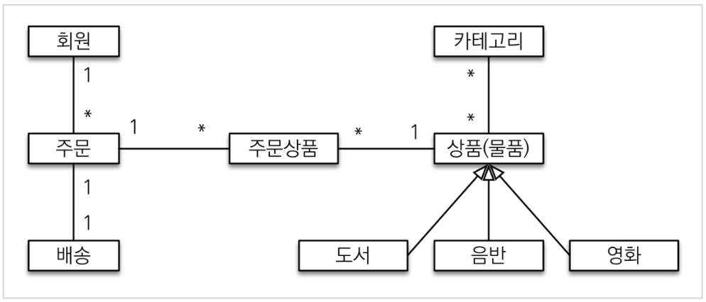
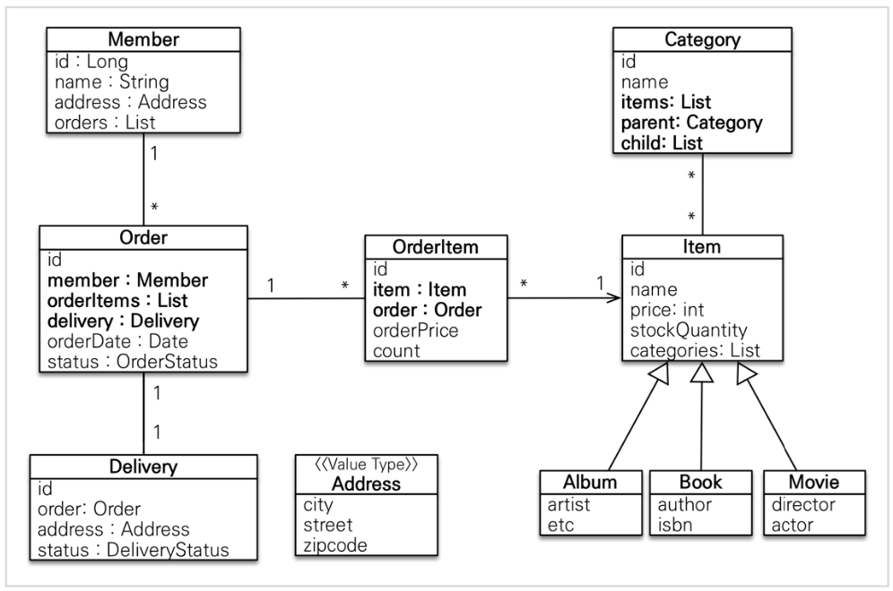
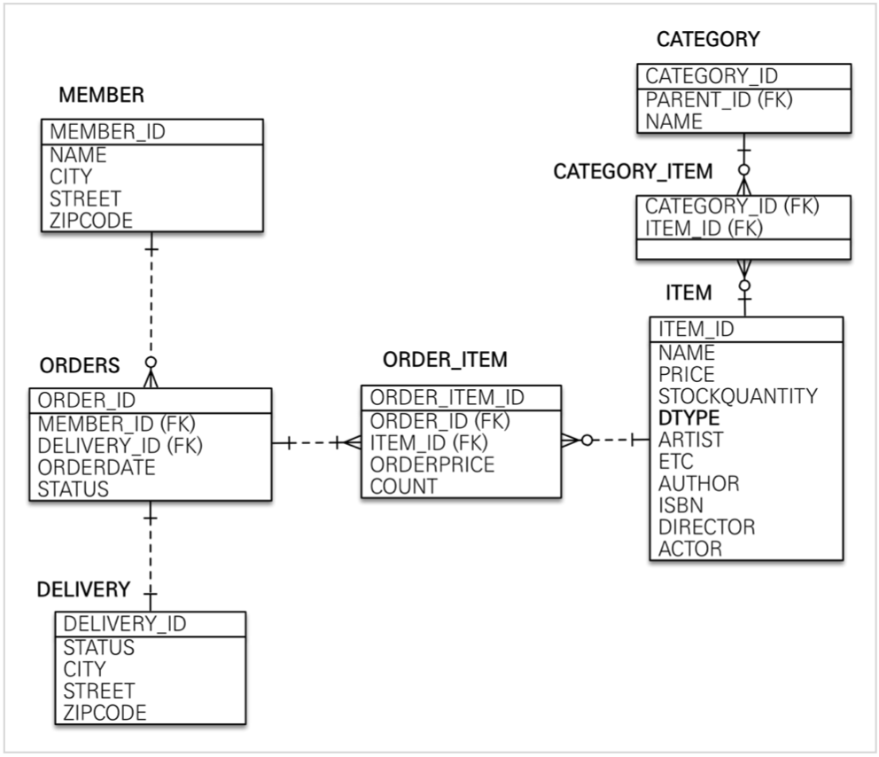
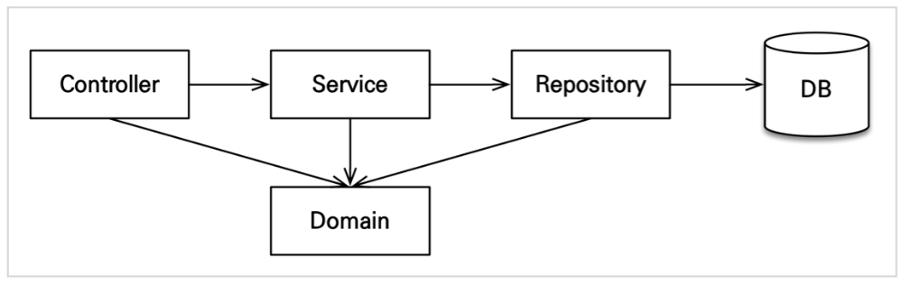

# _프로젝트 환경설정_

<br>

## _프로젝트 생성_

<br>

* ### _사용 기능_
  * $Web$
    >implementation 'org.springframework.boot:spring-boot-starter-web' 
  * $Thymeleaf$
    >implementation 'org.springframework.boot:spring-boot-starter-thymeleaf'   
  * $JPA$ 
    >implementation 'org.springframework.boot:spring-boot-starter-data-jpa'   
  * $H2$ 
    >runtimeOnly 'com.h2database:h2'   
  * $Lombok$ 
    >compileOnly 'org.projectlombok:lombok'   
     annotationProcessor 'org.projectlombok:lombok'
  * $Validation$
    >implementation 'org.springframework.boot:spring-boot-starter-validation'   

<br>

* ### _쿼리 파라미터 로그 남기기_
  * 외부 라이브러리 사용
    >https://github.com/gavlyukovskiy/spring-boot-data-source-decorator   
  * 스프링 부트를 사용하면 라이브러리를 추가하면 된다 
  * 참고
    >쿼리 파라미터를 로그로 남기는 외부 라이브러리는 시스템 자원을 사용하므로, 개발 단계에서는 편하게 사용해도 된다.   
    하지만 운영시스템에서 적용하려면 꼭 성능테스트를 하고 사용하는 것이 좋다.   

<br> 

## _JPA와 DB설정, 동작확인_
* ### _YAML_
  * `main/resources/application.yml`
      ```yml
      spring:
      datasource:
          url: jdbc:h2:tcp://localhost/~/japshop
          username: sa
          password:
          dirver-class-name: org.h2.Driver

          jpa:
          hibernate:
              ddl-auto: create
          properties:
              hibername:
                #show_sql: true
              format_sql: true

      logging:
      level:
          org.hibername.SQL: debug
          org.hibername.type: trace    
      ```
  * `spring.jpa.hibername.ddl-auto: create`
    * 이 옵션은 애플리케이션 실행 시점에 테이블을 drop하고, 다시 생성한다.
    * update, create-drop, none
  * 참고
    >모든 로그 출력은 가급적 로거를 통해 남겨야 한다.   

    >`show_sql` 옵션은 `System.out`에 하이버네이트 실행 SQL을 남긴다.   

    >`org.hibernate.SQL` 옵션은 logger를 통해 하이버네이트 실행 SQL을 남긴다.
  * 주의   
    >`application.yml`같은 `yml`파일은 띄어쓰기(스페이스)2칸으로 계층을 만든다.   

    >따라서 띄어쓰끼 2칸틀 필수로 기입해야 한다.   

    >예를 들어서 위 코드의 `datasource`는 `spring:` 하위에 있고 앞에 띄어쓰기 2칸이 있으므로 `spring.datasource`가 된다.

<br>

* ### _쿼리 파라미터 로그 남기기_
  * SQL 실행 파라미터를 로그로 남기기 위해 build.gradle에 다음 라이브러리 추가   
    >com.github.gavlyukovskiy:p6spy-spring-boot-starter:1.8.0
  * 외부 라이브러리 사용
    >https://github.com/gavlyukovskiy/spring-boot-data-source-decorator   
  * 참고
    >쿼리 파라미터를 로그로 남기는 외부 라이브러리는 시스템 자원을 사용하므로, 개발 단계에서는 편하게 사용해도 된다.   
    하지만 운영시스템에 적용하려면 꼭 성능테스트를 하고 사용하는 것이 좋다.   
     
<br>
<br>
<br>


# _도메인 분석 설계_

<br>

## _요구사항 분석_
* ### _기능 목록_
  * 회원 기능
    * 회원 등록
    * 회원 조회
  * 상품 기능
    * 상품 등록
    * 상품 수정
    * 상품 조회
  * 주문 기능
    * 상품 주문
    * 주문 내역 조회
    * 주문 취소
  * 기타 요구사항
    * 상품은 재고 관리가 필요하다.
    * 상품의 종류는 도서, 음반, 영화가 있다.
    * 상품을 카테고리로 구분할 수 있다.
    * 상품 주문시 배송 정보를 입력할 수 있다.   

<br>

## _도메인 모델과 테이블 설계_
* ### _도메인 모델과 테이블 설계_    
     
  * `회원, 주문, 상품의 관계`
    >회원은 여러 상품을 주문할 수 있다. 그리고 한 번 주문할 때 여러 상품을 선택할 수 있으므로 주문과 상품은 다대다 관계다.   
    하지만 이런 다대다 관계는 관계형 데이터베이스는 물론이고 엔티티에서도 거의 사용하지 않는다.   
    따라서 그림처럼 주문상품이라는 엔티티를 추가해서 다대다 관계를 일대다, 다대일 관계로 풀어냈다.   
  * `상품 분류`
    >상품은 도서, 음반, 연화로 구분되는데 상품이라는 공통 속성을 사용하므로 상속 구조로 표현했다.   
* ### _엔티티 분석_  
    
  * `회원(Member)`
    * 이름과 임베디드 타입인 주소(`Adress`), 그리고 주문(`order`) 리스트를 갖는다.
  * `주문(order)`
    * 한 번 주문시 여러 상품을 주문할 수 있으므로 주문과 주문상품(`OrderItem`)은 일대다 관계다. 
    * 주문은 상품을 주문한 회원과 배송 정보, 주문 날짜, 주문 상태(`status`)를 가지고 있다. 
    * 주문 상태는 열거형을 사용했는데 주문(`ORDER`), 취소(`CANCEL`)을 표현할 수 있다.
  * `주문 상품(OrderItem)`
    * 주문한 상품 정보와 주문 금액(`orderPrice`), 주문 수량(`count`)정보를 가지고 있다.
    * 보통 `OrderLine`, `LineItem`으로 많이 표현한다.
  * `배송(Delivery)`
    * 주문시 하나의 배공 정보를 생성한다. 
    * 주문과 배송은 일대일 관계다.
  * `카테고리(Category)`
    * 상품과 다대다 관계를 맺는다. 
    * `parent`, `child`로 부모, 자식 카테고리를 연결한다.
  * `주소(Address)`
    * 값 타입(임베디드)이다. 
    * 회원과 배송(Delivery)에서 사용한다.
  * 참고   
    >회원이 주문을 하기 때문에, 회원이 주문리스트를 가지는 것은 얼핏 보면 잘 설계한 것 같지만, 객체 세상은 실제 세계와는 다르다.   
    실무에서는 회원이 주문을 참조하지 않고, 주문이 회원을 참조하는 것으로 충분하다.   
    여기서는 일대다, 다대일의 양방향 연관관계를 설명하기 위해서 추가했다.   

<br>

* ### _테이블 분석_   
    
  * `MEMBER` 
    * 회원 엔티티의 `Address`임베디드 타입 정보가 회원 테이블에 그대로 들어갔다. 
    * 이것은 `DELIVERY`테이블도 마찬가지다.
  * `ITEM`
    * 앨범, 도서, 영화 타입을 통합해서 하나의 테이블로 만들었다.
    * `EDTYP`컬럼으로 타입을 구분한다.
    * 참고
      >테이블명이 `ORDER`가 아니라 `ORDERS`인 것은 데이터베이스가 `order by`때문에 예약어로 잡고 있는 경우가 많다.   
      따라서 관례상 `ORDERS`를 많이 사용한다.   
    * 참고: `실제 코드에서는 DB에 소문자 + _(언터스코어) 스타일을 사용한다.`
      >데이터베이스 테이블명, 컬럼명에 대한 관례는 회사마다 다르다.   
      보통은 대문자 + _(언더스코어)나 소문자 + _(언더스코어) 방식 중에 하나를 지정해서 일관성 있게 사용한다.

<br>

* ### _연관관계 매핑 분석_   
  * `회원과 주문`
    * 일대다, 다대일 양방향 관계
    * 왜래 키가 존재하는 테이블(`ORDERS`)과 매핑된 엔티티(`Order`)를 연관관계의 주인으로 지정한다.
    * `Order.member`를 `ORDERS.MEMBER_ID`외래 키와 매핑한다. 
  * `주문상품과 주문`
    * 다대일 양방향 관계
    * 외래 키가 존재하는 테이블(`ORDER_ITEM`)과 매핑된 엔티티(`OrderItem`)를 연관관계의 주인으로 지정한다.
    * `OrderItem.order`를 `ORDER_ITEM.ORDER_ID`외래 키와 매핑한다.
  * `주문상품과 상품`
    * 다대일 단방향 관계
    * `OrderItem.item`을 `ORDER_ITEM.ITEM_ID`외래 키와 매핑한다.
  * `주문과 배송`
    * 일대일 양방향 관계
    * `Order.delivery`를 `ORDERS.DELIVERY_ID`왜래 키와 매핑한다.
  * `카테고리와 상품`
    * `@ManyToMany`를 사용해서 매핑한다.
    * 실무에서는 @ManyToMany는 사용하지 않는다.
  * 참고: 외래 키가 있는 곳을 연관관계의 주인으로 정해라.
    >연관관계의 주인은 단순히 외래 키를 누가 관리하냐의 문제이지 비즈니스상 우위에 있다고 주인으로 정하면 안된다.   
    예를 들어서 자동차와 바퀴가 있으면, 일대다 관계에서 항상 다쪽에 외래 키가 있으므로 외래 키가 있는 바퀴를 연관관계의 주인으로 정하면 된다.   
    물론 자동차를 연관관계의 주인으로 정하는 것이 불가능 한 것은 아니지만, 자동차를 연관관계의 주인으로 정하면 자동차가 관리하지 않는 바퀴 테이블의 외래 키 값이 업테이트 되므로 관리와 유지보수가 어렵고, 추가적으로 별도의 업테이트 쿼리가 발생하는 성능 문제도 있다.    


<br>

## _엔티티 클래스 개발_
* 실무에서는 가급적 Getter는 열어두고, Setter는 꼭 필요한 경우에만 사용하는 것을 추천한다.
* 참고
  >이론적으로는 Getter, Setter모두 제공하지 않고, 꼭 필요한 별도의 메서드를 제공하는게 가장 이상적이다.   
  하지만 실무에서 엔티티의 데이터는 조회할 일이 너무 많으므로, Getter의 경우 모두 열어두는 것이 편리하다.   
  Getter는 아무리 호출해도 호출 하는 것 만으로는 어떤 일이 발생하지 않는다.   
  하지만 Setter는 문제가 다르다.   
  Setter를 호출하면 데이터가 변한다.   
  Setter를 막 열어두면 가까운 미래에 엔티티가 도대체 왜 변경되는지 추적하기 점점 힘들어진다.   
  따라서 엔티티를 변경할 떄는 Setter 대신에 변경 지점이 명확하도록 변경을 위한 비즈니스 메서드를 별도로 제공해야 한다.   

<br>

* ### _회원 엔티티_
  ```Java
  pacage jpabook.jpashop.domain

  @Entity
  @Getter @Setter
  public class Member {

      @Id @GeneratedValue
      @Column(name ="member_id")
      private Long id;

      private String namel

      @Embedded
      private Address address;

      @OneToMany(mappedBy = "member")
      private List<Order> orders = new ArrayList<>();
  }
  ```  
* 참고
  >엔티티의 식별자는 `id`를 사용하고 PK 컬럼명은 `member_id`를 사용했다.   
  엔티티는 타임(여기서는 `Member`)이 있으므로 `id`필드만으로 쉽게 구문할 수 있다.   
  테이블은 타입이 없으므로 구분이 어렵다.   
  그리고 테이블은 관례상 `테이블 명 + id`를 많이 사용한다.   
  참고로 객체에서 `id`대신에 `memberId`를 사용해도 된다.   
  중요한 것은 일관성이다.   

<br>

* ### _주문 엔티티_   
   ```Java
   package jpabook.jpashop.domain;

   @Entity
   @Table(name = "orders")
   @Getter @Setter
   public class Order {

       @Id @GeneratedValue
       @Column(name = "order_id")
       private Long id;

       @ManyToOne(fetch = FetchType.LAZY)
       @JoinColumn(name = "member_id")
       private Mamver member;  //주문 회원

       @OneToMany(mappedBy = "order", cascade = CascadeType.ALL)
       private List<OrderItem> orderItems = new ArrayList<>();

       @OneToOne(fetch = FetchType.LAZY, casecade = CascadeType.ALL)
       @JoinColumn(name = "delivery_id")
       private Delivery delivery;   //배송 정보

       private LocalDateTime orderDate;  //주문 시간

       @Enumerated(EnumType.STRING)
       private OrderStatus status;  //주문 상태[ORDER, CANCEL]

       //==== 연관관계 메서드 =====//
       public void setMember(Member member) {
           this.member = member;
           member.getOrders().add(this);
       }

       public void addOrderItem(OrderItem orderItem) {
           orderItems.add(orderItem);
           orderItem.setOrder(this);
       }

       public void setDelivery(Delivery delivery) {
           this.delivery = delivery;
           delivery.setOrder(this);
       }
   }
   ```

<br>

* ### _주문 상태_
    ```Java
    package jpabook.jpashop.domain;

    public enum OrderStatus {

        ORDER, CANCEL
    }
    ```

<br>

* ### _주문상품 엔티티_   
    ```Java
    package jpabook.jpashop.domain;

    @Entity
    @Getter @Setter
    public class OrderItem {

        @Id @GeneratedValue
        @Column(name = "order_item_id")
        private Long id;

        @ManyToOne(fetch = FetchType.LAZY)
        @JoinColumn(name = "item_id")
        private Item item;

        @ManyToOne(fetch = FetchType.LAZY)
        @JoinColumn(name = "order_id")
        private Order order;

        private int orderPrice;
        private int count;
    }
    ```

<br>

* ### _상품 엔티티_
    ```Java
    package jpabook.jpashop.domain.item;

    @Entity
    @Inheritance(strategy = InheritanceType.SINGLE_TABLE)
    @DiscriminatorColumn(name = "dtype")
    @Getter @Setter
    public abstract class Item {

        @Id @GeneratedValue
        @Column(name = "item_id")
        private Long id;

        @ManyToMany(mappedBy = "items")
        private List<Category> categories = new ArrayList<>();

        private String name;
        private int price;
        private int stockQuantity;
    }
    ```

<br>

* ### _상품-도서 엔티티_
    ```Java
    package jpabook.jpashop.domain.item;

    @Entity
    @DiscriminatorValue("B")
    @Getter @Setter
    public class Book extends Item {

        private String author;
        private String isbn;
    }
    ```

<br>

* ### _상품-음반 엔티티_
    ```Java
    package jpabook.jpashop.domain.item;

    @Entity
    @DiscriminatorValue("A")
    @Getter @Setter
    public class Album extends Item {

        private String artist;
        private String etc;
    }
    ```

<br>

* ### _상품-영화 엔티티_
    ```Java
    package jpabook.jpashop.domain.item;

    @Entity
    @DiscriminatorValue("M")
    @Getter @Setter
    public class Movie extends Item {

        private String director;
        private String actor;
    }
    ```

<br>

* ### _배송 엔티티_
    ```Java
    package jpabook.jpashop.domain;

    @Entity
    @Getter @Setter
    public class Delivery {
        
        @Id @GeneratedValue
        @Column(name = "delivery_id")
        private Long id;

        @OneToOne(mappedBy = "delivery", fetch = FetchType.LAZY)
        private Order order;

        @Embedded
        private Address address;

        @Enumerated(EnumType.STRING)
        private DeliveryStatus status;
    }
    ```

<br>

* ### _배송 상태_
    ```Java
    package jpabook.jpashop.domain;

    public enum DeliveryStatus {

        READY, COMP
    }
    ```

<br>

* ### _카테고리 엔티티_
    ```Java
    @Entity
    @Getter @Setter
    public class Category {

        @Id @GeneratedValue
        @Column(name = "category_id")
        private Long id;

        private String name;

        @ManyToMany
        @JoinTable(name = "category_item", 
            joinColumns = @JoinColumn(name = "category_id"),
            inverseJoinColumns = @JoinColumn(name = "item_id"))
        private List<Item> items = new ArrayList<>();

        @ManyToOne(fetch = FetchType.LAZY)
        private Category parent;

        @OneToMany(mappedBy = "parent")
        private List<Category> child = new ArrayList<>();

        //==== 연관관계 메서드 ====//
        public void addChildCategory(Category child) {
            this.child.add(child);
            child.setParent(this);
        }
    }
    ```
  * 참고
    >실무에서는 `@ManyToMany`를 사용하지 말자   
    `@ManyToMany`는 편리한 것 같지만, 중간 테이블(`CATEGORY_ITEM`)에 컬럼을 추가할 수 없고, 세밀하게 쿼리를 실행하기 어렵기 때문에 실문에서 사용하기에는 한계가 있다.   
    중간 엔티티(`CategoryItem`)를 만들고 `@ManyToOne`, `@OneToMany`로 매핑해서 사용하자.   
    정리하자면 다대다 매핑을 일대다, 다대일 매핑으로 풀어내서 사용하자.    

<br>

* ### _주소 값 타입_   
    ```Java
    package jpabook.jpashop.domain;

    @Embeddable
    @Getter
    public class Address {

        private String city;
        private String street;
        private String zipcode;

        protected Address(){}

        public Address(String city, String street, String zipcode) {
            this.city = city;
            this.street = street;
            this.zipcode = zipcode;
        }
    }
    ```
  * 참고: 값 타입은 변경 불가능하게 설계해야 한다.
    >`@Setter`를 제거하고, 생성자에서 값을 모두 초기화해서 변경 불가능한 클래스를 만든다.   
    JPA 스펙상 엔티티나 임베디드 타임(`@Embeddable`)은 자바 기본 생성사(default constructor)를 `public`또는 `protected`로 설정해야 한다.    
    `public`으로 두는 것 보다는 `protected` 로 설정하는 것이 그나마 더 안전하다.   
    JPA가 이런 제약을 두는 이유는 JPA 구현 라이브러리가 객체를 생성할 떄 리플렉션 같은 기술을 사용할 수 있도록 지원해야 하기 때문이다.   

<br>

## _엔티티 설계시 주의점_
* ### _엔티티에는 가급적 Setter를 지양하자_
  * `Setter 메소드는 의도를 갖기 힘들다.`
    * 도메인 클레스에서 의도에 맞는 메서드 명으로 메서드를 만들어 내부 로직으로 사용하고 Service와 같은 다른 Layer에서 해당 메서드를 호출하는 방식이 가독성을 올리고 메서드의 의도를 파악하기 수월하다.
  * `객체의 일관성을 유지하기 어렵다.`
    * 자바 빈 규약에 따르는 Setter는 public으로 어떤 곳에서도 접근이 가능하다.
      * 개발자도 결국 사람이기 때문에 의도치 않은 변경을 할 수도 있게 된다.
    * 불변 값에 대해서는 `final`키워드를 추가해서 Setter 사용을 막을 수 있으나 Setter 사용을 지양하면 처음부터 이런 걱정을 할 필요가 없다. 
      * 실수가 줄어들어 개발의 생산성이 훨씬 높아진다. 
  * `Builder 패턴을 사용하자.`
    * Setter를 지양하다보면 당연하게 따라오는 불편함이 발생한다.
    * 클래스의 필드가 많이 존재할 경우 Setter 없이 개발자의 입맛에 맞는 클래스를 생성하기 위해서는 필요한 생성자들을 여러번 오버 로딩 해야한다. 
    * 이렇게 되면 클래스 코드의 가독성이 떨어지며 유지보수성 또한 매우 떨어진다.

<br>

* ### _모든 연관관계는 지연로딩으로 설정!_
  * 즉시 로딩(`EAGER`)은 예측이 어렵고, 어떤 SQL이 실행될지 추적하기 어렵다. 특히 JPQL을 실행할 떄 N + 1 문제가 자주 발생한다.
  * 실무에서 모든 연관관계는 지연로딩(`LAZY`)으로 설정해야 한다.
  * 연관된 엔티티를 함꼐 DB에서 조회해야 하면, fetch join 또는 엔티티 그래프 기능을 사용한다.
  * @XToOne(OneToOne, ManyToOne)관계는 기본이 즉시로딩이므로 직접 지연로딩으로 설정해야 한다.   

<br>

* ### _컬렉션은 필드에서 초기화 하자_
  * 컬렉션은 필드에서 바로 초기화 하는 것이 안전하다.
  * `null`문제에서 안전하다.
  * 하이버네이트는 엔티티를 영속화 할 떄, 컬렉션을 감싸서 하이버네이트가 제공하는 내장 컬렉션으로 변경한다.
  * `getOrders()`처럼 임의의 메서드에서 컬렉션을 잘못 생성하면 하이버네이트 내부 메커니즘에 문제가 발생할 수 있다.
  * 필드 레벨에서 생성하는 것이 가장 안전하고 코드도 간결하다.
    ```Java
    Member member = new Member();
    System.out.println(member.getOrders().getClass());
    entityManger.persist(team);
    System.out.prtinln(member.getOrders().getClass());
    ```
  * 출력 결과
    >class java.unit.ArrayList   
     class org.hibernate.collection.internal.PersistentBag   

<br>

## _Builder 패턴_

<br>

* ### _Builder 패턴이란?_
  * 빌더 패턴은 디자인 패턴의 하나로써 클래스의 생성과 표현을 분리하고자 하는 의도를 가진 패턴이다.
  * `객체 생성을 깔끔하고 유연하게 하기 위한 기법.`

<br>

* ### _Builder 패턴의 장점_
  * 요구사항에 맞게 필요한 데이터(필드)만 이용하여 유연하게 클래스 생성이 가능하다.
  * 높은 가독성과, 유지보수성을 확보할 수 있다.   
  * 객체의 불변성을 확보할 수 있다.

<br>

* ### _요구사항에 맞는 필요한 데이터만 이용할 수 있음_
  * 여러 맴버 변수가 동적으로 변화하거나, 어떤 경우에는 필요하고 어떤 경우에는 필요 없을 수 있다.
  * 이때마다 경우에 맞게 생성자를 오버로딩 해야야 하는데 이는 상당히 불편한 작업이고, 유지보수성 또한 떨어진다.
  * `빌더 패턴을 사용하면 동적으로 생성자를 오버로딩 할 수 있다.`
  * 이렇게 필요한 데이터만 가지고 생성자를 동적으로 만들 수 있다면 테스트 코드 작성에 편의를 제공하고, 불필요한 코드도 줄이기 떄문에 유지보수성을 높일 수 있다.

<br>

* ### _높은 가독성과 유연성_
    ```Java
    //Person 클래스 생성자
    public Person(String name, String phonsNumber, String genderType) {
        this.name = name;
        this.phoneNumber = phoneNumber;
        this.getderType = genderType;
    }

    //기존의 Person 생성 코드
    Person person = new Person("Jeon", "010-0000-0000", "MAN");
    ```
  * 만약 Person 클래스에 새로운 요구사항으로 필드가 추가된다면 기존 생성자를 오버 로딩 해주어야 하고, 기존 Person 생성자 코드는 컴파일 에러가 발생한다. 
  * 생성자가 오버 로딩 되는것은 많은 부담이 가는 작업이다. 
  * 빌더 패턴을 사용해서 객체를 처음부터 생성한다면 `불필요한 작업 없이 얼마든지 유연한게 원하는 형태로 클래스 생성(초기화)이 가능`하다.

<br>

* ### _객체의 불변성을 확보할 수 있다._
  * 기존의 코딩 스타일은 자바 빈 패턴을 따르는 경우가 많다 
  * 즉 Setter를 흔히 사용하는 것인데 모든 멤버 변수에 Setter를 구현한다는 것은 불필요하게 확장 가능성을 열어두는 것으로 이는 `개발-폐쇄 법칙(OCP)에 위배`되고, 불필요한 코드 리딩 들을 유발한다. 
  * `따라서 클래스 변수를 final키워드로 선언하고 객체의 생성은 빌더에게 위임하는 것이 바람직하다.`
  * 예시
    ```Java
    @RequiredArgsConstructor
    @Builder
    public class Person {

        private final name;
        private final phoneNumber;
        private final genterType;
    }
    ``` 
  * 참고
    * 예외적으로 엔티티 객체 또는 도메인 객체로 부터 DTO를 생성하는 경우라면 직접 빌더를 만들고 하는 작업이 번거로우므로 Model Mapper와 같은 라이브러리를 통해서 생성을 위임할 수 있다.
    * lombok이 제공하는 @Builder 애노테이션에대한 자세한 설명은 BuilderPattern에 기록해두었다.


<br>
<br>
<br>

# _애플리케이션 구현 준비_

<br>

## _애플리케이션 아키텍처_

* ### _계층형 구조 사용_
  * controller, web: 웹 계층
  * service: 비즈니스 로직, 트랜잭션 처리
  * repository: JPA를 직접 사용하는 계층, 엔티티 매니저 사용
  * domain: 엔티티가 모여 있는 계층, 모든 계층에서 사용

<br>

* ### _패키지 구조_
  * jpabook.jpashop
    * domain
    * execption
    * respository
    * service
    * web
  * 개발 순서: 서비스, 리포지토리 계층을 개발하고, 테스트 케이스를 작성해서 검증, 마지막에 웹 계층 적용

<br>
<br>
<br>

# _회원 도메인 개발_
* ### _구현 기능_
  * 회원 등록
  * 회원 목록 조회

<br>

* ### _순서_
  * 회원 엔티티 코드 다시 보기
  * 회원 리포지토리 개발
  * 회원 서비스 개발
  * 회원 기능 테스트 
<br>

## _회원 리포지토리 개발_

<br>

* ### _회원 리포지토리 코드_   
  ```Java
  package jpabook.jpashop.repositoy;

  @Repository
  public class MemberRepository {

      @PersistenceContext
      private EntityManager entityManager;

      public void save(Member member) {
          entityManger.persist(member);
      }

      public Member findOne(Long id) {
          return entityManager.fine(Member.class, id);
      }

      public List<Member> findAll() {
          return entityManger.createQuery("select m from Member m", Member.class)
              .getResultList();
      }

      public List<Member> findByName(String name) {
          return entityManager.createQuery("select m from Member m where m.name =: memberName", Member.class)
              .setParameter("memberName", name)
              .getResultList();
      }
  }
  ```

<br>

* ### _기술 설명_
  * `@Repository`: 스프링 빈으로 등록
    * `@Component` 애노테이션 탑재
    * JPA 예외를 스프링 기반 예외로 변환
  * `@PersistenceContext`: 엔티티 매니저(`EntityManager`)주입
  * `@PersistenceUnit`: 엔티티 매니저 팩토리(`EntityManagerFactory`)주입
  

<br>

## _회원 서비스 개발_
* ### _회원 서비스 코드_
  ```Java
  package jpabook.jpashop.service;

  @Service
  @RequiredArgsConstructor
  @Transactional(readOnly = true)
  public class MemverService {

      private final MemberRepository memberRespository;

      /*
      * 회원 가입
      */
      @Transaction
      public Long join(Member member) {
          validateDuplicationMember(member);  //중복 회원 검증

          memberRepository.save(member);
          
          return member.getId();
      }

      private void validateDuplicationMember(Member member) {
          List<Member> findMembers = memberRepository.findByName(member.getName());
          if (!fineMember.isEmpty()) {
              throw new IllegalStateException("이미 존재하는 회원입니다.");
          }          
      }

      /*
      * 전체 회원 조회
      */
      public List<Member> findAll() {
          return memberRepository.findAll();
      }

      public Member findOn(Long memberId) {
          return memberRepository.findOne(memberId);
      }
  }
  ```

<br>

* ### _기술 설명_
  * `@Transactional`: 트랜잭션, 영속성 컨텍스트
    * `readOnly = true`: 데이터의 변경이 없는 읽기 전용 메서드에 사용, 영속성 컨텍스트를 플러시 하지 않으므로 약간의 선능 향상(읽기 전용에는 다 적용)
    * 데이터베이스 드라이버가 지원하면 DB에서 선능 향상
  * `@Autowired`
    * 생성자 Injection 많이 사용, 생성자가 하나면 생략 가능
  * 참고
    >실무에서는 검증 로직이 있어도 멀티 쓰레드 상황을 고려해서 회원 테이블의 회원명 컬럼에 유니크 제약 조건을 추가하는 것이 안전하다.  

<br>

* ### _생성자 주입_
  * 생성자 주입 방식을 권장
  * 변경 불가능한 안전한 객체 생성 가능
  * 생성자가 하나면 `@Autowired`를 생량할 수 있다.
  * `final`키워드를 추가하면 컴파일 시점에 `memberRepository`를 설정하지 않는 오류를 체그할 수 있다.(보통은 기본 생성자를 추가할 때 발견)
  * 참고
    >스프링 데이터 JPA를 사용하면 `EntityMamager`도 주입 가능 

<br>

## _회원 기능 테스트_

<br>

* ### _테스트 요구사항_
  * 회원가입을 성공해야 한다
  * 회원가입 할 때 같은 이름이 있으면 예외가 발생해야 한다.
  
<br>

* ### _회원가입 테스트 코드_
  ```Java
  package jpabook.jpashop.service;

  @SpringBootTest
  @Transaction
  public class MemberServiceTest {

      @Autowired MemberRepository memberRepository;
      @Autowired MemberService memberService;

      @Test
      void 회원가입() throws Exception {
          //given
          Member member = Member.bulider
                .name("memberA")
                .bulid();
            
          //when
          Long findId = memberService.join(member);

          //then
          assertEquals(member, memberRepository.findOne(findId));
      }

      @Test
      void 중복_회원_예외() throws Exception {
          //given
          Member memberA = Member.bulider
                .name("mamberA")
                .bulid();

          Member memberB = Member.bulider
                .name("memberA")
                .bulid();

          //when
          memberService.join(memberA);

          //then
          IlligalStateException illigalStateException = assertThorw(IlligalStateException.class,
                () -> memberService.join(memberB));
      }
  }
  ```

<br>

* ### _기술 설명_
  * `@SpringBootTest`: 스프링 부트를 띄우고 테스트(이게 없으면 `@Autowired`)다 실패)
  * `@Transactional`: 반복 가능한 테스트 지원, 각각의 테스트를 실행할 때마다 트랜잭션을 시작하고 `테스트가 끝나면 트랜잭션을 강제로 롤백`(이 애노테이션이 테스트 케이스에서 사용될 때만 롤백)

<br>

* ### _테스트 케이스를 위한 설정_
  * 테스트 케이스는 격리된 환경에서 실행하고, 끝나면 데이터를 초기화하는 것이 좋다.
  * 따라서 메모리 DB를 사용하는 것이 가장 이상적이다.
  * 추가로 테스트 케이스를 위한 스프링 환경과, 일반적으로 애플리케이션을 실행하는 환경은 보통 다르므로 설정 파일을 다르게 사용하자.
  * `test/resources/application.yml`
    ```Java
    spring:
      //datasource:
        //url: jdbc:h2:tcp://localhost/~/jpashop
        //username: sa
        //password:
        //driver-class-name: org.h2.Driver

      //jpa:
        //hibernate:
          //ddl-auto: create
        //properties:
          //hibernate:
            //#        show_sql: true -> sout 출력...
            //fromat_sql: true

    //logging:
      //level:
        //org.hibernate.SQL: debug
        //org.hibernate.type: trace    
    ```
  * 이제 테스트에서 스프링을 실행하면 이 위치에

<br>
<br>
<br>

# _상품 도메인 개발_

<br>

* ### _구현 기능_
  * 상품 등록
  * 상품 목록 조회
  * 상품 수정

<br>

* ### _순서_
  * 상품 엔티티 개발(비즈니스 로직 추가)
  * 상품 리포지토리 개발
  * 상품 서비스 개발
  * 상품 기능 테스트

<br>

## _상품 엔티티 개발(비즈니스 로직 추가)_

<br>

* ### _상품 엔티티 코드_
  ```Java
  package jpabook.jpashop.domain;

  @Entity
  @Inheritance(strategy = InheritenceType.JOINED)
  @DiscriminatorColumn(neme = "dtype")
  @NoArgsConstructor(access = PROTECTED)
  @Getter
  public abstract class Item {

      @Id @GeneratedValue
      @Column(name = "item_id")
      private Long id;

      private String name;

      private int price;

      private int stockQuantity;

      @OneToMany(mappedBy = "item")
      private List<OrderItem> orderItems = new ArrayList<>();

      @OneToMany(mappedBy = "item")
      private List<CategoryItem> categoryItems = new ArrayList<>();

      //== 비즈니스 로직 ==//
      public void addStock(int quantity) {
          this.stockQuantity += quantity;
      }

      public void removeStock(int quantity) {
          int restStock = this.stockQuantity -= quantity;
          if (restStock < 0) {
              throw new NotEnoughStockException("need more stock");
          }

          this.stockQuantity = restStock;
      }
  }
  ```

<br>

* ### _예외 추가_
  ```Java
  package jpabook.jpashop0.exception;

  public class NotEnoughStockException extends RuntimeException {

      public NotEnoughStockException() {
          super();
      }

      public NotEnoughStockException(String message) {
          super(message);
      }

      public NotEnoughStockException(String message, Throwable cause) {
          super(message, cause);
      }

      public NotEnoughStockException(Throwable cause) {
          super(cause);
      }
  }
  ```

<br>

* ### _비즈니스 로직 분석_
  * `addStock()`메서드는 파라미터로 넘어온 수만큼 재고를 늘린다.
    * 이 메서드는 재고가 증가하거나 상품 주문을 취소해서 재고를 다시 늘려야 할 때 사용한다.
  * `removeStock()`메서드는 파라미터로 넘어온 수만큼 재고를 줄인다.
    * 만약 재고가 부족하면 예외가 발생한다.
    * 주로 상품을 주문할 때 사용한다.

<br>

## _상품 리포지토리 개발_

<br>

* ### _상품 리포지토리 코드_
  ```Java
  package jpabook.jpashop.repository;

  @Repository
  @RequiredArgsConstructor
  public abstract class Item {

      private final EntityManager entityManger;

      public void sava(Item item) {
          if (item.getId() == null) {
              entityManager.find(item);
          } else {
              entityManger.merge(item);
          }
      }

      public Item findOne(Long itemId) {
          return entityManger.fine(Item.class, itemId);
      }

      public List<Item> findAll() {
          return entityManager.createQuery("select i from Item i", Item.class)
              .getResultList();
      }
  }
  ```

<br>

* ### _기능 설명_
  * `save()`
    * `itemId`가 없으면 신규로 보고 `persist()`실행
    * `itemId`가 있으면 이미 데이터베이스에 저장된 엔티티를 수정한다 보고, `merge()`를 실행, 자세한 내용은 뒤에 웹에서 설명

<br>

## _상품 서비스 개발_

<br>

* ### _상품 서비스 코드_
  ```Java
  package jpabook.jpashop.service;

  @Service
  @RequiredArgsConstructor
  @Transactional(readOnly = true)
  public class ItemService {

      private final ItemRepository itemRepository;

      @Transactional
      public void sace(Item item) {
          itemRepository.save(item);
      } 

      public List<Item> findItems() {
          return itemRepository.findAll();
      }

      public Item findOne(Long itemId) {
          return itemRepository.findOne(itemId);
      }
  }
  ```
* 상품 서비스는 상품 리포지토리에 단순히 위임만 하는 클래스

<br>
<br>
<br>

# _주문 도메인 개발_

<br>

* ### _구현 기능_
  * 상품 주문
  * 주문 내역 조회
  * 주문 취소

<br>

* ### _순서_
  * 주문 엔티티, 상품 주문 엔티티 개발
  * 주문 리포지토리 개발
  * 주문 서비스 개발
  * 주문 검색 기능 개발
  * 주문 기능 테스트

<br>

## _주문, 주문상품 엔티티 개발_

<br>

* ### _주문 엔티티 코드_
  ```Java
  package jpabook.jpashop.domain;
  
  @Entity
  @Table(name = "orders")
  @NoArgsConstructor(access = PROTECTED)
  @Getter
  public class order {

      @Id @GeneratedValue
      @Column(name = "order_id")
      private Long id;

      @ManyToOne(fetch = FetchType.LAZY)
      @JoinColumn(name = "member_id")
      private Member member;

      @OneToOne(fetch = FetchType.LAZY)
      @JoinColumn(name = "delivery_id")
      private Delivery delivery;

      @OneToMany(mappedBy = "order")
      @Singular
      private List<OrderItem> orderItems = new ArrayList<>();

      private LocalDateTime = orderDate;

      @Eumnerated(EnumType.STRING)
      private OrderStatus status;

      @Builer
      private Order(Member member, Delivery delivery, OrderItem orderItems, LocalDateTime orderDate, OrderStatus status) {
          this.member = member;
          this.delivery = delivery;
          this.orderItems = orderItems;
          this.orderDate = orderDate;
          this.status = status;
      }

      public void changeStatus(OrderStatus status) {
        this.status = status;
      }

      //== 양방향 연관관관계 편의 메서드 ==//
      public void byMember(Member member) {
          this.member = member;
          member.getOrders().add(this);
      }

      public void byDelivery(Delivery delivery) {
          this.delivery = delivery;
          delivery.setOrder(this);
      }

      public addOrdreItem(OrderItem orderItem) {
          this.orderItems.add(orderItem);
          orderItem.setOrder(this);
      }

      //==== 비즈니스 로직 ====//

      //== 주문 취소 ==//
      public void cancel() {
          if (delivery.getStatus == DeliveryStatus.COMP) {
              throw new IlligalStatusException("이미 배송완료된 상품은 취소가 불가능합니다.");
          } else {
              this.changeStatus(OrderStatuts.CANCEL);
              for (OrderItem orderItem : orderItems) {
                  ordetItem.cancel();
              }
          }
      }

      //==== 조회 로직 ====//
      //== 전체 주문 가격 조회 ==//
      public int getTotalPrice() {
          int totalPrice = 0;
          for (OrderItem orderItem : orderItems) {
              totalPrice += orderItem.getTotalPrice();
          }

          return totalPrice;
      }
  }
  ```

<br>

* ### _기능 설명_
  * `생성 메서드(createOrder())`: 주문 엔티티를 생성할 떄 사용한다. 
    * 주문 회원, 배속 정보, 주문 상품의 정보를 받아서 실제 주문 엔티티를 생성한다.
  * `주문 취소(cancel())`: 주문 취소시 사용한다.
    * 주문 상태를 취소로 변경하고 주문상품에 주문 취소를 알린다.
    * 만약 이미 배속을 완료한 상품이면 주문을 취소하지 못하도록 예외를 발생시킨다.
  * `전체 주문 가격 조회`: 주문 시 사용한 전체 주문 가격을 조회한다.
    * 전체 주문 가격을 알려면 각각의 주문상품 가격을 알아야 한다.
    * 로직을 보면 연관된 주문상품들의 가격을 조회해서 더한 값을 반환환다.
    * 실무에서는 주로 주문에 전체 주문 가격 필드를 두고 역정규화 한다.

* ### _주문상품 엔티티 코드_
  ```Java
  package jpabook.jpashop.domain;

  @Entity
  @NoArgsConstructor(access = PROTECTED)
  @Getter
  public class OrderItem {

      @Id @GeneratedValue
      @Column(name = "order_item_id")
      private Long id;

      @ManyToOne(fetch = FetchType.LAZY)
      @JoinColumn(nema = "order_id")
      private Order order;

      @ManytoOne(fetch = FetchType.LAZY)
      @JoinColumn(name = "item_id")
      private Item item;

      private int orderPirce;
      private int count;

      @Builder
      private OrderItem(Order order, Item item, int orderPrice, int count) {
          this.order = order;
          this.item = item;
          this.orderPrice = orderPirce;
          this.count = count;
      }

      //==== 비즈니스 로직 ====//
      //== 주문 취소 ==//
      public void cencel() {
          getItem.addStock(count);
      }

      //==== 조회 로직 ====//
      //== 주문상품 전체 가격 조회 ==//
      public int getTotalPrice() {
          return getOrderPrice() * getConut();
      }
  }
  ``` 

<br>

* ### _기능 설명_
  * `생성 메서드(createOrderItem())`: 주문 상품, 가격, 수량 정보를 사용해서 주문 상품 엔티티를 생성한다.
    * `item.removeStock(count)`를 호출해서 주문한 수량만큼 상품의 재고를 줄인다.
  * `주문 취소(cancel())`: `getItem().addStock(count)`를 호출해서 취소한 주문 수량만큼 상품의 재고를 증가시킨다.
  * `주문 가격 조회(getTotalPrice()`: 주문 가격에 수량을 곱한 값을 반환한다.

<br>

## _주문 리포지토리 개발_

<br>

* ### _주문 리포지토리 코드_
    ```Java
    package jpabook.jpashop.repository;

    @Repository
    @RequiredArgsConstructor
    public class ordre {

        private final EntityManager entityManager;

        public void save(Order oder) {
            entityManager.persist(order);
        }

        public Order findOne(Long orderId) {
            return entityManager.find(Order.class, orderId);
        }
    }
    ``` 
  * 주문 리포지토이에는 주문 엔티티를 저장하고 검색하는 기능이 있다.
  * 마지막의 `findAll(OrderSearch orderSearch)`메서드는 조금 뒤에 있는 주문 검색 기능에서 자세히 알아본다.

<br>

## _주문 서비스 개발_

<br>

* ### _주문 서비스 코드_
    ```Java
    package jpabook.jpashop01.service;

    @Service
    @RequiredArgsConstructor
    @Transactional(readOnly = true)
    public class OrderService {

        private final OrderRepository orderRepository;
        private final MemberRepository memberRepository;
        private final ItemRepository itemRepository;

        /**
        * 주문
        */
        @Transactional
        public Long order(Long memberId, Long itemId, int count) {
            //엔티티 조회
            Member member = memberRepository.findOne(memberId);
            Item item = itemRepository.findOne(itemId);

            //배송 정보 생성
            Delivery delivery = Delivery.builder()
                    .address(member.getAddress())
                    .status(DeliveryStatus.READY)
                    .build();

            //주문 상품 생성
            OrderItem orderItem = OrderItem.builder()
                    .item(item)
                    .orderPrice(item.getPrice())
                    .count(count)
                    .build();
            orderItem.getItem().removeStock(count);

            //주문 생성
            Order order = Order.builder()
                    .member(member)
                    .delivery(delivery)
                    .orderItem(orderItem)
                    .build();

            //주문 저장
            orderRepository.save(order);

            return order.getId();
        }

        /**
        * 주문 취소
        */
        @Transactional
        public void cancelOrder(Long orderId) {
            //주문 엔티티 조회
            Order order = orderRepository.findOne(orderId);

            //주문 취소
            order.cancel();
        }
    }
    ``` 
  * 주문 서비스는 주문 엔티티와 주문 상품 엔티티의 비즈니스 로직을 활용해서 주문, 주문 취소, 주문 내역 검색 기능을 제공한다.
  * `주문(order())`: 주문하는 회원 식별자, 주문 수량 정보를 받아서 실제 주문 엔티티를 생성한 후 저장한다.
  * `주문 취소(cancleOrder())`: 주문 식별자를 받아서 주문 엔티티를 조회한 후 주문 엔티티에 주문 취소를 요청한다.
  * `주문 검색(findOrders()`: `OrderSearch`라는 검색 조건을 가진 객채로 주문 엔티티를 검색한다. 
    * 자세한 내용은 다음에 나오는 주문 검색 기능에서 알아본다.
  * 참고
    * 주문 서비스의 주문과 주문 취소 메서드를 보면 비즈니스 로직 대부분이 엔티티에 있다. 
    * 서비스 계층 은 단순히 엔티티에 필요한 요청을 위임하는 역할을 한다. 
    * 이처럼 엔티티가 비즈니스 로직을 가지고 객체 지 향의 특성을 적극 활용하는 것을 `도메인 모델 패턴`(http://martinfowler.com/eaaCatalog/ domainModel.html)이라 한다. 
    * 반대로 엔티티에는 비즈니스 로직이 거의 없고 서비스 계층에서 대부분 의 비즈니스 로직을 처리하는 것을 `트랜잭션 스크립트 패턴`(http://martinfowler.com/eaaCatalog/ transactionScript.html)이라 한다.

<br>

## _주문 기능 테스트_

<br>

* ### _테스트 요구사항_
  * 상품 주문이 성공해야 한다.
  * 상품을 주문할 떄 재고 수량을 초과하면 안된다.
  * 주문 취소가 성공해야 한다.

* ### _상품 주문 테스트 코드_
  ```Java

  ``` 

## _주문 검색 기능 개발_

<br>
<br>
<br>

# _웹 계층 개발_

<br>

## _홈 화면과 레이아웃_

<br>

## _회원 등록_

<br>

## _회원 목록 조회_

<br>

## _상품 등록_

<br>

## _상품 수정_

<br>

## _변경 감지와 병합(merge)_

<br>

## _상품 주문_

<br>

## _주문 목록 검색, 취소_


