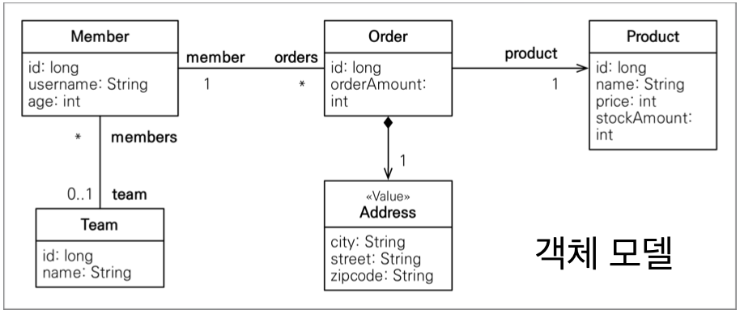
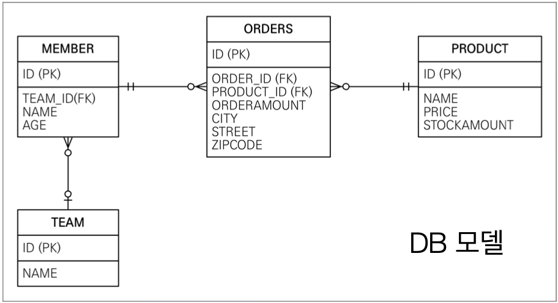

# _객체지향 쿼리 언어(JPQL)_
## _객체지향 쿼리 언어 소개_
<br>

* ### _JPA는 다양한 쿼리 방법을 지원_ 
  * JPQL   
  * JPA Citeria   
  * QueryDSL   
  * 네이티브 SQL   
  * JDBC API 직접 사용, MyBatis, SpringJdbcTemplate 함께 사용   
<br>

* ### _JPQL 소개_
  * JPA를 사용하면 엔티티를 중심으로 개발하게 된다.
  * 모든 DB 데이터를 엔티티 변환해서 검색하는 것은 불가능
  * 애플리케이션이 필요한 데이터만 DB에서 불러오려면 결국 `검색 조건이 포함된 SQL이 필요`하다.
  * JPA는 SQL을 추상화한 JPQL이라는 객체 지향 쿼리 언어를 제공한다.
  * SQL과 문법이 유사하다.
    * SELECT, FROM, WHERE, GROUP BY, HAVING, JOIN 지원
  * JPQL은 `테이블이 아닌 엔티티 객체를 대상으로 쿼리`
    * SQL은 데이터베이스 테이블을 대상으로 쿼리   
    <br>

    ```Java
    try {
        String jpql = "select m From Member m where m.username like '%hello%'";

        List<Member> result = entityManager.createQuery(jpql, Member.class).getResultList();
        
        transaction.commit();
    }
    ```
    >entityManager.createQuery(jpal, `Member.class`).getResultList();   
      * 테이블이 아닌 엔티티 객체를 대상으로 쿼리문을 날린다    
    <br>

    ```SQL
    Hibernate: 
    /* select
        m 
    from
        Member m 
    where
        m.username like '%hello%' */ select
            member0_.member_id as member_i1_1_,
            member0_.locker_id as locker_i3_1_,
            member0_.team_id as team_id4_1_,
            member0_.username as username2_1_ 
        from
            Member member0_ 
        where
            member0_.username like '%hello%'
    ```
    >Member Entity의 매핑 정보를 확인해서 적절한 SQL문으로 번역후 실행
* ### _Criteria 소개_  
    JPQL에서 작성한 `"select m from Member m where m.username like '%hello%'` 코드는 사실 단순한 String이다.   
    단순한 문자이므로 동적 쿼리를 만들기에는 엄청난 제약과 어려움이 동반한다.   
    이러한 어려움을 개선할 뿐 아니라 다른 장점들도 존재하는 것이 `Cirteria`이다.   
    ```Java
    try {
        //Criteria 사용 준비
        CirteriaBuilder criteriaBuilder = entityManager.getCriteriaBuilder();
        CriteriaQuery<Member> query = criteriaBuilder.createQuery(Member.class);

        //루트 클래스(조회를 시작할 클래스)
        Root<Member> m = query.from(Member.class);
        
        //쿼리 생성
        CriteriaQuery<Member> cq = query.select(m).where(criteriaBuilder.equal(m.get("username"), "hello"));
        List<Member> result = entityManager.createQuery(cq).getResultList();

        transaction.commit();
    }
    ```
      
        
    ```SQL
    Hibernate: 
        /* select
            generatedAlias0 
        from
            Member as generatedAlias0 
        where
            generatedAlias0.username=:param0 */ select
                member0_.member_id as member_i1_1_,
                member0_.locker_id as locker_i3_1_,
                member0_.team_id as team_id4_1_,
                member0_.username as username2_1_ 
            from
                Member member0_ 
            where
                member0_.username=?
    ```
    `자바 코드로 SQL`문을 짜기 떄문에 오타가 발생하면 컴파일러 레벨에서 오류를 잡을 수 있는 업청난 장점이 있다.   
    또한 조건문 등을 확용해서 동적 쿼리를 작성하기에 훨신 수월하다.   
    하지만 치명적인 단점은 SQL스럽지 못하다는점과 코드를 보기 어려우며, 실용성이 없기 때문에 실무에서는 잘 사용하지않는다.     
    따라서 Criteria 대신에 `QueryDSL`사용을 권장한다.   
* ### _QueryDSL 소개_   
    문자가 아닌 자바코드로 JPQL을 작성할 수 있으므로 컴파일 시점에 문법 오류를 찾을 수 있으며, 동적쿼리 작성이 편리다하는 장점을 갖는다.   
    또한 Cirteria처럼 코드가 복잡하지 않으며 단순하고 쉽기 때문에 실무 사용을 권장한다.   
* ### _네이티브 SQL 소개_   
    JPA가 제공하는 SQL을 직접 사용하는 기능을 갖고 있으며, JPQL로 해결할 수 없는 특정 데이터베이스에 의존적인 기능을 갖는다.   
    예를 들면, 오라클 CONNECT BY, 특정 DB만 사용하는 SQL힌트 등...   
    ```Java
    try {
        entityManager.createNativeQuery("select member_id, locker_id, team_id, username form Member").getResultList();

        transaction.commit();
    }
    ```

    ```SQL
    Hibernate: 
        /* dynamic native SQL query */ select
            member_id,
            locker_id,
            team_id,
            username 
        from
            MEMBER
    ```   
* ### _JDBC 직접 사용, SpringJdbcTemplate 등_   
    JPA를 사용하면서 JDBC 커넥션을 직접 사용하거나, 스프링 JdbcTemplate, 마이바티스 등을 함께 사용 가능하다.   
    `단 영속성 컨텍스트를 적절한 시점에 강제로 flush()호출이 필요하다.`
    ```Java
    try {
        Member member = new Member();
        member.setUsername("memberA");

        entityManager.persist(member);

        //flush()가 호출되는 시점 --> commit(), Query를 날릴때
        System.out.println("=========================");
        List<Member> resultList = entityManager.createNativQuery("select member_id, locker_id, team_id, username from Member", Member.class)
                    .getResultList();
        System.out.println("=========================");

        for (Member member1 : resultList) {
            System.out.println("member1 = " + member1);
        }

        transaction.commit();
    }
    ```

    ```SQL
    ===========================
    Hibernate: 
        /* insert hellojpa.relationmapping.Member
            */ insert 
            into
                Member
                (locker_id, team_id, username, member_id) 
            values
                (?, ?, ?, ?)
    Hibernate: 
        /* dynamic native SQL query */ select
            member_id,
            locker_id,
            team_id,
            username 
        from
            MEMBER
    Hibernate: 
        select
            team0_.team_id as team_id1_4_0_,
            team0_.name as name2_4_0_ 
        from
            Team team0_ 
        where
            team0_.team_id=?
    ===========================
    member1 = hellojpa.relationmapping.Member@310aee0b
    member1 = hellojpa.relationmapping.Member@1f1ff879
    ```
    > flush()가 select Query가 나가기 이전에 먼저 호출되서 insert Query가 나간것을 확인할 수 있다.   
    flush()는 transaction.commit()이 호출되는 시점에 호출되기도 하지만, `entityManager를 통해서 Query를 내보내는 바로 직전에도 flush()가 호출된다.`   
    JPA관련 기술을 사용할 때는 위의 결과처럼 entityManger를 통해서 Query를 내보낼때 자동으로 flush()가 호출되도록 설정되어있지만, JPA관련 기술이 아닌것을 사용하면서 commit()호출시점 이전에 entityMamger를 통해서 Query를 날리는 코드를 작성했다면 자동으로 flush()가 호출되지 않아 DB에 데이터는 null값으로 설정된다.   
    따라서 JPA 관련 기술이 아닌 다른 기술을 사용할떄는 `entityManager를 통해 Query를 내보내는 코드 바로 이전에 flush()를 기입`해서 수동적으로 flush()를 호출해서 
    사용하도록 한다.    

---    
## _JPQL(Java Persistence Query Language)_   
## _JPQL - 기본 문법과 기능_   
* ### _JPQL 소개_   
  * JPQL은 객체지향 쿼리 언어다. 따라서 테이블을 대상으로 쿼리를 하는 것이 아니라 `엔티티 객체를 대상으로 쿼리`한다.  
  * JPQL은 SQL을 추상화해서 특정데이터베이스 SQL에 의존하지 않는다.   
  * DB는 SQL만 받을 수 있으므로 `JPQL은 결국 엔티티 객체의 매핑 정보와 방언이 조합돼서 SQL로 변환돼 실행된다.`  

  
<br>

* ### _JPQL문법_   
    ```
    select_문 :: = 
        select_절
        from_절
        [where_절]
        [groupby_절]
        [having_절]
        [orderby_절]
    update_문 :: = update_절[where_절]
    delete_문 :: = delete_절[where_절]
    ```
  > select m from Member [as] m where m.age > 18   
  * 엔티티와 속성은 대소문자를 구분한다(Member, age)
  * JPQL 키워드는 대소문자를 구분하지 않는다(SELECT, FROM, where)
  * `테이블 이름이 아닌 엔티티 이름을 사용한다.` 
    * 엔티티 이름: @Entity(name = ""), defalut = Class Name
    * 관례상 default를 사용한다
  * `별칭은 필수(m)`, (as는 생량이 가능하다)
* ### _집합과 정렬_   
    ```SQL
    select
        COUNT(m),    /* 회원수 */
        SUM(m.age),  /* 나이 합 */
        AVG(m.age),  /* 평균 나이 */
        MAX(m.age),  /* 최대 나이 */
        MIN(m.age)   /* 최소 나이 */
    from Member m
    ```
  * GROUP BY, HAVING
  * ORDER BY

<br>

* ### _TypeQuery, Query_   
  * `TypeQuery`: 반환 타입이 명확할 때 사용
    ```Java
    TypeQuery<Memer> query1 = entityManger.createQuery(
        "select m from Member m", Member.calss);

    TypeQuery<String> query3 = entityManger.createQuery(
        "select m.username from Member m", String.class);
    ```
    >createQuery() 두 번쨰 파라미터에는 반홥타입 클래스에 대한 정보를 넘겨줄 수 있다.   
    타입 정보는 아무거나 줄 수 없으며, 기본적으로 엔티티 타입을 넘겨줘야한다.   
  * `Query`: 반환 타입이 명확하지 안을 때 사용
    ```Java
    Query query3 = entityManger.createQuery(
        "select m.username, m.age from Member m");
    )
    ```
    >String username, int age로 서로 타입이 다르므로 createQuert()으 두 번째 파라미터에 반환 타입을 명시할 수 없다.   

<br>

* ### _결과 조회 API_   
  * `query.getResultList()`: 결과가 하나 이상일 때 즉, 결과가 컬렉션일 경우 리스트 반환  
    ```Java
    String jpql = "select m from Member m";

    TypeQuery<Mmeber> query = entityManager.createQuery(jpql, Member.class);
    List<Member> resultList = query.getResultList();

    for (Member member : resultList) {
        System.out.println("member = " + member.getUsername);
    }
    ```
    >member = memberA

    * 결과가 없으면 빈 리스트 반환   
    * NullPointException에 대한 걱정을 할 필요 없다.  
  * `query.getSingleResult()`: 결과가 정확히 하나, 단일 객체 반환   
    * 결과가 없으면: javax.persistence.NoResultException

        ```Java
        try {
            String jpql = "select t from Team t";

            TypedQuery<Team> query = entityManager.createQuery(jpql, Team.class);
            Team singleResult = query.getSingleResult();

            System.out.println("singleResult = " + singleResult);

            transaction.commit();
        }    
        ```
        >javax.persistence.NoResultException: No entity found by query
    * 둘 이상이면: javax.persistence.NoUniqueResultException   

        ```Java
        try {
            Member member = new Member();
            member.setUsername("memberB");
            member.setAge(29);

            entityManager.persist(member);

            String jpql = "select m from Member m";
            TypeQuery<Member> query = entityManager.createQuery(jpql, Member.class);
            Member singleResult = query.getSingleResult();

            System.out.println("member = " + sigleResult.getUsername());
        }
        ``` 
        >Javax.persistence.NoUniqueResultException: query did not retuern a unique result: 2

<br>

* ### _파라미터 바인딩 - 이름 기준, 위치 기준_   
  * 이름 기준 파라미터 바인딩   
    ```Java
    try {
        String jpql = "select m from Member m where m.age = :age";
        List<Member> result = entityManager.createQuery(jpql, Member.class)
                .setParameter("age", 28)
                .getResultList();
    
        for (Member member : result) {
            System.out.println("member = " + member.getAge());
        }

        tansaction.commit();
    }
    ``` 
  * 위치 기준 파라미터 바인딩   
    >`select m from Member m where m.username = :1;`   
    위치 기준 파라미터 바인딩은 숫자로 표기되므로, 만약 엔티티에 필드가 추가되거나 삭제될 경우 구분하기 힘들어지기 떄문에 사용하지 않는다.

<br>

* ### _프로젝션_   
  * SELECT 절에 조회할 대상을 지정하는 것
  * 프로젝션 대상: 엔티티, 임베디드 타입, 스칼라 타입(숫자, 문자등 기본 데이터 타입)
  * SELECT `m` FROM Member m -> 엔티티 프로젝션  
 
    ```Java
    try {
        String jpql = "select m from Member m";

        List<Member> resultList = entityManager.createQuery(jpql, 
        Member.class)
                .getResultList();

        Member member = resultList.get(0);
        member.setAge(20);

        transcation.commit();
    }
    ``` 
    >`getResultList()`를 통해서 엔티티들이 반환됐다.   
    반환된 `List<Member>`의 Member 엔티티들은 영속성 컨텍스트에서 관리가 될까?   
    `member.setAge(20)`을 호출해서 DB에 값이 바뀌면 영속성 컨텍스트에서 관리되고, 값이 바뀌지 않으면 영속성 컨텍스트에서 관리되지 않는것이다.   
    ```SQL
    Hibernate: 
        /* update
            jpql.Member */ update
                Member 
            set
                age=?,
                team_id=?,
                username=? 
            where
                member_id=?
    ```
    >update Query가 나가면서 DB의 값이 바뀐것을 확인할 수 있다.   
    엔티티 프로젝션을 사용하면 `select m From Member m`의 select절의 대상은 전부 영속성 컨텍스트에서 관리가 된다.   
  * SELECT `m.team` FROM Member m --> 엔티티 프로젝션
    ```Java
    try {
        String jpql = "select m.team from Member m";

        Team singleResult = entityManger.createQuery(jpql, Team.class)
                .getSingleResult();
        
        tarnsaction.commit();
    }
    ``` 
    ```SQL
    Hibernate: 
        /* select
            m.team 
        From
            Member m */ select
                team1_.team_id as team_id1_3_,
                team1_.name as name2_3_ 
            from
                Member member0_ 
            inner join
                Team team1_ 
                    on member0_.team_id=team1_.team_id    
    ```
    >team 테이블과 inner join   
    * JOIN Query가 호출되는 이유
      * JPQL은 엔티티 매핑 정보와 방언은 조합하여 SQL문으로 번역하여 호출된다.
      * Member Entity는 @ManyToOne 으로 Team Entity와 연관관계 매핑상태이다.
  * SELECT `o.address` FROM Order o --> 임베디드 타입 프로젝션 
    ```Java
    try {
        String jpql = "select o.address from Order o";

        List<Address> resultList = entityManger.createQuery(jpql, Address.class)
                .getReultList();

        transaction.commit();
    }
    ```   
    ```SQL
    Hibernate: 
        /* select
            o.address 
        From
            
        Order o */ select
            order0_.city as col_0_0_,
            order0_.street as col_0_1_,
            order0_.zipcode as col_0_2_ from
                ORDERS order0_    
    ```
    >임베디드 타입 프로젝션의 한계는 임베디드 타입만으로는 조회가 불가능하며, 엔티티로부터 시작해야한다.   
  * SELECT `m.username, m.age` FROM Member m --> 스칼라 타입 프로젝션  
  * DISTINCT로 중복 제거

<br>

* ### _프로젝션 - 여러 값 조회_   
  * SELECT `m.username, m.age` FROM Member m
  1. Query 타입으로 조회
    ```Java
    try {
        String jpql = "select m.username, m,age from Member m";

        List resultList = entityManager.createQuery(jpql)
                .getResultList();

        Object o = resultList.get(0);
        Objcet[] result = (Object[]) o;  //타입 캐스팅
        System.out.println("m.username = " _ result[0]);
        System.out.println("m.age = " _ result[1]);

        transaction.commit();
    }
    ```
    >타입을 명시할 수 없으므로 Object로 반환하는 것이다.   
    내부적으로 Object[]이 들어가있으므로 타입 캐스팅을 해준다.    
    
    ```
    m.username = member1
    m.age = 20
    ```
  2. Object[] 타입으로 조회
    ```Java
    try {
        String jpql = "select m.username, m.age from Member m";

        List<Objcet[]> resultList = entityManager.createQuery(Jpql)
                .getResultList();
        
        Object[] result = resultList.get(0);
        System.out.println("m.username = " + result[0]);
        System.out.println("m.age = " + result[1]);

        transaction.commit
    }
    ```
    >`제네릭에 Object[]를 선언`하는 방법   
  3. new 명령어로 조회
    ```Java
    public class MemberDTO {

        private String username;
        private int age;

        public MemberDTO(String username, int age) {
            this.username = username;
            this.age = age;
        }

        //Getter, Setter
    }
    ```
    ```Java
    try {
        String jpql = "select new jpal.MemberDTO(m.username, m.age) from Member m";

        List<MemberDTO> result = entityManager.createQuery(jpql, MemberDTO.class)
                .getResultList();
        
        MemberDTO memberDTO = result.get(0);
        System.out.println("m.username = " + memgerDTO.getUsername());
        System.out.println("m.age = " + memgerDTO.getAge());
        
        transaction.commit();
    }
    ```
    >단순 값을 DTO로 바로 조회   
    페키지 명을 포함한 전체 클래스 명 입력   
    순서와 타입이 일치하는 생성자 필요   

<br>

* ### _페이징 API_   
  * JPA는 페이징을 다음 두 API로 추상화
  * `setFirstResult`(int startPosition): 조회 시작 위치(0부터 시작)
  * `setMaxtResult`(int maxResult): 조회할 테이터 수

<br>

* ### _페이징 API 예시_   
    ```Java
    try {
        String jpql = "select new jpql.MemberDTO(m.username, m.age) from Member m order by m.age desc";

        List<MemberDTO> result = entityManager.createQuery(jpql, MemberDTO.class)
                .setFirstResult(1)
                .setMaxResult(10)
                .getResultList();
        
        System.out.println("result.size = " + result.size());
    }
    ```
    ```SQL
    Hibernate: 
        /* select
            m 
        from
            Member m 
        order by
            m.age desc */ select
                member0_.member_id as member_i1_0_,
                member0_.age as age2_0_,
                member0_.team_id as team_id4_0_,
                member0_.username as username3_0_ 
            from
                Member member0_ 
            order by
                member0_.age desc limit ? offset ?
    result.size = 10
    ```
    >limit 숫자: 출력할 행의 수   
    offeset 숫자: 몇 번째 row 부터 출력   
    limit 숫자1, 숫자2: 숫자1 번째 row부터 출력해서 숫자2 개의 행 출력    

<br>

* ### _조인_   
  * 내부 조인: SELECT m FROM Member m [INNER] JOIN m.team t
    ```Java
    try {
        String jpql = "select m from Member m join m.team t";

        List<Member> result = entityManager.createQuery(jpql, Member.class)
                .getResultList();

        transaction.commit();
    }
    ```
    >inner join에서 join 생량 가능    
    ```SQL
    Hibernate: 
        /* select
            m 
        from
            Member m 
        inner join
            m.team t */ select
                member0_.member_id as member_i1_0_,
                member0_.age as age2_0_,
                member0_.team_id as team_id4_0_,
                member0_.username as username3_0_ 
            from
                Member member0_ 
            inner join
                Team team1_ 
                    on member0_.team_id=team1_.team_id    
    ```
    >Member class의 `@ManyToOne(fetch = FetchType.LAZY)`   
  * 외부 조인: SELECT m FROM Member m LEFT [OUTER] JOIN m.team t
  * 세타 조인: select count(m) from Member m, Team t where m.username = t.name

<br>

* ### _조인 - ON 절_   
  * ON절을 확용한 조인(JPA 2.1부터 지원)
    1. 조인 대상 필터링   
    2. 연관관계 없는 엔티티 외부 조인(하이버네이트 5.1부터)   

<br>

* ### _1. 조인 대상 필터링_   
  * $ex.$ 회원과 팀을 조인하면서, 팀 이름이 A인 팀만 조인
    >JPQL: SELECT m, t FROM Member m [LEFT] JOIN m.team t `on` t.name = 'A'   
    SQL: SELECT m.*, t.* FROM Member m [LEFT] JOIN Team t `ON` m.TEAM_ID = t.id and t.name = 'A' 

<br>

* ### _2. 연관관계 없는 엔티티 외부 조인_   
  * $ex.$ 회원의 이름과 팀의 이름이 같은 대상 외부 조인   
    >JPQL: SELECT m, t FROM Member m [LEFT] JOIN Team t `on` m.username = t.name   
    SQL: SELECT m.*, t.* FROM Member m [LEFT] JOIN Team t `ON` m.username = t.name   

<br> 

* ### _서브 쿼리_   
  * 나이가 평균보다 많은 회원
    >select m from Member m where m.age > `(select avg(m2.age) from Memver m2)`
  * 한 건이라도 주문한 고객
    >select m from Member m where `(select count(o) from Object o where m = o.member)`

<br>

* ### _ 서브 쿼리 지원 함수_   
  * [NOT] EXISTS (subquery): 서브쿼리에 결과가 존해하면 참   
    * {ALL|ANY|SOME} (subquery)
    * ALL: 모두 만족하면 참   
    * ANY, SOME: 같은 의미, 조건을 하나라도 만족하면 참
  * [NOT] IN (subquery): 서브쿼리의 결과 중 하나라도 같은 것이 있으면 참

<br>

* ### _서브 쿼리 - 예제_   
  * $ex.$ 팀A 소속인 회원
    >select m from Member m where `exist` (select t from m.team t where t.name = '팀A')
  * $ex.$ 전체 상품 각각의 재고보다 주문량이 많은 주문들   
    >select o from Order o where o.orderAmount > `ALL` (select p.stockAmount from Product p)
  * $ex.$ 어떤 팀이든 팀에 소속된 회원
    >select m from Member m where m.team = `ANY` (select t from Team t)

<br>

* ### _JPA 서브 쿼리 한계_   
  * JPA는 WHERE, HAVING 절에서만 서브 쿼리 사용 가능    
  * SELECT 절도 가능(하이버네이트에서 지원)
  * `FROM 절의 서브 쿼리는 현재 JPQL 에서 불가능`
    * `조인으로 풀 수 있으면 풀어서 해결`

<br>

* ### _ JPQL 타입 표현식_   
```Java
try {
    Team team = new Team();
    team.setName("teamA");

    entityManager.persist(team);

    Member member = new Member();
    member.setUsername("member1");
    member.setAge(10);
    member.setTeam(team);
    entityManager.persist(member);

    entityManager.flush();
    entityManager.clear();

    String query = "select m.username, 'HELLO', true from Member m ";
    List<Object[]> result = entityManager.createQuery(query)
            .getResultList();

    for (Object[] objects : result) {
        System.out.println("objects = " + objects[0]);
        System.out.println("objects = " + objects[1]);
        System.out.println("objects = " + objects[2]);
    }

    transaction.commit();
}
```
```
objects = member1
objects = HELLO
objects = true
```
ENUM   
```Java
try {
    Team team = new Team();
    team.setName("teamA");

    entityManager.persist(team);

    Member member = new Member();
    member.setUsername("member1");
    member.setAge(10);
    member.setTeam(team);
    member.setType(MemberType.ADMIN);
    entityManager.persist(member);

    entityManager.flush();
    entityManager.clear();

    String query = "select m.username, 'HELLO', true from Member m " +
                    "where m.type = jpql.MemberType.ADMIN";
    List<Object[]> result = entityManager.createQuery(query)
            .getResultList();

    for (Object[] objects : result) {
        System.out.println("objects = " + objects[0]);
        System.out.println("objects = " + objects[1]);
        System.out.println("objects = " + objects[2]);
    }

    transaction.commit();
} 
```
파라미터 바인딩을 해준다   
```Java

String query = "select m.username, 'HELLO', true from Member m " +
                "where m.type = :userType";
List<Object[]> result = entityManager.createQuery(query)
        .setParameter("userType", MemberType.ADMIN)
        .getResultList();
```
* ### _조건식 - CASE식_   
기본 CASE식   
```Java
try {
    Team team = new Team();
    team.setName("teamA");

    entityManager.persist(team);

    Member member = new Member();
    member.setUsername("member1");
    member.setAge(10);
    member.setTeam(team);
    member.setType(MemberType.ADMIN);
    entityManager.persist(member);

    entityManager.flush();
    entityManager.clear();

    String query = "select " +
                           "case when m.age <= 10 then '학생요금' " +
                           "     when m.age >= 60 then '경로요금' " +
                           "     else '일반요금' " +
                           "end " +
                   "from Member m";
    List<String> result = entityManager.createQuery(query, String.class)
            .getResultList();

    for (String s : result) {
        System.out.println("s = " + s);
    }

    transaction.commit();
}
```   
COALESCE   
```Java
try {
    Team team = new Team();
    team.setName("teamA");

    entityManager.persist(team);

    Member member = new Member();
    member.setUsername(null);
    member.setAge(10);
    member.setTeam(team);
    member.setType(MemberType.ADMIN);
    entityManager.persist(member);

    entityManager.flush();
    entityManager.clear();

    String query = "select coalesce(m.username, '이름 없는 회원') from Member m ";
    List<String> result = entityManager.createQuery(query, String.class)
            .getResultList();

    for (String s : result) {
        System.out.println("s = " + s);
    }

    transaction.commit();
}
```
NULLIF   
```Java
try {
    Team team = new Team();
    team.setName("teamA");

    entityManager.persist(team);

    Member member = new Member();
    member.setUsername("관리자");
    member.setAge(10);
    member.setTeam(team);
    member.setType(MemberType.ADMIN);
    entityManager.persist(member);

    entityManager.flush();
    entityManager.clear();

    String query = "select nullif(m.username, '관리자') from Member m ";
    List<String> result = entityManager.createQuery(query, String.class)
            .getResultList();

    for (String s : result) {
        System.out.println("s = " + s);
    }

    transaction.commit();
}
```
* ### _JPQL 기본 함수_   
SIZE --> select size(t.Members) from Team t   
컬렉션의 크기를 반환한다    
* ### _사용자 정의 함수 호출_   
```Java
            String query = "select function('group_concat', m.username) from Member m ";
            List<String> result = entityManager.createQuery(query, String.class)
                    .getResultList();

            for (String s : result) {
                System.out.println("s = " + s);
            }

            transaction.commit();
```
injectLanguage 설정을 Hibernate로 바꾼다면   
select group_concat(m.username) from Member m    
## _JPQL - 경로 표현식_   
* ### _경로 표현식_   
세가지 경로 필드가 존재한다(상태 필드, 단일 값 연괄 필드, 컬렉션 값 연관 필드)   
어떤 결로 필드로 탐색하느냐에 따라 내부적으로 동장하는 방식 즉 결과가 달라진다  
즉 이 세가지를 꼭 구분해서 이해해야 한다   
select m.username -> 상태 필드로 객체 그래프를 탐색했다   
* ### _결로 표현식 특징_   
상태 필드는 경로 탐색의 끝 이므로 더이상 탐색이 불가능하다  
단일 값 연관 경로는 `묵시적 내부 조인이 발생한다`   
```Java
            String query = "select m.team From Member m";
            List<Team> result = entityManager.createQuery(query, Team.class)
                    .getResultList();

            for (Team s : result) {
                System.out.println("s = " + s);
            }

            transaction.commit();
```
```SQL
Hibernate: 
    /* select
        m.team 
    From
        Member m */ select
            team1_.team_id as team_id1_3_,
            team1_.name as name2_3_ 
        from
            Member member0_ 
        inner join
            Team team1_ 
                on member0_.team_id=team1_.team_id
```
JPQL은 select m.team 이지만 SQL은 join Team team 을 해서 team을 select 프로젝션에 나열했다   
객체 입장에서는 .을 이요해서 탐색을 하면 되지만 DB입장에서는 Join을 해서 탐색을 해야한다   
이떄 발생한 Join을 묵시적 내부 조인 이라 한다   
실무에서는 JPQL을 묵시적 내부조인이 발생하지 않도록 작성해야 한다   
컬렉션 값 연관 경로는 묵시적 내부 조인이 발생하며 탐색이 불가능하다   
따라서 From 절에 명시적 조인을 통해서 별칭을 얻으면 별칭을 통해 탐색한다   
select m.username From Team t Join t.members m   
From 절에서 명시적 조인을 하면 별칭을 얻을 수 있다   
영한이가 권장하는 방법은 위의 것들을 다 무시하고 묵시적 조인을 사용하지 않는것이다   
명시족 조인을 사용해야 한다  실제 쿼리 튜닝하기가 쉽다   
* ### _명시적 조인, 묵시적 조인_   
묵시적 조인: 경로 표현식에 의해 묵시적으로 SQL 조인 발생   
내부조인(innerJoin)만 가능 
외부 조인은 불가능하다 외부조인을 하고싶다면 명시적 조인을 하면 된다   
Select m From Member m left join m.team t   
* ### _경로 표현식 - 예제_   
select o.member.team From Order o   
join이 두 번 발생하다   
select t.members from Team   
members가 컬렉션이지만 끝을 냈으므로 성공, 더 들어가게 되면 탐색 불가로 실패   
select t.members.username From Team t   
members를 그대로 가져오거나 .size() 정도만 가능하다   
## _JPQL - 페치 조인(fetch join)_   
* ### _엔티티 페치 조인_   
SQL   
즉시로딩 SQL이랑 똑같은 쿼리문   
하지만 페치 조인은 쿼리로 내가 원하는 어떤 객체 그래프를 한 번에 조회할것이라는 것을  내가 직접 명시적으로 동적인 타이밍에 정할 수 있다   
* ### _테이블 세팅_   
```Java
        try {
            Team teamA = new Team();
            teamA.setName("팀A");

            entityManager.persist(teamA);

            Team teamB = new Team();
            teamB.setName("팀B");

            entityManager.persist(teamB);

            Member member1 = new Member();
            member1.setUsername("회원1");
            member1.setTeam(teamA);

            entityManager.persist(member1);

            Member member2 = new Member();
            member2.setUsername("회원2");
            member2.setTeam(teamA);

            entityManager.persist(member2);

            Member member3 = new Member();
            member3.setUsername("회원3");
            member3.setTeam(teamB);

            entityManager.persist(member3);

            entityManager.flush();
            entityManager.clear();

            String query = "select m From Member m";
            List<Member> result = entityManager.createQuery(query, Member.class)
                    .getResultList();

            for (Member member : result) {
                System.out.println("member = " + member);
            }

            transaction.commit();
        }
``` 
```SQL
Hibernate: 
    /* select
        m 
    From
        Member m */ select
            member0_.member_id as member_i1_0_,
            member0_.age as age2_0_,
            member0_.team_id as team_id5_0_,
            member0_.type as type3_0_,
            member0_.username as username4_0_ 
        from
            Member member0_
member = Member{id=3, username='회원1', age=0}
member = Member{id=4, username='회원2', age=0}
member = Member{id=5, username='회원3', age=0}
```
* ### _페치 조인 사용 코드_   
Member 와 Team 의 연관관계가 ManyToOne이며 지연로딩(LAZY)설정   
```Java
@Entity
public class Member {
    
    @ManyToOne(fetch = FetchType.LAZY)
    @JoinColumn(name = "team_id")
    private List<Team> team;


}
```
member의 이름과 member와 연관관계 매핑된 team 의 이름을 같이 출력하는 코드 작성   
```Java
            for (Member member : result) {
                System.out.println("member = " + member.getUsername() + ", " + member.getTeam().getName());
                //회원1, 팀A(SQL)
                //회원2, 팀A(1차 캐시)
                //회원3, 팀B(SQL)

                //회원 100명 --> N + 1 
            }

```
Team 은 프록시로 들어왔다가 member.getTeam().getName() 호출 시점에 DB에 쿼리를 날린다    
페치 조인 사용 코드 사용   
```Java
            String query = "select m From Member m join fetch m.team";
            List<Member> result = entityManager.createQuery(query, Member.class)
                    .getResultList();

            for (Member member : result) {
                System.out.println("member = " + member.getUsername() + ", " + member.getTeam().getName());
            }
```
```SQL
Hibernate: 
    /* select
        m 
    From
        Member m 
    join
        fetch m.team */ select
            member0_.member_id as member_i1_0_0_,
            team1_.team_id as team_id1_3_1_,
            member0_.age as age2_0_0_,
            member0_.team_id as team_id5_0_0_,
            member0_.type as type3_0_0_,
            member0_.username as username4_0_0_,
            team1_.name as name2_3_1_ 
        from
            Member member0_ 
        inner join
            Team team1_ 
                on member0_.team_id=team1_.team_id
```
result에 담기는 순간 team은 프록시가 아닌 실제 엔티티가 담긴다    
영속석 컨텍스트에 team의 데이터가 올가가있다   
지연로딩으로 설정을 해도 페치 조인이 우선순위를  갖는다   
* ### _컬렉션 페치 조인_   
```Java
            String query = "select t From Team t join fetch t.members";
            List<Team> result = entityManager.createQuery(query, Team.class)
                    .getResultList();

            for (Team team : result) {
                System.out.println("member = " + team.getName() + ", " + team.getMembers().size());
            }
```
```SQL
member = 팀A, 2
member = 팀A, 2
member = 팀B, 1
```
컬렉션 페치 조인에서 조심해야하는 부분   
member = 팀A, 2, member = 팀A, 2가 중복으로 출력,.,,   
DB입장에서 1:N조인을 하면 데이터가 뻥튀기가 된다???   
테이블 표 참고   
팀A 입장에서 Member 테이블과 조인하게 팀 A에 소속된 회원이 2명이므로 기본적으로 생성되는 Join데이터를 아래 테이플과같이 생겼다   
팀A 입장에서는 row 하나인데 Member가 두명이므로 row가 두줄이 된다   
JPA는 row가 두 줄이 된지 모른다  외냐하면 팀A에 회원이 몇명이 있을지 모르기 때문이다    
따라서 이 타이밍에 JPA가 별로 할 수 있는것이 없다  그래서 그냥 row개를 받아들인다   
이것이 객체와 RDB의차이라 볼 수 있다 객체 입장에서 어떻게 할 수 있는 것이 없다   
팀A의 PK가 1로 같기 떄문에 영속성 컨텍스트 1차 캐시에는 하나로 등록되지만 조회한 컬렉션에는 같은 주소값을 가진 두 줄이 생성된다   
* ### _페치 조인과 DISTINCT_   
SQL의 DISTINCT만으로는 중복을 전부 제거할 수 없다   
따라서 JPQL의 DISTINCT 2가지 추가 기능 제공   
* ### _페치 조인의 특징과 한계_   
페치 조인 대상에는 별칭을 줄 수 없다.   
select t From Team t join fetch t.members [as] m   
페치 조인은 기본적으로 나랑 연관된 엔티티를 전부 끌고오는 것이다  
페치 조인의 컬렉션은 딱 한 개만 조인할 수 있다   
## _다형성 쿼리_   
## _엔티티 직접 사용_   

## Named 쿼리
## 벌크 연산
