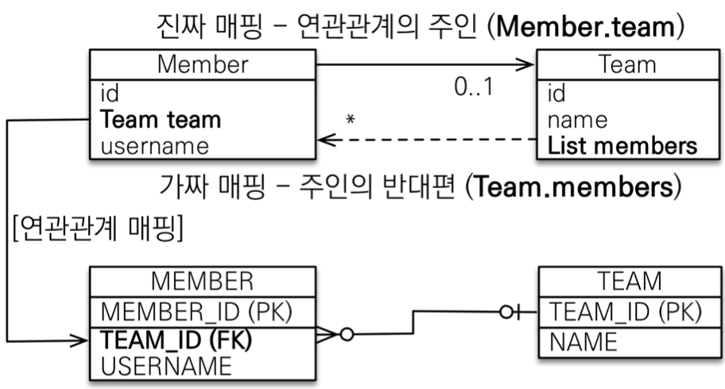

* ### 데이터 베이스 방언
  * 방언: SQL 표준을 지키지 않는 특정 데이터베이스만의 고유한 기능 
  * JPA는 특정 데이터베이스에 종속되지 않는다.
  * 각각의 데이터베이스가 제공하는 SQL 문법과 함수는 조금씩 다르다 
    * 가변 문자: MySQL은 VARCHAR, Oracle은 VARCHAR2
    * 문자열을 자르는 함수: SQL 표준은 SUBSTRING(), Oracle은 SUBSTR()
    * 페이징: MySQL은 LIMIT, Oracle은 ROWNUM
       
  * `hibernate.dialect` 속성에 지정
    * H2: org.hibernate.dialect.H2Dialect
    * Oracle 10g: org.hibername.dialect.Oracle10gDialect
    * MySQL: org.hibernate.dialect.MySQL5InnoDBDialect
    * 하이버네이트는 40가지 이상의 데이터베이스 방언 지원
* ### 트랜잭션(Transaction)
  * `데이터베이스의 상태를 변화`시키기 위해서 수행하는 `작업의 단위`
    * 데이터베이스의 상태를 변화시킨다?
    * SQL을 이용해서 데이터베이스를 접근하는 것을 의미한다.
      * SELECT
      * INSERT
      * DELETE
      * UPDATE
    * 작업 단위
      * 많은 SQL 명령문들을 사람이 정의하는 기준에 따라 정하는 것을 의미한다.
        * 작업의 단위는 질의어 한 문장이 아니다.
  * 트랜잭션의 특징
    * `원자성(Atomictiy)`
      * 트랜잭션이 데이터베이스에 모두 반영되던가, 아니면 전혀 반영되지 않아야 한다
      * 트랜잭션은 사람이 설계한 논리적인 작업 단위로서, 일처리는 작업단위 별로 이루어 져야 사람이 다루는데 무리가 없다.
      * 만약 트랜잭션 단위로 데이터가 처리되지 않는다면, 설계한 사람은 데이터 처리 시스템을 이해하기 힘들 뿐만 아니다, 오작동 했을시 원인을 찾기가 매우 힘들어진다.
    * `일관성(Consistnecy)`
      * 트랜잭션의 작업 처리 결과가 항상 일관성 있어야 한다
      * 트랜잭션이 진행되는 동안에 데이터베이스가 변경 되더라도 업데이트된 데이터베이스로 트랜잭션이 진행되는것이 아니라, 처음에 트랜잭션을 진행 하기 위해 참조한 데이터베이스로 진행된다.
      * 이렇게 함으로써 각 사용자는 일관성 있는 데이터를 볼 수 있을 것이다.
    * `독립성(Isolation)`
      * 둘 이상의 트랜잭션이 동시에 실행되고 있을 경우 어떤 하나의 트랜잭션이라도, 다른 트랜잭션의 연산에 개입할 수 없다
      * 하나의 특정 트랜잭션이 완료될떄까지, 다른 트랜잭션이 특정 트랜잭션의 결과를 참조할 수 없다.
    * `지속성(Durability)`
      * 트랜잭션이 성공적으로 완료됐을 경우, 결과는 영구적으로 반영되어야 한다.
  * 트랜잭션의 Commit, Rollback 연산
    * Commit
      * 하나의 트랜잭션이 성공적으로 끝나고, 데이터베이스가 일관성있는 상태에 있을 떄, 하나의 트랜잭션이 끝났다는 것을 알려주기위해 사용하는 연산
      * 수행했던 트랜잭션이 로그에 저장되며, 후에 Rollback 연산을 수행했었던 트랜잭션단위로 하는 것을 도와준다
    * Rollback
      * 하나의 트랜잭션 처리가 비정상적으로 종료되어 트랜잭션의 원자성이 깨진경우, 트랜잭션을 처음부터 다시 시작하거나, 트랜잭션의 부분적으로만 연산된 결과를 다시 취소시킨다
* ### JPA 구동 방식
    
    * Persistence.class 에서 시작
    * META-INF/persistence.xml의 설정 정보들을 읽어서 EntitiyManagerFactory.class를 생성한다
    * 필요할 떄마다 EntityManagerFactory에서 EntityManager를 호출해서 실행한다
        ```Java
        package hellojpa;

        public class JpaMain {

            public static void main(String[] args) {
                EntityManagerFactory entityManagerFatory = Persistence.createEntityManagerFactory("hello");

                EntityManager entityManager = entityManagerFatory.createEntityManager();
                //code
                entityManager.clear();

                entityManagerFatory.close();
            }
        }
        ```
        * Persistence.createEntityManagerFatory(Persistence-unitname)
* ### 객체와 테이블을 생성하고 매핑
  ```Java
  package hellojpa;

  @Entity
  public class Member{

      @Id
      private Long id;
      private String name;

      //Getter, Setter ...
  }
  ``` 
  * h2 에서 JDBC URL을 persistence에서 설정한 URL 와 동일하게 맞춪다
    ```
    create table Member(
        id bigint not null,
        name varchar(255),
        primary key (id)
    );
    ```
* ###  실습 - 회원 저장
  * 주의
    * `엔티티 매니저 팩토리`는 하나만 생성해서 애플리케이션 전체에서 공유
    * `엔티티 매니저`는 쓰레드간에 공유X (사용하고 버려야 한다)
    * `JPA의 모든 데이터 변경은 트랜잭션 안에서 실행` 
  * 회원 등록
    ```Java
    package hellojpa;

    public class JpaMain {

        public static void main(String[] args){

            EntityManagerFatory entitiManagerFatory = Persistence.createEntityManagerFactory("hello");

            EntityManager entityManager = entitiManagerFatory.createEntityManager();

            EntityTransaction transaction = entityManager.getTransaction();
            transaction.begin();

            Member member = new Member();
            member.setId(940415L);
            member.setName("전성규");

            entityManager.persist(member);

            transaction.commit();

            entitiManager.clear();

            entitiManagerFatory.close();
        }
    }
    ```
  * 회원 조회
    ```Java
    package hellojpa;

    public class JpaMain {

        public static void main(String[] args) {
            EntityManagerFactory emf = Persistence.createEntityManagerFactory("hello");

            EntityManager em = emf.createEntityManager();

            EntityTransaction tx = em.getTransaction();
            tx.begin();

            try {
                Member findMember = em.find(Member.class, 1L);
                System.out.println("findMember.Id = " + findMember.getId());
                System.out.println("findMember.Name = " + findMember.getName());

                tx.commit();
            } catch (Exception e) {
                tx.rollback();
            } finally {
                em.clear();
            }
            emf.close();
        }
    }
    ```
  * 회원 삭제
    ```Java
    package hellojpa;

    public class JpaMain {

        public static void main(String[] args) {
            EntityManagerFactory emf = Persistence.createEntityManagerFactory("hello");

            EntityManager em = emf.createEntityManager();

            EntityTransaction tx = em.getTransaction();
            tx.begin();

            try {
                Member findMember = em.find(Member.class, 1L);
                em.remove(findMember);

                tx.commit();
            } catch (Exception e) {
                tx.rollback();
            } finally {
                em.clear();
            }
            emf.close();
        }
    }
    ```
  * 회원 수정
    ```Java
    package hellojpa;

    public class JpaMain {

        public static void main(String[] args) {
            EntityManagerFactory emf = Persistence.createEntityManagerFactory("hello");

            EntityManager em = emf.createEntityManager();

            EntityTransaction tx = em.getTransaction();
            tx.begin();

            try {
                Member findMember = em.find(Member.class, 1L);
                findMember.setName("HelloJPA");
                
                tx.commit();
            } catch (Exception e) {
                tx.rollback();
            } finally {
                em.clear();
            }
            emf.close();
        }
    }
    ```   
---
* ### 영속성 컨텍스트
  * #### JAP 에서 가장 중요한 2가지
    * 객체와 관계형 데이터베이스 매핑하기(Object Relation Mapping)
    * `영속성 컨텍스트`
  * #### 엔티티 매니저 팩토리와 엔티티 매니저
    
  * #### 영속성 컨텍스트
    * JPA를 이해하는데 가장 중요한 언어
    * `"엔티티를 영구 저장하는 환경"`이라는 뜻
    * `EntityManager.persist(entity)`
      * persist()를 정확하게 정의하자면 entity를 DB에 저장하는 것이 아니라, 영속성 컨텍스트라는 곳에 저장하는것이다!
      * 영속성 컨텍스트는 눈에 보이지 않는 논리적인 개념이다
      * 엔티티 매니저(EntityManager)를 통해서 영속성 컨텍스트에 접근한다.
* ### 엔티티의 생명 주기
   
  * 비영속(new/transient)
    * 영속성 컨텍스트와 전혀 관계가 없는 `새로운`상태
  * 영속(managed)
    * 영속성 컨텍스트에 `관리`되는 상태
  * 준영속(detached)
    * 영속성 컨텍스트에 저장되었다가 `분리`된 상태
  * 삭제(removed)
    * `삭제`된 상태
  * #### 비영속
     
    ```Java
    public class JpaMain{

        public static void main(String[] args){
            EntityManagerFactory emf = Persistence.createEntityManagerFactory("hello");

            EntityManager em = emf.createEntityManager();

            EntityTransaction tx = em.getTransaction();
            tx.begin();

            try{
                //객체를 생성한 상태(비영속)
                Member member = new Member();
                member.setId("member1");
                member.setName("회원1");

                tx.commit();
            } catch(Exception e){
                tx.rollback();
            } finally{
                em.clear();
            }
            emf.close();
        }
    }
    ```
    * 객체를 생성만 해둔 상태 JPA 와 전혀 관계가 없다
  * #### 영속
     
    ```Java
    public class JpaMain {

      public static void main(String[] args) {
          EntityManagerFactory emf = Persistence.createEntityManagerFactory("hello");

          EntityManager em = emf.createEntityManager();

          EntityTransaction tx = em.getTransaction();
          tx.begin();

          try {
              //객체를 생성한 상태(비영속)
              Member member = new Member();
              member.setId(1L);
              member.setName("HelloJPA");

              //객체를 저장한 상태(영속)
              System.out.println("=== BEFORE ===");
              em.persist(member);
              System.out.println("=== AFTER ===");
              
              tx.commit();
          } catch (Exception e) {
              tx.rollback();
          } finally {
              em.clear();
          }
          emf.close();
      }
    }
    ```
    * 결과
      ```
      === BEFORE ===
      === AFTER ===
      Hibernate: 
          /* insert hellojpa.Member
              */ insert 
              into
                  Member
                  (name, id) 
              values
                  (?, ?)
      ``` 
  * #### 준 영속, 삭제
    ```Java
    //회원 엔티티를 영속성 컨텍스트에서 분리, 준영속 상태
    em.detach(member);
    ```
    ```Java
    //객체를 삭제한 상태(삭제)
    em.remove(member);
    ```
  * #### 영속성 컨텍스트의 이점
    * 1차 캐시
    * 동일성(identity)보장
    * 트랜잭션을 지원하는 쓰기 지연(transactional wirte-behind)
    * 변경 감지(Dirty Checking)
    * 지연 로딩(Lazy Loading)
    * 애플리케이션이랑 DB 사이에 무엇인가 중간 계층이 존재한다
    * 중간에 무엇인가 있으므로 인하여 버퍼링이나 캐싱등의 이점을 누릴 수 있다
* ### 엔티티 조회
   
  ```Java
  //엔티티를 생성한 상태(비영속)
  Member member = new Member();
  member.setId("member1");
  member.setUsername("회원1");

  //엔티티 영속
  em.persist(member);
  ```
  * #### 1차 캐시에서 조회
    
    ```Java
    try {
        //비영속
        Member member = new Member();
        member.setId(101L);
        member.setName("HelloJPA");

        //영속(DB에 저장되는 것이 아니다)
        System.out.println("=== BEFORE ===");
        em.persist(member);
        System.out.println("=== AFTER ===");

        Member findMember = em.find(Member.class, 101L);
        System.out.println("findMember.id = " + findMember.getId());
        System.out.println("findMember.name = " + findMember.getName());

        tx.commit();
    } catch (Exception e) {
        tx.rollback();
    } finally {
        em.clear();
    }
    ```
    * em.persist(member);
      * DB가 아닌 영속성 컨텍스트의 1차 캐시에 저장이 된다
      * PK는 @Id로 지정한 id가 되며, Entity(값/value)는 em.persist(member)에서 member 객체 자체가 된다
    * em.find(Member.class, 101L)
      * JPA 는 DB를 조회하는 것이 아니라 1차 캐시를 조회한다
    * 결과
        ```
        === BEFORE ===
        === AFTER ===
        //select query가 나가지 않았다
        findMember.id = 101
        findMember.name = HelloJPA
        Hibernate: 
            /* insert hellojpa.Member
                */ insert 
                into
                    Member
                    (name, id) 
                values
                    (?, ?)        
        ```
        * em.find(Member.class, 101L) 에서 select query가 나가지 않았다.
          * em.persist(member)는 DB가 아닌 영속석 컨텍스트의 1차 캐시에 저장되었기 때문이다
        * em.find(Member.class, 101L)
          PK(101L)로 조회 하면 1차적으로 영속성 컨텍스트 1차 캐쉬를 조회하고 해당 PK와 같은 캐시가 존재할 경우(영속) 그 값을 가져온다 조회할 PK가 1차캐시에 없을 경우(비영속) DB에서 조회하기 시작한다.
  * #### 데이터베이스에서 조회
    
    ```Java
    try {
        //영속(DB에 저장되는 것이 아니다)
        Member findMember1 = em.find(Member.class, 101L);
        Member findMember2 = em.find(Member.class, 101L);
                
        tx.commit();
    } catch (Exception e) {
        tx.rollback();
    } finally {
        em.clear();
    }
    ```
    * 결과
    ```
    Hibernate: 
        select
            member0_.id as id1_0_0_,
            member0_.name as name2_0_0_ 
        from
            Member member0_ 
        where
            member0_.id=?
    ``` 
    * select query 가 한 번만 나갔다
    * 101L을 처음 가지고 올 떄 JPA 가 DB에서 가지고(select query) 오면서 영속석 컨텍스트 1차 캐시에 올려둔다
    * 두 번쨰 101L을 조회할 떄 JAP 가 영속성 컨텍스트의 1차 캐시를 조회해서 정보를 가져오므로 두 번째 조회에서는 select query가 나가지 않는다
* ### 영속 엔티티의 동일설 보장
    ```Java
    try {
        //영속(DB에 저장되는 것이 아니다)
        Member findMember1 = em.find(Member.class, 101L);
        Member findMember2 = em.find(Member.class, 101L);

        System.out.println("result = " + (findMember1 == findMember2));

        tx.commit();
    } catch (Exception e) {
        tx.rollback();
    } finally {
        em.clear();
    }
    ```
    * 결과
    ```
    Hibernate: 
        select
            member0_.id as id1_0_0_,
            member0_.name as name2_0_0_ 
        from
            Member member0_ 
        where
            member0_.id=?
    result = true
    ```  
    * 1차 캐시로 반복 가능한 읽기(REPEATBLE READ)등급의 트랜잭션 격리 수준을 데이터베이스가 아닌 애플리케이션 차원에서 제공
* ### 엔티티 등록 트랜젝션을 지원하는 쓰기 지연
  ```Java
  public static void main(String[] args) {
    EntityManagerFactory emf = Persistence.createEntityManagerFactory("hello");

    EntityManager em = emf.createEntityManager();

    //엔티티 매니저는 데이터 변경시 트랜잭션을 시작해야 한다
    EntityTransaction tx = em.getTransaction();
    tx.begin(); //트랜잭션 시작

    try {
        Member memberA = new Member(150L, "A");
        Member memberB = new Member(160L, "B");

        em.persist(member1);
        em.persist(member2);
        System.out.println("==================");
        //여기까지 INSERT SQL을 데이터베이스에 보내지 않느다.
            
        //커밋하는 순간 데이터베이스에 INERT SQL을 보낸다
        tx.commit(); // 트랜잭션 커밋
    } catch (Exception e) {
        tx.rollback();
    } finally {
        em.clear();
    }
    emf.close();
  }
  ```
  * 결과
  ```
  ==================
  Hibernate: 
    /* insert hellojpa.Member
        */ insert 
        into
            Member
            (name, id) 
        values
            (?, ?)
  Hibernate: 
    /* insert hellojpa.Member
        */ insert 
        into
            Member
            (name, id) 
        values
            (?, ?)
  ``` 
  * em.persist(memberA);
    
    * em.persistence(memberA) -> memberA 가 1차 캐시에 들어간다 ->  동시에 JPA가 엔티티(memberA)를 분석해서 INSERT SQL 생성 -> 쓰기 지연 SQL 저장소에 쌍아둔다
  * em.persist(memberB);
    
    * em.persistence(memberB) -> memberB 가 1차 캐시에 들어간다 -> 동시에 JPA가 엔티티(memberB)를 분석해서 INSERT SQL 생성 -> 쓰기 지연 SQL 저장소에 쌓아둔다
  * transaction.commit();
    
    * transaction.commit() -> 쓰기 지연 SQL에 있던 애들이 flush(JAP용어)되면서 DB로 날라간고 실제 DB Transection이 발생
* ### 엔티티 수정 - 변경 감지
  
  ```Java
  EntityManager em = emf.createEntityManager();

  EntityTransaction tx = em.getTransaction();
  tx.begin();

  try {
      // 영속 엔티티 조회
      Member member = em.find(Member.class, 150L);
      // 영속 엔티티 데이터 수정
      member.setName("zzzzzz");

      System.out.println("==================");

      tx.commit();
  } catch (Exception e) {
      tx.rollback();
  } finally {
      em.clear();
  }
  emf.close();
  }
  ```
  * 결과
  ```
  Hibernate: 
      select
          member0_.id as id1_0_0_,
          member0_.name as name2_0_0_ 
      from
          Member member0_ 
      where
          member0_.id=?
  ==================
  Hibernate: 
      /* update
          hellojpa.Member */ update
              Member 
          set
              name=? 
          where
              id=?
  ``` 
  * UPDATE SQL 날라갔다
  * 수정 이후에 다시 em.persist(member);를 써서 data 가 변경되면 DB에 변경해주어야 하는거 아닌가?
  * JPA의 목적은 java 컬랙션 다루듯이 객채를 다루는 것이다
  * 영속성 컨텍스트 안에 비밀이 담겨있다
  * JPA는 tarnsaction.commit()시점에 영속석 컨텍스트 내부적으로 flush()가 호출된다 
  * 1차 캐시에는 @id, Entity, 스냅샷 이 존재한다
    * 스냅샷: 값을 읽어온 최초의 시점(영속성 컨택스트에 들어온)의 상태를 스냅샷으로 떠둔다?(보관한다)
  * JAP는 1차 캐시의 @id, Entity, 스냅샷을 비교한다
  * Entity가 스냅샷이랑 비교해서 변경되었다면 UPDATE Query를 생성하여 쓰기 지연 SQL 저장소에 저장한다
* ### 엔티티 삭제
  ```Java
  //삭제 대상 엔티티 조회
  Member memberA = em.find(Member.class, "memberA");
  em.remove(memberA); //엔티티 삭제
  ```
* ### 플러시
  * 영속성 컨텍스트의 변경내용을 데이터베이스에 반영
  * 간단하게 말해서 쌓아두었던 SQL이 DB로 날라가는것을 말한다
  * 영속성 컨텍스트의 변경 사항과 DB를 맞추는 작업이라 할 수 있다
  * 주의
   * flush() 가 호출된다 해서 DB Transaction Commit이 발생하는 것이 아니라 flush() 는 Query를 보내는 역할을 하고 transcation.commit()에서 commit 이 이루어진다
  * 변경 감지
  * 수정된 엔티티 쓰기 지연 SQL 저장소에 등록
  * 쓰지 지연 SQL 저장소의 쿼리를 데이터베이스에 전송(등록, 수정, 삭제 쿼리) 
* ### 영속석 컨텍스트를 flush() 하는 법
  * #### 직접호출(강제 호출)
    ```Java
    EntityManager em = emf.createEntityManager();

    EntityTransaction tx = em.getTransaction();
    tx.begin();

    try {
        //영속(DB에 저장되는 것이 아니다)
        Member member = new Member(200L, "member200");
        em.persist(member);

        em.flush();
            
        System.out.println("==================");

        tx.commit();
    } catch (Exception e) {
        tx.rollback();
    } finally {
        em.clear();
    }
    emf.close();
    }
    ```
    * 결과
    ```
    Hibernate: 
        /* insert hellojpa.Member
            */ insert 
            into
                Member
                (name, id) 
            values
                (?, ?)
    ==================
    ```
    * ======== 전에 insert query가 나간것을 확인할 수 있다
    * flush()하는 순간에 query 가 DB에 반영된다
    * flush()를 한다고 1차 캐시가 지워지는 것은 아니다
    * 쓰지 지연 SQL 저장소의 query문을 DB에 반영시킨다고 생각하면 될것이다
    * JPA를 통해서 DB를 조회했을 시에 영속성 컨텍스트에 없으면 그게 영속성이 된다
  * #### 트랜젝션 커밋 - 플러시 자동 호출
  * #### JPQL 쿼리 실행 - 플러시 자동 호출
    ```Java
    em.persist(memberA);
    em.persist(memberB);
    em.persist(memberC);

    //중간에 JPQL 실행
    query = em.createQuery("select m form Member m", Member.class);
    List<Member> members = query.getResultList();
    ```
  * #### 플러시 모드 옵션
    ```Java
    em.setFlushMode(FlusModeTpye.COMMIT)
    ```
    * FlushModeType.AUTO
      * 커밋이나 쿼리를 실행할 때 플러시(기본값)
    * FlushModeType.COMMIT
      * 커밋할 때만 플러시
  * #### 플러시는!
    * 영속성 컨텍스트를 비우지 않는다.
    * 영속성 컨텍스트의 변경내용을 데이터베이스에 동기화한다
    * 트랜잭션이라는 작업 단위가 중요하다 -> 커밋 직전에만 동기화 하면 된다.
* ### 준영속 상태로 만드는 방법
  * 영속 -> 준영속
  * 영속 상태의 엔티티가 영속성 컨텍스트에서 분리(detached)
  * 영속성 컨텍스트가 제공하는 기능을 사용 못함
    ```Java
    EntityManager em = emf.createEntityManager();

    EntityTransaction tx = em.getTransaction();
    tx.begin();

    try {
        //영속(DB에 저장되는 것이 아니다)
        Member member = em.find(Member.class, 150L);
        member.setName("AAAAA");

        em.detach(member);

        System.out.println("==================");

        tx.commit();
    } catch (Exception e) {
        tx.rollback();
    } finally {
        em.clear();
    }
    emf.close();
    }
    ```
    * 결과
    ```
    Hibernate: 
        select
            member0_.id as id1_0_0_,
            member0_.name as name2_0_0_ 
        from
            Member member0_ 
        where
            member0_.id=?
    ==================
    ```
    * Updata query가 나간 기록이 없다 
    * em.detach(member);를 하므로 인하여 영속석 컨텍스트에서 관리하지 않기위함, 즉 JPA가 더이상 관리하지 않는다
    * em.detach(entity)
      * 특정 엔티티만 준영속 상태로 전환
    * em.cler()
      * 영속성 컨텍스트를 완전히 초기화
    * em.close()
      * 영속성 컨텍스트를 종료


---
---
* ## 엔티티 매핑
* ### 엔티티 매핑 소개
  * 객체와 테이블 매핑: @Entity, @Table
  * 필드와 컬럼 매핑: @Column
  * 기본 키 매핑: @Id
  * 연관관계 매핑: @ManyToOne, @JoinColumn
* ### 객체와 테이블 매핑
  * #### @Entity
    * `@Entity`가 붙은 클래스는 JPA가 관리하며, 이를 `엔티티`라 부른다
    * JPA를 사용해서 테이블과 매핑할 클래스는 `@Entity`필수
    * 주의
      * `기본 생성자 필수`(파라미터가 없는 public 또는 protected 생성자)
      * final 클래스, enum, interface, inner 클래스 사용X
      * 저장할 필드에 final 사용X
  * #### @Entity 속성 정리
    * 속성: name
      * JPA에서 사용할 엔티티 이름을 지정한다.
      * 기본값: 클래스 이름을 그대로 사용(예: Member)
      * 같은 클래스 이름이 없으면 가급적 기본값을 사용한다.
  * #### @Table
    * `@Table`은 엔티티와 매핑할 테이블을 지정한다
      * `name`: 매핑할 테이블 이름(기본값 - 엔티티 이름을 사용)
      * `catalog`: 데이터베이스 catalog 매핑
      * `schema`: 데이터베이스 schema 매핑
      * `uniqueConstraints(DLL)`: DLL 생성 시에 유니크 제약 조건 생성
  * ### 예제 코드
    ```Java
    @Entity
    @Tabel(name = "MBR")
    public class Member{ }
    ```
  * ### 실행 결과
    ```
    Hibernate: 
      select
          member0_.id as id1_0_0_,
          member0_.name as name2_0_0_ 
      from
          MBR member0_ 
      where
          member0_.id=?
    ```   
    * `@Table(name = "MBR")` 애노테이션 설정을 통해서 `form MBR member0_` MBR 테이블와 Member 엔티티가 매핑된 것을 확인할 수 있다.
* ### 데이터베이스 스키마 자동 생성
  * DDL을 애플리케이션 실행 시점에 자동 생성
    * DDL(Data Definition Language) - 데이터 정의어
      * 데이터베이스를 정의하는 언어를 말하며 데이터를 생성하거나 수정, 삭제 등 데이터의 전체 골격을 결정하는 역할의 언어
      * CREATE: 데이터 베이스, 테이블 등을 생성하는 역할 
      * ALTER: 테이블을 수정하는 역할 
      * DROP: 데이터베이스, 테이블을 삭제하는 역할 
      * TRUNCATE: 테이블을 초기화 시키는 역할
  * 테이블 중심 -> 객체 중심
  * 데이터베이스 방언을 활용해서 데이터베이스에 맞는 적절한 DDL 생성
    * 애플리케이션 로딩시점에 CREATE 문으로 DB를 생성하고 시작하게 할 수 있다.
    * 보통은 테이블을 다 만들어두고 객체로 돌아와서 개발을 하지만, 이 경우의 장접은 JPA가 객체에 매핑설정을 해두게 되면 애플리케이션이 로딩될 때 필요한 테이블을 만들어준다.
  * 이렇게 `생성된 DDL은 개발 장비에서만 사용`
  * 생성된 DDL은 운영서버에서는 사용하지 않거나, 적절히 다듬은 후 사용
  * #### 속성
    * `/META-INF/persistence.xml/<property name="hibernate.hbm2ddl.auto" value=" " />`
    `create`: 기존테이블 삭제 후 다시 생성(DROP + CREATE)
    `create-drop`: create와 같으나 종료시점에 테이블 DROP
    `update`: 변경부분만 반영(운영 DB에서는 사용하면 안됨)
    `validate`: 엔티티와 테이블이 정상 매핑되었는지만 확인
    `none`: 사용하지 않음
  * #### 주의
    * `운영 장비에는 절대 create, create-drop, update 를 사용하면 안된다.`
    * 개발 초기 단계는 create 또는 update
    * 테스트 서버는 update 또는 validate
    * 스테이징과 운영 서버는 validate 또는 none
  * #### DDL 생성 기능
    * 제약조건 추가: 회원 이름은 필수, 10자 초과X
      ```Java
      @Column(nullable = false, length = 10)
      ```
    * 유니크 제약조건 추가
      ```Java
      @Table(uniqueConstraints = {@UniqueConstraint(name = "NAME_AGE_UNIQUE", columnNames = ("NAME", "AGE"))})
      ```  
    * DDL 생성 기능은 DDL을 자동 생성할 떄만 사용된다, JPA의 실행 로직에는 영향을 주지 않는다.
* ### 필드와 컬럼 매핑
  * #### 요구사항 추가
    1. 회원은 일반 회원과 관리자로 구분해야 한다
    2. 회원 가입일과 수정일이 있어야 한다
    3. 회원을 설명할 수 있는 필드가 있어야 한다. 이 필드는 길이 제한이 없다. 
  * #### 예제 코드
    ```Java
    @Entity
    public class Member{

        //PK Mapping
        @Id 
        private Long id;

        @Colum(name = "name")  //DB Column Name
        private String name;   //Entity Filed Name
        private Integer age;   //다른 타입을 사용할 수 있다(가장 적절한 Type으로 DB에 생성)

        //Entity Filed Type equal Enum
        //DB에는 Enum Type이 존재하지 않는다
        //DB에 Enum Type을 넣고싶은 경우 @Enumerated 사용
        @Enumerated(EnumType.STRING) //반드시 EnumTpye.STRING!!!
        private RoleType roleType;
        
        @Temporal(TemporalType.TIMESTAMP)
        private Date createDate;

        @Temporal(TemporalType.TIMESTAMP)
        private Date lastModifiedDate;

        //VARCHAR를 넘어서는 큰 Type을 DB에 넣고싶은 경우 @Lob
        @Lob
        private String decription;

        //DB랑 관계없이 Memory 영역안에서 해결
        @Transient
        private int temp;

        //Getter, Setter...
    }
    ```  
  * #### 매핑 애노테이션 정리
    * hibername.hbm2ddl.auto
    * `@Column`: 컬럼 매핑
    * `@Temporal`: 날짜 타입 매핑
    * `@Enumerated`: enum 타입 매핑
    * `@Lob`: BLOB, CLOB 매핑
    * `@Transient`" 특정 필드를 컬럼에 매핑하지 않음(매핑 무시)
  * #### @Column
    * `name`: 필드와 매핑할 테이블의 컬럼 이름 (기본값: 객체 필드 이름)
    * `insertable`, `updatable`: 등록, 변경 가능 여부 (기본값: TRUE)
    * `nullable(DDL)`: null값의 허용 여부를 설정한다. false로 설정하면 DDL 생성 시에 NOT NULL 제약조건이 붙는다 (기본값: nullable = true)
    * `unique(DDL)`: @Table의 nuiqueConstraints와 같지만 한 컬럼에 간단히 유니크 제약 조건을 걸 떄 사용한다
      * 이름을 반영하기 어렵기 떄문에 자주 사용하지 않는다
    * `columnDefinition(DDL)`: 데이터베이스 컬럼 정보를 직접 줄 수 있다 (기본값: 필드의 자바 타입과 방언 정보를 사용)
      ```Java
      @Column(name = "name", nullable = false, columnDefinition = "varchar(100) default 'EMPTY'")
      ```
    * `length(DDL)`: 문자 길이 제약조건, String 타입에만 사용한다 (기본값: 255)
    * `precision, scale(DDL)`: BigDecimal 타입에서 사용한다 (BigInteger도 사용할 수 있다.) precision은 소수점을 포함한 전체 자리수를, scale은 소수의 자릿수다. 참고로 double, float 타입에는 정용되지 않는다. 아주 큰 숫자나 정밀한 소수를 다루어야 할 때만 사용한다 (기본값: persision = 19, scale = 2)
  * #### @Enumerated
    * 자바 enum 타입을 매핑할 떄 사용
    * `주의! OREINAL 사용X`
      * Java의 Enum이 변경되었을 때 ORDINAL 에 KEY는 같지만 VALUE가 다른 중복이 발생할 수 있다.
    * `value`
      * `EnumType.ORDINAL`: enum 순서를 데이터베이스에 저장
      * `EnumType.STRING`: enum 이름을 데이터베이스에 저장
    * 기본값
      * EnumType.OREINAL
      * EnumType.STRING을 반드시 쓰도록 습관을 갖자
  * #### Temporal
    * 날짜 타임(java.util.Date, java.util.Calendar)을 매핑할 때 사용
    * 참고: LocalDate, LocalDateTime을 사용할 떄는 생량 가능(최신 하이버네이트 지원)
    * `valeu`
      * `TemporalType.DATE`: 날짜, 데이터베이스 date 타입과 매핑
        * 예) 2022-02-03
      * `TemporalType.TIME`: 시간, 데이터베이스 time 타입과 매핑
        * 예) 14:05:12
      * `TemporalType.TIMESTAMP`: 날짜와 시간, 데이터베이스 timestamp 타입과 매핑
        * 예) 2022-02-03 14:05:12
  * #### @Lob
    * 데이터베이스 BLOB, CLOB 타입과 매핑
    * @Lob에는 지정할 수 있는 속성이 없다.
    * 매핑하는 필드 타입이 문자면 CLOB매핑, 나머지는 BLOB매핑
      * `CLOB`: String, char[], java.sql.CLOB
      * `BLOB`: byte[], java.sql.BLOB
  * #### @Transient
    * 필드 매핑X
    * 데이터베이스에 저장X, 조회X
    * 주로 메모리상에서만 임시로 어떤 값을 보관하고 싶을 떄 사용
* ### 기본 키 매핑
  * #### 기본 키 매핑 어노테이션
    * `@Id`
    * `@GeneratedValue`
      ```Java
      @Id //PK Mapping 
      @GeneratedValue(strategy = GenerationType.AUTO) //default
      private String id;
      ``` 
      ```Java
      try{
          Member member = new Mmeber();
          member.setName("memberA");

          entityManager.persist(member);

          transaction.commit();
      }
      ```
      ```SQL
      Hibernate: 
          
          create table Member (
            id varchar(255) generated by default as identity,
              name varchar(255) not null,
              primary key (id)
          )      
      ```
      * /META-INT/persistence.xml/ 의 방언은 MySQL로 변경하면 방언에 따라 자동으로 auto increment로 변경된다
  * #### 기본 키 매핑 방법
    * 직접 할당: `@Id만 사용`
    * 자동 생성: `@GeneratedValue`
      * `IDENTITY`: 데이터베이스에 위임, MySQL
      * `SEQUENCE`: 데이터베이스 시퀀스 오브젝트 사용, ORACLE
        * `@SequenceGenerator`필요
      * `TABLE`: 키 생성용 테이블 사용, 모든 DB에서 사용
        * `@TableGenerator`필요
      * `AUTO`: 방언에 따라 자동 지정, 기본값
  * #### IDENTITY 전략 - 특징
    * 기본 키 생성을 데이터베이스에 위임
    * 주로 MySQL, PostgreSQL, SQL Server, DB2에서 사용
      * 예) MySQL의 AUTO_INCREMENT
    * JPA는 보통 트랜잭션 커밋 시점에 INSERT SQL 실행
    * AUTO_INCREMENT는 데이터베이스에 INSERT SQL을 실행한 이후에 ID값을 알 수 있음
    * IDENTITY 전략은 entityManager.persist() 시점에 즉시 INSERT SQL을 실행하고 DB에서 식별자를 조회
  * #### IDENTITY 전략 - 매핑
    ```Java
    @Entity
    public class Member{

        @Id
        @GeneratedValue(strategy = GenerationType.IDENTITY)
        private Long id;
    }
    ``` 
    ```Java
    try {
        Member member = new Member();
        member.setName("C");

        System.out.println("================");
        entityManager.persist(member);
        System.out.println("member.id = " + member.getId());
        System.out.println("================");

        transaction.commit();    
    }
    ```
    * Member.id에 값을 초기화하지 않은 상태에서 DB에 INSERT 해야한다.
    * INSERT SQL에 id값이 null로 DB에 넘어오면 그때 DB가 해당 값을 세팅한다.
    * JPA에서 영속성 컨텍스트 1차 캐시에서 관리되기 위해서는 반드시 PK값이 필요하다.
    * id 값(PK)을 알 수 있는 시점은 DB에 들어갔을 떄라는 제약이 발생한다
    * 이런 제약을 해결하기 위해서 일반적으로는 transaction.commit() 시점에 영속성 컨텍스트에서 DB로 Query SQL을 보내지만, IDENTITY 전략의 경우에만 특별하게 emtityManager.persist(entity)를 호출하는 시점에 바로 INSERT SQL을 DB에 보낸다    
      ```SQL
      ================
      Hibernate: 
          /* insert hellojpa.Member
              */ insert 
              into
                  Member
                  (id, name) 
              values
                  (null, ?)
      member.id = 1
      ================
      ```
      * DB는 INSERT SQL에 있는 values의 id값이 null인 것을 확인하고 매핑된 테이블의 id값을 1로 세팅한다
      * JPA는 내부적으로 테이블의 id 값 1을 select 해서 가져오며, 영속성 컨텍스트 1차 캐시에 PK(id)의 value를 1로 세팅한다
  * #### SEQUENCE 전략 - 특징
    * 데이터베이스 시퀀스는 유일한 값을 순서대로 생성하는 특별한 데이터베이스 오브젝트
    * Oracle, PostgreSQL, DB2, H2 데이터베이스에서 사용
  * #### SEQUENCE 전략 - 매핑
    ```Java
    @Entity
    @SequenceGenerator(
        name = "MEMBER_SEQ_GENERATOR",
        sequenceName = "MEMBER_SEQ", //매핑할 데이터베이스 시퀀스 이름
        initialValue = 1, allocationSize = 1)
    public class Member{

        @Id
        @GeneratedValue(strategy = GenerationType.SEQUENCE,
            generator = "MEMBER_SEQ_GENERATOR")
        private Long id;
    }
    ```
  * #### SEQUENCE - @SequenceGenerator
    * `주의: allocationSize default Value = 50`
    * `name`: 식별자 생성기 이름 (Default Value: 필수)
    * `sequenceName`: 데이터베이스에 등록되어 있는 시퀀스 이름 (Default Value: hibernate_sequence) 
    * `initialValue`: DDL 생성 시에만 사용됨, 시퀀스 DDL을 생성할 때 처음 1 시작하는 수를 지정한다 (Default Value: 1)
    * `allocationSize`: 시퀀스 한 번 호출에 증가하는 수(성능 최적화에 사용됨)
      * `데이터베이스 시퀀스 값이 하나씩 증가하도록 설정되어 있으면 이 값을 반드시 1로 설정해야 한다` `(Default Value: 50)`
    * `catalog`, `schema`: 데이터베이스 catalog, schema 이름
  * #### SEQUENCE 전략과 최적화
    ```Java
    @Entity
    @SequenceGenerator(
        name = "MEMBER_SEQ_GENERATOR",
        sequenceName = "MEMBER_SEQ", //매핑할 데이터베이스 시퀀스 이름
        initialValue = 1, allocationSize = 1)
    public class Member{

        @Id
        @GeneratedValue(strategy = GenerationType.SEQUENCE,
            generator = "MEMBER_SEQ_GENERATOR")
        private Long id;
    }
    ```
    ```Java
    try {
        Member member = new Member();
        member.setName("C");

        System.out.println("================");
        entityManager.persist(member);
        System.out.println("member.id = " + member.getId());
        System.out.println("================");

        transaction.commit();    
    }
    ```
    ```SQL
      /* 1부터 시작해서 1씩 증가 */
      Hibernate: create sequence MEMBER_SEQ start with 1 increment by 1

      ================
      Hibernate: 
          call next value for MEMBER_SEQ
      member.id = 1
      ================
      ```
      * DB에서 id(PK)값을 가져온다음 Member.id에 값을 넣어준다
      * 그 다음 영속성 컨텍스트에 1차 캐시에 저장한다
      * INSERT SQL은 transaction.commit() 시점에 나간다
      * 하지만 이렇게 계속 네트워크를 여러번 타게 되면 성능저하를 고려하게 된다...
    * ##### allocationSize (default: 50)
      * 최초에 call next value를 할때 미리 allocationSize 만큼의 Sequence를 db에 올려둔다
        ```Java
        try {
            Member member1 = new Member();
            member1.setId("tjdrb3807");
            member1.setName("전성규");
            member1.setRolType(RolType.USER);
            member1.setCreateDate(LocalDateTime.now());
      
            Member member2 = new Member();
            member2.setId("tjdwo1386");
            member2.setName("김성재");
            member2.setRolType(RolType.ADMIN);
            member2.setCreateDate(LocalDateTime.now());

            Member member3 = new Member();
            member3.setId("alsdud1234");
            member3.setName("이민영");
            member3.setRolType(RolType.MEMBER);
            member3.setCreateDate(LocalDateTime.now());

            System.out.println("======== persist startLine ========");

            entityManager.persist(member1);
            entityManager.persist(member2);
            entityManager.persist(member3);

            System.out.println("member1.pk = " + member1.getPk());
            System.out.println("member2.pk = " + member2.getPk());
            System.out.println("member3.pk = " + member3.getPk());

            System.out.println("======== persist endLine ========");

            System.out.println("======== commit startLine ========");

            transaction.commit();

            System.out.println("======== commit endLine ========");
        }
        ```  
        ```SQL
        ======== persist startLine ========
        Hibernate: 
            call next value for MEMBER_SEQ
        Hibernate: 
            call next value for MEMBER_SEQ
        member1.pk = 1
        member2.pk = 2
        member3.pk = 3
        ======== persist endLine ========
        ======== commit startLine ========
        Hibernate: 
            /* insert hellojpa.Member
                */ insert 
                into
                    MEMBER
                    (CREATE_DATE, ID, NAME, ROLTYPE, UPDATE_DATE, PK) 
                values
                    (?, ?, ?, ?, ?, ?)
        Hibernate: 
            /* insert hellojpa.Member
                */ insert 
                into
                    MEMBER
                    (CREATE_DATE, ID, NAME, ROLTYPE, UPDATE_DATE, PK) 
                values
                    (?, ?, ?, ?, ?, ?)
        Hibernate: 
            /* insert hellojpa.Member
                */ insert 
                into
                    MEMBER
                    (CREATE_DATE, ID, NAME, ROLTYPE, UPDATE_DATE, PK) 
                values
                    (?, ?, ?, ?, ?, ?)
        ======== commit endLine ========
        ```       
        * MEMBER_SEQ가 두 번 호출되는 이유
        * 첫 번째 호출: DB SEQ = 1  | AP = 1
        * 두 번쨰 호출: DB SEQ = 51 | AP = 2
        * 세 번쨰 호출: DB SEQ = 51 | AP = 3
        * allocationSize = 50으로 설정해서 50개의 메모리를 써야하는데, 처음 호출해봤더니 1이다... 뭔가 문제가 있다 생각하고 한번 더 호출...
        * 인강 한번더 듣기 
  * #### TABLE 전략
    * 키 생성 테이블을 하나 만들어서 데이터베이스 시퀀스를 흉내내는 전략
    * 장점: 모든 데이터베이스에 적용 가능
    * 단점: 성능
  * #### TABLE 전략 - 매핑 
    ```Java
    @Entity
    @TableGenerator(name = "MEMBER_SEQ_GENERATOR",
        table = "MY_SEQUENCES",
        pkColumnValue = "MEMBER_SEQ", allocationSize = 1)
    public class Member{

        @Id
        @GeneratedValue(strategy = GenerationType.TABLE,
            generator = "MEMBER_SEQ_GENERATOR")
        private Long id;
    }
    ```
    ```SQL
    create table MY_SEQUENCE(
        sequence_name varchar(255) not null,
        next_val bigint,
        primary key(sequence_name)
    )
    ```     
  * #### @TableGenerator - 속성
    * `name`: 식별자 생성기 이름 (Default Value: 필수)
    * `table`: 키생성 테이블명 (Default Value: hibernate_sequences)
    * `pkColumnName`: 시퀀스 컬럼명 (Default Value: sequence_name)
    * `valueColumnNa`: 시퀀스 값 컬럼명 (Default Value: next_val)
    * `pkColumnValue`: 키로 사용할 값 이름 (Default Value: Entity Name)
    * `initialVlaue`: 초기 값, 마지막으로 생성된 값이 기준 (Default Value: 0)
    * `allocationSize`: 시퀀스 한 번 호출에 증가하는 수(성능 최적화에 사용) (`Default Value: 50`)
    * `catalog`, `schema`: 데이터베이스 catalog, schema 이름
    * `uniqueConstrains(DDL)`: 유니크 제약 조건을 지정할 수 있다.
  * #### 권장하는 식별자 전략
    * `기본 키 제약 조건`: null 아님, 유일, `변하면 안된다`.
    * 미래까지 이 조건을 만족하는 자연키는 찾기 어렵다. 대리키(대체키)를 사용하자
      * 자연키: 비즈니스 적으로 의미있는 KEY, 주민등록번호나 전화번호 등등...
      * 대체키: SEQUENCE, UUID...
    * 예를 들어 주민등록번호도 기본 키로 적절하지 않다.
    * `권장: Long형 + 대체키 + 키 생성전략 사용`
* ### 실전 예제 - 1.요구사항 분선과 기본 매핑
  * #### 요구사항 분석
    * 회원은 상품을 주문할 수 있다.
    * 주문 시 여러 종류의 상품을 선택할 수 있다.
  * #### 기능 목록
    * 회원 기능
      * 회원 등록
      * 회원 조회
    * 상품 기능
      * 상품 등록
      * 상품 수정
      * 상품 조회
    * 주문 기능
      * 상품 주문
      * 주문내역 조회
      * 주문 취소
  * #### 도메인 도멜 분석
     
    * `회원과 주문의 관계`: `회원`은 여러 번 `주문`할 수 있다(일대다)
    * `주문과 상품의 관계`: `주문`할 때 여러 `상품`을 선택할 수 있다. 반대로 같은 `삼품`도 여러 번 주문될 수 있다. 주문상품 이라는 모델을 만들어서 다대다 관계를 일대다, 다대일 관계로 품어냄
  * #### 테이블 설계
    
  * #### 엔티티 설계와 매핑
     
  * #### 데이터 중심 설계의 문제점
    * 현재 방식은 객체 설계를 테이블 설계에 맞춘 방식
    * 테이블의 외래키를 객체에 그대로 가져옴
    * 객체 그래프 탐색이 불가능
    * 참조가 없으므로 UML도 잘못됨
---
---      
* # 연관관계 매핑 기초
* ## 목표
  * `객체와 테이블 연관관계의 차이를 이해`
  * `객체의 참조와 테이블의 외래 키를 매핑`
  * 용어 이해
    * `방향`(Direction): 단방향, 양방향
    * `다중성`(Multiplicity): 다대일(N:1), 일대다(1:N), 일대일(1:1), 다대대(N:M)
    * `연관관계의 주인`(Owner): 객체 양방향 연관관계는 관리 주인이 필요하다.
* ## 연관관계가 필요한 이유
  
  * ### 예제 시나리오
    * 회원과 팀이 있다
    * 회원은 하나의 팀에만 소속될 수 있다
    * 회원과 팀은 다대일 관계다. 
  * ### 객체를 테이블에 맞추어 모델링(연관관계가 없는 객체)
    
  * ### 참조 대신에 외래 키를 그대로 사용
    ```Java
    package hellojpa;

    import javax.persistence.*;

    @Entity
    @Table(name = "MEMBER")
    public class Member {

        @Id
        @Column(name = "member_id")
        @GeneratedValue(strategy = GenerationType.AUTO)
        private Long id;

        private String name;

        private Long teamId;

        //default Constructor

        //Getter, Setter
    }
    ```
    ```Java
    package hellojpa;

    import javax.persistence.*;

    @Entity
    @Table(name = "TEAM")
    public class Team {
        
        @Id
        @Column(name = "team_id")
        @GeneratedValue(strategy = GenerationType.AUTO)
        private Long id;
        
        private String name;
        
        //default Constructor

        //Getter, Setter
    }
    ```
  * ### 외래 키 식별자를 직접 다룸
    ```Java
    try {
        //팀 저장
        Team team = new Team();
        team.setName("TeamA");

        entityManager.persist(team);

        //회원 저장
        Member member = new Member();
        member.setName("Jeon");
        member.setTeamId(team.getId());

        entityManager.persist(member);

        transaction.commit();
    } 
    ``` 
  * ### 식별자로 다시 조회, 객체지향적인 방법이 아니다..
    ```Java
      //조회
      Member findMember = entityManager.find(Member.class, member.getId());
      System.out.println("findMember.Id = " + findMember.getId());
      System.out.println("findMember.TeamId = " + findMember.getTeamId());
      System.out.println("findMember.Name = " + findMember.getName());

      //연관 관계가 없음
      Team findTeam = entityManager.find(Team.class, team.getId());
      System.out.println("findTeam.Id = " + findTeam.getId());
      System.out.println("findTeam.Name = " + findTeam.getId());
    ``` 
  * ### 객체를 테이블에 맞추어 데이터 중심으로 모델링하면, 협력 관계를 만들 수 없다
    * `테이블은 외래 키로 조인`을 사용해서 연관된 테이블을 찾는다
    * `객체는 참조`를 사용해서 연관된 객체를 찾는다
    * 테이블과 객체 사이에는 이러한 큰 간격이 있다.
* ## 단방향 연관관계
  * ### 객체 지향 모델링(객체 연관관계 사용)
    
    * 객체 연관관계에서 TEAM_ID가 아닌 Team의 참조값을 그대로 가져온다
  * ### 객체의 참조와 테이블의 외래 키를 매핑
    ```Java
    @Entity
    @Table(name = "MEMBER")
    public class Member {

        @Id
        @Column(name = "member_id")
        @GeneratedValue(strategy = GenerationType.AUTO)
        private Long id;

        private String name;

    //    @Column(name = "team_id")
    //    private Long teamId;

        @ManyToOne
        @JoinColumn(name = "team_id")
        private Team team;

        //default Structor

        //Getter, Setter
    }
    ```    
  * ### ORM 매핑
    
  * ### 연관관계 저장
    ```Java
    try {
        //팀 저장
        Team team = new Team();
        team.setName("TeamA");
        entityManager.persist(team);

        //회원 저장
        Member member = new Member();
        member.setName("Jeon");
        member.setTeam(team);  //단방향 연관관계 설정, 참조 저장
        entityManager.persist(member);

        transaction.commit();
    }
    ```  
  * ### 참조로 연관관계 조회 - 객체 그래프 탐색
    ```Java
    entityManager.flush();
    emtityManager.clear();
  
    //조회
    Member findMember = entityManager.find(Member.class, member.getId());

    //참조를 사용해서 연관관계 조회
    Team findTeam = findMember.getTeam();
    System.out.println("findTeam = " + findTeam.getName());
    ```
    ```SQL
    Hibernate: 
        select
            member0_.PK as PK1_0_0_,
            member0_.USERNAME as USERNAME2_0_0_,
            member0_.TEAM_ID as TEAM_ID3_0_0_,
            team1_.PK as PK1_1_1_,
            team1_.TEAMNAME as TEAMNAME2_1_1_ 
        from
            MEMBER member0_ 
        left outer join
            TEAM team1_ 
                on member0_.TEAM_ID=team1_.PK 
        where
            member0_.PK=?
    findTeam = TeamB
    ``` 
    * 영속석 컨텍스트의 1차 캐시가 아닌 DB에서 데이터를 직접 가져오고 싶은 경우
      * entityManager.flush();
        * 영속석 컨텍스트의 전송 지연 SQL에 쌓인 QUERY SQL을 DB에 보낸다
      * entityManager.clear();
        * 영속성 컨텍스트의 1차 캐시의 내용을 모두 지운다
  * ### 연관관계 수정
    ```Java
    //새로운 팀B
    Team teamB = new Team();
    teamB.setName("TeamB");
    entityManager.persist(teamB);

    //회원1에 새로운 팀 B 설정
    member.setTeam(teamB);
    ```
* ## 양방향 연관관계와 연관관계의 주인
  * ### 양방향 매핑
    
    * 테이블 연관관계
      * 단방향 매핑과 양방향 매핑의 테이블 연관관계에는 차이가 없다.
      * 멤버 테이블에서 멤버의 팀을 알고싶으면 
        * MEMBER.TEAM_ID(FK)를 TEMA.TEAM_ID(PK)와 JOIN
      * 팀 테이블에서 팀에 소속된 멤버를 알고싶으면
        * TEAM.TEAM_ID(PK)를 MEMBER.TEAM_ID(FK)와 JOIN
      * `즉 테이블의 연관관계는 외래키 하나로 양방향이 다 성립힌다.`
        * 사실상 테이블의 연관관계에는 방향이라는 개념이 없다고 볼 수 있다. 
    * 객체 연관관계
      * 단방향 매핑에서는 Member Entity에 Team team 필드(참조)가 있으므로 멤버의 팀을 확인할 수 있다.
      * 하지만 역으로 Team Entity에는 Member에 대한 필드(참조)가 없으므로 팀에 소속된 멤버를 확인할 수 없다.
      * 그러므로 양방향 객체 연관관계를 성립시키기 위해서는 Tean Entity에 List members 컬렉션을 넣어주어야 양방향 매핑이 성립된다
  * ### Member Entity는 당방향과 동일
    ```Java
    @Entity
    @Table(name = "MEMBER")
    public class Member {

        @Id
        @Column(name = "member_id")
        @GeneratedValue(strategy = GenerationType.AUTO)
        private Long id;

        private String name;

        @ManyToOne
        @JoinColumn(name = "team_id")
        private Team team;

        //default Structor
        
        //Getter, Setter
    }
    ```    
  * ### Team 엔티티는 컬렉션 추가
    ```Java
    @Entity
    public class Team {

        @Id
        @Column(name = "PK")
        @GeneratedValue
        private Long id;

        private String name;

        @OneToMany(mappedBy = "team")
        private List<Member> members = new ArrayList<>();

        //default Constructor

        //Getter, Setter
    }
    ```
  * ### 반대 방향으로 객체 그래프 탐색
    ```Java
    //조회
    Team findTeam = entityManager.find(Team.class, team.getId());
            
    List<Member> members = findTeam.getMembers();
    for (Member m : members) {
        System.out.println("member = " + m.getName());
    }
    ```
  * ### 객체와 테이블이 관계를 맺는 차이
     
    * `객체 연관관계 = 2개`
      * 회원 -> 팀 연관관계 1개(단방향)
      * 팀 -> 회원 연관관계 1개(단방향)
    * `테이블 연관관계 = 1개`
      * 회원 <-> 팀의 연관관계 1개(양방향)
  * ### 객체의 양방향 관계
    * 객체의 `양방향 관계는 사실 양방향 관계가 아니라 서로 다른 단방향 관계 2개다.`
    * 객체를 양방향으로 참조하려면 `단방향 연관관계를 2개` 만들어야 한다.
    * 즉 참조가 각 엔티티마다 존재해야 한다
      ```Java
      class A{
          B b;
      }

      class B{
          A a;
      }
      ``` 
      * A -> B(a.getB())
      * B -> A(b.getA())
  * ### 테이블의 양방향 연관관계
    * 테이블은 `외래 키 하나`로 두 테이블의 연관관계를 관리
    * MEMBER.TEAM_ID(FK) 외래 키 하나로 양방향 연관관계를 가진다(양쪽으로 조인할 수 있다.)
      ```SQL
      SELECT * FROM MEMBER M JOIN TEAM T ON M.TEAM_ID = T.TEAM_ID
      SELECT * FROM TEAM T JOIN MEMBER M ON T.TEAM_ID = M.TEAM_ID
      ``` 
  * ### 둘 중 하나로 외래 키를 관리해야 한다.
    
    * 만약 멤버를 바꾸고 싶거나 새로운 팀에 들어가고싶은 상황이 주어졌다고 가정해보자. 그렇다면 객체 연관관계에서 Member Entity의 Team team의 필드값을 변경해야하나, Team Entity의 List members 컬렉션의 값을 변경해야 하나? 하는 딜레메가 생기게 된다
  * ### 연관관계의 주인(Owner)
    * `양방향 매핑 규칙`
      * 객체의 두 관계중 하나를 연관관계의 주인으로 지정
      * `연관관계의 주인만 외래 키를 관리(등록, 수정)`
      * `주인이 아닌쪽은 읽기만 가능`
      * 주인은 mappedBy 속성 사용X
      * 주인이 아니면 mappedBy 속성으로 주인 지정
  * ### 누구를 주인으로?
     
    * 외래 키가 있는 곳을 주인으로 정해라
    * 여기서는 `Member.team`이 연관관계의 주인
  * ### 양방향 매핑시 가장 많이 하는 실수(연관관계의 주인에 값을 입력하지 않음)
    ```Java
    @Entity
    @Table(name = "MEMBER")
    public class Member {

        @ManyToOne
        @JoinColumn(name = "TEAM_ID")
        private Team team;
    }
    ```
    ```Java
    @Entity
    @Table(name = "TEAM")
    public class Team {

        @OneToMany(mappedBy = "team")
        private List<Member> members = new ArrayList<>();
    }
    ``` 
    * 연관관계의 주인 필드에는 mappedBy를 사용할 수 없는데, Tean Entity에는 List members 컬렉션에는 mappedBy가 지정되어있는 것으로 보아 List members는 연관관계의 주인이 아니라는 것을 알 수 있으며, `mappedBy = "team"`이라 지정하므로서 Member Entity의 team 필드에 의해 매핑되었다는 것을 해석을 통해서도 직관적으로 알 수 있다.
    * 그런다면 다른 상황에서는 어떤 필드를 연관관계의 주인으로 지정해야하는가?
      * 영햔이가 정해준 가이드라인: `FK가 있는 테이블과 매핑된 엔티티의 필드를 연관관계의 주인으로 정해라!!!`
      * 왜?
        * DB 입장에서는 FK가 있는 곳이 "다"이며, FK 가 없는 곳이 "1"이다.
        * 그 말은 DB의 "다"쪽이 연관관계의 주인이 되어야 성능 이슈가 없고 설계도 깔끔해진다하네..
    ```Java
    try {
        Member member = new Member();
        member.setName("Jeon");
        member.setAge(29);
        entityManager.persist(member);

        Team team = new Team();
        team.setName("TeamA");
        team.getMembers().add(member); //역방향(연관관계 주인이 아닌)만 연관관계 설정
        entityManager.persist(team);

          ransaction.commit();
    }
    ``` 
    
    * MEMBER TABLE에 있는 TEAM_ID의 값이 null
    * 연관관계의 주인은 Member.team `team.getMembers().add(member);`는 mappedBy로 지정된 읽기 전용이다.
    * 즉 JAP에서 UPDATE, INSERT QUERY를 날릴때 mappedBy의 변경은 신경쓰지 않는다.
  * ### 양방향 매핑시 연관관계의 주인에 값을 입력해야 한다(순수한 객체 관계를 고려하면 항상 양쪽다 값을 입력해야 한다.)
    ```Java
    try {
        Team team = new Team();
        team.setName("TeamA");
        entityManager.persist(team);

        Member member = new Member();
        member.setName("Jeon");
        member.setAge(29);
        member.setTeam(team);  //연관관계의 주인에 값을 설정
        entityManager.persist(member);

        transaction.commit();
    }
    ``` 
    
    * 연관관계의 주인 필드에 값을 주입(`member.setTeam(team);`)하므로 DB의 MEMBER.TEAM_ID의 값이 정상적으로 입력되었다.
  * ### 양방향 연관관계 주의 - 실습
    * `순수 객체 상태를 고려해서 항상 양쪾에 값을 설정하자`
      ```Java
      try {
          Team team = new Team();
          team.setName("TeamA");
          entityManager.persist(team);

          Member member = new Member();
          member.setName("Jeon");
          member.setAge(29);
          member.setTeam(team);
          entityManager.persist(member);

          entityManager.flush();
          entityManager.clear();

          Team findTeam = entityManager.find(Team.class, team.getId());
          System.out.println("========== SELECT QUERY START LINE ==========");
          List<Member> members = findTeam.getMembers();
          for (Member m : members) {
              System.out.println("m = " + m.getName());
          }
          System.out.println("========== SELECT QUERY END LINE ==========");

          transaction.commit();
        }
      ``` 
      ```SQL
      ========== SELECT QUERY START LINE ==========
      Hibernate: 
          select
              members0_.TEAM_ID as TEAM_ID4_0_0_,
              members0_.MEMBER_ID as MEMBER_I1_0_0_,
              members0_.MEMBER_ID as MEMBER_I1_0_1_,
              members0_.MEMBAER_AGE as MEMBAER_2_0_1_,
              members0_.MEMBER_NAME as MEMBER_N3_0_1_,
              members0_.TEAM_ID as TEAM_ID4_0_1_ 
          from
              MEMBER members0_ 
          where
              members0_.TEAM_ID=?
      m = Jeon
      ========== SELECT QUERY END LINE ==========
      ```  
      * JPA가 members의 데이터를 가져오는 시점에 SELECT QUERY를 한 번 날린다
      * 하지만 객체 관계를 고려하면 이 부분은 문제가 발생한다
      ```Java
      try {
          Team team = new Team();
          team.setName("TeamA");
          entityManager.persist(team);

          Member member = new Member();
          member.setName("Jeon");
          member.setAge(29);
          member.setTeam(team);
          entityManager.persist(member);

          //entityManager.flush();
          //entityManager.clear();

          Team findTeam = entityManager.find(Team.class, team.getId()); //1차 캐시
          System.out.println("========== SELECT QUERY START LINE ==========");
          List<Member> members = findTeam.getMembers();
          for (Member m : members) {
              System.out.println("m = " + m.getName());
          }
          System.out.println("========== SELECT QUERY END LINE ==========");

          transaction.commit();
      }
      ```
      ```SQL
      ========== SELECT QUERY START LINE ==========
      ========== SELECT QUERY END LINE ==========
      ```
      * entityManager.flush(), entityManager.clear()를 주석처리하게 되면 team 은 영속성 컨텍스트의 1차 캐시에 저장되어인는 상태가 되며, team.members 컬렉션에는 아무 데이터도 존재하지 않는다.
      * 이러한 결과를 초래하므로, 양방향 연관관계 설정에서 객체지향을 고려한다면 양방향 다 값을 설정하는것이 올바르다
    * 연관관계 편의 메소드를 생성하자
      ```Java
      @Entity
      @Table(name ="MEMBER")
      public class Member{

          @ManyToOne
          @JoinColumn(name ="TEAM_ID")
          private Team team;

          public void changeTeam(Team team) {
              this.team = team;
              team.getMembers().add(this);
          }
      }
      ``` 
      * this는 나 자신의 인스턴스 즉, Member
      ```Java
      try {
          Team team = new Team();
          team.setName("TeamA");
          entityManager.persist(team);

          Member member = new Member();
          member.setName("Jeon");
          member.setAge(29);
          member.changeTeam(team);
          entityManager.persist(member);
      }
      ```      
      * 영한이의 개인적인 취향
        * 연관관계 편의 메소드나 JPA 상태를 변경하는 메소드는 setXXX를 잘 사용하지 않는다.
        * setXXX가 Java의 getter, setter 관례때문에 로직이 없는 단순한 상황에서만 사용한다.
    * 양방향 매핑시에 무한 루프를 조심하자
      * 예: toString(), lombok, JSON 생성 라이브러리
  * ### 양방향 매핑 정리
    * `단방향 매핑만으로도 이미 연관관계 매핑은 완료`
    * 양방향 매핑은 반대 방향으로 조회(객체 그래프 탐색) 기능이 추가된 것 뿐
    * JPQL에서 역방향으로 탐색할 일이 많음
    * 단방향 매핑을 잘 하고 양방향은 필요할 때 추가해도 된다(테이블에 영향을 주지 않는다)
  * ### 연관관계 주인을 정하는 기준
    * 비즈니스 로직을 기준으로 연관관계의 주인을 선택하면 안된다
    * `연관관계의 주인은 외래 키의 위치를 기준으로 정해야 한다`
* ## 실전 예제 - 2.연관관계 매핑 시작
  * ### 테이블 구조
     
  * ### 객체 구조
     
---
---
* ## 다양한 연관관계 매핑
  * ### 연관관계 매핑시 고려사항 3가지
    * 다중성
      * 다대일: @ManyToOne
      * 일대다: @OneToMany
      * 일대일: @OneToOne
      * 다대다: @ManyToMany
    * 단방향, 양방향
      * 테이블
        * 외래 키 하나로 양쪽 조인 가능
        * 사실 방향이라는 개념이 없다
      * 객체
        * 참조용 필드가 있는 쪽으로만 참조 가능
        * 함쪽만 참조하면 단방향
        * 양쪽이 서로 참조하면 양방향
          * Member Entity에 Tema에 대한 참조가 있고, Team Entity에 Member에 대한 참조가 있다면, 참조 입장에서는 단방향이 두 개 있는 것이다.
          * 마치 양쪽에서 참조를 거니까 양방향인것처럼 보일뿐, 사실을 단방향이 두 개 있는 것이다.
    * 연관관계의 주인
      * 테이블을 외래 키 하나로 두 테이블이 연관관계를 맺는다.
      * 객체 양방향 관계는 A -> B, B -> A 처럼 참조가 2군데
      * 객체 양방향 관계는 참조가 2군데 있음, 둘중 테이블의 외래 키 를 관리할 곳을 지정해야한다.
      * 연관관계의 주인: 외래 키를 관리하는 참조
      * 주인의 반대편: 외래 키에 영향을 주지 않음, 단순 조회만 가능하다.
  * ### 다대일[N:1]
    
    * DB입장에서 연관관계는 MEMBER(N) : TEAM(1)이며, `'N'쪽에 외래키(FK)가 존재해야 한다.`
    * `외래키(FK)가 존재하는 테이블의 Entity에 역방향 Entity의 참조를 넣어두고 매핑한다.`
      ```Java
      @Entity
      public class Member{

          @Id
          @Column(name = "member_id")
          @GeneratedValue
          private Long id;

          @ManyToOne
          @JoinColum(name = "team_id")
          private Team team;

          private String name;

          //default Constructor

          //Getter, Setter
      }
      ``` 

      ```Java
      @Entity
      public class Team{

          @Id
          @Column(name = "team_id")
          @GeneratedValue
          private Long id;

          //default Constructor

          //Getter, Setter
      }
      ```
    * 다다일 단방향 정리
      * 가장 많이 사용되는 연관관계
      * 다대일의 반대는 일대다
  * ### 다대일 양방향
    
    ```Java
    @Entity
    public class Team{

        @Id
        @Column(name = "team_id")
        @GeneratedValue
        private Long ing;

        @OneToMany(mappedBy = "team")
        private Lisg<Member> members = new ArrayList<>();

        //default Constructor

        //Getter, Setter
    }
    ``` 
    * 역방항 Entity 필드에 연관관계 주인 Entity 참조를 추가한다
    * 역방향쪽에 연관관계를 추가한다해서 테이블에 영향을 미치지 않는다.
    * 다대일 양방향 정리
      * 외래 키가 있는 쪽이 연관관계의 주인이다.
      * 양쪽을 서로 참조하도록 개발
  * ### 일대다[1:N]
    * 일대다 단방향
      
      * 테이블 연관관계를 TEAM(1) : MEMBER(N)이며, 다대일 단방향 연관관계처럼 FK가 존재하는 테이블과 매핑된 Entity 연관관계의 주인이 아닌 Team Entity가 연관관계의 주인으로 설정된 모델이다.
      * 즉 Team Entity(1)가 연관관계의 주인으로서 주 방향에서 외래키를 관리한다
      * 영한이는 이 모델 사용을 권장하지 않는다.
        * Team Entity가 List Members 컬렉션을 갖고있으며, Member Entity는 Team을 알고싶지 않다는 전제조건이 깔려있다.
        * DB 입장에서는 무조건 테이블 연관관계 'N'방향에 FK가 세팅되어야 한다
        * 이러한 경우 Team Entity의 List members의 값을 수정하였을때 다른 테이블(MEMBER)에 있는 FK(TEAM_ID)를 update 처리해야 한다
      ```Java
      @Entity
      public class Memeber{

          @Id
          @Column(name = "member_id")
          @GeneratedValue
          private Long id;

          private String name;

          //default Constructor

          //Getter, Setter
      }
      ``` 
      
      ```Java
      @Entity
      public class Team{

          @Id
          @Column(name = "team_id")
          @GeneratedValue
          private Long id;

          @OneToMany
          @JoinColumn(name = "team_id")
          private List<Member> members = new ArrayList<>();

          private String name;

          //default Constructor

          //Getter, Setter
      }
      ```
      ```Java
      try{
          Member member = new Member();
          member.setName("memberA");
          entityManager.persist(member);

          Team team = new Team();
          team.setName("TeamA");
          team.getMembers().add(member);
          entityManager.persist(team);

          transaction.commit();
      }
      ```
      * `team.getMembers().add(member);`
        * TEAM 테이블에 INSERT 될 내용이 아니다..
      ```SQL
      update
              Member 
          set
              TEAM_ID=? 
          where
              MEMBER_ID=?
      ```
      * UPDATE Query가 추가로 나가는 이유
        * `Team team = new Team()`, `team.setName("TeamA")`는 연관관계가 바뀌더라도 이 부분을 수정할떄는 그냥 TEAM 테이블에 INSERT 됟다.
        * `team.getMembers().add(member)`는 Team Entity를 저장하는데 TEAM TABLE의 TEAM_ID를 SQL로 할 방법이 없다...
        * 그러므로 옆테이블(MEMBER)에 UPDATE Qurey를 보내는 방법 밖에 없다.
        * 따라서 UPDATE Query가 한번 더 호출되는 것이다(성능상의 큰 차이는 없다)
      * 영한이가 이 방법을 잘 사용하지 않는 이유
        * 실무에서는 최소 수십개의 테이블이 엮여서 돌가는 상황이다. 
        * 이러한 상황에서 다른 테이블의 UPDATE Query가 날라감으로 인하여 운영상의 문제와 복잡도를 초례한다
        * 그래서 영한이는 `일대다 단방향을 하게되면 다대일 양방향을 사용하는 전략`을 세운다
    * 일대다 단방향 정리
      * 일대다 단방향은 인대다(1:N)에서 일(1)이 연관관계의 주인이다
      * 테이블 일대다 관계는 항상 다(N) 쪽에 외래 키가 있다
      * 객체와 테이블의 차이 때문에 반대편 테이블의 외래 키를 관리하는 특이한 구조
      * `@JoinColumn`을 반드시 사용해야한다. 그렇지 않으면 조인 테이블 방식을 사용함(중간에 테이블 하나 추가함)
      * 일대대 단방향 매핑의 단점
        * Entity가 관리하는 FK가 다른 테이블에 존재한다
        * 연관관계 관리를 위해 추가로 UPDATE SQL 실행
      * 일대다 단방향 매핑보다는 `다대일 양방향 매핑을 사용`하자
    * 일대다 양방향
      
      ```Java
      @Entity
      public class Team{

          @Id
          @Column(name = "tema_id")
          @GeneratedValue
          private Long id;
          private Sring name;

          @OneToMany
          @JoinColumn(name = "team_id")
          private List<Member> members = new ArrayList<>();

          //default Constructor

          //Getter, Setter
      }
      ``` 
      ```Java
      @Entity
      public class Member{

          @Id
          @Column(name = "member_id")
          @GeneratedValue
          private Long id;

          private String username;

          @ManyToOne
          @JoinColumn(name = "team_id", insertable = false, updatable = false)
          private Team team;

          //default Constructor

          //Getter, Setter
      }
      ```
    * 일대다 양방향 정리
      * 이러한 매핑은 공식적으로 존재하지 않는다
      * 읽기 전용 필드를 사용해서 양방향 처럼 사용하는 방법
        * `@JoinColumn(insertable = false, updatable = false)`
      * `다대일 양방향을 사용하자`
  * ### 일대일[1:1]
    * 일대일 관계
      * 일대일 관계는 그 반대도 일대일
      * 주 테이블이나 대상 테이블 중에 외래 키 선택 가능
        * 주 테이블에 외래 키
        * 대상 테이블에 외래 키
      * 외래 키에 데이터베이스 유니크(UNI) 제약조건 추자
    * 일대일: 주 테이블에 외래 키 단방향
      
      ```Java
      @Entity
      public class Member{

          @Id
          @Column(name = "member_id")
          @GeneratedValue
          private Long id;

          @OneToOne
          @JoinColumn(name = "locker_id")
          private Locker locker;

          private String username;

          //default constructor

          //Getter, Setter
      }
      ```
      ```Java
      @Entity
      public class Locker{

          @Id
          @Column(name = "locker_id")
          @GeneratedValue
          private Long id;

          private String name;

          //default Constructor

          //Getter, Setter
      }
      ```
      ```SQL
      Hibernate: 
          
          create table Locker (
            LOCKER_ID bigint not null,
              name varchar(255),
              primary key (LOCKER_ID)
          )
      Hibernate: 
          
          create table Member (
            MEMBER_ID bigint not null,
              USERNAME varchar(255),
              LOCKER_ID bigint,
              TEAM_ID bigint,
              primary key (MEMBER_ID)
          )
      ```   
      * MEMBER Table에 LOCKER_ID 가 들어간 것을 확인할 수 있다.
      * 다대일(@ManyToOne) 단방향 매핑과 유사
    * 일대일: 주 테이블에 외래 키 양방향  
        
      ```Java
      @Entity

      public classs Locker{

          @Id
          @Column(name = "locker_id")
          @GeneratedValue
          private Long id;

          private String name;

          @OneToOne(mappedBy = "locker")
          private Member member;

          //default Constructor

          //Getter, Setter
      }
      ``` 
      * 다대일 양향뱡 매핑 처럼 `외래 키가 있는 곳이 연관관계의 주인`
      * 반대편은 mappedBy 적용
    * 일대일: 대상 테이블에 외래 키 당방향
       
      * `단방향 관계는 JPA 지원X`
    * 일대일: 대상 테이블에 외래 키 양방향
       
      * Locker Entity의 Member member 참조를 연관관계의 주인으로 잡아서 연결
      * 일대일 관계는 자신 엔티티의 외래 키는 직접 관리해야 한다.
    * 일대일 정리
      * 주 테이블에 외래 키
        * 주 객체가 대상 객체의 참조를 가지는 것 처럼, 주 테이블에 외래 키를 두고 대상 테이블을 찾음
        * 객체지향 개발자 선호
        * JPA 매핑 편리
        * 장점: 주 테이블에만 조회해도 대상 테이블에 데이터가 있는지 확인 가능
        * 단점: 값이 없으면 외래 키에 null 허용
      * 대상 테이블에 외래 키
        * 대상 테이블에 외래 키가 존재
        * 전통적인 데이터베이스 개발자 선호
        * 장점: 주 데이블과 대상 테이블을 일대일에서 일대다 관꼐로 변경할 때 테이블 구조 유지
        * 단정: 프록시 기능의 한계로 지연 로딩으로 설정해도 항상 즉시 로딩됨
  * ### 다대다[N:M]
    * 다대다
      
      * 실무에서는 사용해서는 안되며, 왜 사용하면 안되는지에 초점을 맞추도록!
      * 관계형 데이터베이스는 정규화된 테이블 2개로 다대다 관계를 표현할 수 없다
      * 연결 테이블을 추가해서 일대가, 다대일 관계로 풀어내야한다. 
      
      * 객체는 컬렉션을 사영해서 객체 2개로 다대다 관계를 성립시킬 수 있다.
      * `@ManyToMany`사용
      * `@JoinTable`로 연결 테이블 지정
      * 다대다 매핑: 단방향, 양방향 가능
    * 다대다 단방향
      ```Java
      @Entity
      public class Product{

          @Id
          @Column(name = "product_id")
          @GeneratedValue
          private Long id;

          private Stirng name;

          //default Construcotr

          //Getter, Setter
      }
      ``` 

      ```Java
      @Entity
      public class Member{
      
          @Id
          @Column(name = "member_id")
          @GeneratedValue
          private Long id;

          @ManyToMany
          @JoinTable(name = "Member_Product")
          private List<Product> products = new ArrayList<>();

          private String name;

          //default Constructor

          //Getter, Setter
      }
      ```      

      ```SQL
      Hibernate: 
          
          create table MEMBER_PRODUCT (
            Member_MEMBER_ID bigint not null,
              products_id bigint not null
          )      
      ```
      ```SQL
      Hibernate: 
          
          alter table MEMBER_PRODUCT 
            add constraint FKc6hsxwm11n18ahnh5yvbj62cf 
            foreign key (products_id) 
            references Product
      Hibernate: 
          
          alter table MEMBER_PRODUCT 
            add constraint FK4ibylolqmostllrjdc147aowv 
            foreign key (Member_MEMBER_ID) 
            references Member
      ```
      * 외래 키 제약조건으로 생기는 SQL
    * 다대다 양방향
      ```Java
      @Entity
      public class Product{

          @Id
          @Column(name = "product_id")
          @GeneratedValue
          private Long id;

          @ManyToMany(mappedBy = "products")
          private List<Member> members = new ArrayList<>();

          
          private Stirng name;

          //default Construcotr

          //Getter, Setter

      }
      ``` 
    * 다대다 매핑의 한계
      * 편리해 보이지만 실무에서 사용할 수 없다.
      * 연결 테이블이 단순히 연결만 하고 끝나지 않는다.
      * 매핑 정보만 연결 테이블에 들어가고 추가적인 테이터를 담을 수 없다.
      * 개발자가 생각하지 못한 Query가 나간다
    * 다대다 한계 극복
       
      * 연결 테이블용 엔티티 추가(연결 테이블을 엔티티로 승격)
      * `@ManyToMany` -> `@OneToMany`, `@ManyToOne`
        ```Java
        @Entity
        public class MemberProduct{

            @Id
            @Column(name = "orders")
            @GeneratedValue
            private Long id;

            @ManyToOne
            @JoinColumn(name = "member_id")
            private Member member;

            @ManyToOne
            @JoinColumn(name = "product_id")
            private Product product;

            private String orderAmount;

            private LocalDateTime orderDate;

            //default Constructor

            //Getter, Setter

        }
        ``` 
        ```Java
        @Entity
        public class Member{

            ...

            @OneToMany(mappedBy = "member")
            private List<MemberProduct> memberProducts = new ArrayList<>();
        }
        ```
        ```Java
        @Entity
        public class Product{

            ...

            @OneToMany(mappedBy = "product")
            private List<MemberProduct> memberProducts = new ArrayList<>();
        }
        ```
  * ### 실전 예제 - 3.다양한 연관관계 매핑
    * 배송, 카테고리 추가 - 엔티티
        
      * 주문과 배송은 1:1(@OneToOne)
      * 상품과 카테고리는 N:M(@ManyToMany)
    * 배송, 카테고리 추가 - ERD
         
    * 배송, 카테고리 추가 - 엔티티 상세
         
    * N:M 관계는 1:N, N:1로
      * 테이블의 N:M 관계는 중간 테이블을 이용해서 1:N, N:1
      * 실전에서는 중간 테이블이 단순하지 않다
      * @ManyToMany는 제약: 필드 추가X, 엔티티 테이블 불일치
      * 실전에서는 `@ManyToMany 사용X`
    * @JoinColumn
      * 외래 키를 매핑할 때 사용
         
    * @ManyToOne - 주요 속성
      * 다대일 관계 매핑
        
    * @OneToMany - 주요 속성
      * 다대일 관계 매핑
                
---
---

<br>
<br>

* ## 고급 매핑

<br>

* ### 상속관계 매핑
  <br> 

  * 상속관계 매핑
    * 관계형 데이터베이스는 상속 관계가 존재하지 않는다.
    * 슈퍼타입, 서브타입 관계라는 모델링 기법이 객체 상속과 유사     
      <br>

        
      <br>

    * 상속관계 매핑: 객체의 상속과 구조와 DB의 슈퍼타입 서브타입 관계를 매핑
    * 슈퍼타입 서브타입 놀리 모델을 실제 물리 모델로 구현하는 방법
      * 각각 테이블로 변환 -> `조인 전략`
      * 통합 테이블로 변환 -> `단일 테이블 전략`
      * 서브타입 테이블로 변환 -> `구현 클래스마다 테이블 전략`

  <br>

  * 주요 어노테이션
    * @Inheritance(strategy = InheritanceType.XXX)
      * `JOINED`: 조인 전략
      * `SINGLE_TABLE`: 단일 테이블 전략 
      * `TABLE_PER_CLASS`: 구현 클래스마다 테이블 전략
    * @DiscriminatorColumn(name = "DTYPE")
    * @DiscriminatorValue("XXX")
  <br> 

  * 조인 전략
  <br>

      
  <br>

    ```Java
    @Entity
    public abstract class Item{

        @Id
        @Column(name = "item_id")
        @GeneratedValue
        private Long id;

        private String namel

        private int price;

        //default Constructor

        //Getter, Setter
    }
    ``` 
    <br>

    ```Java
    @Entity
    public class Album extends Item {

        private String artist;

        //default Constructor

        //Getter, Setter
    }
    ```
    <br>

    ```Java
    @Entity
    public class Movie extends Item{

        private String director;

        private String actor;

        //default Constructor

        //Getter, Setter
    }
    ```
    <br>

    ```Java
    @Entity
    public class Book extends Item{

        private String author;

        private String isbn;

        //default Constructor

        //Getter, Setter
    }
    ```
    <br>

    ```SQL
    Hibernate: 
        
        create table Item (
          DTYPE varchar(31) not null,
            item_id bigint not null,
            name varchar(255),
            price integer not null,
            author varchar(255),
            isbn varchar(255),
            artiest varchar(255),
            actor varchar(255),
            director varchar(255),
            primary key (item_id)
        )
    ```
    * JPA의 기본 전략이 Single Table 이므로 CREATE문이 이러헥 생성된다. 
    * 조인 전략으로 변경
      <br>

      ```Java
      @Entity
      @Inheritnace(strategy = InheritnaceType.JOINED)
      public class Item {

          ...
      }
      ```
      <br>

      ```SQL
      Hibernate: 
          
          create table Album (
            artiest varchar(255),
              item_id bigint not null,
              primary key (item_id)
          )
      Hibernate: 
          
          create table Book (
            author varchar(255),
              isbn varchar(255),
              item_id bigint not null,
              primary key (item_id)
          )

      Hibernate: 
          
          create table Item (
            item_id bigint not null,
              name varchar(255),
              price integer not null,
              primary key (item_id)
          )

      Hibernate: 
          
          create table Movie (
            actor varchar(255),
              director varchar(255),
              item_id bigint not null,
              primary key (item_id)
          )
      ```
      <br>

    * 실행
    <br>

      ```Java
      try {
          Movie movie = new Movie();
          movie.setDirector("봉준호");
          movie.setActor("송강호");
          movie.setName("기생충");

          entityManager.persist(movie);

          transaction.commint();
      } 
      ```
      <br>
      
      ```SQL
      Hibernate: 
          /* insert hellojpa.mapping.Movie
              */ insert 
              into
                  Item
                  (name, price, item_id) 
              values
                  (?, ?, ?)
      Hibernate: 
          /* insert hellojpa.mapping.Movie
              */ insert 
              into
                  Movie
                  (actor, director, item_id) 
              values
                  (?, ?, ?)
      ```


  

  


* 조인 전략
가장 정규화된 전략
ITEM, ALBUM, MOVIE, BOOK 테이블을 만들어서 데이터는 나누고, 조인으로 구성한다 
INSERT는 두 번 하며 PK가 같으므로 PK, FK로 조인데서 데이터를 가져온다
구분하기 위해 ITEM 에 구분하는 컬럼 DTYPE을 둔다


조회
```Java
        try {
            Movie movie = new Movie();
            movie.setDirector("a");
            movie.setActor("bbb");
            movie.setName("바람과 함꼐 사라지다");
            movie.setPrice(10000);

            em.persist(movie);

            em.flush();
            em.close();

            Movie findMovie = em.find(Movie.class, movie.getId());
            System.out.println("findMovie = " + findMovie);


            tx.commit();
        }
```
```SQL
select movie 하면서 innerjoin Item
```
JPA 상속관계에 있어서 이러한 기능을 지원한다
조회할 떄 join이 필요하면 join까지 다 해주고 두번 insert까지

DTYPE 
자식타입의 어떤애돌 들어가는지 확인용
```JAva

@Entity
@Inheritance(strategy = InheritanceType.JOINED)
@DiscriminatorColumn
public class Item {

```
```SQL
Hibernate: 
    
    create table Item (
       DTYPE varchar(31) not null,
        id bigint not null,
        name varchar(255),
        price integer not null,
        primary key (id)
    )
```
@DiscriminatorColumn 의 default 는 Entity Name 이다
이름을 변경하고 싶으면
```Java

@Entity
@DiscriminatorValue("M")
public class Movie extends Item{
```
h2에서 확인

장점
데이터가 정규화 되어있다 
제약조건은 ITEM에 걸어서 맞출 수 있다
외래키 참조 무결성 제약조건
기본적으로 조인 적략이 정석
* 단일 테이블 전략
논리 모델을 한 테이블로 다 합치고 ALBUM , MOVIE, BOOK 을 구분할 컬럼(DTYPE)을 둔다
```Java
@Entity
@Inheritance(strategy = InheritanceType.SINGLE_TABLE)
@DiscriminatorColumn
public class Item {
```
```SQL
Hibernate: 
    
    create table Item (
       DTYPE varchar(31) not null,
        id bigint not null,
        name varchar(255),
        price integer not null,
        artist varchar(255),
        author varchar(255),
        isbn varchar(255),
        actor varchar(255),
        director varchar(255),
        primary key (id)
    )
```
자식 타입의 테이블은 생성되지 않는다
```SQL
Hibernate: 
    call next value for hibernate_sequence
Hibernate: 
    /* insert hellojpa.Movie
        */ insert 
        into
            Item
            (name, price, actor, director, DTYPE, id) 
        values
            (?, ?, ?, ?, 'M', ?)
```
쿼리를 한번만 친다
@DiscriminatorColumn이 없어도 DTYPE 이 생성된다 구분하려면 필수이기 떄문
DTYPE 은 운영상 항상 있는게 좋다
생각해보면 JpaMain은 변경하지 않고 @DiscriminatorColumn의 타입만 바꿧는데 조인전략에서 단인 전략으로 작 적용된것을 확인할 수 있었다 이는 엄청난 장점이라 할 수 있다
* 구현 클래스마다 테이블 전략
각 테이블마다 모든 컬럼은 둔다
중복을 허용
```JAva

@Entity
@Inheritance(strategy = InheritanceType.TABLE_PER_CLASS)
@DiscriminatorColumn
public abstract class Item {
```
사실 추상클래스로 만드는 것이 정확하다 
public class Item 이라 하면 Item 을 상속과 상관없이 독단적으로 쓰는 경우가 있을 수 있다 추상클래스로 만들면 Item 테이블이 생성되지 않는것을 확인할 수 있을것이다
```SQL
Hibernate: 
    
    create table Album (
       id bigint not null,
        name varchar(255),
        price integer not null,
        artist varchar(255),
        primary key (id)
    )
Hibernate: 
    
    create table Book (
       id bigint not null,
        name varchar(255),
        price integer not null,
        author varchar(255),
        isbn varchar(255),
        primary key (id)
    )
Hibernate: 
    
    create table Movie (
       id bigint not null,
        name varchar(255),
        price integer not null,
        actor varchar(255),
        director varchar(255),
        primary key (id)
    )
```
@DiscriminatorColumn가 의미가 없다
표면적으로는 이 전략이 괸장히 편리하 전략이라 생각할 수 있지만 이 전략에는 치명적인 단점이 있다
```Java
        try {
            Movie movie = new Movie();
            movie.setDirector("a");
            movie.setActor("bbb");
            movie.setName("바람과 함꼐 사라지다");
            movie.setPrice(10000);

            em.persist(movie);

            em.flush();
            em.close();

            Item item = em.find(Item.class, movie.getId());
            System.out.println("item = " + item);


            tx.commit();
        }
```
```SQL
select union all ....
```
데이터를 넣을떄와 명확하게 지정해서 조회할떄는 괜찮은데 지금처럼 부모클래스로 조회를 하게되면 union all 로 테이블은 전부다 데이터가 있는지 없는지 뒤져본다
너무 비효율적인 동작
* ### @MappedSuperclass
상속관계 매핑이랑 별로 관련이 없다,,,?
* @MappedSuperclass
디비는 완전 분리되어 있는데 객체 입장에서 공통 속성 필드를 공통 속성 상속으로 사옹하고 싶다
즉 속성만 상속받아서 쓰고싶다
```Java
package hellojpa;

import java.time.LocalDateTime;

@MappedSuperclass
public abstract class BaseEntity {

    private String createBy;
    private LocalDateTime createDate;
    private String lastModifiedBy;
    private LocalDateTime lastModifiedDate;

    public String getCreateBy() {
        return createBy;
    }

    public void setCreateBy(String createBy) {
        this.createBy = createBy;
    }

    public LocalDateTime getCreateDate() {
        return createDate;
    }

    public void setCreateDate(LocalDateTime createDate) {
        this.createDate = createDate;
    }

    public String getLastModifiedBy() {
        return lastModifiedBy;
    }

    public void setLastModifiedBy(String lastModifiedBy) {
        this.lastModifiedBy = lastModifiedBy;
    }

    public LocalDateTime getLastModifiedDate() {
        return lastModifiedDate;
    }

    public void setLastModifiedDate(LocalDateTime lastModifiedDate) {
        this.lastModifiedDate = lastModifiedDate;
    }
}

```
```Java
@Entity
public class Team extends BaseEntity {
```
```Java

@Entity
public class Member extends BaseEntity {

```
```Java
        try {
            Member member = new Member();
            member.setName("MemberA");
            member.setCreateBy("Kim");
            member.setCreateDate(LocalDateTime.now());

            em.persist(member);

            em.flush();
            em.close();

            tx.commit();
        }
```
```SQL
Hibernate: 
    
    create table Member (
       MEMBER_ID bigint not null,
        createBy varchar(255),
        createDate timestamp,
        lastModifiedBy varchar(255),
        lastModifiedDate timestamp,
        USERNAME varchar(255),
        LOCKER_ID bigint,
        TEAM_ID bigint,
        primary key (MEMBER_ID)
    )
Hibernate: 
    
    create table Team (
       TEAM_ID bigint not null,
        createBy varchar(255),
        createDate timestamp,
        lastModifiedBy varchar(255),
        lastModifiedDate timestamp,
        name varchar(255),
        primary key (TEAM_ID)
    )
```
@Column(name = "")으로 테이블 컬럼명 지정 가능
엔티티가 아니다, 테이블과 매핑되지 않느다
create table BaseEntiy 가 없다 
조회, 검색 불가

* ### 실전 예쩨 - 4.상속관계 매핑
---
---
* ## 프록시와 연관관계 관리
  * ### 프록시
* member를 조회할 떄 team 도 할계 조회해야 할까?
```Java
package hellojpa;

import javax.persistence.EntityManager;
import javax.persistence.EntityManagerFactory;
import javax.persistence.EntityTransaction;
import javax.persistence.Persistence;

public class JpaMain {

    public static void main(String[] args) {
        EntityManagerFactory emf = Persistence.createEntityManagerFactory("hello");

        EntityManager em = emf.createEntityManager();

        EntityTransaction tx = em.getTransaction();
        tx.begin();

        try {
            Member member = em.find(Member.class, 1L);
//            printMemberAndTeam(member);
            printMamer(member);


            tx.commit();
        } catch (Exception e) {
            tx.rollback();
        } finally {
            em.close();
        }
        emf.close();
    }

    //어느 경우에는 Member 만 가져와서 사용(Team 정보를 안가져오고 싶음)
    private static void printMamer(Member member) {
        System.out.println("member = " + member.getName());
    }

    //어느 경우에는 Member와 Team을 같이 가져와서 사용
    private static void printMemberAndTeam(Member member) {
        String name = member.getName();
        System.out.println("name = " + name);

        Team team = member.getTeam();
        System.out.println("team = " + team.getMembers());
    }
}

```
* 프록시 기초
em.getReference(): DB에 쿼리가 안가갔는데 조회 가능
  * ### 즉시 로딩과 지연 로딩
  * ### 지연 로딩 활용
  * ### 영속성 전이: CASCAED
  * ### 고아 객체
  * ### 영속성 전이 + 고아 객체, 생명주기
  * ### 실전 예제 - 5.연관관계 관리 


