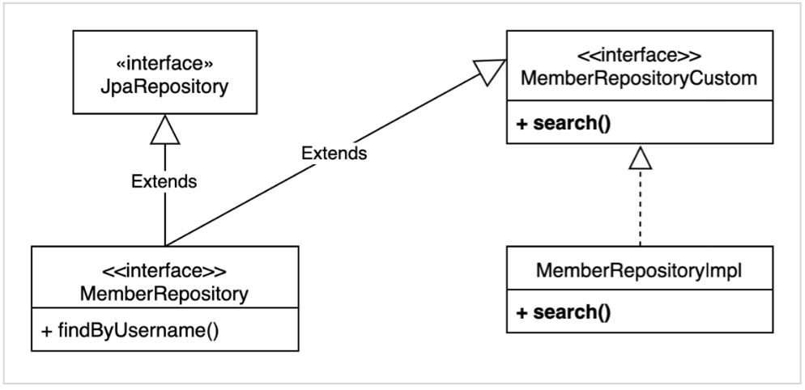

# _QueryDSL_

<br>

## _QueryDSL 설정과 검증_   
* `build.gradle`에 주석을 참고해서 querydsl 설정 추가   

    ```Java
    buildscript {
        ext {
            queryDslVersion = "5.0.0"
        }
    }

    plugins {
        id 'org.springframework.boot' version '2.6.3'
        id 'io.spring.dependency-management' version '1.0.11.RELEASE'
        //querydsl 추가
        id "com.ewerk.gradle.plugins.querydsl" version "1.0.10"
        id 'java'
    }

    group = 'study'
    version = '0.0.1-SNAPSHOT'
    sourceCompatibility = '11'

    configurations {
        compileOnly {
            extendsFrom annotationProcessor
        }
    }

    repositories {
        mavenCentral()
    }

    dependencies {
        implementation 'org.springframework.boot:spring-boot-starter-data-jpa'
        implementation 'org.springframework.boot:spring-boot-starter-web'
        implementation 'com.github.gavlyukovskiy:p6spy-spring-boot-starter:1.5.8'

        //querydsl 추가
        implementation "com.querydsl:querydsl-jpa:${queryDslVersion}"
        annotationProcessor "com.querydsl:querydsl-apt:${queryDslVersion}"

        compileOnly 'org.projectlombok:lombok'
        runtimeOnly 'com.h2database:h2'
        annotationProcessor 'org.projectlombok:lombok'

        //테스트에서 lombok 사용
        testCompileOnly 'org.projectlombok:lombok'
        testAnnotationProcessor 'org.projectlombok:lombok'

        testImplementation 'org.springframework.boot:spring-boot-starter-test'
    }

    tasks.named('test') {
        useJUnitPlatform()
    }

    //querydsl 추가 시작
    def querydslDir = "$buildDir/generated/querydsl"
    querydsl {
        jpa = true
        querydslSourcesDir = querydslDir
    }
    sourceSets {
        main.java.srcDir querydslDir
    }
    configurations {
        querydsl.extendsFrom compileClasspath
    }
    compileQuerydsl {
        options.annotationProcessorPath = configurations.querydsl
    }
    //querydsl 추가 끝
    ```

<br>

* ### _검증용 엔티티 생성_

    ```Java
    @Entity
    @Getter @Setter
    public class Hello {
        
        @Id @GeneratedValue
        private Long id;
    }
    ```

<br>

* ### _검증용 Q타입 생성_
  * Gradle InteliJ 사용법
    * Gradle -> Tasks -> build -> clean
    * Gradle -> Tasks -> other -> comlieQuerydsl
  * Gradle 콘솔 사용법
    * ./gradlew clean compileQuerydsl
  * Q타입 생성 확인 
    * build -> generated -> querydls
    * study.querydsl.entity.QHello.java 파일이 생성되어 있어야 한다.
  * 참고
    >Q타입은 컴파일 시점에 자동으로 생성되므로 버전관리(GIT)에 포함하지 않는 것이 좋다.   
    앞서 설정에서 생성 위치를 gradle build 폴더 아래 생성되도록 했기 때문데 이 부분도 자연스럽게 해결된다.   
    (대부분 gradle build 폴더를 git에 포함하지 않는다.)   

<br>

## _스프링 부트 설정 - JPA, DB_
* `application.yml`
    ```yml
    spring:
    datasource:
        url: jdbc:h2:tcp://localhost/~/querydsl
        username: sa
        password:
        driver-class-name: org.h2.Driver
    jpa:
        hibernate:
        ddl-auto: create
        properties:
        hibernate:
    #        show_sql: true
            format_sql: true

    logging.level:
    org.hibernate.SQL: debug
    #  org.hibernate.type: trace  
    ```
  * 참고
    >모든 로그 출력은 가급적 로거를 통해 남겨야 한다.   
    `show_sql`옵션은 `System.out`에 하이버네이트 실행 SQL을 남긴다.   
    `org.hibernate.SQL`옵션은 logger를 통해 하이버네이트 실행 SQL을 남긴다.

<br>
<br>
<br>

# _예제 도메인 모델_

<br>

## _예제 도베인 모델과 동작 확인_
* ### _Member Entity_
    ```Java
    @Entity
    @NoArgsConstructor(access = PROTECTED)
    @ToString(of = {"id", "username", "age"})
    @Getter @Setter
    public class Member {
        
        @Id @GeneratedValue(strategy = IDENTITY)
        @Column(name = "member_id")
        private Long id;
        private String username;
        private int age;

        @ManyToOne(fetch = LAZY)
        @JoinColumn(name = "team_id")
        private Team team;

        public Member(String username) {
            this(username, 0);
        }

        public Member(String username, int age) {
            this(username, age, null)
        }

        public Member(String username, int age, Team team) {
            this.username = username;
            this.age = age;
            if (team != null) {
                changeTeam(team);
            }
        }

        public void changeTeam(Team team) {
            this.team = team;
            team.getMembers().add(this);
        }
    }
    ```
  * 롬복 설명
    * `@Setter`: 실무에서는 가급적 Setter는 사용하지 않는다.
    * `@NoArgsConstructor(accescc = AccessLevel.PROTECTED`: 기본 생성자를 막고 싶은데, JPA 스팩상 PROTECTED로 열어두어야 한다.
    * `@ToString`: 가급적 내부 필드만(열어두어야 한다.)
  * `changeTeam()`: 양방향 연관관계를 한번에 처리(연관관게 편의 메서드)

<br>

* ### _Team Entity_
    ```Java
    @Entity
    @NoArgsConstructor(access = PROTECTED)
    @ToString(of = {"id", "name"})
    @Getter @Setter
    public class Team {
        
        @Id @GeneratedValue(strategy = IDENTITY)
        @Column(name = "tema_id")
        private Long id;
        private String name;

        @OneToMany(mappedBy = "team")
        private List<Member> members = new ArrayList<>;

        public Team(String name) {
            this.name = name;
        }
    }
    ```
  * Member와 Team은 양방향 연관관계, `Member.team`이 연관관계의 주인, `Team.members`는 연관관계의 주인이 아님, 따라서 `Member.team`이 데이터베이스 외래키 값을 변경, 반대편은 읽기만 가능.

  <br>

  * ### _Test Code_
    ```Java
    @SpringBootTest
    @Transactional
    public class MemberTest {

        @Autowired
        EntityManager entityManger;

        @Test
        void TestEntity() {
            //givne
            Team teamA = new Tema("teamA");
            Team teamB = new Tema("teamB");

            entityManager.persist(taemA);
            entityManager.persist(taemB);

            Member member1 = new Member("member1", 10, teamA);
            Member member2 = new Member("member2", 20, teamA);
            Member member3 = new Member("member3", 30, teamB);
            Member member4 = new Member("member4", 40, teamB);

            entityManger.persist(member1);
            entityManger.persist(member2);
            entityManger.persist(member3);
            entityManger.persist(member4);

            entityManager.flush();
            entityManager.clear();

            //when
            List<Member> members = entityManger.createQuery("select m from Member m", Member.class)
                        .getResultList();

            //then
            for (Member member : members) {
                System.out.println("member = " + member);
                System.out.println("-> member.team = " + member.getTeam());
            }                        
        }
    }
    ```
  * 가급적 순수 JPA로 동작 확인(뒤에서 변경)
  * DB 테이블 결과 확인
  * 지연 로딩 동작 확인

<br>
<br>
<br>

# _기본 문법_

<br>

## _시작 - JPQL vs QueryDSL_
* ### _startQueryDSL_
    ```Java
    @SpringBootTest
    @Transactional
    public class QueryBasicTest {

        @Autowired
        EntityManager entityManger;

        @Tese
        void startJPQL() {
            //member1을 찾아라.
            Member result = entityManger.createQuert("select m from Member m where m.username = :username", Member.class)
                    .setParameter("username", "member1")
                    .getSingleResult();

            assertThat(result.getUsername()).isEqualTo("member1");
        }

        @Test
        void startQueryDSL() {
            //member1을 찾아라.
            JPAQueryFactory queryFactory = new JPAQueryFactory(entityManger);
            QMEmber m = new QMember("m");

            Member result = queryFactory
                    .select(m)
                    .from(m)
                    .where(m.username.eq("member1")) //파라미터 바인딩 처리
                    .fetchOne();

            assertThat(result.getUsername()).isEqualTo("member1");
        }
    }
    ```
  * `EntityManger`를 `JPAQueryFactory`생성
  * Querydsl은 JPQL 빌더역할을 한다.
  * JPQL: 문자(실행 시점 오류), QueryDSL: 코드(컴파일 시점 오류)
  * JPQL: 파라미터 바인딩 직접, QueryDSL: 파라미터 바인딩 자동 처리

<br>

* ### _JPAQueryFactory를 필드로_
    ```Java
    @SpringBootTest
    @Transactional
    public class QuerydslBasicTest {

        @Autowired
        EntityManager entityManager;

        JPAQueryFactory queryFactory;

        @BeforEach
        void init() {
            queryFactort = new JPAQueryFactory(entityManager);

            Team teamA = new Team("teamA");
            Team teamB = new Team("teamB");

            entityManger.persist(teamA);
            entityManger.persist(teamB);

            Member member1 = new Member("member1", 10, teamA);
            Member member2 = new Member("member2", 20, teamA);
            Member member3 = new Member("member3", 30, teamB);
            Member member4 = new Member("member4", 40, teamB);

            entityManager.persist(member1);
            entityManager.persist(member2);
            entityManager.persist(member3);
            entityManager.persist(member4);
        }

        @Team
        void startQuerydsl2() {
            //member1을 찾아라
            QMember m = new QMEmber("m");

            Member result = queryFactory
                    .select(m)
                    .from(m)
                    .where(m.username.eq("member1"))
                    .fetchOne();
            
            assertThat(result.getUsername()).isEqualTo("member1");
        }
    }
    ```
  * 참고
    >JPAQueryFactory를 필드로 제고하면 동시성 문제는 어떻게 될까?   
    동시성 문제는 JPAQueryFactory를 생성할 때 제공하는 EntityManager에 달려있다.   
    스프링 프레임워크는 여러 쓰레드에서 동시에 같은 EntityManager에 접근해도, 트랜잭션 마다 별도의 영속성 컨텍스트를 제공하기 떄문에, 동시성 문제는 걱정하지 않아도 된다.   
    
<br>

## _기본 Q-Type 황용_
* ### _Q클래스 인스턴스를 사용하는 2가지 방법_
    ```Java
    QMember qMember = new QMember("m")  //별칭 직접 지정
    QMember qMember = QMember.member;   //기본 인스턴스 사용
    ```
    ```Java
    public class QMember extends EntityPathBase<Member> {

        ...

        public static final QMember member = new QMember("member1");
    }
    ```

<br

* ### _기본 인스턴스를 static import와 함께 사용_
    ```Java
    import static study.querydsl.entity.QMember.*;

    ...

    @Test
    void startQueryDSL01() {
        Member result = queryFactory
                .select(member)  //.select(QMember.member)
                .from(member)
                .where(member.username.eq("member1"))
                .fetchOne();

        assertThat(result.getUsername()).isEqualTo("member1");
    }
    ```
  * 다음 설정을 추가하면 실행되는 JPQL을 볼 수 있다.
    ```yml
    spring.jpa.properties.hibernate.use_sql_comments: true
    ```
  * 참고
    >같은 테이블을 join할 때 에일리어스를 구분하기 위해 별칭을 사용하는 방법을 사용하며, 그 이외에는 기본 인스턴스를 사용하는것을 궈장한다.   

<br>

## _검색 조건 쿼리_
* ### _기본 검색 쿼리_
    ```Java
    @Test
    void search() {
        Member result = quertFactory
                .selectFrom(member)
                .where(member.username.eq("member1")
                    .and(member.age.eq(10)))
                .fetchOne();
        
        assertThat(result.getUsername()).isEqualTo("member1");
        assertThat(result.getAge()).isEqualTo(10);
    }
    ```
  * 검색 조건은 `.and()`, `.or()`를 메서드 체인으로 연결할 수 있다.
  * 참고
    >`select`, `from`을 `selectFrom`으로 합칠 수 있다.

<br>

* ### _JPQL이 제공하는 모든 검색 조건 제공_
    ```Java
    member.username.eq("member1")        //username = 'member1'
    member.username.nq("member1")        //username != 'member1'
    member.username.eq("member1").not()  //username != 'member1'

    member.username.isNotNull()          //이름이 is not null

    member.age.in(10, 20)                //age in (10, 20)
    member.age.notIn(10, 20)             //age not in (10, 20)
    member.age.between(10, 30)           //between 10, 30    

    member.age.goe(30)                   //age >= 30
    member.age.gt(30)                    //age > 30
    member.age.loe(30)                   //age <= 30   
    member.age.lt(30)                    //age < 30

    member.username.like("member%")      //like 검색
    member.username.contains("member")   //like '%member%' 검색
    member.username.startWith("member")  //like 'member%' 검색
    ```

<br>

* ### _ADN조건을 파마리터로 처리_
    ```Java
    @Test
    void searchAndParam() {
        Member result = queryFactory
                .selectFrom(member)
                .where(member.username.eq("member1"),
                    member.age.eq(10))
                .fetchOne();
        
        assertThat(result.getUsername()).isEqualTo("member1");
        assertThat(result.getAge()).isEqualTo(10);
    }
    ```
  * `where()`에 파라미터로 검색조건을 추가하면 `AND`조건이 추가된다.
  * 이 경우 `null`값은 무시 -> 메서드 추출을 활용해서 동적 쿼리를 깔끔하게 만들 수 있다.(뒤에서 설명)

<br>

## _결과 조회_
* `fetch()`: 리스트 조회, 데이터 없으면 빈 리스트 반환.
* `fetchOne()`: 단건 조회
  * 결과가 없으면: `null`
  * 결과가 둘 이상이면: `com.querydsl.core.NonUniqueResultException`
* `fetchFirst()`: `limit(1).fetchOne()`
* `fetchResults()`: 페이징 정보 포함, total count 쿼리 추가 실행
* `fetchCount()`: count 쿼리로 변경해서 count수 조회

<br>

* ### _fetch()_
    ```Java
    @Test
    void resultFetch() {
        List<Member> result01 = queryFactory
                .selectFrom(member)
                .fetch();
        
        QHello h = new QHello("h");

        List<Hello> result02 = queryFactory  //없는 데이터 조회
                .select(QHello.hello)
                .fetch();

        assertThat(result01.size()).isEqualTo(4);
        assertThat(result02.size()).isEqualTo(0);  //빈 리스트 반환
    }
    ```

<br>

* ### _fetchOne()_
    ```Java
    @Test
    void resultFetchOne() {
        //NoUniqueResultException 발생!!!
        Member result01 = queryFactory
                .selectFrom(member)
                .fetchOne();

        Member result02 = queryFactory
                .selectFrom(member)
                .where(member.username.eq("member1"));
                .fetchOne();

        Hello result03 = queryFactory
                .selectFrom(QHello.hello)
                .fetchOne();

        assertThat(result02.getUsername()).isEqualTo("member1");
        assserThat(result03).isNull();
    }
    ```

<br>

* ### _fetchFirst()_
    ```Java
    @Test
    void resultFetchFirst() {
        Member result = queryFactory
                .selectFrom(member)
                .fetchFirst();

        assertThat(result.getUsername()).isEqualTo("member1");
    }
    ```

<br>

## _정렬_
* ### Sort_
    ```Java
    /**
    * 회원 정렬 순서
    * 1. 회원 나이 내림차순(desc)
    * 2. 회원 이름 올림차순(asc)
    * 단, 2에서 회원 이름이 없으면 마지막에 출력(nulls last)
    */
    @Test
    void sory() {
        //given
        entityManager.persist(new Member(null, 100));
        entityManager.persist(new Member("member5", 100));
        entityManager.persist(new Member("member6", 100));

        //when
        List<Member> result = queryFactory
                .selectFrom(member)
                .where(member.age.eq(100))
                .orderBy(member.age.desc(), member.username.asc().nullsLast())
                .fetch();

        Member member5 = result.get(0);
        Member member6 = result.get(1);
        Member memberNull = result.get(2);

        assertThat(member5.getUsername()).isEqualTo("member5");
        assertThat(member6.getUsername()).isEqualTo("member6");
        assertThat(member5.getUsername()).isNull();
    }
    ```
  * `desc()`, `asc`: 일반 정렬
  * `nullLast()`, `nullFirst()`: null 데이터 순서 부여

<br>

## _페이징_
* ### _회원 건수 제한_
    ```Java
    @Tset
    void paging01() {
        List<Member> result = queryFactory
                .selectFrom(member)
                .orderBy(member.username.desc())
                .offset(0)  //0부터 시작(zero index)
                .limit(2)   //최대 2건 조회
                .fetch();

        assertThat(result.size()).isEqualTo(2);
    }
    ```

<br>

* ### _전체 조회 수가 필요하다면?_
    ```Java
    @Test
    void paging02() {
        QueryResults<Member> queryResults = queryFactory
                .selectFrom(member)
                .orderBy(member.username.desc())
                .offset(0)
                .limit(2)
                .fetchResults();

        arssertThat(queryResults.getTotal()).isEqualTo(4);
        arssertThat(queryResults.getLimit()).isEqualTo(2);
        arssertThat(queryResults.getOffset()).isEqualTo(0);
        arssertThat(queryResults.getResults().size()).isEqualTo(2);
    }
    ```
  * 주의
    >count 쿼리가 실행되니 성능상 주의!
  * 참고
    >실무에서 페이징 쿼리를 작성할 때, 데이터를 조회하는 쿼리는 여러 테이블을 조인해햐 하지만, count 쿼리는 조인이 필요 없는 경우도 있다.   
    그런데 이렇게 자동화된 count 쿼리는 원본 쿼리와 같이 모두 조인을 해버리기 때문에 성능이 안나올 수 있다.   
    count 쿼리에 조인이 필요없는 성능 최적화가 필요하다면, count 전용 쿼리를 별도로 작성해야 한다.   

<br>

## _집합_
* ### _집합 함수_
    ```Java
    /**
    * JPQL
    * select
    *    COUNT(m),     //회원수
    *    SUM(m.age),   //나이 합
    *    AVG(m.age),   //평균 나이
    *    MAX(m.age),   //최대 나이
    *    MIN(m.age),   //최소 나이
    * from Member m
    */
    @Test
    void aggregation() {
        List<Tuple> result = queryFactory
                .select(member.count(),
                        member.age.sum(),
                        member.age.avg(),
                        member.age.max(),
                        member.age.min())
                .from(member)
                .fetch();
        
        Tuple tuple = result.get(0);

        assertThat(tuple.get(member.count())).isEqualTo(4);
        assertThat(tuple.get(member.age.sum())).isEqualTo(100);
        assertThat(tuple.get(member.age.avg())).isEqualTo(25);
        assertThat(tuple.get(member.age.max())).isEqualTo(40);
        assertTaht(tuple.get(member.age.min())).isEqualTo(10);
    }
    ```
  * JPQL이 제공하는 모든 집합 함수를 제공한다.

<br>

* ### _GroupBy 사용_
    ```Java
    /**
    * 팀의 이름과 각 팀의 평균 연령을 구하라.
    */
    @Test
    void group() {
        List<Tuple> result = queryFactory
                .select(team.name, member.age.avg())
                .from(member)
                .join(member.team, team)
                .groupBy(team.name)
                .fetch();
        
        Tuple teamA = result.get(0)
        Tuple teamB = result.get(1)

        assertThat(teamA.get(team.name)).isEqualTo("teamA");
        assertThat(teamA.get(member.age.avg())).isEqualto(15);

        assertThat(teamB.get(team.name)).isEqualTo("teamB");
        assertTaht(teamB.get(member.age.avg())).isEqualTo(35);
    }
    ``` 
  * `groupBy`, 그룹화된 결과를 제한하려면 `having`

<br>

* ### _groupBy(), having() 예시_
    ```Java
    ...
        .gruopBy(item.price)
        .having(item.price.gt(1000))
    ...    
    ```
<br>

## _조인 - 기본 조인_
* ### _기본 조인_
  * 조인의 기본 문법은 첫 번째 파라미터에 조인 대상을지정하고, 두 번째 파라미터에 별칭(alias)으로 사용할 Q타입을 지정하면 된다.
    ```Java
    join(조인 대상, 별칭으로 사용할 Q타입)
    ```   
    
    ```Java
    /**
    * 팀 A에 소속된 모든 회원
    */
    @Test
    void join() {
        List<Member> result = queryFactory
                .selectFrom(member)
                .join(member.team, team)
                .where(team.name.eq("teamA"))
                .fetch();
        
        assertThat(result)
                .extracting("username")
                .containsExactly("member1", "member2");
    }
    ```
  * `join()`, `innerJoin()`: 내부 조인(inner join)
  * `leftJoin()`: left 외부 조인(left outer join)
  * `rightJoin()`: right 외부 조인(rigth outer join)
  * JPQL의 `on`과 선능 최적화를 위한 `fetch`조인 제공 -> 다음 on 절에서 설명

<br>

* ### _세타 조인_
  * 연관관계가 없는 필드로 조인
    ```Java
    /**
    * 세타 조인(연관관계가 없는 필드로 조인)
    * 회원의 이름이 팀 이름과 같은 회원 조회
    */
    @Test
    void theta_join() {
        entityManager.persist(new Member("teamA"));
        entityManager.persist(new Member("teamB"));

        List<Member> result = queryFactory
                .select(member)
                .from(member, team)
                .where(member.username.eq(team.name))
                .fetch();

        assertThat(result)
                .extracting("username")
                .containsExactly("teamA", "teamB");
    }
    ```
  * from 절에 여러 엔티티를 선택해서 세타 조인
  * 외부 조인 불가능 -> 다음에 설명할 조인 on을 사용하면 외부 조인 가능

<br>

## _조인 - on절_
* ON절을 활용한 조인(JPA 2.1부터 지원)
  1. 조인 대상 필터링
  2. 연관관계 없는 엔티티 외부 조인

<br>

* ### _조인 대상 필터링_
    ```Java
    /**
    * 예) 회원과 팀을 조회하면서, 팀 이름이 teamA인 팀만 조회, 회원은 모두 조회 
    * JPQL: select m, t from Member m left join m.team t on t.name = 'teamA'
    * SQL: SELECT m.*, t.* FROM Member m LEFT JOIN Team t ON m.TEAM_ID=t.id and t.name='teamA'
    */
    @Test
    void join_on_filtering() {
        List<Tuple> result = queryFactory
                .select(member, team)
                .from(member)
                .leftJoin(member.team, team).on(team.name.eq("teamA"))
                .fetch();

        for (Tuple tuple : result) {
            System.out.println("tuple = " + tuple);
        }
    }
    ```
  * 결과
    ```
    tuple = [Member(id=1, username=member1, age=10), Team(id=1, name=teamA)]
    tuple = [Member(id=2, username=member2, age=20), Team(id=1, name=teamA)]
    tuple = [Member(id=3, username=member3, age=30), null]
    tuple = [Member(id=4, username=member4, age=40), null]
    ```
  * 참고
    >on 절을 활용해 조인 대상을 필터링 할 때, 외부조인이 아니라 내부 조인(inner join)을 사용하면,    
    where 절에 필터링 하는 것과 기능이 동일하다.   
    따라서 on절을 활용한 조인 대상 필터링을 사용할 떄, 내부조인 이면 익숙한 where절로 해경하고, 정말 외부조인이 필요한 경우에만 이 기능을 사용하자.   

<br>

* ### _연관관계 없는 엔티티 외부 조인_
    ```Java
    /**
    * 2. 연관관계 없는 엔티티 외부 조인
    * 예) 회원의 이름과 팀의 이름이 같은 대상 외부 조인 
    * JPQL: select m, t from Member m left join Team t on m.username = t.name
    * SQL: SELECT m.*, t.* FROM Member m LEFT JOIN Team t ON m.username = t.name
    */
    @Test
    void join_on_no_relation() {
        entityManager.persist(new Member("teamA"));
        entityManager.persist(new Member("teamB"));

        List<Tuple> result = queryFactory
                .select(member, team)
                .from(team)
                .leftJoin(team).on(member.username.eq(t.name))
                .fetch();

        for (Tuple tuple : result) {
            System.out.prtinln("tuple = " + tuple);
        }
    }
    ```
  * 결과
    ```
    tuple = [Member(id=1, username=member1, age=10), null]
    tuple = [Member(id=2, username=member2, age=20), null]
    tuple = [Member(id=3, username=member3, age=30), null]
    tuple = [Member(id=4, username=member4, age=40), null]
    tuple = [Member(id=5, username=teamA, age=0), Team(id=1, name=teamA)]
    tuple = [Member(id=6, username=teamB, age=0), Team(id=2, name=teamB)]
    ```
  * 하이버네이트 5.1부터 `on`을 사용해서 서로 관계가 없는 필드로 외부 조인하는 기능이 추가되었다.

<br>

## _조인 - 페치조인_
>페치 조인은 SQL에서 제공하는 기능은 아니다.   
SQL조인을 활용해서 연관된 엔티티를 SQL 한번에 조회하는 기능이다.   
주로 성능 최적화에 사용하는 방법이다.   
* ### _페치 조인 미적용_
  * 지연로딩으로 Member, Team SQL 쿼리 각각 실행
    ```Java
    @PersistenceUnit
    EntityManagerFactory entityMangerFactory;

    @Test
    void fetchJoinNo() {
        entityManger.flush();
        entityManger.clear();

        Member result = queryFactory
                .selectFrom(member)
                .where(member.username.eq("member1"))
                .fetchOne();
        
        boolean loaded = 
                entityMangerFactory.getPersistanceUnitUtill.isLoaded(findMember.getTeam());

        assertThat(loaded).as("페치 조인 미적용").isFalse();
    }
    ```

<br>

* ### _페치 조인 적용_
  * 즉시 로딩으로 Member, Team SQL 쿼리 조인으로 한번에 조회
    ```Java
    @Test
    void fetchJoinUse() {
        entityManger.flush();
        entityManger.clear();

        Member result = queryFactory
                .selectFrom(member)
                .join(member.team, team).fetchJoin()
                .where(member.username.eq("member1"))
                .fetchOne();

        boolean loaded = entityMangerFactory.getPersistanceUtil().isLoaded(result.getTeam());

        assertThat(loaded).as("페치 조인 적용").isTrue();
    }
    ```
  * 사용법
    `join().leftJoin()`등 조인 기능 뒤에 `fetchJoin()`이라고 추가하면 된다.

<br>

## _서브 쿼리_
* `com.querydsl.jpa.JPAExpressions`사용

<br>

* ### _서브 쿼리 eq 사용_
    ```Java
    /**
    * 나이가 가장 많은 회원 조회
    */
    @Test
    void subQuery() {
        QMember memberSub = new QMember("memberSub");

        List<Member> result = queryFactory
                .selectFrom(member)
                .where(member.age.eq(
                        JPAExpressions
                                .select(memberSub.age.max())
                                .from(memberSub)
                ))
                .fetch();

        assertThat(result).extracting("age")
                .containsExactly(40);
    }
    ```

<br>

* ### _서브 쿼리 goe 사용_
    ```Java
    @Test
    void subQueryGoe() {
        List<Member> result = queryFactory
                .selectFrom(member)
                .where(member.age.goe(
                        JPAExpressions
                            .select(memberSub.age.avg())
                            .from(memberSub)
                ))
                .fetch();

        assertThat(result).extracting("age")
                .containsExactly(30, 40);
    }
    ```

<br>

* ### _서브쿼리 여러 건 처리 in사용_
    ```Java
    /**
    * 서브쿼리 여러 건 처리, in 사용
    */
    @Test
    void subQueryIn() {
        QMember memberSub = new QMember("memberSub");

        List<Member> result = queryFactory
                .selectFrom(member)
                .where(member.age.in(
                        JPAExpressions
                            .select(memberSub.age)
                            .from(memberSub)
                            .where(memberSub.age.gt(10))
                ))
                .fetch();

        assertThat(result).extracting("age")
                .containsExactly(20, 30, 40);
    }
    ```
    
<br>

* ### _select 절에 subquery_
    ```Java
    @Test
    void selectSubQuery() {
        QMember memberSub = new QMember("memberSub");

        List<Tuple> result = queryFactory
                .select(member.username, JPAExpressions
                        .select(memberSub.age.avg())
                        .from(memberSub)
                ).froe(member)
                .fetch();

        for(Tuple tuple :  result) {
            System.out.println("username = " + tuple.get(member.username));
            System.out.println("age = " + tuple.get(JPAExpressions.select(memberSub.get.avg()).from(memberSub)));
        }
    }
    ```

<br>

* ### _static import 확용_
    ```Java
    import static com.querydsl.jpa.JPAExpressions.select;

    List<Member> result = queryFactory
            .selectFrom(member)
            .where(member.age.eq(
                select(memberSub.age.max())
                .from(memberSub)
            ))
            .fetch();
    ```

<br>

* ### _from 절의 서브쿠러ㅣ 한계_
  >JPA JPQL 서브쿼리의 한계점으로 from 절의 서브쿼리(인라인 뷰)는 지원하지 않는다.   
  당연히 Querydsl도 지원하지 않느다.   
  하이버네이트 구현체를 사용하면 select절의 서브쿼리는 지원한다.   
  Querydsl도 하이버네이트 구현체를 사용하면 select절의 서브쿼리를 지원한다.   

* ### _from절의 서브쿼리 한계_
  1. 서브쿼리를 join으로 변경한다(가능한 상황도 있고, 불가능한 상황도 있다.)
  2. 애플리케이션에서 쿼리를 2번 분리해서 실행한다.
  3. nativeSQL을 사용한다.   

<br>

## _Case문_
* ### _select, 조건절(where), order by에서 사용 가능_
  * 단순한 조건
    ```Java
    @Test
    void basicTest() {
        List<String> result = queryFactory
                .select(member.age
                    .when(10).then("열살")
                    .when(20).then("스무살")
                    .otherwise("기타")
                .from(member)
                .fetch();

        for(String s : result) {
            System.out.prtinln("s = " + s);
        }
    }
    ```

<br>

* ### _복잡한 조건_
    ```Java
    @Test
    void conplexTest() {
        List<String> result = queryFactory
                .select(new CaseBuilder()
                    .when(member.age.between(0, 20)).then("0 ~ 20살")
                    .when(member.age.between(21 ~ 30)).then("21 ~ 30살")
                    .otherwise("기타"))
                .from(member)
                .fetch();
        
        for(String s : result) {
            System.out.prtinln("s = " + s);
        }
    }
    ```

<br>

* ### _orderBy에서 Case문 함께 사용하기 예제_
    ```Java
    /**
    * 예를 들어서 다음과 같은 임의의 순서로 회원을 출력하고 싶다면?
    * 1. 0 ~ 30살이 아닌 회원을 가장 먼저 출력
    * 2. 0 ~ 20살 회원 출력
    * 3. 21 ~ 30살 회원 출력
    */
    @Test
    void orderBy_Case() {
        NumberExpression<Integer> rankPath = new CaseBuilder
                .when(member.age.between(0, 20)).then(2)
                .when(member.age.between(21, 30)).then(1)
                .otherwise(3);

        List<Tuple> result = queryFactory
                .select(member.username, member.age, rankPath)
                .from(member)
                .orderBy(rankPath.desc())
                .fetch();

        for (Tuple tuple : result) {
            String username = tuple.get(member.username);
            Integer age = tuple.get(member.age);
            Integer rank = tuple.get(rankPath);

            System.out.prtinln("username = " + username + ", age = " + age + ", rank = " + rank);
        }
    }
    ```
  * Querydsl은 자바 코드로 작성하기 때문에 `rankPath`처럼 복작합 조건을 변수로 선언해서 `select`절, `orderBy`절에서 함께 사용할 수 있다.
  * 결과
    ```Java
    username = member4, age = 40 rank = 3
    username = member1, age = 10 rank = 2
    username = member2, age = 20 rank = 2
    username = member3, age = 30 rank = 1
    ```

<br>

## _상수, 문자 더하기_
* ### _상수가 필요하면 `Expressions.constant(xxx)사용`_
    ```Java
    @Test
    void constant() {
        List<Tuple> result = queryFactory
                .select(member.username, Expressions.constant("A"))
                .from(member)
                .fetch();

        for (Tuple tuple : result) {
            System.out.println("tuple = " + tuple);
        }
    }
    ```
  * 참고
    >위과 같이 최적화가 가능하다면 SQL에 constant 값을 넘기지 않는다.    
    상수를 더하는 것 처럼 최적화가 어려우며 SQL에 constant 값을 넘긴다.   

<br>

* ### _문자 더하기 concat_
    ```Java
    @Test
    void concat() {
        List<String> result = queryFactory
                .select(member.username.concat("_").concat(member.age.stringValue))
                .from(member)
                .fetch();
        
        for (String username : result) {
            System.out.prtinln("username = " + username);
        }
    }
    ```
  * 참고
    >`member.age.stringValue()`부분이 중요한데, 문제가 아닌 다른 타입들은 `stringValue()`로 문자로 변환할 수 있다.   
    이 방법은 ENUM을 처리할 때도 자도 사용한다.   

<br>
<br>
<br>

# _중급 문법_

<br>

## _프로젝션과 결과 반환 - 기본_
> 프로젝션: select 대장 지정

<br>

* ### _프로젝션 대상이 하나_
    ```Java
    @Test
    void simpleProjection() {
        List<String> result = queryFactory
                .select(member.username)
                .from(member)
                .fetch();

        assertThat(result.get(0)).isEqualTo("member1");
    }
    ```
  * 프로젝션 대상이 하나면 타입을 명황하게 지정할 수 있다.
  * 프로젝션 대상이 둘 이상이면 튜플이나 DTO로 조회한다.

<br>

* ### _튜플 조회_
  * 프로젝션 대상이 둘 이상일 때 사용한다.
    ```Java
    /**
    * Tuple을 Repostiory 계층에서 사용하는 것은 바람직 하지만, 그 이외의 Service계층이나 Constroller에서 사용하는 것은 바람직한 설계가 아니다.
    * Respository계층 이외에서는 데이터는 DTO로 받아 사용하는 것을 권장한다.
    */
    @Test
    void tupleProjection() {
        List<Tuple> result = queryFactory
                .select(member.username, member.age)
                .from(member)
                .fetch();

        for(Tuple tuple : result) {
            String username = tuple.get(member.username);
            Integer age = tuple.get(member.age);

            System.out.prtinln("username: " + username + ", age: " + age);
        }
    }
    ```

<br>

## _프로젝션과 결과 반환 - DTO 조회_   
순수 JPA에서 DTO 조회

<br>

* ### _MemberDto_
    ```Java
    @Data
    @NoArgsConstrucotr
    public class MemberDto {

        private String username;
        private int agel

        public MemberDto(String username) {
            this.username = username;
        }

        public MemberDto(String username, int age) {
            this.username = username;
            this.age = age;
        }
    }
    ```

<br>

* ### _순수 JPA에서 DTO 조회 코드_
    ```Java
    @Test
    void findDtoByJPQL() {
        List<MemberDto> resultList = entityManager.createQuery(
                    "select new study.querydsl.dto.MemberDto(m.username, m.age)" + 
                    "from Member m", MemberDto.class);
                .getResultList();

        for (MemberDto memberDto : resultList) {
            System.out.println("memberDto: " + memberDto);
        }
    }
    ```
  * 순수 JPA에서 DTO를 조회할 때는 new 명령어를 사용해야 한다.
  * DTO의 package이름을 다 적어줘야해서 코드가 지저분하다.
  * 생성자 방식만 지원한다.

<br>

* ### _QueryDSL 빈 생성(Bean population)_   
>결과를 DTO 반환할 때 사용하며, 다음 3가지 방법을 지원한다.   
  * 프로퍼티 접근
  * 필드 직접 접근
  * 생성자 사용

<br>

* ### _프로퍼티 접근 - Setter_
    ```Java
    @Test
    void findDtoBySetter() {
        List<MemberDto> result = queryFactory
                .select(Projections.bean(MemberDto.class,
                        member.username,
                        member.age))
                .from(member)
                .fetch();
        
        for (MemberDto memberDto : result) {
            System.out.prtinln("memberDto: " + memberDto);
        }
    }
    ```

<br>

* ### _필드 직접 접근_
    ```Java
    @Test
    void findDtoField() {
        List<MemberDto> result = queryFactory
                .select(Projections.fields(MemberDto.class,
                    member.username,
                    member.age))
                .from(member)
                .fetch();

        for (MemberDto memberDto : result) {
            System.out.println("memberDto: " + memberDto);
        }
    }
    ```

<br>

* ### _별칭이 다를 경우_
    ```Java
    @Date
    public class UserDto {

        private String name;
        private int age;
    }
    ```

    ```Java
    @Test
    void findUserDtoByFields() {
        QMember member = new QMember("memberSub");

        List<UserDto> result = queryFactory
                .select(Prejections.fields(UserDto.class,
                        member.username.as("name"),
                        ExpressionUtils.as(
                            JPAExpressions
                                .select(memberSub.age.max())
                                .from(memberSub), "age"
                        )))
                .from(member)
                .fetch();    
    }
    ```
  * 프로퍼티나, 필드 접근 생성 방식에서 이름이 다를 때 해결 방안
  * `ExpressionUtils.as(source, alias)`: 필드나, 서브 쿼리에 별칭 적용
  * `username.as("memberName")`: 필드에 별칭 적용

<br>

* ### _생성자 사용_
    ```Java
    @Test
    void findByConstructor() {
        List<MemberDto> result = queryFactory
                .select(Projections.constructor(MemberDto.calss,
                        member.username,
                        mameber.age))
                .from(member)
                .fetch();
    }
    ```

<br>

## _프로젝션과 결과 반환 - @QueryProjection_
* ### _생성자 + @QueryProjection_
    ```Java
    @Data
    @NoArgsConstructor
    public class MemberDto {

        private String username;
        private int age;

        public MemberDto(String username) {
            this.username = username;
        }

        @QueryProjection
        public MemberDto(String username, int age) {
            this.username = username;
            this.age = age;
        }
    }
    ```
  * `/gradlew compileQuerydsl`
  * `QMemberDto`생성 확인

<br>

* ### _@QueryProjection 활용_
    ```Java
    @Test
    void findByQueryProjection() {
        List<MemberDto> result = queryFactory
                .select(new QMemeberDto(member.username, member.age))
                .from(member)
                .fetch();
    }
    ```
  * 이 방법은 컴파일러로 타입을 체크할 수 있으므로 가장 안전한 방법이다.
  * 다만 DTO에 QueryDSL어노테이션을 유지해야 하는 점과 DTO까지 Q 파일을 생성해야 하는 단점이 있다.

<br>

* ### _distinct_
    ```Java
    List<String> result = queryFactory
            .select(member.username).distinct()
            .from(member)
            .fetch();
    ```
  * 참고   
    >distinct는 JPQL의 distinct와 같다. 

<br>

## _동적 쿼리 - BooleanBuilder 사용_
* ### _BooleanBuilder_
    ```Java
    @Test
    void dynamicQuery_BooleanBuilder() {
        String username = "member1";
        Intesger age = 10;

        List<Member> result = searchMember01(username, age);
        assertThat(result.size()).isEqualTo(1);

        private List<Member> searchMember01(String usernameCond, Integer ageCond) {
            BooleanBuilder builder = new BooleanBuilder();

            if(useranmeCond != null) {
                builder.and(member.useranme.eq(usernameCond));
            }
            if(ageCond != null) {
                builder.and(member.age.eq(ageCond));
            }

            return queryFactory
                    .selectFrom(member)
                    .where(builder)
                    .fetch();
        }
    }
    ```

<br>

## _동적 쿼리 - Where 다중 파라미터 사용_
* ### _where 다중 파라미터_
    ```Java
    @Test
    void dynamicQuery_whereParam() {
        String username = "member1";
        Integer age = 10;

        List<Member> result = searchMember02(username, age);
        assertThat(result.size()).isEqualTo(1);
    }

    private List<Member> searchMember02(String usernameCond, Integer ageCond) {
        return queryFactory
                .selecrFrom(member)
                .where(usernameEq(usernameCond), ageEq(ageCond))
                .fetch();
    }

    private BooleanExpression usernameEq(String usernameCond) {
        return usernameCond != null ? member.username.eq(usernameConde) : null;
    }

    private BooleanExpression ageEq(Integer ageCond) {
        return ageConde != null ? member.age.eq(ageCond) : null;
    }
    ```
  * `where`조건에 `null`값은 무시된다.
  * 메서드를 다른 쿼리에서도 재활용 할 수 있다.
  * 쿼리 자체의 가독성이 높아진다.

<br>

* ### _조합 가능_
    ```Java
    private BooleanExpression allEq(String usernameCond, Integer ageCond) {
        return usernameEq(usernameCond).and(ageEq(ageCond));
    }
    ```
  * `null`체크는 주의해서 처리해야한다.
<br>

## _수정, 삭제 벌크 연산_
* ### _쿼리 한번으로 대량 데이터 수정_
    ```Java
    @Test
    void bulkUpdate() {
        //영속성 컨텍스트: member1 -> DB: member1
        //영속성 컨텍스트: member2 -> DB: member2
        //영속성 컨텍스트: member3 -> DB: member3
        //영속성 컨텍스트: member4 -> DB: member4

        long count = queryFactory
                .update(member)
                .set(member.username, "비회원")
                .where(member.age.lt(28))
                .execute();

        //영속성 컨텍스트: member1 -> DB: 비회원
        //영속성 컨텍스트: member2 -> DB: 비회원
        //영속성 컨텍스트: member3 -> DB: member3
        //영속성 컨텍스트: member4 -> DB: member4

        entityManager.flush();
        entityManager.clear();

        //영속성 컨텍스트: 비회원 -> DB: 비회원
        //영속성 컨텍스트: 비회원 -> DB: 비회원
        //영속성 컨텍스트: member3 -> DB: member3
        //영속성 컨텍스트: member4 -> DB: member4

        List<Member> result = queryFactory
                .selectFrom(member)
                .fetch();

        for (Member member : result) {
            System.out.prtinln("member: " + member);
        }
    }
    ```

<br>

* ### _기존 숫자에 1 더하기_
    ```Java
    @Test
    void bulkAdd() {
        long count = queryFactory
                .update(member)
                .set(member.age, member.age.add(1))
                .execute();
    }
    ```
  * 곱하기: `multiply(x)`

<br>

* ### _쿼리 한 번으로 대량 데이터 삭제_
    ```Java
    @Test
    void bulkDelete() {
        queryFactory
                .delete(member)
                .where(member.age.gt(30))
                .execute();

        List<Member> result = queryFactory
                .selectFrom(member)
                .fetch();

        assertThat(result.size()).isEqualTo(3);
    }
    ```
  * 주의
    >JPQL 배차외 마찬가지고, 영속성 컨텍스트에 있는 엔티티를 무시하고 실행되기 때문에 배치 쿼리를 실행하고 나면 영속성 컨텍스트를 초기화하는 것이 안전하다.    

<br>

## _SQL function 호출하기_   
SQL function은 JPA와 같이 Dialect에 등록된 내용만 호출할 수 있다.   

<br>

* ### _member -> M 으로 변경하는 replace 함수 사용_
    ```Java
    String result = queryFactory
            .select(Expression.stringTemplate("function('replace', {0}, {1}, {2}",
                    member.username, "member", "M"))
                    .from(member)
                    .fetch();
    
    ```

<br>

* ### _소문자로 변경해서 비교해라_
    ```Java
    .select(member.username)
    .from(member)
    .where(member.username.eq(Expressions.stringTemplate("function('lower', {0}",
            member.username)))
    ```
  * lower같은 ansi 표준 함수들은 querydsl이 상당부분 내장하고 있다. 따라서 다음과 같이 처리해도 결과는 같다
    ```Java
    .where(member.username.eq(member.username.lower()))
    ```

<br>
<br>
<br>

# _실무 활용 - 순수 JPA와 QueryDSL_
  * 순수 JPA 리포지토리와 Querydsl
  * 동적쿼리 Builder 적용
  * 동적쿼리 Where 적용
  * 조회 API 컨트롤러 개발

<br>

## _순수 JPA 리포지토리와 QueryDSL_
* ### _순수 JPA 리포지토리_
    ```Java
    @Repositroy
    public class MemberJPARepostiroy {

        private final EntityManager entityManager;
        private final JPAQueryFactory queryFactory;

        public MemberJPARespotroy(EntityManager entityManager) {
            this.entityManager = entityManager;
            this.queryFactory = new JPAQueryFactory(entityManager);
        }

        public void save(Member member) {
            entityManager.persist(member);
        }

        public Optional<Member> findById(Long id) {
            Member findMember = entityManager.find(Member.class, id);

            return Optional.ofNullable(findMember);
        }

        public List<Member> findAll() {
            return entityManager.createQuery("select m from Member m", Member.clss)
                    .getResultList();
        }

        public List<Member> findByUsername(String username) {
            return entityManager.createQuery(
                        "select m from Member m where m.username = :username", Member.class)
                    .setPrarameter("username", username)
                    .getResultList();
            )
        }
    }
    ```

<br>

* ### _순수 JPA 리포지토리 테스트_
    ```Java
    @SpringBootTest
    @Transactional
    public class MemberJPARepositrosyTest {

        @Autowired
        EntityManager entityManager;

        @Autowired
        MemberJPARepository memberJpaRespository;

        @Test
        void basicTest() {
            Member member = new Member("member1", 10);
            memberJpaRepository.save(member);

            Member findMember = memberJpaRepository.findById(Member.class, id).get();
            assertThat(findMember).isEqualTo(member);

            List<Member> result = memberJpaRepository.findAll();
            assertThat(result).containExactly(member);

            List<Member> result01 = memberJpaRepositroy.findByUsername("member1");
            assertThat(result01).containExactly(member);
        }
    }
    ```

<br>

* ### _순수 JPA 리포지토리 - Querydsl 추가_
    ```Java
    public List<Member> findAll_Querydsl() {
        return queryFactory
                .selectFrom(member)
                .fetch();
    }

    public List<Member> findByUsername_Querydsl(String username) {
        return queryFactory
                .selectFrom(member)
                .where(member.username.eq(username))
                .fetch();
    }
    ```

<br>

* ### _Querydsl 테스트 추가_
    ```Java
    @Test
    void baiscQuerydslTest() {
        Member member = new Member("member1", 10);
        memberJpaRespository.save(member);

        List<Member> result = memberJpaRepository.findAll_Querydsl();
        assertThat(result).containExactly(member);

        List<Member> result01 = memberJpaRepository.findByUsername_Querydsl("member1");
        assertThat(result01).containExactly(member);
    }
    ```

<br>

* ### _JPAQueryFactory 스프링 빈 등록_
  * 다음과 같이 `JPAQueryFactory`를 스프링 빈드로 등록해서 주입받아 사용해도 된다.
    ```Java
    @Bean
    JPAQueryFactory jpaQueryFactory(EntityManager entityManager) {
        return new JPAQueryFactory(entityManger);
    }
    ```
  * 참고
    >동시성 문제는 걱정하지 않아도 된다.   
    외냐하면 스프링이 주입해주는 엔티티 매니터는 실제 동작 시점에 진짜 엔티티 매니저를 찾아주는 프록시용 가짜 엔티티 매니저이다.   
    이 가짜 엔티티 매니저는 실제 사용 시점에 트렌젝션 단위로 실제 엔티티 매니저(영속성 컨텍스트)를 할당해준다.    

<br>

## _동적 쿼리와 성능 최적화 조회 - Builder 사용_
* ### _MemberTeamDto - 조회 최적화용 DTO 추가_
    ```Java
    @Data
    public class MemberTeamDto {
        private Long memberId;
        private String username;
        private int age;
        private Long teamId;
        private String username;

        @QueryProjection
        public MemberTeamDto(Long memberId, String username, int age, Long teamId, String teamName) {
            this.memberId = memberId;
            this.username = username;
            this.age = age;
            this.teamId = teamId;
            this.teamName = teamName;
        }
    }
    ```
  * `@QueryProjection`을 추가했다. `QMemberTeamDto`를 생성하기 위해 `./gradelw compileQuerydsl`을 한번 실행한다.
  * 참고
    >`@QueryProjection`을 사용하면 해당 DTO가 Querydsl을 의존하게 된다.   
    이런 의존이 싫으면, 해당 애노테이션을 제거하고, `Projection.bean()`, `fields()`, `constructor()`을 사용하면 된다.   

<br>

* ### _회원 검색 조건_
    ```Java
    package study.querydsl.dto;

    @Data
    public MemberSearchCondition {

        //회원명, 팀명, 나이(ageGoe, ageLoe)
        private String username;
        private String teamName;
        private Integer ageGoe;
        private Integer ageLoe;
    }
    ```

<br>

* ### _동적쿼리 - Builder 사용_
    ```Java
    @Repositroy
    @RequiredArgsConstructor
    public class MemberJpaRepository {

        private final EntityManager entityManager;
        private final JPAQueryFactory queryFactory;

        public List<MemberTeamDto> searchByBuilder(MemberSearchCondition condition) {
            BooleanBuilder builder = new BooleanBuilder();

            if (StringUtils.hasTaxt(condition.getUsername())) {
                builder.and(member.username.eq(condition.getUsername()));
            }
            if (hasText(condition.getTeamName())) {  //StringUtils -> static import
                builder.and(team.name.eq(condition.getTeamName()));
            }
            if (condition.getAgeGoe() != null) {
                builder.and(member.age.goe(condition.getAgeGoe()));
            }
            if (condition.getAgeLoe() != null) {
                builder.and(member.age.loe(condition.getAgeLoe()));
            }

            return queryFactory
                    .select(new MemberTeamDto(
                            member.id,
                            member.usernamel,
                            member.age,
                            team.id,
                            team.name))
                    .from(member)
                    .leftJoin(member.team, team)
                    .where(builder)
                    .fetch();
        }
    }
    ```
  * 참고
    >`QMemberTeamDto`는 생성자를 사용하기 때문에 필드 이름을 맞추기 않아도 된다.

<br>

* ### _조회 예제 테스트_
    ```Java
    @Test
    void searchTest() {
        Team teamA = new Team("teamA");
        Team teamB = new Team("teamB");

        entityManager.persist(teamA);
        entityManager.persist(teamB);

        Member member1 = new Member("member1", 10, teamA);
        Member member2 = new Member("member2", 20, teamA);
        Member member3 = new Member("member3", 30, teamB);
        Member member4 = new Member("member4", 40, teamB);

        entityManager.persist(member1);
        entityManager.persist(member2);
        entityManager.persist(member3);
        entityManager.persist(member4);

        MemberSearchCondition condition = new MemberSearchCondition();
        condition.setAgeGoe(35);
        condition.setAgeLoe(40);
        condition.setTeamName("teamB");

        List<Member> result = memberJpaRepository.searchByBuilder(condition);

        assertThat(result).extraction("username").containsExactly("member4");
    }
    ```

<br>

## _동적 쿼리와 성능 최적화 조회 - Where절 파라미터 사용_
* ### _Where절에 파라미터를 사용할 예제_
    ```Java
    @Repository
    @RequiredArgsConstructor
    public class MemberJpaRepository {

        private final EntityManager entityManager;
        private final JPAQueryFactory queryFactory;

        public List<MemberTeamDto> searchByWhereParam(MemberSearchCondition condition) {
            return queryFactory
                    .select(new QMemberTeamDto(
                            member.id,
                            member.username,
                            member.age,
                            team.id,
                            team.name))
                    .from(member)
                    .leftJoin(member.team, team)
                    .where(usernameEq(condition.getUsername()),
                            teamNameEq(condition.getTeamName()),
                            ageGoeEq(condition.getAgeGoe()),
                            ageLoeEq(condition.getAgeLoe()))
                    .fetch();
        }

        private BooleanExpression usernameEq(String username) {
            return hasText(username) ? member.username.eq(username) : null;
        }

        private BooleanExpression teamNameEq(String teamName) {
            return hasText(teamName) ? team.name.eq(teamName) : null;
        }

        private BooleanExpression ageGoeEq(Integer ageGoe) {
            return ageGoe != null ? member.age.goe(ageGoe) : null;
        }

        private BooleanExpression ageLoeEq(Integer ageLoe) {
            return ageLoe != null ? member.age.loe(ageLoe) : null;
        }
    }
    
    ```
  * 참고
    >where 절에 파라미터 방식을 사용하면 조건 재사용이 가능하다.   

<br>

## _조회 API 컨트롤러 개발_   
편리한 데이터 확인을 위해 샘플 데이터를 추가하자.   
샘플 데이터 추가가 테이스 케이스 실행에 영향을 주지 않도록 다음과 같이 프로파일을 설정한다.   

<br>

* ### _프로파일 설정_
  * `src/main/resources/application.yml`
    ```yml
    spring:
        profiles:
            active: local
    ```
  * 테스트는 기존 application.yml을 복사해서 다음 경로로 복사하고, 프로파일을 test로 수정한다.
  * `src/test/resources/application.yml`
    ```yml
    spring:
        profiles:
            active: test
    ```
  * 이렇게 분리하면 main 소스코드와 테스트 소스 코드 실행시 프로파일을 분리할 수 있다.

<br>

* ### _샘플 데이터 추가_
    ```Java
    @Profile("local")
    @Component
    @RequiredArgsConstructor
    public class InitMember {

        private final InitMemberService initMemberService;

        @PostConstruct
        public void init() {
            inItMemberService.init();
        }

        @Component
        static class ImitMemberService {

            @PersistenceContext
            EntityManager entityManager;

            @Transactional
            public void init() {
                Team teamA = new Team("teamA");
                Team teamB = new Team("teamB");
                entityManager.persist(teamA);
                entityManager.persist(teamB);

                for (int i = 0; i < 100; i++) {
                    Team selectedTeam = i % 2 == 0 ? teamA : teamB;
                    entityManger.persist(new Member("member" + i, i, selectedTesm));
                }
            }
        }
    }
    ```

<br>

* ### _조회 컨트롤러_
    ```Java
    @RestController
    @RequiredArgsConstructor
    public class MemberController {

        private final MemberJpaRepository memberJpaRepository;

        @GetMapping("/v1/members")
        public List<MemberTeamDto> searchMemberV1(MemberSearchCondition condition) {
            return memberJpaRepository.searchByWhereParam(condigion);
        }
    }
    ```
  * 예제 실행(postman)
  * `http://localhost:8080/v1/members?teamName=teamB&ageGoe=31&ageLoe=35`

<br>
<br>
<br>

# _실무 활용 - 스프링 데이터 JPA와 QueryDSL_

<br>

## _스프링 데이터 JPA 리포지토리 변경_
* ### _스프링 데이터 JPA - MemberRepository 생성_
    ```Java
    public interface MemberRepository extends JPARepositroy<Member, Long> {

        List<Member> findByUsername(String username);
    }
    ```

<br>

* ### _스프링 데이터 JPA 테스트_
    ```Java
    @SpringBootTest
    @Transactional
    public class MemberRepositoryTest {

        @Autowired
        EntityManager entityManager;

        @AutoWired
        MemberRepository memberRepository;

        @Test
        void basicTest() {
            Member member = new Member("member1", 10);
            memberRepository.save(member);

            Member findMember = memberRepository.findById(member.getId()).get();
            assertThat(findMember).isEqualTo(member);

            List<Member> resultList01 = memberRepository.findAll();
            assertThat(resultList01).containsExactly(member);

            List<Member> resultList02 = memberRepository.findByUsername("member1")
            assertThat(resultList02).containsExactly(member);
        }
    }
    ```
  * QuertDSL 전용 기능인 회원 search를 작성할 수 없다 -> 사용자 정의 리포지토리 필요

<br>

## _사용자 정의 리포지토리_
* ### _사용자 정의 리포지토리 구성_
  1. 사용자 정의 인터페이스 작성
  2. 사용자 정의 인터페이스 구현
  3. 스프링 데이터 리포지토리에 사용자 정의 인터페이스 상속

<br>

* ### _사용자 정의 리포지토리 구성_
      

<br>

* ### _1. 사용자 정의 인터페이스 작성_
    ```Java
    public inteface MemberRepositoryCustom {
        
        List<MemberTeamDto> search(MemberSearchCondition condition);
    }
    ```

<br>

* ### _2. 사용자 정의 인터페이스 구현_
    ```Java
    @RequiredArgsConstructor
    public class MemberRepositoryImpl implements MemberRepositoryCustom {

        private final JPAQueryFactory queryFactory;

        @Overried
        public List<MemberTeamDto> search(MemberSearchCondition condition) {
            return queryFactory
                    .select(new QMemberTeamDto(
                            member.id,
                            member.username,
                            member.age,
                            team.id,
                            team.name))
                    .from(member)
                    .leftJoin(member.team, team)
                    .where(usernameEq(condition.getUsername()),
                            teamNameEq(condition.getTeamName()),
                            ageGoeEq(condition.getAgeGeo()),
                            ageLoeEq(condition.getAgeLoe()))
                    .fetch();
        }

        private BooleanExpression usernameEq(String username) {
            return hasText(username) ? member.username.eq(username) : null;
        }

        private BooleanExpression teamNameEq(String teamName) {
            return hasText(teamName) ? team.name.eq(teamName) : null;
        }

        private BooleanExpression ageGoeEq(Integer ageGoe) {
            return ageGoe != null ? member.age.goe(ageGoe) : null;
        }

        private BooleanExpression ageLoeEq(Integer ageLoe) {
            return ageLoe != null ? member.age.loe(ageLoe) : null;
        }
    }
    ```

<br>

* ### _3. 스프링 데이터 리포지토리에 사용자 정의 인터페이스 상속_
    ```Java
    public interface MemberRepository extends JPARepository<Member, Long>, MemberRepositoryCustom {

        List<MemberTeamDto> findByUsername(String username);
    }
    ```

<br>

* ### _커스텀 리포지토리 동작 테스트 추가_
    ```Java
    @SpringBootTest
    @Transactional
    public class MemberRepositoryTest {

        @Autowired
        EntityManager entityManger;

        @Autowired
        MemberRepository memberRepository;

        @Test
        void searchTest() {
            Team teamA = new Team("teamA");
            Team teamB = new Team("teamB");
            em.persist(teamA);
            em.persist(teamB);

            Member member1 = new Member("member1", 10, teamA);
            Member member2 = new Member("member2", 20, teamA);
            Member member3 = new Member("member3", 30, teamB);
            Member member4 = new Member("member4", 40, teamB);
            em.persist(member1);
            em.persist(member2);
            em.persist(member3);
            em.persist(member4);

            MemberSearchCondition condition = new MemberSearchCondition();
            condition.setTeamName("teamB");
            condition.setAgeGoe(35);
            condition.setAgeLoe(40);

            List<MemberTeamDto> resultList = memberRepository.search(condition);
            assertThat(resultList).extracting("username").containsExactly("member4");
        }
    }
    ```

<br>

## _스프링 데이터 페이징 활용01 - QueryDSL 페이징 연동_   
스프링 데이터의 Page, Pageable을 활용해본다.   
전체 카운트를 한번에 조회하는 단순한 방법.   
데이터 내용과 전체 카운터를 별도로 조회하는 방법.   

<br>

* ### _사용자 정의 인터페이스에 페이징 2가지 추가_
    ```Java
    public interface MemberRepositoryCustom {

        List<MemberTeamDto> search(MemberSearchCondition condition);

        Page<MemberTeamDto> searchPageSimple(MemberSearchCondition condition, Pageable pageable);

        Page<MemberTeamDto> searchPageComplex(MemberSearchCondition condition, Pageable pageable);
    }
    ```

<br>

* ### _전체 카운트를 한번에 조회하는 단순한 방법_
  * searchPageSimple(), `fetchResult()` 사용
    ```Java
    @RequiredArgsConstructor
    public class MemberRepositoryImpl implements MemberRepositoryCustom {

        private final JPAQueryFactory queryFactory;

        ...

        @Oeverried
        public Page<MemberTeamDto> searchPageSimple(MemberSearchCondition condition, Pageagle pageable) {
            QueryResults<MemberTeamDto> result = queryFactory
                    .select(new QMemberTeamDto(
                            member.id,
                            member.username,
                            memger.age,
                            team.id,
                            team.name))
                    .from(member)
                    .leftJoin(member.tean, team)
                    .where(usernameEq(condition.getUsername()),
                            teamNameEq(condition.getTeamName()),
                            ageGoeEq(condition.getAgeGoe()),
                            ageLoeEq(condition.getAgeLoe()))
                    .offset(pageable.getOffset())
                    .limit(pageable.getPagesize())
                    .fetchResults();

            List<MemberTeamDto> content = result.getResults();
            long total = result.getTotal();

            return new PageImpl<>(content, pageable, total);
        }
    }
    ```
  * QueryDSL이 제공하는 `fetchResults()`를 사용하면 내용과 전체 카우늩를 한번에 조회할 수 있다.(실제 쿼리는 2번 호출)
  * `fetchResult()`는 카운트 쿼리 실행시 필요없는 `order by`는 제거한다.

<br>

* ### _데이터 내용과 전체 카운트를 별도로 조회하는 방법_
  * `searchPageComplex()`
    ```Java
    @RequriedArgsConstructor
    public class MemberRepositoryImpl implements MemberRepositoryCustom {

        private final JPAQueryFactory queryFactory;

        ...
        
        ...

        @Overried
        public Page<MemberTeamDto> searchPageComplex(MemberSearchCondition condition, Pageable pageable) {
            List<MemberTeamDto> content = queryFactory
                    .select(new QMemberTeamDto(
                            member.id,
                            member.username,
                            member.age,
                            team.id,
                            team.name))
                    .froe(member)
                    .leftJoin(member.team, team)
                    .where(usernameEq(condition.getUsername()),
                            teamNameEq(condition.getTeamName()),
                            ageGoeEq(condition.getAgeGoe()),
                            ageLoeEq(condition.getAgeLoe()))
                    .offset(pageable.getOffset())
                    .limit(pageable.getPageSize())
                    .fetch();
            
            long total = queryFactory
                    .selectFrom(member)
                    .leftJoin(member.team, team)
                    .where(usernameEq(condition.getUsername()),
                            teamNameEq(condition.getTeamName()),
                            ageGoeEq(condition.getAgeGoe()),
                            ageLoeEq(condition.getAgeLoe()))
                    .fetchCount();

            return new PageImpl<>(content, pageable, total);
        }
    }
    ```
  * 전체 카운트를 조회 하는 방법을 최적화 할 수 있드면 이렇게 분리하면 된다.(예를 들어서 전체 카운트를 조회할 때 조인 쿼리를 줄일 수 있다면 상단한 효과가 있다.)
  * 코드를 리펙토링해서 내용 쿼리와 전체 카운트 쿼리를 읽기 좋게 분리한다.

<br>

## _스프링 데이터 페이징 활용02 - CountQuery 최적화_
* ### PageableExecutionUtils.getPage()로 최적화
    ```Java
    @RequriedArgsConstructor
    public class MemberRepositoryImpl implements MemberRepositoryCustom {

        private final JPAQueryFactory queryFactory;

        ...
        
        ...

        @Overried
        public Page<MemberTeamDto> searchPageComplex(MemberSearchCondigion condigion, Pageable pageable) {
            QueryResults<MemberTeamDto> content = queryFactory
                    .select(new QMemberTeamDto(
                            member.id,
                            member.username,
                            member.age,
                            team.id,
                            team.name))
                    .from(member)
                    .leftJoin(member.team, team)
                    .where(usernameEq(condition.getUsername()),
                            teamNameEq(condition.getTeamName()),
                            ageGoeEq(condition.getAgeGoe()),
                            ageLoeEq(condition.getAgeLoe())
                    .offset(pageable.getOffset())
                    .limit(pageable.getPageSize())
                    .fetch();

            JPAQuery<Member> countQuery = queryFactory
                    .selectFrom(member)
                    .leftJoin(member.team, team)
                    .where(usernameEq(conditon.getUsername()),
                            teamNameEq(condition.getTeamName()),
                            ageGoeEq(condition.getAgeGoe()),
                            ageLoeEq(condition.getAgeLoe()));
            
            return PageableExecutionUtils.getPage(content, pageable, () -> countQuery.fetchCount()); //실제 카운트 쿼리가 날라가는 부분
        }
    }
    ```
  * 스프링 데이터 라이브러리가 제공
  * count 쿼리가 생략 가능한 경우 생각해서 처리
    * 페이지 시작이면서 컨텐츠 사이즈가 페이지 사이즈보다 작을 때
    * 마지막 페이지 일 때(offset + 컨텐츠 사이즈를 더해서 전체 사이즈 구함)

<br>

## _스프링 데이터 페이징 활용03 - 컨트롤러 개발_
* ### _실제 컨트롤러_
    ```Java
    @RestController
    @RequiredArgsConstructor
    public class MemberController {

        private final MemberJpaRespository memberJpaRepository;
        private final MemberRepository memberRepository;

        @GetMapping("/v1/members")
        public List<MemberTeamDto> searchMemberV1(MemberSearchCondition condition) {
            return memberJpaRespsitory.searchByWhereParam(condition);
        }

        @GetMapping("/v2/members")
        public Page<MemberTeamDto> searchMemberV2(MemberSearchCondition condition, Pageable pageable) {
            return memberRepository.searchPageSimple(condition, pageable);
        }

        @GetMapping("/v3/members")
        public Page<MemberTeamDto> searchMemberV3(MemberSearchCondition condition, Pageable pageable) {
            return memberRepository.searchPageComplex(condition, pageable);
        }
    }
    ```
  * `http://localhost:8080/v2/members?size=5&page=2`

<br>

* ### _스프링 데이터 Sort를 QueryDSL의 OrderSpecifier로 변환_
    ```Java
    JPAQuery<Member> query = queryFactory
            .selectFrom(member);

    for (Sort.Order o : pageable.getSort()) {
        PathBuilder pathBuilder = new PathBuilder(member.getType(), member.getMetadata());
        query.orderBy(new OrderSpecifier(o.isAssending() ? Order.ASC : Order.DESC,
                pathBuilder.get(o.getProperty())));
        
        List<Member> result = query.fetch();
    }
    ```
  * 참고
    >정렬(`Sort`)은 조건이 조금만 복잡해져도 `Pageable`의 `Sort`기능을 사용하기 어렵다.   
    루트 엔티티 범위를 넘어가는 동적 정렬 기능이 필요하면 스프링 데이터 페이징이 제공하는 `Sort`를 사용하기 보다는 파라미터를 받아서 직접 처리하는 것을 권장한다.    
<br>
<br>
<br>

# _스프링 데이터 JPA가 제공하는 QueryDSL 기능_

<br>

## _인터페이스 지원 - QuerydslPredicateExecutor_

<br>

## _QueryDSL Web 지원_

<br>

## _리포지토리 지원 - QuerydslRepositroySupport_

<br>

## _Querydsl 지원 클래스 직접 만들기_

<br>
<br>
<br>

# 스프링 부트 2.6 이상, Querydsl 5.0 지원 방법   
최신 스프링 부트 2.6부터는 Querydsl 5.0을 사용한다.   
스프링 부트 2.6이상 사용시 다음과 같은 부분을 확인해야 한다.   
  1. `build.gradle` 설정 변경
  2. `PageableExecutionUtils` Deprecated(향후 미지원) 패키지 변경
  3. Querydsl `fetchResults()`, `fetchCount()` Deprecated(향후 미지원)

<br>

* ### _build.gradle 설정 밥법_
    ```java
    buildscript {
        ext {
            queryDslVersion = "5.0.0"
        }
    }

    plugins {
        id 'org.springframework.boot' version '2.6.3'
        id 'io.spring.dependency-management' version '1.0.11.RELEASE'
        //querydsl 추가
        id "com.ewerk.gradle.plugins.querydsl" version "1.0.10"
        id 'java'
    }

    group = 'study'
    version = '0.0.1-SNAPSHOT'
    sourceCompatibility = '11'

    configurations {
        compileOnly {
            extendsFrom annotationProcessor
        }
    }

    repositories {
        mavenCentral()
    }

    dependencies {
        implementation 'org.springframework.boot:spring-boot-starter-data-jpa'
        implementation 'org.springframework.boot:spring-boot-starter-web'
        implementation 'com.github.gavlyukovskiy:p6spy-spring-boot-starter:1.5.8'

        //querydsl 추가
        implementation "com.querydsl:querydsl-jpa:${queryDslVersion}"
        annotationProcessor "com.querydsl:querydsl-apt:${queryDslVersion}"

        compileOnly 'org.projectlombok:lombok'
        runtimeOnly 'com.h2database:h2'
        annotationProcessor 'org.projectlombok:lombok'

        //테스트에서 lombok 사용
        testCompileOnly 'org.projectlombok:lombok'
        testAnnotationProcessor 'org.projectlombok:lombok'

        testImplementation 'org.springframework.boot:spring-boot-starter-test'
    }

    tasks.named('test') {
        useJUnitPlatform()
    }

    //querydsl 추가 시작
    def querydslDir = "$buildDir/generated/querydsl"
    querydsl {
        jpa = true
        querydslSourcesDir = querydslDir
    }
    sourceSets {
        main.java.srcDir querydslDir
    }
    configurations {
        querydsl.extendsFrom compileClasspath
    }
    compileQuerydsl {
        options.annotationProcessorPath = configurations.querydsl
    }
    //querydsl 추가 끝
    ```
  * `querydsl-jpa`, `querydsl-apt`를 추가하고 버전을 명시해야 한다.

<br>

* ### _PageableExecutionUtils Deprecated(향후 미지원) 패키지 변경_
  * PageableExecutionUtils 클래스 사용 패키지 변경
    * 기능이 Deprecated 된 것은 아니고, 사용 패키지 위치가 변경되었다.
    * 기존 위치를 신규 위치로 변경해주면 문제 없이 사용할 수 있다.
      * 기존: `org.springframwork.data.repository.support.PageableExecutionUtils`
      * 싱규: `org.springframwork.data.support.PageableExecutionUtils`

<br>

* ### _Quertdsl `fetchResult()`, `fetchCount()` Deprecated(향후 미지원)_   
>Querydsl의 `fetchResult()`, `fetchCount()`는 개발자가 작성한 select 쿼리를 기반으로 count용 쿼리를 내부에서 만들어서 실행한다.   
그런데 이 기능은 강의에서 설명한 것 처럼 select 구분을 단순히 count 처리하는 용도로 바꾸는 정도이다.   
따라서 단순한 쿼리에서는 잘 동작하지만, 복잡한 쿼리에서는 제대로 동작하지 않는다.   
Querydsl은 향후 `fetchResult()`, `fetchCount()`를 지원하지 않기로 결정했다.   
참고고 Querydsl의 변화가 빠르지 않기 때문에 당장 해당 기능을 제거하지는 않을 것이다.   
따라서 count 쿼리가 필요하면 다음과 같이 별도로 작성해야 한다.   

  * count 쿼리 예제
    ```Java
    @Test
    public void count() {
        Long totalCount = queryFactory
                //.select(Wildcard.count())  //select count(*)
                .select(member.count())  //select count(member.id)
                .from(member)
                .fetchOne();
        
        System.out.println("totalCount = " + totalCount);
    }
    ```
  * `count(*)`을 사용하고 싶으면 예제의 주석처럼 `Wildcard.count`를 사용하면 된다.
  * `member.count()`를 사용하면 `count(member.id)`로 처리된다.
  * 응답 결과는 숫자 하나이므로 `fetchOne()`을 사용하면 된다.    

>`MemberRepositoryImpl.searchPageComplex()`예제에서 확인한 것 처럼 select 쿠리와는 별도로 count 쿠리를 작성하고 `fetch()`를 사용해야 한다.   
다름은 최신 버전에 맞추어 수정된 예제인다.   

<br>

* ### _수정된 searchPageComplex 예제_
    ```Java
    import org.springframework.data.support.PageableExecutionUtils;  //패키지 변경

    @RequiredArgsConstructor
    public class MemberRepositoryImpl implements MemberRepositoryCustom {

        private final JPAQueryFactory queryFactory;

        @Overried
        public Page<MemberTeamDto> searchPageComplex(MemberSearchCondigion condition, Pageable pageable) {
            List<MemberTeamDto> content = queryFactory
                    .select(new QMemberTeamDto(
                            member.id,
                            member.username,
                            member.age,
                            team.id,
                            team.name))
                    .from(member)
                    .leftJoin(member.team, team)
                    .where(usernameEq(condition.getUsername()),
                            teamNameEq(condition.getTeamName()),
                            ageGoeEq(condition.getAgeGoe()),
                            ageLoeEq(condition.getAgeLoe()))
                    .offset(pageable.getOffset())
                    .limit(pageable.getPageSize())
                    .fetch();

            JPAQuery<Long> countQuery = queryFactory
                    .select(member.count())
                    .from(member)
                    .leftJoin(member.team, team)
                    .where(usernameEq(condition.getusername()),
                            teamNameEq(condition.getTeamName()), 
                            ageGoeEq(condition.getAgeGoe()),
                            ageLoeEq(condition.getAgeLoe()));

            return PageableExecutionUtils.getPage(content, pageable, () -> countQuery.fetchOne);
        }
    }
    ```

