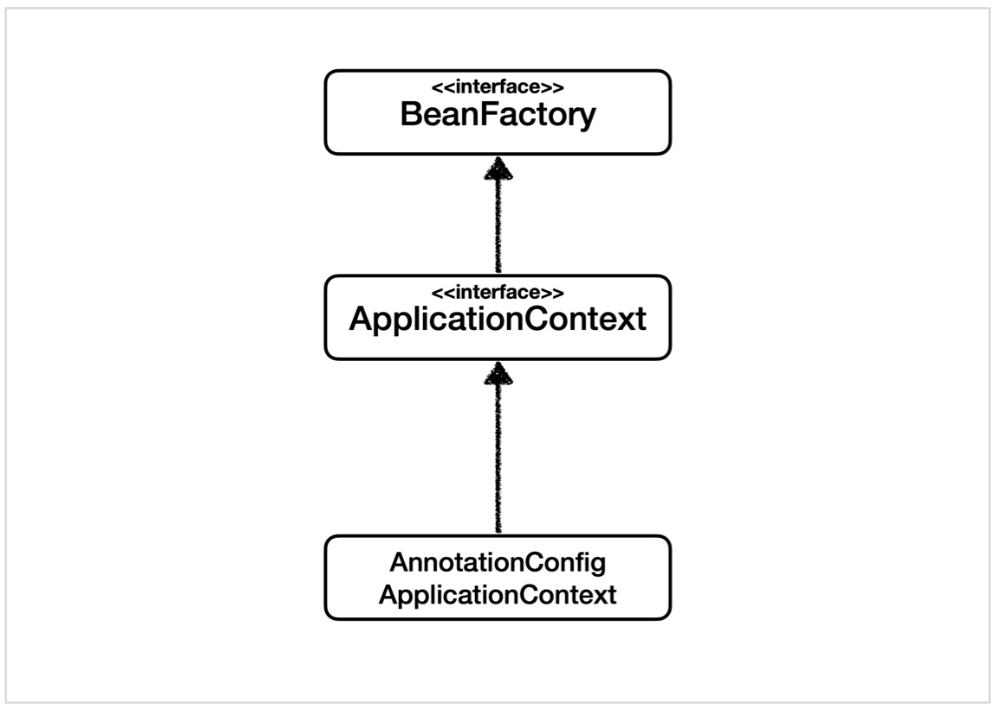

* #### 스프링이란???
  * ##### 스프링 생태계
  
  * ##### 스프링 프레임워크
    * 핵심 기술: 스프링 DI 컨테이너, AOP, 인벤트, 기타
    * 웹 기술: 스프링 MVC, 스프링 WebFlux
    * 데이터 접근 기술: 트랜잭션, JDBC, ORM지원, XML지원
    * 기술 통합: 캐시, 이메일, 원격 접근, 스케줄링
    * 테스트: 스프링 기반 테스트 지원
    * 언어: 코틀린, 그루비
  * ##### 스프링 부트
    * 스프링을 편리하게 사용할 수 있도록 지원, 최근에는 기본으로 사용
    * 단독으로 실핼할 수 있는 스프링 애플리케이션을 쉽게 생성
    * Tomcat 같은 웹 서버를 내장해서 별도의 웹 서버를 설치하지 않아도 된다
    * 손쉬운 빌드 구성을 위한 starter 종속성 제공
    * 스프링과 3rd parth(외부) 라이브러리 자동 구성
    * 메트릭, 상태 확인, 외부 구성 같은 프로덕션 준비 기능 제공
    * 관례에 의한 간결한 설정
  * ##### 핵심개념
    * 단순하게 API사용법이나 위에서 정의한 기술들이 아닌, 자바 언어(`객체 지향`)의 프레임 워크
    * `객체 지향 언어가 가진 강력한 특징을 살려내는 프레임워크`
    * `좋은 객체 지향 애플리케이션`을 개발할 수 있게 도와주는 프레임워크
* #### 좋은 객체지향 프로그래밍이란???
  * ##### 객체 지향 특징
    * 추상화
    * 캡슐화
    * 상속
    * 다형성
  * ##### 객체 지향 프로그래밍
    * 객체 지향 프로그래밍은 컴퓨터 프로그램을 명령어의 목록으로 보는 시각에서 벗어나 여러개의 독립된 단위, 즉 `객체`들의 `모임`으로 파악하고자 하는 것이다.
    * 각각의 `객체`는 `메세지`를 주고받고, 데이터를 처리할 수 있다(`협력`)
    * 객체 지향 프로그래밍은 프로그램을 `유연`하고 `변경`이 용이하게 만들기 때문에 대규모 소프트웨어 개발에 많이 사용된다.
* #### 유연하고, 변경이 용이???
  * ##### 다형성(Polymorphism)
    * `역할`과 `구현`으로 세상을 구분
    
    * 자동차 모델이 바뀌어도 운전자에게 영향을 주지 않는다
      * `유연하고 변경에 용이하다`
    * 자동차 구현을 무한으로 가능하다.
      * `클라이언트에 영향을 주지 않고 새로운 기능을 제공할 수 있다`
    * 운전자는 자동차 인터페이스에만 의존하고있다
      * `구현의 목적은 클라이언트를 위함이다.`
      
    * 배우는 대체가 가능해야 한다(무명 배우로라도)
      * `역할과 구현을 나눔으로 인하여 변경 가능한 대체가능성이 생긴다(유연하고 변경에 용의)`
    * 로미오가 클라이언트고 줄리엣이 서버라면 
      * `서버의 구현이 바뀐다 하여 클라이언트에 영향을 미치지 않는다`
  * ##### 역할과 구현을 분리
    * `역할`과 `구현`으로 구분하면 세상이 `단순`해지고, `유연`해지며 `변경`도 편리해진다
    * 장점
      * `클라이언트`는 대상의 역할(인터페이스)만 알면 된다.
      * `클라이언트`는 구현 대상의 `내부 구조를 몰라도`된다.
      * `클라이언트`는 구현 대상의 `내부 구조가 변경`되어도 영향을 받지 않는다.
      * `클라이언트`는 구현 `대상 자체를 변경`해도 영향을 받지 않는다.
  * ##### 영할과 구현을 분리(자바 언어)
    * 자바 언어의 다형성을 활용
      * 역할 = 인터페이스
      * 구현 = 인터페이스를 구현한 클래스, 구현 객체
    * 객체를 설계할 때 `역할`과 `구현`을 명확하게 분리하여 설계한다.
    * 객체 설계시 역할(인터페이스)을 먼저 부여하고, 그 역할을 수행하는 구현 객체를 만드는 순으로 진행한다.
  * ##### 객체의 협렵
     
    * 혼자 있는 객체는 존재하지 않는다.
    * 클라이언트: `요청`, 서버: `응답`
    * 수 많은 객체 클라이언트와 객체 서버는 서로 협력 관계를 가진다.
---
  * ##### 자바 언어의 다형성
    * 오버라이딩을 떠올려보자
    * 오라이딩은
  * 다형성의 본질
    * `클라이언트를 변경하지 않고, 서버의 구현 기능을 유연하게 변경할 수 있다.`
      * 인터페이스의 구현체를 무한한게 생성할 수 있다.
      * 인터페이스를 안정적으로 설계하는것이 정말 중요하다.
---
  * #### `좋은 객체 지향 설계의 5가지 원칙(SOLID)`
    * ##### 단일 책임 원칙(Single Responsibility Principle)_SRP
      * 한 클래스는 하나의 책임만 가져야 한다.
        * 하나의 책임이라는 것은 모호하다.
          * 클 수도 있고, 작을 수 있다.
          * 문맥과 상황에 따라 다르다.
        * `중요한 기준은 변경`
          * 변경이 있을 때 파급 효과가 적으면(하나의 지점만 고치면) 단일 책인 원칙을 잘 따른 것 이다. 
  * ##### `개방-폐쇄 원칙(Open/Closed Principle)_OCP`
    * 소프트웨어 요소는 `확장에는 열려` 있으나 `변경에는 닫혀`있어야 한다.
      * 새로운 클래스를 만드는것은 기존코드 변경이 아니다
    * 
    * 문제점
      * 별도의 무언가 == 스프링 컨테이너
  * LSP
    * 
  * ISP
    * 인터페이스를 기능에 맞게 적절하게 쪼개야한다
  * `DIP`
* #### 객체 지향 설계와 스프링
  * DI 컨테이너 제공
    * 자바객체들을 어떠한 컨테이너 안에 넣어두고 이 안에서 의존관계를 서로 연결하고 주입하는 기능을 제공
      * `클라이언트 코드의 변경 없이 기능 확장`
  * 실무 고민
    * 추상화라는 비용
    *  추상화가 되버리면 개발자 코드를 한 번 더 열어봐야 한다
---
* ### 비즈니스 요구사항과 설계
  * #### 회원
    * 회원을 `가입`하고 `조회`할 수 있다.
    * 회원은 `일반`과 `VIP` 두 가지 등급이 존재한다.
    * 회원 데이터는 자체 DB를 구축할 수 있고, 외부 시스템과 연동할 수 있다.(`미확정`)
  * #### 주문과 할인 정책
    * 회원은 `상품을 주문`할 수 있다.
    * 회원 `등급에 따라 할인 정책`을 적용할 수 있다.
    * 할인 정책은 모든 VIP는 1000원을 할인해주는 `고정 금액 할인을 적용`해달라.(나중에 변경 될 수 있다.)
    * 할인 정책은 `변경 가능성`이 높다. 회사의 기본 할인 정책을 아직 정하지 못했고, 오픈 직전까지 고민을 미루고 싶다. 최악의 경우 할인을 적용하지 않을 수 도 있다(미확정)
    * 객체 지향 설계방법을 적용하여 `인터페이스를 만들고` 구현체를 언제든지 갈아끼울 수 있도록 설계한다.
* ### 회원 도메인 설계
  * #### 회원 도메인 요구사항
    * 회원을 `가입`하고 `조회`할 수 있다.
    * 회원은 `일반`과 `VIP` 두 가지 등급이 있다.
    * 회원 데이터는 자체 DB를 구출할 수 있고, 외부 시스템과 연동할 수 있다.(`미활정`)
  * #### 회원 도메인 협력 관계
    
  * #### 회원 클래스 다이어그램
    
  * #### 회원 객체 다이어그램
    
      * 회원 서비스: MemberServiceImpl
* ### 회원 도메인 개발
  * #### 회원 엔티티
    * 회원 등급
    ```Java
    package hello.core01.member;

    public enum Grade {
        BASIC,
        VIP
    }
    ``` 
    * Enum
      * 상수 정의시: final static string 방식으로 상수 정의
        * 다양한 문제점 발생
      * Java 1.5부터 보완
        * `Enum`: `열거형`(`서로 연관된 상수들의 집합`)
      * Enum 의 장점
        * 코드가 단순해지며, 가독성이 좋아진다
        * 인스턴스 생성과 상속을 방지하여 상수값의 타입안정성이 보장된다.
        * `enum class 를 사용해 새로운 상수들의 타입을 정의`하므로 정의한 타입이외의 타입을 가진 데이터값을 컴파일시 체크한다
        * `키워드 enum을 사용`하기 때문에 `구현의 의도가 열거`임을 분명하게 알 수 있다.
    * 회원 엔티티
      ```Java
      package hello.core01.member;

      public class Member {

          private Long id;
          private String name;
          private Grade grade;

          public Member(Long id, String name, Grade grade) {
              this.id = id;
              this.name = name;
              this.grade = grade;
          }

          public Long getId() {
              return id;
          }

          public void setId(Long id) {
              this.id = id;
          }

          public String getName() {
              return name;
          }

          public void setName(String name) {
              this.name = name;
          }

          public Grade getGrade() {
              return grade;
          }

          public void setGrade(Grade grade) {
              this.grade = grade;
          }
      }
      ```
        * 생성자 코드 자동완성: Command + N + Construct
        * get / set 메서드 자동완성: Command + N + Getter and Setter 
  * #### 회원 저장소
    * 회원 저장소 인터페이스
      * 데이터 요구 사항: 회원을 `가입`하고 `조회`할 수 있다. 
      ```Java
      package hello.core01.member;

      public interface MemberRepository {

          void save(Member member); // 가입

          Member findById(Long memberId); // 조회
      }
      ```
    * 메모리 회원 저장소 구현체
      ```Java
      package hello.core01.member;

      import java.util.HashMap;
      import java.util.Map;

      public class MemoryMemberRepository implements MemberRepository{

          private static Map<Long, Member> store = new HashMap<>();
          // 데이터베이스가 아직 확정이 안되었다. 그래도 개발을 진행하야 하니 가장 단순한, 메모리 회원 저장소를 구현해서 우선 개발을 진항한다.
          // HashMap 은 동시성 이슈가 발생할 수 있다. 이런 경우 ConcurrentHashMap을 사용한다.

          @Override
          public void save(Member member) {
              store.put(member.getId(), member);
          }

          @Override
          public Member findById(Long memberId) {
              return store.get(memberId);
          }
      }
      ``` 
        * 추상 메서드 자동완성: 클래스 focus + Option + Enter + Implememt methods   
  * #### 회원 서비스
    * 회원 서비스 인터페이스
      ```Java
      package hello.core01.member;/

      public interface MemberService {

          void join(Member member);

          Member findMember(Long memberId);
      }
      ```
    * 회원 서비스 구현체
      * 구현체가 한 개일 경우: 인터페이스 명 + Impl
      ```Java
      package hello.core01.member;

      public class MemberServiceImpl implements MemberService {

          private final MemberRepository memberRepository = new MemoryMemberRepository();

          @Override
          public void join(Member member) {
              memberRepository.save(member);
          }

          @Override
          public Member findMember(Long memberId) {
              return memberRepository.findById(memberId);
          }
      }
      ```
  * #### 회원 도메인 실행과 테스트
    * 회원 도메인 - 회원 가입 `main`
      * 애플리케이션 로직으로 테스트 하는 것은 좋은 방법은 아니다.
      ```Java
      package hello.core01;

      import hello.core01.member.Grade;
      import hello.core01.member.Member;
      import hello.core01.member.MemberService;
      import hello.core01.member.MemberServiceImpl;

      public class MemberApp {

          public static void main(String[] args) {

              MemberService memberService = new MemberServiceImpl();
              Member member = new Member(1L, "memberA", Grade.VIP);
              memberService.join(member);

              Member findMember = memberService.findMember(1L);
              System.out.println("new member = " + member.getName());
              System.out.println("find member = " + findMember.getName());

          }
      }
      ```
        * public static void main(String[] args){} 자동 완성: psvm
        * 반환 타입 자동 완성: Command + Option + V
        * System.out.println() 자동 완성: soutv
    * 회원 도메인 - 회원 가입 `Test`
      * JUnit 테스트 사용
      ```Java
      package hello.core01.member;

      import org.assertj.core.api.Assertions;
      import org.junit.jupiter.api.Test;

      import static org.assertj.core.api.Assertions.*;

      public class MemberServiceTest {

          MemberService memberService = new MemberServiceImpl();

          @Test
          void join() {
              // given
              Member member = new Member(1L, "memberA", Grade.VIP);

              // when
              memberService.join(member);
              Member findMember = memberService.findMember(1L);

              // then
              assertThat(member).isEqualTo(findMember);
          }
      }
      ```
      * TestCode Given, When, Then 기법
        * given: 이러한 상황이 주어졌을 떄
        * when: 이렇게 했을 떄
        * then: 이렇게 된다
    * 회원 도메인 설계의 문제점
      * 다른 저장소로 변경할 때 OCP 원칙을 잘 준수하는가?
      * DIP를 잘 지키고 있는가?
      * `의존관계가 인터페이스 뿐만 아니라 구현까지 모두 의존하는 문제점이 존재한다`
  * #### 주문과 할인 도메인 설계
    * 주문과 할인 정책
      * 회원은 `상품을 주문`할 수 있다.
      * 회원 `등급에 따라 할인 정책을 적용`할 수 있다.
      * 할인 정책은 `모든 VIP는 10000원을 할인`해주는 고정 금액 할인을 적용해달라.(나중에 변경될 수 있다.)
      * 할인 정책은 변경 가능성이 높다. 회사의 기본 할인 정책을 아직 정하지 못했고, 오픈 직전까지 고민을 미루고 싶다. 최악의 경우 할인을 적용하지 않을 수 도 있다.(미확정)
    * 주문 도메인 협력, 역할, 책임
      
      1. 주문 생성: 클라이언트는 `주문 서비스에 주문 생성을 요청`한다
      2. 회원 조회: 할인을 위해서는 회원 등급이 필요하다. 그래서 `주문 서비스는 회원 저장소에서 회원을 조회`한다.
      3. 할인 적용: 주문 서비스는 `회원 등급에 따른 할인 여부를 할인 정책에 위임`하다.
      4. 주문 결과 반환: 주문 서비스는 `할인 결과를 포함한 주문 결과를 반환`하다.
    * 주문 도메인 전체
      * `역할과 구현을 분리`해서 자유롭게 구현 객체를 조립할 수 있게 설계했다. 덕분에 회원 저장소를 물론이고, 할인 정책도 유연하게 변경할 수 있다.
      
    * 주문 도메인 클래스 다이어그램
       
    * 주문 도메인 객체 다이어그램
      * 회원을 메모리에서 조회하고, 정액 할인 정책(고정 금액)을 지원해도 주문 서비스를 변경하지 않아도 된다. 역할들의 협력 관계를 그대로 재사용 할 수 있다.
       
  * #### 주문과 할인 도메인 개발
    * 할인 정책 인터페이스
      ```Java
      package hello.core01.discount;

      import hello.core01.member.Member;

      public interface DiscountPolicy {
          /**
          * @return 할인 대상 금액
          */
          int discount(Member member, int price);

      }
      ```
    * 정액 할인 정책 구현체
      ```Java
      package hello.core01.discount;

      import hello.core01.member.Grade;
      import hello.core01.member.Member;

      public class FixDiscountPolicy implements DiscountPolicy {

          private int discountFixAmount = 1000;

          @Override
          public int discount(Member member, int price) {
              if (member.getGrade() == Grade.VIP) {   // enum type 은 == 이 가능하다
                  return discountFixAmount;
              } else {
                  return 0;
              }
          }
      }
      ```  
    * 주문 엔티티
      ```Java
      package hello.core01.order;

      public class Order {

          private Long memberId;
          private String itemName;
          private int itemPrice;
          private int discountPrice;

          public Order(Long memberId, String itemName, int itemPrice, int discountPrice) {
              this.memberId = memberId;
              this.itemName = itemName;
              this.itemPrice = itemPrice;
              this.discountPrice = discountPrice;
          }

          // 최종 계산 로직
          public int calculatePrice() {
              return itemPrice - discountPrice;
          }

          public Long getMemberId() {
              return memberId;
          }

          public void setMemberId(Long memberId) {
              this.memberId = memberId;
          }

          public String getItemName() {
              return itemName;
          }

          public void setItemName(String itemName) {
              this.itemName = itemName;
          }

          public int getItemPrice() {
              return itemPrice;
          }

          public void setItemPrice(int itemPrice) {
              this.itemPrice = itemPrice;
          }

          public int getDiscountPrice() {
              return discountPrice;
          }

          public void setDiscountPrice(int discountPrice) {
              this.discountPrice = discountPrice;
          }

          // 객체를 출력하면 toString() 결과가 나온다: Command + N + toString
          @Override
          public String toString() {
              return "Order{" +
                      "memberId=" + memberId +
                      ", itemName='" + itemName + '\'' +
                      ", itemPrice=" + itemPrice +
                      ", discountPrice=" + discountPrice +
                      '}';
          }
      }
      ```
    * 주문 서비스 인터페이스
      ```Java
      package hello.core01.order;

      public interface OrderService {

          Order createOrder(Long memberId, String itemName, int itemPrice);
      }
      ``` 
    * 주문 서비스 구현체
      * 주문 생성 요청이 오면, 회원 정보를 조회하고, 할인 정책을 적용한 다음 주문 객체를 생성해서 반환하다.
      * `메모리 회원 리포지토리와, 고정 금액 할인 정책을 구현체로 생성한다.`
      ```Java
      package hello.core01.order;

      import hello.core01.discount.DiscountPolicy;
      import hello.core01.discount.FixDiscountPolicy;
      import hello.core01.member.Member;
      import hello.core01.member.MemberRepository;
      import hello.core01.member.MemoryMemberRepository;

      public class OrderServiceImpl implements OrderService {

          private final MemberRepository memberRepository = new MemoryMemberRepository();
          private final DiscountPolicy discountPolicy = new FixDiscountPolicy();

          @Override
          public Order createOrder(Long memberId, String itemName, int itemPrice) {
              Member member = memberRepository.findById(memberId);
              int discountPrice = discountPolicy.discount(member, itemPrice);

              return new Order(memberId, itemName, itemPrice, discountPrice);
          }
      }
      ``` 
  * #### 주문 할인 도메인 실핼과 테스트
    * 주문과 할인 정책 실행
      ```Java
      package hello.core01;

      import hello.core01.member.Grade;
      import hello.core01.member.Member;
      import hello.core01.member.MemberService;
      import hello.core01.member.MemberServiceImpl;
      import hello.core01.order.Order;
      import hello.core01.order.OrderService;
      import hello.core01.order.OrderServiceImpl;

      public class OrderApp {

          public static void main(String[] args) {
              MemberService memberService = new MemberServiceImpl();
              OrderService orderService = new OrderServiceImpl();

              long memberId = 1L;

              Member member = new Member(memberId, "memberA", Grade.VIP);
              memberService.join(member);

              Order order = orderService.createOrder(memberId, "itemA", 10000);

              System.out.println("order = " + order);
              System.out.println("order.calculatePrice = " + order.calculatePrice());
          }
      }
      ``` 
    * 주문과 할인 정책 테스트
      ```Java
      package hello.core01.order;

      import hello.core01.member.Grade;
      import hello.core01.member.Member;
      import hello.core01.member.MemberService;
      import hello.core01.member.MemberServiceImpl;
      import org.junit.jupiter.api.Test;

      import static org.assertj.core.api.Assertions.assertThat;

      class OrderServiceTest {

          MemberService memberService = new MemberServiceImpl();
          OrderService orderService = new OrderServiceImpl();

          @Test
          void createOrder() {
              long memberId = 1L;
              Member member = new Member(memberId, "memberA", Grade.VIP);
              memberService.join(member);

              Order order = orderService.createOrder(memberId, "itemA", 10000);
              assertThat(order.getDiscountPrice()).isEqualTo(1000);
          }
      }
      ```    
* ### 객체 지향 원리 적용
  * #### 새로운 할인 정책 확장
    * 악덕 기획자: 서비스 오픈 직전에 할인 정책을 지금처럼 고정 금액 할인이 아니라 좀 더 합리적인 주문금액당 할인하는 정률% 할인으로 변경하고 싶어요. 예를 들어서 기존 정책은 VIP가 10000원을 주문하든 20000원을 주문하든 항상 1000원을 할인했는데, 이번에 새로 나온 정책은 10%로 지정해두면 고객이 10000원 주문시 1000원 할인해주고, 20000원 주문시에 2000원을 할인해주는 거예요!
    * 순진한 개발자: 제가 처음부터 고정 금액 할인은 아니라고 했잖아요...
    * 악던 기획자: 애자일 소프트웨어 개바 선언 몰라요? "계획을 따르기보다 변화에 대응하기를"
    * 순진한 개발자: ...(하지만 난 유연한 설계가 가능하도록 객체지향 설계 원칙을 준수했지)
  * #### 애자일 소프트웨어 개발 선언
     
  * #### RateDiscountPolicy 추가
    
    ```Java
     package hello.core01.discount;

     import hello.core01.member.Grade;
     import hello.core01.member.Member;

     public class RateDiscountPolicy implements DiscountPolicy{

         private int discountPercent = 10;

         @Override
         public int discount(Member member, int price) {
             if (member.getGrade() == Grade.VIP) {
                 return price - discountPercent / 100;
             } else {
                 return 0;
             }
         }
     }
      ```
  * #### 테스트 작성
      ```Java
      package hello.core01.discount;

      import hello.core01.member.Grade;
      import hello.core01.member.Member;
      import org.junit.jupiter.api.DisplayName;
      import org.junit.jupiter.api.Test;

      import static org.assertj.core.api.Assertions.assertThat;

      class RateDiscountPolicyTest {

          RateDiscountPolicy discountPolicy = new RateDiscountPolicy();

          /**
          * 성공 사례
          */
          @Test
          @DisplayName("VIP 는 10% 할인 정책을 받는다")
          void vip_0() {
              // given
              Member member = new Member(1L, "memberVIP", Grade.VIP);

              // when
              int discount = discountPolicy.discount(member, 10000);

              // then
              assertThat(discount).isEqualTo(1000);
          }

          /**
          * 실패 사례
          */
          @Test
          @DisplayName("VIP 가 아니면 10% 할인 정책을 받을 수 없다.")
          void vip_x() {
              // given
              Member member = new Member(2L, "memberBASIC", Grade.BASIC);

              // when
              int discount = discountPolicy.discount(member, 10000);

              // then
              assertThat(discount).isEqualTo(0);
          }
      }
      ```
  * #### 새로운 할인 정책 적용과 문제점
    * #### 할인 정챌을 애플리케이션에 적용
      * `할인 정책을 변경하려면 클라이언트인 OrderServiceImpl 코드를 고쳐야한다.`
        ```Java
        public class OrderServiceImpl implements OrderService{

          // private final DiscountPolicy discountPolicy = new FixDiscountPolicy();
          private final DiscountPolicy discountPolicy = new RateDiscountPolicy();
        }
        ``` 
    * #### 문제점 발견
      * 우리는 역할과 구현을 충실하게 분리했다->OK
      * 다형성도 활용하고, 인터페이스와 구현 객체를 분리했다->OK
      * OCP, DIP 같은 객체지향 설계 원칙을 충실히 준수했다->`그렇게 보이지만 사실을 아니다.`
      * DIP: 주문서비스 클라이언트(OrderService)는 DiscountPolicy 인터페이스에 의존하면서 DIP를 지킨 것 같은데??
        * 클래스 의존관계를 분석해 보자.
        * 추상(인스턴스) 뿐만 아니라 `구체(구현)클래스에도 의존`하고 있다.
          * 추상(인터페이스) 의존: DiscountPolicy
          * 구체(구현) 클래스: FixDiscountPolicy, RateDiscountPolicy
      * OCP: 변경하지 않고 확장 할 수 있다고 했는데...
        * `지금 코드는 기능을 활장해서 변경하면, 클라이언트 코드에 영향을 준다!`
        * 따라서 `OCP를 위반`한다. 
    * #### 왜 클라이언트 코드를 변경해야 할까?
      * 기대했던 의존관계
         
         * 단순히 DiscountPolicy 인터페이스만 의존한다고 생각
       * 실제 의존관계
         
         * 잘 보면 클라이언트인 OrderServiceImpl 이 DiscountPolicy 인터페이스 뿐만 아니라 FixDiscountPolicy 인 구체 클래스도 함께 의존하고 있다. `DIP 위반` 
       * 정책 변경
             
         * `중요`: 그래서 FixDiscountPolicy 를 RateDiscountPolicy로 변경하는 순간 OrderServiceImpl의 소스 코드도 함께 변경해야 한다(`OCP 위반`)
    * #### 어떻게 문제를 해결??
      * 클라이언트 코드인 OrderServiceImpl은 DiscountPolicy의 인터페이스 뿐만 아니라 구체 클래스도 함께 의존한다.
      * 그래서 구체 클래스를 변경할 때 클라이언트 코드도 함께 변경해야 한다.
      * `DIP 위반` -> 추상에서만 의존하도록 변경(`인터페이스에만 의존`)
      * DIP를 위반하지 않도록 인터페이스에만 의존하도록 의존관계를 변경해면 된다.
    * #### 인터페이스에만 의존하도록 설계를 변경
       
      * 인터페이스에만 의존하도록 코드 변경
        ```Java
        public class OrederServiceImpl implements OrderService{
          // private final DiscountPolicy discountPolicy = new RateDiscountPolicy();
          private DiscountPolicy discountPolicy;
        } 
        ```
        * 인터페이스에만 의존하도록 설계와 코드를 변경했다.
        * `그런데 구현체가 없는데 어떻게 코드를 실핼할 수 있을까?`
        * 실제 실행을 해보면 NPE(Null Pointer Exception)가 발생한다.
      * 해경방안
        * 이 분제를 해결하려면 누군가 클라이언트인 OrderServiceImpl에 DiscountPolicy의 구현 객체를 대신 생성하고 주입해주어야 한다.
* ### 관심사의 분리
  * 애플리케이션을 하나의 공연이라 생각해보자. 각각의 인터페이스를 배역(배우 역할)이라 생각하자. 그런데 `실제 배역을 맞는 배우를 선택하는 겻은 누가 하는가?`
  * 로미오와 줄리엣 공연을 하면 로미오 역할을 누가 할지 줄리엣 열할을 누가 할지는 배우들이 정하는게 아니다. 이전 코드는 마치 로미오 역할(인터페이스)을 하는 레오나르도 디카프리오(구현체, 배우)가 줄리엣 역할(인터페이스)을 하는 여자 주인공(구현체, 배우)을 직접 초빙하는 것과 같다. 디카프리오는 공연도 해야하고 동시에 여자 주인공도 직접 초빙해야 하는 `다양한 책임`을 가지고 있다.
  * #### 관심사를 분리하자.
    * 배우는 본인의 역할인 배역을 수행하는 것에만 집중해야 한다.
    * 디카프리오는 어떤 여자 주인공이 선택되더라도 똑같이 공연을 할 수 있어야 한다.
    * 공연을 구성하고, 담당 배우를 섭외하고, 열할에 맞게 배우를 지정하는 책임을 담당하는 별도의 `공연 기획자`가 나올시점이다.
    * 공연 기획자를 만들고, 배우와 공연 기획자의 책임을 확실히 분리하자.
  * #### AppConfig 등장
    * 애플리케이션의 전체 동작 방식을 구성(config)하기 위해, `구현 객체를 생성`하고, `연결`하는 책임을 가지는 별도의 설정 클래스를 만들자
      ```Java
      package hello.core01;

      import hello.core01.discount.FixDiscountPolicy;
      import hello.core01.member.MemberService;
      import hello.core01.member.MemberServiceImpl;
      import hello.core01.member.MemoryMemberRepository;
      import hello.core01.order.OrderService;
      import hello.core01.order.OrderServiceImpl;

      public class AppConfig {

          public MemberService memberService() {
              return new MemberServiceImpl(new MemoryMemberRepository());
          }

          public OrderService orderService() {
              return new OrderServiceImpl(
                      new MemoryMemberRepository(),
                      new FixDiscountPolicy()
              );
          }
      }
      ```
    * AppConfig는 애플리케이션의 실제 동작에 필요한 `구현 객체를 생성`한다.
      * MemberServiceImpl
      * MemoryMemberRepository
      * OrderServiceImpl
      * FixDiscountPolicy
    * AppConfig는 생성한 객체 인스턴스의 참조(레퍼런스)를 `생성자를 통해서 주입(연결)`해준다.
      * MemberServiceImpl -> MemoryMemberRepository
      * OrderServiceImpl -> MemoryMemberRepository, FixDiscountPolicy
    * 참고: 지금은 각 클래스에 생성자가 없어서 컴파일 오류가 발생한다.
  * #### MemberServiceImpl - 생성자 주입
    ```Java
    package hello.core01.member;

    public class MemberServiceImpl implements MemberService {

        private final MemberRepository memberRepository;

        public MemberServiceImpl(MemberRepository memberRepository) {
            this.memberRepository = memberRepository;
        }

        @Override
        public void join(Member member) {
            memberRepository.save(member);
        }

        @Override
        public Member findMember(Long memberId) {
            return memberRepository.findById(memberId);
        }
    }
    ```
    * 설계 변경으로 MemberServiceImpl은 MemoryMemberRopository를 의존하지 않는다!
    * 단지 MemberRepository 인터페이스만 의존한다.
    * MemberServiceImpl입장에서 생성자를 통해 어떤 구현 객체가 들어올지(주입된지)는 알 수 없다.
    * MemberServiceImpl의 생성자를 통해서 어떤 구현 객체를 주입할지는 오직 외부(AppConfig)에서 결정된다.
    * MemberServiceImpl은 이제부터 `의존관계에 대한 고민은 외부`에 맡기고 `실행에만 집중`하면 된다.
  * #### 클래스 다이어그램 
     
    * 객체의 생성과 연결은 AppConfig가 담당한다.
    * `DIP완성`: MemberServiceImpl은 MemberRepository인 추상에서만 의존하면 된다. 이제 구체 클래스를 몰라도 된다.
    * `관심사의 분리`: 객체를 생성하고 연결하는 역할과 실행하는 역할이 명확히 분리되었다.
  * #### 회원 객체 인스턴스 다이어그램
     
     * appConfig객체는 memoryMemberRepository객체를 생성하고 그 참조값을 memberServiceImpl을 생성하면서 생성자로 전달한다
     * 클라이언트인 memberServiceImpl입장에서 보면 의존관계를 마치 외부에서 주입해주는 것 같다고 해서 `DI(Dependency Injection)` 우리말로 `의존관계 주입` 또는 `의존성 주입`이라 한다.
   * #### OrderServiceImpl - 생성자 주입
     ```Java
      package hello.core01.order;

      import hello.core01.discount.DiscountPolicy;
      import hello.core01.member.Member;
      import hello.core01.member.MemberRepository;

      public class OrderServiceImpl implements OrderService {

          private MemberRepository memberRepository;
          private DiscountPolicy discountPolicy;

          public OrderServiceImpl(MemberRepository memberRepository, DiscountPolicy discountPolicy) {
              this.memberRepository = memberRepository;
              this.discountPolicy = discountPolicy;
          }

          @Override
          public Order createOrder(Long memberId, String itemName, int itemPrice) {
              Member member = memberRepository.findById(memberId);
              int discountPrice = discountPolicy.discount(member, itemPrice);

              return new Order(memberId, itemName, itemPrice, discountPrice);
          }
      }
      ```
      * 설계 변경으로 OrderServiceImpl은 FixDiscountPolicy를 의존하지 않는다.
      * 단지 DiscountPolicy 인터페이스만 의존한다.
      * OrderServiceImpl 입장에서 생성자를 통해 어떤 구현 객체가 들어올지(주입될지)는 알 수 없다.
      * OrderSerciveImpl 의 생성자를 통해서 어떤 구현 객체를 주입할지는 오직 외부(AppConfig)에서 결정한다.
      * OrderServiceImpl 은 이제부터 `실행`에만 집중하면 된다.
      * OrderServiceImpl 에는 MemoryMemberRepository, FixDiscountPolicy객체의 의존관계가 주입된다.
* ### AppConfig 실행
  * #### 사용 클래스 - MemberApp
    ```Java
    package hello.core01;
    
    import hello.core01.AppConfig;
    import hello.core01.member.Grade;
    import hello.core01.member.Member;
    import hello.core01.member.MemberService;

    public class MemberApp {

        public static void main(String[] args) {
            AppConfig appConfig = new AppConfig();

            MemberService memberService = appConfig.memberService();

            Member member = new Member(1L, "memberA", Grade.VIP);
            memberService.join(member);
            Member findMember = memberService.findMember(1L);

            System.out.println("findMember = " + findMember);
            System.out.println("member = " + member);
        }
    }
    ```
  * #### 사용 클래스 - OrderApp
    ```Java
    package hello.core01;

    import hello.core01.member.Grade;
    import hello.core01.member.Member;
    import hello.core01.member.MemberService;
    import hello.core01.order.Order;
    import hello.core01.order.OrderService;

    public class OrderApp {

        public static void main(String[] args) {
            AppConfig appConfig = new AppConfig();
            MemberService memberService = appConfig.memberService();
            OrderService orderService = appConfig.orderService();

            long memberId = 1L;

            Member member = new Member(memberId, "memberA", Grade.VIP);
            memberService.join(member);

            Order order = orderService.createOrder(memberId, "itemA", 10000);

            System.out.println("order = " + order);
            System.out.println("order.calculatePrice = " + order.calculatePrice());
        }
    }
    ``` 
  * #### 테스트 코드 오류 수정
    ```Java
    package hello.core01.member;

    import hello.core01.AppConfig;
    import org.junit.jupiter.api.BeforeEach;
    import org.junit.jupiter.api.Test;

    import static org.assertj.core.api.Assertions.assertThat;

    public class MemberServiceTest {

        MemberService memberService;

        @BeforeEach
        public void beforeEach() {
            AppConfig appConfig = new AppConfig();
            memberService = appConfig.memberService();
        }

        @Test
        void join() {
            // given
            Member member = new Member(1L, "memberA", Grade.VIP);

            // when
            memberService.join(member);
            Member findMember = memberService.findMember(1L);

            // then
            assertThat(member).isEqualTo(findMember);
        }
    }
    ``` 
    ```Java
    package hello.core01.order;

    import hello.core01.AppConfig;
    import hello.core01.member.Grade;
    import hello.core01.member.Member;
    import hello.core01.member.MemberService;
    import org.junit.jupiter.api.BeforeEach;
    import org.junit.jupiter.api.Test;

    import static org.assertj.core.api.Assertions.assertThat;

    class OrderServiceTest {

        MemberService memberService;
        OrderService orderService;

        @BeforeEach
        public void beforeEach() {
            memberService = new AppConfig().memberService();
            orderService = new AppConfig().orderService();
        }

        @Test
        void createOrder() {
            long memberId = 1L;
            Member member = new Member(memberId, "memberA", Grade.VIP);
            memberService.join(member);

            Order order = orderService.createOrder(memberId, "itemA", 10000);
            assertThat(order.getDiscountPrice()).isEqualTo(1000);
        }
    }
    ```
    * @BeforeEach:테스트코드에서 각 테스트를 실행하기 전에 호출된다.
  * #### 정리
    * AppConfig를 통해서 관심사를 확실하게 분리했다.
    * 배역, 배우를 생각해보자
    * AppConfig는 공연 기획자다.
    * AppConfigsms 구체 클래스를 선택한다. 배역에 맞는 담당 배우를 선택한다. 애플리케이션이 어떻게 동작해야 할지 전체 구성을 책임진다.
    * 이제 각 배우들은 담당 기능을 실행하는 책임만 지면 된다.
    * OrderServiceImpl 은 기능을 실행하는 책임만 지면 된다.
* ### AppConfig 리팩터링
  * 현재 AppConfig를 보면 `중복`이 있고, `역할`에 따른 `구현`이 잘 안보인다.
  * #### 기대하는 그림
      
  * #### 리펙터링 전
    ```Java
    package hello.core01;

    import hello.core01.discount.FixDiscountPolicy;
    import hello.core01.member.MemberService;
    import hello.core01.member.MemberServiceImpl;
    import hello.core01.member.MemoryMemberRepository;
    import hello.core01.order.OrderService;
    import hello.core01.order.OrderServiceImpl;

    public class AppConfig {

        public MemberService memberService() {
            return new MemberServiceImpl(new MemoryMemberRepository());
        }

        public OrderService orderService() {
            return new OrderServiceImpl(
                    new MemoryMemberRepository(),
                    new FixDiscountPolicy()
            );
        }
    }
    ``` 
    * 중복을 제거하고, 역할에 따른 구현이 보이도록 리펙터링 하자.
  * #### 리렉터링 후
    ```Java
    package hello.core01;

    import hello.core01.discount.DiscountPolicy;
    import hello.core01.discount.FixDiscountPolicy;
    import hello.core01.member.MemberRepository;
    import hello.core01.member.MemberService;
    import hello.core01.member.MemberServiceImpl;
    import hello.core01.member.MemoryMemberRepository;
    import hello.core01.order.OrderService;
    import hello.core01.order.OrderServiceImpl;

    public class AppConfig {

        public MemberService memberService() {
            return new MemberServiceImpl(memberRepository());
        }

        public OrderService orderService() {
            return new OrderServiceImpl(
                    memberRepository(),
                    discountPolicy()
            );
        }

        private MemberRepository memberRepository() {
            return new MemoryMemberRepository();
        }

        private DiscountPolicy discountPolicy() {
            return new FixDiscountPolicy();
        }
    }
    ``` 
    * Extract Method: Command + Option + M, 반환타입은 인터페이스
    * 메서드를 추출한 순간 역할이 드러나게되는 장점을 지닌다
    * 설계에 대한 정보(그림)이 구성정보에 그대로 드러난다
    * 메서드명과 리턴타입을 통해 열할을 확인할 수 있다.
    * `new MemoryMemberRepository()`이 부분이 중복 제거되었다.
    * 이제 `MemoryMemberRepository`를 다른 구현체로 변경할 때 한 부분만 변경하면 된다.
    * AppConfig를 보면 역할과 구현 클래스가 한눈에 들어온다.
    * 애플리케이션 전체 구성이 어떻게 되어있는지 빠르게 파악할 수 있다.
* ### 새로운 구조와 할인 정책 정용
  * FixDiscountPolicy -> RateDiscountPolicy
  * `AppConfig의 등장`으로 애플리케이션이 크게 `사용`영역과, 객체를 생성하고 `구성(Configuration)`하는 영역으로 분리되었다.
  * #### 사용, 구성의 분리
     
  * #### 할인 정책의 변경
     
    * FixDiscountPolicy -> RateDiscountPolicy 로 변경해도 구성 영역만 영향을 반고, `사용 영역은 전혀 영향을 받지 않는다.`
  * #### 할인 정책 변경 구성 코드
    ```Java
    package hello.core01;

    import hello.core01.discount.DiscountPolicy;
    import hello.core01.discount.RateDiscountPolicy;
    import hello.core01.member.MemberRepository;
    import hello.core01.member.MemberService;
    import hello.core01.member.MemberServiceImpl;
    import hello.core01.member.MemoryMemberRepository;
    import hello.core01.order.OrderService;
    import hello.core01.order.OrderServiceImpl;

    public class AppConfig {

        public MemberService memberService() {
            return new MemberServiceImpl(memberRepository());
        }

        public OrderService orderService() {
            return new OrderServiceImpl(
                    memberRepository(),
                    discountPolicy()
            );
        }

        private MemberRepository memberRepository() {
            return new MemoryMemberRepository();
        }

        private DiscountPolicy discountPolicy() {
            return new RateDiscountPolicy();
        }
    }
    ``` 
    * AppConfig에서 할인 정책 영역을 담당하는 구현을 FixDiscountPolict -> RateDiscountPolicy 객체로 변경했다.
    * 이제 할인 정책을 변경해도, 애플리케이션의 `구성 역할을 담당하는 AppConfig만 변경하면 된다.` 클라이언트 코드인 OrederServiceImpl를 포함해서 `사용영역`의 어떤 코드도 변경할 필요가 없다.
    * `구성 영역`은 당연히 변경된다. 구성 역할을 담당하는 AppConfig를 애플리케이션이라는 공연의 기획자로 생각하자. 공연 기획자는 공연 쳠여자인 구현 객체들을 모두 알아야 한다.
* ### 좋은 객체 지향 설계의 5가지 원칙의 적용
  * #### SRP 단일 책임 원칙
    * `한 클래스는 하나의 책임만 가져야 한다`
    * 클라이언트 객체는 직접 구현 객체를 생성하고, 연결하고, 실행하는 다양한 책임을 가지고 있다.
    * SRP 단일 책임 원칙을 따르면서 관심사를 분리한다.
    * 구현 객체를 생성하고 연결하는 책임은 AppConfig가 담당
    * 클라이언트 객체는 실행하는 책임만 담당
  * #### DIP 의존관계 역전 원칙
    * `프로그래머는 "추상화(인터페이스)에 의존해야지, 구체화(구현 클래스)에 의존하면 안된다." 의존성 주입은 이 원칙을 따르는 방법중 하나다`
    * 새로운 할인 정책을 개발하고, 적용하려고 하니 클라이언트 코드도 함꼐 변경해야 했다. 왜냐하면 기존 클라이언트 코드(OrderServiceImpl)는 DIP를 지키며 DiscountPolicy 추상화 인터페이스에 의존하는 것 같았지만, FixDiscountPolicy 구체화 구현 클래스에도 함께 의존했다.
    * 클라이언트 코드가 DiscountPolicy 추상화 인터페이스에만 의존하도록 코드를 변경했다.
    * 하지만 클라이언트 코드는 인터페이스만으로는 아무것도 실행할 수 없다.
    * AppConfig 가 FixDiscountPolicy 객체 인스턴스를 클라이언트 코드 대신 생성해서 클라이언트 코드에 의존관계를 주입했다. 이렇게해서 DIP 원칙을 따르면서 문제도 해결했다.
  * #### OCP
    * `소프트웨어 요소는 확장에 열려 있으나 변경에는 닫혀 있어야 한다.`
    * 다형성 사용하고 클라이언트가 DIP를 지킴
    * 애플리케이션을 `사용 영역`과 `구성 영역`으로 나눔
    * AppConfig가 의존관계를 FixDiscountPolicy -> RateDiscountPolicy로 변경해서 클라이언트 코드에 주입하므로 클라이언트 코드는 변경하지 않아도 된다.
    * `소프트웨어 요소를 새롭게 확장해도 사용 영역의 변경은 닫혀 있다!`
* ### IoC, DI, 컨테이너
  * #### 제어의 역전 IoC(Inversion of Contorl)
    * 기존 프로그램은 클라이언트 구현 객체가 스스로 필요한 서버 구현 객체를 생성하고, 연결하고, 실행했다. 한마디로 구현 객체가 프로그램의 제어 흐름을 스스로 조종했다. 개발자 입장에서는 자연스러운 흐름이다.
    * 반면에 `AppConfig가 등장한 이후`에 구현 객체는 자신의 로직을 실행하는 역할만 담당한다. `프로그램의 제어 흐름은 이제 AppConfig가` 가져간다. 예를 들어서 OrderServiceImpl 은 필요한 인터페이스들을 호출하지만 어떤 구현 객체들이 실행될지 모른다.
    * 프로그램에 대한 `제어 흐름에 대한 권한은 모두 AppConfig`가 가지고 있다. 심지어 OrderServiceImpl 도 AppConfig가 생성한다. 그리고 AppConfig는 OrderServiceImpl 이 아닌 OrderService 인터페이스의 `다른 구현 객체를 생성하고 실행할 수 도 있다`. 그런 사실도 모른체 OrderServiceImpl 은 묵묵히 `자신의 로직을 실행할 뿐`이다.
    * 이렇듯 프로그램의 제어 흐름을 `직접 제어`하는 것이 아니라 `외부에서 관리`하는 것을 `제어의 역전(IoC)`이라 한다.
  * #### 프레임워크 vs 라이브러리
    * 프레인워크와 라이브러리를 구분할 때 제어의 역전이 중요하다.
      * `프레임워크가 내가 작성한 코드를 제어하고, 대신 실행`하면 그것은 `프레임워크`가 맞다. (JUnit)
        * 예시: TestCode 에서 join 에 대한 로직만 개발자가 작성하고 개발 실행과 제어권은 JUnit과 Test프레임워크의 자신만의 LifeCycle을 통해 대신 실행한다.
      * 반면에 내가 작성한 코드가 `직접 제어의 흐름을 담당`한다면 그것은 프레임워크가 아니라 `라이브러리`다.
        * 예시: main 식의 로직은 개발자가 제어권을 갖는다
  * #### 의존관계 주입 DI(Dependency Injection)
    * OrderServiceImpl 은 DiscountPolicy 인터페이스에 의존한다. `실제 어떤 객체가 사용될지는 모른다`
    * 의존관계는 `정적인 클래스 의존 관계`와, `실행 시점에 결정되는 동적인 객체(인스턴스)의존관계` 둘을 분리해서 생각해야 한다.
      * ##### 정적인 클래스 의존관계
        * 클래스가 사용하는 import 코드만 보고 의존관계를 쉽게 판단할 수 있다.
          
        * OrderServiceImpl 은 MemberRepository, DiscountPolicy에 의존한다는 것을 알 수 있다. 그런데 이러한 클래스 의존관계 만으로는 실제 어떤 객체가 OrderServiceImpl에 주입 될지 알 수 없다.
      * ##### 동적인 객체 인스턴스 의존 관계
        * 애플리케이션 `실행 시점`에 `실제 생성된 객체 인스턴스의 참조가 연결`된 의존 관계다.
        ~[](img/img24.png)
        * 애플리케이션 `실행 시점(런타임)`에 외부에서 실제 구현 객체를 생성하고 클라이언트에 전달해서 클라이언트와 서버의 실제 의존관계가 연결 되는 것을 `의존관계 주입`이라 한다.
        * 객체 인스턴스를 생성하고, 그 참조값을 전달해서 연결된다
        * 의존관계 주입을 사용하면 클라이언트 코드를 변경하지 않고, 클라이언트가 호출하는 대상의 타입 인스턴스를 변경할 수 있다.
        * 의존관계 주입을 사용하면 정적인 클래스 의존관계를 변경하지 않고, 동적인 객체 인스턴스 의존관계를 쉽게 변경할 수 있다.
  * #### IoC컨테이너, DI컨테이너
    * AppConfig 처럼 객체를 생성하고 관리하면서 의존관계를 연결해 주는 것을
    * IoC 컨테이너 또는 `DI 컨테이너`라 한다.
    * 의존관계 주입에 초점을 맞추어 최근에는 주로 DI 컨테이너라 한다.
    * 또는 어샘블러, 오브젝트 팩토리 등으로 불리기도 한다.
* ### 스프링으로 전환하기
  * #### AppConfig 스프링 기반으로 변경
    ```Java
    package hello.core01;

    import hello.core01.discount.DiscountPolicy;
    import hello.core01.discount.RateDiscountPolicy;
    import hello.core01.member.MemberRepository;
    import hello.core01.member.MemberService;
    import hello.core01.member.MemberServiceImpl;
    import hello.core01.member.MemoryMemberRepository;
    import hello.core01.order.OrderService;
    import hello.core01.order.OrderServiceImpl;
    import org.springframework.context.annotation.Bean;
    import org.springframework.context.annotation.Configuration;

    @Configuration
    public class AppConfig {

        @Bean
        public MemberService memberService() {
            return new MemberServiceImpl(memberRepository());
        }

        @Bean
        public OrderService orderService() {
            return new OrderServiceImpl(
                    memberRepository(),
                    discountPolicy()
            );
        }

        @Bean
        public MemberRepository memberRepository() {
            return new MemoryMemberRepository();
        }

        @Bean
        public DiscountPolicy discountPolicy() {
            return new RateDiscountPolicy();
        }
    }
    ``` 
    * AppConfig에 설정을 구성한다는 뜻의 `@Configuration` 을 붙여준다.
    * 각 메서드에 `@Bean` 을 붙여준다. 이렇게 하면 `스프링 컨테이너에 스프링 빈으로 등록`한다.
  * #### MemberService에 스프링 컨테이너 적용
    ```Java
    package hello.core01;

    import hello.core01.member.Grade;
    import hello.core01.member.Member;
    import hello.core01.member.MemberService;
    import org.springframework.context.ApplicationContext;
    import org.springframework.context.annotation.AnnotationConfigApplicationContext;

    public class MemberApp {

        public static void main(String[] args) {

            ApplicationContext applicationContext = new
                    AnnotationConfigApplicationContext(AppConfig.class);
            MemberService memberService =
                    applicationContext.getBean("memberService", MemberService.class);

            Member member = new Member(1L, "memberA", Grade.VIP);
            memberService.join(member);
            Member findMember = memberService.findMember(1L);

            System.out.println("findMember = " + findMember);
            System.out.println("member = " + member);
        }
    }
    ```   
  * #### OrderService에 스프링 컨테이너 적용
    ```Java
    package hello.core01;

    import hello.core01.member.Grade;
    import hello.core01.member.Member;
    import hello.core01.member.MemberService;
    import hello.core01.order.Order;
    import hello.core01.order.OrderService;
    import org.springframework.context.ApplicationContext;
    import org.springframework.context.annotation.AnnotationConfigApplicationContext;

    public class OrderApp {

        public static void main(String[] args) {
            ApplicationContext applicationContext = new
                    AnnotationConfigApplicationContext(AppConfig.class);
            MemberService memberService =
                    applicationContext.getBean("memberService", MemberService.class);
            OrderService orderService =
                    applicationContext.getBean("orderService", OrderService.class);

            Long memberId = 1L;

            Member member = new Member(memberId, "memberA", Grade.VIP);
            memberService.join(member);

            Order order = orderService.createOrder(memberId, "itemA", 10000);

            System.out.println("order = " + order);
            System.out.println("order.calculatePrice() = " + order.calculatePrice());
        }
    }
    ``` 
    * 두 코드를 실행하면 스프링 관련 로그가 몇줄 실행되면서 기존과 동일한 결과가 출력된다.
  * #### 스프링 컨테이너
    * `ApplicationContext`를 스프링 컨테이너라 한다.
    * 기존에는 개발자가 `AppConfig`를 사용해서 직접 객체를 생성하고 DI를 했지만, 이제부터는 스프링 컨테이너를 통해서 사용한다.
    * 스프링 컨테이너는 `@Configuration`이 붙은 `AppConfig`를 설정(구성)정보로 사용한다. 여기서 `@Bean`이라 적힌 메서드를 모두 호출해서 `반환된 객체를 스프릥 컨테이너에 등록`한다. 이렇게 스프링 컨테이너에 등록된 객체를 `스프링 빈`이라 한다.
    * 스프링 빈은 `@Bean`이 붙은 메서드의 명을 스프링 빈의 이름으로 사용한다(memberService, orderService)
    * 이전에는 개발자가 필요한 객체를 `AppConfig`를 사용해서 직접 조회했지만, 이제부터는 스프링 컨테이너를 통해서 필요한 스프링 빈(객체)를 찾아야 한다.
    * 스프링 빈은 `applicationContext.getBean()`메서드를 사용해서 찾을 수 있다.
    * 기존에는 개발자가 직접 자바코드로 모든 것을 했다면 이제부터는 스프링 컨테이너에 객체를 스프링 빈으로 등록하고, 스프링 컨테이너에서 스프링 빈을 찾아서 사용하도록 변경되었다.
* ### 스프링 컨테이너와 스프링 빈
  * #### 스프링 컨테이너 생성
    ```Java
    // 스프링 컨테이너 생성
    ApplicationContext applicationContext = new AnnotationConfigApplicationContext(AppConfig.class);
    ```
    * `ApplicationContext`를 스프링 컨테이너라 한다.
    * `ApplicationContext`는 인터페이스다.
      * 다형성이 적용된다.
    * 스프링 컨테이너는 XML을 기반으로 만들 수 있고, `애노테이션 기반의 자바 설정 클래스`로 만들 수 있다.
    * 직전에 `AppConfig`를 사용했던 방식이 애노테이션 기반의 자바 설정 클래스로 스프링 컨테이너를 만든 것이다.
    * 자바 설정 클래스를 기반으로 스프링 컨테이너(ApplicationContext)를 만들어보다.
      * `new AnnotationConfigApplicationContext(AppConfig.class);`
      * 이 클래스는 `ApplicationContext`인터페이스의 구현체이다.
    * 참고: 더 정확히는 스프링 컨테이너를 부를 때 `BeanFactory` , `ApplicationContext` 로 구분해서 이야기한다. 이 부분은 뒤에서 설명하겠다. BeanFactory 를 직접 사용하는 경우는 거의 없으므로 일반적으로 `ApplicationContext` 를 스프링 컨테이너라 한다.
  * #### 스플이 컨테이너의 생성 과정
    * ##### 스프링 컨테이너 생성
       
      * `new AnnotationConfigApplicationContext(AppConfig.class)`
      * 스프링 컨테이너를 생성할 때는 구성 정보를 지정해주어야 한다.
      * 여기서는 `AppConfig.class`를 구성 정보로 지정했다.
      * 스프링 빈 저장소에서 빈 이름 = key, 빈 객체 = value
    * ##### 스프링 빈 등록
       
      * 스프링 컨테이너는 파라미터로 넘어온 설정 클래스 정보를 사용해서 스프링 빈을 등록한다.
      * ###### 빈 이름
        * 빈 이름은 메서드 이름을 사용한다.
        * 빈 이름을 직접 부여할 수 도 있다.
          * `@Bean(name="memberService2")`
        * 주의: `빈 이름은 항상 다른 애름을 부여`해야한다. 같은 이름을 부여하면, 다른 빈이 무시되거나, 기존 빈을 덮어버리기너 설정에 따라 오류가 발생한다.
    * ##### 스프링 빈 의존관계 설정 - 준비
       
    * ##### 스프링 빈 의존관계 설정 - 완료
        
      * 스프링 컨테이너는 설정 정보를 참고해서 의존관계 주입(DI)한다.
      * 동적인 객체 인스턴스 의존관계를 실제로 스프링이 다 연결해준다(객체의 참조값들이 연결된다)
        * ##### 참고
          * 스프링 빈을 생성하고, 의존관계를 주입하는 단계가 나누어져 있다. 그런데 이렇게 자바 코드로 스프링 빈을 등록하면 생성자 호출을 하면서 의존관계 주입도 한번에 처리된다. 여기서는 이해를 돕기 위해 개념적으로 나누어 설명했다.
  * #### 컨테이너에 등록된 모든 빈 조회
    * 스프링 컨테이너에 실제 스프링 빈이 잘 등록 되어있는지 확인해보자
      ```Java
      package hello.core01.beanfind;

      import hello.core01.AppConfig;
      import org.junit.jupiter.api.DisplayName;
      import org.junit.jupiter.api.Test;
      import org.springframework.beans.factory.config.BeanDefinition;
      import org.springframework.context.annotation.AnnotationConfigApplicationContext;

      class ApplicationContextInfoTest {
          AnnotationConfigApplicationContext ac = new
                  AnnotationConfigApplicationContext(AppConfig.class);

          @Test
          @DisplayName("모든 빈 출력하기")
          void findAllBean() {
              String[] beanDefinitionNames = ac.getBeanDefinitionNames();
              for (String beanDefinitionName : beanDefinitionNames) {
                  Object bean = ac.getBean(beanDefinitionName);
                  System.out.println("name=" + beanDefinitionName + " object=" +
                          bean);
              }
          }

          @Test
          @DisplayName("애플리케이션 빈 출력하기")
          void findApplicationBean() {
              String[] beanDefinitionNames = ac.getBeanDefinitionNames();
              for (String beanDefinitionName : beanDefinitionNames) {
                  BeanDefinition beanDefinition =
                          ac.getBeanDefinition(beanDefinitionName);
                  //Role ROLE_APPLICATION: 직접 등록한 애플리케이션 빈
                  //Role ROLE_INFRASTRUCTURE: 스프링이 내부에서 사용하는 빈
                  if (beanDefinition.getRole() == BeanDefinition.ROLE_APPLICATION) {
                      Object bean = ac.getBean(beanDefinitionName);
                      System.out.println("name=" + beanDefinitionName + " object=" + bean);
                  }
              }
          }
      }
      ```
      * 모든 빈 출력하기
        * `ac.getBeanDefinitionNames()`: 스프링에 등록된 모든 빈 이름을 조회한다.
        * `ac.getBean()`: 빈 이름으로 빈 객체(인스턴스)를 조회한다.
      * 애플리케이션 빈 출력하기
        * 스프링 내부에서 사용하년 빈은 제외하고, 내가 등록한 빈만 출력
        * 스프링 내부에서 사용하는 빈은 `getRole()`로 구분할 수 있다.
          * `ROLE_APPLICATION`: 일반적으로 사용자가 정의한 빈
          * `ROLE_INFRSTRUCTURE`: 스프링 내부에서 사용하는 빈
      * List or Array의 for문 자동완성: iter + Tap
  * #### 스프링 빈 조회 - 기본
    * 스프링 컨테이너에서 스프링 빈을 찾는 가장 기본적인 조회 방법
    * `ac.getBean(빈이름, 타입)`
    * `ac.getBean(타입)`
    * 조회 대상 스프링 빈이 없으면 예외 발생
      * `NoSuchBeanDefinitionException: No bean named 'xxxxx' available`
    * 예제 코드
      ```Java
      package hello.core01.beanfind;

      import hello.core01.AppConfig;
      import hello.core01.member.MemberService;
      import hello.core01.member.MemberServiceImpl;
      import org.assertj.core.api.Assertions;
      import org.junit.jupiter.api.DisplayName;
      import org.junit.jupiter.api.Test;
      import org.springframework.beans.factory.NoSuchBeanDefinitionException;
      import org.springframework.context.annotation.AnnotationConfigApplicationContext;

      import static org.assertj.core.api.Assertions.*;
      import static org.junit.jupiter.api.Assertions.*;

      public class ApplicationContextBasicFindTest {

          AnnotationConfigApplicationContext ac = new
                  AnnotationConfigApplicationContext(AppConfig.class);

          @Test
          @DisplayName("빈 이름으로 조회")
          void findBeanByName() {
              MemberService memberService =
                      ac.getBean("memberService", MemberService.class);
              assertThat(memberService).isInstanceOf(MemberService.class);
          }

          @Test
          @DisplayName("이름 없이 타입으로만 조회")
          void findBeanByType() {
              MemberService memberService = ac.getBean(MemberService.class);
              assertThat(memberService).isInstanceOf(MemberService.class);
          }

          @Test
          @DisplayName("구체 타입으로 조회")
          void findBeanByName2() {
              MemberServiceImpl memberService =
                      ac.getBean("memberService", MemberServiceImpl.class);
              assertThat(memberService).isInstanceOf(MemberServiceImpl.class);
          }

          @Test
          @DisplayName("빈 이름으로 조회x")
          void findBeanByNameX() {
      //        ac.getBean("xxxxx", MemberService.class);
              assertThrows(NoSuchBeanDefinitionException.class,
                      () -> ac.getBean("xxxxx", MemberService.class));
          }

      }
      ```
      * 참고: 구체 타입으로 조회하면 변경시 유연성이 떨어진다.
  * #### 스프링 빈 조회 - 동일한 타입이 둘 이상
    * 타입으로 조회시 같은 타입의 스프링 빈이 둘 이상아면 오류가 발생한다. 이떄는 `빈 이름을 지정`하자.
    * `ac.getBeanOfType()`을 사용하면 해당 타임의 모든 빈을 조회할 수 있다.
      ```Java
      package hello.core01.beanfind;

      import hello.core01.member.MemberRepository;
      import hello.core01.member.MemoryMemberRepository;
      import org.junit.jupiter.api.DisplayName;
      import org.junit.jupiter.api.Test;
      import org.springframework.beans.factory.NoUniqueBeanDefinitionException;
      import org.springframework.context.annotation.AnnotationConfigApplicationContext;
      import org.springframework.context.annotation.Bean;
      import org.springframework.context.annotation.Configuration;

      import java.util.Map;

      import static org.assertj.core.api.Assertions.assertThat;

      public class ApplicationContextSameBeanFindTest {

          AnnotationConfigApplicationContext ac = new
                  AnnotationConfigApplicationContext(SameBeanOfType.class);

          @Test
          @DisplayName("타입으로 조회시 같은 타입이 둘 이상 있으면, 오류가 발생한다.")
          void findBeanByTypeDuplicate() {
      //        MemberRepository bean = ac.getBean(MemberRepository.class);
      //        assertThat(bean).isInstanceOf(MemberService.class);
              org.junit.jupiter.api.Assertions.assertThrows(NoUniqueBeanDefinitionException.class,
                      () -> ac.getBean(MemberRepository.class));
          }

          @Test
          @DisplayName("타입으로 조회시 같은 타입이 둘 이상 있으면, 빈 이름을 지정하면 된다.")
          void findBeanByName() {
              MemberRepository memberRepository =
                      ac.getBean("memberRepository1", MemberRepository.class);
              assertThat(memberRepository).isInstanceOf(MemberRepository.class);
          }

          @Test
          @DisplayName("특정 타입을 모두 조회")
          void findAllBeanByType() {
              Map<String, MemberRepository> beansOfType =
                      ac.getBeansOfType(MemberRepository.class);
              for (String key : beansOfType.keySet()) {
                  System.out.println("key = " + key + " value = " + beansOfType.get(key));
              }
              System.out.println("beansOfType = " + beansOfType);
              assertThat(beansOfType.size()).isEqualTo(2);
          }

          @Configuration
          static class SameBeanOfType {
              @Bean
              MemberRepository memberRepository1() {
                  return new MemoryMemberRepository();
              }

              @Bean
              MemberRepository memberRepository2() {
                  return new MemoryMemberRepository();
              }
          }
      }
      ```
  * #### 스프링 빈 조회 - 상속 관계
    * 부모 타입으로 조회하면, 자식 타입도 함께 조회한다.
    * 그래서 모든 자바 객체의 최고 부모인 `Objec`타입으로 조회하면, 모든 스프링 빈을 조회한다.
       
      ```Java
      package hello.core01.beanfind;

      import hello.core01.discount.DiscountPolicy;
      import hello.core01.discount.FixDiscountPolicy;
      import hello.core01.discount.RateDiscountPolicy;
      import org.junit.jupiter.api.DisplayName;
      import org.junit.jupiter.api.Test;
      import org.springframework.beans.factory.NoUniqueBeanDefinitionException;
      import org.springframework.context.annotation.AnnotationConfigApplicationContext;
      import org.springframework.context.annotation.Bean;
      import org.springframework.context.annotation.Configuration;

      import java.util.Map;

      import static org.assertj.core.api.Assertions.assertThat;
      import static org.junit.jupiter.api.Assertions.assertThrows;

      public class ApplicationContextExtendsFindTest {

          AnnotationConfigApplicationContext ac = new
                  AnnotationConfigApplicationContext(TestConfig.class);

          @Test
          @DisplayName("부모 타입으로 조회시, 자식이 둘 이상 있으면, 중복 오류가 발생한다.")
          void findBeanByParentTypeDuplicate() {

      //        DiscountPolicy bean = ac.getBean(DiscountPolicy.class);
              assertThrows(NoUniqueBeanDefinitionException.class,
                      () -> ac.getBean(DiscountPolicy.class));
          }

          @Test
          @DisplayName("부모 타입으로 조회시, 자식이 둘 이상 있으면, 빈 이름을 지정하면 된다.")
          void findBeanByParentTypeName() {
              DiscountPolicy rateDiscountPolicy = ac.getBean("rateDiscountPolicy", DiscountPolicy.class);
              assertThat(rateDiscountPolicy).isInstanceOf(DiscountPolicy.class);
          }

          @Test
          @DisplayName("특정 하위 타입으로 조회")
          void findBeanBySubName() {
              RateDiscountPolicy bean =
                      ac.getBean("rateDiscountPolicy", RateDiscountPolicy.class);
              assertThat(bean).isInstanceOf(RateDiscountPolicy.class);
          }

          @Test
          @DisplayName("부모 타입으로 모두 조회")
          void findBeanParentType() {
              Map<String, DiscountPolicy> beanOfType =
                      ac.getBeansOfType(DiscountPolicy.class);
              assertThat(beanOfType.size()).isEqualTo(2);
              for (String key : beanOfType.keySet()) {
                  System.out.println("key = " + key + " value = " + beanOfType.get(key));
              }
          }

          @Test
          @DisplayName("부모 타입으로 모두 조회 - Object")
          void findBeanByObjectType() {
              Map<String, Object> beansOfType = ac.getBeansOfType(Object.class);
              for (String key : beansOfType.keySet()) {
                  System.out.println("key = " + key + " value = " + beansOfType.get(key));
              }
          }


          @Configuration
          static class TestConfig {

              @Bean
              public DiscountPolicy rateDiscountPolicy() {
                  return new RateDiscountPolicy();
              }

              @Bean
              public DiscountPolicy fixDiscountPolicy() {
                  return new FixDiscountPolicy();
              }
          }
      }
      ```
* ### BeanFactory와 ApplicationContext
   
   * #### BeanFactoy
     * 스프링 컨테이너의 최상위 인터페이스
     * `스프링 빈을 관리하고 조회하는 역할`을 담당한다.
     * `getBean()`을 제공한다.
     * 지금까지 사용해왔던 대부분의 기능은 BeanFactory가 제공하는 기능이다.
   * #### ApplicationContext
     * BeanFactory 기능을 모두 상속받아서 제공한다
     * 빈을 관리하고 검색하는 기능을 BeanFactory가 제공해주는데, 둘의 차이는?
     * `애플리케이션을 개발할 때`는 빈은 관리하고 조회하는 기능은 물론이고, 수많은 `부가기능`이 필요하다.
     * ##### ApplicationContext가 제공하는 부가기능
        
        * 메세지소스를 활용한 국제화 기능(MessageSource)
          * 예를 들어서 한국에서 들어오면 한국어로, 영어권에서 들어오면 영어로 출력
        * 환경변수(EnviromentCapable)
          * 개발에 필요한 4가지 환경
            * 로컬 개발환경
            * 테스트서버 환경(개발환경)
            * 운영환경
            * 스테이지 환경
          * 각 환경별로 어떤 데이터베이스에 연결해야할지를 정해주는 기능 제공
        * 애플리케이션 이벤트(ApplicationEventPublisher)
          * 이벤트를 발행하고 구동하는 모델을 편리하게 지원
        * 편리한 리소스 조회(ResourceLoader)
          * 파일, 클래스패스, 외부 등에서 리소스를 편리하게 조회
  * #### 정리
    * ApplicationContext는 BeanFactory의 기능을 상속받는다
    * ApplicationContext는 빈 관리기능 + 편리한 부가 기능을 제공한다.
    * BeanFactory를 직접 사용할 일은 거의 없다. 부가기능이 포함된 ApplicationContext를 사용한다.
    * `BeanFactory나 ApplicationContext를 스프링 컨테이너라 한다.`
* ### 다양한 설정 형식 지원 - JavaCode, XML
  * 스프링 컨테이너는 다양한 형식의 설정 정보를 받아드릴 수 있게 유연하게 설계되어 있다.
  * JavaCode, XML, Groovy 등...
    
  * #### 애노테이션 기반 자바 코드 설정 사용
    * 기존까지 했던 방식
    * `new AnnotaionConfigApplicationContext(AppConfig.class)`
    * `AnnotaionConfigApplicationContext`클래스를 사용하면서 자바 코드로된 설정 정보(AppConfig.class)를 넘기면 된다.
  * #### XML 설정 사용
    * 최근에는 스프링 부트를 많이 사용하면서 XML기반의 설정을 잘 사용하지 않는다. 아직은 많은 레거시 프로젝트 들이 XML로 되어 있고, 또 `XML을 사용하면서 컴파일 없이 빈 설정 정보를 변경할 수 있는 장점`도 있으므로 한 번쯤 배워두는 것도 괜찮다.
    * XmlAppConfig 사용 자바 코드
      ```Java
      package hello.core01.xml;

      import hello.core01.member.MemberService;
      import org.junit.jupiter.api.Test;
      import org.springframework.context.ApplicationContext;
      import org.springframework.context.support.GenericXmlApplicationContext;

      import static org.assertj.core.api.Assertions.assertThat;

      public class XmlAppContext {

          @Test
          void xmlAppContext() {
              ApplicationContext ac = new
                      GenericXmlApplicationContext("appConfig.xml");

              MemberService memberService =
                      ac.getBean("memberService", MemberService.class);
              assertThat(memberService).isInstanceOf(MemberService.class);
          }
      }
      ```
    * xml 기반의 스프링 빈 설정 정보
      * src/main/resources/appConfig.xml
      ```XML
      <?xml version="1.0" encoding="UTF-8"?>
      <beans xmlns="http://www.springframework.org/schema/beans"
            xmlns:xsi="http://www.w3.org/2001/XMLSchema-instance"
            xsi:schemaLocation="http://www.springframework.org/schema/beans http://www.springframework.org/schema/beans/spring-beans.xsd">

          <bean id="memberService" class="hello0.core.member.MemberServiceImpl">
              <constructor-arg name="memberRepository" ref="memberRepository"/>

          </bean>

          <bean id="memberRepository" class="hello0.core.member.MemoryMemberRepository"/>

          <bean id="orderService" class="hello0.core.order.OrderServiceImpl">

              <constructor-arg name="memberRepository" ref="memberRepository"/>
              <constructor-arg name="discountPolicy" ref="discountPolicy"/>
          </bean>

          <bean id="discountPolicy" class="hello0.core.discount.RateDiscountPolicy"/>

      </beans>
      ```
      * xml 기반의 `appConfig.xml`스프링 설정 정보와 자바 코드로 된 `AppConfig.java`설정 정보를 비교해보면 거의 비슷하다는 것을 알 수 있다.
* ### 스프링 빈 설정 메타 정보 - BeanDefinition
  * 스프링은 어떻게 이런 다양한 설정 형식을 지원하는 것일까? 그 중심에는 `BeanDefinition`이라는 추상화가 있다.
  * 쉽게 말해서 `역할과 구현을 개념적으로 나눈 것`이다.
    * XML을 읽어서 BeanDefinition을 만들면 된다.
    * 자바 코드를 읽어서 BeanDefinition을 만들면 된다.
    * 스프링 컨테이너는 자바 코드인지, XML인지 몰라도 된다. 오직 `BeanDefinition만 알면 된다.`
  * `BeanDefiniton`을 빈 설정 메타정보라 한다.
    * `@Bean`, `<bean>`당 각각 하나씩 메타 정보가 생성된다.
  * 스프링 컨테이너는 이 메타정보를 기반으로 스프링 빈을 생성한다.
     
    * 코드 레벨로 조금 더 깊이 있게 설명한 다이어그램
       
      * `AnnotationConfigApplicationContext`는 `AnnotationBeanDefinitionReader`를 사용해서 `AppConfig.java`를 읽고 `BeanDefinition`을 생성한다.
      * `GenericXmlApplicationContext`는 `XmlBeanDefinitionReader`를 사용해서 `appConfig.xml`을 읽고 `BeanDefinition`을 생성한다.
      * 새로울 형식의 설정 정보가 추가되면, `XxxBeanDefinitionReader`를 만들어서 `BeanDefinition`을 생성하면 된다.
    * #### BeanDefinition 정보
      * BeanClassName: 생성할 빈의 클래스 명(자바 설정 처럼 팩토리 역할의 빈을 사용하면 없음)
      * factoryBeanName: 팩토리 역할의 빈을 사용할 경우 이름, 예) appConfig
      * factoryMethodName: 빈을 생성할 팩토리 메서드 지정, 예) memberService
      * Scope: 싱글톤(기본값)
      * lazyInit: 스프링 컨테이너를 생성할 때 빈을 생성하는 것이 아니라, 실제 빈을 사용할 때 까지 최대한 생성을 지연처리 하는지 여부
      * InitMethodName: 빈을 생성하고, 의존관계를 적용한 뒤에 호출되는 초기화 메서드 명
      * DestroyMethodName: 빈의 생명주기가 끝나서 제거하기 직전에 호출되는 메서드 명
      * Constructor arguments, Properties: 의존관계 주입에서 사용한다. (자바 설정 처럼 팩토리 역할의 빈을 사용하면 없음)
        ```Java
        package hello.core01.beandefinition;

        import hello.core01.AppConfig;
        import org.junit.jupiter.api.DisplayName;
        import org.junit.jupiter.api.Test;
        import org.springframework.beans.factory.config.BeanDefinition;
        import org.springframework.context.annotation.AnnotationConfigApplicationContext;

        public class BeanDefinitionTest {

            AnnotationConfigApplicationContext ac = new
                    AnnotationConfigApplicationContext(AppConfig.class);

            @Test
            @DisplayName("빈 설정 메타정보 확인")
            void findBeanDefinition() {
                String[] beanDefinitionNames = ac.getBeanDefinitionNames();
                for (String beanDefinitionName : beanDefinitionNames) {
                    BeanDefinition beanDefinition = ac.getBeanDefinition(beanDefinitionName);
                    if(beanDefinition.getRole() == beanDefinition.ROLE_APPLICATION)
                        System.out.println("beanDefinitionName = " + beanDefinitionName +
                                " beanDefinition = " + beanDefinition);
                }
            }
        }
        ```
        * 정리
          * BeanDefinition을 직접 생성해서 스프링 컨테이너에 등록할 수 도 있다.
            * 하지만 실무에서 BeanDefinition을 직접 정의하거나 사용할 일은 거의 없다.
          * BeanDefinition에 대해서는 너무 깊이있게 이해하기 보다는, 스프링이 다양한 형태의 설정 정보를 BeanDefinition으로 추상화해서 사용하는 것 정도만 이해하면 된다.
          * 가끔 스프링 코드나 스프링 관련 오플 소스의 코드를 볼 떄, BeanDifinition 이라는 것이 보일 때가 있다.
            * 이떄 이러한 메커니즘을 떠올리면 된다.
* ### 싱글톤 컨테이너
  * #### 웹 애플리케이션과 싱글톤
    * 스프링은 태생이 기업용 온라인 서비스 기술을 지원하기 위해 탄생했다
    * 대부분의 스프링 애플리케이션은 웹 애플리케이션이다. 물론 웹이 아닌 애플리케이션 개발도 얼마든지 개발할 수 있다.
    * `웹 애플리케이션은 보통 여러 고객이 동시에 요청을 한다.`
      * 고객이 요청할 떄 마다 객체를 계속 새로 만들어야하는 문제점이 발생한다.
       
  * #### 스프링 없는 순수한 DI 컨테이너 테스트
    ```Java
    package hello.core01.singleton;

    import hello.core01.AppConfig;
    import hello.core01.member.MemberService;
    import org.junit.jupiter.api.DisplayName;
    import org.junit.jupiter.api.Test;

    import static org.assertj.core.api.Assertions.assertThat;

    public class SingletonTest {

        @Test
        @DisplayName("스프링이 없는 순수한 DI 컨테이너")
        void pureContainer() {

            AppConfig appConfig = new AppConfig();

            //1. 조회: 호출할 때 마다 새로운 객체 생성
            MemberService memberService1 = appConfig.memberService();

            //2. 조회: 호출할 때 마다 새로운 객체 생성
            MemberService memberService2 = appConfig.memberService();

            //참조값이 다른 것을 확인
            System.out.println("memberService1 = " + memberService1);
            System.out.println("memberService2 = " + memberService2);

            // memberService1 != memberService2
            assertThat(memberService1).isNotSameAs(memberService2);
        }
    }
    ``` 
    * 우리가 만들었던 스프링 없는 순수한 DI 컨테이너의 AppConfig는 요청을 할 때 마다 `객체를 새로 생성`한다.
      * 요청마다 다른 객체가 생성되면서 JVM(자바 서버) 메모리에 계속해서 객체가 생성된다
    * 고객 트래픽이 초당 100이 나오면 초당 100개 객체가 생성되고 소멸된다.
      * `메모리 낭비가 심하다` 
    * 해경방안은 `해당 객체가 딱 1개만 생성`되고, `공유`하도록 설계하면 된다
      * `싱클톤 패턴`
* ### 싱글톤 패턴
  * 클래스의 인스턴스가 딱 1개만 생성되는 것을 보장하는 디자인 패턴
  * 그래서 객체 인스턴스가 2개 이상 생성하지 못하도록 막아야 한다.
    * `private생성자를 사용해서 외부에서 임의로 new 키워드를 사용하지 못하도록 막아야한다.`
    ```Java
    package hello.core01.singleton;

    public class SingletonService {

        //1. static 영역에 객체를 딱 1개만 생성해둔다
        private static final SingletonService instance = new SingletonService();

        //2. public 으로 열어서 객체 인스턴가 필요하다면 이 static 메서드를 통해서만 조회하도록 허용한다.
        public static SingletonService getInstance() {
            return instance;
        }

        //3. 생성자를 private 로 선언해서 외부에서 new 키워드를 사용한 객체 생성을 못하게 막는다
        private SingletonService() { }

        public void logic() {
            System.out.println("싱글톤 객체 로직 호출");
        }
    }
    ``` 
    1. static 영역에 객체 instance를 미리 하나 생성해서 올려둔다.
       * JVM이 실행되면서 내부적으로 자신의 객체를 생성하여 instance에 참조를 넣어둔다
    2. 이 객체 인스턴스가 필요하면 오직 `getInstance()`메서드를 통해서만 조회할 수 있다. `이 메서드를 호출하면 항상 같은 인스턴스를 반환한다.`  
    3. 딱 1개의 객체 인스턴스만 존재해야 하므로, 생성자를 private으로 막아서 혹시라도 외부에서 new 키워드로 객체 인스턴스가 생성되는 것을 막는다
    * #### 싱글톤 패턴을 사용하는 테스트 코드
      ```Java
      @Test
      @DisplayName("싱글톤 패턴을 적용한 객체 사용")
      public void singletonServiceTest() {
          //private 으로 생성자를 막아두었다. 컴파일 오류가 발생한다.
          //new SingletonService();

          //1. 조회: 호출할 때 마다 같은 객체를 반환
          SingletonService singletonService1 = SingletonService.getInstance();
          SingletonService singletonService2 = SingletonService.getInstance();

          //2. 참조값이 같은 것을 확인
          System.out.println("singletonService1 = " + singletonService1);
          System.out.println("singletonService2 = " + singletonService2);

          assertThat(singletonService1).isSameAs(singletonService2);
      }
      ``` 
      * 호출할 때 마다 `같은 객체 인스턴스를 반환`하는 것을 확인할 수 있다.
    * #### 참고
      * 싱글톤 패턴을 구현하는 방법은 여러가지가 존재한다. 여기서는 객체를 미리 생성해두는 가장 단순하고 안정한 방법을 선택했다.
      * 싱글톤 패턴을 적용하면 고객의 요청이 올 때 마다 객체를 생성하는 것이 아니라, `이미 만들어진 객체를 공유`해서 효율적으로 사용할 수 있다. 하지만 싱클톤 패턴은 많은 문제점을 가지고 있다.
    * #### 싱글톤 패턴 문제점
      * 싱글톤 패턴을 구현하는 코드 자체가 많이 들어간다
      * 의존관계상 클라이언트가 구체 클래스에 의존한다 -> DIP를 위반한다.
      * 클라이언트가 구체 클래스에 의존해서 OCP 원칙을 위반할 가능성이 높다
      * 테스트하기 어렵다
      * 내부 속성을 변경하거나 초기화 하기 어렵다
      * private 생성자로 자식 클래스를 만들기 어렵다
      * 결론적으로 유연성이 떨어진다
      * 안티패턴으로 불리기도 한다
* ### 싱글톤 컨테이너
  * 스프링 컨테이너는 싱글톤 패턴의 문제점을 해결하면서, 객체 인스턴스를 싱글톤(1개만 생성)으로 관리한다.
  * 지금까지 우리가 학습한 스프링 빈이 바로 싱글톤으로 관리되는 빈이다
  * #### 싱글톤 컨테이너
    * 스프링 컨테이너는 싱글톤 패턴을 적용하지 않아도, 객체 인스턴스를 싱글톤으로 관리한다.
      * 이전에 설명한 컨테이너 생성 과정을 자세히 보자. 컨테이너는 객체를 하나만 생성해서 관리한다.
          
    * 스프링 컨테이너는 싱글톤 컨테이너 역할을 한다. 이렇게 싱글톤 객체를 생성하고 관리하는 기능을 `싱글톤 레지스트리`라 한다.
    * 스프링 컨테이너의 이런 기능 덕분에 싱글톤 패턴의 모든 단점을 해결하면서 객체를 싱글톤으로 유지할 수 있다.
      * 싱글톤 패턴을 위한 지저분한 코드가 들어가지 않아도 된다.
      * DIP, OCP, 테스트, private 생성자로 부터 자유롭게 싱글톤을 사용할 수 있다.
  * #### 스프링 컨테이너를 사용하는 테스트 코드
    ```Java
    @Test
    @DisplayName("스프링 컨테이너와 싱글톤")
    void springContainer() {
        ApplicationContext ac = new
                AnnotationConfigApplicationContext(AppConfig.class);

        MemberService memberService1 = ac.getBean("memberService", MemberService.class);
        MemberService memberService2 = ac.getBean("memberService", MemberService.class);


        //참조값이 다른 것을 확인
        System.out.println("memberService1 = " + memberService1);
        System.out.println("memberService2 = " + memberService2);

        //memberService1 != memberService2
        assertThat(memberService1).isSameAs(memberService2);
    } 
    ```
  * #### 싱글톤 컨테이너 적용 후
     
    * 스프링 컨테이너 덕분에 고객의 요청이 올 때 마다 객체를 생성하는 것이 아니라, `이미 만들어진 객체를 공유해서 효율적으로 재사용`할 수 있다.
    * 참고
      * 스프링의 기본 빈 등록 방식은 싱글톤이지만, 싱글톤 방식만 지원하는 것은 아니다. 요청할 때 마다 새로운 객체를 생성해서 반환하는 기능도 제공한다.
  * #### 싱글톤 방식의 주의점
    * 싱글톤 패턴이든, 스프링 같은 싱글톤 컨테이너를 사용하든, 객체 인스턴스를 하나만 생성해서 공유하는 싱글톤 방식은 `여러 클라이언트가 하나의 같은 객체 인스턴스를 공유`하기 때문에 싱글톤 객체는 `상태를 유지(stateful)로 설계하면 안된다.`
    * `무상태(Stateless)`로 설계해야 한다.
      * 특정 클라이언트에 의존적인 필드가 있으면 안된다.
      * 특정 클라이언트가 값을 변경할 수 있는 필드가 있으면 안된다.
      * 가급적 읽기만 가능해야 한다
      * `필드 대신에 자바에서 공유되지 않는, 지역변수, 파라미터, ThreadLocal 등을 사용`해야 한다.
    * 스프링 빈의 필드에 공유 값을 설정하면 정말 큰 장애가 발생할 수 있다.
  * #### 상태를 유지할 경우 발생하는 문제점 예시
    ```Java
    package hello.core01.singleton;

    public class StatefulService {

        private int price;

        public void order(String name, int price) {
            System.out.println("name = " + name + " price = " + price);
            this.price = price;  // 여기가 문제
        }

        public int getPrice() {
            return price;
        }
    }
    ``` 
    ```Java
    package hello.core01.singleton;

    import org.junit.jupiter.api.Test;
    import org.springframework.context.ApplicationContext;
    import org.springframework.context.annotation.AnnotationConfigApplicationContext;
    import org.springframework.context.annotation.Bean;

    import static org.assertj.core.api.Assertions.assertThat;

    class StatefulServiceTest {

        @Test
        void statefulServiceSingleton() {

            ApplicationContext ac = new
                    AnnotationConfigApplicationContext(TestConfig.class);

            StatefulService statefulService1 =
                    ac.getBean("statefulService", StatefulService.class);
            StatefulService statefulService2 =
                    ac.getBean("statefulService", StatefulService.class);

            //ThreadA: A사용자 10000원 주문
            statefulService1.order("userA", 10000);
            //ThreadB: B사용자 20000원 주문
            statefulService2.order("userB", 20000);

            //ThreadA: 사용자A 주문 금액 조회
            int price = statefulService1.getPrice();
            //ThreadA: 사용자A는 10000원을 기대했지만, 기대와는 다르게 20000원 출력
            System.out.println("price = " + price);

            assertThat(statefulService1.getPrice()).isEqualTo(20000);

        }

        static class TestConfig {
            @Bean
            public StatefulService statefulService() {
                return new StatefulService();
            }
        }

    }
    ``` 
    * 최대한 단순히 설명하기 위해, 실제 쓰레드는 사용하지 않았다.
    * ThreadA가 사용자A 코드를 호출하고 ThreadB가 사용자B 코드를 호출한다 가정하자.
    * `StatefulService`의 `price`필드는 공유되는 필드인데, 특정 클라이언트가 값을 변경했다.
    * 사용자A 의 주문금액은 10000원이 되어야 하는데, 20000원이라는 결과가 나왔다.
    * 실무에서 이런 경우를 종종 보는데, 이로인해 정말 해결하기 어려운 큰 문제들이 터진다.
    * 진짜 공유필드는 조심해야 한다! `스프링 빈은 항상 무상태(stateless)로 설계하자.`
* ### @Configuration과 싱글톤
  * AppConfig 코드에서 이상한점 발견
    ```Java
    @Configuration
    public class AppConfig {

        @Bean
        public MemberService memberService() {
            return new MemberServiceImpl(memberRepository());
        }

        @Bean
        public OrderService orderService() {
            return new OrderServiceImpl(
                    memberRepository(),
                    discountPolicy()
            );
        }

        @Bean
        public MemberRepository memberRepository() {
            return new MemoryMemberRepository();
        }

        @Bean
        public DiscountPolicy discountPolicy() {
            return new RateDiscountPolicy();
        }
    }
    ``` 
    * memberService 빈을 만드는 코드를 보면 `memberRepository()`를 호출한다
      * 이 메서드를 호출하면 `new MemoryMemberRepository()`를 호출한다.
    * orderService 빈을 만드는 코드도 동일하게 `memberRepository()`를 호출한다.
      * 이 메서드를 호출하면 `new MemoryMemberRepository()`를 호출한다.
    * 결과적으로 `각각 다른 2개의 MemberMemoryRepository`가 생성되면서 싱글톤이 깨지는 것 처럼 보인다.
      * 스프링 컨테이너는 이 문제를 어떻게 해결할까?
    * 검증 용도의 코드 추가
      ```Java
      public class OrderServiceImpl implements OrderService {

          private final MemberRepository memberRepository;
          private final DiscountPolicy discountPolicy;

          //테스트용
          public MemberRepository getMemberRepository() {
              return memberRepository;
          }
      ```
      ```Java
      public class MemberServiceImpl implements MemberService{

          private final MemberRepository memberRepository;

          //테스트용
          public MemberRepository getMemberRepository() {
              return memberRepository;
          }
      ```
      * 테스트를 위해 MemberRepository를 조회할 수 있는 기능을 추가한다. 기능 검증을 위해 잠깐 사용하는 것이니 인터페이스에 조회기능까지 추가하지는 말자.
    * 테스트 코드
      ```Java
      package hello.core01.singleton;

      import hello.core01.AppConfig;
      import hello.core01.member.MemberRepository;
      import hello.core01.member.MemberServiceImpl;
      import hello.core01.order.OrderServiceImpl;
      import org.junit.jupiter.api.Test;
      import org.springframework.context.ApplicationContext;
      import org.springframework.context.annotation.AnnotationConfigApplicationContext;

      import static org.assertj.core.api.Assertions.assertThat;

      public class ConfigurationSingletonTest {

          @Test
          void configurationTest() {
              ApplicationContext ac = new
                      AnnotationConfigApplicationContext(AppConfig.class);

              MemberServiceImpl memberService =
                      ac.getBean("memberService", MemberServiceImpl.class);
              OrderServiceImpl orderService =
                      ac.getBean("orderService", OrderServiceImpl.class);
              MemberRepository memberRepository =
                      ac.getBean("memberRepository", MemberRepository.class);

              MemberRepository memberRepository1 = memberService.getMemberRepository();
              MemberRepository memberRepository2 = orderService.getMemberRepository();

              // 모두 같은 인스턴스를 참조하고 있다.
              System.out.println("memberService -> memberRepository = " + memberRepository1);
              System.out.println("orderService -> memberRepository = " + memberRepository2);

              assertThat(memberRepository1).isSameAs(memberRepository2);

          }
      }
      ```
      * 확인해보면 memberRepository 인스턴스는 `모두 같은 인스턴스가 공유되어 사용`된다.
      * AppConfig의 자바 코드를 보면 분명히 각각 2번씩 `new MemoryMemberRepository`호출해서 다른 인스턴스가 생성되어야 하는데?
      * 혹시 두 번 호출이 안되는 것인지 확인해보자
        * AppConfig에 호출 로그 남김
          ```Java 
          @Configuration
          public class AppConfig {

              @Bean
              public MemberService memberService() {
                  //1번
                  System.out.println("Call AppConfig.memberService");
                  return new MemberServiceImpl(memberRepository());
              }

              @Bean
              public OrderService orderService() {
                  //1번
                  System.out.println("Call AppConfig.orderService");
                  return new OrderServiceImpl(
                          memberRepository(),
                          discountPolicy()
                  );
              }

              @Bean
              public MemberRepository memberRepository() {
                  //2번? 3번?
                  System.out.println("Call AppConfig.memberRepository");
                  return new MemoryMemberRepository();
              }

              @Bean
              public DiscountPolicy discountPolicy() {
                  return new RateDiscountPolicy();
              }
          }
          ```
          * 스프링 컨테이너가 각각 @Bean을 호출해서 스프링 빈을 생성한다. 그래서 `memberRepository()`는 다음과 같이 총 3번이 호출되어야하는 것 아닌가?
            1. 스프링 컨테이너가 스프링 빈에 등록하기 위해 @Bean이 붙어있는 memberRepository() 호출
            2. memberService() 로직에서 memberRepository() 호출
            3. orderService() 로직에서 memberRepository() 호출
          * 그런데 출력 결과는 모두 1번만 호출된다
            ```
            call AppConfig.memberService
            call AppConfig.memberRepository
            call AppConfig.orderService
            ```
  * #### @Configuration과 바이트코드 조작의 마법
    * 스프링 컨테이너는 싱글톤 레지스트리다. 따라서 스프링 빈이 싱글톤이 되도록 보장해주어야 한다. 그런데 스프링이 자바 코드까지 어떻게 하기는 어렵다. 저 자바 코드를 보면 분명 3번 호출되어야 하는 것이 맞다. 그래서 스프링은 클래스의 바이트코드를 조작하는 라이브러리를 사용한다. 모든 비밀은 `@Configuration`을 적용한 `AppConig`에 있다.
    ```Java
    @Test
    void configurationDeep() {
        ApplicationContext ac = new
                AnnotationConfigApplicationContext(AppConfig.class);

        //AppConfig도 스프링 빈으로 등록된다.
        AppConfig bean = ac.getBean(AppConfig.class);

        System.out.println("bean = " + bean.getClass());
        // 출력: bean = class hello.core01.AppConfig$$EnhancerBySpringCGLIB$$dd2c3a31
    }
    ```
      * 사실 `AnnotationConfigApplicationContext`에 파라미터로 넘긴 값은 스프링 빈으로 등록된다. 그래서 `AppConfig`도 스프링 빈이 된다.
      * `AppConfig`스프링 빈을 조회해서 클래스 정보를 출력
        ``` 
        class hello.core01.AppConfig$$EnhancerBySpringCGLIB$$dd2c3a31
        ```
      * 순수한 클래스라면 다음과 같이 출력
        * class hello.core01.AppConfig
      * 그런데 예상과는 다르게 클래스 명에xxxCGLIB가 붙으면서 복잡해진 것을 볼 수 있다. 이것은 내가 만든 클래스가 아니라 스프링이 CGLIB라는 바이트코드 조작 라이브러리를 사용해서 AppConfig클래스를 상속받은 임의의 다른 클래스를 만들고, 그 다른 클래스를 스프빙 빈으로 등록한 것이다!
        
      * 그 임의의 다른 클래스가 바로 싱글톤이 보장되도록 해준다.
        * AppConfig@CGLIB 예상 코드
        ```Java
        @Bean
        public MemberRepository memberRepository(){
          if(memoryMemberRepository가 이미 스프링 컨테이너에 등록되어 있으면?){
            return 스프링 컨테이너에서 찾아서 반환;
          } else{  //스프링 컨테이너에 없으면
            기존 로직을 호출해어 MemoryMemberRepository를 생성하고 스프링 컨테이너에 등록
            return 반환
          }
        }
        ```
        * @Bean이 붙은 메서드마다 이미 스프링 빈이 존재하면 존재하는 빈을 반환하고, 스프링 빈이 없으면 생성해서 스프링 빈으로 등록하고 반환하는 코드가 동적으로 만들어진다.
        * 덕분에 싱글톤이 보장되는 것이다.
        * 창고: AppConfig@CGLIB는 AppConfig의 자식 타입이므로, AppConfig 타입으로 조히할 수 있다.
  * #### @Configuration을 적용하지 않고, @Bean만 적용하면 어떻게 될까?
    * `@Configuration`을 붙이면 바이트코드를 조작하는 CGLIB 기술을 사용해서 싱글톤을 보장하지만, 만약 `@Bean`만 적용하면 어떻게 될까?
    ```Java
    //@Configuration 삭제
    public class AppConfig{

    }
    ```
    ```
    bean = class hello.core01.AppConfig
    ```
      * 이 출력 결과를 통해서 AppConfig가 CGLIB 기술 없이 순수한 AppConfig로 스프링 빈에 등록된 것을 확인할 수 있다.
    ```
    call AppConfig.memberService
    call AppConfig.memberRepository
    call AppConfig.orderService
    call AppConfig.memberRepository
    call AppConfig.memberRepository
    ``` 
      * 이 출력 결과를 통해서 MemberRepository가 총 3번 호출된 것을 알 수 있다. 1번은 @Bean에 의해 스프링 컨테이너에 등록하기 위해서이고, 2번은 각각 `memberRepository()`를 호출하면서 발생한 코드다.
    * 인스턴스가 같은지 테스트 결과
    ```
    memberService -> memberRepository =
    hello.core.member.MemoryMemberRepository@6239aba6
    orderService -> memberRepository  =
    hello.core.member.MemoryMemberRepository@3e6104fc
    memberRepository = hello.core.member.MemoryMemberRepository@12359a82
    ``` 
    * 당연히 인스턴스가 같은지 테스트하는 코드도 실패하고, 각각 다른 MemoryMemberRepository 인스턴스를 가지고 있다.
      * ##### 정리
        * @Bean만 사용해도 스프링 빈으로 등록되자만, 싱글톤을 보장하지 않는다
          * `memberRepository()`처럼 의존관계 주입이 필요해서 메서드를 직접 호출할 때 싱글톤을 보장하지 않는다.
        * 그게 고민할 것이 없다. 스프링 설정 정보는 항상 `@Configuration`을 사용하자
* ### 컴포넌트 스캔  
  * #### 컴포넌트 스캔과 의존관계 자동 주입 시작하지
    * 지금까지 스프링 빈을 등록할 떄는 자바 코드의 `@Bean`이나 XML의 `<bean>`등을 통해서 설정 정보(`AppConfig)`에 직접 등록할 스프링 빈을 나열하였다.
    * 예제에서는 몇개가 안되었지만, 이렇게 등록해야 할 스프링 빈이 수십, 수백개가 되면 일일이 등록하기도 귀찮고, 설정 정보도 커지고, 누락하는 문제도 발생한다.
    * 그래서 스프링은 `설정 정보가 없어도 자동으로 스프링 빈을 등록하는 컴포넌트 스캔이라는 개능을 제공`한다
    * 또 의존관계도 자동으로 주입하는 `@Autowired`라는 기능도 제공한다.
  * #### AutoAppConfig.java
    ```Java
    @Configuration
    @ComponentScan(
            excludeFilters = @Filter(type = FilterType.ANNOTATION,
                    classes = Configuration.class)
    )
    public class AutoAppConfig {

    }
    ``` 
    * 컴포넌트 스캔을 사용하려면 먼저 `@ComponentScan`을 설정 정보에 붙여주면 된다.
    * 기존의 AppConfig와는 다르게 `@Bean`으로 등록한 클래스가 하나도 없다.
    * 참고
      * 컴퍼넌트 스캔을 사용하면 `@Configuration`이 붙은 설정 정보도 자동으로 등록되기 때문에, AppConfig, TestConfig 등 앞서 만들어두었던 설정 정보도 할께 등록되고, 실행되어 버린다. 그래서 `excludeFilters`를 이용해서 설정정보는 컴포넌트 스캔 대상에서 제외했다. 보통 설정 정보를 컴포넌트 스캔 대상에서 제외하지는 않지만, 기존 예제 코드를 최대한 남기고 유지하기 위해서 이 방법을 선택했다. 
    * 컴포넌트 스캔은 이름 그래도 `@Component`애노테이션이 붙은 클래스를 스캔해서 스프링 빈으로 등록한다. `@Component`를 붙여주자.
    * 참고
      * `@Configuration`이 컴포넌트 스캔의 대상이 된 이유도 `@Configuration`소스코드를 열어보면 `@Component`애노테이션이 붙어있기 때문이다.
       
  * #### 각 클래스가 컴포넌트 스캔의 대상이 되도록 @Component 애노테이션 추가
    * ##### MemoryMemberRepository @Component 추가
      ```Java
      @Component
      public class MemoryMemberRepository implements MemberRepository {
      ```
    * ##### RateDiscountPolicy @Component 추가
      ```Java
      @Component
      public class RateDiscountPolicy implements DiscountPolicy {
      ```  
    * ##### MemberServiceImpl @Component, @Autowired 추가
      ```Java
      @Component
      public class MemberServiceImpl implements MemberService{
      ``` 
      ```Java
      @Autowired
      public MemberServiceImpl(MemberRepository memberRepository) {
        this.memberRepository = memberRepository;
      }
      ```
      * 이전에 AppConfig 에서는 `@Bean`으로 직접 설정 정보를 작성했고, 의존관계도 직접 명시했다. 이제는 이런 설정 정보 자체가 없기 때문에, 의존관계 주입도 이 클래스 안에서 해결해야 한다.
      * `@Autowired`는 의존관계를 자동으로 주입해준다.
    * ##### OrderServiceImpl @Component, @Autowride 추가
      ```Java
      @Component
      public class OrderServiceImpl implements OrderService {
      ``` 
      ```Java
      @Autowired
       public OrderServiceImpl(MemberRepository memberRepository, DiscountPolicy discountPolicy) {
        this.memberRepository = memberRepository;
        this.discountPolicy = discountPolicy;
      }
      ```
      * `@Autowired`를 사용하면 생성자에서 여러 의존관계도 한번에 주입받을 수 있다.
  * #### AutoAppConfigTest.java
    ```Java
    package hello.core01.scan;

    import hello.core01.AutoAppConfig;
    import hello.core01.member.MemberService;
    import org.junit.jupiter.api.Test;
    import org.springframework.context.ApplicationContext;
    import org.springframework.context.annotation.AnnotationConfigApplicationContext;

    import static org.assertj.core.api.Assertions.assertThat;

    public class AutoAppConfigTest {

        @Test
        void basicScan() {
            ApplicationContext ac = new
                    AnnotationConfigApplicationContext(AutoAppConfig.class);

            MemberService memberService = ac.getBean(MemberService.class);
            assertThat(memberService).isInstanceOf(MemberService.class);
        }
    }
    ``` 
    * `AnnotaionConfigApplicationContext`를 사용하는 것은 기존과 동일하다.
    * 설정 정보로 `AutoAppConfig`클래스를 넘겨준다
    * 실행해보면 기존과 같이 잘 동작하는 것을 확인할 수 있다.
    * 로그를 잘 보면 컴포넌트 스캔이 잘 동작하는 것을 확인할 수 있다.
      ```
      ClassPathBeanDefinitionScanner - Identified candidate component class:
      .. RateDiscountPolicy.class
      .. MemberServiceImpl.class
      .. MemoryMemberRepository.class
      .. OrderServiceImpl.class
      ``` 
  * #### 컴포넌트 스캔과 자동 의존관계 주입이 어떻게 동작
    * ##### @ComponentScan
       
      * `@ComponentScan`은 `@Component`가 붙은 모든 클래스를 스프링 빈으로 등록한다.
      * 이때 스프링 빈의 `기본 이름은 클래스명`을 사용하되 `맨 앞글자만 소문자`로 사용한다.
        * `빈 이름 기본 전략`: MemberServiceImpl 클래스 -> memberServiceImpl
        * `빈 이름 직접 지정`: 만약 스프링 빈의 이름을 직접 지정하고 싶으면 `@Component("memberService2")`이런식으로 이름을 부여하면 된다.
    * ##### @Autowired 의존관계 자동 주입
       
      * 생성자에 `@Autowired`를 지정하면, 스프링 컨테이너가 자동으로 해당 스프링 빈을 찾아서 주입한다.
      * 이때 기본 조회 전략은 타입이 같은 빈을 찾아서 주입한다.
        * `getBean(MemberRepository.class)`와 동일하다고 이해하면 된다.
        * 자세한 내용은 뒤에서
       
      * 생성자에 파라미터가 많아도 다 찾아서 자동으로 주입한다.
  * #### 탐색 위치와 기본 스캔 대상
    * ##### 탐색할 패키지의 시작 위치 지정
      * 모든 자바 클래스를 다 컴포넌트 스캔하면 시간이 오래 걸린다. 그래서 꼭 필요한 위치부터 탑색하도록 시작위치를 지정할 수 있다.
        ```Java
        @ComponentScan(
          basePackages = "hello.core01",
        )
        ``` 
        * `basePackage`: 탑색할 패키지의 시작 위치를 지정한다. 이 패키지를 포함해서 하위 패키지를 모두 탐색한다.
          * `basePackage = {"hello.core01", "hello.service"}`이렇게 여러 시작 위치를 지정할 수도 있다.
        * `basePackageClasses`: 지정한 클래스의 패키지를 탐색 시작 위치로 지정한다.
        * 만약 지정하지 않으면 `@Component`이 붙은 설정 정보 클래스의 패키지가 시작 위치가 된다.
    * ##### 권장하는 방법
      * 권장하는 방법으로는 패키지 위치를 지정하지 않고, 설정 정보 클래스의 위치를 프로젝트 최상단에 두는 것이다. 최근 스프링 부트도 이 방법을 기본으로 제공한다.
      * 예를들어 프로젝트가 다음과 같이 구조가 되어 있으면
        ```
        com.hello
        com.hello.service
        com.hello.repository
        ``` 
        * `com.hello` -> 이 프로젝트 시작 루트, 여기에 AppConfig 같은 메인 설정 정보를 두고, `@ComponentScan`애노테이션을 붙이고, `basePackage`지정은 생량한다. 이렇게 하면 `com.hello`를 포함한 하위는 모두 자동으로 컴포넌트 스캔의 대상이 된다. 그리고 프로젝트 메인 설정 정보는 프로젝트를 대표하는 정보이기 때문에 프로젝트 시작 루트 위치에 두는 것이 좋다 생각한다. 참고로 스프링 부트를 사용하면 스프링 부트의 대표 시작 정보인 `@SpringBootApplication`을 이 프로젝트 시작 루트 위치에 두는 것이 관례이다(그리고 이 설정안에 바로 `@ComponentScan`이 들어있다!)
  * #### 컴포넌트 스캔 기본 대상
    * 컴포넌트 스캔은 `@Component`뿐만 아니라 다음과 같은 내뇽도 추가로 대상에 포함한다.
      * `@Component`: 컴포넌트 스캔에서 사용
      * `@Controller`: 스프링 MVC 컨트롤러에서 사용
      * `@Service`: 스프링 비즈니스 로직에서 사용
      * `@Repository`: 스프링 데이터 접근 계층에서 사용
      * `@Configuration`: 스프링 설정 정보에서 사용
    * 해당 클래스의 소스 코드를 보면 `@Component`를 포함하고 있는 것을 알 수 있다.
      ```Java
      @Component
      public @interface Controller {
      }
      @Component
      public @interface Service {
      }
      @Component
      public @interface Configuration {
      }
      ```
      * 참고
        * 사실 애노테이션은 상속관계라는 것이 없다. 그래서 이렇게 애노테이션이 특정 애노테이션을 들고 있는 것을 인식할 수 있는 것은 자바 언어가 지원하는 기능은 아니고, 스프링이 지원하는 기능다.
    * 컴포넌트 스캔의 용도 뿐만 아니라 다음 애노테이션이 있으면 스프링 부가 기능을 수행한다.
      * `@Controller`: 스프링 MVC 컨트롤러로 인식
      * `@Repository`: 스프링 데이터 접근 계층으로 인식하고, 데이터 계층의 예외를 스프링 예외로 변환해준다.
      * `@Configuration`: 앞서 보았듯이 스프링 설정 정보로 인식하고, 스프링 빈이 싱글톤으로 유지하도록 추가 처리를 한다.
      * `@Service`: 사실 `@Service`는 특별한 처리를 하지 않는다. 대신 개발자들이 핵심 비즈니스 로직이 여기에 있겠구나 라고 비즈니스 계층을 인식하는데 도움이 된다.
      * 참고  
        * `useDifaultFilters`옵션은 기본으로 켜져있는데, 이 옵션을 끄면 기본 스캔 대상들이 제외된다. 
  * #### 필터
    * `includeFilters`: 컴포넌트 스캔 대상을 추가로 지정한다
    * `excludeFilters`: 컴포넌트 스캔에서 제외할 대상을 지정한다.
    * ##### 컴포넌트 스캔 대상에 추가할 애노테이션
      ```Java
      package hello.core01.scan.filter;

      import java.lang.annotation.*;

      @Target(ElementType.TYPE)
      @Retention(RetentionPolicy.RUNTIME)
      @Documented
      public @interface MyIncludeComponent {
      }
      ```
    * ##### 컴포넌트 스캔 대상에서 제외할 애노테이션
      ```Java
      package hello0.core.scan.filter;

      import java.lang.annotation.*;

      @Target(ElementType.TYPE)
      @Retention(RetentionPolicy.RUNTIME)
      @Documented
      public @interface MyExcludeComponent {
      }
      ```
    * ##### 컴포넌트 스캔 대상에 추가할 클래스
      ```Java
      package hello0.core.scan.filter;

      @MyIncludeComponent
      public class BeanA {
      }
      ```
      * `@MyIncludeComponent`적용
    * ##### 컴포넌트 스캔 대상에서 제외할 클래스
      ```Java
      package hello0.core.scan.filter;

      @MyExcludeComponent
      public class BeanB {
      }
      ```
      * `@MyExcludeComponent`적용
    * ##### 설정 정보와 전체 테스트 코드
      ```Java
      package hello.core01.scan.filter;

      import org.junit.jupiter.api.Test;
      import org.springframework.beans.factory.NoSuchBeanDefinitionException;
      import org.springframework.context.ApplicationContext;
      import org.springframework.context.annotation.AnnotationConfigApplicationContext;
      import org.springframework.context.annotation.ComponentScan;
      import org.springframework.context.annotation.ComponentScan.Filter;
      import org.springframework.context.annotation.Configuration;
      import org.springframework.context.annotation.FilterType;

      import static org.assertj.core.api.Assertions.assertThat;
      import static org.junit.jupiter.api.Assertions.assertThrows;

      public class ComponentFilterAppConfigTest {
          @Test
          void filterScan() {
              ApplicationContext ac = new
                      AnnotationConfigApplicationContext(ComponentFilterAppConfig.class);

              BeanA beanA = ac.getBean("beanA", BeanA.class);
              assertThat(beanA).isNotNull();

              assertThrows(NoSuchBeanDefinitionException.class,
                      () -> ac.getBean("beanB", BeanB.class));
          }

          @Configuration
          @ComponentScan(
                  includeFilters = @Filter(type = FilterType.ANNOTATION,
                          classes = MyIncludeComponent.class),
                  excludeFilters = @Filter(type = FilterType.ANNOTATION,
                          classes = MyExcludeComponent.class)
          )
          static class ComponentFilterAppConfig {

          }
      }
      ``` 
      * `includeFilters`에 `MyIncludeComponent`애노테이션을 추가해서 BeanA 가 스프링 빈에 등록된다.
      * `excludeFilters`에 `MyExcludeComponent`애노테이션을 추가해서 BeanB는 스프링 빈에 등록되지 않는다
  * #### FilterTpye 옵션
    * ##### 5가지 FilterTypeOption
      * `ANNOTATION`: 기본값, 애노테이션을 인색해서 동작한다.
        * `ex) org.example.SomeAnnotation`
      * `ASSIGNABLE_TYPE`: 지정한 타입과 자식 타입을 인식해서 동작한다
        * `ex) org.example.SomeClass`
      * `ASPECTJ`: AspectJ 패턴 사용
        * `ex_ org.example..*Service+`
      * `REGEX`: 정규 표현식
        * `ex) org\.example\.Default.*`
      * `CUSTOM`: `TypeFilter`이라는 인터페이스를 구현해서 처리
        * `ex) org.example.MyTypeFilter`
      * 예를 들어 BeanA도 빼고 싶다면
        ```Java
        @ComponentScan(
          includeFilters = {
            @Filter(type = FilterType.ANNOTATION, classes = MyIncludeComponent.class),
          },
          excludeFilters = {
            @Filter(type = FilterType.ANNOTATION, classes = MyExcludeComponent.class),
            @Filter(type = FilterType.ASSIGNABLE_TYPE, class = BeanA.class)
          }
        ) 
        ``` 
        * 참고
          * `@Component`면 충분하기 때문에, `includeFilters`를 사용할 일은 거의 없다. `excludeFilters`는 여려가지 이유로 간혹 사용할 때가 있지만 많지는 않다. 특히 최근 스프링 부트는 컴포넌트 스캔을 기본적으로 제공하는데, 개인적으로는 옵션을 변경하면서 사용하기 보다는 스프링의 기본 설정에 최대한 맞추어 사용하는 것을 권장하고 선호하는 편인다.
  * #### 중복 등록과 출동
    * 컴포넌트 스캔에서 같은 빈 이름을 등록하면??
      * 자동 빈 등록 vs 자동 빈 등록
      * 수동 빈 등록 vs 자동 빈 등록
    * ##### 자동 빈 등록 vs 자동 빈 등록
      * 컴포넌트 스캔에 의해 자동으로 스프링 빈이 등록되는데, 그 이름이 같은 경우 스프링은 오류를 발생시킨다.
        * `ConflictingBeanDefinitionException`예외 발생
    * ##### 수동 빈 등록 vs 자동 빈 등록
      * 만약 수동 빈 등록과 자동 빈 등록에서 빈 이름이 충돌된다면?
        ```Java
        @Component
        public class MemoryMemberRepository implements MemberRepository{
          @Configuration
          @ComponentScan(
            excludeFilters = @Filter(type = FilterType.ANNOTATION, classes = Configuration.class)
          )
          public class AutoAppConfig{
            @Bean(name = "memoryMemberRepository")
            public MemberRepository memberRepository(){
              return new MemoryMemberRepository();
            }
          }
        }
        ```
        * 이 경우 수동 빈 등록이 우선권을 가진다.
        * 수동 빈이 자동 빈을 오버라이딩 해버린다.
    * ##### 수동 빈 등록시 남는 로그
      ```
      Overriding bean definition for bean'memoryMemberRepository' with a different
      definition: replacing
      ```
      * 물론 개발자가 의도적으로 이런 결과를 기대했다면, 자동 보다는 수동이 우선권을 가지는 것이 좋다. 하지만 현실은 개발자가 의도적으로 실행해서 이런 결과가 만들어지기 보다는 여러 설정들이 꼬여서 이런 결과가 만들어지는 경우가 대부분이다. `그러면 정말 잡기 어려운 버그가 만들어진다. 항상 잡기 어려운 버그는 애매한 버그다.` 그래서 최근 스프링 부트에서는 수동 빈 등록과 자동 빈 등록이 충돌나면 오류가 발생하도록 기본 값을 바꾸었다.
      * ###### 수동 빈 등록, 자동 빈 등록 오류시 스프링 부트 에러
        ```
        Consider renaming one of the beans or enabling overriding by setting
        spring.main.allow-bean-definition-overriding=true
        ```
        * 스프링 부트인 `CoreApplication`을 실행해보면 오류를 볼 수 있다. 
* ### 의존관계 자동 주입
  * #### 다양한 의존관계 주입 방법
    * ##### 의존관계 주입은 크게 4가지 방법이 존재한다
      * `생성자 주입`
      * `수정자 주입(setter 주입)`
      * `필드 주입`
      * `일반 메서드 주입`
    * ##### 생성자 주입
      * 이름 그대로 생성자를 통해서 의존관계를 주입하는 방법
      * 지금까지 진행했던 방법
      * 특징 
        * `생성자 호출시점에 딱 한번만 호출되는 것이 보장`된다.
          * 스프링 컨테이너는 스프링 빈을 등록하기 위해서 @Component 애너테이션이 붙은 클래스를 @ComponentScan을 이용해서 조회한다 이때 `해당 클래스의 객체를 생성하여 스프링 빈에 등록`시키는데 `객체 생성시 생성자가 호출`되며 `호출된 이 시기에 필드 값을 세팅`하고 `이후에는 세팅한 값을 변경할 수 없도록 막는다`.
          * `스프링 빈 등록과 의존관계 주입이 한 번에 일어난다`
        * `불변` 의존관계에 사용
          * 생성자 호출시 파라미터로 필드값을 딱 한 번만 주입시키고 setter메서드(수정자 메서드)를 별도로 만들지 않느다. 
        * `필수` 의존관계에 사용
          * 관례적으로 생성자의 파라미터에 관한 값들을 채워넣어야 한다.
          * 필드 값을 private final 로 지정한 이유는 값이 반드시 존재해야하기 때문이다.
      ```Java
      @Component
      public class OrderServiceImpl implements OrderService{
        private final MemberRepository memberRepository;
        private final DiscountPolicy discountPolicy;

        @Autowired
        public OrderServiceImpl(MemberRepository memberRePository, DiscountPolicy discountPolicy){
          this.memberRepository = memberRepository;
          this.discountPolicy = discountPolicy;
        }
      }
      ``` 
      * `생성자가 딱 1개만 있으면 @Autowired를 생량해도 자동 주입이 된다.`
    * ##### 수정자 주입(setter 주입)
      * `setter`라 불리는 필드의 값을 변경하는 수정자 메서드를 통해서 의존관계를 주입하는 방법
      * 필드의 값을 주정할 때 관례
        * set 메서드에 @Autowired
      * 특징
        * 수정자 주입은 스프링 컨테이너 의존관계 주입 사이클에서 일어난다
        * 수정자 주입을 적용할 경우 생성자는 필요없다.
        * `선택`, `변경` 가능성이 있는 의존관계 사용
        * 자바빈 프로퍼티 규약의 수정자 메서드 방식을 사용하는 방법이다.
      ```Java
      @Component
      public class OrderServiceImpl implements OrderService{
        private MemverRepositort memberRepository;
        private DiscountPolicy discountPolicy;

        @Autowired
        public void getMemberRepository(MemberRepository memberRepository){
          this.memberRepository = memberRepository;
        } 

        @Autowired
        public void setDiscountPolicy(DisocuntPolicy discountPolicy){
          this.discountPolicy = disocuntPolicy;
        }
      }
      ```  
      * 참고
        * `@Autowired`의 기본 동작은 주입할 대상이 없으면 오류가 발생한다. 주입할 대상이 없어도 동작하게 하려면 `@Autowired(required = false)`로 지정하면 된다.
        * 자바빈 프로퍼티, 자바에서는 과거부터 필드의 값을 직접 변경하지 않고, setXxx, getXxxx 라는 메서드를 통해서 값을 읽거나 수정하는 규칙을 만들었는데, 그것이 자바빈 프로퍼티 규약이다. 
    * ##### 필드 주입
      * 이름 그래도 필드에 @Autowired를 추가하여 바로 주입하는 방법이다
      * 특징
        * `코드가 간결`해서 많은 개발자들의 유혹하지만 `외부에서 변경이 불가능`해서 `테스트 하기 힘들다`는 치명적인 단점이 있다.
        * DI 프레임워크가 없으면 아무것도 할 수 없다.
        * 사용하지 말자
          * 애플리케이션의 실제 코드와 관계 없는 테스트 코드
          * 스프링 설정을 목적으로 하는 @Configuration 같은 곳에서면 특별한 용도로 사용
        ```Java
        @Component
        public class OrderServiceImpl implements OrderServie{
          @Autowired
          static MemberRepository memberRepository;
          @Autowired
          static DiscountPolicy discountPolicy;
        }
        ``` 
        * 참고
          * 순수한 자바 테스트 코드에는 당연히 @Autowired가 동장하지 않는다. `@SpringBootTest`처럼 스프링 컨테이너를 테스트에 통합한 경우에만 가능하다
          * 다음 코드와 같이 `@Bean`에서 파라미터에 의존관계는 자동 주입된다. 수동 등록시 자동 등록된 빈의 의존관계가 필요할 때 문제를 해경할 수 있다.
            ```Java
            @Bean
            OrderService orderService(MemberRepositroy memberRepositroy, DiscountPolicy discountPolicy){
              new OrderServiceImpl(memberRepository, discountPolicy)
            } 
    * ##### 일반 메서드 주입
      * 일반 메서드를 통해서 주입 받을 수 있다.
      * 특징
        * 한번에 여러 필드를 주입 받을 수 있다.
        * 일반적으로 잘 사용하지 않는다
          ```Java
          @Component
          public class OrderServiceImpl implements OrderService{
            private MemberRepositroy memberRepository;
            private DiscountPolicy discountPolicy;

            @Autowired
            public void init(MemberRepository memberRepository, DiscountPolicy discountPolicy){
              this.memberRepository = memberRepositroy;
              this.discountPolicy = discountPolicy;
            }
          }
          ```   
      * 참고
        * 어쩌다 당연한 이야기이지만 의존관계 자동 주입은 스프링 컨테이너가 관리하는 스프링 빈이어야 동작한다. 스프링 빈이 아닌 `Member`같은 클래스에서 `@Autowired`코드를 적용해도 아무 기능도 동작하지 않는다.
  * #### 옵션 처리
    * 주입할 스프링 빈이 없어도 동작해야 할 때가 있다. 그런데 `@Autowired`만 사용하면 `required`옵션의 기본값이 `true`로 되어 있어 자동 주입 대상이 없으면 오류가 발생한다.
    * ##### 자동 주입 대상을 옵션으로 처리하는 방법
      * `@Autowried(required = false)`: 자동 주입할 대상이 없으면 수정자 메서드 자체가 호출 안됨
      * `org.springframework.lang.@Nullable`: 자동 주입할 대상이 없으면 null이 입력된다.
      * `Optional<>`: 자동 주입할 대상이 없으면 `Optional.empty`가 입력된다.
      ```Java
      public class AutowiredTset{
        @Test
        public void autowiredTest(){
          ApplicationContext ac = new AnnotaionConfigApplicationContext(TestBean.class);
        }

        static class TestBean{
          @Autowried(required = false)
          void setNoBean1(Member member){
            System.out.println("setNoBen1 = " + member);
          }

          @Autowired
          void setNoBean2(@Nullable Member member){
            System.out.println("setNoBen2 = " + member);
          }

          @Autowired
          void setNoBean3(Optional<Member> member){
            System.out.println("setNoBen3 = " + member);
          }
        }
      }
      ```
      * Member는 스프링 빈이 아니다
      * `setNoBean1()`은 `@Autowired(required = false)`이므로 호출 자체가 안된다.
      * 출력 결과
        ```
        setNoBean2 = null
        setNOBean3 = Optional.empty
        ```  
        * 참고
          * @Nullable, Optional은 스프링 전반에 걸쳐서 지원된다. 예들 들어서 생성자 자동 주입에서 특정 필드에만 사용해도 된다.
  * #### 생성자 주입을 선택해라
    * 과거에는 수정자 주입과 필드 주입을 많이 사용했지만, 최근에는 스프링을 포함한 DI 프레임워크 대부분이 `생성자 주입을 권장`한다
    * ##### 불변
      * 대부분의 의존관계 주입은 한번 일어나면 애플리케이션 종료시점까지 의존관계를 변경할 일이 없다. 오히려 대부분의 의존관계는 애플리케이션 종료 전까지 변하면 안된다(불변해야 한다.)
      * 수정자 주입을 사용하면 setXxx 메서드를 public으로 열어두어야 한다
      * 누군가 실수로 변경할 수 도 있고, 변경하면 안되는 메서드를 열어두는 것은 좋은 설계 방법이 아니다. 
      * 생성자 주입은 객체를 생성할 때 딱 1번만 호출되므로 이후에 호출되는 일이 없다. 따라서 불현하게 설계할 수 있다.
    * ##### 누락
      * 프레임워크 없이 순수한 자바 코드를 단위 테스트 하는 경우에 다음과 같은 수정자 의존관계인 경우
        ```Java
        public class OrderServiceImpl implements OrderService{
          private MemberRepository memberRepository;
          private DiscountPolicy discountPolicy;

          @Autowired
          public void setMemberService(MemberService memberService){
            this.memberService = memberService;
          }

          @Autowired
          public void setDiscountPolicy(DiscountPolicy discountPolicy){
            this.discountPolicy = discountPolicy;
          }
        }
        ```
        * `@Autowired`가 프레임워크 안에서 동작할 때는 의존관계가 없으면 오류가 발생하지만, 지금은 프레임워크 없이 순수한 자바 코드로만 단위 테스트를 수행하고 있다.
        * 이렇게 테스트를 수행하면 실행은 된다.
          ```Java
          @Test 
          void createOrder(){
            OrderServiceImpl orderService = new OrderServiceImpl();
            orderService.createOrder(1L, "itemA", 10000);
          }
          ```  
          * 그런데 막상 실행 결과는 NPD(Null Point Exception)이 발생하는데, memberRepository, discountPolicy 모두 의존관계가 주입이 누랑되었기 때문이다.
          * 생성자 주입을 사용하면 다음처럼 주입 데이터를 누랑 했을 때 `컴파일 오류`가 발생한다. 그리고 IDE에서 바로 어떤 값을 필수로 주입해야 하는지 알 수 있다.
            ```Java
            @Test
            void createOrder(){
              OrderServiceImpl orderService = new OrderServiceImpl();
              orderService.reateaOrder(1L, "itemA", 100000);
            }
            ```
    * ##### final 키워드
      * 생성자 주입을 사용하면 필드에 `final`키워드를 사용할 수 있다. 그래서 생성자에서 혹시라도 값이 설정되지 않는 오유를 컴파일 시점에서 막아준다.
        ```Java
        @Component
        public class OrderServiceImpl implements OrderService {
          private final MemberRepository memberRepository;
          private final DiscountPolicy discountPolicy;
        
        @Autowired
        public OrderServiceImpl(MemberRepository memberRepository, DiscountPolicy discountPolicy) {
            this.memberRepository = memberRepository;
        }

        //...
        }
        ``` 
        * 잘 보면 필수 필드인 `discountPolicy`에 값을 설정해야 하는데, 이 부분이 누랑되어있다. 자바는 컴파일 시점에 다음 오류를 방생시킨다.
          ```
          java.variable discountPolicy might not have iinitialized
          ``` 
          * 기억하자 `컴파일 오류는 세상에서 가장 빠르고, 좋은 오류다`
        * 참고
          * 수정자 주입을 포함한 나머지 주입 방식은 모두 생성자 이후에 호출되므로, 필드에 `final`키워드를 사용할 수 없다. 오직 생성자 주입 방식만 `final`키워드를 사용할 수 있다.
        * 정리
          * 생성자 주입 방식을 선택하는 이유는 여러가지가 있지만, 프레임워크에 의존하지 않고, 순수한 자바 언어의 특징을 잘 살리는 방법이기도 하다.
          * 기본으로 생성자 주입을 사용하고, 필수 값이 아닌 경우에는 수정자 주입 방식을 옵션으로 부여하면 된다. 생성자 주입과 수정자 주입을 동시에 사용할 수 있다.
          * 항상 생성자 주입을 선택해라! 그래고 가끔 옵션이 필요하면 수정자 주입을 선택해라. 필드 주입은 사용하지 않는게 좋다.
  * #### 롬복과 최신 트랜드
    * 막상 개발을 해보면, 대부분이 다 불면이고, 그래서 다음과 같이 생성자에 final 키워드를 사용하게 된다.
    * 그런데 생성자도 만들어야 하고, 주입 받은 값을 대입하는 코드도 만들어야 하고... 필드 주입처럼 좀 편리하게 사용하는 방법은 없을까?
    * 기본 코드
      ```Java
      @Component
      public class OrderServiceImpl implements OrderService {
          private final MemberRepository memberRepository;
          private final DiscountPolicy discountPolicy;

      @Autowired
        public OrderServiceImpl(MemberRepository memberRepository, DiscountPolicy discountPolicy) {
            this.memberRepository = memberRepository;
            this.discountPolicy = discountPolicy;
        }
      }
      ``` 
    * 생성자가 딱 1개만 있으면 `@Autowired`를 생량할 수 있디.
      ```Java
      @Component
      public class OrderServiceImpl implements OrderService {
      private final MemberRepository memberRepository;
      private final DiscountPolicy discountPolicy;

        public OrderServiceImpl(MemberRepository memberRepository, DiscountPolicy discountPolicy) {
          this.memberRepository = memberRepository;
          this.discountPolicy = discountPolicy;
        }
      }
      ```  
    * 이제 롬복을 적용해보자. 롬복 라이브러가 제공하는 `@RequiredArgsConstructor`기능을 사용하면 `final`이 붙은 필드를 모아서 생성자를 자동으로 만들어준다.(다음 코드에는 보이지 않지만 실제 호출 가능하다)
    * 최종 결과 코드
      ```Java
      @Component
      @RequiredArgsConstructor
      public class OrderServiceImpl implements OrderService{
        static final MemberService memberService;
        static final DiscountPolicy discountPolicy;
        
      }
      ``` 
    * 이 최종결과 코드와 이전 코드는 완전히 동일하다. 롬복이 자바의 애노테이션 프로세서라는 기능을 이용해서 컴파일 시점에 생성자 코드를 자동으로 생성해준다. 실제 class를 열어보면 다음 코드가 추가되어 있을을 확인할 수 있다.
      ```Java
      public OrderServiceImpl(MemberRepository memberRepository, DiscountPolicy discountPolicy) {
      this.memberRepository = memberRepository;
      this.discountPolicy = discountPolicy;
      }
      ``` 
      * 현재 클래스 정보: Command + F12
    * 정리
      * 최근에 생성자를 딱 1개 두고, `@Autowired`를 생량하는 방법을 주로 사용한다. 여기에 Lombok 라리브러리의 `@RequiredArgsConstructor`할께 사용하면 기능은 다 제공하면서, 코드는 깔끔하게 사용할 수 있다.
  * #### 조회 빈이 2개 이상 - 문제
    * ##### `@Autowired`는 타입(Type)으로 조회한다.
      ```Java
      @Autowired
      private DisocuntPolicy discountPolicy
      ```
      * 타입으로 조회하기 때문에, 마치 다음 코드와 유사하게 동작한다.(실제로 더 많은 기능을 제공한다)
        ```
        ac.getBean(DiscountPolicy.class)
        ``` 
      * 스프링 빈 조회에서 학습했듯이 타입으로 조회하면 선택된 빈이 2개 이상일 때 문제가 발새한다. `DiscountPolicy`의 하위 타입인 `FixDiscountPolicy`, `RateDiscountPolicy`둘다 스프링 빈으로 선언해보자.
        ```Java
        @Component
        public class FixDiscountPolicy implements DiscountPolicy{}
        ```
        ```Java
        @Component
        public class RateDiscountPolicy implements DiscountPolicy{}
        ```
      * 그리고 이렇게 의존관계 자동 주입을 실행하면
        ```Java
        @Autowired
        private DiscountPolicy discountPolicy
        ```
        * `NoUniqueBeanDefinitionException`오류가 발생한다.
        *  오류메세지가 친절하게도 하나의 빈을 기대했는데, `fixDiscountPolicy`, `rateDiscountPolicy` 2개가 발견되었다고 알려준다
        *  이떄 하위 타입으로 지정할 수 도 있지만, 하위 타입으로 지정하는 것은 DIP를 위배하고 유연성이 떨어진다. 그리고 이름만 다르고, 완전히 똑같은 타입의 스프링 빈이 2개 있을 때 해결이 안된다. 스프링 빈을 수동 등록해서 문제를 해결해도 되지만, 의존 관계 자동 주입에서 해결하는 여러 방법이 존재한다.
     * #### @Autowired 필드 명, @Qualifier, @Primary
       * ##### 조회 대상 빈이 2개 이상일 때 해경 방법
         * `@Autowired 필드 명 매칭`
         * `@Qualifier -> @Qualifier끼리 매칠`: 빈 이름 매칭
         * `@Primary`사용
       * ##### @Autowired 필드 명 매칭
         * `@Autowired`는 타입 매칭을 시도하고, 이때 여러 빈이 있으면 필드 이름, 피라미터 이름으로 빈 이름을 추가 매칭한다
         * 기존 코드
           ```Java
           @Autowried
           private DiscountPolicy discountPolicy
           ```
         * 필드 명을 빈 이름으로 변경
           ```Java
           @Autowired
           private DiscountPolicy rateDiscountPolicy
           ```
           * 필드 명이 `rateDiscountPolicy`이므로 정상 주입된다.
           * `필드 명 매칭은 먼저 타입 매칭을 시도 하고, 그 결과에 여러 빈이 있을 때 추가로 동작하는 기능이다.`
         * ###### @Autowired 매칭 정리
           1. 타입 매칭
           2. 타입 매칭의 결과가 2개 이상일 때 필드 명, 파라미터 명으로 빈 이름 매칭
       * ##### @Qualifier 사용
         * `@Qualifier` 는 추가 구분자를 붙여주는 방법이다. 주입시 추가적인 방법을 제공하는 것이지 빈 이름을 변경하는 것은 아니다.
         * 빈 등록시 @Qualifier를 붙여 준다.
           ```Java
           @Bean
           @Qualifier("mainDiscountPolicy")
           public class RateDiscountPolicy implements DiscountPolicy{}
           ```
           ```Java
           @Bean
           @Qualifier("fixDiscountPolicy")
           public class FixDiscountPolicy implements DiscountPolicy{}
           ```
           * `주입시에 @Qualifier를 붙여주고 등록한 이름을 적어준다.`
           * 생성자 자동 주입 예시
             ```Java
             @Autowried
             public OrderServiceImpl(MemberRepository memberRepository, @Qualifier("mainDiscountPolicy")DiscountPolicy discountPolicy){
                this.memberRepositroy = memberRepository;
                this.discountPolicy = discountPolicy;
             }
             ``` 
           * 수정자 자동 주입 예시
             ```Java
             @Autowired
             public setDiscountPolicy(@Qualifier("mainDiscountPolicy")DiscountPolicy discountPolicy){
               this.discountPolicy = discountPolicy;
             }
             ```
           * `@Qualifier` 로 주입할 때 `@Qualifier("mainDiscountPolicy")` 를 못찾으면 어떻게 될까? 그러면 mainDiscountPolicy라는 이름의 스프링 빈을 추가로 찾는다. 하지만 경험상 `@Qualifier` 는 `@Qualifier` 를 찾는 용도로만 사용하는게 명확하고 좋다.   
           * 다음과 같이 직접 빈 등록시에도 @Qualifier를 동일하게 사용할 수 있다.
             ```Java
             @Bean
             @Qualifier("mainDiscountPolicy")
             public DiscountPolicy discountPolicy(){
               return new ...
             }
             ``` 
         * @Qualifier 정리
           1. `@Qualifier` 끼리 매칭
           2. 빈 이름 매칭
           3. `NoSuchBeanDefinitionException` 예외발방
       * ##### @Primary 사용
         * `@Primary 는 우선순위를 정하는 방법`이다. @Autowired 시에 여러 빈이 매칭되면 `@Primary 가 우선권`을 가진다.
         * `rateDiscountPolicy`가 우선권을 가지도록 하자
           ```Java
           @Component
           @Primary
           public class RateDiscountPolicy implements DiscountPolicy{}
           ``` 
           ```Java
           @Component
           public class FixDiscountPolicy implements DiscountPolicy{}
           ```
         * 사용 코드
          ```Java
          //생성자
          @Autowired
          public OrderServiceImpl(MemberRepository memberRepository, DiscountPolicy discountPolicy) {
                this.memberRepository = memberRepository;
                this.discountPolicy = discountPolicy;
            }
          //수정자
          @Autowired
          public DiscountPolicy setDiscountPolicy(DiscountPolicy discountPolicy) {
                return discountPolicy;
            }
          ``` 
          * 코드를 실행해보면 문제 없이 `@Primary` 가 잘 동작하는 것을 확인할 수 있다.
          * 여기까지 보면 `@Primary` 와 `@Qualifier` 중에 어떤 것을 사용하면 좋을지 고민이 될 것이다. `@Qualifier` 의 단점은 주입 받을 때 다음과 같이 모든 코드에 `@Qualifier` 를 붙여주어야 한다는 점이다
            ```Java
            @Autowired
            public OrderServiceImpl(MemberRepositroy memberRepositroy, @Qualifier("mainDiscountPolicy") DiscouontPolicy discountPolicy){
              this.memberRepository = memberRepository;
              this.discountPolicy = discountPolicy;
            }
            ```
          * 반면에 `@Primary` 를 사용하면 이렇게 `@Qualifier` 를 붙일 필요가 없다. 
       * ##### @Primary, @Qualifier 활용
         * 코드에서 자주 사용하는 메인 데이터베이스의 커넥션을 획득하는 스프링 빈이 있고, 코드에서 특별한 기능으로 가끔 사용하는 서브 데이터베이스의 커넥션을 획득하는 스프링 빈이 있다고 생각해보자. 메인 데이터베이스의 커넥션을 획득하는 스프링 빈은 @Primary 를 적용해서 조회하는 곳에서 @Qualifier 지정 없이 편리하게 조회하고, 서브 데이터베이스 커넥션 빈을 획득할 때는 @Qualifier 를 지정해서 명시적으로 획득 하는 방식으로 사용하면 코드를 깔끔하게 유지할 수 있다. 물론 이때 메인 데이터베이스의 스프링 빈을 등록할 때 @Qualifier 를 지정해주는 것은 상관없다.
         * 우선 순위
           * `@Primary` 는 기본값 처럼 동작하는 것이고, `@Qualifier` 는 매우 상세하게 동작한다. 이런 경우 어떤 것이 우선권을 가져갈까? 스프링은 자동보다는 수동이, 넒은 범위의 선택권 보다는 좁은 범위의 선택권이 우선 순위가 높다. 따라서 여기서도 `@Qualifier` 가 우선권이 높다.  
  * #### 애노테이션 직접 만들기
    * `@Qualifier("mainDiscountPolicy")` 이렇게 문자를 적으면 컴파일시 타입 체크가 안된다. 다음과 같은 애노테이션을 만들어서 문제를 해결할 수 있다.
      ```Java
      package hello.core01.annotation;

      import org.springframework.beans.factory.annotation.Qualifier;

      import java.lang.annotation.*;

      @Target({ElementType.FIELD, ElementType.METHOD, ElementType.PARAMETER, ElementType.TYPE, ElementType.ANNOTATION_TYPE})
      @Retention(RetentionPolicy.RUNTIME)
      @Inherited
      @Documented
      @Qualifier("mainDiscountPolicy")
      public @interface MainDiscountPolicy {
      }
      ```
      ```Java
      @Component
      @MainDiscountPolicy
      public class RateDiscoutPolicy implements DiscountPolicy{}
      ``` 
      ```Java
      //생성자 자동 주입
      @Autowired
      public OrderServiceImpl(MemberRepository memberRepository, @MainDiscountPolicy DiscountPolicy discountPolicy) {
            this.memberRepository = memberRepository;
            this.discountPolicy = discountPolicy;
        }
      //수정자 자동 주입
      @Autowired
      public DiscountPolicy setDiscountPolicy(@MainDiscountPolicy DiscountPolicy discountPolicy) {
            return discountPolicy;
        }
      ```
      * 애노테이션에는 상속이라는 개념이 없다. 이렇게 여러 애노테이션을 모아서 사용하는 기능은 스프링이 지원해주는 기능이다. @Qulifier 뿐만 아니라 다른 애노테이션들도 함께 조합해서 사용할 수 있다. 단적으로 @Autowired도 재정의 할 수 있다. 물론 스프링이 제공하는 기능을 뚜렷한 목적 없이 무분별하게 재정의 하는 것은 유지보수에 더 혼란만 가중할 수 있다.
  * #### 조회한 빈이 모두 필요할 떄, List, Map
    *  의도적으로 정말 해당 타입의 스프링 빈이 다 필요한 경우도 있다. 예를 들어서 할인 서비스를 제공하는데, 클라이언트가 할인의 종류(rate, fix)를 선택할 수 있다고 가정해보자. 스프링을 사용하면 소위 말하는 전략 패턴을 매우 간단하게 구현할 수 있다.
        ```Java
        package hello.core01.autowired;

        import hello.core01.AutoAppConfig;
        import hello.core01.discount.DiscountPolicy;
        import hello.core01.member.Grade;
        import hello.core01.member.Member;
        import org.junit.jupiter.api.Test;
        import org.springframework.context.ApplicationContext;
        import org.springframework.context.annotation.AnnotationConfigApplicationContext;

        import java.util.List;
        import java.util.Map;

        import static org.assertj.core.api.Assertions.assertThat;

        public class AllBeanTest {

            @Test
            void findAllBean() {
                ApplicationContext ac = new
                        AnnotationConfigApplicationContext(AutoAppConfig.class, DiscountService.class);

                DiscountService discountService = ac.getBean(DiscountService.class);
                Member member = new Member(1L, "memberA", Grade.VIP);
                int discountPrice = discountService.discount(member, 1000000, "rateDiscountPolicy");

                assertThat(discountService).isInstanceOf(DiscountService.class);
                assertThat(discountPrice).isEqualTo(100000);

            }

            static class DiscountService{
                private final Map<String, DiscountPolicy> policyMap;
                private final List<DiscountPolicy> policies;

                public DiscountService(Map<String, DiscountPolicy> policyMap, List<DiscountPolicy> policies) {
                    this.policyMap = policyMap;
                    this.policies = policies;

                    System.out.println("policyMap = " + policyMap);
                    System.out.println("policies = " + policies);
                }

                public int discount(Member member, int price, String discountCode){
                    DiscountPolicy discountPolicy = policyMap.get(discountCode);

                    System.out.println("discountCode = " + discountCode);
                    System.out.println("discountPolicy = " + discountPolicy);

                    return discountPolicy.discount(member, price);
                }
            }
        }
        ```  
      * 로직 분석
        * DiscountService는 Map으로 모든 `DiscountPolicy` 를 주입받는다. 이때 `fixDiscountPolicy` , `rateDiscountPolicy` 가 주입된다. 
        * `discount ()` 메서드는 discountCode로 "rateDiscountPolicy"가 넘어오면 map에서 `rateDiscountPolicy` 스프링 빈을 찾아서 실행한다. 물론 “fixDiscountPolicy”가 넘어오면 `fixDiscountPolicy` 스프링 빈을 찾아서 실행한다.
      * 주입 분석
        * `Map<String, DiscountPolicy>` : map의 키에 스프링 빈의 이름을 넣어주고, 그 값으로 `DiscountPolicy` 타입으로 조회한 모든 스프링 빈을 담아준다.
        * `List<DiscountPolicy>` : `DiscountPolicy` 타입으로 조회한 모든 스프링 빈을 담아준다.
        * 만약 해당하는 타입의 스프링 빈이 없으면, 빈 컬렉션이나 Map을 주입한다.
      * 참고 - 스프링 컨테이너를 생성하면서 스프링 빈 등록하기
        * 스프링 컨테이너는 생성자에 클래스 정보를 받는다. 여기에 클래스 정보를 넘기면 해당 클래스가 스프링 빈으로 자동 등록된다.
          ```Java 
          new AnnotationConfigApplicationContext(AutoAppConfig.class,DiscountService.class);
          ```
        * `new AnnotationConfigApplicationContext()` 를 통해 스프링 컨테이너를 생성한다.
        * `AutoAppConfig.class` , `DiscountService.class` 를 파라미터로 넘기면서 해당 클래스를 자동으로 스프링 빈으로 등록한다.
        * 정리하면 스프링 컨테이너를 생성하면서, 해당 컨테이너에 동시에 `AutoAppConfig` , `DiscountService` 를 스프링 빈으로 자동 등록한다.
  * #### 자동, 수동의 올바른 실무 운영 기준
    * ##### 편리한 자동 기능을 기본으로 사용하자
      * 그러면 어떤 경우에 컴포넌트 스캔과 자동 주입을 사용하고, 어떤 경우에 설정 정보를 통해서 수동으로 빈을 등록하고, 의존관계도 수동으로 주입해야 할까?
      * 결론부터 이야기하면, 스프링이 나오고 시간이 갈 수록 점점 자동을 선호하는 추세다. 스프링은 `@Component` 뿐만 아니라 `@Controller` , `@Service` , `@Repository` 처럼 계층에 맞추어 일반적인 애플리케이션 로직을 자동으로 스캔할 수 있도록 지원한다. 거기에 더해서 최근 스프링 부트는 컴포넌트 스캔을 기본으로 사용하고, 스프링 부트의 다양한 스프링 빈들도 조건이 맞으면 자동으로 등록하도록 설계했다.
      * 설정 정보를 기반으로 애플리케이션을 구성하는 부분과 실제 동작하는 부분을 명확하게 나누는 것이 이상적이지만, 개발자 입장에서 스프링 빈을 하나 등록할 때 `@Component` 만 넣어주면 끝나는 일을 `@Configuration` 설정 정보에 가서 `@Bean` 을 적고, 객체를 생성하고, 주입할 대상을 일일이 적어주는 과정은 상당히 번거롭다. 또 관리할 빈이 많아서 설정 정보가 커지면 설정 정보를 관리하는 것 자체가 부담이 된다. 그리고 결정적으로 자동 빈 등록을 사용해도 OCP, DIP를 지킬 수 있다.
    * ##### 그럼 수동 빈 등록은 언제 사용하면 좋을까?
      * 애플리케이션은 크게 업무 로직과 기술 지원 로직으로 나눌 수 있다
      * ###### 업무 로직 빈
        * 웹을 지원하는 컨트롤러, 핵심 비즈니스 로직이 있는 서비스, 데이터 계층의 로직을 처리하는 리포지토리등이 모두 업무 로직이다. 보통 비즈니스 요구사항을 개발할 때 추가되거나 변경된다.
        * 업무 로직은 숫자도 매우 많고, 한번 개발해야 하면 컨트롤러, 서비스, 리포지토리 처럼 어느정도 유사한 패턴이 있다. 이런 경우 자동 기능을 적극 사용하는 것이 좋다. 보통 문제가 발생해도 어떤 곳에서 문제가 발생했는지 명확하게 파악하기 쉽다.
      * ###### 기술 지원 빈
        * 기술적인 문제나 공통 관심사(AOP)를 처리할 때 주로 사용된다. 데이터베이스 연결이나, 공통 로그 처리 처럼 업무 로직을 지원하기 위한 하부 기술이나 공통 기술들이다.
      * 기술 지원 로직은 업무 로직과 비교해서 그 수가 매우 적고, 보통 애플리케이션 전반에 걸쳐서 광범위하게 영향을 미친다. 그리고 업무 로직은 문제가 발생했을 때 어디가 문제인지 명확하게 잘 들어나지만, 기술 지원 로직은 적용이 잘 되고 있는지 아닌지 조차 파악하기 어려운 경우가 많다. 그래서 이런 기술 지원 로직들은 가급적 수동 빈 등록을 사용해서 명확하게 들어내는 것이 좋다
      * `애플리케이션에 광범위하게 영향을 미치는 기술 지원 객체는 수동 빈으로 등록해서 딱! 설정 정보에 바로 나타나게 하는 것이 유지보수 하기 좋다.`
      * ###### 비즈니스 로직 중에서 다형성을 적극 활용할 떄
        * 의존관계 자동 주입 - 조회한 빈이 모두 필요할 때, List, Map을 다시 보자.`DiscountService` 가 의존관계 자동 주입으로 `Map<String, DiscountPolicy>` 에 주입을 받는 상황을 생각해보자. 여기에 어떤 빈들이 주입될 지, 각 빈들의 이름은 무엇일지 코드만 보고 한번에 쉽게 파악할 수 있을까? 내가 개발했으니 크게 관계가 없지만, 만약 이 코드를 다른 개발자가 개발해서 나에게 준 것이라면 어떨까?
        * 자동 등록을 사용하고 있기 때문에 파악하려면 여러 코드를 찾아봐야 한다.
        * 이런 경우 수동 빈으로 등록하거나 또는 자동으로하면 `특정 패키지에 같이 묶어두는게 좋다!` 핵심은 딱 보고 이해가 되어야 한다!
        * 이 부분을 별도의 설정 정보로 만들고 수동으로 등록하면 다음과 같다
          ```Java
          @Configuration
          public class DiscountPolicyConfig{
            @Bean
            public DiscountPolicy rateDiscountPolicy(){
              return new RateDiscountPolicy();
            }
            
            @Bean
            public DiscountPolicy fixDiscountPolicy(){
              return new FixDiscountPolicy();
            }
          }
          ``` 
        * 이 설정 정보만 봐도 한눈에 빈의 이름은 물론이고, 어떤 빈들이 주입될지 파악할 수 있다. 그래도 빈 자동 등록을 사용하고 싶으면 파악하기 좋게 `DiscountPolicy`의 구현 빈들만 따로 모아서 특정 패키지에 모아두자.
        * 참고로 `스프링과 스프링 부트가 자동으로 등록하는 수 많은 빈들은 예외`다. 이런 부분들은 스프링 자체를 잘 이해하고 스프링의 의도대로 잘 사용하는게 중요하다. 스프링 부트의 경우 DataSource 같은 데이터베이스 연결에 사용하는 기술 지원 로직까지 내부에서 자동으로 등록하는데, 이런 부분은 메뉴얼을 잘 참고해서 스프링 부트가 의도한 대로 편리하게 사용하면 된다. 반면에 `스프링 부트가 아니라 내가 직접 기술 지원 객체를 스프링 빈으로 등록한다면 수동으로 등록해서 명확하게 들어내는 것이 좋다.`
      * 정리
        * 편리한 자동 기능을 기본으로 사용하자
        * 직접 등록하는 기술 지원 객체는 수동 등록
        * 다형성을 적극 활용하는 비즈니스 로직은 수동 등록을 고민해보자
* ### 빈 생명주기 콜백
  * #### 빈 생명주기 콜백 시작
    * 데이터베이스 커넥션 풀이나, 네트워크 소켓처럼 애플리케이션 시작 시점에 필요한 연결을 미리 해두고, 애플리케이션 종료 시점에 연결을 모두 종료하는 작업을 진행하려면, 객체의 초기화와 종료 작업이 필요하다.
      * 데이터베이스 커넥션 풀
        * 애플리케이션 서버와 데이터베이스를 미리 연결
        * 고객 요청시 미리 연결해둔것으로 재활용
        * 미리 열여있는 소캣은 빠른 응답
        * 애플리케이션 종료시 안전하게 종료처리 할 수 있는 작업
    * 이번시간에는 스프링을 통해 이러한 초기화 작업과 종료 작업을 어떻게 진행하는지 예제로 알아보자.
    * 간단하게 외부 네트워크에 미리 연결하는 객체를 하나 생성한다고 가정해보자. 실제로 네트워크에 연결하는 것은 아니고, 단순히 문자만 출력하도록 했다. 이 `NetworkClient` 는 애플리케이션 시작 시점에 `connect()` 를 호출해서 연결을 맺어두어야 하고, 애플리케이션이 종료되면 `disConnect()` 를 호출해서 연결을 끊어야 한다.
    * 예제 코드, 테스트 하위에 생성
      ```Java
      package hello.core01.lifecycle;

      public class NetworkClient {

          private String url;

          public NetworkClient() {
              System.out.println("생성자 호출 url = " + url);
              connect();
              call("초기화 연결 메세지");
          }

          public void setUrl(String url) {
              this.url = url;
          }

          //서비스 시작시 호출
          public void connect() {
              System.out.println("connect: " + url);
          }

          public void call(String message) {
              System.out.println("call: " + url + " message: " + message);
          }

          //서비스 종료시 호출
          public void disconnect() {
              System.out.println("close: " + url);
          }
      }
      ```
    * 스프링 환경설정과 실행
      ```Java
      public class BeanLifeCycleTest{
        @Test
        public void lifeCycleTest(){
          ConfigurableApplicationContext ac = new AnnotationConfingApplicationContext(LifeCycleConfig.class);

          NetworkClient client = ac.getBean(NetworkClient.class);
          ac.close();
        }

        @Configuration
        static class LifeCycleConfig{
          @Bean
          public NetworkClient networkClient(){
            NetworkClient networkClient = new NetworkClient();
            networkClient.setUrl("http://hello-spring.dev");
            return networkClient;
          }
        }
      }
      ```
    * 실행해보면 다음과 같은 이상한 결과가 나온다.
      ```
      생성자 호출, url = unll
      connect: null
      call: null message: 초기화 연결 메세지
      ``` 
    * 생성자 부분을 보면 url 정보 없이 connect가 호출되는 것을 확인할 수 있다. 너무 당연한 이야기이지만 객체를 생성하는 단계에는 url이 없고, 객체를 생성한 다음에 외부에서 수정자 주입을 통해서 `setUrl()` 이 호출되어야 url이 존재하게 된다.
    * 스프링 빈은 간단하게 다음과 같은 라이프사이클을 가진다
      * `객체 생성 -> 의존관계 주입`
    * 스프링 빈은 객체를 생성하고, 의존관계 주입이 다 끝난 다음에야 필요한 데이터를 사용할 수 있는 준비가 완료된다. 따라서 초기화 작업은 의존관계 주입이 모두 완료되고 난 다음에 호출해야 한다. 그런데 개발자가 의존관계 주입이 모두 완료된 시점을 어떻게 알 수 있을까? `스프링은 의존관계 주입이 완료되면 스프링 빈에게 콜백 메서드를 통해서 초기화 시점을 알려주는 다양한 기능을 제공`한다. 또한 `스프링은 스프링 컨테이너가 종료되기 직전에 소멸 콜백`을 준다. 따라서 안전하게 종료 작업을 진행할 수 있다.
    * 스프링 빈의 이벤트 라이프사이클
      * `스프링 컨테이너 생성` -> `스프링 빈 생성` -> `의존관계 주입` -> `초기화 콜백` -> `사용` -> `소멸전 콜백` -> `스프링 종료`
      * 초기화: 객체 안에 필요한 값은 다 연결이 되어있고 이 객체가 외부와 연결 즉 처음 진짜로 일은 시작하는 것
        * 초기화 콜백: 빈이 생성되고, 빈의 의존관계 주입이 완료된 후 호출
        * 소멸전 콜백: 빈이 소멸되기 직적에 호출
    * 스프링은 다양한 방식으로 생명주기 콜백을 지원한다.
    * 참고
      * `객체의 생성(new)과 초기화를 분리하자`
        * 생성자는 필수 정보(파라미터)를 받고, 메모리를 할당해서 객체를 생성하는 책임을 가진다. 반면에 초기화는 이렇게 생성된 값들을 활용해서 외부 커넥션을 연결하는등 무거운 동작을 수행한다. 따라서 생성자 안에서 무거운 초기화 작업을 함께 하는 것 보다는 객체를 생성하는 부분과 초기화 하는 부분을 명확하게 나누는 것이 유지보수 관점에서 좋다. 물론 초기화 작업이 내부 값들만 약간 변경하는 정도로 단순한 경우에는 생성자에서 한번에 다 처리하는게 더 나을 수 있다.
      * 싱글톤 빈들은 스프링 컨테이너가 종료될 때 싱글톤 빈들도 함께 종료되기 때문에 스프링 컨테이너가 종료되기 직전에 소멸전 콜백이 일어난다. 뒤에서 설명하겠지만 싱글톤 처럼 컨테이너의 시작과 종료까지 생존하는 빈도 있지만, 생명주기가 짧은 빈들도 있는데 이 빈들은 컨테이너와 무관하게 해당 빈이 종료되기 직전에 소멸전 콜백이 일어난다. 자세한 내용은 스코프에서 알아보겠다.
    * `스프링은 크게 3가지 방법으로 빈 생명주기 콜백을 지원한다`
      * 인터페이스(InitiralizingBean, DisposableBean)
      * 설정 정보에 초기화 메서드, 종료 메서드 지정
      * @PostConstruct, @PreDestroy 애노테이션 지원
  * #### 인터페이스 InitializingBean, DisposableBean
    ```Java
    package hello.core01.lifecycle;

    import org.springframework.beans.factory.DisposableBean;
    import org.springframework.beans.factory.InitializingBean;

    public class NetworkClient implements InitializingBean, DisposableBean {

        private String url;

        public NetworkClient() {
            System.out.println("생성자 호출, url: " + url);
        }

        public void setUrl(String url) {
            this.url = url;
        }

        // 서비스 시작시 호출
        public void connect() {
            System.out.println("connect: " + url);
        }

        public void call(String message) {
            System.out.println("call: " + url + " message: " + message);
        }

        // 서비스 종료시 호출
        public void disConnect() {
            System.out.println("close: " + url);
        }

        // 의존관계 주입이 끝나면
        @Override
        public void afterPropertiesSet() throws Exception {
            connect();
            call("초기화 메세지");
        }

        @Override
        public void destroy() throws Exception {
            disConnect();
        }
    }
    ``` 
    * `InitializingBean`은 `afterPropertiesSet()` 메서드로 초기화를 지원한다.
    * `DisposableBean` 은 `destroy()` 메서드로 소멸을 지원한다.
    * 출력 결과
      ```
      생성자 호출, url = null
      NetworkClient.afterPropertiesSet
      connect: http://hello-spring.dev
      call: http://hello-spring.dev message = 초기화 연결 메시지
      13:24:49.043 [main] DEBUG org.springframework.context.annotation.AnnotationConfigApplicationContext - Closing NetworkClient.destroy
      close + http://hello-spring.dev
      ```
      * 출력 결과를 보면 초기화 메서드가 주입 완료 후에 적절하게 호출 된 것을 확인할 수 있다.
      * 그리고 스프링 컨테이너의 종료가 호출되자 소멸 메서드가 호출 된 것도 확인할 수 있다.
    * 초기화, 소멸 인터페이스 단점
      * 이 인터페이스는 스프링 전용 인터페이스다. 해당 코드가 스프링 전용 인터페이스에 의존한다.
      * 초기화, 소멸 메서드의 이름을 변경할 수 없다.
      * 내가 코드를 고칠 수 없는 외부 라이브러리에 적용할 수 없다.
    * 참고
      * 인터페이스를 사용하는 초기화, 종료 방법은 스프링 초창기에 나온 방법들이고, 지금은 다음의 더 나은 방법들이 있어서 거의 사용하지 않는다.
  * #### 빈 등록 초기화, 소멸 메서드 지정
    * 설정 정보에 `@Bean(initMethod = "init", destroyMethod = "close")`처럼 초기화, 소멸 메서드를 지정할 수 있다.
    * 설정 정보를 사용하도록 변경
      ```Java
      package hello.core01.lifecycle;

      public class NetworkClient {

          private String url;

          public NetworkClient() {
              System.out.println("생성자 호출, url: " + url);
          }

          public void setUrl(String url) {
              this.url = url;
          }

          // 서비스 시작시 호출
          public void connect() {
              System.out.println("connect: " + url);
          }

          public void call(String message) {
              System.out.println("call: " + url + " message: " + message);
          }

          // 서비스 종료시 호출
          public void disConnect() {
              System.out.println("close: " + url);
          }

          public void init() {
              System.out.println("NetworkClient.init");
              connect();
              call("호출 메세지 출력");
          }

          public void close() {
              disConnect();
          }
      }
      ```
    * 설정 정보에 초기화 소멸 메서드 지정
      ```Java
      package hello.core01.lifecycle;

      import org.junit.jupiter.api.Test;
      import org.springframework.context.ConfigurableApplicationContext;
      import org.springframework.context.annotation.AnnotationConfigApplicationContext;
      import org.springframework.context.annotation.Bean;
      import org.springframework.context.annotation.Configuration;

      public class LifeCycleTest {

          @Test
          void lifeCycleTest() {
              ConfigurableApplicationContext ac = new
                      AnnotationConfigApplicationContext(LifeCycleConfig.class);

              NetworkClient client = ac.getBean(NetworkClient.class);
              ac.close();  //ConfigurableApplicationContext
          }

          @Configuration
          static class LifeCycleConfig{
              @Bean(initMethod = "init", destroyMethod = "close")
              public NetworkClient networkClient() {
                  NetworkClient networkClient = new NetworkClient();
                  networkClient.setUrl("http://hello-spring.dev");
                  return networkClient;
              }
          }
      }
      ``` 
    * 결과
      ```
      생성자 호출, url = null
      NetworkClient.init
      connect: http://hello-spring.dev  
      call: http://hello-spring.dev message = 초기화 연결 메시지
      13:33:10.029 [main] DEBUG org.springframework.context.annotation.AnnotationConfigApplicationContext - Closing NetworkClient.close
      close + http://hello-spring.dev
      ``` 
    * 설정 정보 사용 특징
      * 메서드 이름을 자유롭게 줄 수 있다.
      * 스프링 빈이 스프링 코드에 의존하지 않는다
      * 코드가 아니라 설정 정보를 사용하기 때문에 코드를 코칠 수 없는 외부 라이브러리에도 초기화, 종료 메서드를 적용할 수 있디.
    * 종료 메서드 추론
      * `@Bean의 destroyMethod` 속성에는 아주 특별한 기능이 있다.
      * 라이브러리는 대부분 `close` , `shutdown` 이라는 이름의 종료 메서드를 사용한다.
      * @Bean의 `destroyMethod` 는 기본값이 `(inferred)` (추론)으로 등록되어 있다.
      * 이 추론 기능은 `close` , `shutdown` 라는 이름의 메서드를 자동으로 호출해준다. 이름 그대로 종료 메서드를 추론해서 호출해준다.
      * 따라서 직접 스프링 빈으로 등록하면 종료 메서드는 따로 적어주지 않아도 잘 동작한다.
      * 추론 기능을 사용하기 싫으면 `destroyMethod=""` 처럼 빈 공백을 지정하면 된다.
      * 요즘에는 외부 라이브러리를 @Bean으로 많이 등록하는데 자동으로 종료 메서드를 호출해주지 않았는데 호출이 되는 상황이 발생하면 destroyMethod의 디폴트값을 생각해보자
  * #### 애노테이션 @PostConstruct, @PreDstroy
    * 우선 코드 먼저 보고 설명하겠다
      ```Java
      package hello.core01.lifecycle;

      import javax.annotation.PostConstruct;
      import javax.annotation.PreDestroy;

      public class NetworkClient {

          private String url;

          public NetworkClient() {
              System.out.println("생성자 호출, url: " + url);
          }

          public void setUrl(String url) {
              this.url = url;
          }

          // 서비스 시작시 호출
          public void connect() {
              System.out.println("connect: " + url);
          }

          public void call(String message) {
              System.out.println("call: " + url + " message: " + message);
          }

          // 서비스 종료시 호출
          public void disConnect() {
              System.out.println("close: " + url);
          }

          // 생성된 이후에
          @PostConstruct
          public void init() {
              System.out.println("NetworkClient.init");
              connect();
              call("호출 메세지 출력");
          }

          // 소멸되기 이전에
          @PreDestroy
          public void close() {
              disConnect();
          }
      }
      ```
      ```Java
      package hello.core01.lifecycle;

      import org.junit.jupiter.api.Test;
      import org.springframework.context.ConfigurableApplicationContext;
      import org.springframework.context.annotation.AnnotationConfigApplicationContext;
      import org.springframework.context.annotation.Bean;
      import org.springframework.context.annotation.Configuration;

      public class LifeCycleTest {

          @Test
          void lifeCycleTest() {
              ConfigurableApplicationContext ac = new
                      AnnotationConfigApplicationContext(LifeCycleConfig.class);

              NetworkClient client = ac.getBean(NetworkClient.class);
              ac.close();  //ConfigurableApplicationContext
          }

          @Configuration
          static class LifeCycleConfig{
              @Bean
              public NetworkClient networkClient() {
                  NetworkClient networkClient = new NetworkClient();
                  networkClient.setUrl("http://hello-spring.dev");
                  return networkClient;
              }
          }
      }
      ```
    * 실행 결과
      ```
      생성자 호출, url = null
      NetworkClient.init
      connect: http://hello-spring.dev
      call: http://hello-spring.dev message = 초기화 연결 메시지
      19:40:50.269 [main] DEBUG org.springframework.context.annotation.AnnotationConfigApplicationContext - Closing NetworkClient.close
      close + http://hello-spring.dev
      ```
      * `@PostConstruct` , `@PreDestroy` 이 두 애노테이션을 사용하면 가장 편리하게 초기화와 종료를 실행할 수 있다.
    * @PostConstruct, @PreDestroy 애노테이션 특징
      * 최신 스프링에서 가장 권장하는 방법이다
      * 애노테이션 하나만 붙이면 되므로 매우 편리하다
      * 패키지를 잘 보면 `javax.annotation.PostConstruct` 이다. 스프링에 종속적인 기술이 아니라 JSR-250 라는 자바 표준이다. 따라서 스프링이 아닌 다른 컨테이너에서도 동작한다.
        * javax로 시작하면 java진영에서 공식적으로 지원하는 것이다.
        * 스프링이 아닌 다른 컨테이너를 사용한다 하더라고 그대로 적용이 된다
      * 컴포넌트 스캔과 잘 어울린다.
        * @Bean등록 즉 수동 등록 방식이 아니므로
      * 유일한 단점은 외부 라이브러리에는 적용하지 못한다는 것이다. 외부 라이브러리를 초기화, 종료 해야 하면 @Bean의 기능을 사용하자.
    * 정리
      * `@PostConstruct, @PreDestroy 애노테이션을 사용하자`
      * 코드를 고칠 수 없는 외부 라이브러리를 초기화, 종료해야 하면 `@Bean` 의 `initMethod` , `destroyMethod` 를 사용하자.
* ### 빈 스코프
  * #### 빈 스코프란?
    * 지금까지 우리는 스프링 빈이 스프링 컨테이너의 시작과 함께 생성되어서 스프링 컨테이너가 종료될 때 까지 유지된다고 학습했다. 이것은 스프링 빈이 기본적으로 `싱글톤 스코프`로 생성되기 때문이다. `스코프는 번역 그대로 빈이 존재할 수 있는 범위`를 뜻한다.
    * 스프링은 다음과 같은 다양한 스코프를 지원한다.
      * `싱글톤`: 기본 스코프, 스프링 컨테이너의 시작과 종료까지 유지되는 가장 넓은 범위의 스코프이다.
      * `프로토타입`: 스프링 컨테이너는 프로토타입 빈의 생성과 의존관계 주입까지만 관여하고 더는 관리하지 않는 매우 짧은 범위의 스코프이다.(이름 그대로 대충 만들고 버리는 느낌)
      * `웹 관련 스코프`
        * `request`: 웹 요청이 들어오고 나갈때 까지 유지되는 스코프이다.
        * `session`: 웹 세션이 생성되고 종료될 때 까지 유지되는 스코프이다.
        * `application`: 웹의 서블릿 컨텍스트와 같은 범위로 유지되는 스코프이다.
    * 빈 스코프틑 다음과 같이 지정할 수 있다.
      * 컵포넌트 스캔 자동 등록
        ```Java
        @Scope("prototype") 
        @Component
        public class HelloBean{}
        ```
      * 수동 등록
        ```Java
        @Scope("prototype")
        @Bean
        PrototypeBean HelloBean(){
          return new HelloBean();
        }
        ```
    * 지금까지 싱글톤 스코프를 계속 사용해보았으니, 프로토타입 스코프부터 확인해보자.
  * #### 프로토타입 스코프
    * `싱글톤 스코프의 빈을 조회`하면 스프링 컨테이너는 `항상 같은 인스턴스의 스프링 빈을 반환`한다. 반면에 `프로토타입 스코프`를 스프링 컨테이너에 조회하면 스프링 컨테이너는 항상 `새로운 인스턴스를 생성해서 반환`한다.
    * 싱글톤 빈 요청
       
      1. 싱글톤 스코프의 빈을 스프링 컨테이너에 요청한다 
      2. 스프링 컨테이너는 본인이 관리하는 스프링 빈을 반환한다.
      3. 이후에 스프링 컨테이너에 `같은 요청`이 와도 `같은 객체 인스턴스의 스프링 빈을 반환`한다.
    * 프로토타입 빈 요청1
        
      1. 프로토타입 스코프의 빈을 스프링 컨테이너에 요청한다.
      2. 스프링 컨테이너는 이 시점에 `프로토타입 빈을 생성`하고, `필요한 의존관계를 주입`한다.
    * 프로토타입 빈 요청2
      
      3. 스프링 컨테이너는 생성한 프로토타입 빈을 클라이언트에 반환한다.
      4. 이후에 스프링 컨테이너에 `같은 요청`이 오면 항상 `새로운 프로토타입 빈을 생성해서 반환`한다.
    * 정리
      * 여기서 핵심은 `스프링 컨테이너는 프로토타입 빈을 생성하고, 의존관계 주입, 초기화까지만 처리`한다는 것이다. 클라이언트에 빈을 반환하고, 이후 스프링 컨테이너는 생성된 `프로토타입 빈을 관리하지 않는다`. 프로토타입 빈을 관리할 책임은 프로토타입 빈을 받은 클라이언트에 있다. 그래서 `@PreDestroy 같은 종료 메서드가 호출되지 않는다.`
    * 싱글톤 스코프 빈 테스트
      ```Java
      package hello.core01.scope;

      import org.junit.jupiter.api.Test;
      import org.springframework.context.annotation.AnnotationConfigApplicationContext;
      import org.springframework.context.annotation.Scope;

      import javax.annotation.PostConstruct;
      import javax.annotation.PreDestroy;

      import static org.assertj.core.api.Assertions.assertThat;

      public class SingletonTest {

          @Test
          public void singletonBeanFind() {
              AnnotationConfigApplicationContext ac = new
                      AnnotationConfigApplicationContext(SingletonBean.class);

              SingletonBean singletonBean1 = ac.getBean(SingletonBean.class);
              SingletonBean singletonBean2 = ac.getBean(SingletonBean.class);

              System.out.println("singletonBean1 = " + singletonBean1);
              System.out.println("singletonBean2 = " + singletonBean2);

              assertThat(singletonBean1).isSameAs(singletonBean2);

              ac.close();
          }

          @Scope("singleton")
          static class SingletonBean {

              @PostConstruct
              public void init() {
                  System.out.println("SingletonBean.init");
              }

              @PreDestroy
              public void destroy() {
                  System.out.println("SingletonBean.destroy");
              }
          }
      }
      ```
        * 먼저 싱글톤 스코프의 빈을 조회하는 `singletonBeanFind()`테스트를 실행해보자
          * 실행 결과
            ```
            SingletonBean.init
            singletonBean1 = hello.core.scope.PrototypeTest$SingletonBean@54504ecd
            singletonBean2 = hello.core.scope.PrototypeTest$SingletonBean@54504ecd
            org.springframework.context.annotation.AnnotationConfigApplicationContext -
            Closing SingletonBean.destroy
            ```  
            * 빈 초기화 메서드를 실행하고, 
            * 같은 인서튼스의 빈을 조회하고,
            * 종료 메서드 까지 정상 호출 된 것을 확인할 수 있다.
    * 프로토타입 스코프 빈 테스트
      ```Java
      package hello.core01.scope;

      import org.junit.jupiter.api.DisplayName;
      import org.junit.jupiter.api.Test;
      import org.springframework.context.annotation.AnnotationConfigApplicationContext;
      import org.springframework.context.annotation.Scope;

      import javax.annotation.PostConstruct;
      import javax.annotation.PreDestroy;

      import static org.assertj.core.api.Assertions.assertThat;

      public class PrototypeTest {

          @Test
          @DisplayName("프로토타입 스코프 빈 조회")
          public void prototypeBeanFind() {
              AnnotationConfigApplicationContext ac = new
                      AnnotationConfigApplicationContext(PrototypeBean.class);

              System.out.println("find PrototypeBean1");
              PrototypeBean prototypeBean1 = ac.getBean(PrototypeBean.class);

              System.out.println("find PrototypeBean2");
              PrototypeBean prototypeBean2 = ac.getBean(PrototypeBean.class);

              System.out.println("prototypeBean1 = " + prototypeBean1);
              System.out.println("prototypeBean2 = " + prototypeBean2);

              assertThat(prototypeBean1).isNotSameAs(prototypeBean2);

              ac.close();
          }

          @Scope("prototype")
          static class PrototypeBean {

              @PostConstruct
              public void init() {
                  System.out.println("PrototypeBean.init");
              }

              @PreDestroy
              public void destroy() {
                  System.out.println("PrototypeBean.destroy");
              }
          }
      }
      ```
    * 실행 결과
      ```
      find prototypeBean1
      PrototypeBean.init
      find prototypeBean2
      PrototypeBean.init
      prototypeBean1 = hello.core.scope.PrototypeTest$PrototypeBean@13d4992d
      prototypeBean2 = hello.core.scope.PrototypeTest$PrototypeBean@302f7971
      org.springframework.context.annotation.AnnotationConfigApplicationContext -
      Closing
      ``` 
      * 싱글톤 빈은 스프링 컨테이너 생성 시점에 초기화 메서드가 실행 되지만, 프로토타입 스코프의 빈은 스프링 컨테이너에서 빈을 조회할 때 생성되고, 초기화 메서드도 실행된다.
      * 프로토타입 빈을 2번 조회했으므로 완전히 다른 스프링 빈이 생성되고, 초기화도 2번 실행된 것을 확인할 수 있다.
      * 싱글톤 빈은 스프링 컨테이너가 관리하기 때문에 스프링 컨테이너가 종료될 때 빈의 종료 메서드가 실행되지만, 프로토타입 빈은 스프링 컨테이너가 생성과 의존관계 주입 그리고 초기화 까지만 관여하고, 더는 관리하지 않는다. 따라서 프로토타입 빈은 스프링 컨테이너가 종료될 때 `@PreDestroy` 같은 종료 메서드가 전혀 실행되지 않는다.
    * `프로토타입 빈의 특징 정리`
      * 스프링 컨테이너에 요청할 때 마다 새로 생성된다.
      * 스프링 컨테이너는 프로토타입 빈의 생성과 의존관계 주입 그리고 초기화까지만 관여한다.
      * 종료 메서드가 호출되지 않는다.
      * 그래서 프로토타입 빈은 프로토타입 빈을 조회한 클라이언트가 관리해야 한다. 종료 메서드에 대한 호출도 클라이언트가 직접 해야한다.
  * #### 프로토타입 스코프 - 싱글톤 빈과 함께 사용시 문제점
    * 스프링 컨테이너에 프토토타입 스코프의 빈을 요청하면 항상 새로운 객체 인스턴스를 생성해서 반환한다. 하지만 싱글톤 빈과 함께 사용할 때는 의도한 대로 잘 동작하지 않으므로 주의해야 한다. 그림과 코드로 설명하겠다.
    * 먼저 스프링 컨테이너에 프로토타입 빈을 직접 요청하는 예제를 보자.
    * ##### 프로토타입 빈 직접 요청
      * 스프링 컨테이너에 프로토타입 빈 직접 요청1
        
        1. 클라이언트A는 스프링 컨테이너에 프로토타입 빈을 요청한다.
        2. 스프링 컨테이너는 프로토타입 빈을 새로 생성해서 반환(x01)한다. 해당 빈의 count 필드 값은 0이다.
        3. 클라이언트는 조회한 프로토타입 빈에 `addCount()` 를 호출하면서 count 필드를 +1 한다.     
        4. 결과적으로 프로토타입 빈(x01)의 count는 1이 된다.
      * 스프링 컨테이너에 프로토타입 빈 직접 요청2
         
        1. 클라이언트B는 스프링 컨테이너에 프로토타입 빈을 요청한다.
        2. 스프링 컨테이너는 프로토타입 빈을 새로 생성해서 반환(x02)한다. 해당 빈의 count 필드 값은 0이다.
        3. 클라이언트는 조회한 프로토타입 빈에 `addCount()` 를 호출하면서 count 필드를 +1 한다.
        4. 결과적으로 프로토타입 빈(x02)의 count는 1이 된다.
      * 코드로 확인
        ```Java
        package hello.core01.scope;

        import org.junit.jupiter.api.DisplayName;
        import org.junit.jupiter.api.Test;
        import org.springframework.context.annotation.AnnotationConfigApplicationContext;
        import org.springframework.context.annotation.Scope;

        import javax.annotation.PostConstruct;
        import javax.annotation.PreDestroy;

        import static org.assertj.core.api.Assertions.assertThat;

        public class SingletonPrototypeTest1 {

            @Test
            @DisplayName("프로토타입 빈 직접 요청")
            void prototypeFind() {

                AnnotationConfigApplicationContext ac = new
                        AnnotationConfigApplicationContext(PrototypeBean.class);

                PrototypeBean prototypeBean1 = ac.getBean(PrototypeBean.class);
                prototypeBean1.addCount();

                PrototypeBean prototypeBean2 = ac.getBean(PrototypeBean.class);
                prototypeBean2.addCount();

                assertThat(prototypeBean1.getCount()).isEqualTo(1);
            }

            @Scope("prototype")
            static class PrototypeBean {

                private int count = 0;

                public void addCount() {
                    count++;
                }

                public int getCount() {
                    return count;
                }

                @PostConstruct
                public void init() {
                    System.out.println("PrototypeBean.init" + this);
                }

                @PreDestroy
                public void destroy() {
                    System.out.println("PrototypeBean.destroy");
                }
            }
        }
        ```
    * ##### 싱글톤 빈에서 프로토타입 빈 사용
      * 이번에는 `clientBean` 이라는 싱글톤 빈이 의존관계 주입을 통해서 프로토타입 빈을 주입받아서 사용하는 예를 보자.
      * 싱글톤에서 프로토타입 빈 사용1
        
        *  `clientBean` 은 싱글톤이므로, 보통 스프링 컨테이너 생성 시점에 함께 생성되고, 의존관계 주입도 발생한다.
        1. `clientBean` 은 의존관계 자동 주입을 사용한다. 주입 시점에 스프링 컨테이너에 프로토타입 빈을 요청한다.   
        2. 스프링 컨테이너는 프로토타입 빈을 생성해서 `clientBean` 에 반환한다. 프로토타입 빈의 count 필드 값은 0이다.
        3. 이제 `clientBean` 은 프로토타입 빈을 내부 필드에 보관한다. (정확히는 참조값을 보관한다.)
      * 싱글톤에서 프로토타입 빈 사용2
         
        * 클라이언트 A는 `clientBean` 을 스프링 컨테이너에 요청해서 받는다.싱글톤이므로 항상 같은 `clientBean` 이 반환된다.
        * 클라이언트 A는 `clientBean.logic()` 을 호출한다.
        * `clientBean` 은 `prototypeBean`의 `addCount()` 를 호출해서 프로토타입 빈의 count를 증가한다. count값이 1이 된다.
      * 싱글톤에서 프로토타입 빈 사용3
        
        * 클라이언트 B는 `clientBean` 을 스프링 컨테이너에 요청해서 받는다.싱글톤이므로 항상 같은 `clientBean` 이 반환된다.
        * `여기서 중요한 점이 있는데, clientBean이 내부에 가지고 있는 프로토타입 빈은 이미 과거에 주입이 끝난 빈이다. 주입 시점에 스프링 컨테이너에 요청해서 프로토타입 빈이 새로 생성이 된 것이지, 사용 할 때마다 새로 생성되는 것이 아니다!`
        * 클라이언트 B는 `clientBean.logic()` 을 호출한다.
        * `clientBean` 은 `prototypeBean`의 `addCount()` 를 호출해서 프로토타입 빈의 count를 증가한다. 원래 count 값이 1이었으므로 2가 된다.
      * 테스트 코드
        ```Java
        package hello.core01.scope;

        import lombok.RequiredArgsConstructor;
        import org.junit.jupiter.api.DisplayName;
        import org.junit.jupiter.api.Test;
        import org.springframework.context.annotation.AnnotationConfigApplicationContext;
        import org.springframework.context.annotation.Scope;
        import org.springframework.stereotype.Component;

        import javax.annotation.PostConstruct;
        import javax.annotation.PreDestroy;

        import static org.assertj.core.api.Assertions.assertThat;

        public class SingletonPrototypeTest1 {

            @Test
            @DisplayName("프로토타입 빈 직접 요청")
            void prototypeFind() {

                AnnotationConfigApplicationContext ac = new
                        AnnotationConfigApplicationContext(ClientBean.class, PrototypeBean.class);

                ClientBean clientBean1 = ac.getBean(ClientBean.class);
                int count1 = clientBean1.logic();
                assertThat(count1).isEqualTo(1);

                ClientBean clientBean2 = ac.getBean(ClientBean.class);
                int count2 = clientBean2.logic();
                assertThat(count2).isEqualTo(2);
            }
            
            @Scope("singleton")
            @RequiredArgsConstructor
            static class ClientBean{

                private final PrototypeBean prototypeBean;

                public int logic() {
                    prototypeBean.addCount();
                    int count = prototypeBean.getCount();
                    return count;
                }
            }

            @Scope("prototype")
            static class PrototypeBean {

                private int count = 0;

                public void addCount() {
                    count++;
                }

                public int getCount() {
                    return count;
                }

                @PostConstruct
                public void init() {
                    System.out.println("PrototypeBean.init" + this);
                }

                @PreDestroy
                public void destroy() {
                    System.out.println("PrototypeBean.destroy");
                }
            }
        }
        ``` 
      * 스프링은 일반적으로 싱글톤 빈을 사용하므로, 싱글톤 빈이 프로토타입 빈을 사용하게 된다. 그런데 싱글톤 빈은 생성 시점에만 의존관계 주입을 받기 때문에, 프로토타입 빈이 새로 생성되기는 하지만, 싱글톤 빈과 함께 계속 유지되는 것이 문제다.
      * 아마 원하는 것이 이런 것은 아닐 것이다. 프로토타입 빈을 주입 시점에만 새로 생성하는게 아니라, 사용할 때 마다 새로 생성해서 사용하는 것을 원할 것이다.
      * 참고
        * 여러 빈에서 같은 프로토타입 빈을 주입 받으면, `주입 받는 시점에 각각 새로운 프로토타입 빈이 생성`된다. 예를 들어서 clientA, clientB가 각각 의존관계 주입을 받으면 각각 다른 인스턴스의 프로토타입 빈을 주입 받는다.
          * clientA prototypeBean@x01 
          * clientB prototypeBean@x02
          * 물론 사용할 때 마다 새로 생성되는 것은 아니다.
  * #### 프로토타입 스코프 - 싱글톤 빈과 함께 사용시 Provider로 문제 해결
    * 싱글톤 빈과 프로토타입 빈을 함께 사용할 때, 어떻게 하면 사용할 때 마다 항상 새로운 프로토타입 빈을 생성할 수 있을까?
    * ##### 스프링 컨테이너에 요청
      * 가장 간단한 방법은 싱글톤 빈이 프로토타입을 사용할 때 마다 스프링 컨테이너에 새로 요청하는 것이다.
        ```Java
        public class PrototypeProviderTest {
              @Test
              void providerTest() {
                  AnnotationConfigApplicationContext ac = new AnnotationConfigApplicationContext(ClientBean.class, PrototypeBean.class);

                  ClientBean clientBean1 = ac.getBean(ClientBean.class);
                  int count1 = clientBean1.logic();
                  assertThat(count1).isEqualTo(1);

                  ClientBean clientBean2 = ac.getBean(ClientBean.class);
                  int count2 = clientBean2.logic();
                  assertThat(count2).isEqualTo(1);
              }
              
              static class ClientBean {
                  @Autowired
                  private ApplicationContext ac;
                  public int logic() {
                      PrototypeBean prototypeBean = ac.getBean(PrototypeBean.class);
                      prototypeBean.addCount();
                      int count = prototypeBean.getCount();
                      return count;
                  }
              }

              @Scope("prototype")
              static class PrototypeBean {
                  private int count = 0;
                  public void addCount() {
                      count++;
                  }

                  public int getCount() {
                      return count;
                  }

                  @PostConstruct
                  public void init() {
                      System.out.println("PrototypeBean.init " + this);
                  }

                  @PreDestroy
                  public void destroy() {
                      System.out.println("PrototypeBean.destroy");
                  }
              }   
        }
        ```
      * 핵심 코드
        ```Java
        @Autowired
        private ApplicationContext ac;

        public int logic(){
          PrototypeBean prototypeBean = ac.getBean("Prototype.class");
          prototypeBean.addCount();
          int count = prototypeBean.getCount();
          return count;
        } 
        ```
        * 실행해보면 `ac.getBean()` 을 통해서 항상 새로운 프로토타입 빈이 생성되는 것을 확인할 수 있다.
        * 의존관계를 외부에서 주입(DI) 받는게 아니라 이렇게 직접 필요한 의존관계를 찾는 것을 Dependency Lookup (DL) 의존관계 조회(탐색) 이라한다.
        * 그런데 이렇게 스프링의 애플리케이션 컨텍스트 전체를 주입받게 되면, 스프링 컨테이너에 종속적인 코드가 되고, 단위 테스트도 어려워진다.
        * 지금 필요한 기능은 지정한 프로토타입 빈을 컨테이너에서 대신 찾아주는 딱! DL 정도의 기능만 제공하는 무언가가 있으면 된다.
    * ##### ObjectFactory, ObjectProvider
      * 지정한 빈을 컨테이너에서 대신 찾아주는 DL 서비스를 제공하는 것이 바로 `ObjectProvider` 이다. 참고로 과거에는 `ObjectFactory` 가 있었는데, 여기에 편의 기능을 추가해서 `ObjectProvider` 가 만들어졌다.
        ```Java
        @Autowried
        private ObjectProvider<PrototypeBean> prototypeBeanProvider;

        public int logic(){
          PrototypeBean prototypeBean = prototypeBeanProvider.getObject();
          prototypeBean.addCount();
          int count = prototypeBean.getCount();
          return count;
        }
        ```
        * 실행해보면 `prototypeBeanProvider.getObject()` 을 통해서 항상 새로운 프로토타입 빈이 생성되는 것을 확인할 수 있다.
        * `ObjectProvider` 의 `getObject()` 를 호출하면 내부에서는 스프링 컨테이너를 통해 해당 빈을 찾아서 반환한다. (DL)
        * 스프링이 제공하는 기능을 사용하지만, 기능이 단순하므로 단위테스트를 만들거나 mock 코드를 만들기는 훨씬 쉬워진다.
        * `ObjectProvider` 는 지금 딱 필요한 DL 정도의 기능만 제공한다.
      * 특징
        * ObjectFactory: 기능이 단순, 별도의 라이브러리 필요 없음, 스프링에 의존
        * ObjectProvider: ObjectFactory 상속, 옵션, 스트림 처리등 편의 기능이 많고, 별도의 라이브러리 필요 없음, 스프링에 의존
    * ##### JSR-330 Provider
      * 마지막 방법은 `javax.inject.Provider` 라는 JSR-330 자바 표준을 사용하는 방법이다. 이 방법을 사용하려면 `javax.inject:javax.inject:1` 라이브러리를 gradle에 추가해야 한다.
      * 핵심 코드
        ```Java
        //@Scope("singleton")
        static class ClientBean {
        @Autowired
        private Provider<PrototypeBean> provider;

        public int logic() {
            PrototypeBean prototypeBean = provider.get();
            prototypeBean.addCount();
            int count = prototypeBean.getCount();

            return count;
        }
        ``` 
        * 실행해보면 `provider.get()` 을 통해서 항상 새로운 프로토타입 빈이 생성되는 것을 확인할 수 있다.
        * `provider` 의 `get()` 을 호출하면 내부에서는 스프링 컨테이너를 통해 해당 빈을 찾아서 반환한다. (`DL`)
        * 자바 표준이고, 기능이 단순하므로 단위테스트를 만들거나 mock 코드를 만들기는 훨씬 쉬워진다.
        * `Provider` 는 지금 딱 필요한 DL 정도의 기능만 제공한다.
      * 특징
        * `get()` 메서드 하나로 기능이 매우 단순하다.
        * 별도의 라이브러리가 필요하다.
        * 자바 표준이므로 스프링이 아닌 다른 컨테이너에서도 사용할 수 있다.
    * ##### 정리
      * 그러면 프로토타입 빈을 언제 사용할까? 매번 사용할 때 마다 의존관계 주입이 완료된 새로운 객체가 필요하면 사용하면 된다. 그런데 실무에서 웹 애플리케이션을 개발해보면, 싱글톤 빈으로 대부분의 문제를 해결할 수 있기 때문에 프로토타입 빈을 직접적으로 사용하는 일은 매우 드물다.
      * `ObjectProvider` , `JSR330 Provider` 등은 프로토타입 뿐만 아니라 DL이 필요한 경우는 언제든지 사용할 수 있다.
      * 참고
        * 스프링이 제공하는 메서드에 `@Lookup` 애노테이션을 사용하는 방법도 있지만, 이전 방법들로 충분하고, 고려해야할 내용도 많아서 생략하겠다.
        * 실무에서 자바 표준인 JSR-330 Provider를 사용할 것인지, 아니면 스프링이 제공하는 ObjectProvider를 사용할 것인지 고민이 될 것이다. ObjectProvider는 DL을 위한 편의 기능을 많이 제공해주고 스프링 외에 별도의 의존관계 추가가 필요 없기 때문에 편리하다. 만약(정말 그럴일은 거의 없겠지만) 코드를 스프링이 아닌 다른 컨테이너에서도 사용할 수 있어야 한다면 JSR-330 Provider를 사용해야한다.
        * 스프링을 사용하다 보면 이 기능 뿐만 아니라 다른 기능들도 자바 표준과 스프링이 제공하는 기능이 겹칠때가 많이 있다. 대부분 스프링이 더 다양하고 편리한 기능을 제공해주기 때문에, 특별히 다른 컨테이너를 사용할 일이 없다면, 스프링이 제공하는 기능을 사용하면 된다
  * #### 웹 스코프
    * 지금까지 싱글톤과 프로토타입 스코프를 학습했다. 싱글톤은 스프링 컨테이너의 시작과 끝까지 함께하는 매우 긴 스코프이고, 프로토타입은 생성과 의존관계 주입, 그리고 초기화까지만 진행하는 특별한 스코프이다.
    * 이번에는 웹 스코프에 대해서 알아보자
    * ##### 웹 스코프의 특징
      * 웹 스코프는 웹 환경에서만 동작한다.
      * 웹 스코프는 프로토타입과 다르게 스프링이 해당 스코프의 종료시점까지 관리한다. 따라서 종료 메서드가 호출된다.
    * ##### 웹 스코프 종류
      * `request`: HTTP 요청 하나가 들어오고 나갈 때 까지 유지되는 스코프, 각각의 HTTP 요청마다 별도의 빈 인스턴스가 생성되고, 관리된다.
      * `session`: HTTP Session과 동일한 생명주기를 가지는 스코프
      * `application`: 서블릿 컨텍스트(`ServletContext`)와 동일한 생명주기를 가지는 스코프
      * `websocket`: 웹 소켓과 동일한 생명주기를 가지는 스코프
    * 사실 세션이나, 서블릿 컨텍스트, 웹 소켓 같은 용어를 잘 모르는 분들도 있을 것이다. 여기서는 request 스코프를 예제로 설명하겠다. 나머지도 범위만 다르지 동작 방식은 비슷하다.
    * HTTP request요청 당 각각 할당되는 request 스코프
       
  * #### request 스코프 예제 만들기
    * 웹 환경 추가
      * 웹 스코프는 웹 환경에서만 동작하므로 web 환경이 동작하도록 라이브러리를 추가하자
      * build.gradle에 추가
        ```Java
        //web 라이브러리 추가
        implementation 'org.springframework.boot:spring-boot-starter-web'
          ``` 
        * 이제 `hello.core.CoreApplication`의 main 메서드를 실행하면 웹 애플리케이션이 실행되는 것을 확인할 수 있다.
          ```
          Tomcat started on port(s): 8080 (http) with context path ''
          Started CoreApplication in 0.914 seconds (JVM running for 1.528)
          ``` 
      * 참고
        * `spring-boot-starter-web` 라이브러리를 추가하면 스프링 부트는 내장 톰켓 서버를 활용해서 웹 서버와 스프링을 함께 실행시킨다.
        * 프링 부트는 웹 라이브러리가 없으면 우리가 지금까지 학습한 `AnnotationConfigApplicationContext` 을 기반으로 애플리케이션을 구동한다. 웹 라이브러리가 추가되면 웹과 관련된 추가 설정과 환경들이 필요하므로 `AnnotationConfigServletWebServerApplicationContext` 를 기반으로 애플리케이션을 구동한다.
        * 만약 기본 포트인 8080 포트를 다른곳에서 사용중이어서 오류가 발생하면 포트를 변경해야 한다. 9090 포트로 변경하려면 다음 설정을 추가하자.
        * `main/resources/appliacation.properties`
            ```
            server.port=9090
            ```
    * rquest 스코프 예제 개발
      * 동시에 여러 HTTP 요청이 오면 정확히 어떤 요청이 남긴 로그인지 구분하기 어렵다. 이럴때 사용하기 딱 좋은것이 바로 request 스코프이다.
      * 다음과 같이 로그가 남도록 request 스코프를 황용해서 추가 기능을 개발해보자.
        ```
        [d06b992f...] request scope bean create
        [d06b992f...][http://localhost:8080/log-demo] controller test
        [d06b992f...][http://localhost:8080/log-demo] service id = testId
        [d06b992f...] request scope bean close
        ```
        * 기대하는 공통 포멧: [UUID][requestURL] {message}
        * UUID를 사용해서 HTTP 요청을 구분하자.
        * requestURL 정보도 추가로 넣어서 어떤 URL을 요청해서 남은 로그인지 확인하자.
    * MyLogger
      ```Java
      package hello.core01.common;

      import org.springframework.context.annotation.Scope;
      import org.springframework.stereotype.Component;

      import javax.annotation.PostConstruct;
      import javax.annotation.PreDestroy;
      import java.util.UUID;

      @Component
      @Scope(value = "request")
      public class MyLogger {

          private String uuid;
          private String requestUrl;

          public void setRequestUrl(String requestUrl) {
              this.requestUrl = requestUrl;
          }

          public void log(String massage) {
              System.out.println("[" + uuid + "]" + "[" + requestUrl + "]" + massage);
          }

          @PostConstruct
          public void init() {
              uuid = UUID.randomUUID().toString();
              System.out.println("[" + uuid + "] request scope bean create: " + this);
          }

          @PreDestroy
          public void close() {
              System.out.println("[" + uuid + "] request scope bean close: " + this);
          }
      }
      ```
      * 로그를 출력하기 위한 `MyLogger` 클래스이다.
      * `@Scope(value = "request")` 를 사용해서 request 스코프로 지정했다. 이제 이 빈은 HTTP 요청 당 하나씩 생성되고, HTTP 요청이 끝나는 시점에 소멸된다.
      * 이 빈이 생성되는 시점에 자동으로 `@PostConstruct` 초기화 메서드를 사용해서 uuid를 생성해서 저장해둔다. 이 빈은 HTTP 요청 당 하나씩 생성되므로, uuid를 저장해두면 다른 HTTP 요청과 구분할 수 있다.
      * 이 빈이 소멸되는 시점에 `@PreDestroy` 를 사용해서 종료 메시지를 남긴다.
      * `requestURL` 은 이 빈이 생성되는 시점에는 알 수 없으므로, 외부에서 setter로 입력 받는다.
    * LogDemoController
      ```Java
      package hello.core01.web;

      import hello.core01.common.MyLogger;
      import lombok.RequiredArgsConstructor;
      import org.springframework.stereotype.Controller;
      import org.springframework.web.bind.annotation.RequestMapping;
      import org.springframework.web.bind.annotation.ResponseBody;

      import javax.servlet.http.HttpServletRequest;

      @Controller
      @RequiredArgsConstructor
      public class LogDemoController {
          private final LogDemoService logDemoService;
          private final MyLogger myLogger;

          @RequestMapping("log-demo")
          @ResponseBody
          public String logDemo(HttpServletRequest request) {
              String requestUrl = request.getRequestURI().toString();
              myLogger.setRequestUrl(requestUrl);

              myLogger.log("controller test");
              logDemoService.logic("testId");

              return "OK";
          }
      }
      ```
      * 로거가 잘 작동하는지 확인하는 테스트용 컨트롤러다.
      * 여기서 HttpServletRequest를 통해서 요청 URL을 받았다.
        * requestURL 값 http://localhost:8080/log-demo
      * 이렇게 받은 requestURL 값을 myLogger에 저장해둔다. myLogger는 HTTP 요청 당 각각 구분되므로 다른 HTTP 요청 때문에 값이 섞이는 걱정은 하지 않아도 된다.
      * 컨트롤러에서 controller test라는 로그를 남긴다.
      * requestURL을 MyLogger에 저장하는 부분은 컨트롤러 보다는 공통 처리가 가능한 스프링 인터셉터나 서블릿 필터 같은 곳을 활용하는 것이 좋다. 여기서는 예제를 단순화하고, 아직 스프링 인터셉터를 학습하지 않은 분들을 위해서 컨트롤러를 사용했다. 스프링 웹에 익숙하다면 인터셉터를 사용해서 구현해보자.
    * LogDemoService 추가
      ```Java
      package hello.core01.web;

      import hello.core01.common.MyLogger;
      import lombok.RequiredArgsConstructor;
      import org.springframework.stereotype.Service;

      @Service
      @RequiredArgsConstructor
      public class LogDemoService {
          private final MyLogger myLogger;

          public void logic(String id) {
              myLogger.log("service id = " + id);
          }
      }
      ``` 
      * 비즈니스 로직이 있는 서비스 계층에서도 로그를 출력해보자.
      * 여기서 중요한점이 있다. request scope를 사용하지 않고 파라미터로 이 모든 정보를 서비스 계층에 넘긴다면, 파라미터가 많아서 지저분해진다. 더 문제는 requestURL 같은 웹과 관련된 정보가 웹과 관련없는 서비스 계층까지 넘어가게 된다. 웹과 관련된 부분은 컨트롤러까지만 사용해야 한다. 서비스 계층은 웹 기술에 종속되지 않고, 가급적 순수하게 유지하는 것이 유지보수 관점에서 좋다.
      * request scope의 MyLogger 덕분에 이런 부분을 파라미터로 넘기지 않고, MyLogger의 멤버변수에 저장해서 코드와 계층을 깔끔하게 유지할 수 있다.
    * 기대하는 출력
      ```
      [d06b992f...] request scope bean create
      [d06b992f...][http://localhost:8080/log-demo] controller test
      [d06b992f...][http://localhost:8080/log-demo] service id = testId
      [d06b992f...] request scope bean close
      ``` 
    * 실제는 기대와 다르게 애플리케이션 실행 시점에 요류 발생
      ```
        Error creating bean with name 'myLogger': Scope 'request' is not active for the current thread; 
        consider defining a scoped proxy for this bean if you intend to refer to it from a singleton;
      ``` 
      * 스프링 애플리케이션을 실행 시키면 오류가 발생한다. 메시지 마지막에 싱글톤이라는 단어가 나오고... 스프링 애플리케이션을 실행하는 시점에 싱글톤 빈은 생성해서 주입이 가능하지만, request 스코프 빈은 아직 생성되지 않는다. 이 빈은 실제 고객의 요청이 와야 생성할 수 있다!
  * #### 스코프와 Provider
    * 첫번째 해결방안은 앞서 배운 Provider를 사용하는 것이다.
    * 간단히 ObjectProvider를 사용해보자.
    * LogDemoController
      ```Java
      package hello.core01.web;

      import hello.core01.common.MyLogger;
      import lombok.RequiredArgsConstructor;
      import org.springframework.beans.factory.ObjectProvider;
      import org.springframework.stereotype.Controller;
      import org.springframework.web.bind.annotation.RequestMapping;
      import org.springframework.web.bind.annotation.ResponseBody;

      import javax.servlet.http.HttpServletRequest;

      @Controller
      @RequiredArgsConstructor
      public class LogDemoController {
          private final LogDemoService logDemoService;
          private final ObjectProvider<MyLogger> myLoggerProvider;

          @RequestMapping("log-demo")
          @ResponseBody
          public String logDemo(HttpServletRequest request) {
              String requestUrl = request.getRequestURI().toString();
              MyLogger myLogger = myLoggerProvider.getObject();
              myLogger.setRequestUrl(requestUrl);

              myLogger.log("controller test");
              logDemoService.logic("testId");

              return "OK";
          }
      }
      ```
    * LogDemoService
      ```Java
      package hello.core01.web;

      import hello.core01.common.MyLogger;
      import lombok.RequiredArgsConstructor;
      import org.springframework.beans.factory.ObjectProvider;
      import org.springframework.stereotype.Service;

      @Service
      @RequiredArgsConstructor
      public class LogDemoService {
          private final ObjectProvider<MyLogger> myLoggerProvider;

          public void logic(String id) {
              MyLogger myLogger = myLoggerProvider.getObject();
              myLogger.log("service id = " + id);
          }
      }
      ``` 
      * `main()`메서드로 스프링을 실행하고, 웹 브라우저에 `http://localhost:8080/log-demo`를 입력하자
      * 드디어 잘 작동하는 것을 확인할 수 있다.
        ```
        [d06b992f...] request scope bean create
        [d06b992f...][http://localhost:8080/log-demo] controller test
        [d06b992f...][http://localhost:8080/log-demo] service id = testId
        [d06b992f...] request scope bean close
        ``` 
      * `ObjectProvider` 덕분에 `ObjectProvider.getObject()` 를 호출하는 시점까지 request scope 빈의 생성을 지연할 수 있다.
      * `ObjectProvider.getObject()` 를 호출하시는 시점에는 HTTP 요청이 진행중이므로 request scope 빈의 생성이 정상 처리된다.
      * `ObjectProvider.getObject()` 를 `LogDemoController` , `LogDemoService` 에서 각각 한번씩 따로 호출해도 같은 HTTP 요청이면 같은 스프링 빈이 반환된다! 내가 직접 이걸 구분하려면 얼마나 힘들까 ᅲᅲ...
  * #### 스코프 프록시
    * 이번에는 프로시 방식을 사용해보자.
      ```Java
      @Component
      @Scope(value = "request", proxyMode = ScopedProxyMode.TARGET_CLASS)
      public class MyLogger{}
      ```
      * 여기가 핵심이다. `ProxyMode = ScopedProxyMode.TARGET_CLASS`를 추가해주자.
        * 적용 대상이 인터페이스가 아닌 클래스면 `TARGET_CLASS`를 선택
        * 적용 대상이 인터페이스면 `INTERFACES`를 선택
      * 이렇게 하면 MyLogger의 가까 프록시 클래스를 만들어두고 HTTP request와 상관 없이 가짜 프록시 클래스를 다른 빈에 미리 주입해 둘 수 있다.
    * 이제 나머지 코드를 Provider 사용 이전으로 돌려주자
      ```Java
      package hello.core01.web;

      import hello.core01.common.MyLogger;
      import lombok.RequiredArgsConstructor;
      import org.springframework.stereotype.Controller;
      import org.springframework.web.bind.annotation.RequestMapping;
      import org.springframework.web.bind.annotation.ResponseBody;

      import javax.servlet.http.HttpServletRequest;

      @Controller
      @RequiredArgsConstructor
      public class LogDemoController {
          private final LogDemoService logDemoService;
          private final MyLogger myLogger;

          @RequestMapping("log-demo")
          @ResponseBody
          public String logDemo(HttpServletRequest request) {
              String requestUrl = request.getRequestURI().toString();
              myLogger.setRequestUrl(requestUrl);

              myLogger.log("controller test");
              logDemoService.logic("testId");

              return "OK";
          }
      }
      ``` 
      ```Java
      package hello.core01.web;

      import hello.core01.common.MyLogger;
      import lombok.RequiredArgsConstructor;
      import org.springframework.stereotype.Service;

      @Service
      @RequiredArgsConstructor
      public class LogDemoService {
          private final MyLogger myLogger;

          public void logic(String id) {
              myLogger.log("service id = " + id);
          }
      }
      ```
      * 실행해보면 잘 동작하는 것을 확인할 수 있다.
      * 코드를 잘 보면 LogDemoController , LogDemoService 는 Provider 사용 전과 완전히 동일하다. 어떻게 된 것일까?
    * ##### 웹 스코프와 프록시 동작 원리
      * 먼저 주입됨 myLogger를 확인해보자 
        ```Java
        System.out.println("myLogger = " + myLogger.getClass());
        ```
      * 출력결과
        ```
        myLogger = class hello.core.common.MyLogger$$EnhancerBySpringCGLIB$$b68b726d
        ```
      * CGLIB라는 라이브러리로 내 클래스를 상속 받은 가짜 프록시 객체를 만들어서 주입한다.
        * `@Scope` 의 `proxyMode = ScopedProxyMode.TARGET_CLASS)` 를 설정하면 스프링 컨테이너는 CGLIB 라는 바이트코드를 조작하는 라이브러리를 사용해서, MyLogger를 상속받은 가짜 프록시 객체를 생성한다.
        * 결과를 확인해보면 우리가 등록한 순수한 MyLogger 클래스가 아니라 `MyLogger$ $EnhancerBySpringCGLIB` 이라는 클래스로 만들어진 객체가 대신 등록된 것을 확인할 수 있다.
        * 그리고 스프링 컨테이너에 "myLogger"라는 이름으로 진짜 대신에 이 가짜 프록시 객체를 등록한다.
        * `ac.getBean("myLogger", MyLogger.class)` 로 조회해도 프록시 객체가 조회되는 것을 확인할 수 있다.
        * 그래서 의존관계 주입도 이 가짜 프록시 객체가 주입된다.
           
          * `가짜 프록시 객체는 요청이 오면 그때 내부에서 진짜 빈을 요청하는 위임 로직이 들어있다.`
        * 가짜 프록시 객체는 내부에 진짜 myLogger를 찾는 방법을 알고 있다.
        * 클라이언트가 `myLogger.logic()` 을 호출하면 사실은 가짜 프록시 객체의 메서드를 호출한 것이다.
        * 가짜 프록시 객체는 request 스코프의 진짜 `myLogger.logic()` 를 호출한다.
        * 가짜 프록시 객체는 원본 클래스를 상속 받아서 만들어졌기 때문에 이 객체를 사용하는 클라이언트 입장에서는 사실 원본인지 아닌지도 모르게, 동일하게 사용할 수 있다(다형성)
      * 동작 정리
        * CGLIB라는 라이브러리로 내 클래스를 상속 받은 가짜 프록시 객체를 만들어서 주입한다.
        * 이 가짜 프록시 객체는 실제 요청이 오면 그때 내부에서 실제 빈을 요청하는 위임 로직이 들어있다.
        * 가짜 프록시 객체는 실제 request scope와는 관계가 없다. 그냥 가짜이고, 내부에 단순한 위임 로직만 있고, 싱글톤 처럼 동작한다.
      * 특징 정리
        * 프록시 객체 덕분에 클라이언트는 마치 싱글톤 빈을 사용하듯이 편리하게 request scope를 사용할 수 있다.
        * 사실 Provider를 사용하든, 프록시를 사용하든 핵심 아이디어는 진짜 객체 조회를 꼭 필요한 시점까지 지연처리 한다는 점이다.
        * 단지 애노테이션 설정 변경만으로 원본 객체를 프록시 객체로 대체할 수 있다. 이것이 바로 다형성과 DI 컨테이너가 가진 큰 강점이다.
        * 꼭 웹 스코프가 아니어도 프록시는 사용할 수 있다.
      * 주의점
        * 마치 싱글톤을 사용하는 것 같지만 다르게 동작하기 때문에 결국 주의해서 사용해야 한다.
        * 이런 특별한 scope는 꼭 필요한 곳에만 최소화해서 사용하자, 무분별하게 사용하면 유지보수하기 어려워진다.
  * #### 프로토타입 스코프 - 싱글톤 빈화 함꼐 사용시 Provider로 문제 해결
    * Provider의 핵심
      * 스프링 컨테이너를 통해서 찾아주는 과정을 간단하게 도와주는 것
      * 프로토타입 전용이 핵심이 아니다
    * ObjectProvider 의 getObject() 를 호출하면 내부에서는 스프링 컨테이너를 통해 해당 빈을 찾아서 반환한다. (DL)
      * 근데 이 빈이 prototype bean 이므로 스프링 컨데이너에 요청을 하면 그 때 만들어서 반환을 해준다
      * ObjectProvider를 스프링 빈으로 등록한적 없다
        * 스프링 컨테이너가 자동으로 등록해준다
      * 프로토타입 빈을 언제 사용하면 좋을까?(프로바이더에대한 개념을 언제 사용하면 좋은가?)
        * 지연해서 가져오거나 Optional해서 가져올 경우 또는, 순환 디펜던시(A가 B를 의존 B가 A를 의존)가 생길때 
  * #### 웹 스코프
    * HTTP 요청 하나 하나마다 다른 스코프를 가진다
  * #### request 스코프 예제 만들기
    * 스프링 컨테이너에 요청하는 시점에 생성된다
    * MyLoger 는 scope: reqeset (생존 범위는 고객의 요청이 들어와서 나갈 때 까지)
      * 스프링을 띄우는 단계에서는 근데 HTTP request가 들어오지도 않았다
      ```
      Scope 'request' is not active for the current thread
      ``` 
      * 프로바이터는 사용해서 해결할 수 있다
        ```Java
        package hello0.core.web;

        import hello0.core.common.MyLogger;
        import lombok.RequiredArgsConstructor;
        import org.springframework.beans.factory.ObjectProvider;
        import org.springframework.stereotype.Service;

        @Service
        @RequiredArgsConstructor
        public class LogDemoService {

            private final ObjectProvider<MyLogger> myLoggerProvider;

            public void logic(String id) {
                MyLogger myLogger = myLoggerProvider.getObject();  //getObjcet하는 시점에 처음 만들어 진다
                myLogger.log("service id = " + id);
            }
        }
        ```
* #### 스코프와 프록시


  
  
  

    
    