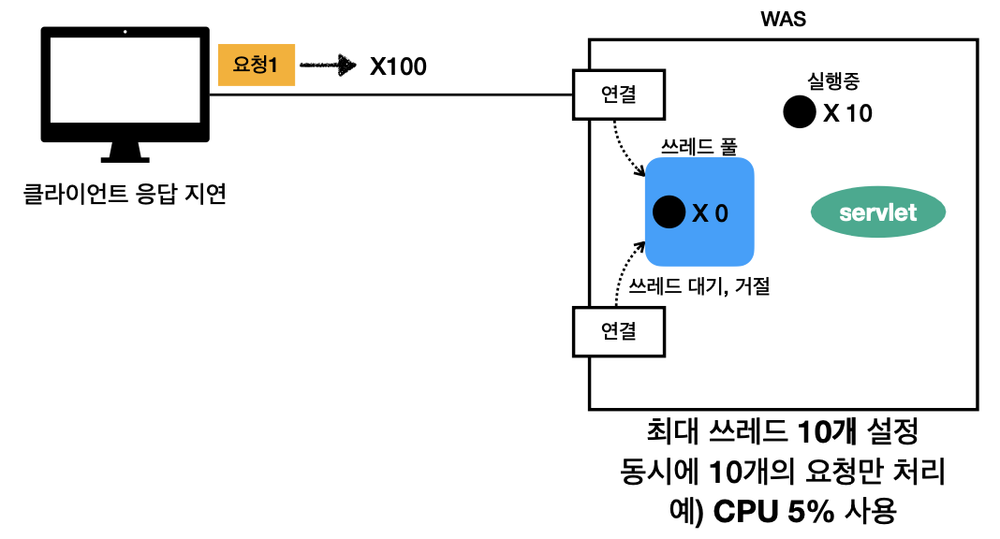

* ### 스프링 웹 MVC
* #### 모든 것이 HTTP
  
  * `HTTP 메세지에 모든 것을 전송`
  * HTML, TEXT
  * IMAGE, 음석, 영상, 파일
  * JSON, XML(API)
  * 거의 모든 형태의 데이터 전송 가능
  * 서버간에 데이터를 주고 받을 때도 대부분 HTTP 사용
* #### 웹 서버(Web Server)
   
  * HTTP 기반으로 동작
  * 정적 리소스 제공, 기타 부가기능
  * 정적(파일) HTML, CSS, JS, 이미지, 영상
    * 예) NGINXM APACH
* #### 웹 애플리케이션 서버(WAS - Web Application Server)
  
  * HTTP 기반으로 동작
  * 웹 서버 기능(정적 리소스 제공) 포함
  * 프로그램 코드를 실행해서 애플리케이션 로직 수행
    * 동적 HTML, HTTP API(JSON)
    * 서블릿, JSP, 스프링 MVC
    * 예) 톰캣(Tomcat), Jetty, Undertow
* #### 웹 서버, 웹 애플리케이션 서버 차이
  * 웹 서버는 정적 리소스(파일), WAS는 애플리케이션 로직
  * 사실 둥의 용어도 경계도 모호하다
    * 웹 서버도 프로그램을 실행하는 기능을 포함하기도 한다
    * 웹 애플리케이션 서버도 웹 버서의 기능을 제공한다
  * 자바는 서블릿 컨테이너 기능을 제공하면 WAS
    * 서블릿 없이 자바코드를 실행하는 서버 프레임워크도 있음
  * `WAS는 애플리케이션 코드를 실행하는데 더 특화`
* #### 웹 시스템 구성 - WAS, DB
  
  * WAS, DB 만으로 시스템 구성 가능
  * WAS는 정적 리소스, 애플리케이션 로직 모두 제공 가능 
  
    
  * WAS가 너무 많은 역할을 담당하면 서버 과부화 우려
  * 가장 비싼 애플리케이션 로직이 정적 리소스 때문에 수행이 어려울 수 있다
  * WAS 장애시 오류 화면도 노출 불가능
* #### 웹 시스템 구성 - WEB, WAS, DB
  
  * 정적 리소스는 웹 서버가 처리
  * 웹 서버는 애플리케이션 로직같은 동적인 처리가 필요하면 WAS에 요청을 위임
  * WAS는 중요한 애플리케이션 로직 처리 담당 

  
  * 효율적인 리소스 관리
    * 정적 리소스가 많이 사용되면 Web 서버 증설
    * 애플리케이션 리소스가 많이 사용되면 WAS 증성

  
  * 정적 리소스만 제공하는 웹 서버는 잘 죽지 않음
  * 애플리케이션 로직이 동작하는 WAS 서버는 잘 죽음
  * WAS, DB 장애시 WEB 서버가 오류 화면 제공 가능
* ### 서블릿
* #### 서버에서 처리해야 하는 업무
  * 궁극적인 목적은 HTTP 요청을 어떻게 받고 HTTP 응답을 어떻게 내려줄지 정의 
  * 웹 브라우저가 생성한 요청 HTTP 메세지 - 회원 저장
    ```
    POST /save HTTP/1.1
    Host: localhost:8080
    Content-Type: application/x-www-form-urlencoded

    username=kim&age=20
    ``` 
  * 웹 애플리케이션 서버 직접 구현
    ```
    * 서버 TCP/IP 연결 대기, 소켓 연결
    * HTTP 요청 메시지를 파싱해서 읽기
    * POST 방식, /save URL 인지
    * Content-Type 확인
    * HTTP 메시지 바디 내용 파싱
      * username, age 데이터를 사용할 수 있게 파싱
    * 저장 프로세스 실행
    * 비즈니스 로직 실행
      * 데이터베이스에 저장 요청
    * HTTP 응답 메세지 생성 시작
      * HTTP 시작 라인 생성
      * Header 생성
      * 메시지 바디에 HTML 생성에서 입력
    * TCP/IP에 응답 전달, 소켓 종료
    ``` 
   * 서블릿을 지원하는 WAS 사용
        ```
        * 비즈니스 로직 실행
        * 데이터베이스에 저장 요창
        ``` 
        * `의미있는 로직만 구현`
   * 서버에서 HTTP 응답 메시지 생성
        ```
        HTTP/1.1 200 OK
        Content-Type: text/html;charset=utf-8
        Content-Length: 3423

        <html>
            <body>...</body>
        </html>
        ```   
* #### 특징
  ```Java
  @WebServley(name = "helloServlet", urlPatterns = "/hello")
  puvlic class HelloServlet extends HttpServlet{

      @Override
      protected void service(HttpServletRequest request, HttpServletResponse response){
          //애플리케이션 로직
      }
  }
  ``` 
  * urlPatterns(/hello)의 URL이 호출되면 서블릿 코드가 실행
  * HTTP 요청 정보를 편리하게 사용할 수 있는 `HttpServletRequest`
  * HTTP 응답 정보를 편리하게 제공할 수 있는 `HttpServletResponse`
  * 개발자는 HTTP 스펙을 매우 편리하게 사용
* #### HTTP 요청, 응답 흐름
    
  * ##### HTTP 요청시
    * WAS는 Request, Response 객체를 새로 만들어서 서블릿 객체 호출
    * 개발자는 Requset 객체에서 HTTP 요청 정보를 편리하게 꺼내서 사용
    * 개발자는 Response 객체에 HTTP 응답 정보를 편리하게 입력
    * WAS는 Response 객체에 담겨있는 내용으로 HTTP 응답 정보를 생성
* #### 서블릿 컨테이너    
  
  * 톰캣처럼 서블릿을 지원하는 WAS를 서블릿 컨테이너라고 한다
  * 서블릿 컨테이너는 서블릿 객체를 생성, 초기화, 호출, 종료하는 생명주기 관리
  * 서블릿 객체는 `싱글톤으로 관리`
    * 고객의 요청이 올 때 마다 계속 객체를 생성하는 것은 비효율
    * 최초 로딩 시정에 서블릿 객체를 미리 만들어두고 재활용
    * 모든 고객 요청은 동일한 서블릿 객체 인스턴스의 접근
    * `공유 변수 사용 주의`
    * 서블릿 컨테이너 종료시 함께 종료
  * JSP도 서블릿으로 변환 되어서 사용
  * 동시 요청을 위한 멀티 쓰레드 처리 지원
* ### 동시 요청 - 멀티 쓰레드
    
* #### 쓰레드
  * 애플리케이션 코드를 하나하나 순차적으로 실행하는 것은 쓰레드
  * 자바 메인 메서드를 처음 실행하면 main이라는 이름의 쓰레드가 실행
  * 쓰레드가 없다면 자바 애플리케이션 실행 불가능
  * 쓰레드는 한번에 하나의 코드 라인만 수행
  * 동시 처리가 필요하면 쓰레드를 추가로 생성
* #### 단일 요청 - 쓰레드 하나 사용
  
  
  
    
* #### 다중 요청 - 쓰레드 하나 사용
   
  
  
* #### 요청 마다 쓰레드 생성
   
  * ##### 장점
    * 동시 요청을 처리할 수 있다
    * 리소스(CPU, 메모리)가 허용할 때 까지 처리가능
    * 하나의 쓰레드가 지연 되어도, 나머지 쓰레드는 정상 동작한다
  * ##### 단점
    * 쓰레드는 생성 비용이 매우 비싸다
      * 고객의 요청이 올 때 마다 쓰레드를 생성하면, 응답 속도가 늦어진다
    * 쓰레드는 컨텍스트 스위칭 비용이 발생한다
      * 컨텍스트 스위칭 비용
        * CPU 코어 한개에 쓰레드 하나 실행
        * CPU 코어에서 쓰레드 하나 실행 완료 후 다음 쓰레드 하나를 실행
          * 쓰레드 전환시 비용(컨텍스트 스위칭 비용)이 발생
          * 너무 빨리 처리되서 동시에 처리 되는 것 처럼 느낌
    * 쓰레드 생성에 제한이 없다
      * 고객 요청이 너무 많이 오면, CPU, 메모리 임계점을 넘어서 서버가 죽을 수 있다.
* #### 쓰레드 풀
  * ##### 요청 마다 쓰레드 생성의 단점 보완
   
   
  * ##### 특징
    * 필요한 쓰레드를 쓰레드 풀에 보관하고 관리한다.
    * 쓰레드 풀에 생성 가능한 쓰레드의 최대치를 관리한다. 톰캣은 최대 200개 기본 설정(변경 가능)
  * ##### 사용
    * 쓰레드가 필요하면, 이미 생성되어 있는 쓰레드 풀에서 꺼내서 사용한다.
    * 사용을 종료하면 쓰레드 풀에 해당 쓰레드를 반납한다
    * 최대 쓰레드가 모두 사용중이어서 쓰레드 풀에 쓰레드가 없으면?
      * 기다리는 요청은 거절하거나 특정 수만큼만 대기하도록 설정할 수 있다
  * ##### 장점
    * 쓰레드가 미리 생성되어 있으므로, 쓰레드를 생성하고 종료하는 비용(CPU)이 절약되고, 응답 시간이 빠르다
    * 생성 가능한 쓰레드의 최대치가 있으므로, 너무 많은 요청이 들어와도 기존 요청은 안전하게 처리할 수 있다.
  * ##### 실무 팁
    * WAS의 주요 튜닝 포인트는 최대 쓰레드(max thread)수 이다.
    * 이 값을 너무 낮게 설정하면?
      
      * 동시 요청이 많으면, 서버 리소스는 여유롭지만, 클라이언트는 금방 응답 지연
    * 이 값을 너무 높게 설정하면?
      * 동시 요청이 많으면, CPU, 메모리 리소스 임계점 초과로 서버 다운
    * 장애 발생시?
      * 클라우드면 일단 서버부터 늘리고, 이후에 튜닝
      * 클라우드가 아니면 열심히 튜닝
  * ##### 쓰레드 풀의 적정 숫자
    * 애플리케이션 로직의 복잡도, CPU, 메모리, IO 리소스 상황에 따라 모두 다르다
    * 성능 테스트
      * 최대한 실제 서버와 유사하게 성능 테스트 시도
      * 툴: 아파치 ab, 제이미터, nGrinder
  * #### WAS의 멀티 쓰레드 지원
    * 멀티 쓰레드에 대한 부분은 WAS가 처리
    * `개발자가 멀티 쓰레드 관련 코드를 신경쓰지 않아도 된다`
    * 개발자는 마치 `싱글 쓰레드 프로그래밍을 하듯이 편리하게 소스 코드를 개발`
    * 멀티 쓰레드 환경이므로 싱글톤 객체(서블릿, 스프링 빈)는 주의해서 사용
* ### HTML, HTTP, API, CSR, SSR
  * #### 정적 리소스
      
    * 고정된 HTML 파일, CSS, JS, 이미지, 영상 등을 제공
    * 주로 웹 브라우저
  * #### HTML 페이지
     
    * 동적으로 필요한 HTML 파일을 생성해서 전달
    * 웹 브라우저: HTML 해석
  * #### HTML API
     
    * HTML이 아니라 데이터를 전달
    * 주로 JSON 형식 사용
    * 다양한 시스템에서 호출
    * 데이터만 주고 받음, UI화면이 필요하면, 클라이언트가 별도 처리
    * 앱, 웹 클라이언트, 서버 to 서버
    * ##### 다양한 시스템 연동
      * 주로 `JSON` 형태로 데이터 통신
      * UI 클라이언트 접점
        * 앱 클라이언트(아이폰, 안드로이드, PC앱)
        * 웹 브라우저에서 자바스크립트를 통한 HTTP API 호출
        * React, Vue.js 같은 웹 클라이언트
      * 서버 to 서버
        * 주문 서버 -> 결제 서버
        * 기업간 데이터 통신
    * ##### SSR - 서버 사이드 렌더링
       
      * HTML 최종 결과를 서버에서 만들어서 웹 브라우저에 전달
      * 주로 정적인 화면에 사용
      * 관련기술: JSP, 타임리프 -> 백엔트 개발자
    * ##### CSR - 클라이언트 사이드 렌더링
      
      * HTML 결과를 자바스크립트를 사용해 웹 브라우저에서 동적으로 생성해서 적용
      * 주로 동적인 화면에 사용, 웹 환경을 마치 앱 처럼 필요한 부분부분 변경할 수 있음
        * 예) 구글 지도, Gmail, 구글 캘린더
      * 관련기술: React, Vue.js -> 웹 프론트엡드 개발자
---
* ### 서블릿
* #### Hello 서블릿
  * 서블릿은 톰캣 같은 웹 애플리케이션 서버를 직접 설치하고,그 위에 서블릿 코드를 클래스 파일로 빌드해서 올린 다음, 톰캣 서버를 실행하면 된다. 하지만 이 과정은 매우 번거롭다.스프링 부트는 톰캣 서버를 내장하고 있으므로, 톰캣 서버 설치 없이 편리하게 서블릿 코드를 실행할 수 있다.
  * ##### 스프링 부트 서블릿 환경 구성
    * 스프링 부트는 서블릿을 집접 등록해서 사용할 수 있도록 `@ServletComponentScan`을 지원하다. 
      ```Java
      @ServletComponentScan
      @SpringBootApplication
      public class Servlet01Application {

        public static void main(String[] args) {
            SpringApplication.run(Servlet01Application.class, args);
        }
      }
      ```
    * 서블릿 등록하기
      ```Java
        @WebServlet(name = "helloServlet", urlPatterns = "/hello")
        public class HelloServlet extends HttpServlet {

            @Override
            protected void service(HttpServletRequest request, HttpServletResponse response) throws ServletException, IOException {
                System.out.println("HelloServlet.service");
                System.out.println("request = " + request);
                System.out.println("response = " + response);

                String username = request.getParameter("username");
                System.out.println("username = " + username);

                response.setContentType("text/plain");
                response.setCharacterEncoding("utf-8");
                response.getWriter().write("hello " + username);
            }
        }
        ``` 
        * `@WebServlet`: 서블릿 애노테이션
          * `name`: 서블릿 이름
          * `urlPatterns`: URL 매핑
          * 서블릿 이름과 URL 매핑 이 겹쳐서는 안된다
        * HTTP 요청을 통해 매핑된 URL이 호출되면 서블릿 컨테이너는 다음 메서드를 실행한다
          ```Java
          protected void service(HttpServletRequest request, HttpServletResponse response)
          ``` 
    * 웹 브라우저 실행
      * `http://loacalhostL8080/hello?username=world`
      * 결과: hello world
    * 콘솔 실행 결과
      ```
      HelloServlet.service
      request = org.apache.catalina.connector.RequestFacade@5e4e72
      response = org.apache.catalina.connector.ResponseFacade@37d112b6
      username = world
      ``` 
  * ##### HTTP 요청 메시지 로그로 확인하기
    * `resources/application.properties`에 다음 코드를 추가
      ```Java
      logging.level.org.apache.coyote.http11=debug
      ``` 
    * 서버를 다시 시작하고 요청해보면 서버가 받은 HTTP 요청 메세지를 출력하는 것을 확인할 수 있다.
      ```
      ...o.a.coyote.http11.Http11InputBuffer: Received [GET /hello?username=servlet HTTP/1.1
      Host: localhost:8080
      Connection: keep-alive
      Cache-Control: max-age=0
      sec-ch-ua: "Chromium";v="88", "Google Chrome";v="88", ";Not A Brand";v="99"
      sec-ch-ua-mobile: ?0
      Upgrade-Insecure-Requests: 1
      User-Agent: Mozilla/5.0 (Macintosh; Intel Mac OS X 11_2_1) AppleWebKit/537.36
      (KHTML, like Gecko) Chrome/88.0.4324.150 Safari/537.36
      Accept: text/html,application/xhtml+xml,application/xml;q=0.9,image/avif,image/
      webp,image/apng,*/*;q=0.8,application/signed-exchange;v=b3;q=0.9
      Sec-Fetch-Site: same-origin
      Sec-Fetch-Mode: navigate
      Sec-Fetch-User: ?1
      Sec-Fetch-Dest: document
      Referer: http://localhost:8080/basic.html
      Accept-Encoding: gzip, deflate, br
      Accept-Language: ko,en-US;q=0.9,en;q=0.8,ko-KR;q=0.7
      ] 
      ``` 
      * 참고: 운영서버에 이렇게 모든 요청 정보를 다 남기면 성능저하가 발생할 수 있다. 개발 단계에서만 적용하자
  * ##### 서블릿 컨테이너 동작 방식 설명
    * 내장 톰캣 서버 생성
       
      * HTTP 요청 메시지
       
      ```
      GET /hello?username=world HTTP/1.1
      Host: localhost:8080
      ```
      * HTTP 응답 메시지

      ```
      HTTP/1.1 200 OK
      Content-Type: text/plain;charset=utf-8
      Content-Length: 11

      hello world
      ```   
      
        * 참고: HTTP 응답에서 Content-Length는 웹 애플리케이션 서버가 자동으로 생성해준다.
  * ##### welcome 페이지 추가
    * `webapp`경로에 `index.html`을 두면 http://localhost:8080 호출시 `index.html`페이지가 열린다 
    * main/webapp/index.html
     
    ```HTML
    <!DOCTYPE html>
    <html>
    <head>
        <meta charset="UTF-8">
        <title>Title</title>
    </head>
    <body>
    <ul>
        <li><a href="basic.html">서블릿 basic</a></li>
    </ul>
    </body>
    </html>
    ``` 
    * main/webapp/basic.html
     
    ```HTML
    <!DOCTYPE html>
    <html>
    <head>
        <meta charset="UTF-8">
        <title>Title</title>
    </head>
    <body>
    <ul>
        <li>hello 서블릿
            <ul>
                <li><a href="/hello?username=servlet">hello 서블릿 호출</a></li>
            </ul>
        </li>
        <li>HttpServletRequest
            <ul>
                <li><a href="/request-header">기본 사용법, Header 조회</a></li>
                <li>HTTP 요청 메시지 바디 조회
                    <ul>
                        <li><a href="/request-param?username=hello&age=20">GET -
                            쿼리 파라미터</a></li>

                        <li><a href="/basic/hello-form.html">POST - HTML Form</a></li>
                        <li>HTTP API - MessageBody -> Postman 테스트</li>
                    </ul>
                </li>
            </ul>
        </li>
        <li>HttpServletResponse
            <ul>
                <li><a href="/response-header">기본 사용법, Header 조회</a></li>
                <li>HTTP 응답 메시지 바디 조회
                    <ul>
                        <li><a href="/response-html">HTML 응답</a></li>
                        <li><a href="/response-json">HTTP API JSON 응답</a></li>
                    </ul>
                </li>
            </ul>
        </li>
    </ul>
    </body>
    </html>
    ```   
  * #### HttpServletRequest - 개요
    * ##### HttpServletRequest 역학
      * HTTP 요청 메시지를 개발자가 직접 파싱해서 사용해도 되지만, 매우 불편할 것이다. 서블릿은 개발자가 HTTP 요청 메시지를 편리하게 사용할 수 있도록 개발자 대신 HTTP요청 메시지를 파싱한다. 그리고 그 결과를 `HttpServletRequst`객체에 담아서 제공한다
      * HttpServletRequest를 사용하면 다음과 같은 HTTP 요청 메시지를 편리하게 조회할 수 있다.
    * ##### HTTP 요청 메시지
      ```
      POST /sava HTTP/1.1
      Host: localhost:8080
      Content-Type: application/x-www-form-urlcoded

      username=kim&age=20
      ```  
      * START LINE
        * HTTP 메소드
        * URL
        * 쿼리 스트링
        * 스키마, 프로토콜
      * 헤더
        * 헤더 조회
      * 바디
        * form 파라미터 형식 조회
        * message body 데이터 직접 조회
    * ##### 임시 저장소 기능
      * 해당 HTTP 요청이 시작부터 끝날 때 까지 유지되는 임시 저장소 기능
        * 저장: `request.setAttribute(name, value)`
        * 조회: `request.getAttibute(name)`
      * 세션 관리 기능
        * `request.getSession(create: true)`
    * ##### 중요
      * HttpServletRequeset, HttpServletResponse를 사용할 때 가장 중요한 점은 이 객체들이 HTTP 요청 메시지, HTTP 응답 메시지를 편리하게 사용하도록 도와주는 객체라는 점이다. 따라서 이 기능에 대해서 깊이있는 이해를 하려면 `HTTP 스펙이 제공하는 요청, 응답 메시지 자체를 이해`히야 한다.
  * #### HttpServletRequest - 기본 사용법
    * hello.servlet.basic.request.RequestHeaderServlet

    ```Java
    @WebServlet(name = "requestHeaderServlet", urlPatterns = "/request-header")
    public class RequestHeaderServlet extends HttpServlet {

        @Override
        protected void service(HttpServletRequest request, HttpServletResponse response) throws ServletException, IOException {
            printStartLine(request);
            printHeaders(request);
            printHeaderUtils(request);
            printEtc(request);

            response.getWriter().write("OK");
        }
    ```   
    * ##### start-line 정보

    ```Java
    //start line 정보
    private void printStartLine(HttpServletRequest request) {
        System.out.println("--- REQUEST-LINE - start ---");
        System.out.println("request.getMethod() = " + request.getMethod()); //GET
        System.out.println("request.getProtocal() = " + request.getProtocol()); //HTTP/1.1
        System.out.println("request.getScheme() = " + request.getScheme()); //http
        // http://localhost:8080/request-header
        System.out.println("request.getRequestURL() = " + request.getRequestURL());
        // /request-test
        System.out.println("request.getRequestURI() = " + request.getRequestURI());
        //username=hi
        System.out.println("request.getQueryString() = " +
                request.getQueryString());
        System.out.println("request.isSecure() = " + request.isSecure()); //https 사용 유무
        System.out.println("--- REQUEST-LINE - end ---");
        System.out.println();
    }    
    ```
      * 결과
        ```
        --- REQUEST-LINE - start ---
        request.getMethod() = GET
        request.getProtocal() = HTTP/1.1
        request.getScheme() = http
        request.getRequestURL() = http://localhost:8080/request-header
        request.getRequestURI() = /request-header
        request.getQueryString() = null
        request.isSecure() = false
        --- REQUEST-LINE - end ---
        ```
    * ##### 헤더 정보

    ```Java
    //Header 모든 정보
    private void printHeaders(HttpServletRequest request) {
        System.out.println("--- Headers - start ---");
    /*
      Enumeration<String> headerNames = request.getHeaderNames();
      while (headerNames.hasMoreElements()) {
          String headerName = headerNames.nextElement();
          System.out.println(headerName + ": " + request.getHeader(headerName));
      }
    */
        request.getHeaderNames().asIterator()
                .forEachRemaining(headerName -> System.out.println(headerName + ": " + request.getHeader(headerName)));

        System.out.println("--- Headers - end ---");
        System.out.println();
    }
    ```
       * 결과
         ```
            --- Headers - start ---
            host: localhost:8080
            connection: keep-alive
            cache-control: max-age=0
            sec-ch-ua: " Not A;Brand";v="99", "Chromium";v="96", "Google Chrome";v="96"
            sec-ch-ua-mobile: ?0
            sec-ch-ua-platform: "macOS"
            upgrade-insecure-requests: 1
            user-agent: Mozilla/5.0 (Macintosh; Intel Mac OS X 10_15_7) AppleWebKit/537.36 (KHTML, like Gecko) Chrome/96.0.4664.110 Safari/537.36
            accept: text/html,application/xhtml+xml,application/xml;q=0.9,image/avif,image/webp,image/apng,*/*;q=0.8,application/signed-exchange;v=b3;q=0.9
            sec-fetch-site: none
            sec-fetch-mode: navigate
            sec-fetch-user: ?1
            sec-fetch-dest: document
            accept-encoding: gzip, deflate, br
            accept-language: ko-KR,ko;q=0.9,en-US;q=0.8,en;q=0.7
            --- Headers - end ---
            ``` 
    * ##### Header 편리한 조회

    ```Java
    //Header 편리한 조회
    private void printHeaderUtils(HttpServletRequest request) {
        System.out.println("--- Header 편의 조회 start ---");
        System.out.println("[Host 편의 조회]");
        System.out.println("request.getServerName() = " +
                request.getServerName()); //Host 헤더
        System.out.println("request.getServerPort() = " + request.getServerPort()); //Host 헤더
        System.out.println();
        System.out.println("[Accept-Language 편의 조회]");
        request.getLocales().asIterator()
                .forEachRemaining(locale -> System.out.println("locale = " + locale));
        System.out.println("request.getLocale() = " + request.getLocale());

        System.out.println();
        System.out.println("[cookie 편의 조회]");
        if (request.getCookies() != null) {
            for (Cookie cookie : request.getCookies()) {
                System.out.println(cookie.getName() + ": " + cookie.getValue());
            }
        }
        System.out.println();
        System.out.println("[Content 편의 조회]");
        System.out.println("request.getContentType() = " +
                request.getContentType());
        System.out.println("request.getContentLength() = " + request.getContentLength());
        System.out.println("request.getCharacterEncoding() = " +
                request.getCharacterEncoding());
        System.out.println("--- Header 편의 조회 end ---");
        System.out.println();
    }
    ```
      * 결과
        ```
        --- Header 편의 조회 start ---
        [Host 편의 조회]
        request.getServerName() = localhost
        request.getServerPort() = 8080

        [Accept-Language 편의 조회]
        locale = ko_KR
        locale = ko
        locale = en_US
        locale = en
        request.getLocale() = ko_KR

        [cookie 편의 조회]

        [Content 편의 조회]
        request.getContentType() = null
        request.getContentLength() = -1
        request.getCharacterEncoding() = UTF-8
        --- Header 편의 조회 end ---
        ```  
    * ##### 기타 정보

    ```Java

    //기타 정보
    private void printEtc(HttpServletRequest request) {
        System.out.println("--- 기타 조회 start ---");
        System.out.println("[Remote 정보]");
        System.out.println("request.getRemoteHost() = " +
                request.getRemoteHost()); //
        System.out.println("request.getRemoteAddr() = " +
                request.getRemoteAddr()); //
        System.out.println("request.getRemotePort() = " +
                request.getRemotePort()); //
        System.out.println();
        System.out.println("[Local 정보]");
        System.out.println("request.getLocalName() = " +
                request.getLocalName()); //
        System.out.println("request.getLocalAddr() = " +
                request.getLocalAddr()); //
        System.out.println("request.getLocalPort() = " +
                request.getLocalPort()); //
        System.out.println("--- 기타 조회 end ---");
        System.out.println();
    }
    ```
      * 결과
        ```
        --- 기타 조회 start ---
        [Remote 정보]
        request.getRemoteHost() = 0:0:0:0:0:0:0:1
        request.getRemoteAddr() = 0:0:0:0:0:0:0:1
        request.getRemotePort() = 51935

        [Local 정보]
        request.getLocalName() = localhost
        request.getLocalAddr() = 0:0:0:0:0:0:0:1
        request.getLocalPort() = 8080
        --- 기타 조회 end ---
        ``` 
  * #### HTTP요청 데이터 - 개요
    * HTTP 요청 메시지를 통해 클라이언트에서 서버로 데이터를 전달하는 3가지 방법
    * ##### GET - 쿼리 파라미터
      * /url`?username=hello&age=20`
      * 메시지 바티 없이, URL의 쿼리 파라미터에 데이터를 포함해서 전달
        * 검색, 필터, 페이징등에서 많이 사용하는 방식
    * ##### POST - HTML Form
      * Content-type: application/x-www-form-urlcoded
      * 메시지 바디에 `쿼리 파라미터 형식으로 전달` username=hello&age=20
        * 회원 가입, 상품 주문, HTML Form 사용
    * ##### HTTP message body에 데이터를 직접 담아서 요청
      * HTTP API에서 주로 사용, JSON, XML, TEXT
      * 데이터 형식은 주로 JSON사용
        * POST, PUT, PATCH
* #### HTTP요청 데이터 - GET 쿼리 파라미터
  * 다음 데이터를 클라이언트에서 서버로 전송해보자
  * 전달 데이터
    * username=hello
    * age=20
  * 메시지 바디 없이, URL의 `쿼리 파라미터`를 사용해서 데이터를 전달한다
    * 예) 검색, 필터, 페이징등에서 많이 사용하는 방식
  * 쿼리 파라미터는 URL에 다음와 같이 `?`를 시작으로 보낼 수 있다. 추가 파라미터는 `&`로 구분하면 된다.
    ```
    http://localhost:8080/request-param?username=hello&age=20
    ``` 
  * 서버에서는 `HttpServletRequest`가 제공하는 다음 메서드를 통해 쿼리 파라미터를 편리하게 조회할 수 있다.
  * ##### 쿼리 파라미터 조회 메서드

  ```Java
  String username = request.getPrarmeter("username"); //단일 파라미터 조회
  Enumeration<String> parameterNames = request.getParameterNames(); //파라미터 이름들 모두 조회
  Map<String, String[]> parameterMap = request.getParamegerMap(); //파라미터를 Map으로 조회
  String[] username = requset.getParameterValues("username"); //복수 파라미터 조회
  ```

    ```Java
    /**
    * 1. 파라미터 전송 가능
    * http://localhost:8080/request-param?username=hello&age=20
    * <p>
    * 2. 동일한 파라미터 전송 가능
    * http://localhost:8080/request-param?username=hello&username=kim&age=20
    */
    @WebServlet(name = "requestParamServlet", urlPatterns = "/request-param")
    public class RequestParamServlet extends HttpServlet {

        @Override
        protected void service(HttpServletRequest request, HttpServletResponse response) throws ServletException, IOException {

    //        Enumeration<String> parameterNames = request.getParameterNames();
    //        while (parameterNames.hasMoreElements()) {
    //            String paramName = parameterNames.nextElement();
    //            System.out.println(paramName + ": " + request.getParameter(paramName));
    //        }

            System.out.println("[전체 파라미터 조회] - start");
            request.getParameterNames().asIterator()
                    .forEachRemaining(username -> System.out.println(username + ": " + request.getParameter(username)));
            System.out.println("[전체 파라미터 조회] - end");
            System.out.println();

            System.out.println("[단일 파라미터 조회] - start");
            String username = request.getParameter("username");
            System.out.println("request.getParameter(username): " + username);
            System.out.println("[단일 파라미터 조회] - end");
            System.out.println();

            System.out.println("[이름이 같은 복수 파라미터들 조회] - start");
            System.out.println("request.getParameterValues(username)");
            String[] usernames = request.getParameterValues("username");
            for (String name : usernames) {
                System.out.println("username: " + name);
            }
            System.out.println("[이름이 같은 복수 파라미터들 조회] - end");
            System.out.println();
        }
    }
    ```
  * ##### 복수 파라미터에서 단일 파라미터 조회
    * `username=hello&username=kim`과 같이 파라미터 이름은 하나인데 값이 중복이면 어떻게 될까?
    * `request.getParameter()`는 하나의 파라미터 이름에 대해서 단 하나의 값만 있을 때 사용해야 한다.
    * 지금처럼 중복일 때는 `request.getParameterValues()`를 사용해야 한다.
    * 참고로 이렇게 중복일 때 `requaet.getParameter()`를 사용하면 `request.getParameterValues()`의 첫 번째 값을 반환한다 
* #### HTTP요청 데이터 - POST HTML Form
  * ##### 특징
    * Content-Type: `application/x-www-form-urlencoded`
    * 메시지 바디에 쿼리 파라미터 형식으로 데이터를 전달한다. `username=hello&age=20`
  * `src/main/webapp/basic/hello-form.html` 생성
    ```HTML
    <!DOCTYPE html>
    <html>
    <head>
        <meta charset="UTF-8">
        <title>Title</title>
    </head>
    <body>
    <form action="/request-param" method="post">
        username: <input type="text" name="username"/> age: <input type="text" name="age"/>
        <button type="submit">전송</button>
    </form>
    </body>
    </html>
    ```
    * http://localhost:8080/basic/hello-form.html 실행
  * POST의 HTML Form을 전송하면 웹 브라우저는 다음 형식으로 HTTP 메시지를 만들다
    * 요청 URL: `http://localhost:8080/request-param`
    * Content-Type: `application/x-www-from-urlencoded`
    * message body: username=hello&age=20
  * `application/x-www-form-urlencoded`형식은 앞서 GET에서 살펴본 쿼리 파라미터 형식과 같다. 따라서 `쿼리 파라미터 조회 메서드를 그대로 사용`하면 된다
  * 클라이언트(웹 브라우저)입장에서는 두 방식에 차이가 있지만, 서버 입징에서는 둘의 형식이 동일하므로, `request.getParameter()`로 편리하게 구분없이 조회할 수 있다.
  * 정리하면 `request.getParameter()`는 GET URL 쿼리 파라미터 형식도 지원하고, POST HTML Form 형식 둘 다 지원한다
  * 참고
    * Contemt-Type은 HTTP 메시지 바디의 데이터 형식을 지정한다
    * `GET URL 쿼리 파라미터 형식`으로 클라이언트에서 서버로 데이터를 전달할 때는 HTTP메시지 바디를 사용하지 않기 때문에 Content-Type이 없다.
    * `POST HTML Form 형식`으로 데이터를 전달하려면 HTTP 메시지 바디에 해당 데이터를 포함해서 보내기 때문에 바디에 포함된 데이터가 어떤 형식인지 Content-Type을 꼭 지정해야 한다. 이렇게 폼으로 데이터를 전송하는 형식을 `application/x-www-form-urlencoded`라 한다
  * ##### Postman을 사용한 테스트
    * 이런 간단한 테스트에 HTML form을 만들기는 귀찮다. 이때는 Postman을 사용하면 된다.
    * `Postman`테스트 주의사항
      * POST 전송시
        * Body -> `x-www-form-urlencoded`선택
        * Headers에서 Content-Type: `application/x-www-form-urlencoded`로 지정된 부분 꼭 확인  
* #### HTTP요청 데이터 - API메세지 바디 - 단순 텍스트
  * HTTP message body에 데이터를 직접 담아서 요청
    * HTTP API에 주로 사용, JSON, XML, TEXT
    * 데이터 형식은 주로 JSON 사용
    * POST, PUT, PATCH
  * 먼저 가장 단순한 덱스트 메시지를 HTTP 메시지 바디에 담아서 전송하고 읽어보자
  * HTTP 메시지 바디의 데이터를 InputStream을 사용해서 직접 읽을 수 있다.
  * RequsetBodyStringServlest
    ```Java
    @WebServlet(name = "requestBodyStringServlet", urlPatterns = "/request-body-string")
    public class RequestBodyStringServlet extends HttpServlet {

        @Override
        protected void service(HttpServletRequest request, HttpServletResponse response) throws ServletException, IOException {
            ServletInputStream inputStream = request.getInputStream(); // 메시지 body의 내용을 byteCode 로 받을 수 있다.
            String massageBody = StreamUtils.copyToString(inputStream, StandardCharsets.UTF_8); //스프링이 제공하는 유틸리티

            System.out.println("massageBody = " + massageBody);

            response.getWriter().write("Ok");
        }
    }
    ```
    * 참고
      * inpuStream은 byte 코드를 반환한다. byte 코드를 우리가 읽을 수 있는 문자(String)로 보려면 문자표(Charset)를 지정해주어야 한다. 여기서는 UTF-8 Charset을 지정해주었다.
    * 문자 전송
      * POST `http://localhost:8080/request-body-string`
      * content-type: text/plain
      * message body: `hello`
      * 결과: `messageBody = hello`
* #### HTTP요청 데이터 - API메세지 바디 - JSON
  * ##### JSON 형식 전송
    * POST `http://localhost:8080/request-body-json`
    * content-type: application/json
    * message body: `{"username": "hello", "age": 20}`
    * 결과: `messageBody = {"username": "hello", "age": 20}`
  * ##### JSON 형식 파싱 추가
    * JSON 형식으로 파싱할 수 있게 객체를 하나 생성하자
    * hello.servlet.basic.HelloData
        ```Java
        package hello.servlet.basic;

        import lombok.Getter;
        import lombok.Setter;

        @Getter @Setter
        public class HelloData {

            private String username;
            private int age;
        }
        ```
        * lombok이 제공하는 `@Getter`, `@Setter`덕분에 자동 추가
        ```Java
        @WebServlet(name = "requestBodyJsonServlet", urlPatterns = "/request-body-json")
        public class RequestBodyJsonServlet extends HttpServlet {

            private ObjectMapper objectMapper = new ObjectMapper();

            @Override
            protected void service(HttpServletRequest request, HttpServletResponse response) throws ServletException, IOException {
                ServletInputStream inputStream = request.getInputStream();
                String messageBody = StreamUtils.copyToString(inputStream, StandardCharsets.UTF_8);

                System.out.println("messageBody = " + messageBody);

                HelloData helloData = objectMapper.readValue(messageBody, HelloData.class);

                System.out.println("helloData.getUsername() = " + helloData.getUsername());
                System.out.println("helloData.getAge() = " + helloData.getAge());

                response.getWriter().write("ok");
            }
        }
        ```  
        * Postman으로 실생
          * POST `http://localhost:8080/request-body-json`
          * content-type: `application/json` (Body raw, 가장 오른쪽에서 JSON 선택)
          * message body: `{"username": "hello", "age": 20}`
    * 참고 
      * JSON 결과를 파싱해서 사용할 수 있는 자바 객체로 변환하려면 Jackson, Gson 같은 JSON 변환 라이브러리를 추가해서 사용해야 한다. 스프링 부트로 Spring MVC를 선택하면 기본으로 Jackson 라이브러리( ObjectMapper )를 함께 제공한다
      *  HTML form 데이터도 메시지 바디를 통해 전송되므로 직접 읽을 수 있다. 하지만 편리한 파리미터 조회 기능( request.getParameter(...) )을 이미 제공하기 때문에 파라미터 조회 기능을 사용하면 된다.      
* #### HttpServletResponse - 기본 사용법
  * ##### HttpServletResponse 역할
    * HTTP 응답 메시지 생성
    * HTTP 응답코드 지정
    * 헤더 생성
    * 바디 생성
    * 편의 기능 제공
      * Content-Type, 쿠키, Redirect
  * ##### HttpServletResponse 기본 사용법
    ```Java
    @WebServlet(name = "ResponseHeaderServlet", urlPatterns = "/response-header")
    public class ResponseHeaderServlet extends HttpServlet {

        @Override
        protected void service(HttpServletRequest request, HttpServletResponse response) throws ServletException, IOException {
            //[status-line]
            response.setStatus(HttpServletResponse.SC_OK);

            //[response-header]
            response.setHeader("Content-Type", "text/plain;charset=utf-8");
            response.setHeader("Cache-Control", "no-cache, no-store, must-revalidate");
            response.setHeader("Pragma", "no-cache");
            response.setHeader("my-header", "hello");

            //[Header 편의 메서드]
            content(response);
            cookie(response);
            redirect(response);

            //[message-body]
            PrintWriter writer = response.getWriter();
            writer.println("OK");
        }
    ``` 
  * ##### Content 편의 메서드
    ```Java
    //Content 편의 메서드
    private void content(HttpServletResponse response) {
        //Content-Type: text/plain;charset=utf-8
        //Content-Length: 2
        //response.setHeader("Content-Type", "text/plain;charset=utf-8");
        response.setContentType("text/plain");
        response.setCharacterEncoding("utf-8");
        //response.setContentLength(2); //(생략시 자동 생성)
    }
    ``` 
  * ##### 쿠키 편의 메서드
    ```Java
    //쿠키 편의 메서드
    private void cookie(HttpServletResponse response) {
        //Set-Cookie: myCookie=good; Max-Age=600;
        //response.setHeader("Set-Cookie", "myCookie=good; Max-Age=600");
        Cookie cookie = new Cookie("myCookie", "good");
        cookie.setMaxAge(600); //600초
        response.addCookie(cookie);
    }
    ```
  * ##### redirect 편의 메서드
    ```Java
    //redirect 메서드
    private void redirect(HttpServletResponse response) throws IOException {
        //Status Code 302
        //Location: /basic/hello-form.html
        //response.setStatus(HttpServletResponse.SC_FOUND); //302
        //response.setHeader("Location", "/basic/hello-form.html");
        response.sendRedirect("/basic/hello-form.html");
    }
    ```  
* #### HTTP 응답 데이터 - 단순 텍스트, HTML
  * HTTP 응답 메시지는 주로 다음 내용을 담아서 전달한다
    * 단순 텍스트 응답
      * 앞에서 살펴봄`(write.println("ok");`
      * HTML 응답
      * HTTP API - MessageBody JSON 응답
  * ##### HttpServletResponse - HTML 응답
    ```Java
    @WebServlet(name = "ResponseHtmlServlet", urlPatterns = "/response-html")
    public class ResponseHtmlServlet extends HttpServlet {

        @Override
        protected void service(HttpServletRequest request, HttpServletResponse response) throws ServletException, IOException {
            //Content-Type: text/html;charset=utf-8
            response.setContentType("text/html");
            response.setCharacterEncoding("utf-8");

            PrintWriter writer = response.getWriter();

            writer.println("<html>");
            writer.println("<body>");
            writer.println("    <div>안녕</div>");
            writer.println("</body>");
            writer.println("</html>");
        }
    }
    ``` 
    * HTTP 응답으로 HTML을 반환할 때는 Context-Type을 `text/html`로 지정해야 한다
    * 실행
      * `http://localhost:8080/response-html`
* #### HTTP 응답 데이터 - API JSON
    ```Java
    @WebServlet(name = "ResponseJsonServlet", urlPatterns = "/response-json")
    public class ResponseJsonServlet extends HttpServlet {

        private ObjectMapper objectMapper = new ObjectMapper();

        @Override
        protected void service(HttpServletRequest request, HttpServletResponse response) throws ServletException, IOException {
            //Content-Type: application/json;charset=utf8
            response.setContentType("application/json");
            response.setCharacterEncoding("utf-8");

            HelloData helloData = new HelloData();

            helloData.setUsername("Jeon");
            helloData.setAge(29);

            //{"username":"Jeon","age":29}
            String result = objectMapper.writeValueAsString(helloData);

            response.getWriter().println(result);
        }
    }
    ``` 
    * HTTP 응답으로 JSON을 반환할 때는 `content-type을 application/json` 로 지정해야 한다. Jackson 라이브러리가 제공하는 `objectMapper.writeValueAsString(`) 를 사용하면 객체를 JSON 문자로 변경할 수 있다.
    * 참고
      *  application/json 은 스펙상 utf-8 형식을 사용하도록 정의되어 있다. 그래서 스펙에서 charset=utf-8과 같은 추가 파라미터를 지원하지 않는다. 따라서 application/json 이라고만 사용해야지 application/json;charset=utf-8 이라고 전달하는 것은 의미 없는 파라미터를 추가한 것이 된다. > response.getWriter()를 사용하면 추가 파라미터를 자동으로 추가해버린다. 이때는 response.getOutputStream()으로 출력하면 그런 문제가 없다.
* ### 서블릿, JSP, MVC 패턴
* #### 회원 관리 웹 애플리케이션 요구사항
  * ##### 회원 정보
    * 이름: username
    * 나이: age
  * ##### 기능 요구사항
    * 회원 저장
    * 회원 목록 조회
  * ##### 회원 도메인 모델
    ```Java
    package hello.servlet01.domain;

    public class Member {

        private Long id;
        private String username;
        private int age;

        public Member() { }

        public Member(String username, int age) {
            this.username = username;
            this.age = age;
        }
    }
    ```
    * `id`는 `Member`를 회원 저장소에 저장하면 회원 저장소가 할당한다
  * ##### 회원 저장소
    ```Java
    package hello.servlet01.domain;

    import java.util.ArrayList;
    import java.util.HashMap;
    import java.util.List;
    import java.util.Map;

    /**
    * 동시성 문제가 고려되어 있지 않음, 실무에서는 ConcurrentHashMap, AtomicLong 사용 고려
    */
    public class MemberRepository {

        private static Map<Long, Member> store = new HashMap<>();  //static 사용
        private static Long sequence = 0L;  //static 사용

        private static final MemberRepository instance = new MemberRepository();  //싱글톤 스코프

        public static MemberRepository getInstance() {
            return instance;
        }

        private MemberRepository() { }  //외부에서 호출할 수 없도록 private 생성자 설정

        public Member save(Member member) {
            member.setId(++sequence);
            store.put(member.getId(), member);
            return member;
        }

        public Member findByID(Long id) {
            return store.get(id);
        }

        public List<Member> findAll() {
            return new ArrayList<>(store.values());
        }

        public void clearStore() {
            store.clear();
        }
    }
    ```
    * 회원 저장소는 싱클톤 패턴을 적용했다. 스프링을 사용하면 스프링 빈으로 틍록하면 되지만, 지금은 최대한 스프링 없이 순수 서플릿 만으로 구현하는 것이 목적이다. 싱글톤 패턴은 객체를 단 하나만 생성해서 공유해야 하므로 생성자는 `private`접근자로 막아둔다
  * ##### 회원 저장소 테스트 코드
    ```Java
    package hello.servlet01.domain.member;

    import hello.servlet01.domain.Member;
    import hello.servlet01.domain.MemberRepository;
    import org.junit.jupiter.api.AfterEach;
    import org.junit.jupiter.api.DisplayName;
    import org.junit.jupiter.api.Test;

    import java.util.List;

    import static org.assertj.core.api.Assertions.assertThat;

    class MemberRepositoryTest {

        private MemberRepository memberRepository = MemberRepository.getInstance();

        @AfterEach
        void afterEach() {
            memberRepository.clearStore();
        }

        @Test
        @DisplayName("회원 등록 및 조회")
        void save() {
            //given
            Member member = new Member("Jeon", 29);

            //when
            Member saveMember = memberRepository.save(member);

            //then
            assertThat(saveMember).isEqualTo(member);
        }

        @Test
        @DisplayName("회원 전체 조회")
        void findAll() {
            //given
            Member memberA = new Member("Jeon", 29);
            Member memberB = new Member("Kim", 29);

            //when
            memberRepository.save(memberA);
            memberRepository.save(memberB);

            List<Member> memberList = memberRepository.findAll();

            //then
            assertThat(memberList.size()).isEqualTo(2);
            assertThat(memberList).contains(memberA, memberB);
        }
    }
    ```
    * 회원을 저장하고, 목록을 조회하는 테스트를 작성했다. 각 테스트가 끝날 때, 다음 테스스에 영향을 주지 않도록 각 테스트의 저장소를 `clearStore()`를 호출해서 초기화 했다.
    * `assertThat(비교대상 자료구조).contains(원소1, 원소2, ...)`
      * 중복 여부, 순서에 관계없이 값만 일치하면 테스트 성공   
* #### 서블릿으로 회원 관리 웹 애플리케이션 만들기
  * ##### MemberFormServlet - 회원 등록 폼
    ```Java
    package hello.servlet01.web.servlet;

    import hello.servlet01.domain.MemberRepository;

    import javax.servlet.ServletException;
    import javax.servlet.annotation.WebServlet;
    import javax.servlet.http.HttpServlet;
    import javax.servlet.http.HttpServletRequest;
    import javax.servlet.http.HttpServletResponse;
    import java.io.IOException;
    import java.io.PrintWriter;

    @WebServlet(name = "memberFormServlet", urlPatterns = "/servlet/member/new-form")
    public class MemberFormServlet extends HttpServlet {

        private MemberRepository memberRepository = MemberRepository.getInstance();

        @Override
        protected void service(HttpServletRequest request, HttpServletResponse response) throws ServletException, IOException {

            response.setContentType("text/html");
            response.setCharacterEncoding("utf-8");

            PrintWriter w = response.getWriter();

            w.write("<!DOCTYPE html>\n" +
                    "<html>\n" +
                    "<head>\n" +
                    "    <meta charset=\"UTF-8\">\n" +
                    "    <title>Title</title>\n" +
                    "</head>\n" +
                    "<body>\n" +
                    "<form action=\"/servlet/members/save\" method=\"post\">\n" +
                    "    username: <input type=\"text\" name=\"username\" />\n" +
                    "    age:      <input type=\"text\" name=\"age\" />\n" +
                    " <button type=\"submit\">전송</button>\n" + "</form>\n" +
                    "</body>\n" +
                    "</html>\n");
        }
    }
    ```
    * `MemberFormServlet`은 단순하게 회원 정보를 입력할 수 있는 HTML Form을 만들어서 응답한다.
    * 자바 코드로 HTML을 제공해야 하므로 쉽지 않은 작업이다.
    * 실행
      * http://localhost:8080/servlet/members/new-form
      * HTML Form 데이터를 POST로 전송해고, 전달 받는 서블릿을 아직 만들지 않았다 그래서 오류가 발생하는 것이 정상이다.
      * 이번에는 HTML Form에서 데이터를 입력하고 전송을 누르면 실제 회원 데이터가 저장되도록 해보자. 전송 방식을 POST HTML Form에서 학습한 내용과 같다.
  * ##### MemberSaveServlet - 회원 저장 
    ```Java
    package hello.servlet01.web.servlet;

    import hello.servlet01.domain.Member;
    import hello.servlet01.domain.MemberRepository;

    import javax.servlet.ServletException;
    import javax.servlet.annotation.WebServlet;
    import javax.servlet.http.HttpServlet;
    import javax.servlet.http.HttpServletRequest;
    import javax.servlet.http.HttpServletResponse;
    import java.io.IOException;
    import java.io.PrintWriter;

    @WebServlet(name = "memberSaveServlet", urlPatterns = "/servlet/members/save")
    public class MemberSaveServlet extends HttpServlet {

        private MemberRepository memberRepository = MemberRepository.getInstance();

        @Override
        protected void service(HttpServletRequest request, HttpServletResponse response) throws ServletException, IOException {
            System.out.println("MemberSaveServlet.service");

            String username = request.getParameter("username");
            int age = Integer.parseInt(request.getParameter("age"));

            Member member = new Member(username, age);
            System.out.println("member = " + member);
            memberRepository.save(member);

            response.setContentType("text/html");
            response.setCharacterEncoding("utf-8");
            PrintWriter w = response.getWriter();

            w.write("<html>\n" +
                    "<head>\n" +
                    " <meta charset=\"UTF-8\">\n" + "</head>\n" +
                    "<body>\n" +
                    "성공\n" +
                    "<ul>\n" +
                    "    <li>id=" + member.getId() + "</li>\n" +
                    "    <li>username=" + member.getUsername() + "</li>\n" +
                    " <li>age=" + member.getAge() + "</li>\n" + "</ul>\n" +
                    "<a href=\"/index.html\">메인</a>\n" + "</body>\n" +
                    "</html>");
        }
    }
    ```
    * `MemberSaveServlet`은 다음 순서로 동작한다
      * 파라미터를 조회해서 Member 객체를 만든다
      * Member 객체를 MemberRespository를 통해서 저장한다
      * Member 객체를 사용해서 결과 화면용 HTML을 동적으로 만들어서 응답한다
    * 싱핼
      * http://localhost:8080/servlet/members/new-form
      * 데이터가 전송되고, 저장 결과를 확인할 수 있다.
  * ##### MemberListServlet - 회원 목록
    ```Java
    package hello.servlet01.web.servlet;

    import hello.servlet01.domain.Member;
    import hello.servlet01.domain.MemberRepository;

    import javax.servlet.ServletException;
    import javax.servlet.annotation.WebServlet;
    import javax.servlet.http.HttpServlet;
    import javax.servlet.http.HttpServletRequest;
    import javax.servlet.http.HttpServletResponse;
    import java.io.IOException;
    import java.io.PrintWriter;
    import java.util.List;

    @WebServlet(name = "memberListServlet", urlPatterns = "/servlet/members")
    public class MemberListServlet extends HttpServlet {

        private MemberRepository memberRepository = MemberRepository.getInstance();

        @Override
        protected void service(HttpServletRequest request, HttpServletResponse response) throws ServletException, IOException {

            List<Member> members = memberRepository.findAll();

            response.setContentType("text/html");
            response.setCharacterEncoding("utf-8");
            PrintWriter w = response.getWriter();

            w.write("<html>");
            w.write("<head>");
            w.write("    <meta charset=\"UTF-8\">");
            w.write("    <title>Title</title>");
            w.write("</head>");
            w.write("<body>");
            w.write("<a href=\"/index.html\">메인</a>");
            w.write("<table>");
            w.write("    <thead>");
            w.write("    <th>id</th>");
            w.write("    <th>username</th>");
            w.write("    <th>age</th>");
            w.write("    </thead>");
            w.write("    <tbody>");

            for (Member member : members) {
                w.write("    <tr>");
                w.write("       <td>" + member.getId() + "</td>");
                w.write("       <td>" + member.getUsername() + "</td>");
                w.write("       <td>" + member.getAge() + "</td>");
                w.write("    </tr>");
            }

            w.write("    </tbody>");
            w.write("</table>");
            w.write("</body>");
            w.write("</html>");
        }
    }
    ```
    * `MemberListServlet`은 다음 순서로 동작한다
      * `memberRepository.finAll()`을 통해 모든 회원을 조회한다.  
      * 회원 목록 HTML 을 for루프를 통해서 회원 수 만큼 동적으로 생성하고 응답한다
    * 실행
      * http://localhost:8080/servlet/members
    * 템플릿 엔진으로
      * 지금까지 서블릿과 자바 코드만으로 HTML을 만들어보았다. 서블릿 덕분에 동적으로 원하는 HTML을 마음껏 만들 수 있다. 정적인 HTML 문서라면 화면이 계속 달라지는 회원의 저장 결과라던가, 회원 목록 같은 동적인 HTML을 만드는 일은 불가능 할 것이다. 그런데, 코드에서 보듯이 이것은 매우 `복잡하고 비효율 적`이다. 자바 코드로 HTML을 만들어 내는 것 보다 차라리 `HTML 문서에 동적으로 변경해야 하는 부분만 자바 코드를 넣을 수 있다면 더 편리`할 것이다. 이것이 바로 템플릿 엔진이 나온 이유이다. `템플릿 엔진을 사용하면 HTML 문서에서 필요한 곳만 코드를 적용해서 동적으로 변경`할 수 있다. 템플릿 엔진에는 JSP, Thymeleaf, Freemarker, Velocity등이 있다.
    * 참고
      * JSP는 성능과 기능면에서 다른 템플릿 엔진과의 경쟁에서 밀리면서, 점점 사장되어 가는 추세이다. 템플릿 엔진들은 각각 장단점이 있는데, 강의에서는 JSP는 앞부분에서 잠깐 다루고, 스프링과 잘 통합되는 Thymeleaf를 사용한다.
  * ##### Welcome 페이지 변경
    ```HTML
    <!DOCTYPE html>
    <html>
    <head>
        <meta charset="UTF-8">
        <title>Title</title>
    </head>
    <body>
    <ul>
        <li><a href="basic.html">서블릿 basic</a></li>
        <li>서블릿
            <ul>
                <li><a href="/servlet/members/new-form">회원가입</a></li>
                <li><a href="/servlet/members">회원목록</a></li>
            </ul>
        </li>
        <li>JSP
            <ul>
                <li><a href="jsp/members/new-form.jsp">회원가입</a></li>
                <li><a href="/jsp/members.jsp">회원목록</a></li>
            </ul>
        </li>
        <li>서블릿 MVC
            <ul>
                <li><a href="/servlet-mvc/members/new-form">회원가입</a></li>
                <li><a href="/servlet-mvc/members">회원목록</a></li>
            </ul>
        </li>
        <li>FrontController - v1
            <ul>
                <li><a href="/front-controller/v1/members/new-form">회원가입</a></li>
                <li><a href="/front-controller/v1/members">회원목록</a></li>
            </ul>
        </li>
        <li>FrontController - v2
            <ul>
                <li><a href="/front-controller/v2/members/new-form">회원가입</a></li>
                <li><a href="/front-controller/v2/members">회원목록</a></li>
            </ul>
        </li>
        <li>FrontController - v3
            <ul>
                <li><a href="/front-controller/v3/members/new-form">회원가입</a></li>
                <li><a href="/front-controller/v3/members">회원목록</a></li>
            </ul>
        </li>
        <li>FrontController - v4
            <ul>
                <li><a href="/front-controller/v4/members/new-form">회원가입</a></li>
                <li><a href="/front-controller/v4/members">회원목록</a></li>
            </ul>
        </li>
        <li>FrontController - v5 - v3
            <ul>
                <li><a href="/front-controller/v5/v3/members/new-form">회원가입</a></li>

                <li><a href="/front-controller/v5/v3/members">회원목록</a></li>
            </ul>
        </li>
        <li>FrontController - v5 - v4
            <ul>
                <li><a href="/front-controller/v5/v4/members/new-form">회원가입</a></li>
                <li><a href="/front-controller/v5/v4/members">회원목록</a></li>
            </ul>
        </li>
        <li>SpringMVC - v1
            <ul>
                <li><a href="/springmvc/v1/members/new-form">회원가입</a></li>
                <li><a href="/springmvc/v1/members">회원목록</a></li>
            </ul>
        </li>
        <li>SpringMVC - v2
            <ul>
                <li><a href="/springmvc/v2/members/new-form">회원가입</a></li>
                <li><a href="/springmvc/v2/members">회원목록</a></li>
            </ul>
        </li>
        <li>SpringMVC - v3
            <ul>
                <li><a href="/springmvc/v3/members/new-form">회원가입</a></li>
                <li><a href="/springmvc/v3/members">회원목록</a></li>
            </ul>
        </li>
    </ul>
    </body>
    </html>
    ``` 
* #### JSP로 회원 관리 웹 애플리케이션 만들기
  * ##### JSP 라이브러리 추가
    ```
    //JSP 추가 시작
    implementation 'org.apache.tomcat.embed:tomcat-embed-jasper' implementation 'javax.servlet:jstl'
    //JSP 추가 끝
    ``` 
  * ##### 회원 등록 폼 JSP
    ```JSP
    <%@ page contentType="text/html;charset=UTF-8" language="java" %>
    <html>
    <head>
        <title>Title</title>
    </head>
    <body>
    <form action="/jsp/members/save.jsp" method="post">
        username: <input type="text" name="username"/>
        age: <input type="text" name="age"/>
        <button type="submit">전송</button>
    </form>
    </body>
    </html>
    ```
    * `<%@ page contentType="text/html;charset=UTF-8" language="java" %>`
      * 첫 줄은 JSP문서라는 뜻이다. JSP 문서는 이렇게 시작해야 한다.
    * 회원 등록 폼 JSP를 보면 첫 줄을 제외하고는 완전히 HTML와 똑같다. `JSP는 서버 내부에서 서블릿으로 변환`되는데, 우리가 만들었던 MemberFormServlet과 거의 비슷한 모습으로 변환된다.
    * 실행
      * http://localhost:8080/jsp/members/new-form.jsp
  * ##### 회원 저장 JSP
    ```JSP
    <%@ page import="hello.servlet01.domain.MemberRepository" %>
    <%@ page import="hello.servlet01.domain.Member" %>
    <%@ page contentType="text/html;charset=UTF-8" language="java" %>
    <%
        //request, response 사용 가능
        MemberRepository memberRepository = MemberRepository.getInstance();

        System.out.println("save.jsp");

        String username = request.getParameter("username");
        int age = Integer.parseInt(request.getParameter("age"));

        Member member = new Member(username, age);
        System.out.println("member = " + member);

        memberRepository.save(member);
    %>
    <html>
    <head>
        <title>Title</title>
    </head>
    <body>
    성공
    <ul>
        <li>id=<%=member.getId()%></li>
        <li>username=<%=member.getUsername()%></li>
        <li>age=<%=member.getAge()%></li>
    </ul>
    <a href="/index.html">메인</a>
    </body>
    </html>
    ```
    * JSP는 자바 코드를 그대로 다 사용할 수 있다.
    * `<%@ page import="hello.servlet.domain.member.MemberRepository" %>`: 자바의 import문과 같다
    * `<% ... %>`: 이 부분에는 자바 코드를 입력할 수 있다.
    * `<%= ... %>`: 이 부분에는 자바 코드를 출력할 수 있다.
    * 회원 저장 JSP를 보면, 회원 저장 서블릿 코드와 같다. 다른 점이 있다면, `HTML을 중심`으로 하고, 자바 코드를 부분부분 입력해주었다. `<% ~ %>` 를 사용해서 HTML 중간에 자바 코드를 출력하고 있다.
  * ##### 회원 목록 JSP
    ```JSP
    <%@ page import="hello.servlet01.domain.MemberRepository" %>
    <%@ page import="hello.servlet01.domain.Member" %>
    <%@ page import="java.util.List" %>
    <%@ page contentType="text/html;charset=UTF-8" language="java" %>
    <%
        MemberRepository memberRepository = MemberRepository.getInstance();
        List<Member> members = memberRepository.findAll();
    %>
    <html>
    <head>
        <title>Title</title>
    </head>
    <body>
    <a href="/index.html">메인</a>
    <table>
        <thead>
        <th>id</th>
        <th>username</th>
        <th>age</th>
        </thead>
        <tbody><%
            for (Member member : members) {
                out.write("    <tr>");
                out.write("         <td> " + member.getId() + " </td>");
                out.write("         <td> " + member.getUsername() + " </td>");
                out.write("         <td> " + member.getAge() + " </td>");
                out.write("    </tr>");
            } %>
        </tbody>
    </table>

    </body>
    </html>
    ``` 
* ##### 서블릿과 JSP의 한계
  * 서블릿으로 개발할 때는 뷰(View)화면을 위한 HTML을 만드는 작업이 자바 코드에 섞여서 지저분하고 복잡했다.
  * JSP를 사용한 덕분에 뷰를 생성하는 HTML 작업을 깔끔하게 가져가고, 중간중간 동적으로 변경이 필요한 부분에만 자바 코드를 적용했다. 그런데 이렇게 해도 해결되지 않는 몇가지 고민이 남는다.
  * 회원 저장 JSP를 보자. 코드의 상위 절반은 회원을 저장하기 위한 `비즈니스 로직`이고, 나머지 하위 절반만 결과를 HTML로 보여주기 위한 `뷰 영역`이다. 회원 목록의 경우에도 마찬가지다.
  * 코드를 잘 보면, JAVA 코드, 데이터를 조회하는 리포지토리 등등 다양한 코드가 모두 JSP에 노출되어 있다. JSP가 너무 많은 역할을 한다. 이렇게 작은 프로젝트도 벌써 머리가 아파오는데, 수백 수천줄이 넘어가는 JSP를 떠올려보면 정말 지옥과 같을 것이다. 
* ##### MVC 패턴의 등작
  * 비즈니스 로직은 서블릿 처럼 다른곳에서 처리하고, JSP는 목적에 맞게 HTML로 화면(View)을 그리는 일에 집중하도록 하자. 과거 개발자들도 모두 비슷한 고민이 있었고, 그래서 MVC 패턴이 등장했다. 우리도 직접 MVC 패턴을 적용해서 프로젝트를 리팩터링 해보자.
* #### MVC 패턴 - 개요
  * ##### 너무 많은 역할
     
    * 하나의 서블릿이나 JSP만으로 비즈니스 로직과 뷰 렌더링까지 모두 처리하게 되면, 너무 많은 역할을 하게되고, 결과적으로 유지보수가 어려워진다. 비즈니스 로직을 호출하는 부분에 변경이 발생해도 해당 코드를 손대야 하고, UI를 변경할 일이 있어도 비즈니스 로직이 함께 있는 해당 파일을 수정해야 한다. HTML 코드 하나 수정해야 하는데, 수백줄의 자바 코드가 함께 있다고 상상해보라! 또는 비즈니스 로직을 하나 수정해야 하는데 수백 수천줄의 HTML 코드가 함께 있다고 상상해보라.
  * ##### 변경의 라이프 사이클
    * 사실 이게 정말 중요한데, 진짜 문제는 `둘 사이에 변경의 라이프 사이클이 다르다`는 점이다. 예를 들어서 UI 를 일부 수정하는 일과 비즈니스 로직을 수정하는 일은 각각 다르게 발생할 가능성이 매우 높고 `대부분 서로에게 영향을 주지 않는다.` 이렇게 변경의 라이프 사이클이 다른 부분을 하나의 코드로 관리하는 것은 유지보수하기 좋지 않다. (물론 UI가 많이 변하면 함께 변경될 가능성도 있다.)  
  * ##### 기능 특화
    * 특히 JSP 같은 뷰 템플릿은 화면을 렌더링 하는데 최적화 되어 있기 때문에 이 부분의 업무만 담당하는 것이 가장 효과적이다.
  * ##### Model View Controller
     
    * MVC 패턴은 지금까지 학습한 것 처럼 하나의 서블릿이나, JSP로 처리하던 것을 컨트롤러(Controller)와 뷰(View)라는 영역으로 서로 역할을 나눈 것을 말한다. 웹 애플리케이션은 보통 이 MVC 패턴을 사용한다.
  * ##### 컨트롤러
    * HTTP 요청을 받아서 파라미터를 검증하고, 비즈니스 로직을 실행한다. 그리고 뷰에 전달할 결과 데이터를 조회해서 모델에 담는다.
  * ##### 모델
    * 뷰에 출력할 데이터를 담아둔다. 뷰가 필요한 데이터를 모두 모델에 담아서 전달해주는 덕분에 뷰는 비즈니스 로직이나 데이터 접근을 몰라도 되고, 화면을 렌더링 하는 일에 집중할 수 있다.
  * ##### 뷰
    * 모델에 담겨있는 데이터를 사용해서 화면을 그리는 일에 집중한다. 여기서는 HTML을 생성하는 부분을 말한다.
  * ##### 참고
      
    * 컨트롤러에 비즈니스 로직을 둘 수도 있지만, 이렇게 되면 컨트롤러가 너무 많은 역할을 담당한다. 그래서 `일반적으로 비즈니스 로직은 서비스(Service)라는 계층을 별도로 만들어서 처리`한다. 그리고 `컨트롤러는 비즈니스 로직이 있는 서비스를 호출하는 담당`한다. 참고로 비즈니스 로직을 변경하면 비즈니스 로직을 호출하는 컨트롤러의 코드도 변경될 수 있다. 앞에서는 이해를 돕기 위해 비즈니스 로직을 호출한다는 표현 보다는, 비즈니스 로직이라 설명했다.
* #### MVC 패턴 - 적용
  * `서블릿을 컨트롤러`로 사용하고, `JSP를 뷰`로 사용해서 MVC 패턴을 적용해보자. Model은 HttpServletRequest 객체를 사용한다. request는 내부에 데이터 저장소를 가지고 있는데, `request.setAttribute()` , `request.getAttribute()` 를 사용하면 `데이터를 보관하고, 조회`할 수 있다.
  * ##### 회원 등록 폼 - 컨트롤러
    ```Java
    package hello.servlet01.web.servletmvc;

    import javax.servlet.RequestDispatcher;
    import javax.servlet.ServletException;
    import javax.servlet.annotation.WebServlet;
    import javax.servlet.http.HttpServlet;
    import javax.servlet.http.HttpServletRequest;
    import javax.servlet.http.HttpServletResponse;
    import java.io.IOException;

    @WebServlet(name = "mvcMemberFormServlet", urlPatterns = "/servlet-mvc/members/new-form")
    public class MvcMemberFormServlet extends HttpServlet {

        @Override
        protected void service(HttpServletRequest request, HttpServletResponse response) throws ServletException, IOException {

            String viewPath = "/WEB-INF/views/new-form.jsp";
            RequestDispatcher dispatcher = request.getRequestDispatcher(viewPath);
            dispatcher.forward(request, response);
        }
    }
    ```
    * `dispatcher.forward()`: 다른 서블릿이나 JSP로 이동할 수 있는 기능다. 서버 내부에서 다시 호출이 발생한다. 
      * redirect vs forward
        * 리다이렉트는 실제 클라이언트(웹 브라우저)에 응답이 나갔다가, 클라이언트가 redirect 경로로 다시 요청한다. 따라서 클라이언트가 인지할 수 있고, URL 경로도 실제로 변경된다. 반면에 포워드는 서버 내부에서 일어나는 호출이기 때문에 클라이언트가 전혀 인지하지 못한다
    * `/WEB-INF`: 이 경로안에 JSP가 있으면 외부에서 직접 JSP를 호출할 수 없다. 우리가 기대하는 것은 항상 컨트롤러를 통해서 JSP를 호출하는 것이다
  * ##### 회원 등록 폼 - 뷰
    ```JSP
    <%@ page contentType="text/html;charset=UTF-8" language="java" %>
    <html>
    <head>
        <meta charset="UTF-8">
        <title>Title</title>
    </head>
    <body>
    <!-- 상대경로 사용, [현재 URL이 속한 계층 경로 + /save] -->
    <form action="save" method="post">
        username: <input type="text" name="username"/>
        age: <input type="text" name="age"/>
        <button type="submit">전송</button>
    </form>
    </body>
    </html>
    ``` 
    * 여기서 form의 action을 보면 절대 경로(로 시작)이 아니라 상대경로(로 시작X)하는 것을 확인할 수 있다. 이렇게 상대경로를 사용하면 폼 선송시 현재 URL이 속한 계층 경로 + save가 호출된다.
      * 현재 계층 경로: `/servlet-mvc/members/`
      * 결과: `/servlet-mvc/members/save`
    * 실행
      * http://localhost:8080/servlet-mvc/members/new-form
    * 주의
      * 이 코드에서 해당 jsp를 계속 사용하기 때문에 상대경로를 사용한 부분을 그대로 유지해야 한다.
  * ##### 회원 저장 - 컨트롤러
    ```Java
    package hello.servlet01.web.servletmvc;

    import hello.servlet01.domain.Member;
    import hello.servlet01.domain.MemberRepository;

    import javax.servlet.RequestDispatcher;
    import javax.servlet.ServletException;
    import javax.servlet.annotation.WebServlet;
    import javax.servlet.http.HttpServlet;
    import javax.servlet.http.HttpServletRequest;
    import javax.servlet.http.HttpServletResponse;
    import java.io.IOException;

    @WebServlet(name = "mvcMemberSaveServlet", urlPatterns = "/servlet-mvc/members/save")
    public class MvcMemberSaveServlet extends HttpServlet {

        private MemberRepository memberRepository = MemberRepository.getInstance();

        @Override
        protected void service(HttpServletRequest request, HttpServletResponse response) throws ServletException, IOException {

            String username = request.getParameter("username");
            int age = Integer.parseInt(request.getParameter("age"));

            Member member = new Member(username, age);
            memberRepository.save(member);

            //Model 에 데이터를 보관
            request.setAttribute("member", member);

            String viewPath = "/WEB-INF/views/save-result.jsp";
            RequestDispatcher dispatcher = request.getRequestDispatcher(viewPath);
            dispatcher.forward(request, response);
        }
    }
    ``` 
    * HttpServletRequest를 Model로 사용한다
    * request가 제공하는 `setAttrebute()`를 사용하면 request 객체에 데이터를 보관해서 뷰에 전달할 수 있다.
    * 뷰는 `requset.getAttribute()`를 사용해서 데이터를 꺼내면 된다.
  * ##### 회원 저장 - 뷰
    ```JSP
    <%@ page contentType="text/html;charset=UTF-8" language="java" %>
    <html>
    <head>
        <meta charset="UTF-8">
    </head>
    <body> 성공
    <ul>
        <li>id=${member.id}</li>
        <li>username=${member.username}</li>
        <li>age=${member.age}</li>
    </ul>
    <a href="/index.html">메인</a>
    </body>
    </html>
    ```
    * `<%= request.getAttribute("member")%>` 로 모델에 저장한 member 객체를 꺼낼 수 있지만, 너무 복잡해진다.
    * JSP는 `${}` 문법을 제공하는데, 이 문법을 사용하면 request의 attribute에 담긴 데이터를 편리하게 조회할 수 있다.
    * 실행
      * http://localhost:8080/servlet-mvc/members/new-form
    * MVC 덕분에 컨트롤러 로직과 뷰 로직을 확실하게 분리한 것을 확인할 수 있다. 향후 화면에 수정이 발생하면 뷰 로직만 변경하면 된다.
  * ##### 회원 목록 조회 - 컨트롤러
    ```Java
    package hello.servlet01.web.servletmvc;

    import hello.servlet01.domain.Member;
    import hello.servlet01.domain.MemberRepository;

    import javax.servlet.RequestDispatcher;
    import javax.servlet.ServletException;
    import javax.servlet.annotation.WebServlet;
    import javax.servlet.http.HttpServlet;
    import javax.servlet.http.HttpServletRequest;
    import javax.servlet.http.HttpServletResponse;
    import java.io.IOException;
    import java.util.List;

    @WebServlet(name = "mvcMemberListServlet", urlPatterns = "/servlet-mvc/members")
    public class MvcMemberListServlet extends HttpServlet {

        private MemberRepository memberRepository = MemberRepository.getInstance();

        @Override
        protected void service(HttpServletRequest request, HttpServletResponse response) throws ServletException, IOException {

            List<Member> members = memberRepository.findAll();
            request.setAttribute("members", members);

            String viewPath = "/WEB-INF/view/members.jsp";
            RequestDispatcher dispatcher = request.getRequestDispatcher(viewPath);
            dispatcher.forward(request, response);
        }
    }
    ```
    * requset 객체를 사용해서 `List<Member> members`를 모델에 보관했다.
  * ##### 회원 목록 조회 - 뷰
    ```JSP
    <%@ page contentType="text/html;charset=UTF-8" language="java" %>
    <%@ taglib prefix="c" uri="http://java.sun.com/jsp/jstl/core" %>
    <html>
    <head>
        <meta charset="UTF-8">
        <title>Title</title>
    </head>
    <body>
    <a href="/index.html">메인</a>
    <table>
        <thead>
        <th>id</th>
        <th>username</th>
        <th>age</th>
        </thead>
        <tbody>
        <c:forEach var="item" items="${members}">
            <tr>
                <td>${item.id}</td>
                <td>${item.username}</td>
                <td>${item.age}</td>
            </tr>
        </c:forEach>
        </tbody>
    </table>
    </body>
    </html>
    ```
    * 모델에 담아둔 members를 JSP가 제공하는 taglib기능을 사용해서 반복하면서 출력했다. `members`리스트에서 `member`를 순서대로 꺼내서 `item`변수에 담고, 출력하는 과정을 반복한다
    * `<c:forEach>`이 기능을 사용하려면 다음와 같이 선언해야 한다.
      * `<%@ taglib prefix="c" uri="http://java.sun.com/jsp/jstl/core"%>`
    * JSP와 같은 뷰 템플릿은 이렇게 화면을 렌드링 하는데 특화된 다양한 기능을 제공한다
    * 실행
      * http://localhost:8080/servlet-mvc/members
* #### MVC 패턴 - 한계
  * MVC 패턴을 적용한 덕분에 컨트롤러의 역할과 뷰를 렌더링 하는 역할을 명확하게 구분할 수 있다. 특히 뷰는 화면을 그리는 역할에 충실한 덕분에, 코드가 깔끔하고 직관적이다. 단순하게 모델에서 필요한 데이터를 꺼내고, 화면을 만들면 된다. 그런데 컨트롤러는 딱 봐도 중복이 많고, 필요하지 않는 코드들도 많이 보인다.
  * ##### MVC 컨트롤러의 단점
    * ##### 포워드 중복
      * View로 이동하는 코드가 항상 중복 호출되어야 한다. 물론 이 부분을 메서드로 공통화해도 되지만, 해당 메서드도 항상 직접 호출해야 한다.
        ```Java
        RequestDispacher dispatcher = requset.getRequsetDispatcher(viewPath);
        dispatcher.forward(request, response);
        ```
    * ##### ViewPath에 중복
      ```Java
      String viewPath = "/WEB-INF/views/new-form.jsp";
      ``` 
        * perfix: `/WEB-INF/views`
        * suffix: `.jsp`
        * 그리고 만약 jsp가 아닌 thymeleaf 같은 다른 뷰로 변경한다면 전체 코드를 다 변경해야 한다.
    * ##### 사용하지 않는 코드
      * 다음 코드를 사용할 때도 있고, 사용하지 않을 때도 있다. 특히 response는 현재 코드에서 사용되지 않는다.
        ```Java
        HttpServletRequest request, HttpServletResponse response
        ```
        * 그리고 이런 `HttpServletRequest` , `HttpServletResponse` 를 사용하는 코드는 테스트 케이스를 작성하기도 어렵다. 
    * ##### 공통 처리가 어렵다
      * 기능이 복잡해질 수 록 컨트롤러에서 공통으로 처리해야 하는 부분이 점점 더 많이 증가할 것이다. 단순히 공통 기능을 메서드로 뽑으면 될 것 같지만, 결과적으로 해당 메서드를 항상 호출해야 하고, 실수로 호출하지 않으면 문제가 될 것이다. 그리고 호출하는 것 자체도 중복이다.
    * ##### 정리하면 공통 처리가 어렵다는 문제가 있다
      * 이 문제를 해결하려면 컨트롤러 호출 전에 먼저 공통 기능을 처리해야 한다. 소위 `수문장 역할`을 하는 기능이 필요하다. `프론트 컨트롤러(Front Controller)`패턴을 도입하면 이런 문제를 깔끔하게 해결할 수 있다. (입구를 하나로!) 스프링 MVC의 핵심도 바로 이 프론트 컨트롤러에 있다. 
---
* ### MVC 프레임워크 만들기
* #### 프론트 컨트롤러 패턴 소개
  * ##### 프론트 컨트롤러 도입 전
     
  * ##### 프론트 컨트롤러 도입 후
       
  * ##### FrontController 패턴 특징
    * 프론트 컨트롤러 서블릿 하나로 클라이언트의 요청을 받음
    * 프론트 컨트롤러가 요청에 맞는 컨트롤러를 찾아서 호출
    * 입구를 하나로!
    * 공통 처리 가능
    * 프론트 컨트롤러를 제외한 나머지 컨트롤러는 서블릿을 사용하지 않아도 된다
  * ##### 스프링 웹 MVC와 프론트 컨트롤러
    * 스프링 웹 MVC의 핵심도 바로 `FrontController`
    * 스프링 웹 MVC의 `DispatcherServlet`이 FrontController 패턴으로 구현되어 있다.     
* #### 프론트 컨트롤러 도입 - v1
  * ##### V1 구조
    
    * HTTP 요청
    * URL 매핑 정보에서 컨트롤러 조회
    * 컨트롤러 호출
    * 컨트롤러에서 JSP forward 
    * HTTP 응답
  * ##### ControllerV1
    ```Java
    package hello.servlet01.web.frontcontroller.v1;

    import javax.servlet.ServletException;
    import javax.servlet.http.HttpServletRequest;
    import javax.servlet.http.HttpServletResponse;
    import java.io.IOException;

    public interface ControllerV1 {
        void process(HttpServletRequest request, HttpServletResponse response) throws ServletException, IOException;
    }
    ``` 
    * 서블릿과 비슷한 모양의 컨트롤러 인터페이스를 도입한다. 각 컨트롤러들은 이 인터페이스를 구현하면 된다. 프론트 컨트롤러는 이 인터페이스를 호출해서 구현과 관계없이 로직의 일관성을 가져갈 수 있다.
  * ##### MemberFormControllerV1 - 회원 등록 컨트롤러
    ```Java
    package hello.servlet01.web.frontcontroller.v1.controller;

    import hello.servlet01.web.frontcontroller.v1.ControllerV1;

    import javax.servlet.RequestDispatcher;
    import javax.servlet.ServletException;
    import javax.servlet.http.HttpServletRequest;
    import javax.servlet.http.HttpServletResponse;
    import java.io.IOException;

    public class MemberFormControllerV1 implements ControllerV1 {
        @Override
        public void process(HttpServletRequest request, HttpServletResponse response) throws ServletException, IOException {

            String viewPath = "/WEB-INF/views/new-form.jps";
            RequestDispatcher dispatcher = request.getRequestDispatcher(viewPath);
            dispatcher.forward(request, response);
        }
    }
    ``` 
  * ##### MemberSaveControllerV1 - 회원 저장 컨트롤러
    ```Java
    package hello.servlet01.web.frontcontroller.v1.controller;

    import hello.servlet01.domain.Member;
    import hello.servlet01.domain.MemberRepository;
    import hello.servlet01.web.frontcontroller.v1.ControllerV1;

    import javax.servlet.RequestDispatcher;
    import javax.servlet.ServletException;
    import javax.servlet.http.HttpServletRequest;
    import javax.servlet.http.HttpServletResponse;
    import java.io.IOException;

    public class MemberSaveControllerV1 implements ControllerV1 {

        private MemberRepository memberRepository = MemberRepository.getInstance();

        @Override
        public void process(HttpServletRequest request, HttpServletResponse response) throws ServletException, IOException {

            String username = request.getParameter("username");
            int age = Integer.parseInt(request.getParameter("age"));

            Member member = new Member(username, age);
            memberRepository.save(member);
            request.setAttribute("member", member);

            String viewPath = "/WEB-INF/views/save-result.jsp";
            RequestDispatcher dispatcher = request.getRequestDispatcher(viewPath);
            dispatcher.forward(request, response);
        }
    }
    ```
  * ##### MemberListControllerV2 - 회원 목록 컨트롤러
    ```Java
    package hello.servlet01.web.frontcontroller.v1.controller;

    import hello.servlet01.domain.Member;
    import hello.servlet01.domain.MemberRepository;
    import hello.servlet01.web.frontcontroller.v1.ControllerV1;

    import javax.servlet.RequestDispatcher;
    import javax.servlet.ServletException;
    import javax.servlet.http.HttpServletRequest;
    import javax.servlet.http.HttpServletResponse;
    import java.io.IOException;
    import java.util.List;

    public class MemberListControllerV1 implements ControllerV1 {

        private MemberRepository memberRepository = MemberRepository.getInstance();
        
        @Override
        public void process(HttpServletRequest request, HttpServletResponse response) throws ServletException, IOException {

            List<Member> members = memberRepository.findAll();
            request.setAttribute("members", members);

            String viewPath = "/WEB-INF/view/members.jsp";
            RequestDispatcher dispatcher = request.getRequestDispatcher(viewPath);
            dispatcher.forward(request, response);
        }
    }
    ```   
  * ##### FrontControllerServletV1 - 프론트 컨트롤러
    ```Java
    package hello.servlet01.web.frontcontroller.v1;

    import hello.servlet01.web.frontcontroller.v1.controller.MemberFormControllerV1;
    import hello.servlet01.web.frontcontroller.v1.controller.MemberListControllerV1;
    import hello.servlet01.web.frontcontroller.v1.controller.MemberSaveControllerV1;

    import javax.servlet.ServletException;
    import javax.servlet.annotation.WebServlet;
    import javax.servlet.http.HttpServlet;
    import javax.servlet.http.HttpServletRequest;
    import javax.servlet.http.HttpServletResponse;
    import java.io.IOException;
    import java.util.HashMap;
    import java.util.Map;

    @WebServlet(name = "frontControllerServletV1", urlPatterns = "/front-controller/v1/*")
    public class FrontControllerServletV1 extends HttpServlet {

        private Map<String, ControllerV1> controllerV1Map = new HashMap<>();

        public FrontControllerServletV1() {
            controllerV1Map.put("/front-controller/v1/members/new-form", new MemberFormControllerV1());
            controllerV1Map.put("/front-controller/v1/members/save", new MemberSaveControllerV1());
            controllerV1Map.put("/fornt-controller/v1/members", new MemberListControllerV1());
        }

        @Override
        protected void service(HttpServletRequest request, HttpServletResponse response) throws ServletException, IOException {
            System.out.println("FrontControllerServletV1.service");

            String requestURI = request.getRequestURI();
            ControllerV1 controller = controllerV1Map.get(requestURI);
            if (controller == null) {
                response.setStatus(HttpServletResponse.SC_NOT_FOUND);
                return;
            }

            controller.process(request, response);
        }
    }
    ```
  * ##### 프론트 컨트롤러 분석
    * ###### urlPatterns
      * `urlPatterns = "/front-controller/v1/*"`: `/front-controller/v1`를 포함한 하위의 모든 요청은 이 서블릿에서 받아들인다
        * 예) `/front-controller/v1`, `/front-controller/v1/a`, `/front-controller/v1/a/b`  
    * ###### controllerMap
      * key: 매핑 URL
      * value: 호출될 컨트롤러 
    * ###### service()
      * 먼저 `requestURL`를 조회해서 실제 호출할 컨트롤러를 `conrtorllerMap`에서 찾는다. 만약 없다면 404(SC_NOT_FOUND)상태 코드를 반환하다. 컨트롤러를 찾고 `controller.process(request, response);`을 호출해서 해당 컨트롤러를 실행하다.
    * ##### 실행
      * 등록: http://localhost:8080/front-controller/v1/members/new-form
      * 목록: http://localhost:8080/front-controller/v1/members
* #### View 분리 - v2
  * 모든 컨트롤러에서 뷰로 이동하는 부분에 중복이 있고, 깔끔하지 않다
    ```Java
    String viewPath = "/WEB-INF/views/new-form.jps";
    RequestDispatcher dispatcher = requset.getRequestDispatcher(viewPath);
    dispatcher.forward(request, response);
    ``` 
    * 이 부분을 깔끔하게 분히하기 위해 별도로 뷰를 처리하는 객체를 만들자.
  * ##### v2 구조
    
    * HTTP 요청
    * URL 매핑 정보에서 컨트롤러 조회
    * 컨틀롤러 호출
    * `MyView 반환`
    * `render() 호출`
    * JSP forward
    * HTTP 응답
  * ##### MyView
    * 뷰 객체는 이후 다른 버전에서도 함께 사용하므로 패키지 위치를 `frontcontroller` 에 두었다
    ```Java
    package hello.servlet01.web.frontcontroller;

    import javax.servlet.RequestDispatcher;
    import javax.servlet.ServletException;
    import javax.servlet.http.HttpServletRequest;
    import javax.servlet.http.HttpServletResponse;
    import java.io.IOException;

    public class MyView {

        private String viewPath;

        public MyView(String viewPath) {
            this.viewPath = viewPath;
        }

        public void render(HttpServletRequest request, HttpServletResponse response) throws ServletException, IOException {
            RequestDispatcher dispatcher = request.getRequestDispatcher(viewPath);
            dispatcher.forward(request, response);
        }
    }
    ``` 
    * 이 코드만 봐서는 어떻게 활용하는지 아직 감이 안올 것이다. 다음 버전의 컨트롤러 인터페이스를 만들어보자. 컨트롤러가 뷰를 반환하는 특징이 있다.
  * ##### ControllerV2
    ```Java
    package hello.servlet01.web.frontcontroller.v2;

    import hello.servlet01.web.frontcontroller.MyView;

    import javax.servlet.ServletException;
    import javax.servlet.http.HttpServletRequest;
    import javax.servlet.http.HttpServletResponse;
    import java.io.IOException;

    public interface ControllerV2 {

        MyView process(HttpServletRequest request, HttpServletResponse response) throws ServletException, IOException;
    }
    ```
  * ##### MemberFormControllerV2 - 회원 등록 폼
    ```Java
    package hello.servlet01.web.frontcontroller.v2.controller;

    import hello.servlet01.web.frontcontroller.MyView;
    import hello.servlet01.web.frontcontroller.v2.ControllerV2;

    import javax.servlet.ServletException;
    import javax.servlet.http.HttpServletRequest;
    import javax.servlet.http.HttpServletResponse;
    import java.io.IOException;

    public class MemberFormControllerV2 implements ControllerV2 {

        @Override
        public MyView process(HttpServletRequest request, HttpServletResponse response) throws ServletException, IOException {
            return new MyView("/WEB-INF/views/new-form.jsp");
        }
    }
    ```  
    * 이제 각 컨트롤러는 복잡한 `dispatcher.forward()` 를 직접 생성해서 호출하지 않아도 된다. 단순히 MyView 객체를 생성하고 거기에 뷰 이름만 넣고 반환하면 된다.
    * `ControllerV1` 을 구현한 클래스와 `ControllerV2` 를 구현한 클래스를 비교해보면, 이 부분의 중복이 확실하게 제거된 것을 확인할 수 있다.
  * ##### MemberSaveControllerV2 - 회원 저장
    ```Java
    package hello.servlet01.web.frontcontroller.v2.controller;

    import hello.servlet01.domain.Member;
    import hello.servlet01.domain.MemberRepository;
    import hello.servlet01.web.frontcontroller.MyView;
    import hello.servlet01.web.frontcontroller.v2.ControllerV2;

    import javax.servlet.ServletException;
    import javax.servlet.http.HttpServletRequest;
    import javax.servlet.http.HttpServletResponse;
    import java.io.IOException;

    public class MemberSaveControllerV2 implements ControllerV2 {

        private MemberRepository memberRepository = MemberRepository.getInstance();

        @Override
        public MyView process(HttpServletRequest request, HttpServletResponse response) throws ServletException, IOException {

            String username = request.getParameter("username");
            int age = Integer.parseInt(request.getParameter("age"));

            Member member = new Member(username, age);
            memberRepository.save(member);
            request.setAttribute("member", member);

            return new MyView("/WEB-INF/views/save-result.jsp");
        }
    }
    ```
  * ##### MemberListControllerV2 - 회원 목록
    ```Java
    package hello.servlet01.web.frontcontroller.v2.controller;

    import hello.servlet01.domain.Member;
    import hello.servlet01.domain.MemberRepository;
    import hello.servlet01.web.frontcontroller.MyView;
    import hello.servlet01.web.frontcontroller.v2.ControllerV2;

    import javax.servlet.ServletException;
    import javax.servlet.http.HttpServletRequest;
    import javax.servlet.http.HttpServletResponse;
    import java.io.IOException;
    import java.util.List;

    public class MemberListControllerV2 implements ControllerV2 {

        private MemberRepository memberRepository = MemberRepository.getInstance();

        @Override
        public MyView process(HttpServletRequest request, HttpServletResponse response) throws ServletException, IOException {

            List<Member> members = memberRepository.findAll();
            request.setAttribute("members", members);

            return new MyView("/WEB-INF/views/members.jps");
        }
    }
    ```
  * ##### 프론트 컨트롤러 V2
    ```Java
    package hello.servlet01.web.frontcontroller.v2;

    import hello.servlet01.web.frontcontroller.MyView;
    import hello.servlet01.web.frontcontroller.v2.controller.MemberFormControllerV2;
    import hello.servlet01.web.frontcontroller.v2.controller.MemberListControllerV2;
    import hello.servlet01.web.frontcontroller.v2.controller.MemberSaveControllerV2;

    import javax.servlet.ServletException;
    import javax.servlet.annotation.WebServlet;
    import javax.servlet.http.HttpServlet;
    import javax.servlet.http.HttpServletRequest;
    import javax.servlet.http.HttpServletResponse;
    import java.io.IOException;
    import java.util.HashMap;
    import java.util.Map;

    @WebServlet(name = "frontControllerServletV2", urlPatterns = "/front-controller/v2/*")
    public class FrontControllerServletV2 extends HttpServlet {

        private Map<String, ControllerV2> controllerV2Map = new HashMap<>();

        public FrontControllerServletV2() {
            controllerV2Map.put("/front-controller/v2/new-form", new MemberFormControllerV2());
            controllerV2Map.put("/front-controller/v2/save", new MemberSaveControllerV2());
            controllerV2Map.put("/front-controller/v2/members", new MemberListControllerV2());
        }

        @Override
        protected void service(HttpServletRequest request, HttpServletResponse response) throws ServletException, IOException {
            String requestURI = request.getRequestURI();
            ControllerV2 controller = controllerV2Map.get(requestURI);
            if (controller == null) {
                response.setStatus(HttpServletResponse.SC_NOT_FOUND);
                return;
            }
            MyView view = controller.process(request, response);
            view.render(request, response);
        }
    }
    ``` 
    * ControllerV2의 반환 타입이 MyView 이므로 프론트 컨트롤러는 컨트롤러의 호출 결과로 MyView 를 반환 받는다. 그리고 view.render() 를 호출하면 forward 로직을 수행해서 JSP가 실행된다.
    * `Myview.render()`
      ```Java
      public void render(HttpServletRequest request, HttpServletResponse response) throws ServletException, IOException {
        RequestDispatcher dispatcher = request.getRequestDispatcher(viewPath);
        dispatcher.forward(request, response);
      ``` 
      * 프론트 컨트롤러의 도입으로 `MyView` 객체의 `render()` 를 호출하는 부분을 모두 일관되게 처리할 수 있다. 각각의 컨트롤러는 `MyView` 객체를 생성만 해서 반환하면 된다.
      * 등록: http://localhost:8080/front-controller/v2/members/new-form
      * 목록: http://localhost:8080/front-controller/v2/members
* #### Model 추가 - v3
  * ##### 서블릿 종속성 제거
    * 컨트롤러 입장에서 HttpServletRequest, HttpServletResponse이 꼭 필요할까? 요청 파라미터 정보는 자바의 Map으로 대신 넘기도록 하면 지금 구조에서는 컨트롤러가 서블릿 기술을 몰라도 동작할 수 있다. 그리고 request 객체를 Model로 사용하는 대신에 별도의 Model 객체를 만들어서 반환하면 된다. 우리가 구현하는 컨트롤러가 서블릿 기술을 전혀 사용하지 않도록 변경해보자. 이렇게 하면 구현 코드도 매우 단순해지고, 테스트 코드 작성이 쉽다.
  * ##### 뷰 이름 중복 제거
    * 컨트롤러에서 지정하는 뷰 이름에 중복이 있는 것을 확인할 수 있다. 컨트롤러는 `뷰의 논리 이름을 반환`하고, 실제 물리 위치의 이름은 프론트 컨트롤러에서 처리하도록 단순화 하자. 이렇게 해두면 향후 뷰의 폴더 위치가 함께 이동해도 프론트 컨트롤러만 고치면 된다. 
    * `/WEB-INF/views/new-form.jsp` -> `new-form`
    * `/WEB-INF/views/save-result.jsp` -> `save-result`
    * `/WEB-INF/views/members.jsp` -> `members`
  * ##### v3 구조
     
  * ##### ModelView
    * 지금까지 컨트롤러에서 서블릿에 종속적인 HttpServletRequest를 사용했다. 그리고 Model 도 `request.setAttribute()`를 통해 데이터를 저장하고 뷰에 전달했다
    * 서블릿의 종속성을 제거하기 위해 Model을 직접 만들고, 추가로 View 이름까지 전달하는 객체를 만들어보자. (이번 버전에서는 컨트롤러에서 HttpServletRequest를 사용할 수 없다. 따라서 직접 `request.setAttribute()`를 호출할 수 도 없다. 따라서 Model이 별도로 필요하다)
    * 참고로 `ModelView`객체는 다른 버전에서도 사용하므로 패키지를 `frontcontroller`에 둔다
      ```Java
      package hello.servlet01.web.frontcontroller;

      import lombok.Getter;
      import lombok.Setter;

      import java.util.HashMap;
      import java.util.Map;

      @Getter @Setter
      public class ModelView {

          private String viewName;
          private Map<String, Object> model = new HashMap<>();

          public ModelView(String viewName) {
              this.viewName = viewName;
          }
      }
      ```  
      * 뷰의 이름과 뷰를 렌더링할 때 필요한 model 객체를 가지고 있다. model은 단순히 map으로 되어 있으므로 컨트롤러에 뷰에 필요한 데이터를 key, value로 넣어주면 된다.
  * ##### ControllerV3
    ```Java
    package hello.servlet01.web.frontcontroller.v3;

    import hello.servlet01.web.frontcontroller.ModelView;

    import java.util.Map;

    public interface ControllerV3 {

        ModelView process(Map<String, String> paramMap);
    }
    ```
    * 이 컨트롤러는 서블릿 기술을 전혀 사용하지 않는다. 따라서 구현이 매우 단순해지고, 테스트 코드 작성시 테스트 하기 쉽다. HttpServletRequest가 제공하는 파라미터는 프론트 컨트롤러가 paramMap에 담아서 호출해주면 된다. 응답 결과로 뷰 이름과 뷰에 전달할 Model 데이터를 포함하는 ModelView 객체를 반환하면 된다.
  * ##### MemberFormControllerV3 - 회원 등록 폼
    ```Java
    package hello.servlet01.web.frontcontroller.v3.controller;

    import hello.servlet01.web.frontcontroller.ModelView;
    import hello.servlet01.web.frontcontroller.v3.ControllerV3;

    import java.util.Map;

    public class MemberFormControllerV3 implements ControllerV3 {

        @Override
        public ModelView process(Map<String, String> paramMap) {

            return new ModelView("new-form");
        }
    }
    ```
    * `ModelView`를 생성할 때 `new-form`이라는 view의 논리적인 이름을 지정한다. 실제 물리적인 이름은 프론트 컨트롤러에서 처리한다
  * ##### MemberSaveControllerV3 - 회원 저장
    ```Java
    package hello.servlet01.web.frontcontroller.v3.controller;

    import hello.servlet01.domain.Member;
    import hello.servlet01.domain.MemberRepository;
    import hello.servlet01.web.frontcontroller.ModelView;
    import hello.servlet01.web.frontcontroller.v3.ControllerV3;

    import java.util.Map;

    public class MemberSaveControllerV3 implements ControllerV3 {

        private MemberRepository memberRepository = MemberRepository.getInstance();

        @Override
        public ModelView process(Map<String, String> paramMap) {

            String username = paramMap.get("username");
            int age = Integer.parseInt(paramMap.get("age"));

            Member member = new Member(username, age);
            memberRepository.save(member);

            ModelView mv = new ModelView("save.jsp");
            mv.getModel().put("member", member);

            return mv;
        }
    }
    ```  
    * `paramMap.get("username")`: 파라미터 정보는 map에 담겨있다. map에서 필요한 요청 파라미터를 조회하면 된다
    * `mv.getModel().put("member", member)`: 모델은 단순한 map이므로 모델에 뷰에서 필요한 `member`객체를 담고 반환한다
  * ##### MemberLisgControllerV3 - 회원 목록
    ```Java
    package hello.servlet01.web.frontcontroller.v3.controller;

    import hello.servlet01.domain.Member;
    import hello.servlet01.domain.MemberRepository;
    import hello.servlet01.web.frontcontroller.ModelView;
    import hello.servlet01.web.frontcontroller.v3.ControllerV3;

    import java.util.List;
    import java.util.Map;

    public class MemberListControllerV3 implements ControllerV3 {

        private MemberRepository memberRepository = MemberRepository.getInstance();

        @Override
        public ModelView process(Map<String, Object> paramMap) {

            List<Member> members = memberRepository.findAll();

            ModelView mv = new ModelView("members");
            mv.getModel().put("members", members);
            
            return mv;
        }
    }
    ```
  * ##### FrontControllerServletV3
    ```Java
    package hello.servlet01.web.frontcontroller.v3;

    import hello.servlet01.web.frontcontroller.ModelView;
    import hello.servlet01.web.frontcontroller.MyView;
    import hello.servlet01.web.frontcontroller.v3.controller.MemberFormControllerV3;
    import hello.servlet01.web.frontcontroller.v3.controller.MemberListControllerV3;
    import hello.servlet01.web.frontcontroller.v3.controller.MemberSaveControllerV3;

    import javax.servlet.ServletException;
    import javax.servlet.annotation.WebServlet;
    import javax.servlet.http.HttpServlet;
    import javax.servlet.http.HttpServletRequest;
    import javax.servlet.http.HttpServletResponse;
    import java.io.IOException;
    import java.util.HashMap;
    import java.util.Map;

    @WebServlet(name = "frontControllerServletV3", urlPatterns = "/front-controller/v3/*")
    public class FrontControllerServletV3 extends HttpServlet {

        private Map<String, ControllerV3> controllerMap = new HashMap<>();

        public FrontControllerServletV3() {
            controllerMap.put("/front-controller/v3/members/new-form", new MemberFormControllerV3());
            controllerMap.put("/front-controller/v3/members/save", new MemberSaveControllerV3());
            controllerMap.put("/front-controller/v3/members", new MemberListControllerV3());
        }

        @Override
        protected void service(HttpServletRequest request, HttpServletResponse response) throws ServletException, IOException {

            String requestURI = request.getRequestURI();

            ControllerV3 controller = controllerMap.get(requestURI);
            if (controller == null) {
                response.setStatus(HttpServletResponse.SC_NOT_FOUND);
                return;
            }

            Map<String, String> paramMap = createParamMap(request);
            ModelView mv = controller.process(paramMap);

            String viewName = mv.getViewName();
            MyView view = viewResolver(viewName);
            view.render(mv.getModel(), request, response);
        }

        private MyView viewResolver(String viewName) {
            return new MyView("/WEB-INF/views/" + viewName + ".jsp");
        }

        private Map<String, String> createParamMap(HttpServletRequest request) {
            Map<String, String> paramMap = new HashMap<>();

            request.getParameterNames().asIterator()
                    .forEachRemaining(paraName -> paramMap.put(paraName, request.getParameter(paraName)));
            return paramMap;
        }
    }
    ```
    * `view.render(mv.getModel(), request, response)` 코드에서 컴파일 오류가 발생할 것이다. 다음 코드를 참고해서 MyView 객체에 필요한 메서드를 추가하자.  
    * `createParamMap()`:  HttpServletRequest에서 파라미터 정보를 꺼내서 Map으로 변환한다. 그리고 해당 Map( paramMap )을 컨트롤러에 전달하면서 호출한다.
  * ##### 뷰 리졸버
    * `MyView view = viewResolver(viewName)`: 컨트롤러가 반환한 논리 뷰 이름을 실제 물리 뷰 경로로 변경한다. 그리고 실제 물리 경로가 있는 MyView 객체를 반환한다.
      * 논리 뷰 이름: `members`
      * 물리 뷰 경로: `/WEB-INF/views/members.jsp`
    * `view.render(mv.getModel(), request, response)`
      * 뷰 객체를 통해서 HTML 화면을 렌더링 한다.
      * 뷰 객체의 render() 는 모델 정보도 함께 받는다.
      * JSP는 request.getAttribute() 로 데이터를 조회하기 때문에, 모델의 데이터를 꺼내서 request.setAttribute() 로 담아둔다.
      * JSP로 포워드 해서 JSP를 렌더링 한다.
  * ##### MyView
    ```Java
    package hello.servlet01.web.frontcontroller;

    import javax.servlet.RequestDispatcher;
    import javax.servlet.ServletException;
    import javax.servlet.http.HttpServletRequest;
    import javax.servlet.http.HttpServletResponse;
    import java.io.IOException;
    import java.util.Map;

    public class MyView {

        private String viewPath;

        public MyView(String viewPath) {
            this.viewPath = viewPath;
        }

        public void render(HttpServletRequest request, HttpServletResponse response) throws ServletException, IOException {
            RequestDispatcher dispatcher = request.getRequestDispatcher(viewPath);
            dispatcher.forward(request, response);
        }

        public void render(Map<String, Object> model, HttpServletRequest request, HttpServletResponse response) throws ServletException, IOException {
            modelToRequestAttribute(model, request);

            RequestDispatcher dispatcher = request.getRequestDispatcher(viewPath);
            dispatcher.forward(request, response);
        }

        private void modelToRequestAttribute(Map<String, Object> model, HttpServletRequest request) {
            model.forEach((key, value) -> request.setAttribute(key, value));
        }
    }
    ``` 
    * 실행
      * 등록: http://localhost:8080/front-controller/v3/members/new-form
      * 목록: http://localhost:8080/front-controller/v3/members
* #### 단순하고 실용적인 컨트롤러 - v4
  * 앞서 만든 v3 컨트롤러는 서블릿 종속성을 제거하고 뷰 경로의 중복을 제거하는 등, 잘 설계된 컨트롤러이다. 그런데 실제 컨트톨러 인터페이스를 구현하는 개발자 입장에서 보면, 항상 `ModelView 객체를 생성하고 반환해야 하는 부분이 조금은 번거롭다.`
  * 좋은 프레임워크는 아키텍처도 중요하지만, 그와 더불어 실제 개발하는 개발자가 단순하고 편리하게 사용할 수 있어야 한다. 소위 실용성이 있어야 한다.
  * 이번에는 v3를 조금 변경해서 실제 구현하는 개발자들이 매우 편리하게 개발할 수 있는 v4 버전을 개발해보자.
  * ##### v4 구조
     
    * 기본적인 구조는 V3와 같다. 대신에 컨트롤러가 `ModelView`를 반환하지 않고, `ViewName`만 반환한다
  * ##### ControllerV4
    ```Java
    package hello.servlet01.web.frontcontroller.v4;

    import java.util.Map;

    public interface ControllerV4 {

        /**
        *
        * @param paramMap
        * @param model
        * @return ViewName
        */
        public String process(Map<String, String> paramMap, Map<String, Object> model);
    }
    ``` 
    * 이번 버전은 인터페이스에 ModelView가 없다. model 객체는 파라미터로 전달되기 때문에 그냥 사용하면 되고, 결과로 뷰의 이름만 반환해주면 된다.
  * ##### MemberForamControllerV4
    ```Java
    package hello.servlet01.web.frontcontroller.v4.controller;

    import hello.servlet01.web.frontcontroller.v4.ControllerV4;

    import java.util.Map;

    public class MemberFormControllerV4 implements ControllerV4 {

        @Override
        public String process(Map<String, String> paramMap, Map<String, Object> model) {

            return "/new-form";
        }
    }
    ``` 
    * 정말 단순하게 new-form 이라는 뷰의 논리 이름만 반환하면 된다
  * ##### MemberSaveControllerV4
    ```Java
    package hello.servlet01.web.frontcontroller.v4.controller;

    import hello.servlet01.domain.Member;
    import hello.servlet01.domain.MemberRepository;
    import hello.servlet01.web.frontcontroller.v4.ControllerV4;

    import java.util.Map;

    public class MemberSaveControllerV4 implements ControllerV4 {

        private MemberRepository memberRepository = MemberRepository.getInstance();

        @Override
        public String process(Map<String, String> paramMap, Map<String, Object> model) {

            String username = paramMap.get("username");
            int age = Integer.parseInt(paramMap.get("age"));

            Member member = new Member(username, age);
            memberRepository.save(member);
            model.put("member", member);

            return "/save-result";
        }
    }
    ``` 
    * `model.put("member", member)`: 모델이 파라미터로 전달되기 때문에, 모델을 직접 생성하지 않아도 된다.
  * ##### MemberListControllerV4
    ```Java
    package hello.servlet01.web.frontcontroller.v4.controller;

    import hello.servlet01.domain.Member;
    import hello.servlet01.domain.MemberRepository;
    import hello.servlet01.web.frontcontroller.v4.ControllerV4;

    import java.util.List;
    import java.util.Map;

    public class MemberListControllerV4 implements ControllerV4 {

        private MemberRepository memberRepository = MemberRepository.getInstance();

        @Override
        public String process(Map<String, String> paramMap, Map<String, Object> model) {

            List<Member> members = memberRepository.findAll();
            model.put("members", members);
            
            return "/members";
        }
    }
    ```
  * ##### FrontControllerServletV4
    ```Java
    package hello.servlet01.web.frontcontroller.v4;

    import hello.servlet01.web.frontcontroller.MyView;
    import hello.servlet01.web.frontcontroller.v4.controller.MemberFormControllerV4;
    import hello.servlet01.web.frontcontroller.v4.controller.MemberListControllerV4;
    import hello.servlet01.web.frontcontroller.v4.controller.MemberSaveControllerV4;

    import javax.servlet.ServletException;
    import javax.servlet.annotation.WebServlet;
    import javax.servlet.http.HttpServlet;
    import javax.servlet.http.HttpServletRequest;
    import javax.servlet.http.HttpServletResponse;
    import java.io.IOException;
    import java.util.HashMap;
    import java.util.Map;

    @WebServlet(name = "frontControllerServletV4", urlPatterns = "/front-controller/v4/*")
    public class FrontControllerServletV4 extends HttpServlet {

        private Map<String, Object> controllerMap = new HashMap<>();

        public FrontControllerServletV4() {
            controllerMap.put("/front-controller/v4/members/new-form", new MemberFormControllerV4());
            controllerMap.put("/front-controller/v4/members/save", new MemberSaveControllerV4());
            controllerMap.put("/front-controller/v4/members", new MemberListControllerV4());
        }

        @Override
        protected void service(HttpServletRequest request, HttpServletResponse response) throws ServletException, IOException {

            String requestURI = request.getRequestURI();

            ControllerV4 controller = (ControllerV4) controllerMap.get(requestURI);
            if (controller == null) {
                response.setStatus(HttpServletResponse.SC_NOT_FOUND);
                return;
            }

            Map<String, String> paramMap = createParam(request);
            Map<String, Object> model = new HashMap<>();

            String viewName = controller.process(paramMap, model);
            MyView view = viewResolver(viewName);

            view.render(model, request, response);
        }

        private MyView viewResolver(String viewName) {
            return new MyView("/WEB-INF/views/" + viewName + ".jsp");
        }

        private Map<String, String> createParam(HttpServletRequest request) {
            Map<String, String> paramMap = new HashMap<>();

            request.getParameterNames().asIterator()
                    .forEachRemaining(paramName -> paramMap.put(paramName, request.getParameter(paramName)));

            return paramMap;
        }
    }
    ```   
    * `FrontControllerServletV4`는 사실 이전 버전과 거의 동일하다
    * ###### 모델 객체 전달
      * `Map<String, Object> model = new HachMap<>();`
      * 모델 객체를 프론트 컨트롤러에서 생성해서 넘겨준다. 컨트롤러에서 모델 객체에 값을 담으면 여기에 그대로 담겨있게 된다.
    * ###### 뷰의 논리 이름 직접 변환
      ```Java
      String viewName = controller.process(paramMap, model);
      MyView view = viewResolver(viewName);
      ```
      * 컨트롤러가 직접 뷰의 논리 이름을 반환하므로 이 값을 사용해서 실제 물리 뷰를 찾을 수 있다.
    * 실행
      * 등록: http://localhost:8080/front-controller/v4/members/new-form
      * 목록: http://localhost:8080/front-controller/v4/members
  * ##### 정리
    * 이번 버전의 컨트롤러는 매우 단순하고 실용적이다. 기존 구조에서 모델을 파라미터로 넘기고, 뷰의 논리 이름을 반환한다는 작은 아이디어를 적용했을 뿐인데, 컨트롤러를 구현하는 개발자 입장에서 보면 이제 군더더기 없는 코드를 작성할 수 있다.
    * 또한 중요한 사실은 여기까지 한번에 온 것이 아니라는 점이다. 프레임워크가 점진적으로 발전하는 과정 속에서 이런 방법도 찾을 수 있었다.
    * `프레임워크나 공통 기능이 수고로워야 사용하는 개발자가 편리해진다.`
* #### 유연한 컨트롤러1 - v5
  * 만약 어떤 개발자는 `ControllerV3` 방식으로 개발하고 싶고, 어떤 개발자는 `ControllerV4` 방식으로
    ```Java
    public interface ControllerV3{
      ModelView process(Map<String, String> paramMap);
    } 
    ```
    ```Java
    public interface ControllerV4{
      String process(Map<String, String> paramMap, Map<String, Object> model);
    }
    ```
  * ##### 어댑터 패턴
    * 지금까지 우리가 개발한 프론트 컨트롤러는 한가지 방식의 컨트롤러 인터페이스만 사용할 수 있다. `ControllerV3`, `ControllerV4`는 완전히 다른 인터페이스이다. 따라서 호환이 불가능하다. 마치 v3는 110v이고, v4는 220v 전기 콘센트 같은 것이다. 이럴 때 사용하는 것이 바로 어댑터이다. `어댑터 패턴을 사용해서 프론트 컨트롤러가 다양한 방식의 컨트롤러를 처리할 수 있도록 변경`해보자
  * ##### V5 구조
    
    * ###### 핸들러 어댑터
      * 중간에 어댑터 역할을 한느 어댑터가 추가되었는데 이름이 핸들러 어댑터이다. 여기서 어댑터 역할을 해주는 덕분에 다양한 종류의 컨트롤러를 호출할 수 있다.
    * ###### 핸들러
      * 컨트롤러의 이름을 더 넓은 번위인 핸들러고 변경했다. 그 이유는 이제 어댑터가 있기 때문에 꼭 컨트롤러의 개념 뿐만 아니라 어떠한 것이든 해당하는 종류의 어댑터만 있으면 다 처리할 수 있기 때문이다.
  * ##### MyHandlerAdapter
    ```Java
    package hello.servlet01.web.frontcontroller.v5;

    import hello.servlet01.web.frontcontroller.ModelView;

    import javax.servlet.ServletException;
    import javax.servlet.http.HttpServletRequest;
    import javax.servlet.http.HttpServletResponse;
    import java.io.IOException;

    public interface MyHandlerAdapter {

        boolean supports(Object handler);

        ModelView handle(HttpServletRequest request, HttpServletResponse response, Object handler) throws ServletException, IOException;
    }
    ```
    * `boolean supports(Object handler)`
      * handler는 컨트롤러를 말한다
      * 어댑터가 해당 컨트롤러를 처리할 수 있는지 판단하는 메서드이다.
    * `ModleView handler(HttpServletRequest request, HttpServletResponse response)`
      * 어댑터는 실제 컨트롤러를 호출하고, 그 결과로 ModelView를 반환해야 한다.
      * 실제 컨트롤러가 ModelView를 반환하지 못하면, 어댑터가 ModelView를 직접 생성해서라도 반환해야 한다.
      * 이전에는 프론트 컨트롤러가 실제 컨트롤러를 호출했지만 이제는 이 어댑터를 통해서 실제 컨트롤러가 호출된다.
  * ##### ControllerV3HandlerAdapter
    ```Java
    package hello.servlet01.web.frontcontroller.v5.adapter;

    import hello.servlet01.web.frontcontroller.ModelView;
    import hello.servlet01.web.frontcontroller.v3.ControllerV3;
    import hello.servlet01.web.frontcontroller.v5.MyHandlerAdapter;

    import javax.servlet.ServletException;
    import javax.servlet.http.HttpServletRequest;
    import javax.servlet.http.HttpServletResponse;
    import java.io.IOException;
    import java.util.HashMap;
    import java.util.Map;

    public class ControllerV3HandlerAdapter implements MyHandlerAdapter {

        @Override
        public boolean supports(Object handler) {
            return (handler instanceof ControllerV3);
        }

        @Override
        public ModelView handle(HttpServletRequest request, HttpServletResponse response, Object handler) throws ServletException, IOException {
            ControllerV3 controller = (ControllerV3) handler;

            Map<String, String> paramMap = createParamMap(request);
            ModelView mv = controller.process(paramMap);
            
            return mv;
        }

        private Map<String, String> createParamMap(HttpServletRequest request) {
            Map<String, String> paramMap = new HashMap<>();

            request.getParameterNames().asIterator()
                    .forEachRemaining(paramName -> paramMap.put(paramName, request.getParameter(paramName)));

            return paramMap;
        }
    }
    ```
  * ##### 분석
    ```Java
    public boolean supports(Object handler){
      return (handler instanceof ControllerV3);
    }
    ```  
    * `ControllerV3`을 처리할 수 있는 어댑터를 뜻한다
    ```Java
    ControllerV3 controller = (ControllerV3) handler;
    Map<String, String> paramMap = createParmaMap(request);
    ModelView mv = controller.process(paramMap);

    return mv;
    ``` 
    * handler를 컨트롤러 V3로 변환한 다음에 V3 형식에 맞도록 호출한다
    * `supports()`를 통해 `ControllerV3`만 지원하기 때문에 타입 면환은 건정없이 실행해도 된다.
    * ControllerV3는 ModelView를 반환하므로 그대로 ModelView를 반환하면 된다.
  * ##### FrontControllerServletV5
    ```Java
    package hello.servlet01.web.frontcontroller.v5;

    import hello.servlet01.web.frontcontroller.ModelView;
    import hello.servlet01.web.frontcontroller.MyView;
    import hello.servlet01.web.frontcontroller.v3.controller.MemberFormControllerV3;
    import hello.servlet01.web.frontcontroller.v3.controller.MemberListControllerV3;
    import hello.servlet01.web.frontcontroller.v3.controller.MemberSaveControllerV3;
    import hello.servlet01.web.frontcontroller.v5.adapter.ControllerV3HandlerAdapter;

    import javax.servlet.ServletException;
    import javax.servlet.annotation.WebServlet;
    import javax.servlet.http.HttpServlet;
    import javax.servlet.http.HttpServletRequest;
    import javax.servlet.http.HttpServletResponse;
    import java.io.IOException;
    import java.util.ArrayList;
    import java.util.HashMap;
    import java.util.List;
    import java.util.Map;

    @WebServlet(name = "frontControllerServletV5", urlPatterns = "/front-controller/v5/*")
    public class FrontControllerServletV5 extends HttpServlet {

        private final Map<String, Object> handlerMappingMap = new HashMap<>();
        private final List<MyHandlerAdapter> handlerAdapters = new ArrayList<>();

        public FrontControllerServletV5() {

            initHandlerMappingMap();
            initHandlerAdapters();
        }

        private void initHandlerMappingMap() {
            handlerMappingMap.put("/front-controller/v5/v3/members/new-form", new MemberFormControllerV3());
            handlerMappingMap.put("/front-controller/v5/v3/members/save", new MemberSaveControllerV3());
            handlerMappingMap.put("/front-controller/v5/v3/members", new MemberListControllerV3());
        }

        private void initHandlerAdapters() {
            handlerAdapters.add(new ControllerV3HandlerAdapter());
        }

        @Override
        protected void service(HttpServletRequest request, HttpServletResponse response) throws ServletException, IOException {

            Object handler = getHandler(request);
            if (handler == null) {
                response.setStatus(HttpServletResponse.SC_NOT_FOUND);
                return;
            }

            MyHandlerAdapter adapter = getHandlerAdapter(handler);
            ModelView mv = adapter.handle(request, response, handler);

            MyView view = viewResolver(mv.getViewName());
            view.render(mv.getModel(), request, response);
        }

        private Object getHandler(HttpServletRequest request) {
            String requestURI = request.getRequestURI();

            return handlerMappingMap.get(requestURI);
        }

        private MyHandlerAdapter getHandlerAdapter(Object handler) {
            for (MyHandlerAdapter adapter : handlerAdapters) {
                if (adapter.supports(handler)) {
                    return adapter;
                }
            }
            throw new IllegalArgumentException("handler adapter 를 찾을 수 없습니다. handler: " + handler);
        }

        private MyView viewResolver(String viewName) {
            return new MyView("/WEB-INF/views/" + viewName + ".jsp");
        }

    }
    ```
  * ##### 컨트롤러(Controller) -> 핸들러(Handler)
    * 이전에는 컨트롤러를 직접 매핑해서 사용했다. 그런데 이제는 어댑터를 사용하기 때문에, 컨트롤러 뿐만 아니라 어댑터가 지원하기만 하면, 어떤 것이라도 URL에 매핑해서 사용할 수 있다. 그래서 이름을 컨트롤러에서 더 넒은 범위의 핸들러로 변경했다.
  * ##### 생성자
    ```Java
    public FrontControllerServletV5(){
      initHandlerMappintMap();  //핸들러 매핑 초기화
      initHandlerAdapters();    //어댑터 초기화
    }
    ``` 
    * 생성자는 핸들러 매핑과 어탬터를 초기화(등록)한다
  * ##### 매핑 정보
    ```Java
    private final Map<String, Object> handlerMappingMap = new HashMap<>();
    ``` 
    * 매핑 정보의 값이 `ControllerV3`, `ControllerV4`같은 인트선스에서 아무 값이나 받을 수 있는 `Object`로 변경되었다.
  * ##### 핸드르러 매핑
    ```Java
    private Object getHandler(HttpServletRequest requset){
      String requestURI = request.getRequestURI();
      return handlerMappingMap.get(requestURI);
    }
    ``` 
    * `Object handler = getHandler(request);`
      * 핸들러 매핑 정보인 `handlerMappingMap`에서 URI에 매핑된 핸들러(컨트롤러) 객체를 찾아서 반환하다.
  * ##### 핸들러를 처리할 수 있는 어댑터 조회
    ```Java
    for(MyHandlerAdapter adapter : handlerAdapters){
      if(adapter.supports(handler)){
        return adapter;
      }
    }
    ``` 
    * `MyHandlerAdapter adapter = getHandlerAdapter(handler)`
      * `handler`를 처리할 수 있는 어댑터를 `adapter.supporst(handler)`를 통해서 찾는다.
      * handler가 `ControllerV3`인터페이스를 구현했다면, `ControllerV3HandlerAdapter`객체가 반환된다.
  * ##### 어댑터 호출
    * `ModelView mv = adapter.handle(reqest, response, handler);`
      * 어댑터의 `handle(request, response, handler)`메서드를 통해 실제 어댑터가 호출된다. 어댑터는 handler(컨트롤러)를 호출하고 그 결과를 어댑터에 맞추어 반환한다.
      * `ControllerV3HandlerAdapter`의 경우 어댐터의 모양과 컨트롤러의 모양이 유사해서 변환 로직이 단순하다
* #### 유연한 컨트롤러2 - v5
  * `ForntControllerServletV5`에 `ControllerV4`기능도 추가해보자
    ```Java
    private void initHandlerMappingMap() {
            handlerMappingMap.put("/front-controller/v5/v3/members/new-form", new MemberFormControllerV3());
            handlerMappingMap.put("/front-controller/v5/v3/members/save", new MemberSaveControllerV3());
            handlerMappingMap.put("/front-controller/v5/v3/members", new MemberListControllerV3());

            //v4 추가
            handlerMappingMap.put("/front-controller/v5/v4/members/new-form", new MemberFormControllerV4());
            handlerMappingMap.put("/front-controller/v5/v4/members/save", new MemberSaveControllerV4());
            handlerMappingMap.put("/front-controller/v5/v4/members", new MemberListControllerV4());
        }

        private void initHandlerAdapters() {
            handlerAdapters.add(new ControllerV3HandlerAdapter());
            handlerAdapters.add(new ControllerV4HandlerAdapter());  //v4 추가
        }
    ```
    * 핸들러 매핑`(handlerMappingMap)`에 `ControllerV4` 를 사용하는 컨트롤러를 추가하고, 해당 컨트롤러를 처리할 수 있는 어댑터인 `ControllerV4HandlerAdapter` 도 추가하자.
  * ##### ControllerV4HandlerAdapter
    ```Java
    package hello.servlet01.web.frontcontroller.v5.adapter;

    import hello.servlet01.web.frontcontroller.ModelView;
    import hello.servlet01.web.frontcontroller.v4.ControllerV4;
    import hello.servlet01.web.frontcontroller.v5.MyHandlerAdapter;

    import javax.servlet.ServletException;
    import javax.servlet.http.HttpServletRequest;
    import javax.servlet.http.HttpServletResponse;
    import java.io.IOException;
    import java.util.HashMap;
    import java.util.Map;

    public class ControllerV4HandlerAdapter implements MyHandlerAdapter {
        @Override
        public boolean supports(Object handler) {
            return (handler instanceof ControllerV4);
        }

        @Override
        public ModelView handle(HttpServletRequest request, HttpServletResponse response, Object handler) throws ServletException, IOException {
            ControllerV4 controller = (ControllerV4) handler;

            Map<String, String> paramMap = createParamMap(request);
            Map<String, Object> model = new HashMap<>();

            String viewName = ((ControllerV4) handler).process(paramMap, model);

            ModelView mv = new ModelView(viewName);
            mv.setModel(model);

            return mv;
        }
        
        private Map<String, String> createParamMap(HttpServletRequest request) {

            Map<String, String> paramMap = new HashMap<>();
            request.getParameterNames().asIterator()
                    .forEachRemaining(paramName -> paramMap.put(paramName, request.getParameter(paramName)));

            return paramMap;
        }
    }
    ``` 
    * 분석
      ```Java
      public boolean supports(Object handler){
        return (handler instanceof ControllerV4);
      }
      ```
      * `handler` 가 `ControllerV4`인 경우에만 처리하는 어댑터
    * ###### 실행 로직
      ```Java
      ControllerV4 controller = (ControllerV4) handler;

      Map<String, String> parmaMap = createParamMap(request);
      Map<String, Object> model = new HashMap<>();

      String viewName = controller.process(paramMap, model);
      ``` 
      * handler를 ControllerV4로 케스팅 하고, paramMap, model을 만들어서 해당 컨트롤러를 호출한다. 그리고 viewName을 반환한다
    * ###### 어댑터 변환
      ```Java
      ModelView mv = new ModelView(viewName);
      mv.setModle(modle);

      return mv;
      ``` 
      * 어댑터가 호출하는 `ControllerV4`는 뷰의 이름을 반환하다. 그런데 어댑터는 뷰의 이름이 아니라 `ModelView`를 만들어서 반환해야 한다. 여기서 어댑터가 꼭 필요한 이유가 나온다. `ControllerV4`는 뷰의 이름을 반환했지만, 어댑터는 이것을 ModelView로 만들어서 형식을 맞추어 변환한다. 
    * ###### 어댑터와 ControllerV4
      ```Java
      public interface ControllerV4{
        String prcess(Map<String, String> paramMap, Map<String, Object> model);
      } 

      public interface MyHandlerAdapter{
        ModelView handle(HttpServletRequeset request, HttpServletResponse response, Objcet handler) throw ServletException, IOException;
      }
      ``` 
* #### 정리
  * ##### v1: 프론트 컨트롤러를 도입
    * 기존 구조를 최대한 유지하면서 프론트 컨트롤러를 도입
  * ##### v2: View 분류
    * 단순 반복 되는 뷰 로직 분리
  * ##### v3: Model 추가
    * 서블릿 종속성 제거
    * 뷰 이름 중복 제거
  * ##### v4: 단순하고 실용적인 컨트롤러
    * v3와 거의 비슷
    * 구현 입장에서 ModelView를 직접 생성해서 반환하지 않도록 편리한 인터페이스 제공
  * ##### v5: 유연한 컨트롤러
    * 어댑터 도입
    * 어댑터를 추가해서 프레임워크를 유연하고 확장성 있게 설계
  * 여기에 애노테이션을 사용해서 컨트롤러를 더 편리하게 발전시길 수도 있다. 만약 애노테이션을 사용해서 컨트롤러를 편리하게 사용할 수 있게 하려면 어떻게 해야할까? 바로 애노테이션을 지원하는 어댑터를 추가하면 된다! 다형성과 어댑터 덕분에 기존 구조를 유지하면서, 프레임워크의 기능을 확장할 수 있다.
  * ##### 스프링 MVC
    * 여기서 더 발전시키면 좋겠지만, 스프링 MVC의 핵심 구조를 파악하는데 필요한 부분은 모두 만들어보았다. 사실은 여러분이 지금까지 작성한 코드는 스프링 MVC 프레임워크의 핵심 코드의 축약 버전이고, 구조도 거의 같다.
---
* ### 스프링 MVC - 구조 이해
* #### 스프링 MVC 전체 구조
  * ##### 집접만든 MVC 프레인워크 vs 스프링 MVC
    * 집접 만든 MVC 프레임워크 구조
      
    * SpringMVC 구조 
       
  * ##### 직접 만든 프레임워크 -> 스프링 MVC
    * FrontController -> DispatcherServlet
    * handlerMappingMap -> HandlerMapping
    * MyHandlerAdapter -> HandlerAdapter
    * ModelView -> ModelAndView
    * viewResolver -> ViewResolver
    * MyView -> View
  * ##### DispatcherServlet 구조 살펴보기
    ```
    org.springframwork.web.servlet.DispatcherServlet
    ``` 
    * 스프링 MVC도 프론트 컨트롤러 패턴으로 구현되어 있다.
    * 스프링 MVC의 프론트 컨트롤러가 바로 디스패처 서블링(DispatcherServlet)이다
    * 그리고 이 디스패처 서블릿이 바로 스프링 MVC의 핵심이다.
  * ##### DispatcherServlet 서블릿 등록
    * `DispatcherServlet`도 부모 클래스에서 `HttpServlet`을 상속 받아서 사용하고, 서블릿으로 동작한다.
      * DispatcherServlet -> FramworkServlet -> HttpServletBean -> HttpServlet
    * 스프링 부트는 `DispatcherServlet`을 서블릿으로 자동으로 등록하면서 `모든 경로`(`urlPatterns="/")`에 대해서 매핑한다.
      * 참고: 더 자세한 경로가 우선순위가 높다. 그래서 기존에 등록한 서블릿도 함께 동장한다.
  * ##### 요청 흐름
    * 서블릿이 호출되면 `HttpServlet`이 제공하는 `service()`가 호출된다.
    * 스프링 MVC는 `DispatcherServlet`의 부모인 `FrameworkServlet()`에서 `service()`를 오버라이드 해두었다.
    * `FrameworkSerlvet.service()`를 시작으로 여러 메서드가 호출된다
    * `DispatcherServlet.doDispatch()`가 호출된다.
  * ##### doDispatch()
    * 지금부터 `DispatcherServlet`의 핵심인 `doDispatch()`코드를 분석해보자. 최대한 간단히 설명하기위해 예외처리, 인터셉터 기능은 제외했다.
      ```Java
      protected void doDispatch(HttpServletRequest request, HttpServletResponse response) throws Exception {
          HttpServletRequest processedRequest = request;
          HandlerExecutionChain mappedHandler = null;
          boolean multipartRequestParsed = false;

          //1. 핸들러 조회
          mappedHandler = getHandler(processedRequest);
          if (mappedHandler == null) {
            noHandlerFound(processedRequest, response);
            return;
          }
        
          //2. 핸들러 어댑터 조회 - 핸들러를 처리할 수 있는 어댑터
          HandlerAdapter ha = getHandlerAdapter(mappedHandler.getHandler());

          //3. 핸들러 어탭터 실행 -> 4. 핸들러 어댑터를 통해 핸들러 실행 -> 5. ModelAndView 반환
          mv = ha.handle(processedRequest, response, mappedHandler.getHandler());

          processDispatchResult(processedRequest, response, mappedHandler, mv, dispatchException);
      }    

      private void processDispatchResult(HttpServletRequest request, HttpServletResponse response, HandlerExecutionChain mappedHandler, ModelAndViewmv, Exception exception) throws Exception {

        //뷰 렌더링 호출
        render(mv, request, response);
      }

      protected void render(ModelAndView mv, HttpServletRequest request, HttpServletResponse response) throws Exception {

          View view;
          String viewName = mv.getViewName();

          //6. 뷰 리졸버를 통해서 뷰 찾기, 7. View 반환
          view = resolveViewName(viewName, mv.getModelInternal(), locale, request);

          //8. 뷰 렌더링
          view.render(mv.getModelInternal(), request, response);
      }
      ```      
  * ##### SpringMVC 구조
    
    * ###### 동작 순서
      1. 핸들러 조회: 핸들러 매핑을 통해 요청 URL에 매핑된 핸들러(컨드롤러)를 조회한다.
      2. 핸들러 어댑터 조회: 핸들러를 실행할 수 있는 핸들러 어댑터를 조회한다.
      3. 핸들러 어댑터 실행: 핸들러 어댑터를 실행하다.
      4. 핸들러 실행: 핸들러 어댑터가 실제 핸들러를 실행한다.
      5. ModelAndView 반환: 핸들러 어댑터는 핸들러가 반환하는 정보를 ModelAndView로 변환해서 반환한다.
      6. viewResolver 호출: 뷰 리졸버를 찾고 실행한다
         * JSP의 경우: `InternalResourceViewResoler`가 자동 등록되고, 시용된다.
      7. View 반환: 뷰 리졸보는 뷰의 논리 이름을 물리 이름으로 바꾸고, 렌더링 역할을 담당하는 뷰 객체를 반환한다.
         * JSP의 경위: `InternalResourceView(JsilView)`를 반환하는데, 내부 `forward()`로직이 있다.
      8. 뷰 렌더링: 뷰를 통해서 뷰를 렌더링 한다.     
    * ###### 인터페이스 살펴보기
      * 스프링 MVC의 큰 강점은 `DispatcherServlet` 코드의 변경 없이, 원하는 기능을 변경하거나 확장할 수 있다는 점이다. 지금까지 설명한 대부분을 확장 가능할 수 있게 인터페이스로 제공한다. 
      * 이 인터페이스들만 구현해서 `DispatcherServlet` 에 등록하면 여러분만의 컨트롤러를 만들 수도 있다.
    * ###### 주요 인터페이스 목록
      * 핸들러 매핑: `org.springframework.web.servlet.HandlerMapping`
      * 핸들러 어댑터: `org.springframework.web.servlet.HandlerAdapter`
      * 뷰 리졸버: `org.springframework.web.servlet.ViewResolver`
      * 뷰: `org.springframework.web.servlet.View`
  * ##### 정리
    * 스프링 MVC는 코드 분량도 매우 많고, 복잡해서 내부 구조를 다 파악하는 것은 쉽지 않다. 사실 해당 기능을 직접 확장하거나 나만의 컨트롤러를 만드는 일은 없으므로 걱정하지 않아도 된다. 왜냐하면 스프링 MVC는 전세계 수 많은 개발자들의 요구사항에 맞추어 기능을 계속 확장왔고, 그래서 여러분이 웹 애플리케이션을 만들 때 필요로 하는 대부분의 기능이 이미 다 구현되어 있다. 그래도 이렇게 핵심 동작방식을 알아두어야 향후 문제가 발생했을 때 어떤 부분에서 문제가 발생했는지 쉽게 파악하고, 문제를 해결할 수 있다. 그리고 확장 포인트가 필요할 때, 어떤 부분을 확장해야 할지 감을 잡을 수 있다. 실제 다른 컴포넌트를 제공하거나 기능을 확장하는 부분들은 강의를 진행하면서 조금씩 설명하겠다. 지금은 전체적인 구조가 이렇게 되어 있구나 하고 이해하면 된다.
* #### 핸들어 매핑과 핸들러 어댑터
  * 핸들러 매핑과 핸들러 어댑터가 어떤 것들이 어떻게 사용되는지 알아보자. 지금은 전혀 사용하지 않지만, 과거에 주로 사용했던 스프링이 제공하는 간단한 컨트롤러로 핸들러 매핑과 어댑터를 이해해보자.
  * ##### 과거 버전 스프링 컨트롤러 _ org.springframework.web.servlet.mvc.Controller
    ```Java
    public interface Controller {
        ModelAndView handleRequest(HttpServletRequest request, HttpServletResponse
      response) throws Exception;
    }
    ```
    * 스프링도 처음에는 이런 딱딱한 형식의 컨트롤러를 제공했다.
    * 참고: `Controller`인터페이스는 `@Controller`애노테이션과는 전혀 다르다.
  * ##### OldController
    ```Java
    package hello.servlet01.web.springmvc.old;

    import org.springframework.stereotype.Component;
    import org.springframework.web.servlet.ModelAndView;
    import org.springframework.web.servlet.mvc.Controller;

    import javax.servlet.http.HttpServletRequest;
    import javax.servlet.http.HttpServletResponse;

    @Component("/springmvc/old-controller")
    public class OldController implements Controller {
        
        @Override
        public ModelAndView handleRequest(HttpServletRequest request, HttpServletResponse response) throws Exception {
          System.out.println("OldController.handleRequest");
          return null;
        }
    }
    ```
    * `@Component`: 이 컨트롤러는 `"/springmvc/old-controller"`라는 이름의 스프링 빈으로 등록되었다.
    * `빈의 이름으로 URL을 매핑할 것이다`
    * 실행
      * http://localhost:8080/springmvc/old-controller
      * 콘솔에 OldController.handleRequest 이 출력되면 성공이다.
    * 
      * 이 컨트롤러가 호출되려면 다음 2가지가 필요하다
      * ###### HandlerMapping(핸들러 매핑)
        * 핸들러 매핑에서 이 컨트롤러를 찾을 수 있어야 한다.
        * `스프링 빈의 이름으로 핸들러를 찾을 수 있는 핸들러 매핑`이 필요하다
      * ###### HandlerAdapter(핸들러 어댑터)
        * 핸들러 매핑을 통해 찾을 핸들러를 실행할 수 있는 핸들러 어댑터가 필요하다
        * `Contorller`인터페이스를 실행할 수 있는 핸들러 어댑터를 찾고 실행해야 한다
    * 스프링은 이미 필요한 핸들러 매핑과 핸들러 어댑터를 대부분 구현해두었다. 개발자가 직접 핸들러 매핑과 핸들러 어댑터를 만드는 일은 거의 없다.
  * ##### 스프링 부트가 자동으로 등록하는 핸들러 매핑과 핸들러 어댑터
    * ###### HandlerMapping
      ```
      0 = RequesetMappingHandlerMapping : 애노테이션 기반의 컨트롤러인 @RequestMapping 에서 사용

      1 = BeanNameUrlHandlerMapping : 스프링 빈의 이름으로 핸들러를 찾는다
      ``` 
    * ###### HandlerAdapter
      ```
      0 = RequesetMappingHandlerAdapter : 애노테이션 기반의 컨트롤러인 @RequestMapping에서 사용
      1 = HttpRequestHandlerAdapter : HttpRequestHandler 처리
      2 = SimpleControllerHandlerAdapter : Contorller 인터페이스(애노테이션X, 과거에 사용)처리
      ``` 
      * 핸들러 매핑도, 핸들러 어댑터도 모두 순서대로 찾고 만약 없으면 다음 순서로 넘어간다.
    * ###### 1. 핸들러 매핑으로 핸들러 조회
      1. `HandlerMapping`을 순서대로 실행해서, 핸들러를 찾는다
      2. 이 경우 빈 이름으로 핸들러를 찾아야 하기 때문에 이름 그래도 빈 이름을 핸들러를 찾아주는 `BeanNameHandlerMapping`가 실행에 성공하고 핸들러인 `OldController`를 반환한다.
    * ###### 2. 핸들러 어댑터 조회
      1. `HandlerAdapter`의 `supports()`를 순서대로 호출한다
      2. `SimpleControlloerHandlerAdapter`가 `Controller`인터페이스를 지원하므로 대상이 된다.
    * ###### 3. 핸들러 어댑터 실행
      1. 디스패처 서블릿이 조회한 `SimpleControllerHandlerAdapter`를 실행하면서 핸들러 정보도 함께 넘겨준다
      2. `SimpleControllerHandlerAdapter`는 핸들러인 `OldController`를 내부에서 실행하고, 그 결과를 반환하다.     
    * ###### 정리 - OldController 핸들러매핑, 어댑터
      * `OldController` 를 실행하면서 사용된 객체는 다음과 같다.
      * `HandlerMapping = BeanNameUrlHandlerMapping`
      * `HandlerAdapter = SimpleControllerHandlerAdapter`
  * ##### HttpRequestHandler
    * 핸들러 매핑과, 어댑터를 더 잘 이해하기 위해 Controller 인터페이스가 아닌 다른 핸들러를 알아보자.
    * `HttpRequestHandler`핸들러(컨테이너)는 `서블릿과 가장 유사한 형태`의 핸들러이다.
    ```Java
    public interface HttpRequestHandler {
      void handleRequest(HttpServletRequest request, HttpServletResponse response) throws ServletException, IOException;
    }
    ```
  * ##### MyHttpRequestHandler
    ```Java
    package hello.servlet01.web.springmvc.old;

    import org.springframework.stereotype.Component;
    import org.springframework.web.HttpRequestHandler;

    import javax.servlet.ServletException;
    import javax.servlet.http.HttpServletRequest;
    import javax.servlet.http.HttpServletResponse;
    import java.io.IOException;

    @Component("/springmvc/request-handler")
    public class MyHttpRequestHandler implements HttpRequestHandler {

        @Override
        public void handleRequest(HttpServletRequest request, HttpServletResponse response) throws ServletException, IOException {
            System.out.println("MyHttpRequestHandler.handleRequest");
        }
    }
    ```
    * 실행
      * http://localhost:8080/springmvc/request-handler
      * 웹 브라우저에 빈 화면이 나오고, 콘솔에 MyHttpRequestHandler handleRequest 가 출력되면 성공이다.
    * ###### 1. 핸들러 매핑으로 핸들러 조회
      1. `HandlerMapping` 을 순서대로 실행해서, 핸들러를 찾는다.
      2. 이 경우 빈 이름으로 핸들러를 찾아야 하기 때문에 이름 그대로 빈 이름으로 핸들러를 찾아주는 `BeanNameUrlHandlerMapping` 가 실행에 성공하고 핸들러인 `MyHttpRequestHandler` 를 반환한다.
    * ###### 2. 핸들러 어댑터 조회
      1. `HandlerAdapter` 의 `supports()` 를 순서대로 호출한다.
      2. `HttpRequestHandlerAdapter` 가 `HttpRequestHandler` 인터페이스를 지원하므로 대상이 된다.
    * ###### 3. 핸들러 어댑터 실행
      1. 디스패처 서블릿이 조회한 `HttpRequestHandlerAdapter` 를 실행하면서 핸들러 정보도 함께 넘겨준다.  
      2. `HttpRequestHandlerAdapter` 는 핸들러인 `MyHttpRequestHandler` 를 내부에서 실행하고, 그 결과를 반환한다.
    * ###### 정리 - MyHttpRequesetHandler 핸들러매핑, 어댑터
      * `MyHttpRequestHandler` 를 실행하면서 사용된 객체는 다음과 같다.
      * `HandlerMapping = BeanNameUrlHandlerMapping`
      * `HandlerAdapter = HttpRequestHandlerAdapter`
  * ##### @RequesetMapping
    * 조금 뒤에서 설명하겠지만, 가장 우선순위가 높은 핸들러 매핑과 핸들러 어댑터는 `RequestMappingHandlerMapping` , `RequestMappingHandlerAdapter` 이다. `@RequestMapping` 의 앞글자를 따서 만든 이름인데, 이것이 바로 지금 스프링에서 주로 사용하는 애노테이션 기반의 컨트롤러를 지원하는 매핑과 어댑터이다. 실무에서는 99.9% 이 방식의 컨트롤러를 사용한다.
* #### 뷰 리졸버
  * ##### OldController - View 조회할 수 있도록 변경
    ```Java
    package hello.servlet01.web.springmvc.old;

    import org.springframework.stereotype.Component;
    import org.springframework.web.servlet.ModelAndView;
    import org.springframework.web.servlet.mvc.Controller;

    import javax.servlet.http.HttpServletRequest;
    import javax.servlet.http.HttpServletResponse;

    @Component("/springmvc/old-controller")
    public class OldController implements Controller {

        @Override
        public ModelAndView handleRequest(HttpServletRequest request, HttpServletResponse response) throws Exception {
            System.out.println("OldController.handleRequest");
            return new ModelAndView("new-form");
        }
    }
    ```
    * View를 사용할 수 있도록 다음 코드를 추가했다.
    * `return new ModelAndView("new-form");` 
    * 실행
      * http://localhost:8080/springmvc/old-controller
      * 웹 브라우저에 `Whitelabel Error Page` 가 나오고, 콘솔에 `OldController.handleRequest` 이 출력될 것이다
    * 실행해보면 컨트롤러를 정상 호출되지만, Whitelabel Error Page 오류가 발생한다.
      * `application.properties` 에 다음 코드를 추가하자
        ```
        spring.mvc.view.prefix=/WEB-INF/views/
        spring.mvc.view.suffix=.jsp
        ``` 
  * ##### 뷰 리졸버 - InternalResourceViewResolver
    * 스프링 부트는 `InternalResourceViewResolver` 라는 뷰 리졸버를 자동으로 등록하는데, 이때 `application.properties` 에 등록한 `spring.mvc.view.prefix`, `spring.mvc.view.suffix` 설정 정보를 사용해서 등록한다
    * 참고로 권장하지는 않지만 설정 없이 다음과 같이 전체 경로를 주어도 동작하기는 한다.
      *  `return new ModelAndView("/WEB-INF/views/new-form.jsp")`
   * 실행
     * http://localhost:8080/springmvc/old-controller
     * 등록 폼이 정상 출력되는 것을 확인할 수 있다. 물론 저장 기능을 개발하지 않았으므로 폼만 출력되고, 더 진행하면 오류가 발생한다.
 * ##### 뷰 리졸버 동작 방식
    
   * ##### 스프링 부트가 자동 등록하는 뷰 리졸버
     ```
     1 = BeanNameViewResolver : 빈 이름으로 뷰를 찾아서 반환하다. (예: 엑셀 파일 생성 기능에 사용)
     2 = InternalResourceViewResolver : JSP를 처리할 수 있는 뷰를 반환한다.
     ``` 
     * ###### 1. 핸들러 어댑터 호출
       * 핸들러 어댑터를 통해서 `new-form`이라는 논리 뷰 이름을 획득한다.
     * ###### 2. ViewResolver 호출
       * `new-form` 이라는 뷰 이름으로 viewResolver를 순서대로 호출한다.
       * `BeanNameViewResolver` 는 `new-form` 이라는 이름의 스프링 빈으로 등록된 뷰를 찾아야 하는데 없다
       * `InternalResourceViewResolver` 가 호출된다.
     * ###### 3. InternalResourceViewResolver
       * 이 뷰 리졸버는 `InternalResourceView`를 반환한다.
     * ###### 4. 뷰 - InternalResourceView
       * `InternalResourceView` 는 JSP처럼 포워드 forward() 를 호출해서 처리할 수 있는 경우에 사용한다.
     * ###### 5. view.render()
       * `view.render()` 가 호출되고 `InternalResourceView` 는 `forward()` 를 사용해서 JSP를 실행한다.
   * ##### 참고
     * InternalResourceViewResolver 는 만약 JSTL 라이브러리가 있으면 InternalResourceView 를 상속받은 JstlView 를 반환한다. JstlView 는 JSTL 태그 사용시 약간의 부가 기능이 추가된다.
     * 다른 뷰는 실제 뷰를 렌더링하지만, JSP의 경우 forward() 통해서 해당 JSP로 이동(실행)해야 렌더링이 된다. JSP를 제외한 나머지 뷰 템플릿들은 forward() 과정 없이 바로 렌더링 된다.
     * Thymeleaf 뷰 템플릿을 사용하면 ThymeleafViewResolver 를 등록해야 한다. 최근에는 라이브러리만 추가하면 스프링 부트가 이런 작업도 모두 자동화해준다.
* #### 스프링 MVC - 시작하기
  * 스프링이 제공하는 컨트롤러는 애노테이션 기반으로 동작해서, 매우 유연하고 실용적이다. 과거에는 자바 언어에 애노테이션이 없기도 했고, 스프링도 처음부터 이런 유연한 컨트롤러를 제공한 것은 아니다.
  * ##### @RequsetMapping
    * 스프링 애노테이션을 활용한 매우 유연하고, 실용적인 컨트롤러를 만을었는데 이것이 바로 `@RequestMapping` 애노테이션을 사용하는 컨트롤러이다. 다를 한번쯤은 사용해보았을 것이다. 여담이지만 과거에는 스프링 프레임워크가 MVC 부분이 약해서 스프링을 사용하더라도 MVC 웹 기술은 스트럿츠 같은 다른 프레임워크를 사용했었다. 그런데 `@RequestMapping` 기반의 애노테이션 컨트롤러가 등장하면서, MVC 부분도 스프링의 완승으로 끝이 났다.
    * @RequestMapping
      * RequestMappingHandlerMappint
      * RequestMappingHandlerAdapter
    * 앞서 보았듯이 가장 우선순위가 높은 핸들러 매핑과 핸들러 어댑터는 `RequestMappingHandlerMapping` , `RequestMappingHandlerAdapter` 이다. `@RequestMapping`의 앞글자를 따라서 만든 이름인데, 이것이 바로 지금 스프링에서 주로 사용하는 애노테이션 기반의 컨트롤러를 지원하는 핸들러 매핑과 어댑터이다. `실무에서는 99.9% 이 방식의 컨트롤러를 사용한다`
    * 그럼 이제 본격적으로 애노테이션 기반의 컨트롤러를 사용해보자. 지금까지 만들었던 프레임워크에서 사용했던 컨트롤러를 `@RequestMapping` 기반의 스프링 MVC 컨트롤러 변경해보자.
  * ##### SpringMemberFormControllerV1 - 회원 등록 폼
    ```Java
    package hello.servlet01.web.springmvc.v1;

    import org.springframework.stereotype.Controller;
    import org.springframework.web.bind.annotation.RequestMapping;
    import org.springframework.web.servlet.ModelAndView;

    @Controller
    public class SprintMemberFormControllerV1 {

        @RequestMapping("/springmvc/v1/members/new-form")
        public ModelAndView process() {
            return new ModelAndView("new-form");
        }
    }
    ```
    * ###### @Controller
      * 스프링이 자동으로 스프링 빈으로 등록한다.(내부에 `@Component` 애노테이션이 있어 컴포넌트 스캔의 대상이 됨)
      * 스프링 MVC에서 애노테이션 기반 컨트롤러로 인식한다
    * ###### @RequestMapping
      * 요청 정보를 매핑한다. 해당 URL이 호출되면 이 메서드가 호출된다. 애노테이션을 기반으로 동작하기 떄문에, 메서드의 이름은 임의로 지으면 된다.
    * ###### ModelAndView
      * 모델과 뷰 정로를 담아서 변환하면 된다 
  * `RequestMappingHandlerMapping`은 스프링 빈 중에서 `@Controller` 또는 `@RequestMapping`가 클래스 레벨에 붙어 있는 경웨 매핑 정보로 인식한다. 따라서 다음 코드도 동일하게 동작한다
    ```Java
    @Component   //@ComponentScan 을 통해 스프링 빈으로 등록
    @RequestMapping
    public class SprintMemberFormControllerV1 {

        @RequestMapping("/springmvc/v1/members/new-form")
        public ModelAndView process() {
            return new ModelAndView("new-form");
        }
    }
    ```
  * ##### SpringMemberSaveControllerV1 - 회원 저장
    ```Java
    package hello.servlet01.web.springmvc.v1;

    import hello.servlet01.domain.Member;
    import hello.servlet01.domain.MemberRepository;
    import org.springframework.stereotype.Controller;
    import org.springframework.web.bind.annotation.RequestMapping;
    import org.springframework.web.servlet.ModelAndView;

    import javax.servlet.http.HttpServletRequest;
    import javax.servlet.http.HttpServletResponse;

    @Controller
    public class SpringMemberSaveControllerV1 {

        private final MemberRepository memberRepository = MemberRepository.getInstance();

        @RequestMapping("/springmvc/v1/members/save")
        public ModelAndView process(HttpServletRequest request, HttpServletResponse response) {

            String username = request.getParameter("username");
            int age = Integer.parseInt(request.getParameter("age"));

            Member member = new Member(username, age);
            System.out.println("member = " + member);

            ModelAndView mv = new ModelAndView("save-result");
            mv.addObject("member", member);

            return mv;
        }
    }
    ``` 
    * `mv.addObject("member", member)`
      * 스프링이 제공하는 `ModelAndView`를 통해 Model 데이터를 추가할 떄는 `assObject()`를 사용하면된다. 이 데이터는 이후 뷰를 렌더링 할 때 사용된다
  * ##### SpringMemberLisgControllerV1 - 회원 목록
    ```Java
    package hello.servlet01.web.springmvc.v1;

    import hello.servlet01.domain.Member;
    import hello.servlet01.domain.MemberRepository;
    import org.springframework.stereotype.Controller;
    import org.springframework.web.bind.annotation.RequestMapping;
    import org.springframework.web.servlet.ModelAndView;

    import javax.servlet.http.HttpServletRequest;
    import javax.servlet.http.HttpServletResponse;
    import java.util.List;

    @Controller
    public class SpringMemberListControllerV1 {

        private final MemberRepository memberRepository = MemberRepository.getInstance();

        @RequestMapping("/springmvc/v1/members")
        public ModelAndView precess(HttpServletRequest request, HttpServletResponse response) {

            List<Member> members = memberRepository.findAll();

            ModelAndView mv = new ModelAndView("/members");
            mv.addObject("members", members);

            return mv;
        }
    }
    ``` 
    * 실행
      * 등록: http://localhost:8080/springmvc/v1/members/new-form
      * 목록: http://localhost:8080/springmvc/v1/members
* #### 스프링 MVC - 컨트롤러 통합
  * `@RequestMapping`을 잘 보면 클래스 단위가 아니라 메서드 단위에서 적용되는 것을 확인할 수 있다. 따라서 컨트롤러 클래스를 유연하게 하나로 통합할 수 있다.
  * ##### SpringMemberControllerV2
    ```Java
 
* #### 스프링 MVC - 실용적인 방식
* #### 스프링 MVC - 정리 