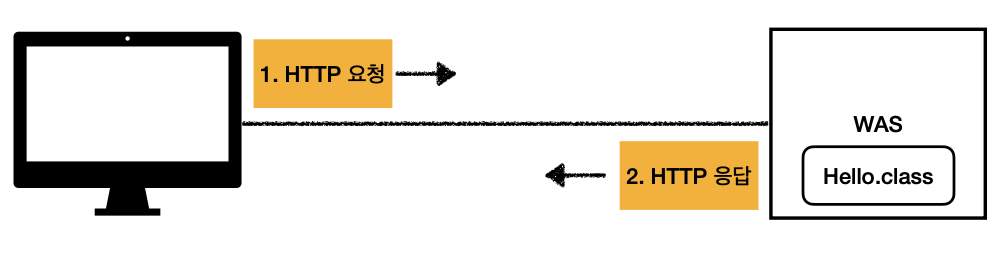
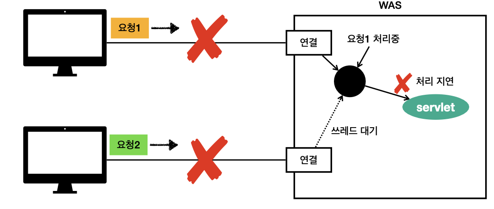

* ### 스프링 웹 MVC
* #### 모든 것이 HTTP
  
  * `HTTP 메세지에 모든 것을 전송`
  * HTML, TEXT
  * IMAGE, 음석, 영상, 파일
  * JSON, XML(API)
  * 거의 모든 형태의 데이터 전송 가능
  * 서버간에 데이터를 주고 받을 때도 대부분 HTTP 사용
* #### 웹 서버(Web Server)
   
  * HTTP 기반으로 동작
  * 정적 리소스 제공, 기타 부가기능
  * 정적(파일) HTML, CSS, JS, 이미지, 영상
    * 예) NGINXM APACH
* #### 웹 애플리케이션 서버(WAS - Web Application Server)
  
  * HTTP 기반으로 동작
  * 웹 서버 기능(정적 리소스 제공) 포함
  * 프로그램 코드를 실행해서 애플리케이션 로직 수행
    * 동적 HTML, HTTP API(JSON)
    * 서블릿, JSP, 스프링 MVC
    * 예) 톰캣(Tomcat), Jetty, Undertow
* #### 웹 서버, 웹 애플리케이션 서버 차이
  * 웹 서버는 정적 리소스(파일), WAS는 애플리케이션 로직
  * 사실 둥의 용어도 경계도 모호하다
    * 웹 서버도 프로그램을 실행하는 기능을 포함하기도 한다
    * 웹 애플리케이션 서버도 웹 버서의 기능을 제공한다
  * 자바는 서블릿 컨테이너 기능을 제공하면 WAS
    * 서블릿 없이 자바코드를 실행하는 서버 프레임워크도 있음
  * `WAS는 애플리케이션 코드를 실행하는데 더 특화`
* #### 웹 시스템 구성 - WAS, DB
  
  * WAS, DB 만으로 시스템 구성 가능
  * WAS는 정적 리소스, 애플리케이션 로직 모두 제공 가능 
  
    
  * WAS가 너무 많은 역할을 담당하면 서버 과부화 우려
  * 가장 비싼 애플리케이션 로직이 정적 리소스 때문에 수행이 어려울 수 있다
  * WAS 장애시 오류 화면도 노출 불가능
* #### 웹 시스템 구성 - WEB, WAS, DB
  
  * 정적 리소스는 웹 서버가 처리
  * 웹 서버는 애플리케이션 로직같은 동적인 처리가 필요하면 WAS에 요청을 위임
  * WAS는 중요한 애플리케이션 로직 처리 담당 

  
  * 효율적인 리소스 관리
    * 정적 리소스가 많이 사용되면 Web 서버 증설
    * 애플리케이션 리소스가 많이 사용되면 WAS 증성

  
  * 정적 리소스만 제공하는 웹 서버는 잘 죽지 않음
  * 애플리케이션 로직이 동작하는 WAS 서버는 잘 죽음
  * WAS, DB 장애시 WEB 서버가 오류 화면 제공 가능
* ### 서블릿
* #### 서버에서 처리해야 하는 업무
  * 궁극적인 목적은 HTTP 요청을 어떻게 받고 HTTP 응답을 어떻게 내려줄지 정의 
  * 웹 브라우저가 생성한 요청 HTTP 메세지 - 회원 저장
    ```
    POST /save HTTP/1.1
    Host: localhost:8080
    Content-Type: application/x-www-form-urlencoded

    username=kim&age=20
    ``` 
  * 웹 애플리케이션 서버 직접 구현
    ```
    * 서버 TCP/IP 연결 대기, 소켓 연결
    * HTTP 요청 메시지를 파싱해서 읽기
    * POST 방식, /save URL 인지
    * Content-Type 확인
    * HTTP 메시지 바디 내용 파싱
      * username, age 데이터를 사용할 수 있게 파싱
    * 저장 프로세스 실행
    * 비즈니스 로직 실행
      * 데이터베이스에 저장 요청
    * HTTP 응답 메세지 생성 시작
      * HTTP 시작 라인 생성
      * Header 생성
      * 메시지 바디에 HTML 생성에서 입력
    * TCP/IP에 응답 전달, 소켓 종료
    ``` 
   * 서블릿을 지원하는 WAS 사용
        ```
        * 비즈니스 로직 실행
        * 데이터베이스에 저장 요창
        ``` 
        * `의미있는 로직만 구현`
   * 서버에서 HTTP 응답 메시지 생성
        ```
        HTTP/1.1 200 OK
        Content-Type: text/html;charset=utf-8
        Content-Length: 3423

        <html>
            <body>...</body>
        </html>
        ```   
* #### 특징
  ```Java
  @WebServley(name = "helloServlet", urlPatterns = "/hello")
  puvlic class HelloServlet extends HttpServlet{

      @Override
      protected void service(HttpServletRequest request, HttpServletResponse response){
          //애플리케이션 로직
      }
  }
  ``` 
  * urlPatterns(/hello)의 URL이 호출되면 서블릿 코드가 실행
  * HTTP 요청 정보를 편리하게 사용할 수 있는 `HttpServletRequest`
  * HTTP 응답 정보를 편리하게 제공할 수 있는 `HttpServletResponse`
  * 개발자는 HTTP 스펙을 매우 편리하게 사용
* #### HTTP 요청, 응답 흐름
    
  * ##### HTTP 요청시
    * WAS는 Request, Response 객체를 새로 만들어서 서블릿 객체 호출
    * 개발자는 Requset 객체에서 HTTP 요청 정보를 편리하게 꺼내서 사용
    * 개발자는 Response 객체에 HTTP 응답 정보를 편리하게 입력
    * WAS는 Response 객체에 담겨있는 내용으로 HTTP 응답 정보를 생성
* #### 서블릿 컨테이너    
  
  * 톰캣처럼 서블릿을 지원하는 WAS를 서블릿 컨테이너라고 한다
  * 서블릿 컨테이너는 서블릿 객체를 생성, 초기화, 호출, 종료하는 생명주기 관리
  * 서블릿 객체는 `싱글톤으로 관리`
    * 고객의 요청이 올 때 마다 계속 객체를 생성하는 것은 비효율
    * 최초 로딩 시정에 서블릿 객체를 미리 만들어두고 재활용
    * 모든 고객 요청은 동일한 서블릿 객체 인스턴스의 접근
    * `공유 변수 사용 주의`
    * 서블릿 컨테이너 종료시 함께 종료
  * JSP도 서블릿으로 변환 되어서 사용
  * 동시 요청을 위한 멀티 쓰레드 처리 지원
* ### 동시 요청 - 멀티 쓰레드
    
* #### 쓰레드
  * 애플리케이션 코드를 하나하나 순차적으로 실행하는 것은 쓰레드
  * 자바 메인 메서드를 처음 실행하면 main이라는 이름의 쓰레드가 실행
  * 쓰레드가 없다면 자바 애플리케이션 실행 불가능
  * 쓰레드는 한번에 하나의 코드 라인만 수행
  * 동시 처리가 필요하면 쓰레드를 추가로 생성
* #### 단일 요청 - 쓰레드 하나 사용
  
  
  
    
* #### 다중 요청 - 쓰레드 하나 사용
   
  
  
* #### 요청 마다 쓰레드 생성
   
  * ##### 장점
    * 동시 요청을 처리할 수 있다
    * 리소스(CPU, 메모리)가 허용할 때 까지 처리가능
    * 하나의 쓰레드가 지연 되어도, 나머지 쓰레드는 정상 동작한다
  * ##### 단점
    * 쓰레드는 생성 비용이 매우 비싸다
      * 고객의 요청이 올 때 마다 쓰레드를 생성하면, 응답 속도가 늦어진다
    * 쓰레드는 컨텍스트 스위칭 비용이 발생한다
      * 컨텍스트 스위칭 비용
        * CPU 코어 한개에 쓰레드 하나 실행
        * CPU 코어에서 쓰레드 하나 실행 완료 후 다음 쓰레드 하나를 실행
          * 쓰레드 전환시 비용(컨텍스트 스위칭 비용)이 발생
          * 너무 빨리 처리되서 동시에 처리 되는 것 처럼 느낌
    * 쓰레드 생성에 제한이 없다
      * 고객 요청이 너무 많이 오면, CPU, 메모리 임계점을 넘어서 서버가 죽을 수 있다.
* #### 쓰레드 풀
  * ##### 요청 마다 쓰레드 생성의 단점 보완
   
   
  * ##### 특징
    * 필요한 쓰레드를 쓰레드 풀에 보관하고 관리한다.
    * 쓰레드 풀에 생성 가능한 쓰레드의 최대치를 관리한다. 톰캣은 최대 200개 기본 설정(변경 가능)
  * ##### 사용
    * 쓰레드가 필요하면, 이미 생성되어 있는 쓰레드 풀에서 꺼내서 사용한다.
    * 사용을 종료하면 쓰레드 풀에 해당 쓰레드를 반납한다
    * 최대 쓰레드가 모두 사용중이어서 쓰레드 풀에 쓰레드가 없으면?
      * 기다리는 요청은 거절하거나 특정 수만큼만 대기하도록 설정할 수 있다
  * ##### 장점
    * 쓰레드가 미리 생성되어 있으므로, 쓰레드를 생성하고 종료하는 비용(CPU)이 절약되고, 응답 시간이 빠르다
    * 생성 가능한 쓰레드의 최대치가 있으므로, 너무 많은 요청이 들어와도 기존 요청은 안전하게 처리할 수 있다.
  * ##### 실무 팁
    * WAS의 주요 튜닝 포인트는 최대 쓰레드(max thread)수 이다.
    * 이 값을 너무 낮게 설정하면?
      
      * 동시 요청이 많으면, 서버 리소스는 여유롭지만, 클라이언트는 금방 응답 지연
    * 이 값을 너무 높게 설정하면?
      * 동시 요청이 많으면, CPU, 메모리 리소스 임계점 초과로 서버 다운
    * 장애 발생시?
      * 클라우드면 일단 서버부터 늘리고, 이후에 튜닝
      * 클라우드가 아니면 열심히 튜닝
  * ##### 쓰레드 풀의 적정 숫자
    * 애플리케이션 로직의 복잡도, CPU, 메모리, IO 리소스 상황에 따라 모두 다르다
    * 성능 테스트
      * 최대한 실제 서버와 유사하게 성능 테스트 시도
      * 툴: 아파치 ab, 제이미터, nGrinder
  * #### WAS의 멀티 쓰레드 지원
    * 멀티 쓰레드에 대한 부분은 WAS가 처리
    * `개발자가 멀티 쓰레드 관련 코드를 신경쓰지 않아도 된다`
    * 개발자는 마치 `싱글 쓰레드 프로그래밍을 하듯이 편리하게 소스 코드를 개발`
    * 멀티 쓰레드 환경이므로 싱글톤 객체(서블릿, 스프링 빈)는 주의해서 사용
* ### HTML, HTTP, API, CSR, SSR
  * #### 정적 리소스
      
    * 고정된 HTML 파일, CSS, JS, 이미지, 영상 등을 제공
    * 주로 웹 브라우저
  * #### HTML 페이지
     
    * 동적으로 필요한 HTML 파일을 생성해서 전달
    * 웹 브라우저: HTML 해석
  * #### HTML API
     
    * HTML이 아니라 데이터를 전달
    * 주로 JSON 형식 사용
    * 다양한 시스템에서 호출
    * 데이터만 주고 받음, UI화면이 필요하면, 클라이언트가 별도 처리
    * 앱, 웹 클라이언트, 서버 to 서버
    * ##### 다양한 시스템 연동
      * 주로 `JSON` 형태로 데이터 통신
      * UI 클라이언트 접점
        * 앱 클라이언트(아이폰, 안드로이드, PC앱)
        * 웹 브라우저에서 자바스크립트를 통한 HTTP API 호출
        * React, Vue.js 같은 웹 클라이언트
      * 서버 to 서버
        * 주문 서버 -> 결제 서버
        * 기업간 데이터 통신
    * ##### SSR - 서버 사이드 렌더링
       
      * HTML 최종 결과를 서버에서 만들어서 웹 브라우저에 전달
      * 주로 정적인 화면에 사용
      * 관련기술: JSP, 타임리프 -> 백엔트 개발자
    * ##### CSR - 클라이언트 사이드 렌더링
      
      * HTML 결과를 자바스크립트를 사용해 웹 브라우저에서 동적으로 생성해서 적용
      * 주로 동적인 화면에 사용, 웹 환경을 마치 앱 처럼 필요한 부분부분 변경할 수 있음
        * 예) 구글 지도, Gmail, 구글 캘린더
      * 관련기술: React, Vue.js -> 웹 프론트엡드 개발자
---
* ### 서블릿
* #### Hello 서블릿
  * 서블릿은 톰캣 같은 웹 애플리케이션 서버를 직접 설치하고,그 위에 서블릿 코드를 클래스 파일로 빌드해서 올린 다음, 톰캣 서버를 실행하면 된다. 하지만 이 과정은 매우 번거롭다.스프링 부트는 톰캣 서버를 내장하고 있으므로, 톰캣 서버 설치 없이 편리하게 서블릿 코드를 실행할 수 있다.
  * ##### 스프링 부트 서블릿 환경 구성
    * 스프링 부트는 서블릿을 집접 등록해서 사용할 수 있도록 `@ServletComponentScan`을 지원하다. 
      ```Java
      @ServletComponentScan
      @SpringBootApplication
      public class Servlet01Application {

        public static void main(String[] args) {
            SpringApplication.run(Servlet01Application.class, args);
        }
      }
      ```
    * 서블릿 등록하기
      ```Java
        @WebServlet(name = "helloServlet", urlPatterns = "/hello")
        public class HelloServlet extends HttpServlet {

            @Override
            protected void service(HttpServletRequest request, HttpServletResponse response) throws ServletException, IOException {
                System.out.println("HelloServlet.service");
                System.out.println("request = " + request);
                System.out.println("response = " + response);

                String username = request.getParameter("username");
                System.out.println("username = " + username);

                response.setContentType("text/plain");
                response.setCharacterEncoding("utf-8");
                response.getWriter().write("hello " + username);
            }
        }
        ``` 
        * `@WebServlet`: 서블릿 애노테이션
          * `name`: 서블릿 이름
          * `urlPatterns`: URL 매핑
          * 서블릿 이름과 URL 매핑 이 겹쳐서는 안된다
        * HTTP 요청을 통해 매핑된 URL이 호출되면 서블릿 컨테이너는 다음 메서드를 실행한다
          ```Java
          protected void service(HttpServletRequest request, HttpServletResponse response)
          ``` 
    * 웹 브라우저 실행
      * `http://loacalhostL8080/hello?username=world`
      * 결과: hello world
    * 콘솔 실행 결과
      ```
      HelloServlet.service
      request = org.apache.catalina.connector.RequestFacade@5e4e72
      response = org.apache.catalina.connector.ResponseFacade@37d112b6
      username = world
      ``` 
  * ##### HTTP 요청 메시지 로그로 확인하기
    * `resources/application.properties`에 다음 코드를 추가
      ```Java
      logging.level.org.apache.coyote.http11=debug
      ``` 
    * 서버를 다시 시작하고 요청해보면 서버가 받은 HTTP 요청 메세지를 출력하는 것을 확인할 수 있다.
      ```
      ...o.a.coyote.http11.Http11InputBuffer: Received [GET /hello?username=servlet HTTP/1.1
      Host: localhost:8080
      Connection: keep-alive
      Cache-Control: max-age=0
      sec-ch-ua: "Chromium";v="88", "Google Chrome";v="88", ";Not A Brand";v="99"
      sec-ch-ua-mobile: ?0
      Upgrade-Insecure-Requests: 1
      User-Agent: Mozilla/5.0 (Macintosh; Intel Mac OS X 11_2_1) AppleWebKit/537.36
      (KHTML, like Gecko) Chrome/88.0.4324.150 Safari/537.36
      Accept: text/html,application/xhtml+xml,application/xml;q=0.9,image/avif,image/
      webp,image/apng,*/*;q=0.8,application/signed-exchange;v=b3;q=0.9
      Sec-Fetch-Site: same-origin
      Sec-Fetch-Mode: navigate
      Sec-Fetch-User: ?1
      Sec-Fetch-Dest: document
      Referer: http://localhost:8080/basic.html
      Accept-Encoding: gzip, deflate, br
      Accept-Language: ko,en-US;q=0.9,en;q=0.8,ko-KR;q=0.7
      ] 
      ``` 
      * 참고: 운영서버에 이렇게 모든 요청 정보를 다 남기면 성능저하가 발생할 수 있다. 개발 단계에서만 적용하자
  * ##### 서블릿 컨테이너 동작 방식 설명
    * 내장 톰캣 서버 생성
       
      * HTTP 요청 메시지
       
      ```
      GET /hello?username=world HTTP/1.1
      Host: localhost:8080
      ```
      * HTTP 응답 메시지

      ```
      HTTP/1.1 200 OK
      Content-Type: text/plain;charset=utf-8
      Content-Length: 11

      hello world
      ```   
      
        * 참고: HTTP 응답에서 Content-Length는 웹 애플리케이션 서버가 자동으로 생성해준다.
  * ##### welcome 페이지 추가
    * `webapp`경로에 `index.html`을 두면 http://localhost:8080 호출시 `index.html`페이지가 열린다 
    * main/webapp/index.html
     
    ```HTML
    <!DOCTYPE html>
    <html>
    <head>
        <meta charset="UTF-8">
        <title>Title</title>
    </head>
    <body>
    <ul>
        <li><a href="basic.html">서블릿 basic</a></li>
    </ul>
    </body>
    </html>
    ``` 
    * main/webapp/basic.html
     
    ```HTML
    <!DOCTYPE html>
    <html>
    <head>
        <meta charset="UTF-8">
        <title>Title</title>
    </head>
    <body>
    <ul>
        <li>hello 서블릿
            <ul>
                <li><a href="/hello?username=servlet">hello 서블릿 호출</a></li>
            </ul>
        </li>
        <li>HttpServletRequest
            <ul>
                <li><a href="/request-header">기본 사용법, Header 조회</a></li>
                <li>HTTP 요청 메시지 바디 조회
                    <ul>
                        <li><a href="/request-param?username=hello&age=20">GET -
                            쿼리 파라미터</a></li>

                        <li><a href="/basic/hello-form.html">POST - HTML Form</a></li>
                        <li>HTTP API - MessageBody -> Postman 테스트</li>
                    </ul>
                </li>
            </ul>
        </li>
        <li>HttpServletResponse
            <ul>
                <li><a href="/response-header">기본 사용법, Header 조회</a></li>
                <li>HTTP 응답 메시지 바디 조회
                    <ul>
                        <li><a href="/response-html">HTML 응답</a></li>
                        <li><a href="/response-json">HTTP API JSON 응답</a></li>
                    </ul>
                </li>
            </ul>
        </li>
    </ul>
    </body>
    </html>
    ```   
  * #### HttpServletRequest - 개요
    * ##### HttpServletRequest 역학
      * HTTP 요청 메시지를 개발자가 직접 파싱해서 사용해도 되지만, 매우 불편할 것이다. 서블릿은 개발자가 HTTP 요청 메시지를 편리하게 사용할 수 있도록 개발자 대신 HTTP요청 메시지를 파싱한다. 그리고 그 결과를 `HttpServletRequst`객체에 담아서 제공한다
      * HttpServletRequest를 사용하면 다음과 같은 HTTP 요청 메시지를 편리하게 조회할 수 있다.
    * ##### HTTP 요청 메시지
      ```
      POST /sava HTTP/1.1
      Host: localhost:8080
      Content-Type: application/x-www-form-urlcoded

      username=kim&age=20
      ```  
      * START LINE
        * HTTP 메소드
        * URL
        * 쿼리 스트링
        * 스키마, 프로토콜
      * 헤더
        * 헤더 조회
      * 바디
        * form 파라미터 형식 조회
        * message body 데이터 직접 조회
    * ##### 임시 저장소 기능
      * 해당 HTTP 요청이 시작부터 끝날 때 까지 유지되는 임시 저장소 기능
        * 저장: `request.setAttribute(name, value)`
        * 조회: `request.getAttibute(name)`
      * 세션 관리 기능
        * `request.getSession(create: true)`
    * ##### 중요
      * HttpServletRequeset, HttpServletResponse를 사용할 때 가장 중요한 점은 이 객체들이 HTTP 요청 메시지, HTTP 응답 메시지를 편리하게 사용하도록 도와주는 객체라는 점이다. 따라서 이 기능에 대해서 깊이있는 이해를 하려면 `HTTP 스펙이 제공하는 요청, 응답 메시지 자체를 이해`히야 한다.
  * #### HttpServletRequest - 기본 사용법
    * hello.servlet.basic.request.RequestHeaderServlet

    ```Java
    @WebServlet(name = "requestHeaderServlet", urlPatterns = "/request-header")
    public class RequestHeaderServlet extends HttpServlet {

        @Override
        protected void service(HttpServletRequest request, HttpServletResponse response) throws ServletException, IOException {
            printStartLine(request);
            printHeaders(request);
            printHeaderUtils(request);
            printEtc(request);

            response.getWriter().write("OK");
        }
    ```   
    * ##### start-line 정보

    ```Java
    //start line 정보
    private void printStartLine(HttpServletRequest request) {
        System.out.println("--- REQUEST-LINE - start ---");
        System.out.println("request.getMethod() = " + request.getMethod()); //GET
        System.out.println("request.getProtocal() = " + request.getProtocol()); //HTTP/1.1
        System.out.println("request.getScheme() = " + request.getScheme()); //http
        // http://localhost:8080/request-header
        System.out.println("request.getRequestURL() = " + request.getRequestURL());
        // /request-test
        System.out.println("request.getRequestURI() = " + request.getRequestURI());
        //username=hi
        System.out.println("request.getQueryString() = " +
                request.getQueryString());
        System.out.println("request.isSecure() = " + request.isSecure()); //https 사용 유무
        System.out.println("--- REQUEST-LINE - end ---");
        System.out.println();
    }    
    ```
      * 결과
        ```
        --- REQUEST-LINE - start ---
        request.getMethod() = GET
        request.getProtocal() = HTTP/1.1
        request.getScheme() = http
        request.getRequestURL() = http://localhost:8080/request-header
        request.getRequestURI() = /request-header
        request.getQueryString() = null
        request.isSecure() = false
        --- REQUEST-LINE - end ---
        ```
    * ##### 헤더 정보

    ```Java
    //Header 모든 정보
    private void printHeaders(HttpServletRequest request) {
        System.out.println("--- Headers - start ---");
    /*
      Enumeration<String> headerNames = request.getHeaderNames();
      while (headerNames.hasMoreElements()) {
          String headerName = headerNames.nextElement();
          System.out.println(headerName + ": " + request.getHeader(headerName));
      }
    */
        request.getHeaderNames().asIterator()
                .forEachRemaining(headerName -> System.out.println(headerName + ": " + request.getHeader(headerName)));

        System.out.println("--- Headers - end ---");
        System.out.println();
    }
    ```
       * 결과
         ```
            --- Headers - start ---
            host: localhost:8080
            connection: keep-alive
            cache-control: max-age=0
            sec-ch-ua: " Not A;Brand";v="99", "Chromium";v="96", "Google Chrome";v="96"
            sec-ch-ua-mobile: ?0
            sec-ch-ua-platform: "macOS"
            upgrade-insecure-requests: 1
            user-agent: Mozilla/5.0 (Macintosh; Intel Mac OS X 10_15_7) AppleWebKit/537.36 (KHTML, like Gecko) Chrome/96.0.4664.110 Safari/537.36
            accept: text/html,application/xhtml+xml,application/xml;q=0.9,image/avif,image/webp,image/apng,*/*;q=0.8,application/signed-exchange;v=b3;q=0.9
            sec-fetch-site: none
            sec-fetch-mode: navigate
            sec-fetch-user: ?1
            sec-fetch-dest: document
            accept-encoding: gzip, deflate, br
            accept-language: ko-KR,ko;q=0.9,en-US;q=0.8,en;q=0.7
            --- Headers - end ---
            ``` 
    * ##### Header 편리한 조회

    ```Java
    //Header 편리한 조회
    private void printHeaderUtils(HttpServletRequest request) {
        System.out.println("--- Header 편의 조회 start ---");
        System.out.println("[Host 편의 조회]");
        System.out.println("request.getServerName() = " +
                request.getServerName()); //Host 헤더
        System.out.println("request.getServerPort() = " + request.getServerPort()); //Host 헤더
        System.out.println();
        System.out.println("[Accept-Language 편의 조회]");
        request.getLocales().asIterator()
                .forEachRemaining(locale -> System.out.println("locale = " + locale));
        System.out.println("request.getLocale() = " + request.getLocale());

        System.out.println();
        System.out.println("[cookie 편의 조회]");
        if (request.getCookies() != null) {
            for (Cookie cookie : request.getCookies()) {
                System.out.println(cookie.getName() + ": " + cookie.getValue());
            }
        }
        System.out.println();
        System.out.println("[Content 편의 조회]");
        System.out.println("request.getContentType() = " +
                request.getContentType());
        System.out.println("request.getContentLength() = " + request.getContentLength());
        System.out.println("request.getCharacterEncoding() = " +
                request.getCharacterEncoding());
        System.out.println("--- Header 편의 조회 end ---");
        System.out.println();
    }
    ```
      * 결과
        ```
        --- Header 편의 조회 start ---
        [Host 편의 조회]
        request.getServerName() = localhost
        request.getServerPort() = 8080

        [Accept-Language 편의 조회]
        locale = ko_KR
        locale = ko
        locale = en_US
        locale = en
        request.getLocale() = ko_KR

        [cookie 편의 조회]

        [Content 편의 조회]
        request.getContentType() = null
        request.getContentLength() = -1
        request.getCharacterEncoding() = UTF-8
        --- Header 편의 조회 end ---
        ```  
    * ##### 기타 정보

    ```Java

    //기타 정보
    private void printEtc(HttpServletRequest request) {
        System.out.println("--- 기타 조회 start ---");
        System.out.println("[Remote 정보]");
        System.out.println("request.getRemoteHost() = " +
                request.getRemoteHost()); //
        System.out.println("request.getRemoteAddr() = " +
                request.getRemoteAddr()); //
        System.out.println("request.getRemotePort() = " +
                request.getRemotePort()); //
        System.out.println();
        System.out.println("[Local 정보]");
        System.out.println("request.getLocalName() = " +
                request.getLocalName()); //
        System.out.println("request.getLocalAddr() = " +
                request.getLocalAddr()); //
        System.out.println("request.getLocalPort() = " +
                request.getLocalPort()); //
        System.out.println("--- 기타 조회 end ---");
        System.out.println();
    }
    ```
      * 결과
        ```
        --- 기타 조회 start ---
        [Remote 정보]
        request.getRemoteHost() = 0:0:0:0:0:0:0:1
        request.getRemoteAddr() = 0:0:0:0:0:0:0:1
        request.getRemotePort() = 51935

        [Local 정보]
        request.getLocalName() = localhost
        request.getLocalAddr() = 0:0:0:0:0:0:0:1
        request.getLocalPort() = 8080
        --- 기타 조회 end ---
        ``` 
  * #### HTTP요청 데이터 - 개요
    * HTTP 요청 메시지를 통해 클라이언트에서 서버로 데이터를 전달하는 3가지 방법
    * ##### GET - 쿼리 파라미터
      * /url`?username=hello&age=20`
      * 메시지 바티 없이, URL의 쿼리 파라미터에 데이터를 포함해서 전달
        * 검색, 필터, 페이징등에서 많이 사용하는 방식
    * ##### POST - HTML Form
      * Content-type: application/x-www-form-urlcoded
      * 메시지 바디에 `쿼리 파라미터 형식으로 전달` username=hello&age=20
        * 회원 가입, 상품 주문, HTML Form 사용
    * ##### HTTP message body에 데이터를 직접 담아서 요청
      * HTTP API에서 주로 사용, JSON, XML, TEXT
      * 데이터 형식은 주로 JSON사용
        * POST, PUT, PATCH
* #### HTTP요청 데이터 - GET 쿼리 파라미터
  * 다음 데이터를 클라이언트에서 서버로 전송해보자
  * 전달 데이터
    * username=hello
    * age=20
  * 메시지 바디 없이, URL의 `쿼리 파라미터`를 사용해서 데이터를 전달한다
    * 예) 검색, 필터, 페이징등에서 많이 사용하는 방식
  * 쿼리 파라미터는 URL에 다음와 같이 `?`를 시작으로 보낼 수 있다. 추가 파라미터는 `&`로 구분하면 된다.
    ```
    http://localhost:8080/request-param?username=hello&age=20
    ``` 
  * 서버에서는 `HttpServletRequest`가 제공하는 다음 메서드를 통해 쿼리 파라미터를 편리하게 조회할 수 있다.
  * ##### 쿼리 파라미터 조회 메서드

  ```Java
  String username = request.getPrarmeter("username"); //단일 파라미터 조회
  Enumeration<String> parameterNames = request.getParameterNames(); //파라미터 이름들 모두 조회
  Map<String, String[]> parameterMap = request.getParamegerMap(); //파라미터를 Map으로 조회
  String[] username = requset.getParameterValues("username"); //복수 파라미터 조회
  ```

    ```Java
    /**
    * 1. 파라미터 전송 가능
    * http://localhost:8080/request-param?username=hello&age=20
    * <p>
    * 2. 동일한 파라미터 전송 가능
    * http://localhost:8080/request-param?username=hello&username=kim&age=20
    */
    @WebServlet(name = "requestParamServlet", urlPatterns = "/request-param")
    public class RequestParamServlet extends HttpServlet {

        @Override
        protected void service(HttpServletRequest request, HttpServletResponse response) throws ServletException, IOException {

    //        Enumeration<String> parameterNames = request.getParameterNames();
    //        while (parameterNames.hasMoreElements()) {
    //            String paramName = parameterNames.nextElement();
    //            System.out.println(paramName + ": " + request.getParameter(paramName));
    //        }

            System.out.println("[전체 파라미터 조회] - start");
            request.getParameterNames().asIterator()
                    .forEachRemaining(username -> System.out.println(username + ": " + request.getParameter(username)));
            System.out.println("[전체 파라미터 조회] - end");
            System.out.println();

            System.out.println("[단일 파라미터 조회] - start");
            String username = request.getParameter("username");
            System.out.println("request.getParameter(username): " + username);
            System.out.println("[단일 파라미터 조회] - end");
            System.out.println();

            System.out.println("[이름이 같은 복수 파라미터들 조회] - start");
            System.out.println("request.getParameterValues(username)");
            String[] usernames = request.getParameterValues("username");
            for (String name : usernames) {
                System.out.println("username: " + name);
            }
            System.out.println("[이름이 같은 복수 파라미터들 조회] - end");
            System.out.println();
        }
    }
    ```
  * ##### 복수 파라미터에서 단일 파라미터 조회
    * `username=hello&username=kim`과 같이 파라미터 이름은 하나인데 값이 중복이면 어떻게 될까?
    * `request.getParameter()`는 하나의 파라미터 이름에 대해서 단 하나의 값만 있을 때 사용해야 한다.
    * 지금처럼 중복일 때는 `request.getParameterValues()`를 사용해야 한다.
    * 참고로 이렇게 중복일 때 `requaet.getParameter()`를 사용하면 `request.getParameterValues()`의 첫 번째 값을 반환한다 
* #### HTTP요청 데이터 - POST HTML Form
  * ##### 특징
    * Content-Type: `application/x-www-form-urlencoded`
    * 메시지 바디에 쿼리 파라미터 형식으로 데이터를 전달한다. `username=hello&age=20`
  * `src/main/webapp/basic/hello-form.html` 생성
    ```HTML
    <!DOCTYPE html>
    <html>
    <head>
        <meta charset="UTF-8">
        <title>Title</title>
    </head>
    <body>
    <form action="/request-param" method="post">
        username: <input type="text" name="username"/> age: <input type="text" name="age"/>
        <button type="submit">전송</button>
    </form>
    </body>
    </html>
    ```
    * http://localhost:8080/basic/hello-form.html 실행
  * POST의 HTML Form을 전송하면 웹 브라우저는 다음 형식으로 HTTP 메시지를 만들다
    * 요청 URL: `http://localhost:8080/request-param`
    * Content-Type: `application/x-www-from-urlencoded`
    * message body: username=hello&age=20
  * `application/x-www-form-urlencoded`형식은 앞서 GET에서 살펴본 쿼리 파라미터 형식과 같다. 따라서 `쿼리 파라미터 조회 메서드를 그대로 사용`하면 된다
  * 클라이언트(웹 브라우저)입장에서는 두 방식에 차이가 있지만, 서버 입징에서는 둘의 형식이 동일하므로, `request.getParameter()`로 편리하게 구분없이 조회할 수 있다.
  * 정리하면 `request.getParameter()`는 GET URL 쿼리 파라미터 형식도 지원하고, POST HTML Form 형식 둘 다 지원한다
  * 참고
    * Contemt-Type은 HTTP 메시지 바디의 데이터 형식을 지정한다
    * `GET URL 쿼리 파라미터 형식`으로 클라이언트에서 서버로 데이터를 전달할 때는 HTTP메시지 바디를 사용하지 않기 때문에 Content-Type이 없다.
    * `POST HTML Form 형식`으로 데이터를 전달하려면 HTTP 메시지 바디에 해당 데이터를 포함해서 보내기 때문에 바디에 포함된 데이터가 어떤 형식인지 Content-Type을 꼭 지정해야 한다. 이렇게 폼으로 데이터를 전송하는 형식을 `application/x-www-form-urlencoded`라 한다
  * ##### Postman을 사용한 테스트
    * 이런 간단한 테스트에 HTML form을 만들기는 귀찮다. 이때는 Postman을 사용하면 된다.
    * `Postman`테스트 주의사항
      * POST 전송시
        * Body -> `x-www-form-urlencoded`선택
        * Headers에서 Content-Type: `application/x-www-form-urlencoded`로 지정된 부분 꼭 확인  
* #### HTTP요청 데이터 - API메세지 바디 - 단순 텍스트
  * HTTP message body에 데이터를 직접 담아서 요청
    * HTTP API에 주로 사용, JSON, XML, TEXT
    * 데이터 형식은 주로 JSON 사용
    * POST, PUT, PATCH
  * 먼저 가장 단순한 덱스트 메시지를 HTTP 메시지 바디에 담아서 전송하고 읽어보자
  * HTTP 메시지 바디의 데이터를 InputStream을 사용해서 직접 읽을 수 있다.
  * RequsetBodyStringServlest
    ```Java
    @WebServlet(name = "requestBodyStringServlet", urlPatterns = "/request-body-string")
    public class RequestBodyStringServlet extends HttpServlet {

        @Override
        protected void service(HttpServletRequest request, HttpServletResponse response) throws ServletException, IOException {
            ServletInputStream inputStream = request.getInputStream(); // 메시지 body의 내용을 byteCode 로 받을 수 있다.
            String massageBody = StreamUtils.copyToString(inputStream, StandardCharsets.UTF_8); //스프링이 제공하는 유틸리티

            System.out.println("massageBody = " + massageBody);

            response.getWriter().write("Ok");
        }
    }
    ```
    * 참고
      * inpuStream은 byte 코드를 반환한다. byte 코드를 우리가 읽을 수 있는 문자(String)로 보려면 문자표(Charset)를 지정해주어야 한다. 여기서는 UTF-8 Charset을 지정해주었다.
    * 문자 전송
      * POST `http://localhost:8080/request-body-string`
      * content-type: text/plain
      * message body: `hello`
      * 결과: `messageBody = hello`
* #### HTTP요청 데이터 - API메세지 바디 - JSON
  * ##### JSON 형식 전송
    * POST `http://localhost:8080/request-body-json`
    * content-type: application/json
    * message body: `{"username": "hello", "age": 20}`
    * 결과: `messageBody = {"username": "hello", "age": 20}`
  * ##### JSON 형식 파싱 추가
    * JSON 형식으로 파싱할 수 있게 객체를 하나 생성하자
    * hello.servlet.basic.HelloData
        ```Java
        package hello.servlet.basic;

        import lombok.Getter;
        import lombok.Setter;

        @Getter @Setter
        public class HelloData {

            private String username;
            private int age;
        }
        ```
        * lombok이 제공하는 `@Getter`, `@Setter`덕분에 자동 추가
        ```Java
        @WebServlet(name = "requestBodyJsonServlet", urlPatterns = "/request-body-json")
        public class RequestBodyJsonServlet extends HttpServlet {

            private ObjectMapper objectMapper = new ObjectMapper();

            @Override
            protected void service(HttpServletRequest request, HttpServletResponse response) throws ServletException, IOException {
                ServletInputStream inputStream = request.getInputStream();
                String messageBody = StreamUtils.copyToString(inputStream, StandardCharsets.UTF_8);

                System.out.println("messageBody = " + messageBody);

                HelloData helloData = objectMapper.readValue(messageBody, HelloData.class);

                System.out.println("helloData.getUsername() = " + helloData.getUsername());
                System.out.println("helloData.getAge() = " + helloData.getAge());

                response.getWriter().write("ok");
            }
        }
        ```  
        * Postman으로 실생
          * POST `http://localhost:8080/request-body-json`
          * content-type: `application/json` (Body raw, 가장 오른쪽에서 JSON 선택)
          * message body: `{"username": "hello", "age": 20}`
    * 참고 
      * JSON 결과를 파싱해서 사용할 수 있는 자바 객체로 변환하려면 Jackson, Gson 같은 JSON 변환 라이브러리를 추가해서 사용해야 한다. 스프링 부트로 Spring MVC를 선택하면 기본으로 Jackson 라이브러리( ObjectMapper )를 함께 제공한다
      *  HTML form 데이터도 메시지 바디를 통해 전송되므로 직접 읽을 수 있다. 하지만 편리한 파리미터 조회 기능( request.getParameter(...) )을 이미 제공하기 때문에 파라미터 조회 기능을 사용하면 된다.      
* #### HttpServletResponse - 기본 사용법
  * ##### HttpServletResponse 역할
    * HTTP 응답 메시지 생성
    * HTTP 응답코드 지정
    * 헤더 생성
    * 바디 생성
    * 편의 기능 제공
      * Content-Type, 쿠키, Redirect
  * ##### HttpServletResponse 기본 사용법
    ```Java
    @WebServlet(name = "ResponseHeaderServlet", urlPatterns = "/response-header")
    public class ResponseHeaderServlet extends HttpServlet {

        @Override
        protected void service(HttpServletRequest request, HttpServletResponse response) throws ServletException, IOException {
            //[status-line]
            response.setStatus(HttpServletResponse.SC_OK);

            //[response-header]
            response.setHeader("Content-Type", "text/plain;charset=utf-8");
            response.setHeader("Cache-Control", "no-cache, no-store, must-revalidate");
            response.setHeader("Pragma", "no-cache");
            response.setHeader("my-header", "hello");

            //[Header 편의 메서드]
            content(response);
            cookie(response);
            redirect(response);

            //[message-body]
            PrintWriter writer = response.getWriter();
            writer.println("OK");
        }
    ``` 
  * ##### Content 편의 메서드
    ```Java
    //Content 편의 메서드
    private void content(HttpServletResponse response) {
        //Content-Type: text/plain;charset=utf-8
        //Content-Length: 2
        //response.setHeader("Content-Type", "text/plain;charset=utf-8");
        response.setContentType("text/plain");
        response.setCharacterEncoding("utf-8");
        //response.setContentLength(2); //(생략시 자동 생성)
    }
    ``` 
  * ##### 쿠키 편의 메서드
    ```Java
    //쿠키 편의 메서드
    private void cookie(HttpServletResponse response) {
        //Set-Cookie: myCookie=good; Max-Age=600;
        //response.setHeader("Set-Cookie", "myCookie=good; Max-Age=600");
        Cookie cookie = new Cookie("myCookie", "good");
        cookie.setMaxAge(600); //600초
        response.addCookie(cookie);
    }
    ```
  * ##### redirect 편의 메서드
    ```Java
    //redirect 메서드
    private void redirect(HttpServletResponse response) throws IOException {
        //Status Code 302
        //Location: /basic/hello-form.html
        //response.setStatus(HttpServletResponse.SC_FOUND); //302
        //response.setHeader("Location", "/basic/hello-form.html");
        response.sendRedirect("/basic/hello-form.html");
    }
    ```  
* #### HTTP 응답 데이터 - 단순 텍스트, HTML
  * HTTP 응답 메시지는 주로 다음 내용을 담아서 전달한다
    * 단순 텍스트 응답
      * 앞에서 살펴봄`(write.println("ok");`
      * HTML 응답
      * HTTP API - MessageBody JSON 응답
  * ##### HttpServletResponse - HTML 응답
    ```Java
    @WebServlet(name = "ResponseHtmlServlet", urlPatterns = "/response-html")
    public class ResponseHtmlServlet extends HttpServlet {

        @Override
        protected void service(HttpServletRequest request, HttpServletResponse response) throws ServletException, IOException {
            //Content-Type: text/html;charset=utf-8
            response.setContentType("text/html");
            response.setCharacterEncoding("utf-8");

            PrintWriter writer = response.getWriter();

            writer.println("<html>");
            writer.println("<body>");
            writer.println("    <div>안녕</div>");
            writer.println("</body>");
            writer.println("</html>");
        }
    }
    ``` 
    * HTTP 응답으로 HTML을 반환할 때는 Context-Type을 `text/html`로 지정해야 한다
    * 실행
      * `http://localhost:8080/response-html`
* #### HTTP 응답 데이터 - API JSON
    ```Java
    @WebServlet(name = "ResponseJsonServlet", urlPatterns = "/response-json")
    public class ResponseJsonServlet extends HttpServlet {

        private ObjectMapper objectMapper = new ObjectMapper();

        @Override
        protected void service(HttpServletRequest request, HttpServletResponse response) throws ServletException, IOException {
            //Content-Type: application/json;charset=utf8
            response.setContentType("application/json");
            response.setCharacterEncoding("utf-8");

            HelloData helloData = new HelloData();

            helloData.setUsername("Jeon");
            helloData.setAge(29);

            //{"username":"Jeon","age":29}
            String result = objectMapper.writeValueAsString(helloData);

            response.getWriter().println(result);
        }
    }
    ``` 
    * HTTP 응답으로 JSON을 반환할 때는 `content-type을 application/json` 로 지정해야 한다. Jackson 라이브러리가 제공하는 `objectMapper.writeValueAsString(`) 를 사용하면 객체를 JSON 문자로 변경할 수 있다.
    * 참고
      *  application/json 은 스펙상 utf-8 형식을 사용하도록 정의되어 있다. 그래서 스펙에서 charset=utf-8과 같은 추가 파라미터를 지원하지 않는다. 따라서 application/json 이라고만 사용해야지 application/json;charset=utf-8 이라고 전달하는 것은 의미 없는 파라미터를 추가한 것이 된다. > response.getWriter()를 사용하면 추가 파라미터를 자동으로 추가해버린다. 이때는 response.getOutputStream()으로 출력하면 그런 문제가 없다.
* ### 서블릿, JSP, MVC 패턴
* #### 회원 관리 웹 애플리케이션 요구사항
  * ##### 회원 정보
    * 이름: username
    * 나이: age
  * ##### 기능 요구사항
    * 회원 저장
    * 회원 목록 조회
  * ##### 회원 도메인 모델
    ```Java
    package hello.servlet01.domain;

    public class Member {

        private Long id;
        private String username;
        private int age;

        public Member() { }

        public Member(String username, int age) {
            this.username = username;
            this.age = age;
        }
    }
    ```
    * `id`는 `Member`를 회원 저장소에 저장하면 회원 저장소가 할당한다
  * ##### 회원 저장소
    ```Java
    package hello.servlet01.domain;

    import java.util.ArrayList;
    import java.util.HashMap;
    import java.util.List;
    import java.util.Map;

    /**
    * 동시성 문제가 고려되어 있지 않음, 실무에서는 ConcurrentHashMap, AtomicLong 사용 고려
    */
    public class MemberRepository {

        private static Map<Long, Member> store = new HashMap<>();  //static 사용
        private static Long sequence = 0L;  //static 사용

        private static final MemberRepository instance = new MemberRepository();  //싱글톤 스코프

        public static MemberRepository getInstance() {
            return instance;
        }

        private MemberRepository() { }  //외부에서 호출할 수 없도록 private 생성자 설정

        public Member save(Member member) {
            member.setId(++sequence);
            store.put(member.getId(), member);
            return member;
        }

        public Member findByID(Long id) {
            return store.get(id);
        }

        public List<Member> findAll() {
            return new ArrayList<>(store.values());
        }

        public void clearStore() {
            store.clear();
        }
    }
    ```
    * 회원 저장소는 싱클톤 패턴을 적용했다. 스프링을 사용하면 스프링 빈으로 틍록하면 되지만, 지금은 최대한 스프링 없이 순수 서플릿 만으로 구현하는 것이 목적이다. 싱글톤 패턴은 객체를 단 하나만 생성해서 공유해야 하므로 생성자는 `private`접근자로 막아둔다
  * ##### 회원 저장소 테스트 코드
    ```Java
    package hello.servlet01.domain.member;

    import hello.servlet01.domain.Member;
    import hello.servlet01.domain.MemberRepository;
    import org.junit.jupiter.api.AfterEach;
    import org.junit.jupiter.api.DisplayName;
    import org.junit.jupiter.api.Test;

    import java.util.List;

    import static org.assertj.core.api.Assertions.assertThat;

    class MemberRepositoryTest {

        private MemberRepository memberRepository = MemberRepository.getInstance();

        @AfterEach
        void afterEach() {
            memberRepository.clearStore();
        }

        @Test
        @DisplayName("회원 등록 및 조회")
        void save() {
            //given
            Member member = new Member("Jeon", 29);

            //when
            Member saveMember = memberRepository.save(member);

            //then
            assertThat(saveMember).isEqualTo(member);
        }

        @Test
        @DisplayName("회원 전체 조회")
        void findAll() {
            //given
            Member memberA = new Member("Jeon", 29);
            Member memberB = new Member("Kim", 29);

            //when
            memberRepository.save(memberA);
            memberRepository.save(memberB);

            List<Member> memberList = memberRepository.findAll();

            //then
            assertThat(memberList.size()).isEqualTo(2);
            assertThat(memberList).contains(memberA, memberB);
        }
    }
    ```
    * 회원을 저장하고, 목록을 조회하는 테스트를 작성했다. 각 테스트가 끝날 때, 다음 테스스에 영향을 주지 않도록 각 테스트의 저장소를 `clearStore()`를 호출해서 초기화 했다.
    * `assertThat(비교대상 자료구조).contains(원소1, 원소2, ...)`
      * 중복 여부, 순서에 관계없이 값만 일치하면 테스트 성공   
* #### 서블릿으로 회원 관리 웹 애플리케이션 만들기
  * ##### MemberFormServlet - 회원 등록 폼
    ```Java
    package hello.servlet01.web.servlet;

    import hello.servlet01.domain.MemberRepository;

    import javax.servlet.ServletException;
    import javax.servlet.annotation.WebServlet;
    import javax.servlet.http.HttpServlet;
    import javax.servlet.http.HttpServletRequest;
    import javax.servlet.http.HttpServletResponse;
    import java.io.IOException;
    import java.io.PrintWriter;

    @WebServlet(name = "memberFormServlet", urlPatterns = "/servlet/member/new-form")
    public class MemberFormServlet extends HttpServlet {

        private MemberRepository memberRepository = MemberRepository.getInstance();

        @Override
        protected void service(HttpServletRequest request, HttpServletResponse response) throws ServletException, IOException {

            response.setContentType("text/html");
            response.setCharacterEncoding("utf-8");

            PrintWriter w = response.getWriter();

            w.write("<!DOCTYPE html>\n" +
                    "<html>\n" +
                    "<head>\n" +
                    "    <meta charset=\"UTF-8\">\n" +
                    "    <title>Title</title>\n" +
                    "</head>\n" +
                    "<body>\n" +
                    "<form action=\"/servlet/members/save\" method=\"post\">\n" +
                    "    username: <input type=\"text\" name=\"username\" />\n" +
                    "    age:      <input type=\"text\" name=\"age\" />\n" +
                    " <button type=\"submit\">전송</button>\n" + "</form>\n" +
                    "</body>\n" +
                    "</html>\n");
        }
    }
    ```
    * `MemberFormServlet`은 단순하게 회원 정보를 입력할 수 있는 HTML Form을 만들어서 응답한다.
    * 자바 코드로 HTML을 제공해야 하므로 쉽지 않은 작업이다.
    * 실행
      * http://localhost:8080/servlet/members/new-form
      * HTML Form 데이터를 POST로 전송해고, 전달 받는 서블릿을 아직 만들지 않았다 그래서 오류가 발생하는 것이 정상이다.
      * 이번에는 HTML Form에서 데이터를 입력하고 전송을 누르면 실제 회원 데이터가 저장되도록 해보자. 전송 방식을 POST HTML Form에서 학습한 내용과 같다.
  * ##### MemberSaveServlet - 회원 저장 
    ```Java
    package hello.servlet01.web.servlet;

    import hello.servlet01.domain.Member;
    import hello.servlet01.domain.MemberRepository;

    import javax.servlet.ServletException;
    import javax.servlet.annotation.WebServlet;
    import javax.servlet.http.HttpServlet;
    import javax.servlet.http.HttpServletRequest;
    import javax.servlet.http.HttpServletResponse;
    import java.io.IOException;
    import java.io.PrintWriter;

    @WebServlet(name = "memberSaveServlet", urlPatterns = "/servlet/members/save")
    public class MemberSaveServlet extends HttpServlet {

        private MemberRepository memberRepository = MemberRepository.getInstance();

        @Override
        protected void service(HttpServletRequest request, HttpServletResponse response) throws ServletException, IOException {
            System.out.println("MemberSaveServlet.service");

            String username = request.getParameter("username");
            int age = Integer.parseInt(request.getParameter("age"));

            Member member = new Member(username, age);
            System.out.println("member = " + member);
            memberRepository.save(member);

            response.setContentType("text/html");
            response.setCharacterEncoding("utf-8");
            PrintWriter w = response.getWriter();

            w.write("<html>\n" +
                    "<head>\n" +
                    " <meta charset=\"UTF-8\">\n" + "</head>\n" +
                    "<body>\n" +
                    "성공\n" +
                    "<ul>\n" +
                    "    <li>id=" + member.getId() + "</li>\n" +
                    "    <li>username=" + member.getUsername() + "</li>\n" +
                    " <li>age=" + member.getAge() + "</li>\n" + "</ul>\n" +
                    "<a href=\"/index.html\">메인</a>\n" + "</body>\n" +
                    "</html>");
        }
    }
    ```
    * `MemberSaveServlet`은 다음 순서로 동작한다
      * 파라미터를 조회해서 Member 객체를 만든다
      * Member 객체를 MemberRespository를 통해서 저장한다
      * Member 객체를 사용해서 결과 화면용 HTML을 동적으로 만들어서 응답한다
    * 싱핼
      * http://localhost:8080/servlet/members/new-form
      * 데이터가 전송되고, 저장 결과를 확인할 수 있다.
  * ##### MemberListServlet - 회원 목록
    ```Java
    package hello.servlet01.web.servlet;

    import hello.servlet01.domain.Member;
    import hello.servlet01.domain.MemberRepository;

    import javax.servlet.ServletException;
    import javax.servlet.annotation.WebServlet;
    import javax.servlet.http.HttpServlet;
    import javax.servlet.http.HttpServletRequest;
    import javax.servlet.http.HttpServletResponse;
    import java.io.IOException;
    import java.io.PrintWriter;
    import java.util.List;

    @WebServlet(name = "memberListServlet", urlPatterns = "/servlet/members")
    public class MemberListServlet extends HttpServlet {

        private MemberRepository memberRepository = MemberRepository.getInstance();

        @Override
        protected void service(HttpServletRequest request, HttpServletResponse response) throws ServletException, IOException {

            List<Member> members = memberRepository.findAll();

            response.setContentType("text/html");
            response.setCharacterEncoding("utf-8");
            PrintWriter w = response.getWriter();

            w.write("<html>");
            w.write("<head>");
            w.write("    <meta charset=\"UTF-8\">");
            w.write("    <title>Title</title>");
            w.write("</head>");
            w.write("<body>");
            w.write("<a href=\"/index.html\">메인</a>");
            w.write("<table>");
            w.write("    <thead>");
            w.write("    <th>id</th>");
            w.write("    <th>username</th>");
            w.write("    <th>age</th>");
            w.write("    </thead>");
            w.write("    <tbody>");

            for (Member member : members) {
                w.write("    <tr>");
                w.write("       <td>" + member.getId() + "</td>");
                w.write("       <td>" + member.getUsername() + "</td>");
                w.write("       <td>" + member.getAge() + "</td>");
                w.write("    </tr>");
            }

            w.write("    </tbody>");
            w.write("</table>");
            w.write("</body>");
            w.write("</html>");
        }
    }
    ```
    * `MemberListServlet`은 다음 순서로 동작한다
      * `memberRepository.finAll()`을 통해 모든 회원을 조회한다.  
      * 회원 목록 HTML 을 for루프를 통해서 회원 수 만큼 동적으로 생성하고 응답한다
    * 실행
      * http://localhost:8080/servlet/members
    * 템플릿 엔진으로
      * 지금까지 서블릿과 자바 코드만으로 HTML을 만들어보았다. 서블릿 덕분에 동적으로 원하는 HTML을 마음껏 만들 수 있다. 정적인 HTML 문서라면 화면이 계속 달라지는 회원의 저장 결과라던가, 회원 목록 같은 동적인 HTML을 만드는 일은 불가능 할 것이다. 그런데, 코드에서 보듯이 이것은 매우 `복잡하고 비효율 적`이다. 자바 코드로 HTML을 만들어 내는 것 보다 차라리 `HTML 문서에 동적으로 변경해야 하는 부분만 자바 코드를 넣을 수 있다면 더 편리`할 것이다. 이것이 바로 템플릿 엔진이 나온 이유이다. `템플릿 엔진을 사용하면 HTML 문서에서 필요한 곳만 코드를 적용해서 동적으로 변경`할 수 있다. 템플릿 엔진에는 JSP, Thymeleaf, Freemarker, Velocity등이 있다.
    * 참고
      * JSP는 성능과 기능면에서 다른 템플릿 엔진과의 경쟁에서 밀리면서, 점점 사장되어 가는 추세이다. 템플릿 엔진들은 각각 장단점이 있는데, 강의에서는 JSP는 앞부분에서 잠깐 다루고, 스프링과 잘 통합되는 Thymeleaf를 사용한다.
  * ##### Welcome 페이지 변경
    ```HTML
    <!DOCTYPE html>
    <html>
    <head>
        <meta charset="UTF-8">
        <title>Title</title>
    </head>
    <body>
    <ul>
        <li><a href="basic.html">서블릿 basic</a></li>
        <li>서블릿
            <ul>
                <li><a href="/servlet/members/new-form">회원가입</a></li>
                <li><a href="/servlet/members">회원목록</a></li>
            </ul>
        </li>
        <li>JSP
            <ul>
                <li><a href="jsp/members/new-form.jsp">회원가입</a></li>
                <li><a href="/jsp/members.jsp">회원목록</a></li>
            </ul>
        </li>
        <li>서블릿 MVC
            <ul>
                <li><a href="/servlet-mvc/members/new-form">회원가입</a></li>
                <li><a href="/servlet-mvc/members">회원목록</a></li>
            </ul>
        </li>
        <li>FrontController - v1
            <ul>
                <li><a href="/front-controller/v1/members/new-form">회원가입</a></li>
                <li><a href="/front-controller/v1/members">회원목록</a></li>
            </ul>
        </li>
        <li>FrontController - v2
            <ul>
                <li><a href="/front-controller/v2/members/new-form">회원가입</a></li>
                <li><a href="/front-controller/v2/members">회원목록</a></li>
            </ul>
        </li>
        <li>FrontController - v3
            <ul>
                <li><a href="/front-controller/v3/members/new-form">회원가입</a></li>
                <li><a href="/front-controller/v3/members">회원목록</a></li>
            </ul>
        </li>
        <li>FrontController - v4
            <ul>
                <li><a href="/front-controller/v4/members/new-form">회원가입</a></li>
                <li><a href="/front-controller/v4/members">회원목록</a></li>
            </ul>
        </li>
        <li>FrontController - v5 - v3
            <ul>
                <li><a href="/front-controller/v5/v3/members/new-form">회원가입</a></li>

                <li><a href="/front-controller/v5/v3/members">회원목록</a></li>
            </ul>
        </li>
        <li>FrontController - v5 - v4
            <ul>
                <li><a href="/front-controller/v5/v4/members/new-form">회원가입</a></li>
                <li><a href="/front-controller/v5/v4/members">회원목록</a></li>
            </ul>
        </li>
        <li>SpringMVC - v1
            <ul>
                <li><a href="/springmvc/v1/members/new-form">회원가입</a></li>
                <li><a href="/springmvc/v1/members">회원목록</a></li>
            </ul>
        </li>
        <li>SpringMVC - v2
            <ul>
                <li><a href="/springmvc/v2/members/new-form">회원가입</a></li>
                <li><a href="/springmvc/v2/members">회원목록</a></li>
            </ul>
        </li>
        <li>SpringMVC - v3
            <ul>
                <li><a href="/springmvc/v3/members/new-form">회원가입</a></li>
                <li><a href="/springmvc/v3/members">회원목록</a></li>
            </ul>
        </li>
    </ul>
    </body>
    </html>
    ``` 
* #### JSP로 회원 관리 웹 애플리케이션 만들기
  * ##### JSP 라이브러리 추가
    ```
    //JSP 추가 시작
    implementation 'org.apache.tomcat.embed:tomcat-embed-jasper' implementation 'javax.servlet:jstl'
    //JSP 추가 끝
    ``` 
  * ##### 회원 등록 폼 JSP
    ```JSP
    <%@ page contentType="text/html;charset=UTF-8" language="java" %>
    <html>
    <head>
        <title>Title</title>
    </head>
    <body>
    <form action="/jsp/members/save.jsp" method="post">
        username: <input type="text" name="username"/>
        age: <input type="text" name="age"/>
        <button type="submit">전송</button>
    </form>
    </body>
    </html>
    ```
    * `<%@ page contentType="text/html;charset=UTF-8" language="java" %>`
      * 첫 줄은 JSP문서라는 뜻이다. JSP 문서는 이렇게 시작해야 한다.
    * 회원 등록 폼 JSP를 보면 첫 줄을 제외하고는 완전히 HTML와 똑같다. `JSP는 서버 내부에서 서블릿으로 변환`되는데, 우리가 만들었던 MemberFormServlet과 거의 비슷한 모습으로 변환된다.
    * 실행
      * http://localhost:8080/jsp/members/new-form.jsp
  * ##### 회원 저장 JSP
    ```JSP
    <%@ page import="hello.servlet01.domain.MemberRepository" %>
    <%@ page import="hello.servlet01.domain.Member" %>
    <%@ page contentType="text/html;charset=UTF-8" language="java" %>
    <%
        //request, response 사용 가능
        MemberRepository memberRepository = MemberRepository.getInstance();

        System.out.println("save.jsp");

        String username = request.getParameter("username");
        int age = Integer.parseInt(request.getParameter("age"));

        Member member = new Member(username, age);
        System.out.println("member = " + member);

        memberRepository.save(member);
    %>
    <html>
    <head>
        <title>Title</title>
    </head>
    <body>
    성공
    <ul>
        <li>id=<%=member.getId()%></li>
        <li>username=<%=member.getUsername()%></li>
        <li>age=<%=member.getAge()%></li>
    </ul>
    <a href="/index.html">메인</a>
    </body>
    </html>
    ```
    * JSP는 자바 코드를 그대로 다 사용할 수 있다.
    * `<%@ page import="hello.servlet.domain.member.MemberRepository" %>`: 자바의 import문과 같다
    * `<% ... %>`: 이 부분에는 자바 코드를 입력할 수 있다.
    * `<%= ... %>`: 이 부분에는 자바 코드를 출력할 수 있다.
    * 회원 저장 JSP를 보면, 회원 저장 서블릿 코드와 같다. 다른 점이 있다면, `HTML을 중심`으로 하고, 자바 코드를 부분부분 입력해주었다. `<% ~ %>` 를 사용해서 HTML 중간에 자바 코드를 출력하고 있다.
  * ##### 회원 목록 JSP
    ```JSP
    <%@ page import="hello.servlet01.domain.MemberRepository" %>
    <%@ page import="hello.servlet01.domain.Member" %>
    <%@ page import="java.util.List" %>
    <%@ page contentType="text/html;charset=UTF-8" language="java" %>
    <%
        MemberRepository memberRepository = MemberRepository.getInstance();
        List<Member> members = memberRepository.findAll();
    %>
    <html>
    <head>
        <title>Title</title>
    </head>
    <body>
    <a href="/index.html">메인</a>
    <table>
        <thead>
        <th>id</th>
        <th>username</th>
        <th>age</th>
        </thead>
        <tbody><%
            for (Member member : members) {
                out.write("    <tr>");
                out.write("         <td> " + member.getId() + " </td>");
                out.write("         <td> " + member.getUsername() + " </td>");
                out.write("         <td> " + member.getAge() + " </td>");
                out.write("    </tr>");
            } %>
        </tbody>
    </table>

    </body>
    </html>
    ``` 
* ##### 서블릿과 JSP의 한계
  * 서블릿으로 개발할 때는 뷰(View)화면을 위한 HTML을 만드는 작업이 자바 코드에 섞여서 지저분하고 복잡했다.
  * JSP를 사용한 덕분에 뷰를 생성하는 HTML 작업을 깔끔하게 가져가고, 중간중간 동적으로 변경이 필요한 부분에만 자바 코드를 적용했다. 그런데 이렇게 해도 해결되지 않는 몇가지 고민이 남는다.
  * 회원 저장 JSP를 보자. 코드의 상위 절반은 회원을 저장하기 위한 `비즈니스 로직`이고, 나머지 하위 절반만 결과를 HTML로 보여주기 위한 `뷰 영역`이다. 회원 목록의 경우에도 마찬가지다.
  * 코드를 잘 보면, JAVA 코드, 데이터를 조회하는 리포지토리 등등 다양한 코드가 모두 JSP에 노출되어 있다. JSP가 너무 많은 역할을 한다. 이렇게 작은 프로젝트도 벌써 머리가 아파오는데, 수백 수천줄이 넘어가는 JSP를 떠올려보면 정말 지옥과 같을 것이다. 
* ##### MVC 패턴의 등작
  * 비즈니스 로직은 서블릿 처럼 다른곳에서 처리하고, JSP는 목적에 맞게 HTML로 화면(View)을 그리는 일에 집중하도록 하자. 과거 개발자들도 모두 비슷한 고민이 있었고, 그래서 MVC 패턴이 등장했다. 우리도 직접 MVC 패턴을 적용해서 프로젝트를 리팩터링 해보자.
* #### MVC 패턴 - 개요
  * ##### 너무 많은 역할
     
    * 하나의 서블릿이나 JSP만으로 비즈니스 로직과 뷰 렌더링까지 모두 처리하게 되면, 너무 많은 역할을 하게되고, 결과적으로 유지보수가 어려워진다. 비즈니스 로직을 호출하는 부분에 변경이 발생해도 해당 코드를 손대야 하고, UI를 변경할 일이 있어도 비즈니스 로직이 함께 있는 해당 파일을 수정해야 한다. HTML 코드 하나 수정해야 하는데, 수백줄의 자바 코드가 함께 있다고 상상해보라! 또는 비즈니스 로직을 하나 수정해야 하는데 수백 수천줄의 HTML 코드가 함께 있다고 상상해보라.
  * ##### 변경의 라이프 사이클
    * 사실 이게 정말 중요한데, 진짜 문제는 `둘 사이에 변경의 라이프 사이클이 다르다`는 점이다. 예를 들어서 UI 를 일부 수정하는 일과 비즈니스 로직을 수정하는 일은 각각 다르게 발생할 가능성이 매우 높고 `대부분 서로에게 영향을 주지 않는다.` 이렇게 변경의 라이프 사이클이 다른 부분을 하나의 코드로 관리하는 것은 유지보수하기 좋지 않다. (물론 UI가 많이 변하면 함께 변경될 가능성도 있다.)  
  * ##### 기능 특화
    * 특히 JSP 같은 뷰 템플릿은 화면을 렌더링 하는데 최적화 되어 있기 때문에 이 부분의 업무만 담당하는 것이 가장 효과적이다.
  * ##### Model View Controller
     
    * MVC 패턴은 지금까지 학습한 것 처럼 하나의 서블릿이나, JSP로 처리하던 것을 컨트롤러(Controller)와 뷰(View)라는 영역으로 서로 역할을 나눈 것을 말한다. 웹 애플리케이션은 보통 이 MVC 패턴을 사용한다.
  * ##### 컨트롤러
    * HTTP 요청을 받아서 파라미터를 검증하고, 비즈니스 로직을 실행한다. 그리고 뷰에 전달할 결과 데이터를 조회해서 모델에 담는다.
  * ##### 모델
    * 뷰에 출력할 데이터를 담아둔다. 뷰가 필요한 데이터를 모두 모델에 담아서 전달해주는 덕분에 뷰는 비즈니스 로직이나 데이터 접근을 몰라도 되고, 화면을 렌더링 하는 일에 집중할 수 있다.
  * ##### 뷰
    * 모델에 담겨있는 데이터를 사용해서 화면을 그리는 일에 집중한다. 여기서는 HTML을 생성하는 부분을 말한다.
  * ##### 참고
      
    * 컨트롤러에 비즈니스 로직을 둘 수도 있지만, 이렇게 되면 컨트롤러가 너무 많은 역할을 담당한다. 그래서 `일반적으로 비즈니스 로직은 서비스(Service)라는 계층을 별도로 만들어서 처리`한다. 그리고 `컨트롤러는 비즈니스 로직이 있는 서비스를 호출하는 담당`한다. 참고로 비즈니스 로직을 변경하면 비즈니스 로직을 호출하는 컨트롤러의 코드도 변경될 수 있다. 앞에서는 이해를 돕기 위해 비즈니스 로직을 호출한다는 표현 보다는, 비즈니스 로직이라 설명했다.
* #### MVC 패턴 - 적용
  * `서블릿을 컨트롤러`로 사용하고, `JSP를 뷰`로 사용해서 MVC 패턴을 적용해보자. Model은 HttpServletRequest 객체를 사용한다. request는 내부에 데이터 저장소를 가지고 있는데, `request.setAttribute()` , `request.getAttribute()` 를 사용하면 `데이터를 보관하고, 조회`할 수 있다.
  * ##### 회원 등록 폼 - 컨트롤러
    ```Java
    package hello.servlet01.web.servletmvc;

    import javax.servlet.RequestDispatcher;
    import javax.servlet.ServletException;
    import javax.servlet.annotation.WebServlet;
    import javax.servlet.http.HttpServlet;
    import javax.servlet.http.HttpServletRequest;
    import javax.servlet.http.HttpServletResponse;
    import java.io.IOException;

    @WebServlet(name = "mvcMemberFormServlet", urlPatterns = "/servlet-mvc/members/new-form")
    public class MvcMemberFormServlet extends HttpServlet {

        @Override
        protected void service(HttpServletRequest request, HttpServletResponse response) throws ServletException, IOException {

            String viewPath = "/WEB-INF/views/new-form.jsp";
            RequestDispatcher dispatcher = request.getRequestDispatcher(viewPath);
            dispatcher.forward(request, response);
        }
    }
    ```
    * `dispatcher.forward()`: 다른 서블릿이나 JSP로 이동할 수 있는 기능다. 서버 내부에서 다시 호출이 발생한다. 
      * redirect vs forward
        * 리다이렉트는 실제 클라이언트(웹 브라우저)에 응답이 나갔다가, 클라이언트가 redirect 경로로 다시 요청한다. 따라서 클라이언트가 인지할 수 있고, URL 경로도 실제로 변경된다. 반면에 포워드는 서버 내부에서 일어나는 호출이기 때문에 클라이언트가 전혀 인지하지 못한다
    * `/WEB-INF`: 이 경로안에 JSP가 있으면 외부에서 직접 JSP를 호출할 수 없다. 우리가 기대하는 것은 항상 컨트롤러를 통해서 JSP를 호출하는 것이다
  * ##### 회원 등록 폼 - 뷰
    ```JSP
    <%@ page contentType="text/html;charset=UTF-8" language="java" %>
    <html>
    <head>
        <meta charset="UTF-8">
        <title>Title</title>
    </head>
    <body>
    <!-- 상대경로 사용, [현재 URL이 속한 계층 경로 + /save] -->
    <form action="save" method="post">
        username: <input type="text" name="username"/>
        age: <input type="text" name="age"/>
        <button type="submit">전송</button>
    </form>
    </body>
    </html>
    ``` 
    * 여기서 form의 action을 보면 절대 경로(로 시작)이 아니라 상대경로(로 시작X)하는 것을 확인할 수 있다. 이렇게 상대경로를 사용하면 폼 선송시 현재 URL이 속한 계층 경로 + save가 호출된다.
      * 현재 계층 경로: `/servlet-mvc/members/`
      * 결과: `/servlet-mvc/members/save`
    * 실행
      * http://localhost:8080/servlet-mvc/members/new-form
    * 주의
      * 이 코드에서 해당 jsp를 계속 사용하기 때문에 상대경로를 사용한 부분을 그대로 유지해야 한다.
  * ##### 회원 저장 - 컨트롤러
    ```Java
    package hello.servlet01.web.servletmvc;

    import hello.servlet01.domain.Member;
    import hello.servlet01.domain.MemberRepository;

    import javax.servlet.RequestDispatcher;
    import javax.servlet.ServletException;
    import javax.servlet.annotation.WebServlet;
    import javax.servlet.http.HttpServlet;
    import javax.servlet.http.HttpServletRequest;
    import javax.servlet.http.HttpServletResponse;
    import java.io.IOException;

    @WebServlet(name = "mvcMemberSaveServlet", urlPatterns = "/servlet-mvc/members/save")
    public class MvcMemberSaveServlet extends HttpServlet {

        private MemberRepository memberRepository = MemberRepository.getInstance();

        @Override
        protected void service(HttpServletRequest request, HttpServletResponse response) throws ServletException, IOException {

            String username = request.getParameter("username");
            int age = Integer.parseInt(request.getParameter("age"));

            Member member = new Member(username, age);
            memberRepository.save(member);

            //Model 에 데이터를 보관
            request.setAttribute("member", member);

            String viewPath = "/WEB-INF/views/save-result.jsp";
            RequestDispatcher dispatcher = request.getRequestDispatcher(viewPath);
            dispatcher.forward(request, response);
        }
    }
    ``` 
    * HttpServletRequest를 Model로 사용한다
    * request가 제공하는 `setAttrebute()`를 사용하면 request 객체에 데이터를 보관해서 뷰에 전달할 수 있다.
    * 뷰는 `requset.getAttribute()`를 사용해서 데이터를 꺼내면 된다.
  * ##### 회원 저장 - 뷰
    ```JSP
    <%@ page contentType="text/html;charset=UTF-8" language="java" %>
    <html>
    <head>
        <meta charset="UTF-8">
    </head>
    <body> 성공
    <ul>
        <li>id=${member.id}</li>
        <li>username=${member.username}</li>
        <li>age=${member.age}</li>
    </ul>
    <a href="/index.html">메인</a>
    </body>
    </html>
    ```
    * `<%= request.getAttribute("member")%>` 로 모델에 저장한 member 객체를 꺼낼 수 있지만, 너무 복잡해진다.
    * JSP는 `${}` 문법을 제공하는데, 이 문법을 사용하면 request의 attribute에 담긴 데이터를 편리하게 조회할 수 있다.
    * 실행
      * http://localhost:8080/servlet-mvc/members/new-form
    * MVC 덕분에 컨트롤러 로직과 뷰 로직을 확실하게 분리한 것을 확인할 수 있다. 향후 화면에 수정이 발생하면 뷰 로직만 변경하면 된다.
  * ##### 회원 목록 조회 - 컨트롤러
    ```Java
    package hello.servlet01.web.servletmvc;

    import hello.servlet01.domain.Member;
    import hello.servlet01.domain.MemberRepository;

    import javax.servlet.RequestDispatcher;
    import javax.servlet.ServletException;
    import javax.servlet.annotation.WebServlet;
    import javax.servlet.http.HttpServlet;
    import javax.servlet.http.HttpServletRequest;
    import javax.servlet.http.HttpServletResponse;
    import java.io.IOException;
    import java.util.List;

    @WebServlet(name = "mvcMemberListServlet", urlPatterns = "/servlet-mvc/members")
    public class MvcMemberListServlet extends HttpServlet {

        private MemberRepository memberRepository = MemberRepository.getInstance();

        @Override
        protected void service(HttpServletRequest request, HttpServletResponse response) throws ServletException, IOException {

            List<Member> members = memberRepository.findAll();
            request.setAttribute("members", members);

            String viewPath = "/WEB-INF/view/members.jsp";
            RequestDispatcher dispatcher = request.getRequestDispatcher(viewPath);
            dispatcher.forward(request, response);
        }
    }
    ```
    * requset 객체를 사용해서 `List<Member> members`를 모델에 보관했다.
  * ##### 회원 목록 조회 - 뷰
    ```JSP
    <%@ page contentType="text/html;charset=UTF-8" language="java" %>
    <%@ taglib prefix="c" uri="http://java.sun.com/jsp/jstl/core" %>
    <html>
    <head>
        <meta charset="UTF-8">
        <title>Title</title>
    </head>
    <body>
    <a href="/index.html">메인</a>
    <table>
        <thead>
        <th>id</th>
        <th>username</th>
        <th>age</th>
        </thead>
        <tbody>
        <c:forEach var="item" items="${members}">
            <tr>
                <td>${item.id}</td>
                <td>${item.username}</td>
                <td>${item.age}</td>
            </tr>
        </c:forEach>
        </tbody>
    </table>
    </body>
    </html>
    ```
    * 모델에 담아둔 members를 JSP가 제공하는 taglib기능을 사용해서 반복하면서 출력했다. `members`리스트에서 `member`를 순서대로 꺼내서 `item`변수에 담고, 출력하는 과정을 반복한다
    * `<c:forEach>`이 기능을 사용하려면 다음와 같이 선언해야 한다.
      * `<%@ taglib prefix="c" uri="http://java.sun.com/jsp/jstl/core"%>`
    * JSP와 같은 뷰 템플릿은 이렇게 화면을 렌드링 하는데 특화된 다양한 기능을 제공한다
    * 실행
      * http://localhost:8080/servlet-mvc/members
* #### MVC 패턴 - 한계
  * MVC 패턴을 적용한 덕분에 컨트롤러의 역할과 뷰를 렌더링 하는 역할을 명확하게 구분할 수 있다. 특히 뷰는 화면을 그리는 역할에 충실한 덕분에, 코드가 깔끔하고 직관적이다. 단순하게 모델에서 필요한 데이터를 꺼내고, 화면을 만들면 된다. 그런데 컨트롤러는 딱 봐도 중복이 많고, 필요하지 않는 코드들도 많이 보인다.
  * ##### MVC 컨트롤러의 단점
    * ##### 포워드 중복
      * View로 이동하는 코드가 항상 중복 호출되어야 한다. 물론 이 부분을 메서드로 공통화해도 되지만, 해당 메서드도 항상 직접 호출해야 한다.
        ```Java
        RequestDispacher dispatcher = requset.getRequsetDispatcher(viewPath);
        dispatcher.forward(request, response);
        ```
    * ##### ViewPath에 중복
      ```Java
      String viewPath = "/WEB-INF/views/new-form.jsp";
      ``` 
        * perfix: `/WEB-INF/views`
        * suffix: `.jsp`
        * 그리고 만약 jsp가 아닌 thymeleaf 같은 다른 뷰로 변경한다면 전체 코드를 다 변경해야 한다.
    * ##### 사용하지 않는 코드
      * 다음 코드를 사용할 때도 있고, 사용하지 않을 때도 있다. 특히 response는 현재 코드에서 사용되지 않는다.
        ```Java
        HttpServletRequest request, HttpServletResponse response
        ```
        * 그리고 이런 `HttpServletRequest` , `HttpServletResponse` 를 사용하는 코드는 테스트 케이스를 작성하기도 어렵다. 
    * ##### 공통 처리가 어렵다
      * 기능이 복잡해질 수 록 컨트롤러에서 공통으로 처리해야 하는 부분이 점점 더 많이 증가할 것이다. 단순히 공통 기능을 메서드로 뽑으면 될 것 같지만, 결과적으로 해당 메서드를 항상 호출해야 하고, 실수로 호출하지 않으면 문제가 될 것이다. 그리고 호출하는 것 자체도 중복이다.
    * ##### 정리하면 공통 처리가 어렵다는 문제가 있다
      * 이 문제를 해결하려면 컨트롤러 호출 전에 먼저 공통 기능을 처리해야 한다. 소위 `수문장 역할`을 하는 기능이 필요하다. `프론트 컨트롤러(Front Controller)`패턴을 도입하면 이런 문제를 깔끔하게 해결할 수 있다. (입구를 하나로!) 스프링 MVC의 핵심도 바로 이 프론트 컨트롤러에 있다. 
---
* ### MVC 프레임워크 만들기
* #### 프론트 컨트롤러 패턴 소개
  * ##### 프론트 컨트롤러 도입 전
     
  * ##### 프론트 컨트롤러 도입 후
       
  * ##### FrontController 패턴 특징
    * 프론트 컨트롤러 서블릿 하나로 클라이언트의 요청을 받음
    * 프론트 컨트롤러가 요청에 맞는 컨트롤러를 찾아서 호출
    * 입구를 하나로!
    * 공통 처리 가능
    * 프론트 컨트롤러를 제외한 나머지 컨트롤러는 서블릿을 사용하지 않아도 된다
  * ##### 스프링 웹 MVC와 프론트 컨트롤러
    * 스프링 웹 MVC의 핵심도 바로 `FrontController`
    * 스프링 웹 MVC의 `DispatcherServlet`이 FrontController 패턴으로 구현되어 있다.     
* #### 프론트 컨트롤러 도입 - v1
  * ##### V1 구조
    
    * HTTP 요청
    * URL 매핑 정보에서 컨트롤러 조회
    * 컨트롤러 호출
    * 컨트롤러에서 JSP forward 
    * HTTP 응답
  * ##### ControllerV1
    ```Java
    package hello.servlet01.web.frontcontroller.v1;

    import javax.servlet.ServletException;
    import javax.servlet.http.HttpServletRequest;
    import javax.servlet.http.HttpServletResponse;
    import java.io.IOException;

    public interface ControllerV1 {
        void process(HttpServletRequest request, HttpServletResponse response) throws ServletException, IOException;
    }
    ``` 
    * 서블릿과 비슷한 모양의 컨트롤러 인터페이스를 도입한다. 각 컨트롤러들은 이 인터페이스를 구현하면 된다. 프론트 컨트롤러는 이 인터페이스를 호출해서 구현과 관계없이 로직의 일관성을 가져갈 수 있다.
  * ##### MemberFormControllerV1 - 회원 등록 컨트롤러
    ```Java
    package hello.servlet01.web.frontcontroller.v1.controller;

    import hello.servlet01.web.frontcontroller.v1.ControllerV1;

    import javax.servlet.RequestDispatcher;
    import javax.servlet.ServletException;
    import javax.servlet.http.HttpServletRequest;
    import javax.servlet.http.HttpServletResponse;
    import java.io.IOException;

    public class MemberFormControllerV1 implements ControllerV1 {
        @Override
        public void process(HttpServletRequest request, HttpServletResponse response) throws ServletException, IOException {

            String viewPath = "/WEB-INF/views/new-form.jps";
            RequestDispatcher dispatcher = request.getRequestDispatcher(viewPath);
            dispatcher.forward(request, response);
        }
    }
    ``` 
  * ##### MemberSaveControllerV1 - 회원 저장 컨트롤러
    ```Java
    package hello.servlet01.web.frontcontroller.v1.controller;

    import hello.servlet01.domain.Member;
    import hello.servlet01.domain.MemberRepository;
    import hello.servlet01.web.frontcontroller.v1.ControllerV1;

    import javax.servlet.RequestDispatcher;
    import javax.servlet.ServletException;
    import javax.servlet.http.HttpServletRequest;
    import javax.servlet.http.HttpServletResponse;
    import java.io.IOException;

    public class MemberSaveControllerV1 implements ControllerV1 {

        private MemberRepository memberRepository = MemberRepository.getInstance();

        @Override
        public void process(HttpServletRequest request, HttpServletResponse response) throws ServletException, IOException {

            String username = request.getParameter("username");
            int age = Integer.parseInt(request.getParameter("age"));

            Member member = new Member(username, age);
            memberRepository.save(member);
            request.setAttribute("member", member);

            String viewPath = "/WEB-INF/views/save-result.jsp";
            RequestDispatcher dispatcher = request.getRequestDispatcher(viewPath);
            dispatcher.forward(request, response);
        }
    }
    ```
  * ##### MemberListControllerV2 - 회원 목록 컨트롤러
    ```Java
    package hello.servlet01.web.frontcontroller.v1.controller;

    import hello.servlet01.domain.Member;
    import hello.servlet01.domain.MemberRepository;
    import hello.servlet01.web.frontcontroller.v1.ControllerV1;

    import javax.servlet.RequestDispatcher;
    import javax.servlet.ServletException;
    import javax.servlet.http.HttpServletRequest;
    import javax.servlet.http.HttpServletResponse;
    import java.io.IOException;
    import java.util.List;

    public class MemberListControllerV1 implements ControllerV1 {

        private MemberRepository memberRepository = MemberRepository.getInstance();
        
        @Override
        public void process(HttpServletRequest request, HttpServletResponse response) throws ServletException, IOException {

            List<Member> members = memberRepository.findAll();
            request.setAttribute("members", members);

            String viewPath = "/WEB-INF/view/members.jsp";
            RequestDispatcher dispatcher = request.getRequestDispatcher(viewPath);
            dispatcher.forward(request, response);
        }
    }
    ```   
  * ##### FrontControllerServletV1 - 프론트 컨트롤러
    ```Java
    package hello.servlet01.web.frontcontroller.v1;

    import hello.servlet01.web.frontcontroller.v1.controller.MemberFormControllerV1;
    import hello.servlet01.web.frontcontroller.v1.controller.MemberListControllerV1;
    import hello.servlet01.web.frontcontroller.v1.controller.MemberSaveControllerV1;

    import javax.servlet.ServletException;
    import javax.servlet.annotation.WebServlet;
    import javax.servlet.http.HttpServlet;
    import javax.servlet.http.HttpServletRequest;
    import javax.servlet.http.HttpServletResponse;
    import java.io.IOException;
    import java.util.HashMap;
    import java.util.Map;

    @WebServlet(name = "frontControllerServletV1", urlPatterns = "/front-controller/v1/*")
    public class FrontControllerServletV1 extends HttpServlet {

        private Map<String, ControllerV1> controllerV1Map = new HashMap<>();

        public FrontControllerServletV1() {
            controllerV1Map.put("/front-controller/v1/members/new-form", new MemberFormControllerV1());
            controllerV1Map.put("/front-controller/v1/members/save", new MemberSaveControllerV1());
            controllerV1Map.put("/fornt-controller/v1/members", new MemberListControllerV1());
        }

        @Override
        protected void service(HttpServletRequest request, HttpServletResponse response) throws ServletException, IOException {
            System.out.println("FrontControllerServletV1.service");

            String requestURI = request.getRequestURI();
            ControllerV1 controller = controllerV1Map.get(requestURI);
            if (controller == null) {
                response.setStatus(HttpServletResponse.SC_NOT_FOUND);
                return;
            }

            controller.process(request, response);
        }
    }
    ```
  * ##### 프론트 컨트롤러 분석
    * ###### urlPatterns
      * `urlPatterns = "/front-controller/v1/*"`: `/front-controller/v1`를 포함한 하위의 모든 요청은 이 서블릿에서 받아들인다
        * 예) `/front-controller/v1`, `/front-controller/v1/a`, `/front-controller/v1/a/b`  
    * ###### controllerMap
      * key: 매핑 URL
      * value: 호출될 컨트롤러 
    * ###### service()
      * 먼저 `requestURL`를 조회해서 실제 호출할 컨트롤러를 `conrtorllerMap`에서 찾는다. 만약 없다면 404(SC_NOT_FOUND)상태 코드를 반환하다. 컨트롤러를 찾고 `controller.process(request, response);`을 호출해서 해당 컨트롤러를 실행하다.
    * ##### 실행
      * 등록: http://localhost:8080/front-controller/v1/members/new-form
      * 목록: http://localhost:8080/front-controller/v1/members
* #### View 분리 - v2
  * 모든 컨트롤러에서 뷰로 이동하는 부분에 중복이 있고, 깔끔하지 않다
    ```Java
    String viewPath = "/WEB-INF/views/new-form.jps";
    RequestDispatcher dispatcher = requset.getRequestDispatcher(viewPath);
    dispatcher.forward(request, response);
    ``` 
    * 이 부분을 깔끔하게 분히하기 위해 별도로 뷰를 처리하는 객체를 만들자.
  * ##### v2 구조
    
    * HTTP 요청
    * URL 매핑 정보에서 컨트롤러 조회
    * 컨틀롤러 호출
    * `MyView 반환`
    * `render() 호출`
    * JSP forward
    * HTTP 응답
  * ##### MyView
    * 뷰 객체는 이후 다른 버전에서도 함께 사용하므로 패키지 위치를 `frontcontroller` 에 두었다
    ```Java
    package hello.servlet01.web.frontcontroller;

    import javax.servlet.RequestDispatcher;
    import javax.servlet.ServletException;
    import javax.servlet.http.HttpServletRequest;
    import javax.servlet.http.HttpServletResponse;
    import java.io.IOException;

    public class MyView {

        private String viewPath;

        public MyView(String viewPath) {
            this.viewPath = viewPath;
        }

        public void render(HttpServletRequest request, HttpServletResponse response) throws ServletException, IOException {
            RequestDispatcher dispatcher = request.getRequestDispatcher(viewPath);
            dispatcher.forward(request, response);
        }
    }
    ``` 
    * 이 코드만 봐서는 어떻게 활용하는지 아직 감이 안올 것이다. 다음 버전의 컨트롤러 인터페이스를 만들어보자. 컨트롤러가 뷰를 반환하는 특징이 있다.
  * ##### ControllerV2
    ```Java
    package hello.servlet01.web.frontcontroller.v2;

    import hello.servlet01.web.frontcontroller.MyView;

    import javax.servlet.ServletException;
    import javax.servlet.http.HttpServletRequest;
    import javax.servlet.http.HttpServletResponse;
    import java.io.IOException;

    public interface ControllerV2 {

        MyView process(HttpServletRequest request, HttpServletResponse response) throws ServletException, IOException;
    }
    ```
  * ##### MemberFormControllerV2 - 회원 등록 폼
    ```Java
    package hello.servlet01.web.frontcontroller.v2.controller;

    import hello.servlet01.web.frontcontroller.MyView;
    import hello.servlet01.web.frontcontroller.v2.ControllerV2;

    import javax.servlet.ServletException;
    import javax.servlet.http.HttpServletRequest;
    import javax.servlet.http.HttpServletResponse;
    import java.io.IOException;

    public class MemberFormControllerV2 implements ControllerV2 {

        @Override
        public MyView process(HttpServletRequest request, HttpServletResponse response) throws ServletException, IOException {
            return new MyView("/WEB-INF/views/new-form.jsp");
        }
    }
    ```  
    * 이제 각 컨트롤러는 복잡한 `dispatcher.forward()` 를 직접 생성해서 호출하지 않아도 된다. 단순히 MyView 객체를 생성하고 거기에 뷰 이름만 넣고 반환하면 된다.
    * `ControllerV1` 을 구현한 클래스와 `ControllerV2` 를 구현한 클래스를 비교해보면, 이 부분의 중복이 확실하게 제거된 것을 확인할 수 있다.
  * ##### MemberSaveControllerV2 - 회원 저장
    ```Java
    package hello.servlet01.web.frontcontroller.v2.controller;

    import hello.servlet01.domain.Member;
    import hello.servlet01.domain.MemberRepository;
    import hello.servlet01.web.frontcontroller.MyView;
    import hello.servlet01.web.frontcontroller.v2.ControllerV2;

    import javax.servlet.ServletException;
    import javax.servlet.http.HttpServletRequest;
    import javax.servlet.http.HttpServletResponse;
    import java.io.IOException;

    public class MemberSaveControllerV2 implements ControllerV2 {

        private MemberRepository memberRepository = MemberRepository.getInstance();

        @Override
        public MyView process(HttpServletRequest request, HttpServletResponse response) throws ServletException, IOException {

            String username = request.getParameter("username");
            int age = Integer.parseInt(request.getParameter("age"));

            Member member = new Member(username, age);
            memberRepository.save(member);
            request.setAttribute("member", member);

            return new MyView("/WEB-INF/views/save-result.jsp");
        }
    }
    ```
  * ##### MemberListControllerV2 - 회원 목록
    ```Java
    package hello.servlet01.web.frontcontroller.v2.controller;

    import hello.servlet01.domain.Member;
    import hello.servlet01.domain.MemberRepository;
    import hello.servlet01.web.frontcontroller.MyView;
    import hello.servlet01.web.frontcontroller.v2.ControllerV2;

    import javax.servlet.ServletException;
    import javax.servlet.http.HttpServletRequest;
    import javax.servlet.http.HttpServletResponse;
    import java.io.IOException;
    import java.util.List;

    public class MemberListControllerV2 implements ControllerV2 {

        private MemberRepository memberRepository = MemberRepository.getInstance();

        @Override
        public MyView process(HttpServletRequest request, HttpServletResponse response) throws ServletException, IOException {

            List<Member> members = memberRepository.findAll();
            request.setAttribute("members", members);

            return new MyView("/WEB-INF/views/members.jps");
        }
    }
    ```
  * ##### 프론트 컨트롤러 V2
    ```Java
    package hello.servlet01.web.frontcontroller.v2;

    import hello.servlet01.web.frontcontroller.MyView;
    import hello.servlet01.web.frontcontroller.v2.controller.MemberFormControllerV2;
    import hello.servlet01.web.frontcontroller.v2.controller.MemberListControllerV2;
    import hello.servlet01.web.frontcontroller.v2.controller.MemberSaveControllerV2;

    import javax.servlet.ServletException;
    import javax.servlet.annotation.WebServlet;
    import javax.servlet.http.HttpServlet;
    import javax.servlet.http.HttpServletRequest;
    import javax.servlet.http.HttpServletResponse;
    import java.io.IOException;
    import java.util.HashMap;
    import java.util.Map;

    @WebServlet(name = "frontControllerServletV2", urlPatterns = "/front-controller/v2/*")
    public class FrontControllerServletV2 extends HttpServlet {

        private Map<String, ControllerV2> controllerV2Map = new HashMap<>();

        public FrontControllerServletV2() {
            controllerV2Map.put("/front-controller/v2/new-form", new MemberFormControllerV2());
            controllerV2Map.put("/front-controller/v2/save", new MemberSaveControllerV2());
            controllerV2Map.put("/front-controller/v2/members", new MemberListControllerV2());
        }

        @Override
        protected void service(HttpServletRequest request, HttpServletResponse response) throws ServletException, IOException {
            String requestURI = request.getRequestURI();
            ControllerV2 controller = controllerV2Map.get(requestURI);
            if (controller == null) {
                response.setStatus(HttpServletResponse.SC_NOT_FOUND);
                return;
            }
            MyView view = controller.process(request, response);
            view.render(request, response);
        }
    }
    ``` 
    * ControllerV2의 반환 타입이 MyView 이므로 프론트 컨트롤러는 컨트롤러의 호출 결과로 MyView 를 반환 받는다. 그리고 view.render() 를 호출하면 forward 로직을 수행해서 JSP가 실행된다.
    * `Myview.render()`
      ```Java
      public void render(HttpServletRequest request, HttpServletResponse response) throws ServletException, IOException {
        RequestDispatcher dispatcher = request.getRequestDispatcher(viewPath);
        dispatcher.forward(request, response);
      ``` 
      * 프론트 컨트롤러의 도입으로 `MyView` 객체의 `render()` 를 호출하는 부분을 모두 일관되게 처리할 수 있다. 각각의 컨트롤러는 `MyView` 객체를 생성만 해서 반환하면 된다.
      * 등록: http://localhost:8080/front-controller/v2/members/new-form
      * 목록: http://localhost:8080/front-controller/v2/members
* #### Model 추가 - v3
  * ##### 서블릿 종속성 제거
    * 컨트롤러 입장에서 HttpServletRequest, HttpServletResponse이 꼭 필요할까? 요청 파라미터 정보는 자바의 Map으로 대신 넘기도록 하면 지금 구조에서는 컨트롤러가 서블릿 기술을 몰라도 동작할 수 있다. 그리고 request 객체를 Model로 사용하는 대신에 별도의 Model 객체를 만들어서 반환하면 된다. 우리가 구현하는 컨트롤러가 서블릿 기술을 전혀 사용하지 않도록 변경해보자. 이렇게 하면 구현 코드도 매우 단순해지고, 테스트 코드 작성이 쉽다.
  * ##### 뷰 이름 중복 제거
    * 컨트롤러에서 지정하는 뷰 이름에 중복이 있는 것을 확인할 수 있다. 컨트롤러는 `뷰의 논리 이름을 반환`하고, 실제 물리 위치의 이름은 프론트 컨트롤러에서 처리하도록 단순화 하자. 이렇게 해두면 향후 뷰의 폴더 위치가 함께 이동해도 프론트 컨트롤러만 고치면 된다. 
    * `/WEB-INF/views/new-form.jsp` -> `new-form`
    * `/WEB-INF/views/save-result.jsp` -> `save-result`
    * `/WEB-INF/views/members.jsp` -> `members`
  * ##### v3 구조
     
  * ##### ModelView
    * 지금까지 컨트롤러에서 서블릿에 종속적인 HttpServletRequest를 사용했다. 그리고 Model 도 `request.setAttribute()`를 통해 데이터를 저장하고 뷰에 전달했다
    * 서블릿의 종속성을 제거하기 위해 Model을 직접 만들고, 추가로 View 이름까지 전달하는 객체를 만들어보자. (이번 버전에서는 컨트롤러에서 HttpServletRequest를 사용할 수 없다. 따라서 직접 `request.setAttribute()`를 호출할 수 도 없다. 따라서 Model이 별도로 필요하다)
    * 참고로 `ModelView`객체는 다른 버전에서도 사용하므로 패키지를 `frontcontroller`에 둔다
      ```Java
      package hello.servlet01.web.frontcontroller;

      import lombok.Getter;
      import lombok.Setter;

      import java.util.HashMap;
      import java.util.Map;

      @Getter @Setter
      public class ModelView {

          private String viewName;
          private Map<String, Object> model = new HashMap<>();

          public ModelView(String viewName) {
              this.viewName = viewName;
          }
      }
      ```  
      * 뷰의 이름과 뷰를 렌더링할 때 필요한 model 객체를 가지고 있다. model은 단순히 map으로 되어 있으므로 컨트롤러에 뷰에 필요한 데이터를 key, value로 넣어주면 된다.
  * ##### ControllerV3
    ```Java
    package hello.servlet01.web.frontcontroller.v3;

    import hello.servlet01.web.frontcontroller.ModelView;

    import java.util.Map;

    public interface ControllerV3 {

        ModelView process(Map<String, String> paramMap);
    }
    ```
    * 이 컨트롤러는 서블릿 기술을 전혀 사용하지 않는다. 따라서 구현이 매우 단순해지고, 테스트 코드 작성시 테스트 하기 쉽다. HttpServletRequest가 제공하는 파라미터는 프론트 컨트롤러가 paramMap에 담아서 호출해주면 된다. 응답 결과로 뷰 이름과 뷰에 전달할 Model 데이터를 포함하는 ModelView 객체를 반환하면 된다.
  * ##### MemberFormControllerV3 - 회원 등록 폼
    ```Java
    package hello.servlet01.web.frontcontroller.v3.controller;

    import hello.servlet01.web.frontcontroller.ModelView;
    import hello.servlet01.web.frontcontroller.v3.ControllerV3;

    import java.util.Map;

    public class MemberFormControllerV3 implements ControllerV3 {

        @Override
        public ModelView process(Map<String, String> paramMap) {

            return new ModelView("new-form");
        }
    }
    ```
    * `ModelView`를 생성할 때 `new-form`이라는 view의 논리적인 이름을 지정한다. 실제 물리적인 이름은 프론트 컨트롤러에서 처리한다
  * ##### MemberSaveControllerV3 - 회원 저장
    ```Java
    package hello.servlet01.web.frontcontroller.v3.controller;

    import hello.servlet01.domain.Member;
    import hello.servlet01.domain.MemberRepository;
    import hello.servlet01.web.frontcontroller.ModelView;
    import hello.servlet01.web.frontcontroller.v3.ControllerV3;

    import java.util.Map;

    public class MemberSaveControllerV3 implements ControllerV3 {

        private MemberRepository memberRepository = MemberRepository.getInstance();

        @Override
        public ModelView process(Map<String, String> paramMap) {

            String username = paramMap.get("username");
            int age = Integer.parseInt(paramMap.get("age"));

            Member member = new Member(username, age);
            memberRepository.save(member);

            ModelView mv = new ModelView("save.jsp");
            mv.getModel().put("member", member);

            return mv;
        }
    }
    ```  
    * `paramMap.get("username")`: 파라미터 정보는 map에 담겨있다. map에서 필요한 요청 파라미터를 조회하면 된다
    * `mv.getModel().put("member", member)`: 모델은 단순한 map이므로 모델에 뷰에서 필요한 `member`객체를 담고 반환한다
  * ##### MemberLisgControllerV3 - 회원 목록
    ```Java
    package hello.servlet01.web.frontcontroller.v3.controller;

    import hello.servlet01.domain.Member;
    import hello.servlet01.domain.MemberRepository;
    import hello.servlet01.web.frontcontroller.ModelView;
    import hello.servlet01.web.frontcontroller.v3.ControllerV3;

    import java.util.List;
    import java.util.Map;

    public class MemberListControllerV3 implements ControllerV3 {

        private MemberRepository memberRepository = MemberRepository.getInstance();

        @Override
        public ModelView process(Map<String, Object> paramMap) {

            List<Member> members = memberRepository.findAll();

            ModelView mv = new ModelView("members");
            mv.getModel().put("members", members);
            
            return mv;
        }
    }
    ```
  * ##### FrontControllerServletV3
    ```Java
    package hello.servlet01.web.frontcontroller.v3;

    import hello.servlet01.web.frontcontroller.ModelView;
    import hello.servlet01.web.frontcontroller.MyView;
    import hello.servlet01.web.frontcontroller.v3.controller.MemberFormControllerV3;
    import hello.servlet01.web.frontcontroller.v3.controller.MemberListControllerV3;
    import hello.servlet01.web.frontcontroller.v3.controller.MemberSaveControllerV3;

    import javax.servlet.ServletException;
    import javax.servlet.annotation.WebServlet;
    import javax.servlet.http.HttpServlet;
    import javax.servlet.http.HttpServletRequest;
    import javax.servlet.http.HttpServletResponse;
    import java.io.IOException;
    import java.util.HashMap;
    import java.util.Map;

    @WebServlet(name = "frontControllerServletV3", urlPatterns = "/front-controller/v3/*")
    public class FrontControllerServletV3 extends HttpServlet {

        private Map<String, ControllerV3> controllerMap = new HashMap<>();

        public FrontControllerServletV3() {
            controllerMap.put("/front-controller/v3/members/new-form", new MemberFormControllerV3());
            controllerMap.put("/front-controller/v3/members/save", new MemberSaveControllerV3());
            controllerMap.put("/front-controller/v3/members", new MemberListControllerV3());
        }

        @Override
        protected void service(HttpServletRequest request, HttpServletResponse response) throws ServletException, IOException {

            String requestURI = request.getRequestURI();

            ControllerV3 controller = controllerMap.get(requestURI);
            if (controller == null) {
                response.setStatus(HttpServletResponse.SC_NOT_FOUND);
                return;
            }

            Map<String, String> paramMap = createParamMap(request);
            ModelView mv = controller.process(paramMap);

            String viewName = mv.getViewName();
            MyView view = viewResolver(viewName);
            view.render(mv.getModel(), request, response);
        }

        private MyView viewResolver(String viewName) {
            return new MyView("/WEB-INF/views/" + viewName + ".jsp");
        }

        private Map<String, String> createParamMap(HttpServletRequest request) {
            Map<String, String> paramMap = new HashMap<>();

            request.getParameterNames().asIterator()
                    .forEachRemaining(paraName -> paramMap.put(paraName, request.getParameter(paraName)));
            return paramMap;
        }
    }
    ```
    * `view.render(mv.getModel(), request, response)` 코드에서 컴파일 오류가 발생할 것이다. 다음 코드를 참고해서 MyView 객체에 필요한 메서드를 추가하자.  
    * `createParamMap()`:  HttpServletRequest에서 파라미터 정보를 꺼내서 Map으로 변환한다. 그리고 해당 Map( paramMap )을 컨트롤러에 전달하면서 호출한다.
  * ##### 뷰 리졸버
    * `MyView view = viewResolver(viewName)`: 컨트롤러가 반환한 논리 뷰 이름을 실제 물리 뷰 경로로 변경한다. 그리고 실제 물리 경로가 있는 MyView 객체를 반환한다.
      * 논리 뷰 이름: `members`
      * 물리 뷰 경로: `/WEB-INF/views/members.jsp`
    * `view.render(mv.getModel(), request, response)`
      * 뷰 객체를 통해서 HTML 화면을 렌더링 한다.
      * 뷰 객체의 render() 는 모델 정보도 함께 받는다.
      * JSP는 request.getAttribute() 로 데이터를 조회하기 때문에, 모델의 데이터를 꺼내서 request.setAttribute() 로 담아둔다.
      * JSP로 포워드 해서 JSP를 렌더링 한다.
  * ##### MyView
    ```Java
    package hello.servlet01.web.frontcontroller;

    import javax.servlet.RequestDispatcher;
    import javax.servlet.ServletException;
    import javax.servlet.http.HttpServletRequest;
    import javax.servlet.http.HttpServletResponse;
    import java.io.IOException;
    import java.util.Map;

    public class MyView {

        private String viewPath;

        public MyView(String viewPath) {
            this.viewPath = viewPath;
        }

        public void render(HttpServletRequest request, HttpServletResponse response) throws ServletException, IOException {
            RequestDispatcher dispatcher = request.getRequestDispatcher(viewPath);
            dispatcher.forward(request, response);
        }

        public void render(Map<String, Object> model, HttpServletRequest request, HttpServletResponse response) throws ServletException, IOException {
            modelToRequestAttribute(model, request);

            RequestDispatcher dispatcher = request.getRequestDispatcher(viewPath);
            dispatcher.forward(request, response);
        }

        private void modelToRequestAttribute(Map<String, Object> model, HttpServletRequest request) {
            model.forEach((key, value) -> request.setAttribute(key, value));
        }
    }
    ``` 
    * 실행
      * 등록: http://localhost:8080/front-controller/v3/members/new-form
      * 목록: http://localhost:8080/front-controller/v3/members
* #### 단순하고 실용적인 컨트롤러 - v4
  * 앞서 만든 v3 컨트롤러는 서블릿 종속성을 제거하고 뷰 경로의 중복을 제거하는 등, 잘 설계된 컨트롤러이다. 그런데 실제 컨트톨러 인터페이스를 구현하는 개발자 입장에서 보면, 항상 `ModelView 객체를 생성하고 반환해야 하는 부분이 조금은 번거롭다.`
  * 좋은 프레임워크는 아키텍처도 중요하지만, 그와 더불어 실제 개발하는 개발자가 단순하고 편리하게 사용할 수 있어야 한다. 소위 실용성이 있어야 한다.
  * 이번에는 v3를 조금 변경해서 실제 구현하는 개발자들이 매우 편리하게 개발할 수 있는 v4 버전을 개발해보자.
  * ##### v4 구조
     
    * 기본적인 구조는 V3와 같다. 대신에 컨트롤러가 `ModelView`를 반환하지 않고, `ViewName`만 반환한다
  * ##### ControllerV4
    ```Java
    package hello.servlet01.web.frontcontroller.v4;

    import java.util.Map;

    public interface ControllerV4 {

        /**
        *
        * @param paramMap
        * @param model
        * @return ViewName
        */
        public String process(Map<String, String> paramMap, Map<String, Object> model);
    }
    ``` 
    * 이번 버전은 인터페이스에 ModelView가 없다. model 객체는 파라미터로 전달되기 때문에 그냥 사용하면 되고, 결과로 뷰의 이름만 반환해주면 된다.
  * ##### MemberForamControllerV4
    ```Java
    package hello.servlet01.web.frontcontroller.v4.controller;

    import hello.servlet01.web.frontcontroller.v4.ControllerV4;

    import java.util.Map;

    public class MemberFormControllerV4 implements ControllerV4 {

        @Override
        public String process(Map<String, String> paramMap, Map<String, Object> model) {

            return "/new-form";
        }
    }
    ``` 
    * 정말 단순하게 new-form 이라는 뷰의 논리 이름만 반환하면 된다
  * ##### MemberSaveControllerV4
    ```Java
    package hello.servlet01.web.frontcontroller.v4.controller;

    import hello.servlet01.domain.Member;
    import hello.servlet01.domain.MemberRepository;
    import hello.servlet01.web.frontcontroller.v4.ControllerV4;

    import java.util.Map;

    public class MemberSaveControllerV4 implements ControllerV4 {

        private MemberRepository memberRepository = MemberRepository.getInstance();

        @Override
        public String process(Map<String, String> paramMap, Map<String, Object> model) {

            String username = paramMap.get("username");
            int age = Integer.parseInt(paramMap.get("age"));

            Member member = new Member(username, age);
            memberRepository.save(member);
            model.put("member", member);

            return "/save-result";
        }
    }
    ``` 
    * `model.put("member", member)`: 모델이 파라미터로 전달되기 때문에, 모델을 직접 생성하지 않아도 된다.
  * ##### MemberListControllerV4
    ```Java
    package hello.servlet01.web.frontcontroller.v4.controller;

    import hello.servlet01.domain.Member;
    import hello.servlet01.domain.MemberRepository;
    import hello.servlet01.web.frontcontroller.v4.ControllerV4;

    import java.util.List;
    import java.util.Map;

    public class MemberListControllerV4 implements ControllerV4 {

        private MemberRepository memberRepository = MemberRepository.getInstance();

        @Override
        public String process(Map<String, String> paramMap, Map<String, Object> model) {

            List<Member> members = memberRepository.findAll();
            model.put("members", members);
            
            return "/members";
        }
    }
    ```
  * ##### FrontControllerServletV4
    ```Java
    package hello.servlet01.web.frontcontroller.v4;

    import hello.servlet01.web.frontcontroller.MyView;
    import hello.servlet01.web.frontcontroller.v4.controller.MemberFormControllerV4;
    import hello.servlet01.web.frontcontroller.v4.controller.MemberListControllerV4;
    import hello.servlet01.web.frontcontroller.v4.controller.MemberSaveControllerV4;

    import javax.servlet.ServletException;
    import javax.servlet.annotation.WebServlet;
    import javax.servlet.http.HttpServlet;
    import javax.servlet.http.HttpServletRequest;
    import javax.servlet.http.HttpServletResponse;
    import java.io.IOException;
    import java.util.HashMap;
    import java.util.Map;

    @WebServlet(name = "frontControllerServletV4", urlPatterns = "/front-controller/v4/*")
    public class FrontControllerServletV4 extends HttpServlet {

        private Map<String, Object> controllerMap = new HashMap<>();

        public FrontControllerServletV4() {
            controllerMap.put("/front-controller/v4/members/new-form", new MemberFormControllerV4());
            controllerMap.put("/front-controller/v4/members/save", new MemberSaveControllerV4());
            controllerMap.put("/front-controller/v4/members", new MemberListControllerV4());
        }

        @Override
        protected void service(HttpServletRequest request, HttpServletResponse response) throws ServletException, IOException {

            String requestURI = request.getRequestURI();

            ControllerV4 controller = (ControllerV4) controllerMap.get(requestURI);
            if (controller == null) {
                response.setStatus(HttpServletResponse.SC_NOT_FOUND);
                return;
            }

            Map<String, String> paramMap = createParam(request);
            Map<String, Object> model = new HashMap<>();

            String viewName = controller.process(paramMap, model);
            MyView view = viewResolver(viewName);

            view.render(model, request, response);
        }

        private MyView viewResolver(String viewName) {
            return new MyView("/WEB-INF/views/" + viewName + ".jsp");
        }

        private Map<String, String> createParam(HttpServletRequest request) {
            Map<String, String> paramMap = new HashMap<>();

            request.getParameterNames().asIterator()
                    .forEachRemaining(paramName -> paramMap.put(paramName, request.getParameter(paramName)));

            return paramMap;
        }
    }
    ```   
    * `FrontControllerServletV4`는 사실 이전 버전과 거의 동일하다
    * ###### 모델 객체 전달
      * `Map<String, Object> model = new HachMap<>();`
      * 모델 객체를 프론트 컨트롤러에서 생성해서 넘겨준다. 컨트롤러에서 모델 객체에 값을 담으면 여기에 그대로 담겨있게 된다.
    * ###### 뷰의 논리 이름 직접 변환
      ```Java
      String viewName = controller.process(paramMap, model);
      MyView view = viewResolver(viewName);
      ```
      * 컨트롤러가 직접 뷰의 논리 이름을 반환하므로 이 값을 사용해서 실제 물리 뷰를 찾을 수 있다.
    * 실행
      * 등록: http://localhost:8080/front-controller/v4/members/new-form
      * 목록: http://localhost:8080/front-controller/v4/members
  * ##### 정리
    * 이번 버전의 컨트롤러는 매우 단순하고 실용적이다. 기존 구조에서 모델을 파라미터로 넘기고, 뷰의 논리 이름을 반환한다는 작은 아이디어를 적용했을 뿐인데, 컨트롤러를 구현하는 개발자 입장에서 보면 이제 군더더기 없는 코드를 작성할 수 있다.
    * 또한 중요한 사실은 여기까지 한번에 온 것이 아니라는 점이다. 프레임워크가 점진적으로 발전하는 과정 속에서 이런 방법도 찾을 수 있었다.
    * `프레임워크나 공통 기능이 수고로워야 사용하는 개발자가 편리해진다.`
* #### 유연한 컨트롤러1 - v5
  * 만약 어떤 개발자는 `ControllerV3` 방식으로 개발하고 싶고, 어떤 개발자는 `ControllerV4` 방식으로
    ```Java
    public interface ControllerV3{
      ModelView process(Map<String, String> paramMap);
    } 
    ```
    ```Java
    public interface ControllerV4{
      String process(Map<String, String> paramMap, Map<String, Object> model);
    }
    ```
  * ##### 어댑터 패턴
    * 지금까지 우리가 개발한 프론트 컨트롤러는 한가지 방식의 컨트롤러 인터페이스만 사용할 수 있다. `ControllerV3`, `ControllerV4`는 완전히 다른 인터페이스이다. 따라서 호환이 불가능하다. 마치 v3는 110v이고, v4는 220v 전기 콘센트 같은 것이다. 이럴 때 사용하는 것이 바로 어댑터이다. `어댑터 패턴을 사용해서 프론트 컨트롤러가 다양한 방식의 컨트롤러를 처리할 수 있도록 변경`해보자
  * ##### V5 구조
    
    * ###### 핸들러 어댑터
      * 중간에 어댑터 역할을 한느 어댑터가 추가되었는데 이름이 핸들러 어댑터이다. 여기서 어댑터 역할을 해주는 덕분에 다양한 종류의 컨트롤러를 호출할 수 있다.
    * ###### 핸들러
      * 컨트롤러의 이름을 더 넓은 번위인 핸들러고 변경했다. 그 이유는 이제 어댑터가 있기 때문에 꼭 컨트롤러의 개념 뿐만 아니라 어떠한 것이든 해당하는 종류의 어댑터만 있으면 다 처리할 수 있기 때문이다.
  * ##### MyHandlerAdapter
    ```Java
    package hello.servlet01.web.frontcontroller.v5;

    import hello.servlet01.web.frontcontroller.ModelView;

    import javax.servlet.ServletException;
    import javax.servlet.http.HttpServletRequest;
    import javax.servlet.http.HttpServletResponse;
    import java.io.IOException;

    public interface MyHandlerAdapter {

        boolean supports(Object handler);

        ModelView handle(HttpServletRequest request, HttpServletResponse response, Object handler) throws ServletException, IOException;
    }
    ```
    * `boolean supports(Object handler)`
      * handler는 컨트롤러를 말한다
      * 어댑터가 해당 컨트롤러를 처리할 수 있는지 판단하는 메서드이다.
    * `ModleView handler(HttpServletRequest request, HttpServletResponse response)`
      * 어댑터는 실제 컨트롤러를 호출하고, 그 결과로 ModelView를 반환해야 한다.
      * 실제 컨트롤러가 ModelView를 반환하지 못하면, 어댑터가 ModelView를 직접 생성해서라도 반환해야 한다.
      * 이전에는 프론트 컨트롤러가 실제 컨트롤러를 호출했지만 이제는 이 어댑터를 통해서 실제 컨트롤러가 호출된다.
  * ##### ControllerV3HandlerAdapter
    ```Java
    package hello.servlet01.web.frontcontroller.v5.adapter;

    import hello.servlet01.web.frontcontroller.ModelView;
    import hello.servlet01.web.frontcontroller.v3.ControllerV3;
    import hello.servlet01.web.frontcontroller.v5.MyHandlerAdapter;

    import javax.servlet.ServletException;
    import javax.servlet.http.HttpServletRequest;
    import javax.servlet.http.HttpServletResponse;
    import java.io.IOException;
    import java.util.HashMap;
    import java.util.Map;

    public class ControllerV3HandlerAdapter implements MyHandlerAdapter {

        @Override
        public boolean supports(Object handler) {
            return (handler instanceof ControllerV3);
        }

        @Override
        public ModelView handle(HttpServletRequest request, HttpServletResponse response, Object handler) throws ServletException, IOException {
            ControllerV3 controller = (ControllerV3) handler;

            Map<String, String> paramMap = createParamMap(request);
            ModelView mv = controller.process(paramMap);
            
            return mv;
        }

        private Map<String, String> createParamMap(HttpServletRequest request) {
            Map<String, String> paramMap = new HashMap<>();

            request.getParameterNames().asIterator()
                    .forEachRemaining(paramName -> paramMap.put(paramName, request.getParameter(paramName)));

            return paramMap;
        }
    }
    ```
  * ##### 분석
    ```Java
    public boolean supports(Object handler){
      return (handler instanceof ControllerV3);
    }
    ```  
    * `ControllerV3`을 처리할 수 있는 어댑터를 뜻한다
    ```Java
    ControllerV3 controller = (ControllerV3) handler;
    Map<String, String> paramMap = createParmaMap(request);
    ModelView mv = controller.process(paramMap);

    return mv;
    ``` 
    * handler를 컨트롤러 V3로 변환한 다음에 V3 형식에 맞도록 호출한다
    * `supports()`를 통해 `ControllerV3`만 지원하기 때문에 타입 면환은 건정없이 실행해도 된다.
    * ControllerV3는 ModelView를 반환하므로 그대로 ModelView를 반환하면 된다.
  * ##### FrontControllerServletV5
    ```Java
    package hello.servlet01.web.frontcontroller.v5;

    import hello.servlet01.web.frontcontroller.ModelView;
    import hello.servlet01.web.frontcontroller.MyView;
    import hello.servlet01.web.frontcontroller.v3.controller.MemberFormControllerV3;
    import hello.servlet01.web.frontcontroller.v3.controller.MemberListControllerV3;
    import hello.servlet01.web.frontcontroller.v3.controller.MemberSaveControllerV3;
    import hello.servlet01.web.frontcontroller.v5.adapter.ControllerV3HandlerAdapter;

    import javax.servlet.ServletException;
    import javax.servlet.annotation.WebServlet;
    import javax.servlet.http.HttpServlet;
    import javax.servlet.http.HttpServletRequest;
    import javax.servlet.http.HttpServletResponse;
    import java.io.IOException;
    import java.util.ArrayList;
    import java.util.HashMap;
    import java.util.List;
    import java.util.Map;

    @WebServlet(name = "frontControllerServletV5", urlPatterns = "/front-controller/v5/*")
    public class FrontControllerServletV5 extends HttpServlet {

        private final Map<String, Object> handlerMappingMap = new HashMap<>();
        private final List<MyHandlerAdapter> handlerAdapters = new ArrayList<>();

        public FrontControllerServletV5() {

            initHandlerMappingMap();
            initHandlerAdapters();
        }

        private void initHandlerMappingMap() {
            handlerMappingMap.put("/front-controller/v5/v3/members/new-form", new MemberFormControllerV3());
            handlerMappingMap.put("/front-controller/v5/v3/members/save", new MemberSaveControllerV3());
            handlerMappingMap.put("/front-controller/v5/v3/members", new MemberListControllerV3());
        }

        private void initHandlerAdapters() {
            handlerAdapters.add(new ControllerV3HandlerAdapter());
        }

        @Override
        protected void service(HttpServletRequest request, HttpServletResponse response) throws ServletException, IOException {

            Object handler = getHandler(request);
            if (handler == null) {
                response.setStatus(HttpServletResponse.SC_NOT_FOUND);
                return;
            }

            MyHandlerAdapter adapter = getHandlerAdapter(handler);
            ModelView mv = adapter.handle(request, response, handler);

            MyView view = viewResolver(mv.getViewName());
            view.render(mv.getModel(), request, response);
        }

        private Object getHandler(HttpServletRequest request) {
            String requestURI = request.getRequestURI();

            return handlerMappingMap.get(requestURI);
        }

        private MyHandlerAdapter getHandlerAdapter(Object handler) {
            for (MyHandlerAdapter adapter : handlerAdapters) {
                if (adapter.supports(handler)) {
                    return adapter;
                }
            }
            throw new IllegalArgumentException("handler adapter 를 찾을 수 없습니다. handler: " + handler);
        }

        private MyView viewResolver(String viewName) {
            return new MyView("/WEB-INF/views/" + viewName + ".jsp");
        }

    }
    ```
  * ##### 컨트롤러(Controller) -> 핸들러(Handler)
    * 이전에는 컨트롤러를 직접 매핑해서 사용했다. 그런데 이제는 어댑터를 사용하기 때문에, 컨트롤러 뿐만 아니라 어댑터가 지원하기만 하면, 어떤 것이라도 URL에 매핑해서 사용할 수 있다. 그래서 이름을 컨트롤러에서 더 넒은 범위의 핸들러로 변경했다.
  * ##### 생성자
    ```Java
    public FrontControllerServletV5(){
      initHandlerMappintMap();  //핸들러 매핑 초기화
      initHandlerAdapters();    //어댑터 초기화
    }
    ``` 
    * 생성자는 핸들러 매핑과 어탬터를 초기화(등록)한다
  * ##### 매핑 정보
    ```Java
    private final Map<String, Object> handlerMappingMap = new HashMap<>();
    ``` 
    * 매핑 정보의 값이 `ControllerV3`, `ControllerV4`같은 인트선스에서 아무 값이나 받을 수 있는 `Object`로 변경되었다.
  * ##### 핸드르러 매핑
    ```Java
    private Object getHandler(HttpServletRequest requset){
      String requestURI = request.getRequestURI();
      return handlerMappingMap.get(requestURI);
    }
    ``` 
    * `Object handler = getHandler(request);`
      * 핸들러 매핑 정보인 `handlerMappingMap`에서 URI에 매핑된 핸들러(컨트롤러) 객체를 찾아서 반환하다.
  * ##### 핸들러를 처리할 수 있는 어댑터 조회
    ```Java
    for(MyHandlerAdapter adapter : handlerAdapters){
      if(adapter.supports(handler)){
        return adapter;
      }
    }
    ``` 
    * `MyHandlerAdapter adapter = getHandlerAdapter(handler)`
      * `handler`를 처리할 수 있는 어댑터를 `adapter.supporst(handler)`를 통해서 찾는다.
      * handler가 `ControllerV3`인터페이스를 구현했다면, `ControllerV3HandlerAdapter`객체가 반환된다.
  * ##### 어댑터 호출
    * `ModelView mv = adapter.handle(reqest, response, handler);`
      * 어댑터의 `handle(request, response, handler)`메서드를 통해 실제 어댑터가 호출된다. 어댑터는 handler(컨트롤러)를 호출하고 그 결과를 어댑터에 맞추어 반환한다.
      * `ControllerV3HandlerAdapter`의 경우 어댐터의 모양과 컨트롤러의 모양이 유사해서 변환 로직이 단순하다
* #### 유연한 컨트롤러2 - v5
  * `ForntControllerServletV5`에 `ControllerV4`기능도 추가해보자
    ```Java
    private void initHandlerMappingMap() {
            handlerMappingMap.put("/front-controller/v5/v3/members/new-form", new MemberFormControllerV3());
            handlerMappingMap.put("/front-controller/v5/v3/members/save", new MemberSaveControllerV3());
            handlerMappingMap.put("/front-controller/v5/v3/members", new MemberListControllerV3());

            //v4 추가
            handlerMappingMap.put("/front-controller/v5/v4/members/new-form", new MemberFormControllerV4());
            handlerMappingMap.put("/front-controller/v5/v4/members/save", new MemberSaveControllerV4());
            handlerMappingMap.put("/front-controller/v5/v4/members", new MemberListControllerV4());
        }

        private void initHandlerAdapters() {
            handlerAdapters.add(new ControllerV3HandlerAdapter());
            handlerAdapters.add(new ControllerV4HandlerAdapter());  //v4 추가
        }
    ```
    * 핸들러 매핑`(handlerMappingMap)`에 `ControllerV4` 를 사용하는 컨트롤러를 추가하고, 해당 컨트롤러를 처리할 수 있는 어댑터인 `ControllerV4HandlerAdapter` 도 추가하자.
  * ##### ControllerV4HandlerAdapter
    ```Java
    package hello.servlet01.web.frontcontroller.v5.adapter;

    import hello.servlet01.web.frontcontroller.ModelView;
    import hello.servlet01.web.frontcontroller.v4.ControllerV4;
    import hello.servlet01.web.frontcontroller.v5.MyHandlerAdapter;

    import javax.servlet.ServletException;
    import javax.servlet.http.HttpServletRequest;
    import javax.servlet.http.HttpServletResponse;
    import java.io.IOException;
    import java.util.HashMap;
    import java.util.Map;

    public class ControllerV4HandlerAdapter implements MyHandlerAdapter {
        @Override
        public boolean supports(Object handler) {
            return (handler instanceof ControllerV4);
        }

        @Override
        public ModelView handle(HttpServletRequest request, HttpServletResponse response, Object handler) throws ServletException, IOException {
            ControllerV4 controller = (ControllerV4) handler;

            Map<String, String> paramMap = createParamMap(request);
            Map<String, Object> model = new HashMap<>();

            String viewName = ((ControllerV4) handler).process(paramMap, model);

            ModelView mv = new ModelView(viewName);
            mv.setModel(model);

            return mv;
        }
        
        private Map<String, String> createParamMap(HttpServletRequest request) {

            Map<String, String> paramMap = new HashMap<>();
            request.getParameterNames().asIterator()
                    .forEachRemaining(paramName -> paramMap.put(paramName, request.getParameter(paramName)));

            return paramMap;
        }
    }
    ``` 
    * 분석
      ```Java
      public boolean supports(Object handler){
        return (handler instanceof ControllerV4);
      }
      ```
      * `handler` 가 `ControllerV4`인 경우에만 처리하는 어댑터
    * ###### 실행 로직
      ```Java
      ControllerV4 controller = (ControllerV4) handler;

      Map<String, String> parmaMap = createParamMap(request);
      Map<String, Object> model = new HashMap<>();

      String viewName = controller.process(paramMap, model);
      ``` 
      * handler를 ControllerV4로 케스팅 하고, paramMap, model을 만들어서 해당 컨트롤러를 호출한다. 그리고 viewName을 반환한다
    * ###### 어댑터 변환
      ```Java
      ModelView mv = new ModelView(viewName);
      mv.setModle(modle);

      return mv;
      ``` 
      * 어댑터가 호출하는 `ControllerV4`는 뷰의 이름을 반환하다. 그런데 어댑터는 뷰의 이름이 아니라 `ModelView`를 만들어서 반환해야 한다. 여기서 어댑터가 꼭 필요한 이유가 나온다. `ControllerV4`는 뷰의 이름을 반환했지만, 어댑터는 이것을 ModelView로 만들어서 형식을 맞추어 변환한다. 
    * ###### 어댑터와 ControllerV4
      ```Java
      public interface ControllerV4{
        String prcess(Map<String, String> paramMap, Map<String, Object> model);
      } 

      public interface MyHandlerAdapter{
        ModelView handle(HttpServletRequeset request, HttpServletResponse response, Objcet handler) throw ServletException, IOException;
      }
      ``` 
* #### 정리
  * ##### v1: 프론트 컨트롤러를 도입
    * 기존 구조를 최대한 유지하면서 프론트 컨트롤러를 도입
  * ##### v2: View 분류
    * 단순 반복 되는 뷰 로직 분리
  * ##### v3: Model 추가
    * 서블릿 종속성 제거
    * 뷰 이름 중복 제거
  * ##### v4: 단순하고 실용적인 컨트롤러
    * v3와 거의 비슷
    * 구현 입장에서 ModelView를 직접 생성해서 반환하지 않도록 편리한 인터페이스 제공
  * ##### v5: 유연한 컨트롤러
    * 어댑터 도입
    * 어댑터를 추가해서 프레임워크를 유연하고 확장성 있게 설계
  * 여기에 애노테이션을 사용해서 컨트롤러를 더 편리하게 발전시길 수도 있다. 만약 애노테이션을 사용해서 컨트롤러를 편리하게 사용할 수 있게 하려면 어떻게 해야할까? 바로 애노테이션을 지원하는 어댑터를 추가하면 된다! 다형성과 어댑터 덕분에 기존 구조를 유지하면서, 프레임워크의 기능을 확장할 수 있다.
  * ##### 스프링 MVC
    * 여기서 더 발전시키면 좋겠지만, 스프링 MVC의 핵심 구조를 파악하는데 필요한 부분은 모두 만들어보았다. 사실은 여러분이 지금까지 작성한 코드는 스프링 MVC 프레임워크의 핵심 코드의 축약 버전이고, 구조도 거의 같다.
---
* ### 스프링 MVC - 구조 이해
* #### 스프링 MVC 전체 구조
  * ##### 집접만든 MVC 프레인워크 vs 스프링 MVC
    * 집접 만든 MVC 프레임워크 구조
      
    * SpringMVC 구조 
       
  * ##### 직접 만든 프레임워크 -> 스프링 MVC
    * FrontController -> DispatcherServlet
    * handlerMappingMap -> HandlerMapping
    * MyHandlerAdapter -> HandlerAdapter
    * ModelView -> ModelAndView
    * viewResolver -> ViewResolver
    * MyView -> View
  * ##### DispatcherServlet 구조 살펴보기
    ```
    org.springframwork.web.servlet.DispatcherServlet
    ``` 
    * 스프링 MVC도 프론트 컨트롤러 패턴으로 구현되어 있다.
    * 스프링 MVC의 프론트 컨트롤러가 바로 디스패처 서블링(DispatcherServlet)이다
    * 그리고 이 디스패처 서블릿이 바로 스프링 MVC의 핵심이다.
  * ##### DispatcherServlet 서블릿 등록
    * `DispatcherServlet`도 부모 클래스에서 `HttpServlet`을 상속 받아서 사용하고, 서블릿으로 동작한다.
      * DispatcherServlet -> FramworkServlet -> HttpServletBean -> HttpServlet
    * 스프링 부트는 `DispatcherServlet`을 서블릿으로 자동으로 등록하면서 `모든 경로`(`urlPatterns="/")`에 대해서 매핑한다.
      * 참고: 더 자세한 경로가 우선순위가 높다. 그래서 기존에 등록한 서블릿도 함께 동장한다.
  * ##### 요청 흐름
    * 서블릿이 호출되면 `HttpServlet`이 제공하는 `service()`가 호출된다.
    * 스프링 MVC는 `DispatcherServlet`의 부모인 `FrameworkServlet()`에서 `service()`를 오버라이드 해두었다.
    * `FrameworkSerlvet.service()`를 시작으로 여러 메서드가 호출된다
    * `DispatcherServlet.doDispatch()`가 호출된다.
  * ##### doDispatch()
    * 지금부터 `DispatcherServlet`의 핵심인 `doDispatch()`코드를 분석해보자. 최대한 간단히 설명하기위해 예외처리, 인터셉터 기능은 제외했다.
      ```Java
      protected void doDispatch(HttpServletRequest request, HttpServletResponse response) throws Exception {
          HttpServletRequest processedRequest = request;
          HandlerExecutionChain mappedHandler = null;
          boolean multipartRequestParsed = false;

          //1. 핸들러 조회
          mappedHandler = getHandler(processedRequest);
          if (mappedHandler == null) {
            noHandlerFound(processedRequest, response);
            return;
          }
        
          //2. 핸들러 어댑터 조회 - 핸들러를 처리할 수 있는 어댑터
          HandlerAdapter ha = getHandlerAdapter(mappedHandler.getHandler());

          //3. 핸들러 어탭터 실행 -> 4. 핸들러 어댑터를 통해 핸들러 실행 -> 5. ModelAndView 반환
          mv = ha.handle(processedRequest, response, mappedHandler.getHandler());

          processDispatchResult(processedRequest, response, mappedHandler, mv, dispatchException);
      }    

      private void processDispatchResult(HttpServletRequest request, HttpServletResponse response, HandlerExecutionChain mappedHandler, ModelAndViewmv, Exception exception) throws Exception {

        //뷰 렌더링 호출
        render(mv, request, response);
      }

      protected void render(ModelAndView mv, HttpServletRequest request, HttpServletResponse response) throws Exception {

          View view;
          String viewName = mv.getViewName();

          //6. 뷰 리졸버를 통해서 뷰 찾기, 7. View 반환
          view = resolveViewName(viewName, mv.getModelInternal(), locale, request);

          //8. 뷰 렌더링
          view.render(mv.getModelInternal(), request, response);
      }
      ```      
  * ##### SpringMVC 구조
    
    * ###### 동작 순서
      1. 핸들러 조회: 핸들러 매핑을 통해 요청 URL에 매핑된 핸들러(컨드롤러)를 조회한다.
      2. 핸들러 어댑터 조회: 핸들러를 실행할 수 있는 핸들러 어댑터를 조회한다.
      3. 핸들러 어댑터 실행: 핸들러 어댑터를 실행하다.
      4. 핸들러 실행: 핸들러 어댑터가 실제 핸들러를 실행한다.
      5. ModelAndView 반환: 핸들러 어댑터는 핸들러가 반환하는 정보를 ModelAndView로 변환해서 반환한다.
      6. viewResolver 호출: 뷰 리졸버를 찾고 실행한다
         * JSP의 경우: `InternalResourceViewResoler`가 자동 등록되고, 시용된다.
      7. View 반환: 뷰 리졸보는 뷰의 논리 이름을 물리 이름으로 바꾸고, 렌더링 역할을 담당하는 뷰 객체를 반환한다.
         * JSP의 경위: `InternalResourceView(JsilView)`를 반환하는데, 내부 `forward()`로직이 있다.
      8. 뷰 렌더링: 뷰를 통해서 뷰를 렌더링 한다.     
    * ###### 인터페이스 살펴보기
      * 스프링 MVC의 큰 강점은 `DispatcherServlet` 코드의 변경 없이, 원하는 기능을 변경하거나 확장할 수 있다는 점이다. 지금까지 설명한 대부분을 확장 가능할 수 있게 인터페이스로 제공한다. 
      * 이 인터페이스들만 구현해서 `DispatcherServlet` 에 등록하면 여러분만의 컨트롤러를 만들 수도 있다.
    * ###### 주요 인터페이스 목록
      * 핸들러 매핑: `org.springframework.web.servlet.HandlerMapping`
      * 핸들러 어댑터: `org.springframework.web.servlet.HandlerAdapter`
      * 뷰 리졸버: `org.springframework.web.servlet.ViewResolver`
      * 뷰: `org.springframework.web.servlet.View`
  * ##### 정리
    * 스프링 MVC는 코드 분량도 매우 많고, 복잡해서 내부 구조를 다 파악하는 것은 쉽지 않다. 사실 해당 기능을 직접 확장하거나 나만의 컨트롤러를 만드는 일은 없으므로 걱정하지 않아도 된다. 왜냐하면 스프링 MVC는 전세계 수 많은 개발자들의 요구사항에 맞추어 기능을 계속 확장왔고, 그래서 여러분이 웹 애플리케이션을 만들 때 필요로 하는 대부분의 기능이 이미 다 구현되어 있다. 그래도 이렇게 핵심 동작방식을 알아두어야 향후 문제가 발생했을 때 어떤 부분에서 문제가 발생했는지 쉽게 파악하고, 문제를 해결할 수 있다. 그리고 확장 포인트가 필요할 때, 어떤 부분을 확장해야 할지 감을 잡을 수 있다. 실제 다른 컴포넌트를 제공하거나 기능을 확장하는 부분들은 강의를 진행하면서 조금씩 설명하겠다. 지금은 전체적인 구조가 이렇게 되어 있구나 하고 이해하면 된다.
* #### 핸들어 매핑과 핸들러 어댑터
  * 핸들러 매핑과 핸들러 어댑터가 어떤 것들이 어떻게 사용되는지 알아보자. 지금은 전혀 사용하지 않지만, 과거에 주로 사용했던 스프링이 제공하는 간단한 컨트롤러로 핸들러 매핑과 어댑터를 이해해보자.
  * ##### 과거 버전 스프링 컨트롤러 _ org.springframework.web.servlet.mvc.Controller
    ```Java
    public interface Controller {
        ModelAndView handleRequest(HttpServletRequest request, HttpServletResponse
      response) throws Exception;
    }
    ```
    * 스프링도 처음에는 이런 딱딱한 형식의 컨트롤러를 제공했다.
    * 참고: `Controller`인터페이스는 `@Controller`애노테이션과는 전혀 다르다.
  * ##### OldController
    ```Java
    package hello.servlet01.web.springmvc.old;

    import org.springframework.stereotype.Component;
    import org.springframework.web.servlet.ModelAndView;
    import org.springframework.web.servlet.mvc.Controller;

    import javax.servlet.http.HttpServletRequest;
    import javax.servlet.http.HttpServletResponse;

    @Component("/springmvc/old-controller")
    public class OldController implements Controller {
        
        @Override
        public ModelAndView handleRequest(HttpServletRequest request, HttpServletResponse response) throws Exception {
          System.out.println("OldController.handleRequest");
          return null;
        }
    }
    ```
    * `@Component`: 이 컨트롤러는 `"/springmvc/old-controller"`라는 이름의 스프링 빈으로 등록되었다.
    * `빈의 이름으로 URL을 매핑할 것이다`
    * 실행
      * http://localhost:8080/springmvc/old-controller
      * 콘솔에 OldController.handleRequest 이 출력되면 성공이다.
    * 
      * 이 컨트롤러가 호출되려면 다음 2가지가 필요하다
      * ###### HandlerMapping(핸들러 매핑)
        * 핸들러 매핑에서 이 컨트롤러를 찾을 수 있어야 한다.
        * `스프링 빈의 이름으로 핸들러를 찾을 수 있는 핸들러 매핑`이 필요하다
      * ###### HandlerAdapter(핸들러 어댑터)
        * 핸들러 매핑을 통해 찾을 핸들러를 실행할 수 있는 핸들러 어댑터가 필요하다
        * `Contorller`인터페이스를 실행할 수 있는 핸들러 어댑터를 찾고 실행해야 한다
    * 스프링은 이미 필요한 핸들러 매핑과 핸들러 어댑터를 대부분 구현해두었다. 개발자가 직접 핸들러 매핑과 핸들러 어댑터를 만드는 일은 거의 없다.
  * ##### 스프링 부트가 자동으로 등록하는 핸들러 매핑과 핸들러 어댑터
    * ###### HandlerMapping
      ```
      0 = RequesetMappingHandlerMapping : 애노테이션 기반의 컨트롤러인 @RequestMapping 에서 사용

      1 = BeanNameUrlHandlerMapping : 스프링 빈의 이름으로 핸들러를 찾는다
      ``` 
    * ###### HandlerAdapter
      ```
      0 = RequesetMappingHandlerAdapter : 애노테이션 기반의 컨트롤러인 @RequestMapping에서 사용
      1 = HttpRequestHandlerAdapter : HttpRequestHandler 처리
      2 = SimpleControllerHandlerAdapter : Contorller 인터페이스(애노테이션X, 과거에 사용)처리
      ``` 
      * 핸들러 매핑도, 핸들러 어댑터도 모두 순서대로 찾고 만약 없으면 다음 순서로 넘어간다.
    * ###### 1. 핸들러 매핑으로 핸들러 조회
      1. `HandlerMapping`을 순서대로 실행해서, 핸들러를 찾는다
      2. 이 경우 빈 이름으로 핸들러를 찾아야 하기 때문에 이름 그래도 빈 이름을 핸들러를 찾아주는 `BeanNameHandlerMapping`가 실행에 성공하고 핸들러인 `OldController`를 반환한다.
    * ###### 2. 핸들러 어댑터 조회
      1. `HandlerAdapter`의 `supports()`를 순서대로 호출한다
      2. `SimpleControlloerHandlerAdapter`가 `Controller`인터페이스를 지원하므로 대상이 된다.
    * ###### 3. 핸들러 어댑터 실행
      1. 디스패처 서블릿이 조회한 `SimpleControllerHandlerAdapter`를 실행하면서 핸들러 정보도 함께 넘겨준다
      2. `SimpleControllerHandlerAdapter`는 핸들러인 `OldController`를 내부에서 실행하고, 그 결과를 반환하다.     
    * ###### 정리 - OldController 핸들러매핑, 어댑터
      * `OldController` 를 실행하면서 사용된 객체는 다음과 같다.
      * `HandlerMapping = BeanNameUrlHandlerMapping`
      * `HandlerAdapter = SimpleControllerHandlerAdapter`
  * ##### HttpRequestHandler
    * 핸들러 매핑과, 어댑터를 더 잘 이해하기 위해 Controller 인터페이스가 아닌 다른 핸들러를 알아보자.
    * `HttpRequestHandler`핸들러(컨테이너)는 `서블릿과 가장 유사한 형태`의 핸들러이다.
    ```Java
    public interface HttpRequestHandler {
      void handleRequest(HttpServletRequest request, HttpServletResponse response) throws ServletException, IOException;
    }
    ```
  * ##### MyHttpRequestHandler
    ```Java
    package hello.servlet01.web.springmvc.old;

    import org.springframework.stereotype.Component;
    import org.springframework.web.HttpRequestHandler;

    import javax.servlet.ServletException;
    import javax.servlet.http.HttpServletRequest;
    import javax.servlet.http.HttpServletResponse;
    import java.io.IOException;

    @Component("/springmvc/request-handler")
    public class MyHttpRequestHandler implements HttpRequestHandler {

        @Override
        public void handleRequest(HttpServletRequest request, HttpServletResponse response) throws ServletException, IOException {
            System.out.println("MyHttpRequestHandler.handleRequest");
        }
    }
    ```
    * 실행
      * http://localhost:8080/springmvc/request-handler
      * 웹 브라우저에 빈 화면이 나오고, 콘솔에 MyHttpRequestHandler handleRequest 가 출력되면 성공이다.
    * ###### 1. 핸들러 매핑으로 핸들러 조회
      1. `HandlerMapping` 을 순서대로 실행해서, 핸들러를 찾는다.
      2. 이 경우 빈 이름으로 핸들러를 찾아야 하기 때문에 이름 그대로 빈 이름으로 핸들러를 찾아주는 `BeanNameUrlHandlerMapping` 가 실행에 성공하고 핸들러인 `MyHttpRequestHandler` 를 반환한다.
    * ###### 2. 핸들러 어댑터 조회
      1. `HandlerAdapter` 의 `supports()` 를 순서대로 호출한다.
      2. `HttpRequestHandlerAdapter` 가 `HttpRequestHandler` 인터페이스를 지원하므로 대상이 된다.
    * ###### 3. 핸들러 어댑터 실행
      1. 디스패처 서블릿이 조회한 `HttpRequestHandlerAdapter` 를 실행하면서 핸들러 정보도 함께 넘겨준다.  
      2. `HttpRequestHandlerAdapter` 는 핸들러인 `MyHttpRequestHandler` 를 내부에서 실행하고, 그 결과를 반환한다.
    * ###### 정리 - MyHttpRequesetHandler 핸들러매핑, 어댑터
      * `MyHttpRequestHandler` 를 실행하면서 사용된 객체는 다음과 같다.
      * `HandlerMapping = BeanNameUrlHandlerMapping`
      * `HandlerAdapter = HttpRequestHandlerAdapter`
  * ##### @RequesetMapping
    * 조금 뒤에서 설명하겠지만, 가장 우선순위가 높은 핸들러 매핑과 핸들러 어댑터는 `RequestMappingHandlerMapping` , `RequestMappingHandlerAdapter` 이다. `@RequestMapping` 의 앞글자를 따서 만든 이름인데, 이것이 바로 지금 스프링에서 주로 사용하는 애노테이션 기반의 컨트롤러를 지원하는 매핑과 어댑터이다. 실무에서는 99.9% 이 방식의 컨트롤러를 사용한다.
* #### 뷰 리졸버
  * ##### OldController - View 조회할 수 있도록 변경
    ```Java
    package hello.servlet01.web.springmvc.old;

    import org.springframework.stereotype.Component;
    import org.springframework.web.servlet.ModelAndView;
    import org.springframework.web.servlet.mvc.Controller;

    import javax.servlet.http.HttpServletRequest;
    import javax.servlet.http.HttpServletResponse;

    @Component("/springmvc/old-controller")
    public class OldController implements Controller {

        @Override
        public ModelAndView handleRequest(HttpServletRequest request, HttpServletResponse response) throws Exception {
            System.out.println("OldController.handleRequest");
            return new ModelAndView("new-form");
        }
    }
    ```
    * View를 사용할 수 있도록 다음 코드를 추가했다.
    * `return new ModelAndView("new-form");` 
    * 실행
      * http://localhost:8080/springmvc/old-controller
      * 웹 브라우저에 `Whitelabel Error Page` 가 나오고, 콘솔에 `OldController.handleRequest` 이 출력될 것이다
    * 실행해보면 컨트롤러를 정상 호출되지만, Whitelabel Error Page 오류가 발생한다.
      * `application.properties` 에 다음 코드를 추가하자
        ```
        spring.mvc.view.prefix=/WEB-INF/views/
        spring.mvc.view.suffix=.jsp
        ``` 
  * ##### 뷰 리졸버 - InternalResourceViewResolver
    * 스프링 부트는 `InternalResourceViewResolver` 라는 뷰 리졸버를 자동으로 등록하는데, 이때 `application.properties` 에 등록한 `spring.mvc.view.prefix`, `spring.mvc.view.suffix` 설정 정보를 사용해서 등록한다
    * 참고로 권장하지는 않지만 설정 없이 다음과 같이 전체 경로를 주어도 동작하기는 한다.
      *  `return new ModelAndView("/WEB-INF/views/new-form.jsp")`
   * 실행
     * http://localhost:8080/springmvc/old-controller
     * 등록 폼이 정상 출력되는 것을 확인할 수 있다. 물론 저장 기능을 개발하지 않았으므로 폼만 출력되고, 더 진행하면 오류가 발생한다.
 * ##### 뷰 리졸버 동작 방식
    
   * ##### 스프링 부트가 자동 등록하는 뷰 리졸버
     ```
     1 = BeanNameViewResolver : 빈 이름으로 뷰를 찾아서 반환하다. (예: 엑셀 파일 생성 기능에 사용)
     2 = InternalResourceViewResolver : JSP를 처리할 수 있는 뷰를 반환한다.
     ``` 
     * ###### 1. 핸들러 어댑터 호출
       * 핸들러 어댑터를 통해서 `new-form`이라는 논리 뷰 이름을 획득한다.
     * ###### 2. ViewResolver 호출
       * `new-form` 이라는 뷰 이름으로 viewResolver를 순서대로 호출한다.
       * `BeanNameViewResolver` 는 `new-form` 이라는 이름의 스프링 빈으로 등록된 뷰를 찾아야 하는데 없다
       * `InternalResourceViewResolver` 가 호출된다.
     * ###### 3. InternalResourceViewResolver
       * 이 뷰 리졸버는 `InternalResourceView`를 반환한다.
     * ###### 4. 뷰 - InternalResourceView
       * `InternalResourceView` 는 JSP처럼 포워드 forward() 를 호출해서 처리할 수 있는 경우에 사용한다.
     * ###### 5. view.render()
       * `view.render()` 가 호출되고 `InternalResourceView` 는 `forward()` 를 사용해서 JSP를 실행한다.
   * ##### 참고
     * InternalResourceViewResolver 는 만약 JSTL 라이브러리가 있으면 InternalResourceView 를 상속받은 JstlView 를 반환한다. JstlView 는 JSTL 태그 사용시 약간의 부가 기능이 추가된다.
     * 다른 뷰는 실제 뷰를 렌더링하지만, JSP의 경우 forward() 통해서 해당 JSP로 이동(실행)해야 렌더링이 된다. JSP를 제외한 나머지 뷰 템플릿들은 forward() 과정 없이 바로 렌더링 된다.
     * Thymeleaf 뷰 템플릿을 사용하면 ThymeleafViewResolver 를 등록해야 한다. 최근에는 라이브러리만 추가하면 스프링 부트가 이런 작업도 모두 자동화해준다.
* #### 스프링 MVC - 시작하기
  * 스프링이 제공하는 컨트롤러는 애노테이션 기반으로 동작해서, 매우 유연하고 실용적이다. 과거에는 자바 언어에 애노테이션이 없기도 했고, 스프링도 처음부터 이런 유연한 컨트롤러를 제공한 것은 아니다.
  * ##### @RequsetMapping
    * 스프링 애노테이션을 활용한 매우 유연하고, 실용적인 컨트롤러를 만을었는데 이것이 바로 `@RequestMapping` 애노테이션을 사용하는 컨트롤러이다. 다를 한번쯤은 사용해보았을 것이다. 여담이지만 과거에는 스프링 프레임워크가 MVC 부분이 약해서 스프링을 사용하더라도 MVC 웹 기술은 스트럿츠 같은 다른 프레임워크를 사용했었다. 그런데 `@RequestMapping` 기반의 애노테이션 컨트롤러가 등장하면서, MVC 부분도 스프링의 완승으로 끝이 났다.
    * @RequestMapping
      * RequestMappingHandlerMappint
      * RequestMappingHandlerAdapter
    * 앞서 보았듯이 가장 우선순위가 높은 핸들러 매핑과 핸들러 어댑터는 `RequestMappingHandlerMapping` , `RequestMappingHandlerAdapter` 이다. `@RequestMapping`의 앞글자를 따라서 만든 이름인데, 이것이 바로 지금 스프링에서 주로 사용하는 애노테이션 기반의 컨트롤러를 지원하는 핸들러 매핑과 어댑터이다. `실무에서는 99.9% 이 방식의 컨트롤러를 사용한다`
    * 그럼 이제 본격적으로 애노테이션 기반의 컨트롤러를 사용해보자. 지금까지 만들었던 프레임워크에서 사용했던 컨트롤러를 `@RequestMapping` 기반의 스프링 MVC 컨트롤러 변경해보자.
  * ##### SpringMemberFormControllerV1 - 회원 등록 폼
    ```Java
    package hello.servlet01.web.springmvc.v1;

    import org.springframework.stereotype.Controller;
    import org.springframework.web.bind.annotation.RequestMapping;
    import org.springframework.web.servlet.ModelAndView;

    @Controller
    public class SprintMemberFormControllerV1 {

        @RequestMapping("/springmvc/v1/members/new-form")
        public ModelAndView process() {
            return new ModelAndView("new-form");
        }
    }
    ```
    * ###### @Controller
      * 스프링이 자동으로 스프링 빈으로 등록한다.(내부에 `@Component` 애노테이션이 있어 컴포넌트 스캔의 대상이 됨)
      * 스프링 MVC에서 애노테이션 기반 컨트롤러로 인식한다
    * ###### @RequestMapping
      * 요청 정보를 매핑한다. 해당 URL이 호출되면 이 메서드가 호출된다. 애노테이션을 기반으로 동작하기 떄문에, 메서드의 이름은 임의로 지으면 된다.
    * ###### ModelAndView
      * 모델과 뷰 정로를 담아서 변환하면 된다 
  * `RequestMappingHandlerMapping`은 스프링 빈 중에서 `@Controller` 또는 `@RequestMapping`가 클래스 레벨에 붙어 있는 경웨 매핑 정보로 인식한다. 따라서 다음 코드도 동일하게 동작한다
    ```Java
    @Component   //@ComponentScan 을 통해 스프링 빈으로 등록
    @RequestMapping
    public class SprintMemberFormControllerV1 {

        @RequestMapping("/springmvc/v1/members/new-form")
        public ModelAndView process() {
            return new ModelAndView("new-form");
        }
    }
    ```
  * ##### SpringMemberSaveControllerV1 - 회원 저장
    ```Java
    package hello.servlet01.web.springmvc.v1;

    import hello.servlet01.domain.Member;
    import hello.servlet01.domain.MemberRepository;
    import org.springframework.stereotype.Controller;
    import org.springframework.web.bind.annotation.RequestMapping;
    import org.springframework.web.servlet.ModelAndView;

    import javax.servlet.http.HttpServletRequest;
    import javax.servlet.http.HttpServletResponse;

    @Controller
    public class SpringMemberSaveControllerV1 {

        private final MemberRepository memberRepository = MemberRepository.getInstance();

        @RequestMapping("/springmvc/v1/members/save")
        public ModelAndView process(HttpServletRequest request, HttpServletResponse response) {

            String username = request.getParameter("username");
            int age = Integer.parseInt(request.getParameter("age"));

            Member member = new Member(username, age);
            System.out.println("member = " + member);

            ModelAndView mv = new ModelAndView("save-result");
            mv.addObject("member", member);

            return mv;
        }
    }
    ``` 
    * `mv.addObject("member", member)`
      * 스프링이 제공하는 `ModelAndView`를 통해 Model 데이터를 추가할 떄는 `assObject()`를 사용하면된다. 이 데이터는 이후 뷰를 렌더링 할 때 사용된다
  * ##### SpringMemberLisgControllerV1 - 회원 목록
    ```Java
    package hello.servlet01.web.springmvc.v1;

    import hello.servlet01.domain.Member;
    import hello.servlet01.domain.MemberRepository;
    import org.springframework.stereotype.Controller;
    import org.springframework.web.bind.annotation.RequestMapping;
    import org.springframework.web.servlet.ModelAndView;

    import javax.servlet.http.HttpServletRequest;
    import javax.servlet.http.HttpServletResponse;
    import java.util.List;

    @Controller
    public class SpringMemberListControllerV1 {

        private final MemberRepository memberRepository = MemberRepository.getInstance();

        @RequestMapping("/springmvc/v1/members")
        public ModelAndView precess(HttpServletRequest request, HttpServletResponse response) {

            List<Member> members = memberRepository.findAll();

            ModelAndView mv = new ModelAndView("/members");
            mv.addObject("members", members);

            return mv;
        }
    }
    ``` 
    * 실행
      * 등록: http://localhost:8080/springmvc/v1/members/new-form
      * 목록: http://localhost:8080/springmvc/v1/members
* #### 스프링 MVC - 컨트롤러 통합
  * `@RequestMapping`을 잘 보면 클래스 단위가 아니라 메서드 단위에서 적용되는 것을 확인할 수 있다. 따라서 컨트롤러 클래스를 유연하게 하나로 통합할 수 있다.
  * ##### SpringMemberControllerV2
    ```Java
    package hello.servlet01.web.springmvc.v2;

    import hello.servlet01.domain.Member;
    import hello.servlet01.domain.MemberRepository;
    import org.springframework.stereotype.Controller;
    import org.springframework.web.bind.annotation.RequestMapping;
    import org.springframework.web.servlet.ModelAndView;

    import javax.servlet.http.HttpServletRequest;
    import java.util.List;

    @Controller
    @RequestMapping("/springmvc/v2/members")
    public class SpringMemberControllerV2 {

        private MemberRepository memberRepository = MemberRepository.getInstance();

        @RequestMapping("/new-form")
        public ModelAndView process() {
            return new ModelAndView("new-form");
        }

        @RequestMapping("/save")
        public ModelAndView save(HttpServletRequest request) {

            String username = request.getParameter("username");
            int age = Integer.parseInt(request.getParameter("age"));

            Member member = new Member(username, age);
            memberRepository.save(member);

            ModelAndView mav = new ModelAndView("save-result");
            mav.addObject("member", member);

            return mav;
        }

        @RequestMapping
        public ModelAndView members() {

            List<Member> members = memberRepository.findAll();
            ModelAndView mav = new ModelAndView("members");
            mav.addObject("members", members);

            return mav;
        }
    }
    ```
    * 조합
      * 컨트롤러 클래스를 통합하는 것을 넘어서 조합도 가능하다.
      * 다음 코드는 `/springmvc/v2/members` 라는 부분에 중복이 있다.
        * @RequestMapping("/springmvc/v2/members/new-form")
        * @RequestMapping("/springmvc/v2/members")
        * @RequestMapping("/springmvc/v2/members/save")
      * 물론 이렇게 사용해도 되지만, 컨트롤러를 통합한 예제 코드를 보면 중복을 어떻게 제거했는지 확인할 수 있다
      * 클래스 레벨에 다음과 같이 `@RequestMapping` 을 두면 메서드 레벨과 조합이 된다.
        ```Java
        @Controller
        @RequestMapping("/springmvc/v2/members")
        public ModelAndView process(){}
        ``` 
      * 조합 결과
        * 클래스 레벨 `@RequestMapping("/springmvc/v2/members")`
          * 메서드 레벨 `@RequestMapping("/new-form")` -> `/springmvc v2/members/new-form`
          * 메서드 레벨 `@RequestMapping("/save")` -> `/springmvc/v2/members/save`
          * 메서드 레벨 `@RequestMapping` ->  `/springmvc/v2/members`
* #### 스프링 MVC - 실용적인 방식
  * MVC 프레임워크 만들기에서 v3은 ModelView를 개발자가 직접 생성해서 반환했기 때문에, 불편했던 기억이 날 것이다. 물론 v4를 만들면서 실용적으로 개선한 기억도 날 것이다.
  * 스프링 MVC는 개발자가 편리하게 개발할 수 있도록 수 많은 편의 기능을 제공한다. `실무에서는 지금부터 설명하는 방식을 주로 사용한다.`
  * ##### SpringMemberControllerV3
    ```Java
    package hello.servlet01.web.springmvc.v3;

    import hello.servlet01.domain.Member;
    import hello.servlet01.domain.MemberRepository;
    import org.springframework.stereotype.Controller;
    import org.springframework.ui.Model;
    import org.springframework.web.bind.annotation.GetMapping;
    import org.springframework.web.bind.annotation.PostMapping;
    import org.springframework.web.bind.annotation.RequestMapping;
    import org.springframework.web.bind.annotation.RequestParam;

    import java.util.List;

    @Controller
    @RequestMapping("/springmvc/v3/members")
    public class SpringMemberControllerV3 {

        private MemberRepository memberRepository = MemberRepository.getInstance();

        @GetMapping("/new-form")
        public String process() {

            return "new-form";
        }

        @PostMapping("/save")
        public String save(@RequestParam("username") String username,
                          @RequestParam("age") int age,
                          Model model) {

            Member member = new Member(username, age);
            memberRepository.save(member);

            model.addAttribute("member", member);

            return "save-result";
        }

        @GetMapping
        public String members(Model model) {
            List<Member> members = memberRepository.findAll();
            model.addAttribute("members", members);

            return "members";
        }
    }
    ```
    * ##### Model 파라미터
      * `save()` , `members()` 를 보면 Model을 파라미터로 받는 것을 확인할 수 있다. 스프링 MVC도 이런 편의 기능을 제공한다.
    * ##### ViewName 직접 반환
      * 뷰의 논리 이름을 반환할 수 있다.
    * ##### @RequestParam 사용
      * 스프링은 HTTP 요청 파라미터를 `@RequestParam` 으로 받을 수 있다. `@RequestParam("username")` 은 `request.getParameter("username")` 와 거의 같은 코드라 생각하면 된다. 물론 GET 쿼리 파라미터, POST Form 방식을 모두 지원한다 
    * ##### @RequestMapping -> @GetMapping, @PostMapping
      * `@RequestMapping` 은 URL만 매칭하는 것이 아니라, HTTP Method도 함께 구분할 수 있다. 예를 들어서 URL이 `/new-form` 이고, HTTP Method가 GET인 경우를 모두 만족하는 매핑을 하려면 다음과 같이 처리하면 된다.
        ```Java
        @RequestMapping(value = "/new-form", method = "RequestMethod.GET)
        ``` 
        * 이것을 `@GetMapping` , `@PostMapping` 으로 더 편리하게 사용할 수 있다. 참고로 Get, Post, Put, Delete, Patch 모두 애노테이션이 준비되어 있다.
        * `@GetMapping`코드를 열어서 `@RequestMapping`애노테이션을 내부에 가지고 있는 모습을 확인하자.
---
* ### MVC - 기본 기능
* #### 프로젝트 생성
  * 스프링 부트 스타터 사이트로 이동해서 스프링 프로젝트 생성
    * https://start.spring.io
  * 프로젝트 선택
    * Project: Gradle 
    * Project Language: Java 
    * Spring Boot: 2.4.x
  * Project Metadata 
    * Group: hello
    * Artifact: springmvc
    * Name: springmvc
    * Package name: hello.springmvc 
    * Packaging: Jar (주의!)
    * Java: 11
  * Dependencies
    * Spring Web
    * Thymeleaf
    * Lombok
  * 주의
    *  Packaging는 War가 아니라 Jar를 선택해주세요. JSP를 사용하지 않기 때문에 Jar를 사용하는 것이 좋습니다. 앞으로 스프링 부트를 사용하면 이 방식을 주로 사용하게 됩니다. Jar를 사용하면 항상 내장 서버(톰캣등)을 사용하고, webapp 경로도 사용하지 않습니다. 내장 서버 사용에 최적화 되어 있는 기능입니다. 최근에는 주로 이 방식을 사용합니다. War를 사용하면 내장 서버도 사용가능 하지만, 주로 외부 서버에 배포하는 목적으로 사용합니다.
 * ##### Welcome 페이지 만들기
   * 이번 장에서 학습할 내용을 편리하게 참고하기 위해 Welcome 페이지를 만들자.
   * 스프링 부트에 `Jar` 를 사용하면 `/resources/static/index.hml` 위치에 `index.html` 파일을 두면 Welcome 페이지로 처리해준다. (스프링 부트가 지원하는 정적 컨텐츠 위치에 /index.html 이 있으면 된다.
    ```HTML
    <!DOCTYPE html>
    <html>
    <head>
        <meta charset="UTF-8">
        <title>Title</title>
    </head>
    <body>
    <ul>
        <li>로그 출력
            <ul>
                <li><a href="/log-test">로그 테스트</a></li>
            </ul>
        </li>
        <!-- -->
        <li>요청 매핑
            <ul>
                <li><a href="/hello-basic">hello-basic</a></li>
                <li><a href="/mapping-get-v1">HTTP 메서드 매핑</a></li>
                <li><a href="/mapping-get-v2">HTTP 메서드 매핑 축약</a></li>
                <li><a href="/mapping/userA">경로 변수</a></li>
                <li><a href="/mapping/users/userA/orders/100">경로 변수 다중</a></li>
                <li><a href="/mapping-param?mode=debug">특정 파라미터 조건 매핑</a></li>
                <li><a href="/mapping-header">특정 헤더 조건 매핑(POST MAN 필요)</a></li>
                <li><a href="/mapping-consume">미디어 타입 조건 매핑 Content-Type(POST MAN 필요)</a></li>
                <li><a href="/mapping-produce">미디어 타입 조건 매핑 Accept(POST MAN 필요)</a></li>
            </ul>
        </li>
        <li>요청 매핑 - API 예시
            <ul>
                <li>POST MAN 필요</li>
            </ul>
        </li>
        <li>HTTP 요청 기본
            <ul>
                <li><a href="/headers">기본, 헤더 조회</a></li>
            </ul>
        </li>
        <li>HTTP 요청 파라미터
            <ul>
                <li><a href="/request-param-v1?username=hello&age=20">요청 파라미터 v1</a></li>
                <li><a href="/request-param-v2?username=hello&age=20">요청 파라미터 v2</a></li>
                <li><a href="/request-param-v3?username=hello&age=20">요청 파라미터 v3</a></li>
                <li><a href="/request-param-v4?username=hello&age=20">요청 파라미터 v4</a></li>
                <li><a href="/request-param-required?username=hello&age=20">요청 파라미터 필수</a></li>
                <li><a href="/request-param-default?username=hello&age=20">요청 파라미터 기본 값</a></li>
                <li><a href="/request-param-map?username=hello&age=20">요청 파라미터 MAP</a></li>
                <li><a href="/model-attribute-v1?username=hello&age=20">요청 파라미터 @ModelAttribute v1</a></li>
                <li><a href="/model-attribute-v2?username=hello&age=20">요청 파라미터 @ModelAttribute v2</a></li>
            </ul>
        </li>
        <li>HTTP 요청 메시지
            <ul>
                <li>POST MAN</li>
            </ul>
        </li>
        <li>HTTP 응답 - 정적 리소스, 뷰 템플릿
            <ul>
                <li><a href="/basic/hello-form.html">정적 리소스</a></li>
                <li><a href="/response-view-v1">뷰 템플릿 v1</a></li>
                <li><a href="/response-view-v2">뷰 템플릿 v2</a></li>
            </ul>
        </li>
        <li>HTTP 응답 - HTTP API, 메시지 바디에 직접 입력
            <ul>
                <li><a href="/response-body-string-v1">HTTP API String v1</a></li>
                <li><a href="/response-body-string-v2">HTTP API String v2</a></li>
                <li><a href="/response-body-string-v3">HTTP API String v3</a></li>
                <li><a href="/response-body-json-v1">HTTP API Json v1</a></li>
                <li><a href="/response-body-json-v2">HTTP API Json v2</a></li>
            </ul>
        </li>
    </ul>
    </body>
    </html>
    ``` 
    * 참고
      * 스프링 부트 Welcome 페이지 지원
      * https://docs.spring.io/spring-boot/docs/current/reference/html/spring-boot-features.html#boot-features-spring-mvc-welcome-page
* #### 로깅 간단히 알아보기
  * 운영 시스템에서는 `System.out.println()` 같은 시스템 콘솔을 사용해서 필요한 정보를 출력하지 않고, 별도의 로깅 라이브러리를 사용해서 로그를 출력한다. 참고로 로그 관련 라이브러리도 많고, 깊게 들어가면 끝이 없기 때문에, 여기서는 최소한의 사용 방법만 알아본다.
  * ##### 로깅 라이브러리
    * 스프링 부트 라이브러리를 사용하면 스프링 부트 로깅 라이브러리`(spring-boot-starter-logging)`가 함께 포함된다.
    * 스프링 부트 로깅 라이브러리는 기본으로 다음 로깅 라이브러리를 사용한다.
      * SLF4J - http://www.slf4j.org
      * Logback - http://logback.qos.ch
    * 로그 라이브러리는 Logback, Log4J, Log4J2 등등 수 많은 라이브러리가 있는데, 그것을 통합해서 인터페이스로 제공하는 것이 바로 `SLF4J` 라이브러리다.쉽게 이야기해서 `SLF4J는 인터페이스`이고, 그 `구현체로 Logback 같은 로그 라이브러리를 선택`하면 된다. 실무에서는 스프링 부트가 기본으로 제공하는 Logback을 대부분 사용한다.
  * ##### 로그 선언
    * `private Logger log = LoggerFactory.getLogger(getClass());`
    * `private static final Logger log = LoggerFactory.getLogger(Xxx.class)`
    * `@Slf4j` : 롬복 사용 가능
  * ##### 로그 호출
    * `log.info("hello")`
    * `System.out.println("hello")`
    * 시스템 콘솔로 직접 출력하는 것 보다 로그를 사용하면 다음과 같은 장점이 있다. 실무에서는 항상 로그를 사용해야 한다.
  * ##### LogTestController
    ```Java
    package hello.springmvc;

    import org.slf4j.Logger;
    import org.slf4j.LoggerFactory;
    import org.springframework.web.bind.annotation.RequestMapping;
    import org.springframework.web.bind.annotation.RestController;

    @RestController
    public class LogTestController {

        private final Logger log = LoggerFactory.getLogger(getClass());

        @RequestMapping("/log-test")
        public String logTest() {

            String name = "String";

            log.trace("trace log={}", name);
            log.debug("debug log={}", name);
            log.info("info log={}", name);
            log.warn("warn log={}", name);
            log.error("warn log={}", name);

            //로그를 사용하지 않아도 연산자가 먼저 실행된다, 이런 방식으로 사용해서는 안된다
            log.info("info log: " + name);
            return "ok";
        }
    }
    ```
    * ##### 매핑 정보
      * `@RestController`
        * `@Controller`는 반환 값이 `String`이면 뷰 이름으로 인식된다. 그래서 `뷰를 찾고 뷰가 랜더링` 된다.
        * `@RestController`는 반환 값으로 뷰를 찾는 것이 아니라, `Http 메시지 바디에 바로 입력`한다. 따라서 실행 결과로 ok 메세지를 받을 수 있다. `@ResponseBody`와 관련이 있는데, 뒤에서 더 자세하게 설명한다.
    * ##### 테스트
      * 로그가 출력되는지 포멧 확인
        * 시간, 로그 레벨, 프로세스 ID, 쓰레드 명, 클래스 명, 로그 메세지
      * 로그 레벨 설정을 변경해서 출력 결과를 보자
        * LEVEL: TRACE > DEBUG > INFO > WARN > ERROR
        * `개발 서버는 debug 출력`
        * `운영 서버는 info 출력` 
      * `@Slf4j`로 변경
  * ##### 로그 레벨 설정
    * `application.properties`
      ```
      #전체 로그 레벨 설정(기본 info)
      logging.level.root=info

      #hello.springmvc 패키지와 그 하위 로그 레벨 설정
      logging.level.hello.springmvc=debug
      ```  
  * ##### 올바른 로그 사용법
    * `log.debug("data=" + data)`
      * 로그 출력 레벨은 info로 설정해도 해당 코드에 있는 "data=" + data가 실제 실행이 되어버린다. 결과적으로 문자 더하기 연산이 발생한다.
    * `log.debug("data={}", data)`
      * 로그 출력 레벨은 info로 설정하면 아무일도 발생하지 않는다. 따라서 앞과 같은 의미없는 연산이 발생하지 않는다.
  * ##### 로그 사용시 장점
    * 쓰레드 정보, 클래스 이름 같은 부가 정보를 함께 볼 수 있고, 출력 모양을 조정할 수 있다.
    * 로그 레벨에 따라 `개발 서버에는 모든 로그를 출력`하고, `운영서버에서는 출력하지 않는`등 로그를 상황에 맞게 조절할 수 있다.
    * 시스템 아웃 콘솔에만 출력하는 것이 아니라, 파일이나 네트워크 등, 로그를 별도의 위치에 남길 수 있다.
      * 특히 파일로 남길 때는 일별, 특정 용량에 따라 로그를 분한하는 것도 가능하다
    * 성능도 일반 System.out 보다 좋다(내부 버퍼링, 멀티 쓰레드 등등)그래서 실무에서는 꼭 로그를 사용해야 한다
    * 로그에 대해서 더 자세한 내용은 slf4j, logback을 검색해보자. 
      * SLF4J - http://www.slf4j.org
      * Logback - http://logback.qos.ch
    * 스프링 부트가 제공하는 로그 기능은 다음을 참고하자. 
      * https://docs.spring.io/spring-boot/docs/current/reference/html/spring-boot- features.html#boot-features-logging
* #### 요청 매핑
  * ##### MappingController
    ```Java
    //@Slf4j
    @RestController
    public class MappingController {

        private Logger log = LoggerFactory.getLogger(getClass());

        /**
        * 기본 요청
        * 둘다 허용 /hello-basic, /hello-go/
        * HTTP 메서드 모두 허용 GET, HEAD, POST, PUT, PATCH, DELETE
        */
        @RequestMapping("/hello-basic")
        public String helloBasic() {
            log.info("helloBasic");

            return "ok";
        }
    }
    ```
    * 매핑 정보(한번 더)
      * `@RestController`
        * `@Controller`는 반환 값이 `String`이면 뷰 이름으로 인식된다. 그래서 `뷰를 찾고 뷰가 랜더링`된다.
        * `@RestController`는 반환 값으로 뷰를 찾는 것이 아니다, `HTTP Message Body에 바로 입력`한다.
          * 따라서 실행 결과로 ok 메세지를 받을 수 있다. `@ResponseBody`와 관련이 있는데, 뒤에서 더 자세히 설명한다.
      * `@RequsetMapping("/hello-basic")`
        * `/hello-basic` URL 호출이 오면 이 메서드가 실행되도록 매핑한다.
        * 대부분의 속성을 `배열[]`로 제공하므로 다중 설정이 가능하다
          * `{"/hello-basic". "/hello-go"}`  //Postman으로 테스트
            * 다음 두가지 요청은 다른 URL이지만, 스프링은 다음 URL 요청들을 같은 요청으로 매핑한다.
  * ##### HTTP 메서드
    * `@RequestMapping`에 `method`속성으로 HTTP 메서스를 지정하지 않으면 HTTP 메서드와 무관하게 호출된다
      * 모두 허용 GET, POST, PUT, PATCH, DELET
    ```Java
    /**
     * method 특정 HTTP 메서드 요청만 허용
     * GET, HEAD, POST, PUT, PATCH, DELETE
     */
    @RequestMapping(value = "/mapping-get-v1", method = RequestMethod.GET)
    public String mappingGetV1() {
        log.info("mappingGetV1");

        return "mappingGetV1";
    }
    ```
    * 만약 여기에 POST 요청을 하면 스프링 MVC는 HTTP 405 상태코드(Method Not Allowed)를 반환한다
  * ##### HTTP 메서드 축약
    ```Java
    /**
     * 편리한 축약 애노테이션 (코드보기)
     * @GetMapping
     * @PostMapping
     * @PutMapping
     * @DeleteMapping
     * @PatchMapping
     */
    @GetMapping("mapping-get-v2")
    public String mappingGetV2() {
        log.info("mappingGetV2");

        return "mappingGetV2";
    }
    ```
    * HTTP 메서드를 축약한 애노테이션을 사용하는 것이 더 직관적이다. 코드를 보면 내부에 `@RequestMapping`과 `method`를 지정해서 사용하는 것을 확인한 수 있다.
      ```
      @RequestMapping(method = RequestMethod.GET)
      public @interface GetMapping{}
      ```   
  * ##### PathVariable(경로 변수) 사용
    ```Java
    /**
     * PathVariable 사용
     * 변수명이 같으면 생략 가능
     *
     * @PathVariable("userId") String userId -> @PathVariable userId
     */
    @GetMapping("/mapping/{userId}")
    public String mappingGetV3(@PathVariable("userId") String data) {
        log.info("mappingGetV3");

        return "mappingPath userId: " + data;
    }
    ```
    * 최근 HTTP API는 다음과 같이 리소스 경로에 식별자를 넣는 스타일을 선호한다
      * `/mapping/userA`
      * `/user/1`
    * `@RequestMapping`은 URL 경로로 템플릿화 할 수 있는데, `@PathVariable`을 사용하면 매칭 되는 부분을 편리하게 조회할 수 있다.
    * `@PathVariable`의 이름과 파라미터 이름이 같으면 생량할 수 있다.
  * ##### PathVariable 사용 - 다중
    ```Java
    /**
     * PathVariable 사용 다중
     */
    @GetMapping("/mapping/users/{userId}/orders/{orderId}")
    public String mappingPath(@PathVariable String userId, @PathVariable String orderId) {
        log.info("mappingPath userId={}, orderId={}", userId, orderId);

        return "mappingPath userId: " + userId + ", mappingPath orderId: " + orderId;
    }
    ```
  * #### 특정 파라미터 조건 매핑
    ```Java
    /**
     * 파라미터로 추가 매핑
     * params="mode",
     * params="!mode"
     * params="mode=debug"
     * params="mode!=debug" (! = )
     * params = {"mode=debug","data=good"}
     */
    @GetMapping(value = "/mapping-param", params = "mode=debug")
    public String mappingParam() {
        log.info("mappingParam");

        return "mappingParam";
    }
    ``` 
    * 특정 파라미터가 있거나 없는 조건을 추가할 수 있다. 잘 사용하지는 않는다
  * ##### 특정 헤더 조건 매핑
    ```Java
    /**
     * 특정 헤더로 추가 매핑
     * headers="mode",
     * headers="!mode"
     * headers="mode=debug"
     * headers="mode!=debug" (! = )
     */
    @GetMapping(value = "mapping-header", headers = "mode=debug")
    public String mappingHeader() {
        log.info("mappingHeader");

        return "mappingHeader";
    }
    ```
    * 파라미터 매핑과 비슷하지만, HTTP 헤더를 사용한다
    * Postman으로 테스트 해야 한다
  * ##### 미디어 타입 조건 매핑 - HTTP 요청 Content-Type, consume
    ```Java
    /**
     * Content-Type 헤더 기반 추가 매핑 Media Type * consumes="application/json"
     * consumes="!application/json"
     * consumes="application/*"
     * consumes="*\/*"
     * MediaType.APPLICATION_JSON_VALUE
     */
    @PostMapping(value = "/mapping-consume", consumes = "application/json")
    public String mappingConsume() {
        log.info("mappingConsume");

        return "mappingConsume";
    }
    ```
    * HTTP 요청의 Content-Type 헤더를 기반으로 미디어 타입을 매핑한다
    * 만약 맞지 않으면 HTTP 415 상태코드(Unsupported Mdia Type)을 반환한다
    * 예시) consumes
      ```
      consumes = "text/plain"
      consumes = {"text/plain", "application/*"}
      consumes = MediaType.TEXT_PLAIN_VALUE
      ``` 
  * ##### 미디어 타입 조건 매핑 - HTTP 요청 Accept, produce
    ```Java
    /**
     * Accept 헤더 기반 Media Type
     * produces = "text/html"
     * produces = "!text/html" * produces = "text/*"
     * produces = "*\/*"
     */
    @PostMapping(value = "/mapping-produce", produces = "text/html")
    public String mappingProduce() {
        log.info("mappingProduce");

        return "mappingProduce";
    } 
    ```
    * HTTP 요청이 Aceept 헤더를 기반으로 미디어 타입으로 매핑한다
    * 만약 만지 않으면 HTTP 406 상태코드(Not Acceptable)을 반환한다
    * 예시)
      ```
      produces = "text/plain"
      produces = {"text/plain", "application/*"}
      produces = MediaType.TEXT_PLAIN_VALUE
      produces = "text/plain;charset=utf-8"
      ```  
* #### 요청 매핑 - API 예시
  * 회원 관리를 HTTP API로 만든다 생각하고 매핑을 어떻게 하는지 알아보자
    * 실제 데이터가 넘어가는 부분은 생략하고 URL 매핑만
  * ##### 회원 관리 API
    * 회원 목록 조회: GET /users
    * 회원 등록    : POST /users
    * 회원 조회    : GET /users/{userId}
    * 회원 수정    : PATCH /users/{userId}
    * 회원 삭제    : DELETE /users/{userId}
  * ##### MappingClassController
    ```Java
    package hello.springmvc.basic.requestmapping;

    import org.springframework.web.bind.annotation.*;

    @RestController
    @RequestMapping("/mapping/users")
    public class MappingClassController {

        /**
        * GET /mapping/users
        */
        @GetMapping
        public String users() {

            return "get users";
        }

        /**
        * POST /mapping/users
        */
        @PostMapping
        public String addUser() {

            return "post user";
        }

        /**
        * GET /mapping/users/{userId}
        */
        @GetMapping("/{userId}")
        public String findUser(@PathVariable String userId) {

            return "get userId = " + userId;
        }

        /**
        * PATCH /mapping/users/{userId}
        */
        @PatchMapping("/{userId}")
        public String updateUser(@PathVariable String userId) {

            return "update userId = " + userId;
        }

        /**
        * DELETE /mapping/users/{userId}
        */
        @DeleteMapping("/{userId}")
        public String deleteUser(@PathVariable String userId) {

            return "delete userId = " + userId;
        }
    }
    ``` 
    * `/mapping`는 강의의 다른 예제들과 구분하기 위해 사용했다.
    * `@RequestMapping("/mapping/users")`
      * 클래스 레벨에 매핑 정보를 두면 메서드 레벨에서 해당 정보를 조합해서 사용한다
    * Postman으로 테스트
    * 매핑 방법을 이해했으니, 이제부터 HTTP 요청이 보내는 데이터들을 스프링 MVC로 어떻게 조회하는지 알아보자
* #### HTTP 요청 - 기본, 헤더 조회
  * 애노테이션 기반의 스프링 컨트롤러는 다양한 파라미터를 지원한다
  * ##### RequestHeaderController
    ```Java
    package hello.springmvc.basic.request;

    import lombok.extern.slf4j.Slf4j;
    import org.springframework.http.HttpMethod;
    import org.springframework.util.MultiValueMap;
    import org.springframework.web.bind.annotation.CookieValue;
    import org.springframework.web.bind.annotation.RequestHeader;
    import org.springframework.web.bind.annotation.RequestMapping;
    import org.springframework.web.bind.annotation.RestController;

    import javax.servlet.http.HttpServletRequest;
    import javax.servlet.http.HttpServletResponse;
    import java.util.Locale;

    @Slf4j
    @RestController
    public class RequestHeaderController {

        @RequestMapping("/headers")
        public String headers(HttpServletRequest request,
                              HttpServletResponse response,
                              HttpMethod httpMethod,
                              Locale locale,
                              @RequestHeader MultiValueMap<String, String> headerMap,
                              @RequestHeader("host") String host,
                              @CookieValue(value = "myCookie", required = false) String cookie) {

            log.info("request={}", request);
            log.info("response={}", response);
            log.info("httpMethod={}", httpMethod);
            log.info("locale={}", locale);
            log.info("headerMap={}", headerMap);
            log.info("host={}", host);
            log.info("cookie={}", cookie);

            return "ok";
        }
    }
    ```  
    * `HttpServletReqest`
    * `HttpServletResponse`
    * `HttpMethod`: HTTP 메서드를 조회한다, `org.springframework.http.HttpMethod`
    * `Loclae`: Locale 정보를 조회한다
    * `@RequestHeader MultiValueMap<String, String> headerMap`
      * 모든 HTTP 헤더를 MultiValueMap 형식으로 조회한다
    * `@RequestHeader("host") String host`
      * 특정 HTTP 헤더를 조회한다
      * 속성
        * 필수 값 여부: `required`
        * 기본 값 속성: `defaultValue`
    * `MultiValueMap`
      * MAP과 유사한데, 하나의 키에 여러 값을 받을 수 있다.
      * HTTP header, HTTP 쿼리 파라미터와 같이 하나의 키에 여러 값을 받을 때 사용한다.
        * `keyA=value1&keyA=value2`
          ```Java
          MultiValueMap<String, String> map = new LinkedMultiValueMap();
          map.add("keyA", "value1");
          map.add("keyA", "value2");

          //[value1, vlaue2]
          Lisg<String> values = map.get("keyA");
          ``` 
  * ##### Slf4j
    * 다음 코드를 자동으로 생성해서 로그를 선언해준다. 개발자는 편리하게 `log`라고 사용하면 된다.
      ```
      private static final org.slf4j.Logger log = 
        org.slf4j.LoggerFactory.getLogger(RequestHeaderController.class);
      ``` 
      * 참고
        * `@Controller`의 사용 가능한 파라미터 목록은 다음 공식 메뉴얼에서 확인할 수 있다.
          * https://docs.spring.io/spring-framework/docs/current/reference/html/web.html#mvc-ann-arguments 
        * `@Controller`의 사용 가능한 응답 값 목록은 다음 공식 메뉴엘에서 확인할 수 있다.
          *  https://docs.spring.io/spring-framework/docs/current/reference/html/web.html#mvc-ann-return-types 
* #### HTTP 요청 파라미터 - 쿼리 파라미터, HTML Form
  * 서블릿에서 학습했던 HTTP 요청 데이터를 조회 하는 방법을 다시 떠올려보자. 그리고 서블릿으로 학습했던 내용을 스프링이 얼마나 깔끔하고 효율적으로 바꾸어주는지 알아보자
  * HTTP 요청 메세지를 통해 클라이언트에서 서버로 데이터를 전달하는 방법을 알아보자
  * ##### GET - 쿼리 파라미터
    * /url`?username=hello&age=20`
    * 메세지 바디 없이, URL의 쿼리 파라미터에 데이터를 포함해서 전달
    * 검색, 필터, 페이징등에서 많이 사용하는 방식
  * ##### POST - HTML Form
    * Content-Type: application/w-xxx-form-urlencoded
    * 메세지 바디에 쿼리 파라미터 형식으로 전달
      * username=hello&age=20
    * 회원 가입, 상품 주문, HTML Form사용
  * ##### HTTP Message Body에 데이터를 직접 담아서 요청
    * HTTP API에서 주로 사용, JSON, XML, TEXT
    * 데이터 형식은 주로 JSON
    * POST, PUT, PATCH
  * `HttpServleteRequest`의 `request.getParameter()`를 사용하면 다음 두가지 요청 파라미터를 조회할 수 있다.
  * ##### GET, 쿼리 파라미터 전송
    ```
    http://localhost:8080/request-param?username=hello&age=20
    ``` 
  * ##### POST, HTML Form 전송
    ```
    POST /request-param ...
    Content-Type: application/w-xxx-form-urlencoded

    username=hello&age=20
    ``` 
    * GET 쿼리 파라미터 전송 방식이든, POST HTML Form 전송 방식이든 둘다 형식이 같으므로 구분없이 조회할 수 있다.
    * 이것을 간단히 `요청 파라미터(request parameter)조회`라 한다.
  * 지금부터 스프링으로 요청 파라미터를 조회하는 방법을 단계적으로 알아보자
    ```Java
    package hello.springmvc.basic.request;

    import lombok.extern.slf4j.Slf4j;
    import org.springframework.stereotype.Controller;
    import org.springframework.web.bind.annotation.RequestMapping;

    import javax.servlet.http.HttpServletRequest;
    import javax.servlet.http.HttpServletResponse;
    import java.io.IOException;

    @Slf4j
    @Controller
    public class RequestParamController {

        /**
        * 반환 타입이 없으면서 이렇게 응답에 값을 직접 집어넣으면, view 조회X
        */
        @RequestMapping("/request-param-v1")
        public void requestParamV1(HttpServletRequest request, HttpServletResponse response) throws IOException {
            String username = request.getParameter("username");
            int age = Integer.parseInt(request.getParameter("age"));

            log.info("username={}, age={}", username, age);

            response.getWriter().write("ok");
        }
    }
    ```
    * ###### request.getParameter()
      * 여기서는 단순히 HttpServletRequest가 제공하는 방식으로 요청 파라미터를 조회했다.
    * ###### GET 실행
      * http://localhost:8080/request-param-v1?username=hello&age=20
  * ##### Post Form 페이지 생성
    * 먼저 테스트용 HTML Form을 만들어야 한다
    * 리소스는 `/resource/static`아래 두면 스프링 부트가 자동으로 인식한다
  * `main/resource/static/basic/hello-form.html`
    ```HTML
    <!DOCTYPE html>
    <html>
    <head>
        <meta charset="UTF-8">
        <title>Title</title>
    </head>
    <body>
    <form action="/request-param-v1" method="post">
        username: <input type="text" name="username"/>
        age: <input type="text" name="age"/>
        <button type="submit">전송</button>
    </form>
    </body>
    </html>
    ```
    * Postman 실행
      * http://localhost:8080/basic/hello-form.html
    * 참고
      * `Jar`를 사용하면 `webapp`경로를 사용할 수 없다. 이제부터 정적 리소스도 클래스 경로에 함께 포함해야 한다.   
* #### HTTP 요청 파라미터 - @RequestParam
  * 스프링이 제공하는 `@RequestParam`을 사용하면 요청 파라미터를 매우 편리하게 사용할 수 있다.
  * ##### requestParamV2
    ```Java
    /**
     * @RequestParam 사용
     * - 파라미터 이름으로 바인딩
     * @ResponseBody 추가
     * - View 조회를 무시하고, HTTP message body에 직접 해당 내용 입력
     */
    @ResponseBody
    @RequestMapping("/request-param-v2")
    public String requestParamV2(@RequestParam("username") String memberName,
                               @RequestParam("age") int memberAge) {

        log.info("username={}, age={}", memberName, memberAge);

        return "ok";
    }
    ```
    * `@RequestParma`: 파라미터 이름으로 바인딩
    * `@ResponseBody`: View 조회를 무시하고, HTTP Message Body에 직접 해당 내용 입력
    * `@RequestParam`의 `name(value)`속성이 파라미터 이름으로 사용
    * @RequestParam("`username`") String `memberName`
      * request.getParameter("`username`")  
  * ##### requestParamV3
    ```Java
    /**
     * @RequestParam 사용
     * HTTP 파라미터 이름이 변수 이름과 같으면 @RequestParam(name="xx") 생략 가능
     */
    @ResponseBody
    @RequestMapping("request-param-v3")
    public String requestParamV3(@RequestParam String username,
                                 @RequestParam int age) {

        log.info("username={}, age={}", username, age);

        return "ok";
    }
    ```
    * HTTP 파라미터 이름이 변수 이름과 같으면 `@RequestParam(name="xxx")`생량 가능
  * ##### requestParamV4
    ```Java
    /**
     * @RequestParam 사용
     * String, int 등의 단순 타입이면 @RequestParam 도 생략 가능
     */
    @ResponseBody
    @RequestMapping("/request-param-v4")
    public String requestParamV4(String username, int age) {
        log.info("username={}, age={}", username, username);

        return "ok";
    }
    ```
    * `String`, `int`, `Integer`등의 단순 타입이면, `@RequestParam`도 생량 가능
    * 주의  
      * `@RequestParam`애노테이션을 생량하면 스프링 MVC는 내부에서 `required=false`를 적용한다. `required`옵션은 바로 다음에 설명한다.
    * 참고
      * 이렇게 애노테이션을 완전히 생량해도 되는데, 너무 없는 것도 약간 과하다는 주관적인 생각이 있다. `@RequestParam`이 있으면 명확하게 요청 파라미터에서 데이터를 읽는 다는 것을 알 수 있다.
  * ##### 파라미터 필수 여부 - requestParamRequired
    ```Java
    /**
     * @RequestParam.required /request-param -> username이 없으므로 예외 *
     * 주의!
     * /request-param?username= -> 빈문자로 통과 *
     * 주의!
     * /request-param
     * int age -> null을 int에 입력하는 것은 불가능, 따라서 Integer 변경해야 함(또는 다음에 나오는
     * defaultValue 사용)
     */
    @ResponseBody
    @RequestMapping("/request-param-required")
    public String requestRequired(@RequestParam(required = true) String username,
                                  @RequestParam(required = false) Integer age) {

        log.info("username={}, age={}", username, age);

        return "ok";
    }
    ```
    * `@RequetParam.required`
      * 파라미터 필수 여부
      * 기본 값이 파라미터 필수(`true`)이다.
    * `/request-param`요청
      * `username`이 없으므로 400예외가 발생한다
    * 주의! - 기본형(primitive)에 null 입력
      * `/request-param`요청
      * `@RequestParam(required = false) int age`
      * `null`을 `int`에 입력하는 것은 불가능(500 예외 발생)
      * 따라서 `null`을 받을 수 있는 `Integer`로 변경하거나, 또는 다음에 나오는 `defaultValue` 사용
  * ##### 기본 값 적용 - requestParamDefault
    ```Java
    /**
     * @RequestParam - defaultValue 사용 *
     * 참고: defaultValue는 빈 문자의 경우에도 적용 * /request-param?username=
     */
    @ResponseBody
    @RequestMapping("/request-param-default")
    public String requestParamDefault(@RequestParam(required = true, defaultValue = "guest") String username,
                                      @RequestParam(required = false, defaultValue = "-1") int age) {

        log.info("username={}, age={}", username, age);

        return "ok";
    }
    ```
    * 파라미터에 값이 없는 경우 `defaultValue`를 사용하면 기본 값을 적용할 수 있디.
    * 이미 기본 값이 있기 때문에 `required`는 의미가 없다.
    * `defaultValue`는 빈 문자의 경우도 성정한 기본 값이 적용된다
      * `/request-param?username=`
  * ##### 파라미터를 Map으로 조회하기 - requestParamMap
    ```Java
    /**
     * @RequestParam Map, MultiValueMap
     * Map(key=value)
     * MultiValueMap(key=[value1, value2, ...] ex) (key=userIds, value=[id1, id2])
     */
    @ResponseBody
    @RequestMapping("/request-param-map")
    public String requestParamMap(@RequestParam Map<String, Object> paramMap) {

        log.info("username={}, age={}", paramMap.get("username"), paramMap.get("age"));

        return "ok";
    }
    ```
    * `@RequestParam Map`
      * `Map(key = value)`
    * `@RequestParam MultiValueMap`
      * `MultiValueMap (key=[vlaue1, vlaue2, ...] ex) (key=usetIds, value=[id1, id2])`
    * 파라미터의 값이 1개가 확실하다면 `Map`을 사용해도 되지만, 그렇지 않다면 `MultiValueMap`을 사용하자.  
* #### HTTP 요청 파라미터 - @ModelAttribute
  * 실제 개발을 하면 요철 파라미터를 받아서 필요한 객체를 만들고 그 객체에 값을 넣어주어야 한다. 보통 다음과 같이 코드를 작성할 것이다.
    ```Java
    @RequestParam String username;
    @RequestParam int age;

    HelloData data = new HelloData();
    data.setUsername(username);
    data.setAge(age);
    ``` 
    * 스프링은 이 과정을 완전히 자동하해주는 `@ModelAttribute`기능을 제공한다.
    * 먼저 요청 파라미터를 바인딩 받을 객체를 만들자 
  * ##### HelloData
    ```Java
    package hello.springmvc.basic;

    import lombok.Data;

    @Data
    public class HelloBasic {

        private String username;
        private int age;
    }
    ```
    * 롬복 `@Data`
      * `@Getter`, `@Setter`, `@ToString`, `@EqualsAndHashCode`, `@RequiredArgsConstructor`를 자동으로 적용해준다.
  * ##### @ModelAttribute 적용 - modelAttributeV1
    ```Java
    /**
     * @ModelAttribute 사용
     * 참고: model.addAttribute(helloData) 코드도 함께 자동 적용됨, 뒤에 model을 설명할 때 자세히 설명
     */
    @ResponseBody
    @RequestMapping("/model-attribute-v1")
    public String modelAttributeV1(@ModelAttribute HelloData helloData) {

        log.info("username={}, age={}", helloData.getUsername(), helloData.getAge());

        return "ok";
    }
    ```
    * 마치 마법처럼 `HelloData`객체가 생성되고, 요청 파라미터의 값도 모두 들어가 있다.
    * 스프링 MVC는 `@ModelAttribute`가 있으면 다음을 실행하다. 
      * `HelloData`객체를 생성한다.
      * 요청 파라미터의 이름으로 `HelloData`객체의 프로퍼티를 찾는다. 그래고 해당 프로퍼티의 stter를 호출해서 파라미터의 값을 입력(바인딩)한다.
        * 예) 파라미터 이름이 `username`이면 `setUsername()`메서드를 찾아서 호출하면서 값을 입력한다.  
  * ##### 프로퍼티 
    * 객체에 `getUsetname()`, `setUsername()`메서드가 있으면, 이 객체는 `username`이라는 프로퍼티를 가지고 있다.
    * `username`프로터이의 값을 변경하면 `setUsername()`이 호출되고, 조회하면 `getUsername()`이 호출된다
      ```Java
      class HelloData{
        getUsername();
        getUsername();
      }
      ``` 
      * 바인딩 오휴
        * `age=abc`처럼 숫자가 들어가야 할 곳에 문자를 넣으면 `BindException`이 발생한다. 이런 바인딩 오류를 처리하는 방법은 검증 부분에서 다룬다.
  * ##### ModelAttribute 생량 - modelAttributeV2
    ```Java
    /**
     * @ModelAttribute 생략 가능
     * String, int 같은 단순 타입 = @RequestParam
     * argument resolver 로 지정해둔 타입 외 = @ModelAttribute
     */
    @ResponseBody
    @RequestMapping("/model-attribute-v2")
    public String modelAttributeV2(HelloData helloData) {

        log.info("username={}, age={}", helloData.getUsername(), helloData.getAge());

        return "ok";
    }
    ```
    * `@ModelAttrubtue`는 생략할 수 있다.
    * 그런데 `@RequestParam`도 생량할 수 있으니 혼란이 발생할 수 있다.
    * 스프링은 해당 생략시 다음과 같은 규칙을 적용한다.
      * `String`, `int`, `Integer`같은 단순 타입 = `@RequeatParam`
      * 나머지 = `@ModelAttribute`(argument resolver 로 지정해둔 타임 외)
    * 참고) argument resolver는 뒤에서 학습한다.
* #### HTTP 요청 메세지 - 단순 텍스트
  * HTTP message body에 데이터를 직접 담아서 요청
    * HTTP API에서 주로 사용, JSON, XML, TEXT
    * 데이터 형식은 주로 JSON
    * POST, PUT, PATCH
  * 요청 파라미터와 다르게, HTTP 메세지 바디를 통해서 데이터가 직접 넘어오는 경우는 `@RrquestParam`, `@ModelAttribute`를 사용할 수 없다.(물론 HTML Form 형식으로 전달되는 경우는 요청 파라미터로 인정된다.)
  * 먼저 가장 단순한 텍스트 메세지를 HTTP 메세지 바디에 담아서 전송하고, 읽어보자.
  * HTTP 메세지 바디의 데이터를 `InputStream`을 사용해서 직접 읽을 수 있다.
  * ##### RequestBodyStringController
    ```Java
    package hello.springmvc.basic.request;

    import lombok.extern.slf4j.Slf4j;
    import org.springframework.stereotype.Controller;
    import org.springframework.util.StreamUtils;
    import org.springframework.web.bind.annotation.PostMapping;

    import javax.servlet.ServletInputStream;
    import javax.servlet.http.HttpServletRequest;
    import javax.servlet.http.HttpServletResponse;
    import java.io.IOException;
    import java.nio.charset.StandardCharsets;

    @Slf4j
    @Controller
    public class RequestBodyStringController {

        @PostMapping("/request-body-string-v1")
        public void requestBodyStringControllerV1(HttpServletRequest request, HttpServletResponse response) throws IOException {

            ServletInputStream inputStream = request.getInputStream();
            String messageBody = StreamUtils.copyToString(inputStream, StandardCharsets.UTF_8);

            log.info("messageBody={}", messageBody);

            response.getWriter().write("ok");
        }
    }
    ```
    * Postman을 사용해서 테스트를 해보자
      * POST http://localhost:8080/request-body-string-v1
      * Body -> row, Text 선택 
  * ##### Input, Output 스트림, Reader - requestBodyStringV2
    ```Java
    /**
     * InputStream(Reader): HTTP 요청 메시지 바디의 내용을 직접 조회
     * OutputStream(Writer): HTTP 응답 메시지의 바디에 직접 결과 출력
     */
    @PostMapping("/request-body-string-v2")
    public void requestBodyStringControllerV2(InputStream inputStream, Writer responseWrite) throws IOException {

        String messageBody = StreamUtils.copyToString(inputStream, StandardCharsets.UTF_8);
        log.info("messageBody={}", messageBody);

        responseWrite.write("ok");
    }
    ```
    * ###### 스프링 MVC는 다음 파라미터를 지원한다.
      * InputStream(Reader): HTTP 요청 메세지 바디의 내용을 직접 조회
      * OutputStream(Writer): HTTP 응답 메세지의 바디에 직접 결과 출력
  * ##### HttpEntity - requestBodyStringV3
    ```Java
    /**
     * HttpEntity: HTTP header, body 정보를 편라하게 조회
     * - 메시지 바디 정보를 직접 조회(@RequestParam X, @ModelAttribute X)
     * - HttpMessageConverter 사용 -> StringHttpMessageConverter 적용
     * <p>
     * 응답에서도 HttpEntity 사용 가능
     * - 메시지 바디 정보 직접 반환(view 조회X)
     * - HttpMessageConverter 사용 -> StringHttpMessageConverter 적용
     */
    @PostMapping("/request-body-string-v3")
    public HttpEntity<String> requestBodyStringV3(HttpEntity<String> httpEntity) {

        String messageBody = httpEntity.getBody();
        log.info("messageBody={}", messageBody);

        return new HttpEntity<>("ok");
    }
    ```
    * 스프링 MVC는 다음 파라미터를 지원한다.
      * `HttpEntity`: HTTP header, body 정보를 편리하게 조회
        * 메세지 바디 정보를 직접 조회
        * 요청 파라미터를 조회하는 기능과 관계 없음 `@RequestParam`X, `@ModelAttribute`X
      * `HttpEntity는 응답에서도 사용 가능`
        * 메세지 바디 정보 직접 변환
        * 헤더 정보 포함 가능
        * view 조회X
        * `HttpEntity`를 상속받은 다음 객체들도 같은 기능을 제공한다.
          * `RequestEntity`
            * HttpMethod, url 정보가 추가, 요청에서 사용
          * `ResponseEntity`
            * HTTP 상태 코드 설정 가능, 응답에서 사용
            * `return new ResponseEnetity<String>("Hello World", responseHeaders, HttpStatus.CREATED)`
    * 참고
      * 스프링 MVC 내부에서 HTTP 메세지 바디를 읽어서 문자나 객체로 변환해서 전달해주는데, 이때 HTTP 메세지 컨버터(`HttpMessageConverter`)라는 기능을 사용한다. 이것은 조금 뒤에 HTTP 메세지 컨버터에서 자세히 설명한다.
  * ##### @RequestBody - requestBodyStringV4
    ```Java
    /**
     * @RequestBody - 메시지 바디 정보를 직접 조회(@RequestParam X, @ModelAttribute X)
     * - HttpMessageConverter 사용 -> StringHttpMessageConverter 적용 *
     * @ResponseBody - 메시지 바디 정보 직접 반환(view 조회X)
     * - HttpMessageConverter 사용 -> StringHttpMessageConverter 적용
     */
    @ResponseBody
    @PostMapping("/request-body-string-v4")
    public String requestBodyStringV4(@RequestBody String messageBody) {
        log.info("messageBody={}", messageBody);

        return "ok";
    }
    ```
    * ###### @RequestBody
      * `@RequestBody`를 사용하면 HTTP 메세지 바디 정보를 편리하게 조회할 수 있다. 참고로 헤더 정보가 필요하다면 `HttpEntity`를 사용하거나 `@RequestHeader`를 사용하면 된다.
      * 이렇게 메세지 바디를 직접 조회하는 기낭은 요청 파라미터를 조회하는 `@RequestParam`, `@ModelAttribute`와는 전화 관계가 없다.
  * ##### 요청 파라미터 vs HTTP 메세지 바디
    * 요청 파라미터를 조회하는 기능: `@RequestParam`, `@ModelAttribute`
    * HTTP 메세지 바디를 직접 조회하는 기능: `@RequestBody`    
  * ##### @ResponseBody
    * `@ResponseBody`를 사용하면 응답 결과를 HTTP 메세지 바디에 직접 담아서 전달할 수 있다. 물론 이 경우에도 View를 사용하지 않는다.
* #### HTTP 요청 메세지 - JSON
  * 이번에는 HTTP API에서 주로 사용하는 JSON 데이터 형식을 조회해보다.
  * 기존 서블릿에서 사용했던 방식과 비슷하게 시작해보자
  * ##### RequestBodyJsonController
    ```Java
    package hello.springmvc.basic.request;

    import com.fasterxml.jackson.databind.ObjectMapper;
    import hello.springmvc.basic.HelloData;
    import lombok.extern.slf4j.Slf4j;
    import org.springframework.stereotype.Controller;
    import org.springframework.util.StreamUtils;
    import org.springframework.web.bind.annotation.PostMapping;

    import javax.servlet.ServletInputStream;
    import javax.servlet.http.HttpServletRequest;
    import javax.servlet.http.HttpServletResponse;
    import java.io.IOException;
    import java.nio.charset.StandardCharsets;

    /**
    * {"username":"hello", "age":20}
    * content-type: application/json
    */
    @Slf4j
    @Controller
    public class RequestBodyJsonController {
        private ObjectMapper objectMapper = new ObjectMapper();

        @PostMapping("/request-body-json-v1")
        public void requestBodyJsonV1(HttpServletRequest request, HttpServletResponse response) throws IOException {

            ServletInputStream inputStream = request.getInputStream();
            String messageBody = StreamUtils.copyToString(inputStream, StandardCharsets.UTF_8);
            log.info("messageBody={}", messageBody);

            HelloData data = objectMapper.readValue(messageBody, HelloData.class);
            log.info("username={}, age={}", data.getUsername(), data.getAge());

            response.getWriter().write("ok");
        }
    }
    ```
    * HttpServletRequest를 사용해서 직접 HTTP 메세지 바디에서 데이터를 읽어와서, 문자로 변환한다.
    * 문자로 된 JSON 데이터를 jackson 라이브러리인 `objectMapper`를 사용해서 자바 객체로 변환한다.
    * Postman으로 테스트
      * POST http://localhost:8080/request-body-json-v1
      * raw, JSON, content-type: application/json
      * {"username":"hello", "age":20}
  * ##### requestBodyJsonV2 - @RequestBody 문자 변환
    ```Java
    /**
     * @RequestBody HttpMessageConverter 사용 -> StringHttpMessageConverter 적용 *
     * @ResponseBody - 모든 메서드에 @ResponseBody 적용
     * - 메시지 바디 정보 직접 반환(view 조회X)
     * - HttpMessageConverter 사용 -> StringHttpMessageConverter 적용
     */
    @ResponseBody
    @PostMapping("/request-body-json-v2")
    public String requestBodyJsonV2(@RequestBody String messageBody) throws IOException {

        HelloData data = objectMapper.readValue(messageBody, HelloData.class);
        log.info("username={}, age={}", data.getUsername(), data.getAge());

        return "ok";
    }
    ```
    * 이전에 학습했던 `@RequestBody`를 사용해서 HTTP 메세지에서 데이터를 꺼내고 messageBody에 저장한다.
    * 문자로 된 JSON 데이터만 `messageBody`를 `objectMapper`를 통해서 자바 객체로 변환한다.
    * 문자를 변환하고 다시 json으로 변환하는 과정이 불편한다. @ModelAttribute처럼 한번에 객체로 변환할 수는 없을까?
  * ##### requestBodyJsonV3 - @RequestBody 객체 변환
    ```Java
    /**
     * @RequestBody 생략 불가능(@ModelAttribute 가 적용되어 버림)
     * HttpMessageConverter 사용 -> MappingJackson2HttpMessageConverter (content-
     * type: application/json)
     */
    @ResponseBody
    @PostMapping("/request-body-json-v3")
    public String requestBodyJsonV3(@RequestBody HelloData helloData) {

        log.info("username={}, age={}", helloData.getUsername(), helloData.getAge());
        return "ok";
    }
    ```
    * @RequestBody 객체 파라미터
      * `@RequestBody HelloData helloData`
      * `@RequestBody`에 직접 만든 객체를 지정할 수 있다.
    * `HttpEntity`, `@RequestBody`를 사용하면 HTTP 메세지 컨버터가 HTTP 메세지 바디의 내용을 우리가 원하는 문자나 객체 등으로 변환해준다
    * HTTP 메세지 컨버터는 문자 뿐만 아니라 JSON도 객체로 변환해주는데, 우리가 방금 V2에서 했던 작업을 대신 처리해준다
    * 자세한 내용은 뒤어 HTTP 메세지 컨버더에서 다룬다.
    * @RequestBody는 생량 불가능
      * `@ModelAttribute`에서 학습한 내용을 떠올려보다
        * 스프링은 `@ModelAttribute`, `@RequestParam`해당 생략시 다음과 같은 규칙을 적용한다.
          * `String`, `int`, `Integer`같은 단순 타입 = `@RequestParma`
          * 나머지 = `@ModelAttribute`(argument resolver로 지정해둔 타입 외)
        * 따라서 이 경우 HelloData에 `@RequestBody`를 생략하면 `@ModelAttribute`가 적용되어버린다.
        * `HelloData data` -> `@ModelAttribute HelloData data`
          * 따라서 생략하면 HTTP  메세지 바디가 아닌 요청 파라미터를 처리하게 된다.
    * 주의
      * HTTP 요청시에 Content-Type이 application/json인지 꼭! 확인해야 한다. 그래야 JSON을 처리할 수 있는 HTTP 메세지 컨버터가 실행된다.
      * 물론 앞서 배운 것돠 같이 HttpEntity를 사용해도 된다.
  * ##### requestBodyJsonV4 - HttpEntity
    ```Java
    @ResponseBody
    @PostMapping("/request-body-json-v4")
    public String requestBodyJsonV4(HttpEntity<HelloData> httpEntity) {

        HelloData data = httpEntity.getBody();
        log.info("username={}, age={}", data.getUsername(), data.getAge());

        return "ok";
    }
    ```
  * ##### requestBodyJsonV5
    ```Java
    /**
     * @RequestBody 생략 불가능(@ModelAttribute 가 적용되어 버림)
     * HttpMessageConverter 사용 -> MappingJackson2HttpMessageConverter (content-
     * type: application/json)
     * @ResponseBody 적용
     * - 메시지 바디 정보 직접 반환(view 조회X)
     * - HttpMessageConverter 사용 -> MappingJackson2HttpMessageConverter 적용
     * (Accept: application/json)
     */
    @ResponseBody
    @PostMapping("/request-body-json-v5")
    public HelloData requestBodyJsonV5(@RequestBody HelloData data) {

        log.info("username={}, age={}", data.getUsername(), data.getAge());

        return data;
    }
    ```
    * `@ResponseBody`
      * 응답의 경우에도 `@ResponseBody`를 사용하면 해당 객체를 HTTP 메세지 바디에 직접 넣어줄 수 있다. 물론 이 경우에도 `HttpEntity`를 사용해도 된다.
      * `@RequestBody` 요청
        * JSON요청 -> HTTP 메세지 컨버터 -> 객체
      * `@ResponseBody` 응답
        * 객체 -> HTTP 메세지 컨버터 -> JSON 응답
* #### HTTP 응답 - 정적 리소스, 뷰 템플릿
  * 응답 데이터는 이미 앞에서 일부 다룬 내용들이지만, 응답 부분에 초점을 맞추어서 정리해보자.
  * 스프링(서버)에서 응답 데이터를 만드는 방법은 크게 3가지 이다.
  * 정적 리소스
    * 예) 웹 브라우저에 정적인 HTML, css, js을 제공할 때는, `정적 리소스`를 사용한다.
  * 뷰 템플릿 사용
    * 예) 웹 브라우저에 동적인 HTML을 제공할 때는 뷰 템플릿을 사용한다.
  * HTTP 메세지 사용
    * HTTP API를 제공하는 경우에는 HTML이 아니라 데이터를 전달해야 하므로, HTTP 메세지 바디에 JSON같은 형식으로 데이터를 실어 보낸다
  * ##### 정적 리소스
    * 스프링 부트는 클래스패스의 다음 디렉토리에 있는 정적 리소스를 제공한다
      * `/static`, `/public`, `/META-INF/resources`
    * `src/main/resource`는 리소스를 보관하는 곳이고, 또 클래스의 시작 경로이다.
    * 따라서 다음 디렉토리에 리소스를 넣어두면 스프링 부트가 정적 리소스로 서비스를 제공한다.
    * ###### 정적 리소스 경로
      * `src/main/resources/static`
      * 다음 경로에 파일이 들어있으면
        * `src/main/resources/basic/hello-form.html`
      * 웹 브라우저에 다음과 같이 실행하면 된다.
        * `http://localhost:8080/basic/hello-form.html`
      * 정적 리소스는 해당 파일을 변경 없이 그대로 서비스하는 것이다.
  * ##### 뷰 템플릿
    * 뷰 템플릿을 거쳐 HTML이 생성되고, 뷰가 응답을 만들어서 전달한다
    * 일반적으로 HTML을 동적으로 생성하는 용도로 사용하지만, 다른 것들도 가능하다. 뷰 템플릿이 만들 수 있는 것이라면 뭐든지 가능하다
    * 스프링 부트는 기본 뷰 템플릿 경로를 제공한다
      * ###### 뷰 템플릿 경로
        * `src/main/resources/templates`
      * ###### 뷰 템플릿 생성
        * `src/main/resources/templates/response/hello.html`
          ```HTML
          <!DOCTYPE html>
            <html xmlns:th="http://www.thymeleaf.org">
            <head>
                <meta charset="UTF-8">
                <title>Title</title>
            </head>
            <body>
            <p th:text="${data}">empty</p>
            </body>
            </html>
            ```` 
  * ##### ResponseViewController - 뷰 템플릿을 호출하는 컨트롤러
    ```Java
    package hello.springmvc.basic.response;

    import org.springframework.stereotype.Controller;
    import org.springframework.ui.Model;
    import org.springframework.web.bind.annotation.RequestMapping;
    import org.springframework.web.servlet.ModelAndView;

    @Controller
    public class ResponseViewController {

        @RequestMapping("/response-view-v1")
        public ModelAndView responseViewV1() {

            ModelAndView mav = new ModelAndView("response/hello")
                    .addObject("data", "hello!");

            return mav;
        }

        @RequestMapping("/response-view-v2")
        public String responseViewV2(Model model) {

            model.addAttribute("data", "hello!");

            return "response/hello";
        }

        @RequestMapping("/response-view-v3")
        public void responseViewV3(Model model) {
            model.addAttribute("data", "hello!");
        }
    }
    ```
    * ###### String을 반환하는 경우 - View or HTTP 메세지
      * `@ResponseBody`가 없으면 `response/hello`로 뷰 리졸버가 실행되어 뷰틑 찾고, 렌더링 한다.
      * `@ResponseBody`가 있으면 뷰 리졸버를 실핼하지 않고, HTTP 메세지 바디에 직접 `response/hell`라는 문자가 입력된다.
      * 여기서는 뷰의 놀리 이름인 `response/htll`를 반환하면 다음 경로의 뷰 템플릭이 렌더링 되는 것을 확인할 수 있다.
        * 실행: `templates/response/hello.html`
    * ###### Void를 반환하는 경구
      * `@Contorller`를 사용하고, `HttpServletResponse`, `OutputStream(Writer)`같은 HTTP 메세지 바디를 처리하는 파라미터가 없으면 요청 URL을 참고해서 논리 뷰 이름으로 사용
        * 요청 URL: `/response/hello`
        * 실행: `templates/response/hello.html`
      * 참고로 이 방식은 명시성이 너무 떨어지고 이렇게 딱 맞는 경우도 많이 없어서, 권장하지 않는다.
    * ###### HTTP 메세지
      * `@ResponseBody`, `HttpEntity`를 사용하면 뷰 템플릿을 사용하는 것이 아니라, HTTP 메세지 바디에 직접 응답 데이터를 출력할 수 있다.
  * ##### Thymeleaf 스프링 부트 설정
    * 다음 라이브러리를 추가하면(이미 추가되어 있다)
      * `build.gradle`
        ```
        `implementation 'org.springframework boot:spring-boot-starter-thymeleaf'`
        ```  
        * 스프링 부트가 자동으로 `ThymeleafViewResolver`와 필요한 스프링 빈들을 등록한다. 그리고 아므 설정도 사용한다. 이 설정은 기본 값 이기 때문에 변경이 필요할 때만 설정하면 된다.
          * `application.properies`
            ```
            spring.thymeleaf.prefix=classpath:/templates/
            spring/thymeleaf.suffix=.html
            ```  
* #### HTTP 응답 - HTTP API, 메시지 바디에 직접 입력
  * HTTP API를 제공하는 경우에는 HTML이 아니라 데이터를 전달해야 하므로, HTTP 메세지 바디에 JSON같은 형식으로 데이터를 실어 보낸다
  * 참고
    * HTML이나 뷰 템플릿을 사용해도 HTTP 응답 메세지 바디에 HTML 데이터가 담겨서 전달된다. 여기서 설명하는 내용은 정적 리소스나 뷰 템플릿을 거치지 않고, 직접 HTTP응답 메세지를 전달하는 경우를 말한다
  * ##### ResponseBodyController
    * ###### responseBodyV1
      ```Java
      package hello.springmvc.basic.response;

      import hello.springmvc.basic.HelloData;
      import lombok.extern.slf4j.Slf4j;
      import org.springframework.http.HttpStatus;
      import org.springframework.http.ResponseEntity;
      import org.springframework.stereotype.Controller;
      import org.springframework.web.bind.annotation.GetMapping;
      import org.springframework.web.bind.annotation.ResponseBody;
      import org.springframework.web.bind.annotation.ResponseStatus;

      import javax.servlet.http.HttpServletResponse;
      import java.io.IOException;

      @Slf4j
      @Controller
      //@RestController
      public class ResponseBodyController {
          @GetMapping("/response-body-string-v1")
          public void responseBodyV1(HttpServletResponse response) throws IOException {

              response.getWriter().write("ok");
          }
      ```
      * 서블릿을 직접 다룰 때 처럼 HttpServlaetResponse 객체를 통해서 HTTP 메세지 바디에 직접 `ok`응답 메세지를 전달한다
        * `response.getWriter().wirte("ok")`
    * ###### responseBodyV2
      ```Java
      /**
      * HttpEntity, ResponseEntity(HTTP Status 추가)
      *
      * @return
      */
      @GetMapping("/response-body-string-v2")
      public ResponseEntity<String> responseBodyV2() {

          return new ResponseEntity<>("ok", HttpStatus.OK);
      }
      ``` 
      * `ResponseEntity`엔티티는 `HttpEntity`를 상속 받았는데, HttpEntity는 HTTP 메세지의 헤더, 바디 정보를 가지고 있다. `ResponseEntity`는 여기에 더해서 HTTP 응답 코드를 설정할 수 있다.
        * `HttpStatus.CREATED`로 변경하면 201 응답이 나가는 것을 확인할 수 있다.
    * ###### responseBodyV3
      ```Java
      @ResponseBody
      @GetMapping("/response-body-string-v3")
      public String responseBodyV3() {

          return "ok";
      }
      ```
      * `@ResponseBody`를 사용하면 view를 사용하지 않고, HTTP 메세지 컨버터를 통해서 HTTP메세지를 직접 입력할 수 있다. `ResponseEntity`도 동일한 방식으로 동작한다
    * ###### responseBodyJsonV1
      ```Java
      @GetMapping("/response-body-json-v1")
      public ResponseEntity<HelloData> responseBodyJsonV1() {

          HelloData helloData = new HelloData();
          helloData.setUsername("userA");
          helloData.setAge(20);

          return new ResponseEntity<>(helloData, HttpStatus.OK);
      }
      ```  
      * `ResponseEntity`를 반환한다. HTTP 메세지 컨버터를 통해서 JSON 형식으로 변환되어서 반환된다.
    * ###### responseBodyJsonV2
      ```Java
      @ResponseStatus(HttpStatus.OK)
      @ResponseBody
      @GetMapping("/response-body-json-v2")
      public HelloData responseBodyJsonV2() {

          HelloData helloData = new HelloData();
          helloData.setUsername("userA");
          helloData.setAge(20);

          return helloData;
      }
      ``` 
      * `ResponseEntity`는 HTTP 응답 코드를 설정할 수 있는데, `@ResponseBody`를 사용하면 이런 것을 설정하기 까다롭다.
      * `@ResponseStatus(HttpStatus.OK)`애노테이션을 사용하면 응답 코드도 설정할 수 있다.
      * 물론 애노테이션이기 때문에 코드를 동적으로 변경할 수는 없다. 프로그램 조건에 따라서 동적으로 변경하려면 `ResponseEntity`를 사용하면 된다.
  * ##### @RestController
    * `@Controller`대신에 `@RestController`애노테이션을 사용하면, 해당 컨트롤러에 모두 `@ResponseBody`가 적용되는 효과가 있다. 따라서 뷰 탬플렛을 사용하는 것이 아니라, HTTP 메세지 바디에 직접 데이터를 입력한다. 이름 그래도 Rest API(HTTP API)를 만들 떄 사용하는 컨트롤러이다.
    * 참고로 `@ResponseBody`는 클래스 레벨에 두면 전체 메서드에 적용되는데, `@RestController`애노테이션 안에 `@ResponseBody`가 적용되어 있다.
* #### HTTP 메세지 컨버터
  * 뷰 템플릿으로 HTML을 생성해서 응답하는 것이 아니라, HTTP API처럼 JSON 데이터를 HTTP 메세지 바디에 직접 읽거나 쓰는 경우 HTTP 메세지 컨버터를 사용하면 편리하다
  * ##### @ResponseBody 사용 원리
    
    * `@ResponseBody`를 사용
      * HTTP의 BODY에 문자 내용을 직접 반환
      * `viewResolver`대신에 `HttpMessageConverter`가 동작
      * 기본 문자 처리: `StringHttpMessageConverter`
      * 기본 객체 처리: `MappingJackson2HttpMessageConverter`
      * byte처리 등등 기타 여러 HttpMessageConverter가 기본으로 등록되어 있음
    * 참고: 응답의 경우 클라이언트의 HTTP Accept해더와 서버의 컨트롤러 반환 타입 정도 둘을 조합해서 `HttpMessageConverter`가 선택된다
  * ##### 스프링 MVC는 다음의 경우에 HTTP 메세지 컨버터를 적용한다
    * HTTP요청: `@RequestBody`, `HttpEntity(RequestEntity)`
    * HTTP응답: `@ResponseBody`, `HttpEntity(ResponseEntity)`
  * ##### HTTP 메세지 컨버터 인터페이스 
     
* #### 요청 매핑 헨들러 어댑터 구조
* #### 정리

---
* ### 스프링  MVC - 웹 페이지 만들기
* #### 프로젝트 생성
  * 프로젝트 선택
    * Project: Gradle 
    * Project Language: Java 
    * Spring Boot: 2.4.x
    * Project Metadata 
    * Group: hello
    * Artifact: item-service
    * Name: item-service
    * Package name: hello.itemservice 
    * Packaging: Jar (주의!)
    * Java: 11
    * Dependencies: Spring Web, Thymeleaf, Lombok
  * ##### Welcome 페이지 추가
    ```HTML
    <!DOCTYPE html>
    <html>
    <head>
        <meta charset="UTF-8">
        <title>Title</title>
    </head>
    <body>
    <ul>
        <li>상품 관리
            <ul>
                <li><a href="/basic/items">상품 관리 - 기본</a></li>
            </ul>
        </li>
    </ul>
    </body>
    </html>
    ``` 
* #### 요구사항 분석
  * ##### 상품 도메인 모델
    * 상품 ID 
    * 상품명 
    * 가격 
    * 수량
  * ##### 상품 관리 기능
    * 상품 목록 
    * 상품 상세 
    * 상품 등록 
    * 상품 수정
  * ##### 서비스 제공 흐름
    
    * 요구사항이 정리되고 디자이너, 웹 퍼블리셔, 백엔드 개발자가 업무를 나누어 진행한다.
      * `디자이너`: 요구사항에 맞도록 디자인하고, 디자인 결과물을 웹 퍼블리셔에게 넘겨준다.
      * `웹 퍼블리셔`: 다자이너에서 받은 디자인을 기반으로 HTML, CSS를 만들어 개발자에게 제공한다. 
      * `백엔드 개발자`: 디자이너, 웹 퍼블리셔를 통해서 HTML 화면이 나오기 전까지 시스템을 설계하고, 핵심 비즈니스 모델을 개발한다. 이후 HTML이 나오면 이 HTML을 뷰 템플릿으로 변환해서 동적으로 화면을 그리고 또, 웹 화면의 흐름을 제어한다
    * 참고
      * React, Vue.js 같은 웹 클라이언트 기술을 사용하고, 웹 프론트엔드 개발자가 별도로 있으면, 웹 프론트엔드 개발자가 웹 퍼블리셔 역할까지 포함해서 하는 경우도 있다. 웹 클라이언트 기술을 사용하면, 웹 프론트엔드 개발자가 HTML을 동적으로 만드는 역할과 웹 화면의 흐름을 담당한다. 이 경우 백엔드 개발자는 HTML 뷰 템플릿을 직접 만지는 대신에, HTTP API를 통해 웹 클라이언트가 필요로 하는 데이터와 기능을 제공하면 된다.
* #### 상품 도메인 개발
  * ##### Item - 상품 객체
    ```Java
    package hello.itemservice01.domain.item;

    import lombok.Data;

    @Data
    public class Item {

        private Long id;
        private String itemName;
        private Integer price;
        private Integer quantity;

        public Item() {
        }

        public Item(String itemName, Integer price, Integer quantity) {
            this.itemName = itemName;
            this.price = price;
            this.quantity = quantity;
        }
    }
    ```
  * ##### ItemRepositroy - 상품 저장소
    ```Java
    package hello.itemservice01.domain.item;

    import org.springframework.stereotype.Repository;

    import java.util.ArrayList;
    import java.util.HashMap;
    import java.util.List;
    import java.util.Map;

    @Repository
    public class ItemRepository {

        private static final Map<Long, Item> store = new HashMap<>();
        private static Long sequence = 0L;

        //상품 등록
        public Item save(Item item) {
            item.setId(++sequence);
            store.put(item.getId(), item);

            return item;
        }

        //상품 조회
        public Item findById(Long itemId) {
            return store.get(itemId);
        }
        
        //상품 목록
        public List<Item> findAll() {
            return new ArrayList<>(store.values());
        }

        //상품 수정
        public void update(Long itemId, Item updateParam) {
            Item findItem = store.get(itemId);

            findItem.setItemName(updateParam.getItemName());
            findItem.setPrice(updateParam.getPrice());
            findItem.setQuantity(updateParam.getQuantity());
        }

        public void clearStore() {
            store.clear();
        }

    }
    ```  
  * ##### ItemRepositoryTest - 상품 저장소 테스트
    ```Java
    package hello.itemservice01.domain.item;

    import org.junit.jupiter.api.AfterEach;
    import org.junit.jupiter.api.DisplayName;
    import org.junit.jupiter.api.Test;

    import java.util.List;

    import static org.assertj.core.api.Assertions.assertThat;

    class ItemRepositoryTest {

        ItemRepository itemRepository = new ItemRepository();

        @AfterEach
        void afterEach() {
            itemRepository.clearStore();
        }

        @Test
        @DisplayName("상품 조회 테스트")
        void save() {
            //given
            Item itemA = new Item("itemA", 10000, 10);

            //when
            Item savedItem = itemRepository.save(itemA);

            //then
            Item findItem = itemRepository.findById(itemA.getId());
            assertThat(findItem).isEqualTo(savedItem);
        }

        @Test
        @DisplayName("상품 목록 테스트")
        void findAll() {
            //given
            Item itemA = new Item("itemA", 10000, 10);
            Item itemB = new Item("itemB", 20000, 20);

            itemRepository.save(itemA);
            itemRepository.save(itemB);

            //when
            List<Item> result = itemRepository.findAll();

            //then
            assertThat(result.size()).isEqualTo(2);
            assertThat(result).contains(itemA, itemB);
        }

        @Test
        @DisplayName("상품 수정 테스트")
        void update() {
            //given
            Item itemA = new Item("itemA", 10000, 10);
            Item savedItem = itemRepository.save(itemA);
            Long itemId = savedItem.getId();

            //when
            Item updateParam = new Item("itemB", 20000, 20);
            itemRepository.update(itemId, updateParam);

            Item updateItem = itemRepository.findById(itemId);

            //then
            assertThat(updateItem.getItemName()).isEqualTo(updateParam.getItemName());
            assertThat(updateItem.getPrice()).isEqualTo(updateParam.getPrice());
            assertThat(updateItem.getQuantity()).isEqualTo(updateParam.getQuantity());
        }
    }
    ``` 
* #### 상품 서비스 HTML
  * 핵심 비즈니스 로직을 개발하는 동안, 웹 퍼블리셔는 HTML 마크업을 완료했다. 다음 파일들을 경로에 넣고 잘 동작하는지 확인해보자.
  * ##### 부트스트랩
    * 참고로 HTML을 편리하게 개발하기 위해 부트스트랩 사용했다. 먼저 필요한 부트스트랩 파일을 설치하자
    * 부트스트랩 공식 사이트: https://getbootstrap.com 
    * 부트스트랩을 다운로드 받고 압축을 풀자.
      * 이동: https://getbootstrap.com/docs/5.0/getting-started/download/ 
      * Compiled CSS and JS 항목을 다운로드하자.
      * 압축을 출고 bootstrap.min.css 를 복사해서 다음 폴더에 추가하자
      * resources/static/css/bootstrap.min.css
    * 참고
      * 부트스트랩(Bootstrap)은 웹사이트를 쉽게 만들 수 있게 도와주는 HTML, CSS, JS 프레임워크이다. 하나의 CSS로 휴대폰, 태블릿, 데스크탑까지 다양한 기기에서 작동한다. 다양한 기능을 제공하여 사용자가 쉽게 웹사이트를 제작, 유지, 보수할 수 있도록 도와준다. - 출처: 위키백과
  * ##### HTML, css파일
    * /resources/static/css/bootstrap.min.css -> 부트스트랩 다운로드
    * /resources/static/html/items.html -> 아래 참조 
    * /resources/static/html/item.html 
    * /resources/static/html/addForm.html 
    * /resources/static/html/editForm.html
    * 참고로 /resources/static 에 넣어두었기 때문에 스프링 부트가 정적 리소스를
    * 제공한다. 
      * http://localhost:8080/html/items.html
    * 그런데 정적 리소스여서 해당 파일을 탐색기를 통해 직접 열어도 동작하는 것을 확인할 수 있다.
    * 참고
      * 이렇게 정적 리소스가 공개되는 /resources/static 폴더에 HTML을 넣어두면, 실제 서비스에서도 공개된다. 서비스를 운영한다면 지금처럼 공개할 필요없는 HTML을 두는 것은 주의하자.
  * ##### 상품 목록 HTML(resource/static/html/items.html)
    ```HTML
    <!DOCTYPE HTML>
    <html>
    <head>
        <meta charset="utf-8">
        <link href="../css/bootstrap.min.css" rel="stylesheet">
    </head>
    <body>
    <div class="container" style="max-width: 600px">
        <div class="py-5 text-center">
            <h2>상품 목록</h2></div>
        <div class="row">
            <div class="col">
                <button class="btn btn-primary float-end" onclick="location.href='addForm.html'" type="button">상품
                    등록
                </button>
            </div>
        </div>
        <hr class="my-4">
        <div>
            <table class="table">
                <thead>
                <tr>
                    <th>ID</th>
                    <th>상품명</th>
                    <th>가격</th>
                    <th>수량</th>
                </tr>
                </thead>
                <tbody>
                <tr>
                    <td><a href="item.html">1</a></td>
                    <td><a href="item.html">테스트 상품1</a></td>
                    <td>10000</td>
                    <td>10</td>
                </tr>
                <tr>
                    <td><a href="item.html">2</a></td>
                    <td><a href="item.html">테스트 상품2</a></td>
                    <td>20000</td>
                    <td>20</td>
                </tr>
                </tbody>
            </table>
        </div>
    </div> <!-- /container -->
    </body>
    </html>
    ```
  * ##### 상품 상세 HTML(resource/static/html/item.html)
    ```HTML
    <!DOCTYPE HTML>
    <html>
    <head>
        <meta charset="utf-8">
        <link href="../css/bootstrap.min.css" rel="stylesheet">
        <style>         .container {
            max-width: 560px;
        } </style>
    </head>
    <body>
    <div class="container">
        <div class="py-5 text-center">
            <h2>상품 상세</h2></div>
        <div>
            <label for="itemId">상품 ID</label>
            <input type="text" id="itemId" name="itemId" class="form-control"
                  value="1" readonly>
        </div>
        <div><label for="itemName">상품명</label>
            <input type="text" id="itemName" name="itemName" class="form-control"
                  value="상품A" readonly></div>
        <div>
            <label for="price">가격</label>
            <input type="text" id="price" name="price" class="form-control"
                  value="10000" readonly>
        </div>
        <div>
            <label for="quantity">수량</label>
            <input type="text" id="quantity" name="quantity" class="form-control"
                  value="10" readonly>
        </div>
        <hr class="my-4">
        <div class="row">
            <div class="col">
                <button class="w-100 btn btn-primary btn-lg" onclick="location.href='editForm.html'" type="button">상품 수정
                </button>
            </div>
            <div class="col">
                <button class="w-100 btn btn-secondary btn-lg"
                        onclick="location.href='items.html'" type="button">목록으로
                </button>
            </div>
        </div>
    </div> <!-- /container -->
    </body>
    </html>
    ```
  * ##### 상품 등록 폼 HTML(resource/static/html/addForm.html)
    ```HTML
    <!DOCTYPE HTML>
    <html>
    <head>
        <meta charset="utf-8">
        <link href="../css/bootstrap.min.css" rel="stylesheet">
        <style>
            .container {
                max-width: 560px;
            } </style>
    </head>
    <body>
    <div class="container">
        <div class="py-5 text-center">
            <h2>상품 등록 폼</h2></div>
        <h4 class="mb-3">상품 입력</h4>
        <form action="item.html" method="post">
            <div><label for="itemName">상품명</label>
                <input type="text" id="itemName" name="itemName" class="form-control" placeholder="이름을 입력하세요"></div>
            <div>
                <label for="price">가격</label>
                <input type="text" id="price" name="price" class="form-control" placeholder="가격을 입력하세요">
            </div>
            <div>
                <label for="quantity">수량</label>
                <input type="text" id="quantity" name="quantity" class="form-control" placeholder="수량을 입력하세요"></div>
            <hr class="my-4">
            <div class="row">
                <div class="col">
                    <button class="w-100 btn btn-primary btn-lg" type="submit">상품
                        등록
                    </button>
                </div>
                <div class="col">
                    <button class="w-100 btn btn-secondary btn-lg"
                            onclick="location.href='items.html'" type="button">취소
                    </button>
                </div>
            </div>
        </form>
    </div> <!-- /container -->
    </body>
    </html>
    ```
  * ##### 상품 수정 폼 HTML(resource/static/html/editForm.html)
    ```Java
    <!DOCTYPE HTML>
    <html>
    <head>
        <meta charset="utf-8">
        <link href="../css/bootstrap.min.css" rel="stylesheet">
        <style>
            .container {
                max-width: 560px;
            } </style>
    </head>
    <body>
    <div class="container">
        <div class="py-5 text-center">
            <h2>상품 수정 폼</h2>
        </div>
        <form action="item.html" method="post">
            <div>
                <label for="id">상품 ID</label>
                <input type="text" id="id" name="id" class="form-control" value="1" readonly></div>
            <div>
                <label for="itemName">상품명</label>
                <input type="text" id="itemName" name="itemName" class="form-control" value="상품A">
            </div>
            <div>
                <label for="price">가격</label>
                <input type="text" id="price" name="price" class="form-control" value="10000">
            </div>
            <div>
                <label for="quantity">수량</label>
                <input type="text" id="quantity" name="quantity" class="form-control" value="10">
            </div>
            <hr class="my-4">
            <div class="row">
                <div class="col">
                    <button class="w-100 btn btn-primary btn-lg" type="submit">저장
                    </button>
                </div>
                <div class="col">
                    <button class="w-100 btn btn-secondary btn-lg" onclick="location.href='item.html'" type="button">취소
                    </button>
                </div>
            </div>
        </form>
    </div> <!-- /container -->
    </body>
    </html>
    ``` 
* #### 상품 목록 - 타임리프
  * ##### BasicItemController
    ```Java
    package hello.itemservice01.domain.web.basic;

    import hello.itemservice01.domain.item.Item;
    import hello.itemservice01.domain.item.ItemRepository;
    import lombok.RequiredArgsConstructor;
    import org.springframework.stereotype.Controller;
    import org.springframework.ui.Model;
    import org.springframework.web.bind.annotation.GetMapping;
    import org.springframework.web.bind.annotation.PostMapping;
    import org.springframework.web.bind.annotation.RequestMapping;

    import java.util.List;

    @Controller
    @RequestMapping("/basic/items")
    @RequiredArgsConstructor
    public class BasicItemController {

        private final ItemRepository itemRepository;

        @GetMapping
        public String items(Model model) {

            List<Item> items = itemRepository.findAll();
            model.addAttribute("items", items);

            return "basic/items";
        }

        /**
        * 테스트 데이터 추가
        */
        @PostMapping
        public void init() {
            itemRepository.save(new Item("itemA", 10000, 10));
            itemRepository.save(new Item("itemB", 20000, 20));
        }
    }
    ``` 
    * 컨트롤러 로직은 itemRepository에서 모든 상품을 조회한 다음에 모델에 담는다. 그리고 뷰 템플릿을 호출한다.
    * @RequiredArgsConstructor
      * inal 이 붙은 멤버변수만 사용해서 생성자를 자동으로 만들어준다.
        ```Java
        public BasicItemController(ItemRepository itemRepository) 
        {this.itemRepository = itemRepository;}
        ``` 
        * 이렇게 생성자가 딱 1개만 있으면 스프링이 해당 생성자에 @Autowired 로 의존관계를 주입해준다.
        * 따라서 final 키워드를 빼면 안된다!, 그러면 ItemRepository 의존관계 주입이 안된다. 
        * 스프링 핵심원리 - 기본편 강의 참고
    * 테스트용 데이터 추가
      * 테스트용 데이터가 없으면 회원 목록 기능이 정상 동작하는지 확인하기 어렵다.
      * @PostConstruct : 해당 빈의 의존관계가 모두 주입되고 나면 초기화 용도로 호출된다.
      * 여기서는 간단히 테스트용 테이터를 넣기 위해서 사용했다.
  * ##### items.html 정적 HTML을 뷰 템플릿(templates) 영역으로 복사하고 다음과 같이 수정하자
    * /resource/static/basic/items.html -> /resource/templates/basic/items.html
      ```HTML
      <!DOCTYPE HTML>
      <html xmlns:th="http://www.thymeleaf.org">
      <head>
          <meta charset="utf-8">
          <link href="../css/bootstrap.min.css"
                th:href="@{/css/bootstrap.min.css}"
                rel="stylesheet">
      </head>
      <body>
      <div class="container" style="max-width: 600px">
          <div class="py-5 text-center">
              <h2>상품 목록</h2></div>
          <div class="row">
              <div class="col">
                  <button class="btn btn-primary float-end"
                          onclick="location.href='addForm.html'"
                          th:onclick="|location.href='@{/basic/items/add}'|"
                          type="button">상품 등록
                  </button>
              </div>
          </div>
          <hr class="my-4">
          <div>
              <table class="table">
                  <thead>
                  <tr>
                      <th>ID</th>
                      <th>상품명</th>
                      <th>가격</th>
                      <th>수량</th>
                  </tr>
                  </thead>
                  <tbody>
                  <tr th:each="item : ${items}">
                      <td><a href="item.html" th:href="@{/basic/items/{itemId}(itemId=${item.id})}"
                            th:text="${item.id}">회원id</a></td>
                      <td><a href="item.html" th:href="@{|/basic/items/${item.id}|}" th:text="${item.itemName}">테스트 상품1</a>
                      </td>
                      <td th:text="${item.price}">10000</td>
                      <td th:text="${item.quantity}">10</td>
                  </tr>
                  </tbody>
              </table>
          </div>
      </div> <!-- /container -->
      </body>
      </html>
      ```
  * ##### 타임리프
    * ###### 타임리프 사용 선언
      * `<html xmlns:th="http://www.thyemleaf.org">`
    * ###### 속성 변경 - th:href
      * `th:href="@{/css/bootstrap.min.css}"`
      * `href="value1"`을 `th:href="value2"`의 값으로 변경한다
      * 타임리프 뷰 템플릿을 거치게 되면 원래 값은 `th:xxx`값으로 변경한다. 만약 값이 없다면 새로 생성한다.
      * HTML을 그래도 볼 떄는 `href`속성이 사용되고, 뷰 템플릿을 거치면 `th:href`의 값이 `href`로 대체되면서 동적으로 변경할 수 있다.
      * 대부분의 HTML속성을 `th:xxx`로 변경할 수 있다.
    * ###### 타임리프 핵심
      * 핵심은 `th:xxx`가 붙은 부분은 서버사이드에서 렌더링 되고, 기존 것을 대체한다. `th:xxx`이 없으면 기존 html의 `xxx`속성이 그대로 사용된다.
      * HTML을 파일로 직접 열었을 때, `th:xxx`가 있어도 웹 브라우저는 `th:`속성을 알지 못하므로 무시한다.
      * 따라서 HTML을 파일 보기를 유지하면서 템플릿 기능도 할 수 있다.
    * ##### URL 링크 표현식 - @{...}
      * `th:href="@{/css/bootstrap.min.css}"`
        * `@{...}`: 타임리프는 URL 링크를 사용하는 경우 `@{...}`를 사용한다. 이것을 URL링크 표현식이라 한다.
        * URL 링크 표현식을 사용하면 서블릿 컨텍스트를 자동으로 포함한다
    * ##### 상품 등록 폼으로 이동
      * ##### 속성 변경 - th:onclick
        * `onclick="location.href='addForm.html'"`
        * `th:onclicek="|location.href='@{/basic/items/add}'|"`
          * 여기에는 다음에 설명하는 리터럴 대체 문법이 사용되었다. 자세히 알아보자
    * ###### 리터럴 대체 - |...|
      * 타임리프에서 문자와 표현식 등은 분리되어 있기 때문에 더해서 사용해야 한다
        * `<span th:text="'Welcom to our application, ' + ${user.name} + '!'">`
      * 다음과 같이 리터럴 대체 문법을 사용하면, 더하기 없이 편리하게 사용할 수 있다.
        * `<spna th:text="|Wencom to our application, ${user.name}!|">`
      * 결과를 다음과 같이 만들어야 하는데
        * `location.href='/basic/items/add'`
      * 그냥 사용하면 문자와 표현식을 각각 따로 더해서 사용해야 하므로 다음과 같이 복작해진다.
        * `th:onclick="'location.href=' + '\'' + @{/basic/items/add| + '\'"`
      * 리터럴 대체 문법을 사용하면 다음과 같이 편리하게 사용할 수 있다.
        * `th:onclice="|location.hred='@{/basic/items/add}'|"`
    * ###### 반복 출력 - th:each
      * `<tr th:each="item : ${items}">`
      * 반복은 `th:each`를 사용한다. 이렇게 하면 모델에 포함된 `items`컬렉션 데이터가 `item`변수에 하나씩 포함되고, 반복문 앞에서 `item`변수를 사용할 수 있다.
      * 컬렉션의 수 만큼`<tr>...</tr>`이 하위 테그를 포함해서 생성된다
    * ###### 변수 표현식 = ${...}
      * `<td th:text="${item.price}">10000</td>`
      * 모델에 포함된 값이나, 타임리프 변수로 선언한 값을 조회할 수 있다.
      * 프로퍼티 접근법을 사용한다.(`item.getPrice()`)
    * ###### 내용 변경 - th:text
      * `<td th:text="${item.price}">10000</td>`
      * 내용의 값을 `th:thext`의 값으로 변경한다
      * 여기서는 10000을 `${item.price}의 값으로 변경한다`
    * ###### URL 링크 표현식2 - @{...}
      * `th:href="@{/basic/items/{itemId}(itemId=${item.id})}"`
      * 상품 ID를 선택하는 링크를 확인해보자
      * URL링크 표현식을 사용하면 경로를 템플릿처럼 편리하게 사용할 수 있다.
      * 경로 변수(`{itemId}`)뿐만 아니라 쿼리 파라미터도 생성한다
      * 예) `th:href="@{/basic/items/{itemId}(itemId=${item.id}, query='test')}"`
        * 생성 링크: http://localhost:8080/basic/items/1?query=test
    * ###### URL 링크 간단히
      * `th:href="@{|/basic/items/${item.id}|}"`
      * 상품 이름을 선택하는 링크를 확인해보자
      * 리터럴 대체 문법을 활용해서 간단히 사용할 수도 있다
    * 참고
      *  타임리프는 순수 HTML을 파일을 웹 브라우저에서 열어도 내용을 확인할 수 있고, 서버를 통해 뷰 템플릿을 거치면 동적으로 변경된 결과를 확인할 수 있다. JSP를 생각해보면, JSP 파일은 웹 브라우저에서 그냥 열면 JSP 소스코드와 HTML이 뒤죽박죽 되어서 정상적인 확인이 불가능하다. 오직 서버를 통해서 JSP를 열어야 한다.이렇게 순수 HTML을 그대로 유지하면서 뷰 템플릿도 사용할 수 있는 타임리프의 특징을 네츄럴 템플릿 (natural templates)이라 한다.
* #### 상품 상세
  * 상품 상세 컨트롤러와 뷰를 개발하자
  * ##### BasicItemController에 추가
    ```Java
    @GetMapping("/{itemId}")
    public String item(@PathVariable Long itemId, Model model) {
        Item item = itemRepository.findById(itemId);
        model.addAttribute("item", item);

        return "basic/item";
    }
    ```
    * `PathVariable`로 넘어온 상품 ID로 상품을 조회하고, 모델에 담아둔다. 그리고 뷰 템플릿을 호출한다
  * ##### 상품 상세 뷰
    * 정적 HTML을 뷰 템플릭(templates)영역으로 복사하고 다음와 같이 수정하자
    * `/resources/static/item.html` -> 복사 -> `/resources/templates/basic/item.html`
      ```HTML
      <!DOCTYPE HTML>
      <html xmlns:th="http://www.thymeleaf.org">
      <head>
          <meta charset="utf-8">
          <link href="../css/bootstrap.min.css"
                th:href="@{/css/bootstrap.min.css}"
                rel="stylesheet">
          <style>         .container {
              max-width: 560px;
          } </style>
      </head>
      <body>
      <div class="container">
          <div class="py-5 text-center">
              <h2>상품 상세</h2></div>
          <div>
              <label for="itemId">상품 ID</label>
              <input type="text" id="itemId" name="itemId" class="form-control"
                    value="1" th:value="${item.id}" readonly>
          </div>
          <div><label for="itemName">상품명</label>
              <input type="text" id="itemName" name="itemName" class="form-control"
                    value="상품A" th:value="${item.itemName}" readonly></div>
          <div>
              <label for="price">가격</label>
              <input type="text" id="price" name="price" class="form-control"
                    value="10000" th:value="${item.price}" readonly>
          </div>
          <div>
              <label for="quantity">수량</label>
              <input type="text" id="quantity" name="quantity" class="form-control"
                    value="10" th:value="${item.quantity}" readonly>
          </div>
          <hr class="my-4">
          <div class="row">
              <div class="col">
                  <button class="w-100 btn btn-primary btn-lg"
                          onclick="location.href='editForm.html'"
                          th:onclick="|location.href='@{/basic/items/{itemId}(itemId=${item.id})}'|"
                          type="button">상품 수정
                  </button>
              </div>
              <div class="col">
                  <button class="w-100 btn btn-secondary btn-lg"
                          onclick="location.href='items.html'"
                          th:onclick="|location.href='@{/basic/items}'|"
                          type="button">목록으로
                  </button>
              </div>
          </div>
      </div> <!-- /container -->
      </body>
      </html>
      ```  
  * ##### 속성 변경 - th:value
    * `th:value="${item.id}"`
    * 모델이 있는 item 정보를 획득하고 프로퍼티 접근법으로 출력한다. (`item.getId()`)
    * `value`속성을 `th:value`속성으로 변경한다.
* #### 상품 등록 폼
  * ##### BasicItemController에 추가
    ```Java
    @GetMapping("/add")
    public String addForm() {
        return "basic/addForm";
    }
    ```
    * 상품 등록 폼은 단순시 뷰 템플릿만 호출한다
  * ##### 상품 등록 폼 뷰
    * 정적 HTML을 뷰 템플릿(templates) 영역으로 복사하고 다음과 같이 수정하자.
      * `/resources/static/addForm.html` -> 복사 -> `/resources/templates/basic/addForm.html`
    ```HTML
    <!DOCTYPE HTML>
    <html xmlns:th="http://www.thymeleaf.org">
    <head>
        <meta charset="utf-8">
        <link href="../css/bootstrap.min.css"
              th:href="@{/css/bootstrap.min.css}" rel="stylesheet">
        <style>
            .container {
                max-width: 560px;
            } </style>
    </head>
    <body>
    <div class="container">
        <div class="py-5 text-center">
            <h2>상품 등록 폼</h2></div>
        <h4 class="mb-3">상품 입력</h4>
        <form action="item.html" th:action method="post">
            <div><label for="itemName">상품명</label>
                <input type="text" id="itemName" name="itemName" class="form-control" placeholder="이름을 입력하세요"></div>
            <div>
                <label for="price">가격</label>
                <input type="text" id="price" name="price" class="form-control" placeholder="가격을 입력하세요">
            </div>
            <div>
                <label for="quantity">수량</label>
                <input type="text" id="quantity" name="quantity" class="form-control" placeholder="수량을 입력하세요"></div>
            <hr class="my-4">
            <div class="row">
                <div class="col">
                    <button class="w-100 btn btn-primary btn-lg" type="submit">상품
                        등록
                    </button>
                </div>
                <div class="col">
                    <button class="w-100 btn btn-secondary btn-lg"
                            onclick="location.href='items.html'"
                            th:onclick="|location.href='@{/basic/items}'|"
                            type="button">취소
                    </button>
                </div>
            </div>
        </form>
    </div> <!-- /container -->
    </body>
    </html>
    ```  
    * ##### 속성 변경 - th:action
      * `th:action`
      * HTML form에서 `action`에 값이 없으면 현재 URL에 데이터를 전송한다
      * 상품 등록 폼의 URL과 실제 상품 등록을 처리하는 URL을 똑같이 맞추고 HTTP 메서드로 두 기능을 구분한다
        * 상품 등록 폼: `GET /basic/items/add`
        * 상품 등록 처리: `POST /basic/items/add`
      * 이렇게 하면 하나의 URL로 등록 폼과, 등록 처리를 깔끔하게 처리할 수 있다.
* #### 상품 등록 처리 - @ModelAttribute
  * 이제 상품 등록 폼에서 전달된 데이터로 실제 상품을 등록 처리해보자
  * 상품 등록 폼은 다음 방식으로 서버에 데이터를 전당한다
    * `POST-HTML Form`
    * `Content-Type: application/x-www-form-urlencoded`
    * 메세지 바디에 쿼리 바라미터 형식으로 전달 `itemName=itemA&price=10000&quantity=10`
  * 요청 파라미터 형식을 처리해야 하므로 `@RequestParam`을 사용하자
  * ##### addItemV1 - BasicItemController에 추가
    ```Java
    @PostMapping("/add")
    public String addItemV1(@RequestParam String itemName,
                            @RequestParam Integer price,
                            @RequestParam Integer quantity,
                            Model model) {

        Item item = new Item();
        item.setItemName(itemName);
        item.setPrice(price);
        item.setQuantity(quantity);

        itemRepository.save(item);

        model.addAttribute("item", item);

        return "/basic/item";
    }
    ```
    * 먼저 `@RequestParam String itemNaem`: itemName 요청 파라미터 데이터를 해당 변수에 받는다.
    * `Item`객체를 생성하고 `itemRepository`를 통해서 저장한다
    * 저장된 `item`을 모델에 담아서 뷰에 전달한다
    * 여기서는 상품 상세에서 적용한 `item.html`뷰 템플릿을 그대로 재활용한다
  * ##### 상품 등록 처리 - @ModelAttribute
    * `@RequestParam`으로 변수를 하나하나 받아서 `Item`을 생성하는 과정은 불편하다
    * 이번에는 `@ModelAttribute`를 사용해서 한번에 처리해보자
  * ##### addItemV2 - 상품 등록 처리 - ModelAttribute
    ```Java
    /**
     * @ModelAttribute("item") Item item
     * model.addAttribute("item", item);  //자동 추가
     */

    @PostMapping("/add")
    public String addItemV2(@ModelAttribute("item") Item item, Model model) {
        itemRepository.save(item);
        //model.addAttribute("item", item);

        return "/basic/item";
    }
    ```
    * ###### ModelAttribute - 요청 파라미터 처리
      * `@ModelAttribute`는 `Item`객체를 생성하고, 요청 파라미어의 값을 프로퍼티 접근법(setXxx)으로 입력해준다
    * ###### ModelAttribute - Model 추가
      * `@ModelAttribute`는 중요한 한가지 지능이 더 있는데, 바로 모델(Model)에 `@ModelAttribute`로 지정한 객체를 자동으로 넣어준다. 지금 코드를 보면 `model.addAttribute("item", item)`가 주석처리 되어 있어도 잘 동작하는 것을 확인할 수 있다.
      * 모델에 데이터를 담을 때는 이름이 필요하다. 이름은 `@ModetAttribute`에 지정한 `name(value)`속성을 사용한다. 만약 다음과 같이 `@ModelAttribute`의 이름을 다르게 지정한다면 다른 이름으로 모델에 포함된다
        * `@ModelAttribute("hello") Item item` -> 이름을 `hello`로 지정
        * `model.addAttribute("hello", item)` -> 모델에 `hello`이름으로 저장
      * 주의
        * 실행전에 이전 버전의 `addItemV1`에 `@PostMapping("/add")`를 꼭 주석처리 해주어야 한다. 그렇지 않으면 중복 매핑으로 오류가 발생한다
  * ##### addItemV3 - 상품 등록 처리 - ModelAttribute 이름 생략
    ```Java
    /**
     * @ModelAttribute name 생략 가능
     * model.addAttribute(item); 자동 추가, 생략 가능
     * 생략시 model에 저장되는 name은 클래스명 첫글자만 소문자로 등록 Item -> item
     */
    @PostMapping("/add")
    public String addItemV3(@ModelAttribute Item item) {
        itemRepository.save(item);

        return "/basic/item";
    }
    ```
    * 주의
      * `@ModelAttribute`의 이름을 생략하면 모델에 저장될 때 클래스명을 사용한다. 이때 `클래스의 첫글자만 소문자로 변경`해서 등록한다
      * 예) `@ModelAttribute` 클래스명 -> 모델에 자동 추가되는 이름
      * `Item` -> `item`
      * `HelloWorld` -> `helloWorld`
  * ##### addItemV4 - 상품 등록 처리 - ModelAttribute 전체 생량
    ```Java
    /**
     * @ModelAttribute 자체 생량 가능
     * model.addAttribute(item) 자동 추가
     */
    @PostMapping("/add")
    public String addItemV4(Item item) {
        itemRepository.save(item);

        return "/basic/item";
    }
    ```
    * `@ModelAttribute`자체도 생략이 가능하다. 대상 객체는 모델에 자동 등록된다. 나머지 사항은 기존과 동일하다  
* #### 상품 수정
  * ##### BasicItemController에 추가
    ```Java
    @GetMapping("/{itemId}/edit")
    public String editForm(@PathVariable Long id, Model model) {
        Item item = itemRepository.findById(id);
        model.addAttribute("item", item);

        return "/basic/editForm";
    }
    ```
    * 수정에 필요한 정보를 조회하고, 수정용 폼 뷰를 호출한다
  * ##### 상품 수정 폼 뷰
    * 정적 HTML을 뷰 템플릿(templates) 영역으로 복사하고 다음과 같이 수정하자.
      *  `/resources/static/editForm.html` -> 복사 -> `/resources/templates/basic/editForm.html`
    ```HTML
    <!DOCTYPE HTML>
    <html xmlns:th="http://www.thymeleaf.org">
    <head>
        <meta charset="utf-8">
        <link href="../css/bootstrap.min.css"
              th:href="@{/css/bootstrap.min.css}"
              rel="stylesheet">
        <style>
            .container {
                max-width: 560px;
            } </style>
    </head>
    <body>
    <div class="container">
        <div class="py-5 text-center">
            <h2>상품 수정 폼</h2>
        </div>
        <form action="item.html" th:action method="post">
            <div>
                <label for="id">상품 ID</label>
                <input type="text" id="id" name="id" class="form-control" value="1"  th:value="${item.id}" readonly></div>
            <div>
                <label for="itemName">상품명</label>
                <input type="text" id="itemName" name="itemName" class="form-control" value="상품A" th:value="${item.itemName}">
            </div>
            <div>
                <label for="price">가격</label>
                <input type="text" id="price" name="price" class="form-control" value="10000" th:value="${item.price}">
            </div>
            <div>
                <label for="quantity">수량</label>
                <input type="text" id="quantity" name="quantity" class="form-control" value="10" th:value="${item.quantity}">
            </div>
            <hr class="my-4">
            <div class="row">
                <div class="col">
                    <button class="w-100 btn btn-primary btn-lg" type="submit">저장
                    </button>
                </div>
                <div class="col">
                    <button class="w-100 btn btn-secondary btn-lg"
                            onclick="location.href='item.html'"
                            th:href="|location.href='@{/basic/items/{itemId}(itemId=${item.id})}'|"
                            type="button">취소
                    </button>
                </div>
            </div>
        </form>
    </div> <!-- /container -->
    </body>
    </html>
    ```    
  * ##### 상품 수정 개발
    ```Java
    @PostMapping("/{itemId}/edit")
    public String edit(@PathVariable Long itemId, @ModelAttribute Item item) {

        itemRepository.update(itemId, item);
        return "redirect:/basic/items/{itemId}";
    }
    ```
    * 상품 수정은 상품 등록과 전체 프로세스가 유사하다
      * `GET /items/{itemId}/edit`:상품수정폼 
      * `POST /items/{itemId}/edit` : 상품 수정 처리 
  * ##### 리다이렉트
    * 상품 주성은 마지막 뷰 템플릿을 호출하는 대신에 상품 상세 화면으로 이동하도록 리다이렉트를 호풀한다.
    * 스프링은 `redirect:/....`으로 편리하게 리다이텍트를 지원한다.
    * `redircet:/basic/items/{itemId}`
      * 컨트롤러에 매핑된 `@PathVariable`의 값은 `redirect`에도 사용할 수 있다.
      * `redirect:/basic/items/{itemId}` -> `{itemId}`는 `@PathVariable Long itemId`의 값을 그대로 사용한다
    * 참고
      * HTML Form 전송은 PUT, PATCH를 지원하지 않는다. GET, POST만 사용할 수 있다. PUT, PATCH는 HTTP API 전송시에 사용 스프링에서 HTTP POST로 Form 요청할 때 히든 필드를 통해서 PUT, PATCH 매핑을 사용하는 방법이 있지만, HTTP 요청상 POST 요청이다.
* #### PRG(Post/Redirect/Get)
  * 사실 지금까지 진행한 상품 등록 처리 컨트롤러는 심각한 문제가 있다. (addItemV1 ~  addItemV4) 상품 등록을 완료하고 웹 브라우저의 새로고침 버튼을 클릭해보자. 상품이 계속해서 중복 등록되는 것을 확인할 수 있다.
     
  * 그 이유는 다음 그림을 통해서 확인할 수 있다
      
  * 웹 브라우저의 새로 고침은 마지막에 서버에서 전송한 데이터를 다시 전송한다.
  * 상품 등록 폼에서 데이터를 입력하고 저장을 선택하면 `POST //add` + 상품 데이터를 서버로 전송한다
  * 이 상태에서 새로 고침을 또 선택하면 마지막에 전송한 `POST /add` + 상품 데이터를 서버로 다시 전송하게 된다. 그래서 내용은 같고 ID만 다른 상품 데이터가 계속 쌓이게 된다.
  * ##### POST, Redirect GET
    
    * 웹 브라우저의 새로 고침은 마지막에 서버에서 전송한 데이터를 다시 전송한다
    * 새로 고침 문제를 해결하려면 상품 저장 후에 뷰 템플릿으로 이동하는 것이 아디나, 상품 상에 화면으로 리다이렉트를 호출해주면 된다.
    * 웹 브라우저는 라다이렉트의 영향으로 상품 저장 후에 실제 상품 상세 화면으로 다시 이동한다. 따라서 마지막에 호출한 내용이 상품 상에 화면인 `GET /items/{id}`가 되는 것이다. 이후 새로 고침을 해도 상품 상세 화면으로 이동하게 되므로 새로 고침 문제를 해경할 수 있다.
  * ##### BasicItemController에 추가
    ```Java
    /**
     * PRG - POST/Redirect/GET
     */
    @PostMapping("/add")
    public String addItemV5(Item item) {
        itemRepository.save(item);

        return "redirect:/basic/items/" + item.getId();
    }
    ```  
    * 상품 등록 처리 이후에 뷰 템플릿이 아니라 상품 상세 화면으로 리다이렉트 하도록 코드를 작성해보자. 이런 문제 해결 방식을 `PRG Post/Redirect/Get`라 한다
    * 주의
      * `redirect:/basic/items/ + item.getId()` redirect에서 `+item.getId()`처럼 URL에 변수를 더해서 사용하는 것은 URL인코딩이 안되기 때문에 회업하다. 다음에 설명하는 `RedirectAttributes`를 사용하자.
  * ##### RedirectAttributes
    * 상품을 저장하고 상품 상세 화면으로 리다이렉트 한 것 까지는 좋았다. 그런데 고객 입장에서 저장이 잘 된 것인지 안된 것인지 확신이 들지 않는다. 그래서 장 되었으면 상품 상세 화면에 "저장되었습니다"라는 메세지를 보여달라는 요구사항이 왔다.
  * ##### BasicItemController 에 추가
    ```Java
    @PostMappint("/add")
    public String addItemV6(Item item, RedirectAttributes redirectAttributes){
      Item savedItem = itemRepository.save(itme);
      redirectAttributes.addAttribute("itemId", savedItem.getId());
      redirectAttributes.addattribute("status", true);

      return redirect:/basic/items/{itemId};
    }
    ```
    * 리다이렉트 할 때 간단히 `status=true`를 추가해보자. 그리고 뷰 템플릿에서 이 값이 있으면, 저장되었습니다. 라는 메세지를 출력해보자.
    * 실행해보면 다음과 같은 리다이렉트 결과가 나온다
      ```
      http://localhost:8080/basic/items/3?status=true
      ``` 
* #### RedirectAttribute  
  * `RedirectAttributes`를 사용하면 URL 인코딩도 해주고, `pathVariable` 쿼리 파라미터까지 처리해준다
    * `redirect:/basic/items/{itemId}`
      * pathVariable 바인딩: `{itemId}`
      * 나머지는 쿼리 파라미터로 처리: `?status=true`  
  * ##### 뷰 템플릿 메세지 추가
    ```HTML
    <div class="container">
        <div class="py-5 text-center">
            <h2>상품 상세</h2></div>
        <div>

            <!--추가-->
            <h2 th:if="${param.status}" th:text="'저장 완료'"></h2>
    ``` 
    * `th:if`: 해당 조건이 참이면 실행
    * `#{param.status}`: 타임리프에서 쿼리 파라미터를 편리하게 조회하는 기능
      * 원래는 컨트롤러에서 모델에 직접 담고 값을 꺼내야 한다. 그런데 쿼리 파라미터는 자주 사용해서 타임리프에서 직접 지원한다
---
* ### 타임리프 - 기본 기능
* #### 프로젝트 생성
  * ##### 홈 화면 - /resources/static/index.html
    ```HTML
    <html>
    <head>
        <meta charset="UTF-8">
        <title>Title</title>
    </head>
    <body>
    <ul>
        <li>텍스트
            <ul>
                <li><a href="/basic/text-basic">텍스트 출력 기본</a></li>
                <li><a href="/basic/text-unescaped">텍스트 text, utext</a></li>
            </ul>
        </li>
        <li>표준 표현식 구문
            <ul>
                <li><a href="/basic/variable">변수 - SpringEL</a></li>
                <li><a href="/basic/basic-objects?paramData=HelloParam">기본 객체들</
                    a>
                </li>
                <li><a href="/basic/date">유틸리티 객체와 날짜</a></li>
                <li><a href="/basic/link">링크 URL</a></li>
                <li><a href="/basic/literal">리터럴</a></li>
                <li><a href="/basic/operation">연산</a></li>
            </ul>
        </li>
        <li>속성 값 설정
            <ul>
                <li><a href="/basic/attribute">속성 값 설정</a></li>
            </ul>
        </li>
        <li>반복
            <ul>
                <li><a href="/basic/each">반복</a></li>
            </ul>
        </li>
        <li>조건부 평가
            <ul>
                <li><a href="/basic/condition">조건부 평가</a></li>
            </ul>
        </li>
        <li>주석 및 블록
            <ul>
                <li><a href="/basic/comments">주석</a></li>
                <li><a href="/basic/block">블록</a></li>
            </ul>
        </li>
        <li>자바스크립트 인라인
            <ul>
                <li><a href="/basic/javascript">자바스크립트 인라인</a></li>
            </ul>
        </li>
        <li>템플릿 레이아웃
            <ul>
                <li><a href="/template/fragment">템플릿 조각</a></li>
                <li><a href="/template/layout">유연한 레이아웃</a></li>
                <li><a href="/template/layoutExtend">레이아웃 상속</a></li>
            </ul>
        </li>
    </ul>
    </body>
    </html>
    ```
* #### 타임리프 소개
  * 공식 사이트: https://www.thymeleaf.org/
  * 공식 메뉴얼 - 기본 기능: https://www.thymeleaf.org/doc/tutorials/3.0/usingthymeleaf.html
  * 공식 메뉴얼 - 스프링 통합: https://www.thymeleaf.org/doc/tutorials/3.0/thymeleafspring.html
  * 이전 강의인 스프링 MVC 1편에서 타임리프를 간단히 사용해보고, 그 특징들도 알아보았다. 이번 시간에는 타임리프의 개념은 간단히 소개하고, 실제 동작하는 기본 기능 위주로 알아보겠다.
  * ##### 타임리프 특징
    * 서버사이트 HTML 렌더링(SSR)
    * 네츄럴 템플릿
    * 스프링 통합 지원
  * ##### 서버 사이트 HTML 렌더링(SSR)
    * 타임리프는 백엔드 서버에서 HTML을 동적으로 렌더링 하는 용도로 사용된다
  * ##### 네츄럴 템플릿
    * 타임리프는 순수 HTML을 최대한 유지하는 특징이 있다
    * 타임리프로 작성한 파일은 HTML을 유지하기 때문에 웹 브라우저에서 파일을 직접 열여도 내용을 확인할 수 있고, 서버를 통해 뷰 템플릿을 거치면 동적으로 변경된 결과를 확인할 수 있다.
    * JSP를 포함한 다른 뷰 템플릿들은 해당 파일을 열면, 예를 들어 JSP 파일 자체를 그대로 웹 브라우저에서 열어보면 JSP 소스코드와 HTML이 뒤죽박죽 섞여서 웹 브라우저에서 정상적인 HTML 결과를 확인할 수 없다. 오직 서버를 통해서 JSP가 렌더링 되고 HTML 응답 결과를 받아야 화면을 확인할 수 있다.
    * 반면에 타임리프로 작성된 파일은 해당 파일을 그대로 웹 브라우저에서 열어도 정상적인 HTML 결과를 확인할 수 있다. 물론 이 경우 동적으로 결과가 렌더링 되지는 않는다. 하지만 HTML 마크업 결과가 어떻게 되는지 파일만 열어도 바로 확인할 수 있다.
    * 이렇게 `순수한 HTML을 그대로 유지하면서 뷰 템플릿도 사용할 수 잇는 타임리프의 특징을 네츄럴 템플릿`(natural templates)이라 한다
  * ##### 스프링 통합 지원
    * 타임리프는 스프링과 자연스럽게 통합되고, 스프링의 다양한 기능을 편리하게 사용할 수 있게 지원한다. 이 부분은 스프링 통합과 폼 장에서 자세히 알아보겠다.
  * ##### 타임리프 기본 기능
    * ###### 타임리프 사용 선언
      * `xmlns:th="http://www.thymeleaf.org`
    * ###### 기본 표현식
      ```
      • 간단한 표현:
        ◦ 변수 표현식: ${...}
        ◦ 선택 변수 표현식: *{...}
        ◦ 메시지 표현식: #{...}
        ◦ 링크 URL 표현식: @{...}
        ◦ 조각 표현식: ~{...}
      • 리터럴
        ◦ 텍스트: 'one text', 'Another one!',...
        ◦ 숫자: 0, 34, 3.0, 12.3,...
        ◦ 불린: true, false
        ◦ 널: null
        ◦ 리터럴 토큰: one, sometext, main,...
      • 문자 연산:
        ◦ 문자합치기:+
        ◦ 리터럴 대체: |The name is ${name}|
      • 산술 연산:
        ◦ Binary operators: +, -, *, /, %
        ◦ Minus sign (unary operator): - 
      • 불린 연산:
        ◦ Binary operators: and, or
        ◦ Boolean negation (unary operator): !, not 
      • 비교와 동등:
        ◦ 비교:>,<,>=,<=(gt,lt,ge,le)
        ◦ 동등 연산: ==, != (eq, ne) 
      • 조건 연산:
        ◦ If-then: (if) ? (then)
        ◦ If-then-else: (if) ? (then) : (else)
        ◦ Default: (value) ?: (defaultvalue)
      • 특별한 토큰:
        ◦ No-Operation: _
      ```
      * 참고: https://www.thymeleaf.org/doc/tutorials/3.0/usingthymeleaf.html#standard- expression-syntax 
* #### 텍스트 - text, utext
  * 타임리프는 기본적으로 HTML 테그의 속성에 기능을 정의해서 동작한다. HTML의 콘텐츠(content)에 데이터를 출력할 떄는 다음과 같이 `th:text`를 사용하면 된다.
    * `<span th:text="${data}">`
  * HTML 테그의 속성이 아니라 HTML 콘텐츠 영역안에서 직접 데이터를 출력하고 싶으면 다음과 같이 `[[...]]`를 사용하면 된다.
    * `컨텐츠 안헤서 직접 출력하기 = [[${data}]]`
  * ##### BasicController
    ```Java
    @Controller
    @RequestMapping("/basic")
    public class BasicController{
      
      @GetMapping("/text-basic")
      public String textBasic(Model model){
        model.addAttribute("data", "Hello Spring!");

        return "basic/text-basic";
      }
    } 
    ```
  * ##### /resources/templates/basic/text-basic.html
    ```HTML
    <!DOCTYPE html>
    <html xmlns:th="http://www.thymeleaf.org">
    <head>
        <meta charset="UTF-8">
        <title>Title</title>
    </head>
    <body>

    <h1>컨텐츠에 데이터 출력하기</h1>
    <ul>
        <li>th:text 사용 <span th:text="${data}"></span></li>
        <li>컨텐츠 안에서 직접 출력하기 = [[${data}]]</li>
    </ul>

    </body>
    </html>
    ``` 
  * ##### Escape
    * HTML 문서는 `<`, `>`같은 특수 문자를 기반으로 정의된다. 따라서 뷰 템플릿으로 HTML 화면을 생성할 때는 출력하는 데이터에 이러한 특부 문자가 있는 것을 주의해서 사용해야 한다.
      * 변경 전: `"Hello Spring!"`
      * 변경 후: `"Hello <b>Spring!</b>"`
      * 싱행 결과
        * 웹 브라우저: `Hello <b>Spring!</b>`
        * 소스: `Hello &lt;b&gt;Spring!&lt;/b&gt;`
    * 개발자가 의도한 것은 `<b>`가 있으면 해당 부분을 강조하는 것이 목적이었다. 그런데 `<b>`테그가 그대로 내온다
    * 소스를 확인해보면 `<`부분이 `&lt;`로 변경된 것을 확인할 수 있다.
  * ##### HTML Entity
    * 웹 브라우저는 `<`를 HTML 테그의 시작으로 인삭한다. 따라서 `<`를 테그의 시작이 아니라 문자로 표현할 수 있는 방법이 필요한다, 이것을 HTML Entity라 한다. 그리고 이렇게 HTML에서 사용하는 특수 문자를 HTML Entity로 변경하는 것을 이스케이프(Excape)라 한다. 그리고 타임리프가 제공하는 `th:text`. `[[...]]`는 `기본적으로 이스케이스(Escape)를 제공`한다
      * `<` -> `&lt;`
      * `>` -> `&gt;`
      * 기타 수 많은 HTML 엔티티가 있다.
  * ##### Unescape
    * 이스케이프 기능을 사용하지 않으려먼 어떻게 해야할까?
    * 타임리프는 다음 두 기능을 제공한다
      * `th:text` -> `th:utext`
      * `[[...]]` -> `[(...)]`
  * ##### BasicController에 추가
    ```Java
    @GetMappint("/text-unescaped")
    public String textUnescaped(Model model){
      model.addAttribute("data", "<b>Hello Spring!</b>");

      return "/basic/text-unescaped"
    }
    ``` 
  * #### /resources/templates/basic/text-unescaped.html
    ```HTML
    <!DOCTYPE html>
    <html xmlns:th="http://www.thymeleaf.org">
    <head>
        <meta charset="UTF-8">
        <title>Title</title>
    </head>
    <body>
    <h1>text vs utext</h1>
    <ul>
        <li>th:text = <span th:text="${data}"></span></li>
        <li>th:utext = <span th:utext="${data}"></span></li>
    </ul>
    <h1><span th:inline="none">[[...]] vs [(...)]</span></h1>
    <ul>
        <li><span th:inline="none">[[...]] = </span>[[${data}]]</li>
        <li><span th:inline="none">[(...)] = </span>[(${data})]</li>
    </ul>
    </body>
    </html>
    ``` 
    * `th:inline="none"`: 타임리프는 `[[...]]`를 해석하기 때문에, 화면에 `[[...]]`글자를 보여줄 수 없다. 이 테그 안에서는 타임리프가 해석하지 말라는 옵션이다.
    * 주의
      * 실제 서비스를 개발하다 보면 escape를 사용하지 않아서 HTML이 정상 렌더링 되지 않는 수 많은 문제가 발생한다. escape기본으로 하고, 꼭 필요할 때만 unescape를 사용하자
* #### 변수 - SpringEL
  * ##### 변수 표현식: S{...}
    * 이 변수 표현식에는 스프링 EL이라는 스프링이 제공하는 표현식을 사용할 수 있다.
  * ##### BasicControllre에 추가
    ```Java
    @GetMapping("/variable")
        public String variable(Model model) {
            User userA = new User("userA", 10);
            User userB = new User("userB", 20);

            List<User> list = new ArrayList<>();
            list.add(userA);
            list.add(userB);

            Map<String, User> map = new HashMap<>();
            map.put("userA", userA);
            map.put("userB", userB);

            model.addAttribute("user", userA);
            model.addAttribute("users", list);
            model.addAttribute("userMap", map);

            return "/basic/variable";

        }

    @Data
    static class User{
        private String username;
        private int age;

        public User(String username, int age) {
            this.username = username;
            this.age = age;
        }
    }
    ```
    * ##### /resources/templates/basic/variable.html
      ```HTML
      <!DOCTYPE html>
      <html xmlns:th="http://www.thymeleaf.org">
      <head>
          <meta charset="UTF-8">
          <title>Title</title>
      </head>
      <body>
      <h1>SpringEL 표현식</h1>
      <ul>Object
          <li>${user.username} = <span th:text="${user.username}"></span></li>
          <li>${user['username']} = <span th:text="${user['username']}"></span></li>
          <li>${user.getUsername()} = <span th:text="${user.getUsername()}"></span></
          li>
      </ul>
      <ul>List
          <li>${users[0].username} = <span th:text="${users[0].username}"></span></li>
          <li>${users[0]['username']} = <span th:text="${users[0]['username']}"></span></li>
          <li>${users[0].getUsername()} = <span th:text="${users[0].getUsername()}"></span></li>
      </ul>
      <ul>Map
          <li>${userMap['userA'].username} = <span th:text="${userMap['userA'].username}"></span></li>
          <li>${userMap['userA']['username']} = <span th:text="${userMap['userA']['username']}"></span></li>
          <li>${userMap['userA'].getUsername()} = <span th:text="${userMap['userA'].getUsername()}"></span></li>
      </ul>

      <h1>지역 변수 - (th:with)</h1>
      <div th:with="first=${users[0]}">
          <p>처음 사람의 이름은 <span th:text="${first.username}"></span></p>
      </div>

      </body>
      </html>
      ``` 
      * ##### SpringEL 다양한 표현식 사용
        * ###### Object
          * `uesr.username`: user의 username을 프로퍼티 접근 -> `user.getUsername()`
          * `user['username']`: 위와 같음 -> `user.getUsername()`
          * `user.getUsername`: user의 `getUsername()`을 직접 호출
        * ###### List
          * `user[0].username`: List에서 첫 번째 회원을 찾고 username 프로퍼티 접근 -> `list.get(0).getUsername()`
          * `user[0]['username]`: 위와 같음
          * `user[0].getUsername()`: List에서 첫 번째 회원을 찾고 메서드 직접 호출
        * ###### Map
          * `uesrMap['userA'].username`: Map에서 userA를 찾고, username 프로퍼티 접근 -> `map.get("userA").getUsername()`
          * `userMap['userA']['username']`: 위와 같음
          * `userMap]'userA'].getUsername()`: Map에서 userA를 찾고 메서드 직접 호출
  * ##### 지역 변수 선언
    * `th:with`를 사용하면 지역 변수를 선언해서 사용할 수 있다. 지역 변수는 선언한 테그 안에서만 사용할 수 있다.
  * ##### /resources/templates/basic/variabel.html 추가
    ```HTML
    <h1>지역 변수 - (th:with)</h1>
    <div th:with="first=${users[0]}">
        <p>처음 사람의 이름은 <span th:text="${first.username}"></span></p>
    </div>
    ``` 
  * ##### 기본 객체들
    * 타임리프는 기본 객체들을 제공한다
      * `${#request}`
      * `${#response}`
      * `${#session}`
      * `${#servletContext}`
      * `${#locale}`
    * 그런데 `#request`는 `HttpServletRequest`객체가 그대로 제공되기 때문에 데이터를 조회하려면 `request.getParameter("data")`처럼 불편하게 접근해야 한다.
    * 이런 점을 해결하기 위해 편의 객체도 제공한다
      * HTTP 요청 파라미터 접근: `param`
        * `${param.paramData}`
      * HTTP 세션 접근: `session`
        * `${session.sessionData}`
      * 스프링 빈 접근: `@`
        * `${@helloBean.hello('Spring!')}`
  * ##### BasicController에 추가
    ```Java
    @GetMapping("basic-objects")
    public String basicObjects(HttpSession session) {
        session.setAttribute("sessionData", "Hello Spring!");

        return "/basic/basic-objects";
    }

    @Component("helloBean")
    public class HelloBean {
        public String hello(String data) {
            return "Hello" + data;
        }
    }
    ```
  * ##### /resources/templates/basic/basic-objects.html
    ```HTML
    <!DOCTYPE html>
    <html xmlns:th="http://www.thymeleaf.org">
    <head>
        <meta charset="UTF-8">
        <title>Title</title>
    </head>
    <body>
    <h1>식 기본 객체 (Expression Basic Objects)</h1>
    <ul>
        <li>request = <span th:text="${#request}"></span></li>
        <li>response = <span th:text="${#response}"></span></li>
        <li>session = <span th:text="${#session}"></span></li>
        <li>servletContext = <span th:text="${#servletContext}"></span></li>
        <li>locale = <span th:text="${#locale}"></span></li>
    </ul>
    <h1>편의 객체</h1>
    <ul>
        <li>Request Parameter = <span th:text="${param.paramData}"></span></li>
        <li>session = <span th:text="${session.sessionData}"></span></li>
        <li>spring bean = <span th:text="${@helloBean.hello('Spring!')}"></span></li>
    </ul>
    </body>
    </html>
    ``` 
* #### 유틸리티 객체의 날짜
  * 타임리프는 문자, 숫자, 날짜, URI등을 편리하게 다루는 다양한 유틸리티 객체들을 제공한다.
  * ##### 타임리프 유틸리티 객체들
    * #message : 메시지, 국제화 처리
    * #uris : URI 이스케이프 지원
    * #dates : java.util.Date 서식 지원 
    * #calendars : java.util.Calendar 서식 지원 
    * #temporals : 자바8 날짜 서식 지원
    * #numbers : 숫자 서식 지원
    * #strings : 문자 관련 편의 기능
    * #objects : 객체 관련 기능 제공
    * #bools : boolean 관련 기능 제공
    * #arrays : 배열 관련 기능 제공
    * #lists , #sets , #maps : 컬렉션 관련 기능 제공 
    * #ids : 아이디 처리 관련 기능 제공, 뒤에서 설명
  * 타임리프 유틸리티 객체
    * https://www.thymeleaf.org/doc/tutorials/3.0/usingthymeleaf.html#expression-utility- objects
  * 유틸리티 객체 예시
    * https://www.thymeleaf.org/doc/tutorials/3.0/usingthymeleaf.html#appendix-b-expression- utility-objects
  * 참고
    * 이런 유틸리티 객체들은 대략 이런 것이 있다 알아두고, 필요할 때 찾아서 사용하면 된다.
  * 자바8 날짜
    * 타임리프에서 자바8 날짜인 LocalDate , LocalDateTime , Instant 를 사용하려면 추가 라이브러리가 필요하다. 스프링 부트 타임리프를 사용하면 해당 라이브러리가 자동으로 추가되고 통합된다.
    * 타임리프 자바8 날짜 지원 라이브러리 
      * thymeleaf-extras-java8time
    * 자바8 날짜용 유틸리티 객체 
      * #temporals
    * 사용 예시
      ```HTML
      <span th:text="${#temporals.format(localDateTime, 'yyyy-MM-dd HH:mm:ss')}"></span> 
      ```
  * ##### BasicController에 추가
    ```Java
     @GetMapping("/date")
    public String date(Model model) {
        model.addAttribute("localDateTime", LocalDateTime.now());

        return "/basic/date";
    }
    ```
  * ##### resources/templates/basic/date.html
    ```HTML
    <!DOCTYPE html>
    <html xmlns:th="http://www.thymeleaf.org">
    <head>
        <meta charset="UTF-8">
        <title>Title</title>
    </head>
    <body>
    <h1>LocalDateTime</h1>
    <ul>
        <li>default = <span th:text="${localDateTime}"></span></li>
        <li>yyyy-MM-dd HH:mm:ss = <span th:text="${#temporals.format(localDateTime,'yyyy-MM-dd HH:mm:ss')}"></span></li>
    </ul>
    <h1>LocalDateTime - Utils</h1>
    <ul>
        <li>${#temporals.day(localDateTime)} = <span th:text="${#temporals.day(localDateTime)}"></span></li>
        <li>${#temporals.month(localDateTime)} = <span th:text="${#temporals.month(localDateTime)}"></span></li>
        <li>${#temporals.monthName(localDateTime)} = <span th:text="${#temporals.monthName(localDateTime)}"></span></li>
        <li>${#temporals.monthNameShort(localDateTime)} = <span
                th:text="${#temporals.monthNameShort(localDateTime)}"></span></li>
        <li>${#temporals.year(localDateTime)} = <span th:text="${#temporals.year(localDateTime)}"></span></li>
        <li>${#temporals.dayOfWeek(localDateTime)} = <span th:text="${#temporals.dayOfWeek(localDateTime)}"></span></li>
        <li>${#temporals.dayOfWeekName(localDateTime)} = <span th:text="${#temporals.dayOfWeekName(localDateTime)}"></span>
        </li>
        <li>${#temporals.dayOfWeekNameShort(localDateTime)} = <span
                th:text="${#temporals.dayOfWeekNameShort(localDateTime)}"></span></li>
        <li>${#temporals.hour(localDateTime)} = <span th:text="${#temporals.hour(localDateTime)}"></span></li>
        <li>${#temporals.minute(localDateTime)} = <span th:text="${#temporals.minute(localDateTime)}"></span></li>
        <li>${#temporals.second(localDateTime)} = <span th:text="${#temporals.second(localDateTime)}"></span></li>
        <li>${#temporals.nanosecond(localDateTime)} = <span th:text="${#temporals.nanosecond(localDateTime)}"></span></li>
    </ul>
    </body>
    </html>
    ```    
* #### URL 링크
  * 타임리프에서 URL을 생성할 때는 `@{...}`문법을 사용하면 된다
  * ##### BasicController 추가
    ```Java
    @GetMapping("/link")
    public String link(Model model) {
        model.addAttribute("param1", "data1");
        model.addAttribute("param2", "data2");

        return "/basic/link";
    }
    ```
  * ##### /resources/templates/basic/link.html
    ```HTML
    <!DOCTYPE html>
    <html xmlns:th="http://www.thymeleaf.org">
    <head>
        <meta charset="UTF-8">
        <title>Title</title>
    </head>
    <body>
    <h1>URL 링크</h1>
    <ul>
        <li><a th:href="@{/hello}">basic url</a></li>
        <li><a th:href="@{/hello(param1=${param1}, param2=${param2})}">hello query param</a></li>
        <li><a th:href="@{/hello/{param1}/{param2}(param1=${param1}, param2=${param2})}">path variable</a></li>
        <li><a th:href="@{/hello/{param1}(param1=${param1}, param2=${param2})}">path variable + query parameter</a></li>
    </ul>
    </body>
    </html>
    ```  
    * ###### 단순한 URL
      * `@{/hello}` -> `/hello`
    * ###### 쿼리 파라미터
      * `@{/hello(param1=${param1}, param2=${param2})}`
        * `/hello?param1=data1&param2=data2`
        * `()`에 있는 부분은 쿼리 파라미터로 처리한다
    * ###### 경로 변수
      * `@{/hello/{param1}/{param2}(param1=${param1}, param2=${param2}`
        * `/hello/data1/data2`
        * URL 경로상에 변수가 있으면 `()`부분은 경로 변수로 처리된다
    * ###### 경로변수  + 쿼리 파라미터
      * `@{/hello/{param1}(param1=${param1}, param2=${param2})}`
        * `/hello/data1?param2=data2`
        * 경로 변수와 쿼리 파라미터를 함께 사용할 수 있다
      * 상대경로, 절대경로, 프로토콜 기주을 표현할 수 도 있다
        * `/hello`: 절대 경로
        * `hello`: 상대 경로
* #### 리러털
  * 리터럴은 소스 코드상에 고정된 값을 말하는 용어이다
  * 예를 들어서 다음 코드에서 `"Hello"`는 문자 리터럴, `10`, `20`는 숫자 리터럴이다
    ```
    String a = "Hello"
    int a = 10 * 20
    ``` 
  * 타임리프는 다음과 같은 리터럴이 있다
    * 문자: `'Hello'`
    * 숫자: `10`
    * 불린: `true`, `false`
    * null: `null`
  * 타임리프에서 문자 리터럴은 항상 `'`(작은 따옴표)로 감싸야 한다
    * `<span th:text="'hello'">`
  * 그런데 문자를 항상 `'`로 감싸는 것은 너무 귀찮은 일이다. 공백 없이 쭉 이어진다면 하나의 의미있는 토큰으로 인지해서 다음과 같이 작은 따옴표를 생략할 수 있다.
    * 룰: `A-Z`, `a-z`, `0-9`, `[]`, `.`, `-`, `_`
      * `<span th:text="hello"`
    * 오류
      * `<span th:text="hello world!></sapn>`
        * 문자 리터럴은 원칙상 `'`로 감싸야 한다. 중간에 공백이 있어서 하나의 의미있는 토클으로 인식되지 않는다
    * 수정
      * `<sapn th:text="'hello world'"></span>`
  * ##### BasicController 추가
    ```Java
    @GetMapping("/literal")
    public String literal(Model model) {
        model.addAttribute("data", "Spring!");

        return "/basic/literal";
    }
    ```
  * ##### /resources/templates/basic/literal.html
    ```HTML
    <!DOCTYPE html>
    <html xmlns:th="http://www.thymeleaf.org">
    <head>
        <meta charset="UTF-8">
        <title>Title</title>
    </head>
    <body><h1>리터럴</h1>
    <ul>
        <!--주의! 다음 주석을 풀면 예외가 발생함-->
        <!--    <li>"hello world!" = <span th:text="hello world!"></span></li>-->
        <li>'hello' + ' world!' = <span th:text="'hello' + ' world!'"></span></li>
        <li>'hello world!' = <span th:text="'hello world!'"></span></li>
        <li>'hello ' + ${data} = <span th:text="'hello ' + ${data}"></span></li>
        <li>리터럴 대체 |hello ${data}| = <span th:text="|hello ${data}|"></span></li>
    </ul>
    </body>
    </html>
    ```  
  * ##### 리터럴 대체(Literal Substitutions)
    * `<span th:text="|hello ${data}|">`
    * 마지막의 리터럴 대체 문법을 사용하면 마치 템플릿을 사용하는 것 처럼 편리하다
* #### 연산
  * 타임리프 연산은 자바와 크게 다르지 않다. HTML안에서 사용하기 때문에 HTML 엔티티를 사용하는 부분만 주의하자
  * ##### BasicController 추가
    ```Java
    @GetMapping("/optional")
    public String optional(Model model) {
        model.addAttribute("nullData", null);
        model.addAttribute("data", "Spring!");

        return "/basic/optional";
    }
    ```
  * ##### resources/templates/basic/oprional.html
    ```HTML
    <!DOCTYPE html>
    <html xmlns:th="http://www.thymeleaf.org">
    <head>
        <meta charset="UTF-8">
        <title>Title</title>
    </head>
    <body>
    <ul>
        <li>산술 연산
            <ul>
                <li>10 + 2 = <span th:text="10 + 2"></span></li>
                <li>10 % 2 == 0 = <span th:text="10 % 2 == 0"></span></li>
            </ul>
        </li>
        <li>비교 연산
            <ul>
                <li>1 > 10 = <span th:text="1 &gt; 10"></span></li>
                <li>1 gt 10 = <span th:text="1 gt 10"></span></li>
                <li>1 >= 10 = <span th:text="1 >= 10"></span></li>
                <li>1 ge 10 = <span th:text="1 ge 10"></span></li>
                <li>1 == 10 = <span th:text="1 == 10"></span></li>
                <li>1 != 10 = <span th:text="1 != 10"></span></li>
            </ul>
        </li>
        <li>조건식
            <ul>
                <li>(10 % 2 == 0)? '짝수':'홀수' = <span th:text="(10 % 2 == 0)?'짝수':'홀수'"></span></li>
            </ul>
        </li>
        <li>Elvis 연산자
            <ul>
                <li>${data}?: '데이터가 없습니다.' = <span th:text="${data}?: '데이터가 없습니다.'"></span></li>
                <li>${nullData}?: '데이터가 없습니다.' = <span th:text="${nullData}?:'데이터가 없습니다.'"></span></li>
            </ul>
        </li>
        <li>No-Operation
            <ul>
                <li>${data}?: _ = <span th:text="${data}?: _">데이터가 없습니다.</span></li>
                <li>${nullData}?: _ = <span th:text="${nullData}?: _">데이터가 없습니다.</span></li>
            </ul>
        </li>
    </ul>
    </body>
    </html>
    ```  
    * 비교연산: HTML 엔티티를 사용해야 하는 부분을 주의하자
      * `>`(gt), `<`(lt), `>=`(le), `!`(not), `==`(eq), `!=`(neq ne)
    * 조건식: 자바의 조건식과 유사하다
    * Elvis 연산자: 조건식의 편의 버전
    * No-Operation: `_`인 경우 마치 타임리프가 실행되지 않는 것 처럼 동작한다. 이것을 잘 사용하면 HTML의 내용 그대로 활용할 수 있다. 마지막의 예를 보면 데이터가 없습니다. 부분이 그대로 출력된다.
* #### 속성 값 설정
* #### 반복
* #### 조건부 평가
* #### 주석
* #### 블록
* #### 자바스크립트 인라인
* #### 템플릿 조각
* #### 템플릿 레이아웃1
* #### 템플릿 레이아웃2
* #### 정리
---
* ### 타임리프 - 스프링 통합과 폼
* #### 타임리프 스프링 통합
  * 타임리프는 크게 2가지 메뉴얼을 제공한다.
    * 기본 메뉴얼: https://www.thymeleaf.org/doc/tutorials/3.0/usingthymeleaf.html
    * 스프링 통합 메뉴얼: https://www.thymeleaf.org/doc/tutorials/3.0/thymeleafspring.html
  * 타임리프는 스프링 없이도 동작하지만, 스프링과 통합을 위한 다양한 기능을 편리하게 제공한다. 그리고 이런 부분은 스프링으로 백엔드를 개발하는 개발자 입장에서 타임리프를 선택하는 하나의 이유가 된다.
  * ##### 스프링 통합으로 추가되는 기능들
    * 스프링의 SpringEL 문법 통합
    * `${@myBean.doSomething()}`처럼 스프링 빈 호출 지원
    * 편리한 폼 관리를 위한 추가 속성
      * `th:object`(기능 강화, 폼 커맨드 객체 생성)
      * `th:fiedl`, `th:errors`, `th:errorclass`
    * 폼 컴포넌트 기능
      * checkbox, radio button, List 등을 편리하게 사용할 수 있는 기능 지원
    * 스프링의 메세지, 국제화 기능의 편리한 통합
    * 스프링의 검증, 오류 처리 통합
    * 스프링의 변화 서비스 통합(ConversionService)
  * ##### 설정 방법
    * 타임리프 템플릿 엔진을 스프링 빈에 등록하고, 타임리프용 뷰 리졸버를 스프링 빈으로 등록하는 방법
      * https://www.thymeleaf.org/doc/tutorials/3.0/thymeleafspring.html#the-springstandard- dialect
      * https://www.thymeleaf.org/doc/tutorials/3.0/thymeleafspring.html#views-and-view- resolvers
    * 스프링 부트는 이런 부분을 모두 자동화 해준다. `build.gradle`에 다음 한 줄을 넣어주면 Gradle은 타임리프와 관련된 라이브러리를 다운로드 받고, 스프링 부트는 앞서 설명한 타임리프와 관련된 설정용 스프링 빈을 자동으로 등록해둔다.
  * ##### build.gradle
    ```
    implementation 'org.springframework.boot:spring-boot-stater-thymeleaf'
    ``` 
    * 타임리프 관련 설정을 변경하고 싶으면 다음을 참고해서 `application.properties`에 추가하면 된다. 
    * 스프링 부트가 제공하는 타임리프 설정, thymeleaf 검색 필요
      * https://docs.spring.io/spring-boot/docs/current/reference/html/appendix-application- properties.html#common-application-properties-templating
* #### 입력 폼 처리
  * 지금부터 타임리프가 제공하는 입력 폼 기능을 적용해서 기존 프로젝트의 폼 코드를 타임리프가 지원하는 기능을 사용해서 효율적으로 개선해보자.
  * `th:object`: 커맨드 객체를 지정한다
    * 커맨드 객체
      * HttpServletRequest를 통해 들어온 요청 파라미터들을 setter 메서드를 이용하여 객체에 정의되어있는 속성에 바인딩되는 객체를 의미한다.
      * HttpServlatRequest로 받아오는 요청 파라미터의 `key값과 동일한 이름의 속성`들과 `setter 메서드`를 가지고 있어야한다.
  * `*{...}`: 선택 변수 식이라고 한다. `th:object`에서 선택한 객체에 접근한다
  * `th:field`: HTML 태그의 `id`, `name`, `value`속성을 자동으로 처리해준다
    ```
    랜더링 전
    <input type="text th:field="*{itemName"}/>
    랜더링 후
    <input type="text" id="itemName" name="itemName" value="*{itemName}"/>
    ```
  * ##### FrontController 변경
    ```Java
    @GetMapping("/add")
    public String addForm(Model model) {

        model.addAttribute("item", new Item());
        return "form/addForm";
    }
    ```  
    * `th:object`를 적용하려면 먼저 해당 오브젝트 정보를 넘겨주어야 한다. 등록 폼이기 때문에 데이터가 비어있는 빈 오브젝트를 만들어서 뷰에 전달한다.
  * ##### form/addForm.html 변경 코드 부분
    ```HTML
    <form action="item.html" th:action th:object="${item}" method="post">
        <div>
            <label for="itemName">상품명</label>
            <input type="text" id="itemName" th:field="*{itemName}" class="form-control" placeholder="이름을 입력하세요">
        </div>
        <div>
            <label for="price">가격</label>
            <input type="text" id="price" th:field="*{price}" class="form-control" placeholder="가격을 입력하세요">
        </div>
        <div>
            <label for="quantity">수량</label>
            <input type="text" id="quantity" th:field="*{quantity}" class="form-control" placeholder="수량을 입력하세요">
        </div>
    ```
    * `th:object="${item}"`:`<form>`에서 사용할 객체를 지정한다. 선택 변수 식`*{...}`을 적용할 수 있다.
    * `th:field="*{itemName}"`는 선택 변수 식을 사용했는데, `${item.itemName}`과 같다. 앞서 `th:object`로 `item`을 선택했기 때문에 선택 변수 식을 적용할 수 있다.
    * `th:field`는 `id`, `name`, `value`속성을 모두 자동으로 만들어준다
      * `id`: `th:field`에서 지정한 변수 이름과 같다. `id="itemName"`
      * `name`: `th:field`에서 지정한 변수 이름과 같다. `name="itmeName"`
      * `value`: `th:field`에서 지정한 변수의 값을 사용한다. `value=""`
    * 참고로 해당 예제에서 `id`속성을 제거해도 `th:field`가 자동으로 만들어 준다.
    * 렌더링 전
      ```
      <input type="text" id="itemName" th:field="*{itemName}" class="form-control" placeholder="이름을 입력하세요">
      ```        
    * 렌더링 후
      ```
      <input type="text: id="itemName" class="form-control" placeholder="이름을 입력하세요" name="itemName" value="">
      ``` 
  * ##### FormItemController 유지
    ```Java
    @GetMapping("/{itemId}/edit")
    public String editForm(@PathVariable Long itemId, Model model) {
        Item item = itemRepository.findById(itemId);
        model.addAttribute("item", item);
        return "form/editForm";
    }
    ```
  * ##### form/editForm.html 변경 코드 부분
    ```HTML
    <form action="item.html" th:action th:object="${item}" method="post">
        <div>
            <label for="id">상품 ID</label>
            <input type="text" id="id" th:field="*{id}" class="form-control" readonly>
        </div>
        <div>
            <label for="itemName">상품명</label>
            <input type="text" id="itemName" th:field="*{itemName}" class="form-control">
        </div>
        <div>
            <label for="price">가격</label>
            <input type="text" id="price" th:field="*{price}" class="form-control">
        </div>
        <div>
            <label for="quantity">수량</label>
            <input type="text" id="quantity" th:field="*{quantity}" class="form-control">
        </div>
    ```
    * 수정 폼은 앞서 설명한 내용과 같다. 수정 폼의 경우 `id`, `name`를 모두 신경써야 하는데, 많은 부분이 `th:field`덕분에 자동으로 처리되는 것을 확인할 수 있다.
    * 렌더링 전
      ```
      <input type="text" id="itemName" th:field="*{itemName}" class="form-control">
      ```       
    * 렌더링 후
      ```
      <input type="text" id="itemName" class="form-control" name="itemName" value="itemA">
      ```     
* #### 요구사항 추가
  * 타임리프를 사용해서 폼에서 체크박스, 라디오 버튼, 셀렉트 박스를 편리하게 사용하는 방법을 학습해보자. 기존 상품 서비스에 다음 요구사항이 추가되었다.
  * 판매 여부
    * 판매 오픈 여부
    * 체크 박스로 선택할 수 있다. 
  * 등록 지역
    * 서울, 부산, 제주
    * 체크 박스로 다중 선택할 수 있다. 
  * 상품 종류
    * 도서, 식품, 기타
    * 라디오 버튼으로 하나만 선택할 수 있다.
  *  배송 방식
    * 빠른 배송
    * 일반 배송
    * 느린 배송
    * 셀렉트 박스로 하나만 선택할 수 있다.
  * ##### ItemType - 상품 종류	
    ```Java
    package hello.itemservice.domain.item;

    public enum ItemType {

        BOOK("도서"), FOOD("식품"), ETC("기타");

        private final String description;

        ItemType(String description) {
            this.description = description;
        }

        public String getDescription() {
            return description;
        }
    }
    ``` 
    * 상품 종류는 `ENUM`을 사용한다. 설명을 위해 `description`필드를 추가했다.
  * ##### DeliveryCode - 배송 방식
    ```Java
    package hello.itemservice.domain.item;

    import lombok.AllArgsConstructor;
    import lombok.Data;

    /**
    * FAST: 빠른 배송
    * NORMAL: 보통 배송
    * SLOW: 느린 배송
    */
    @Data
    @AllArgsConstructor
    public class DeliveryCode {

        private String code;
        private String displayName;
    }
    ```
    * 배송 방식은 `DeliveryCode`라는 클래스를 사용한다. `code`는 `FAST`같은 시스템에서 전달하는 값이고, `displayName`은 `빠른 배송`같이 고객에게 보여주는 값이다.
  * ##### Item - 상품
    ```Java
    package hello.itemservice.domain.item;

    import lombok.Data;

    import java.util.List;

    @Data
    public class Item {

        private Long id;
        private String itemName;
        private Integer price;
        private Integer quantity;

        private boolean open; //판매 여부
        private List<String> regions; //등록 지역
        private ItemType itemType; //상품 종류
        private String deliveryCode; //배송 방식

        public Item() {
        }

        public Item(String itemName, Integer price, Integer quantity) {
            this.itemName = itemName;
            this.price = price;
            this.quantity = quantity;
        }
    }
    ```  
    * `ENUM`, 클래스, `String`같은 다양한 상황을 준비했다. 각각의 상황에 어떻게 폼의 데이터를 받을 수 있는지 하나씩 알아보자.
* #### 체크 박스 - 단일1
  * 단순 HTML 체크 박스
  * ##### resources/templates/form/addForm.html 추가
    ```HTML
    <hr class="my-4">

    <!-- single checkbox -->
    <div>판매 여부</div>
    <div>
      <div class="form-check">
        <input type="checkbox" id="open" name="open" class="form-check-input"> <label for="open" class="form-check-label">판매 오픈</label>
      </div>
    </div>
    ```    
    * 상품이 등록되는 곳에 다음과 같이 로그를 남겨서 값이 잘 넘어오는지 확인하자
  * ##### FormItemController 추가
    ```Java
    @PostMapping("/add")
        public String addItem(@ModelAttribute Item item, RedirectAttributes redirectAttributes) {

            log.info("item open={}", item.getOpen());
            ...
    ``` 
  * ##### 실행 로그
    ```
    FormItemController : item.open=true //체크 박스를 선택하는 경우 
    FormItemController : item.open=null //체크 박스를 선택하지 않는 경우
    ``` 
    * 체크 박스를 체크하면 HTML Form에서 `open=on`이라는 값이 넘어간다. 스프링은 `on`이라는 문자를 `true`타임으로 변환해준다(스프링 타입 컨버터가 이 기능을 수행)
  * ##### 주의 - 체크 박스를 선택하지 않을 때
    * HTML에서 체크 박스를 선택하지 않고 폼을 전송하면 `open`이라는 필드 자체가 서버로 전송되지 않는다
  * ##### HTTP 요청 메세지 로깅
    * HTTP 요청 메세지를 서버에서 보고 싶으면 다음 설정을 추가하면 된다.
      ```
      application.properites

      logging.level.org.apach.coyote.http11=debug
      ``` 
    * HTTP 메세지 바디를 보면 `open`의 이름도 전송이 되지 않는 것을 확인할 수 있다.
      ```
      itemName=itemA&price=10000&quantity=10
      ``` 
    * 서버에서 Boolean 타입을 찍어보면 결과가 `null`인 것을 확인할 수 있다.
      ```Java
      log.info("item open={}", item.getOpen());
      ``` 
  * ##### 체크 해제를 인식하기 위한 히든 필드
    * HTTP CheckBox는 선택이 안되면 클라이언트에서 서버로 값 자체를 보내지 않는다. 수정의 경우에는 상황에 따라 이 방식이 문제가 될 수 있다. 사용자가 의도적으로 체크되어 있던 값을 체크를 해제해도 저장시 아무 값도 넘어가지 않기 때문에, 서버 구현에 따라서 값이 오지 않은 것으로 판단해서 값을 변경하지 않을 수도 있다.
    * 이런 문제를 해결하기 위해 스프링 MVC는 약간의 트릭을 사용하는데, `히든 필드`를 하나 만들어서, `-open`처럼 기존 체크 박스 이름 앞에 언터스코어`(_)`를 붙여서 전송하면 체크를 해제했다고 인식할 수 있다. 히든 필드는 항상 전송된다. 따라서 체크를 해제한 경우에 여기에서 `open`은 전송되지 않고, `_open`만 전송되는데, 이 경우 스프링 MVC는 체크를 해제했다고 판단한다.
      ```HTML
      <input type="hidden" name="_open" value="on"/>
      ```  
  * ##### 기존 코드에 히든 필드 추가
    ```HTML
    <!-- single checkbox -->
    <div>판매 여부</div>
    <div>
        <div class="form-check">
            <input type="checkbox" id="open" name="open" class="form-check-input">
            <input type="hidden" name="_open" value="on"/> <!-- 히든 필드 추가 -->
            <label for="open" class="form-check-label">판매 오픈</label>
        </div>
    </div>
    ```     
    * 실행 로그
      ```
      FormItemController     : item.open=true //체크 박스를 선택하는 경우
      FormItemController     : item.open=false //체크 박스를 선택하지 않는 경우
      ``` 
    * 체크 박스 체크
      * `open=on&_open=on`
      * 체크 박스를 클릭하면 스프링 MVC가 `open`에 값이 있는 것을 확인하고 사용한다.
      * 이때 `_open`은 무시한다.
    * 체크 박스 미체크
      * `_open=on`
      * 체크 박스를 체크하지 않으면 스프링 MVC가 `_open`만 있는 것을 확인하고 `open`의 값이 체크되지 않았다고 인식한다.
      * 이 경우 서버에서 `Boolean`타입을 찍어보면 결과가 `null`이 아니라 `false`인 것을 확인할 수 있다.
        ```java
        log.info("item open={}", item.getOpen());
        ``` 
* #### 체크 박스 - 단일2
  * 개발할 때 마다 이렇게 힘든 히든 필드를 추가하는 것은 상당히 번거롭다. 타임리프가 제공하는 폼 기능을 사용하면 이런 부분을 자동으로 처리할 수 있다.
  * ##### 타임리프 - 체크 박스 코드 추가
    ```HTML
    <!-- single checkbox -->
    <div>판매 여부</div>
    <div>
      <div class="form-check">
        <input type="checkbox" id="open" th:field="*{open}" class="form-check-input">
        <label for="open" class="form-check-label">판매 오픈</label>
      </div>
    </div>
    ```     
    * 체크 박스의 기존 코드를 제거하고 타임리프가 제공하는 체크 박스 코드로 변경하자
  * ##### 타임리프 체크 박스 HTML 생성 결과
    ```HTML
    <!-- single checkbox -->
    <div>판매 여부</div> <div>
          <div class="form-check">
              <input type="checkbox" id="open" class="form-check-input" name="open" value="true">
              <input type="hidden" name="_open" value="on"/>
              <label for="open" class="form-check-label">판매 오픈</label>
          </div>
      </div>
    ``` 
    * `<input type="hidden" name="_open" value="on"/>`
    * 타임리프를 사용하면 체크 박스의 히든 필드와 관련된 부분도 함께 해결해준다. HTML 생성 결과를 보면 히든 필드 부분이 자동으로 생성되어 있다.
    * 생성 로그
      ```
      FormItemController    : item.open=true //체크 박스를 선택하는 경우
      FormItemController    : item.open=false //체크 박스를 선택하지 않는 경우
      ``` 
  * ##### item.html - 상품 상세에 적용
    ```HTML
    <!-- single checkbox -->
    <div>판매 여부</div>
    <div>
        <div class="form-check">
            <input type="checkbox" id="open" th:field="${item.open}" class="form-check-input" disabled>
            <label for="open" class="form-check-label">판매 오픈</label>
        </div>
    </div>
    ```
    * 주의: `item.html`에는 `th:object`를 사용하지 않았기 때무에 `th:field`부분에 `${item.open}`으로 적어주어야 한다
    * `disable`를 사용해서 상품 상에세서는 체크 박스가 선택되지 않도록 했다.
  * ##### HTML 생성 결과
    ```HTML
    <hr class="my-4">
    <!-- single checkbox -->
    <div class="form-check">
        <input type="checkbox" id="open" class="form-check-input" disabled name="open" value="true" checked="checked">
        <label for="open" class="form-check-label">판매 오픈</label> 
    </div>
    ```  
    * 타임리프의 체크 확인
      * `check="checked"`
      * 체크 박스에서 판매 여부를 선택해서 저장하면, 조회시에 `checked`속성이 추가된 것을 확인할 수 있다. 이런 부분을 개발자가 직접 처리하려면 상당히 번거롭다. 타임리프의 `th:field`를 사용하면, 값이 `true`인 경우 체크를 자동으로 처리해준다.
  * ##### editForm - 상품 수정에 적용
    ```HTML
    <hr class="my-4">
    <!-- single checkbox -->
    <div>판매 여부</div>
    <div>
        <div class="form-check">
            <input type="checkbox" id="open" th:field="*{open}" class="form-check-input">
            <label for="open" class="form-check-label">판매 오픈</label>
        </div>
    </div>
    <hr class="my-4">
    ```     
    * 실행해보면 체크 박스를 수정해도 반역되지 않는다. 실제 반영되도록 다음 코드를 수정하자
  * ##### ItemRepository.update() 수정
    ```Java
    public void update(Long itemId, Item updateParam) {Item findItem = findById(itemId);
        findItem.setItemName(updateParam.getItemName());
        findItem.setPrice(updateParam.getPrice());
        findItem.setQuantity(updateParam.getQuantity());
        findItem.setDeliveryCode(updateParam.getDeliveryCode());
        findItem.setRegions(updateParam.getRegions());
        findItem.setItemType(updateParam.getItemType());
        findItem.setOpen(updateParam.getOpen());
    }
    ``` 
* #### 체크 박스 - 멀티
  * 체크 박스를 멀티로 사용해서, 하나 이상을 체크할 수 있도록 해보자
  * 등록지역
    * 서울, 부산, 제주
    * 체크 박스로 다중 선택할 수 있다.
  * ##### FrontController 추가
    ```Java
    @ModelAttribute("regions")
    public Map<String, String> regions() {
        Map<String, String> regions = new LinkedHashMap<>();
        regions.put("SEOUL", "서울");
        regions.put("BUSAN", "부산");
        regions.put("JEJU", "제주");

        return regions;
    }
    ```
    * ###### @ModelAttribute의 특별한 사용법
      * 등록 폼, 상세화면, 수정 폼에서 모두 서울, 부산, 제주라는 체크 박스를 반복해서 보여주어야 한다. 이렇게 하려면 각각의 컨트롤러에서 `model.addAttribute(...)`을 사용해서 체크 박스를 구성하는 데이터를 반복해서 넣어주어야 한다
      * `@ModelAttribute`는 이렇게 컨트롤러에 있는 별도의 메서드에 적용할 수 있다. 이렇게 하면 해당 컨트롤러를 요청할 때 `regions`에서 반환한 값이 자동으로 모델(`model`)에 담기게 된다. 물론 이렇게 사용하지 않고, 각각의 컨트롤러 메서드에서 모델에 직접 데이터를 담아서 처리해도 된다.
  * ##### addForm.html 추가
    ```HTML
    <!-- multi checkbox -->
    <div>
        <div>등록 지역</div>
        <div th:each="region : ${regions}" class="form-check form-check-inline">
            <input type="checkbox" th:field="*{regions}" th:value="${region.key}" class="form-check-input">
            <label th:for="${#ids.prev('regions')}" th:text="${region.value}" class="form-check-label">서울</label>
        </div>
    </div>
    ``` 
    * `th:for="${#ids.prev('regions')}"`
    * 멀티 체크박스는 같은 이름의 여러 체크박스를 만들 수 있다. 그런데 문제는 이렇게 반복해서 HTML 태그를 생성할 때, 생성된 HTML태그 속성에서 `name`은 같아도 되지만 `id`는 모두 달라야 한다. 따라서 타임리프는 체크박스를 `each`루프 안에서 반복해서 만들 때 임의로 `1`, `2`, `3`숫자를 뒤에 붙여준다
    * ###### each로 체크박스가 반복 생성된 결과 - id뒤에 숫자가 추가
      ```
      <input type="checkbox" value="SEOUL" class="form-check-input" id="regions1" name="regions">
      <input type="checkbox" value="BUSAN" class="form-check-input" id="regions2" name="regions">
      <input type="checkbox" value="JEJU" class="form-check-input" id="regions3" name="regions">
      ``` 
      * HTML의 `id`가 티임리프에 의해 동적으로 만들어지기 때문에 `<lable for="id 값">`으로 `lable`의 대상이 되는 `id`값을 임의로 지정하는 것은 곤란하다. 타임리프는 `ids.prev(...)`, `ids.next(...)`을 제공해서 동적으로 생성되는 `id`값을 사용할 수 있도록 한다.
  * 로그 출력
    * `log.info("itme regions={}", item.getRegions());`
    * 서울, 부산 선택
      ```
      regions=SEOUL&_regions=on&region=BUSAN&_regions=on&_regions=on
      ``` 
      * 로그: `item regions=[SEOUL, BUSAN]`
    * 지역 선택X
      ```
      _regions=on&_regions=on&_regions=on
      ``` 
      * 로그: `item regions=[]`
    * `_regions`는 앞서 설명한 기능이다. 웹 브라우저에서 체크를 하나도 하지 않았을 때, 클라이언트가 서버에 아무런 데이터를 보내지 않는 것을 방지한다. 참고로 `_regions`조차 보내기 않으면 결과는 `null`이 된다. `_regions`가 체크박스 숫자만큼 생성될 필요는 없지만, 타임리프가 생성되는 옵션 수 만큼 생성해서 그런것이니 무시하자.
  * ##### item.html 추가
    ```HTML
    <!-- multi checkbox -->
    <div>
        <div>등록 지역</div>
        <div th:each="region : ${regions}" class="form-check form-check-inline">
            <input type="checkbox" th:field="${item.regions}" th:value="${region.key}" class="form-check-input" disabled>
            <label th:for="${#ids.prev('regions')}" th:text="${region.value}" class="form-check-label">서울</label>
        </div>
    </div>
    ```  
    * 주의: `item.html` 에는 `th:object` 를 사용하지 않았기 때문에 `th:field` 부분에 `${item.regions}` 으로 적어주어야 한다. `disabled` 를 사용해서 상품 상세에서는 체크 박스가 선택되지 않도록 했다.  
    * 타임리프의 체크 확인
      * `checked="checked"`
      * 멀티 체크 박스에서 등록 지역을 선택해서 저장하면, 조회시에 `checked` 속성이 추가된 것을 확인할 수있다. 타임리프는 `th:field` 에 지정한 값과 `th:value` 의 값을 비교해서 체크를 자동으로 처리해준다.
  * ##### editForm.html 추가
    ```HTML
    <!-- multi checkbox -->
    <div>
        <div>등록 지역</div>
        <div th:each="region : ${regions}" class="form-check form-check-inline">
            <input type="checkbox" th:field="*{regions}" th:value="${region.key}" class="form-check-input">
            <label th:for="${#ids.prev('regions')}" th:text="${region.value}" class="form-check-label">서울</label>
        </div>
    </div>
    ```  
* #### 라디오 버튼
  * 라디오 버튼은 여러 선택지 중에 하나를 선택할 때 사용할 수 있다. 이번시간에는 라디오 버튼을 자바 ENUM을 활용해서 개발해보자.
  * 상품 종류
    * 도서, 식품, 기타
    * 라디오 버튼으로 하나만 선택할 수 있다.
  * ##### FronItemController 추가
    ```Java
    @ModelAttribute("itemTypes")
    public ItemType[] itemTypes() {

        return ItemType.values();
    }
    ```
    * `itemTypes`를 틍록 폼, 조회, 수정 폼에서 모두 사용하므로 `@ModelAttribute`의 특별한 사용법을 적용하자
    * `ItemType.values()`를 사용하면 해당 ENUM의 모든 정보를 배열로 반환한다
      * `[BOOK, FOOD, ETC]`
  * ##### addForm.html 추가
    ```HTML
    <!-- radio button -->
    <div>
        <div>상품 종류</div>
        <div th:each="type : ${itemTypes}" class="form-check form-check-inline">
            <input type="radio" th:field="*{itemType}" th:value="${type.name()}" class="form-check-input">
            <label th:for="${#ids.prev('itemType')}" th:text="${type.description}" class="form-check-label">
                BOOK
            </label>
        </div>
    </div>
    ``` 
    * 실행 결과, 폼 전송
      ```
      itemType=FOOD //음식 선택, 선택하지 않으면 아무 값도 넘어가지 않는다.
      ``` 
    * 실행 로그
      ```
      item.itemType=FOOD: 값이 있을 때 
      item.itemType=null: 값이 없을 때
      ``` 
    * 체크 박스는 수정시 체크를 해제하면 아무 값도 넘어가지 않기 때문에, 별도의 히든 필드로 이런 문제를 해결했다. 라디오 버튼은 이미 선택이 되어 있다면, 수정시에도 항상 하나를 선택하도록 되어 있으므로 체크 박스와 달리 별도의 히든 필드를 사용할 필요가 없다.
  * ##### item.html
    ```HTML
    <!-- radio button -->
    <div>
        <div>상품 종류</div>
        <div th:each="type : ${itemTypes}" class="form-check form-check-inline">
            <input type="radio" th:field="${item.itemType}" th:value="${type.name()}" class="form-check-input" disabled>
            <label th:for="${#ids.prev('itemType')}" th:text="${type.description}" class="form-check-label">
                BOOK
            </label>
        </div>
    </div>
    ```
    * 주의: `item.html` 에는 `th:object` 를 사용하지 않았기 때문에 `th:field` 부분에 `${item.itemType}` 으로 적어주어야 한다. `disabled` 를 사용해서 상품 상세에서는 라디오 버튼이 선택되지 않도록 했다. 
  * ##### editForm.html
    ```HTML
    <!-- radio button -->
    <div>
        <div>상품 종류</div>
        <div th:each="type : ${itemTypes}" class="form-check form-check-inline">
            <input type="radio" th:field="*{itemType}" th:value="${type.name()}" class="form-check-input">
            <label th:for="${#ids.prev('itemType')}" th:text="${type.description}" class="form-check-label">
                BOOK
            </label>
        </div>
    </div>
    ``` 
  * #### 타임리프에서 ENUM 직접 사용하기
    * 이렇게 모델에 ENUM을 담아서 전달하는 대신에 타임리프는 자바 객체에 직접 접근할 수 있다.
      ```Java
      @ModelAttribute("itemTypes")
        public ItemType[] itemTypes() {
            return ItemType.values();
        }
      ```
    * ##### 타임리프에서 ENUM 직접 접근
      ```HTML
      <div th:each="type : ${T(hello.itemservice.domain.item.ItemType).values()}">
      ```  
      * `${T(hello.itemservice.domain.item.ItemType).values()} ` 스프링EL 문법으로 ENUM을 직접 사용할 수 있다. ENUM에 `values()` 를 호출하면 해당 ENUM의 모든 정보가 배열로 반환된다.
      * 그런데 이렇게 사용하면 ENUM의 패키지 위치가 변경되거나 할때 자바 컴파일러가 타임리프까지 컴파일 오류를 잡을 수 없으므로 추천하지는 않는다.
* #### 셀렉트 박스
  * 셀렉트 박스는 여러 선택지 중에 하나를 선택할 때 사용할 수 있다. 이번시간에는 셀렉트 박스를 자바 객체를 활용해서 개발해보자.
  * 배송 방식 
    * 빠른 배송
    * 일반 배송
    * 느린 배송
    * 셀렉트 박스로 하나만 선택할 수 있다.
  * ##### FrontItemController 추가
    ```Java
    @ModelAttribute("deliveryCodes")
    public List<DeliveryCode> deliveryCodes() {
        List<DeliveryCode> deliveryCodes = new ArrayList<>();
        deliveryCodes.add(new DeliveryCode("FAST", "빠른 배송"));
        deliveryCodes.add(new DeliveryCode("NORMAL", "일반 배송"));
        deliveryCodes.add(new DeliveryCode("SLOW", "느린 배송"));

        return deliveryCodes;
    }
    ```
    * `DeliveryCode` 라는 자바 객체를 사용하는 방법으로 진행하겠다. 
    * `DeliveryCode` 를 등록 폼, 조회, 수정 폼에서 모두 사용하므로 `@ModelAttribute` 의 특별한 사용법을 적용하자.
    * 참고: `@ModelAttribute` 가 있는 `deliveryCodes()` 메서드는 컨트롤러가 호출 될 때 마다 사용되므로 `deliveryCodes` 객체도 계속 생성된다. 이런 부분은 미리 생성해두고 재사용하는 것이 더 효율적이다.
  * ##### addForm.html 추가
    ```HTML
    <!-- SELECT -->
    <div>
        <div>배송 방식</div>
        <select th:field="*{deliveryCode}" class="form-select">
            <option value="">==배송 방식 선택==</option>
            <option th:each="deliveryCode : ${deliveryCodes}" th:value="${deliveryCode.code}"
                    th:text="${deliveryCode.displayName}">FAST
            </option>
        </select>
    </div>
    ```     
  * ##### 타임리프로 생성된 HTML
    ```HTML
    <!-- SELECT -->
    <div>
    <DIV>배송 방식</DIV>
    <select class="form-select" id="deliveryCode" name="deliveryCode"> <option value="">==배송 방식 선택==</option>
    <option value="FAST">빠른 배송</option>
    <option value="NORMAL">일반 배송</option>
    <option value="SLOW">느린 배송</option> </select>
    </div>
    ``` 
  * ##### item.html
    ```HTML
    <!-- SELECT -->
    <div>
        <div>배송 방식</div>
        <select th:field="${item.deliveryCode}" class="form-select" disable>
            <option value="">==배송 방식 선택==</option>
            <option th:each="deliveryCode : ${deliveryCodes}" th:value="${deliveryCode.code}"
                    th:text="${deliveryCode.displayName}">FAST
            </option>
        </select>
    </div>
    ```     
  * ##### editForm.html
    ```HTML
    <!-- SELECT -->
    <div>
        <div>배송 방식</div>
        <select th:field="*{deliveryCode}" class="form-select">
            <option value="">==배송 방식 선택==</option>
            <option th:each="deliveryCode : ${deliveryCodes}" th:value="${deliveryCode.code}"
                    th:text="${deliveryCode.displayName}">FAST
            </option>
        </select>
    </div>
    ```     
---
* ### 메세지, 국제화
* #### 메세지, 국제화 소개
  * ##### 메세지
    * 악덕? 기획자가 화면에 보이는 문구가 마음에 들지 않는다고, 상품명이라는 단어를 모두 상품이름으로 고쳐달라고 하면 어떻게 해야할까?
    * 여러 화면에 보이는 상품명, 가격, 수량 등 `lable`에 있는 단어를 변경하려면 다음 화면들을 다 찾아가면서 모두 변경해야 한다. 지금처럼 화면 수가 적으면 문제가 되지 않지만 화면이 수십개 이상이라면 수십개의 파일을 모두 고쳐야 한다.
    * 왜냐하면 해당 HTML 파일에 메세지가 하드코딩 되어 있기 때문이다.
    * 이런 다양한 메세지를 한 곳에서 관리하도록 하는 기능을 메세지 기능이라 한다.
    * 예를들어 `messages.properties`라는 메세지 관리용 파일을 만들고
      ```
      item=상품 
      item.id=상품 ID 
      item.itemName=상품명 
      item.price=가격 
      item.quantity=수량
      ```
      * 각 HTML 들은 다음과 같이 해당 데이터를 key 값으로 불려서 사용하는 것이다
    * ###### addForm.html
      `<label for="itemName" th:text="#{item.itemName}"></lable>`
    * ###### editForm.html
      `<label for="itemName" th:text="#{item.itemName}"></lable>`
  * ##### 국제화
    * 메세지에서 한 발 더 나아가보자
    * 메세지에서 설명한 메세지 파일 `messages.properties`을 각 나라별로 별도로 관리하면 서비스를 국제화 할 수 있다.
    * 예를 들어 다음과 같이 2개의 파일을 만들어서 분류한다.
      `messages_en.properties`
      ```
      item=Item
      item.id=Item ID
      item.itemName=Item Name
      item.price=price
      item.quantity=quantity
      ``` 
      `messages_ko.properties`
      ```
      item=상품 
      item.id=상품 ID
      item.itemName=상품명 
      item.price=가격 
      item.quantity=수량
      ```
      * 영어를 사용하는 사람이면 `messages_en.properties`를 사용하고, 한국어를 사용하는 사람이면 `messages_ko.properties`를 사용하게 개발하면 된다.
      * 이렇게 하면 사이트를 국제화 할 수 있다.
      * 한국에서 접근한 것인지 영어에서 접근한 것인지는 인식하는 방법은 HTTP `Accept-language`해더 값을 사용하거나 사용자가 직접 언어를 선택하도록 하고, 쿠키 등을 사용해서 처리하면 된다
      * 메세지와 국제화 기능을 직접 구현할 수도 있겠지만, 스프링은 기본적인 메세지와 국제화 기능을 모두 제공한다. 그리고 타임리프도 스프링이 제공하는 메세지와 국제화 기능을 편리하게 통합해서 제공한다. 지금부터 스프링이 제공하는 메세지와 국제화 기능을 알아보자
* #### 스프링 메세지 소스 설정
  * 스프링은 기본적인 메세지 관리 기능을 제공한다
  * 메세지 관리 기능을 사용하려면 스프링이 제공하는 `MessageSource`를 스프링 빈으로 등록하면 되는데, `MessageSource`는 인터페이스이다. 따라서 구체적인 `ResourceBundleMessageSource`를 스프링 빈으로 등록하면 된다.
  * ##### 직접 등록
    ```Java
   @Bean
    public MessageSource messageSource() {
        ResourceBundleMessageSource messageSource = new
    ResourceBundleMessageSource();
        messageSource.setBasenames("messages", "errors");
        messageSource.setDefaultEncoding("utf-8");
        return messageSource;
    }
     ``` 
* #### 스프링 메세지 소스 사용
* #### 웹 애플리케이션에서 메세지 적용하기
* #### 웹 애플리케이션에서 국제화 적용하기
---